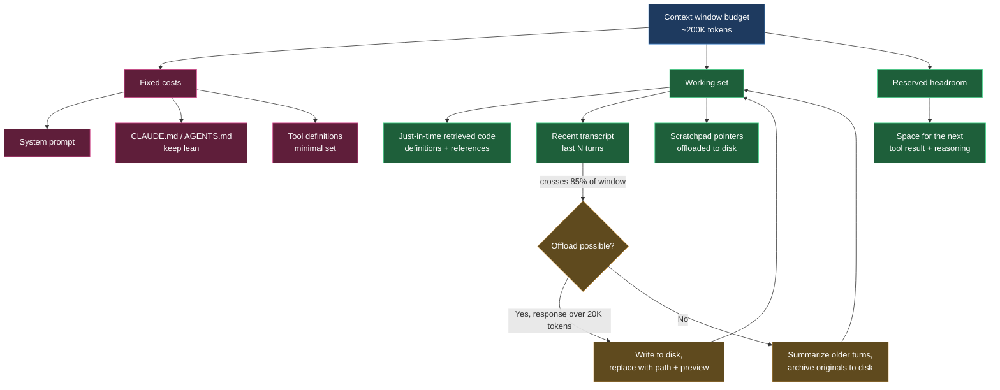
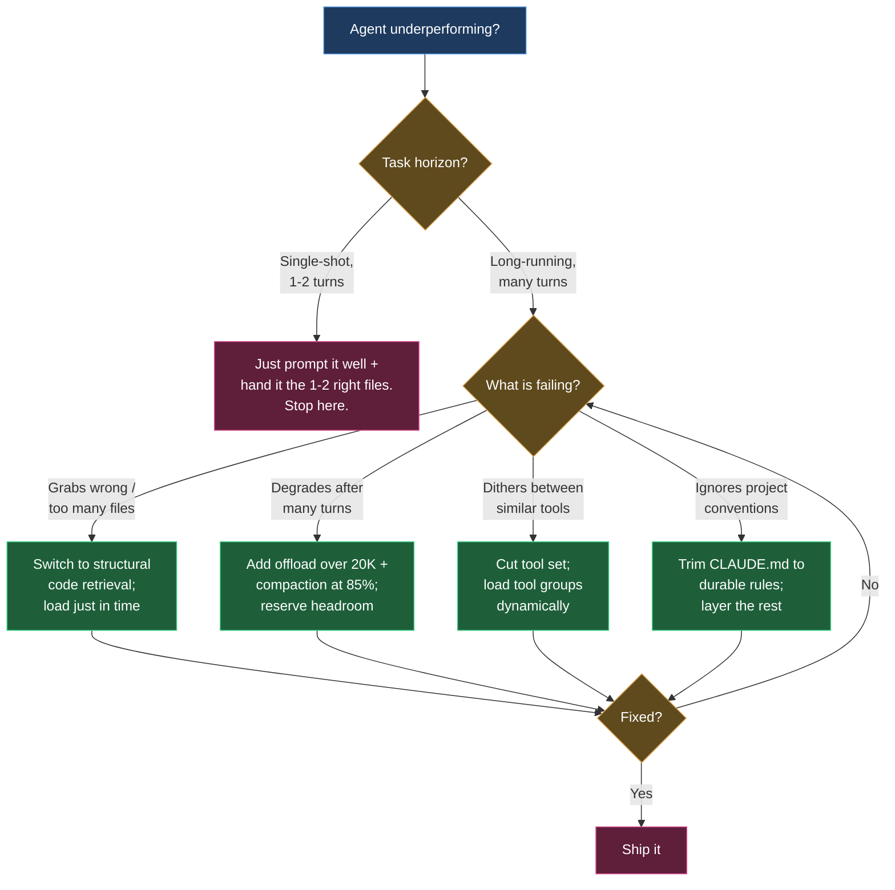

+++
date = '2026-06-16T11:00:00+08:00'
draft = false
title = 'Context Engineering for Coding Agents 2026: What Works'
description = 'Context engineering for coding agents in 2026: why subtracting context beats adding it — Sourcegraph data, offload-before-summarize thresholds, lean CLAUDE.md.'
toc = true
tags = ['Context Engineering', 'AI Coding Agents', 'Context Window', 'Claude Code', 'LLM']
keywords = ['context engineering 2026', 'context engineering for coding agents', 'context window management', 'context engineering vs prompt engineering', 'llm context optimization']

[[params.faqItems]]
question = "What is context engineering for coding agents in 2026?"
answer = "It is the practice of deciding which tokens an AI coding agent sees on every inference call across a long-running loop: what to retrieve, what to compact, what to offload, and what tools to expose. In 2026 it has shifted from 'write good docs' to actively managing a token budget."

[[params.faqItems]]
question = "Does a bigger context window remove the need for context engineering?"
answer = "No. Models degrade well before their advertised limit and hit a wall around 1M tokens regardless of window size. In Sourcegraph's tests a 5K-token targeted retrieval beat a 100K-token summary on the same task. A larger window changes what fits, not what the model attends to."

[[params.faqItems]]
question = "Is embeddings-based RAG the best way to give a coding agent context?"
answer = "For code, structural retrieval usually beats probabilistic embedding search. Returning a symbol's actual definition plus its call sites lifted precision@5 from 0.14 to 0.48 in Sourcegraph benchmarks. Use embeddings for prose, use code intelligence for code."

[[params.faqItems]]
question = "How big should my CLAUDE.md or AGENTS.md be?"
answer = "Small. It is prepended to every turn, so every line is a recurring tax on the context budget. Keep it to durable, project-wide rules and load task-specific detail just in time rather than stuffing everything into one file."
+++

Most of the effort going into coding agents right now is aimed at the wrong layer. Engineers are still A/B-testing prompt wording, growing their instruction files line by line, and packing the window with every file the agent might conceivably need — all on the instinct that a better-briefed agent is a better agent. That instinct is the closest thing context engineering has to a founding myth: more context in, more capability out.

The hardest evidence of 2026 says the opposite. When Sourcegraph benchmarked coding agents on identical tasks, agents handed a 100K-token codebase summary performed *worse* than agents handed 5K tokens of targeted retrieval. Twenty times the context, and the results got worse — not noise-level worse, measurably worse. The pattern isn't a one-off, either: a widely cited industry figure pins 65% of enterprise agent failures on context drift — the model reasoning over the wrong tokens — not on model capability. The bottleneck isn't what your agent could know. It's what it's forced to look at.

I wrote a [theory-first deep dive on context engineering](/posts/ai/2026-02-24-context-engineering-deep-dive/) earlier this year, covering the failure modes and the "specs are the new source code" argument. This one is the field manual, and it argues a single claim start to finish: **the context window is a budget to spend, not a bucket to fill — and the highest-leverage move inside that budget is usually subtraction, not addition.** Most of this article goes to proving that claim, because it's the part almost everyone has backwards.

## What Context Engineering Actually Is: A Budget, Not a Bucket

Two years ago, "context engineering" mostly meant writing good documentation and a decent system prompt. That framing is now dangerously incomplete, because coding agents run *long*: a single Claude Code session can chew through a 12.5-million-line codebase over a seven-hour run, calling tools hundreds of times. Across a loop like that, the context window isn't a briefing you prepare once. It's a live resource that fills up, degrades, and has to be actively managed turn by turn.

So here's the working definition. Context engineering is designing the pipeline that assembles, prunes, and orders every token the model sees on a given inference call — behavioral framing, retrieved code, message history, and tool definitions, all competing for the same finite space. Accept that framing and the interesting questions flip. It's no longer "what should I tell the agent?" It becomes "what should I evict to make room?", "when does this transcript need compacting?", and "is this the cheapest possible representation of what the agent needs to know right now?"

The stakes are documented, not vibes. Anthropic's 2026 Agentic Coding report calls context engineering "the load-bearing skill of 2026" and reports that teams with well-maintained context files ship with 40% fewer errors and complete tasks 55% faster than teams without. In one 2026 survey, 82% of IT and data leaders said prompt engineering alone is no longer sufficient, and 95% called context engineering important for running agents at scale. That's not a hype cycle — that's an industry noticing its agents fail on attention, not intelligence.

## Context Engineering vs Prompt Engineering: One Turn vs the Whole Loop

People still ask whether context engineering vs prompt engineering is just a rebrand. For a single-shot chatbot reply, honestly, the distinction is thin. For a coding agent, it's the whole game.

Prompt engineering optimizes one message — how you phrase a request to get a better answer. It's a craft applied to a single turn. But watch what actually lands in an agent's transcript: it reads a file and 800 lines arrive, it runs the tests and 5,000 lines of stack traces arrive, it greps the codebase and 40 matches arrive. Nobody wrote a "prompt" for any of that. It accumulated. Deciding what stays, what gets summarized, and what gets written to disk and referenced by path — that's context engineering, and no amount of prompt-crafting touches it.

The cleanest way to hold the relationship: prompt engineering is a subset of context engineering. The prompt is one slice of the token budget; context engineering owns the whole budget and how it evolves. That framing also hands you a free diagnostic — if your agent nails turn one and falls apart by turn thirty, you don't have a prompt problem. You have a context-management problem.

## Why Subtracting Context Beats Adding It

Here's how most teams I've watched "do context engineering": they write an ever-longer AGENTS.md, and they wire an embeddings index over the whole repo. Look at those two moves for a second. Both are *additions*. Both feel productive. And the best evidence of 2026 — context-rot studies, Sourcegraph's retrieval benchmarks, the compaction playbooks inside production frameworks — says the real leverage runs the other way: remove tokens, or better, never admit them in the first place.

That's the counterintuitive core of this whole discipline, so it gets the bulk of the article. Four bodies of evidence, from "why addition hurts" to "how to subtract without losing anything."

> As of 2026, the strongest measured results in context engineering are subtractive: in Sourcegraph's benchmarks, 5K tokens of targeted retrieval beat a 100K-token summary on identical coding tasks, and structural code retrieval lifted precision@5 from 0.140 to 0.478 over a grep-based baseline.

### Context rot is physics, not a bug you can prompt around

Adding context has a cost curve, and it bends down. Context rot is real and measured across every major model family: as input length grows, accuracy on even simple tasks degrades, and a single irrelevant distractor can measurably drop precision. Worse, models hit a wall around 1M tokens regardless of their advertised window size. A 1M-token window is a capacity ceiling, not a target.

Sit with what that implies. Past the point of relevance, every additional token has *negative* expected value — each "maybe relevant" file you pre-load is a lottery ticket whose prize is a distracted model. The instinct to stuff the window "to be safe" runs exactly backwards: you're not buying insurance, you're paying for degraded attention. Once you accept that the marginal token can hurt, "what can I leave out?" stops being an optimization and becomes the first question you ask.

### Precision beats volume, and the gap isn't close

The Sourcegraph result from the opening deserves a closer look, because the mechanism matters. On identical tasks, the 100K-token summary didn't give the model more to work with — it gave the model more to get distracted by. The 5K targeted retrieval won because everything in it was load-bearing. Volume lost to precision at a 20-to-1 handicap.

The practical translation is just-in-time retrieval. Instead of front-loading a guess about what the agent needs, give it the ability to fetch what it needs when it needs it. A one-line file reference plus a tool to read it costs almost nothing until the agent actually decides that file is relevant. Anthropic's structured note-taking pattern runs on the same principle — the agent writes a scratchpad to a file *outside* the context window and re-reads it on demand, keeping long-term memory off the token budget until the moment it's needed.

And when the agent does fetch, *how* it fetches decides everything. The misconception that costs teams the most is that embeddings-based RAG is the right way to feed a coding agent. For prose, sure. But code has structure — definitions, references, call graphs — and retrieval that understands that structure crushes retrieval that treats source files as bags of tokens. Sourcegraph's numbers make the gap concrete: baseline grep-and-read retrieval scored file recall of 0.127 and precision@5 of 0.140; swapping in code-intelligent retrieval — a symbol's actual definition plus its call sites — lifted file recall to 0.277 and precision@5 to 0.478. More than triple the precision, from changing what gets retrieved, not how much.

The downstream effects are wild. One Kubernetes task went from a two-hour timeout to an 89-second success. A cross-file refactor dropped from 84 minutes across 96 tool calls to 4.4 minutes across 5. Read those tool-call counts again: 96 versus 5. That's the deepest part of the subtraction argument — precision doesn't just improve answers, it collapses the number of turns, and fewer turns means less junk accumulating in the transcript, which keeps the window clean for the turns that remain. Precision compounds. So does bloat, in the wrong direction: every junk token you admit today feeds a confused turn that generates more junk tomorrow.

### When you do cut, cut losslessly: offload before you summarize

Run an agent long enough and no amount of clever retrieval stops the transcript from filling. Subtraction becomes mandatory — the question is how to do it without destroying information. By 2026 the production frameworks have converged on a playbook with explicit thresholds, and LangChain's Deep Agents is the cleanest example. Any single tool response over 20,000 tokens gets offloaded to the filesystem, replaced in-context by a file path plus a ten-line preview. When the session crosses 85% of the window, older tool calls get truncated into pointers to their on-disk content. Only when offloading isn't enough does it summarize — generating a structured summary of session intent, artifacts, and next steps, while writing the original messages to disk as the canonical record.

The ordering is the lesson: **offload before you summarize.** Offloading is lossless subtraction — the content still exists, you just reference it by path. Summarization is lossy, and its failure mode is nasty: the summary silently drops the one constraint that mattered, and the agent wanders off-objective three turns later without anyone noticing why. If you compact, make needle-in-a-haystack recovery testable — can the agent still dig up the detail you summarized away when it turns out to need it? If not, you compacted too hard.

### Subtract the standing overhead: tools and CLAUDE.md

Everything so far was about the working set. But two line items sit in the window on *every single turn*, which makes them the highest-yield place to cut.

First, tools. Every tool definition you expose occupies context on every turn, and every near-duplicate tool forces the model to burn a turn deciding between them. This isn't a rounding error — bloated tool sets with conflicting assumptions are a documented source of wasted turns and confused agents. My rule: expose the smallest set of unambiguous tools that covers the task, and load tool groups dynamically rather than mounting every [MCP server](/posts/ai/2026-02-20-mcp-protocol-guide/) you own at once. When your agent is writing backend code, a Figma tool in scope is pure tax. Fewer, sharper tools beat a comprehensive API wrapper every time.

Second, the instruction file. Because [CLAUDE.md and AGENTS.md](/posts/ai/2026-02-28-claude-code-claudemd-guide/) are prepended to every turn, they're the most over-indulged line item in most teams' budget. I regularly see 400-line CLAUDE.md files that re-explain the entire architecture — every one of those lines taxed on every turn, forever, whether or not the current task touches that subsystem. The lean principle: keep only durable, project-wide rules in the always-loaded file — conventions, hard constraints, the handful of "never do this" rules — and push everything task-specific out to files the agent loads just in time. A short root file that says "auth logic lives in `src/auth/`, read `src/auth/README.md` before touching it" is worth more than 200 lines re-describing an auth flow that matters for one task in twenty. I go deeper in my [CLAUDE.md memory guide](/posts/ai/2026-01-12-claudemd-memory-guide/), and the same layering underpins durable [agent memory systems](/posts/ai/2026-02-21-ai-agent-memory-systems/): the always-on layer stays tiny, the retrievable layer holds the bulk.

## Context Window Management: Allocate, Reserve, Compact

If subtraction is the strategy, budgeting is the bookkeeping. The context window is a budget with line items, and your job is allocation: every token spent on a stale stack trace is a token unavailable for the file the agent actually needs to edit. Here's the allocation and the compaction loop in one picture:

The practical discipline has three parts. Know your fixed costs — they're pure overhead, so minimize them. Keep the working set precise — retrieved just in time, evicted when stale. And always reserve headroom, because an agent that runs its window to 99% full has no room to think: the next big tool result forces a panicked compaction at exactly the wrong moment.

## The Pseudo-Techniques That Feel Like Progress

Some of the most confident advice in 2026 is quietly counterproductive, and all of it shares one trait: it's additive. Three practices to drop, each already indicted by the evidence above.

**Maxing out the context window "to be safe."** That's paying the context-rot tax for nothing — degraded attention, measured across every major model family, in exchange for insurance that doesn't exist.

**Embedding your whole repo into a vector DB and calling it context engineering.** For code, this under-performs structural retrieval by roughly 3x on precision, and it adds infrastructure you now have to keep in sync with a moving codebase. Unless you're retrieving over prose docs, a code-intelligence tool is the better default.

**Compacting on a fixed schedule regardless of state.** Summarizing every N turns "to keep things tidy" throws away detail the agent may still need, and introduces goal-drift risk for zero benefit when the window is only 30% full. Compact when the budget demands it, not on a timer.

The honest trade-off cuts the other way too: none of this machinery is worth it for short, single-shot tasks. If the job is "add a null check to this one function," a plain prompt with that one file beats any retrieval pipeline, compaction scheme, or memory system. Context engineering is a discipline for long-horizon agents; on a two-turn task, it's pure overhead. Match the ceremony to the horizon.

## Which Fix for Which Failure

Here's the decision tree I actually use when an agent is underperforming and I need to figure out which lever to pull:

Notice what the tree never says: "add more context." Every fix on it is a subtraction or a sharpening — tighter retrieval, offloading, a smaller tool set, a trimmed CLAUDE.md. Diagnose the specific failure, apply the one technique that targets it, verify, and stop. Don't bolt on a vector DB, a summarization pipeline, and a 300-line AGENTS.md all at once and hope — each answers a *different* failure, and applied to the wrong one they add cost without fixing anything.

## What to Take Away

If you run coding agents in 2026, treat the context window as a budget and default to subtraction: retrieve just in time, prefer structural retrieval for code, offload before you summarize, keep your tool set and your CLAUDE.md lean, and always reserve headroom. Resist the three additive pseudo-techniques — maxing the window, RAG-ing your whole repo, compacting on a timer. And calibrate to the horizon: on a one-off edit, none of this applies; on a seven-hour agent run, all of it does. The model will keep getting better. The token budget will always be finite, and knowing what to leave out of it is the skill that separates an agent that ships from one that spins.

## Related Reading

- [Context Engineering Deep Dive: The Most Underrated Core Skill](/posts/ai/2026-02-24-context-engineering-deep-dive/) — the theory and failure modes behind this field guide
- [CLAUDE.md Memory Guide](/posts/ai/2026-01-12-claudemd-memory-guide/) — how to structure the always-loaded context file
- [Claude Code CLAUDE.md Guide](/posts/ai/2026-02-28-claude-code-claudemd-guide/) — practical CLAUDE.md/AGENTS.md organization
- [AI Agent Memory Systems](/posts/ai/2026-02-21-ai-agent-memory-systems/) — persistent memory beyond the context window
- [MCP Protocol Complete Guide](/posts/ai/2026-02-20-mcp-protocol-guide/) — connecting tools without bloating context

External sources: [Anthropic 2026 Agentic Coding report summary](https://www.claudeainews.com/news/anthropic-2026-agentic-coding-report), [Sourcegraph: Context Engineering — A Practical Guide](https://sourcegraph.com/blog/context-engineering), [LangChain: Context Management for Deep Agents](https://www.langchain.com/blog/context-management-for-deepagents), [Context Engineering for AI Agents in Open-Source Software (arXiv)](https://arxiv.org/html/2510.21413v1).
