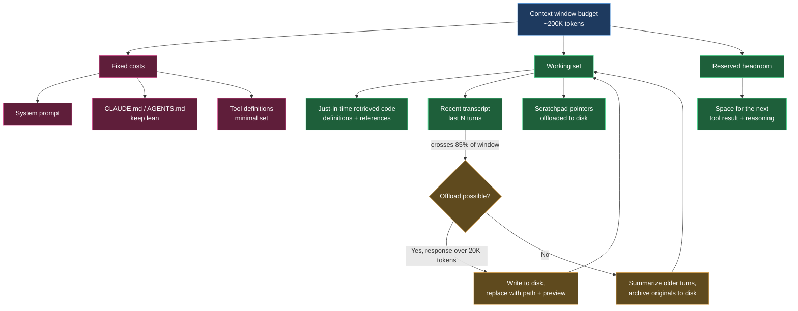
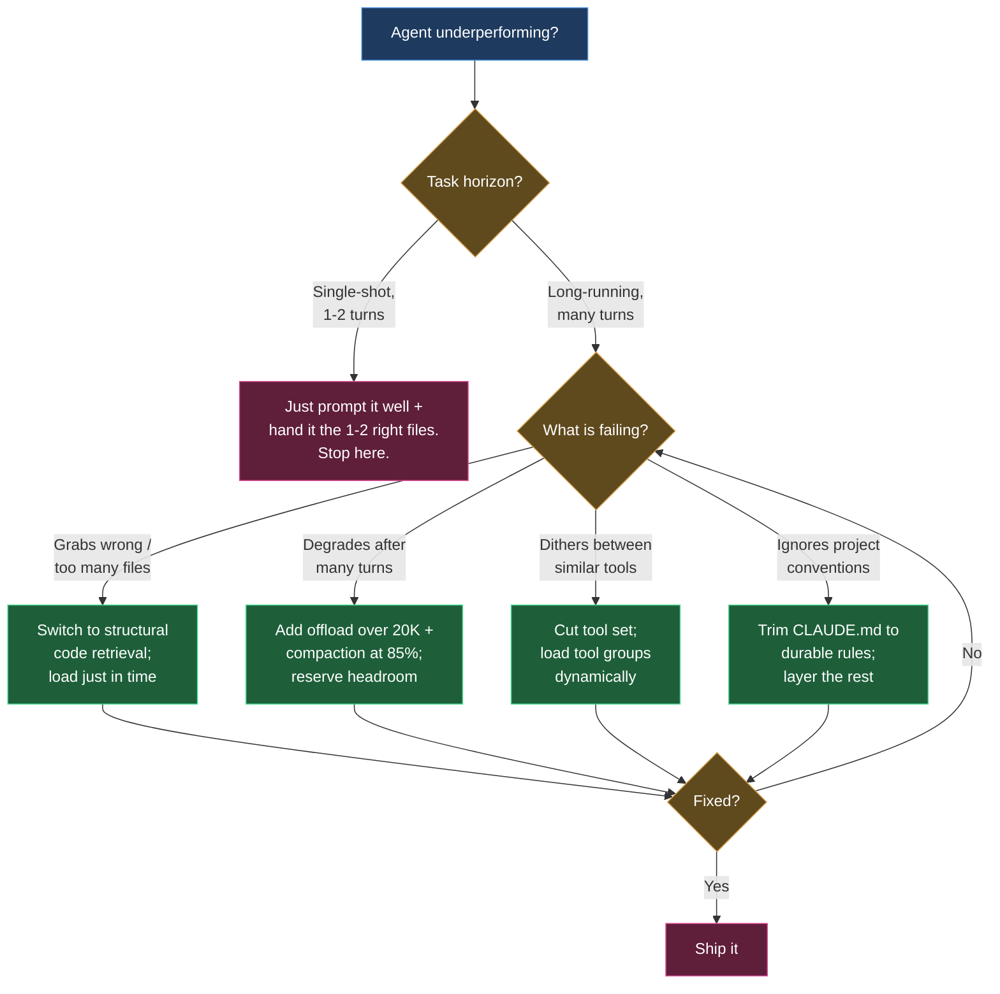

+++
date = '2026-06-16T11:00:00+08:00'
draft = false
title = 'Context Engineering for Coding Agents 2026: What Works'
description = 'A 2026 field guide to context engineering for AI coding agents: budget the context window, retrieve precisely, keep CLAUDE.md lean, skip the pseudo-techniques.'
toc = true
tags = ['Context Engineering', 'AI Coding Agents', 'Context Window', 'Claude Code', 'LLM']
keywords = ['context engineering 2026', 'context engineering for coding agents', 'context window management', 'context engineering vs prompt engineering', 'llm context optimization']

[[params.faqItems]]
question = "What is context engineering for coding agents in 2026?"
answer = "It is the practice of deciding which tokens an AI coding agent sees on every inference call across a long-running loop: what to retrieve, what to compact, what to offload, and what tools to expose. In 2026 it has shifted from 'write good docs' to actively managing a token budget."

[[params.faqItems]]
question = "Does a bigger context window remove the need for context engineering?"
answer = "No. Models degrade well before their advertised limit and hit a wall around 1M tokens regardless of window size. In Sourcegraph's tests a 5K-token targeted retrieval beat a 100K-token summary on the same task. A larger window changes what fits, not what the model attends to."

[[params.faqItems]]
question = "Is embeddings-based RAG the best way to give a coding agent context?"
answer = "For code, structural retrieval usually beats probabilistic embedding search. Returning a symbol's actual definition plus its call sites lifted precision@5 from 0.14 to 0.48 in Sourcegraph benchmarks. Use embeddings for prose, use code intelligence for code."

[[params.faqItems]]
question = "How big should my CLAUDE.md or AGENTS.md be?"
answer = "Small. It is prepended to every turn, so every line is a recurring tax on the context budget. Keep it to durable, project-wide rules and load task-specific detail just in time rather than stuffing everything into one file."
+++

Here is the uncomfortable truth about coding agents in 2026: the model is rarely the bottleneck. What decides whether Claude Code, Codex, or Cursor lands a clean multi-file refactor or spins for an hour is what you put in front of it. Anthropic's 2026 Agentic Coding report calls context engineering "the load-bearing skill of 2026," and the numbers back it up — teams with well-maintained context files ship with 40% fewer errors and complete tasks 55% faster than teams without.

I wrote a [theory-first deep dive on context engineering](/posts/ai/2026-02-24-context-engineering-deep-dive/) earlier this year, covering the failure modes and the "specs are the new source code" argument. This article is the opposite: the 2026 field manual for people who actually run coding agents. What techniques move the needle, what data proves it, and which popular practices are pseudo-work that quietly makes your agent worse. My core claim is simple: **stop treating the context window as a bucket to fill, and start treating it as a budget to spend.**

## Context Engineering in 2026: From Writing Docs to Managing a Budget

Two years ago, "context engineering" mostly meant writing good documentation and a decent system prompt. That framing is now dangerously incomplete. The defining shift of 2026 is that coding agents run *long*: a single Claude Code session can chew through a 12.5-million-line codebase over a seven-hour run, calling tools hundreds of times. Across that loop, the context window is not a static briefing you prepare once — it is a live resource that fills up, degrades, and has to be actively managed turn by turn.

That reframes the whole discipline. Context engineering is the practice of designing the pipeline that assembles, prunes, and orders every token the model sees on a given inference call — behavioral framing, retrieved code, message history, and tool definitions all competing for the same finite space. The moment you accept that framing, the important questions change. It is no longer "what should I tell the agent?" It becomes "what should I evict to make room?", "when does this transcript need compacting?", and "is this the cheapest possible representation of what the agent needs to know right now?"

The industry has felt this shift viscerally. In one 2026 survey, 82% of IT and data leaders said prompt engineering alone is no longer sufficient, and 95% called context engineering important for running agents at scale. That is not hype cycling — it is the recognition that a coding agent's failure mode is almost never "the model couldn't reason." It is "the model was reasoning over the wrong 40,000 tokens." One widely cited figure puts 65% of enterprise agent failures on context drift rather than model capability.

## Context Engineering vs Prompt Engineering: Why It Matters for Agents

People still ask whether context engineering vs prompt engineering is just rebranding. For a single-shot chatbot reply, honestly, the distinction is thin. For a coding agent, it is the whole game.

Prompt engineering optimizes one message: how you phrase a request to get a better answer. It is a craft applied to a single turn. Context engineering manages the entire information environment across the *loop* — and a coding agent's loop is where all the interesting failures live. The agent reads a file, that file's 800 lines land in the transcript, it runs the tests, 5,000 lines of stack traces land in the transcript, it greps the codebase, 40 matches land in the transcript. Nobody wrote a "prompt" for any of that. It accumulated. Managing that accumulation — deciding what stays, what gets summarized, what gets written to disk and referenced by path — is context engineering, and no amount of prompt-crafting touches it.

The cleanest way to hold the relationship: prompt engineering is a subset of context engineering. The prompt is one slice of the token budget; context engineering owns the whole budget and its evolution over time. If your agent works great on turn one and falls apart by turn thirty, you do not have a prompt problem. You have a context-management problem, and the rest of this article is about the techniques that fix it.

## The Techniques That Actually Move the Needle

I have watched a lot of teams "do context engineering" by writing an ever-longer AGENTS.md and wiring up an embeddings index over their whole repo. Both feel productive. Neither is where the leverage is. Here are the four techniques with real data behind them.

### 1. Just-in-time retrieval beats dumping the codebase

The single most common mistake is front-loading: shoving as many "maybe relevant" files as possible into context so the agent "has everything it needs." This actively hurts. Sourcegraph's 2026 benchmarks are blunt about it — agents performed *worse* with 100K-token summaries than with 5K-token targeted retrieval on identical tasks. The larger context did not give the model more to work with; it gave the model more to get distracted by.

The fix is just-in-time loading: give the agent the ability to fetch what it needs when it needs it, rather than pre-loading a guess. A one-line file reference plus a tool to read it costs almost nothing until the agent actually decides the file is relevant. This is the same principle behind Anthropic's structured note-taking pattern — the agent writes a scratchpad to a file *outside* the context window and re-reads it on demand, keeping long-term memory off the token budget until it is actually needed.

### 2. Structural code retrieval beats embeddings

Here is the misconception that costs teams the most: that RAG with embeddings is the right way to feed a coding agent. For prose, sure. For code, probabilistic text retrieval is the wrong tool. Code has structure — definitions, references, call graphs — and retrieval that understands that structure crushes retrieval that treats source files as bags of tokens.

The Sourcegraph numbers make the gap concrete. Baseline grep-and-read retrieval scored file recall of 0.127 and precision@5 of 0.140. Swapping in code-intelligent retrieval — returning a symbol's actual definition plus its call sites — lifted file recall to 0.277 and precision@5 to 0.478, more than tripling precision. That is not an academic delta. On one Kubernetes task it turned a two-hour timeout into an 89-second success, and a cross-file refactor dropped from 84 minutes across 96 tool calls to 4.4 minutes across 5. Precise retrieval does not just improve answers; it collapses the number of turns, which in turn keeps the context window clean. Precision compounds.

### 3. Compaction and offloading for long-running agents

Once an agent runs long enough, no amount of clever retrieval stops the transcript from filling. This is where compaction and offloading earn their keep, and 2026's production frameworks have converged on a clear playbook with explicit thresholds. LangChain's Deep Agents, for example, offloads any single tool response over 20,000 tokens to the filesystem, replacing it in-context with a file path plus a ten-line preview. When the session crosses 85% of the window, it truncates older tool calls into pointers to their on-disk content. Only when offloading is not enough does it summarize — generating a structured summary of session intent, artifacts, and next steps, while writing the original messages to disk as a canonical record.

The ordering there is deliberate and worth stealing: **offload before you summarize.** Offloading is lossless — the content still exists, you just reference it by path — while summarization is lossy and risks goal drift. The real hazard of aggressive compaction is that a summary silently drops the one constraint that mattered, and the agent wanders off-objective three turns later. If you compact, you need needle-in-a-haystack recovery to be testable: can the agent still retrieve the detail you summarized away when it turns out to need it? If not, you compacted too hard.

### 4. Tool minimalism

Every tool definition you expose sits in the context window on every turn, and every near-duplicate tool forces the model to burn a turn deciding between them. This is not a rounding error. Bloated tool sets with conflicting assumptions are a documented source of wasted turns and confused agents. My rule: expose the smallest set of unambiguous tools that covers the task, and load tool groups dynamically rather than mounting every [MCP server](/posts/ai/2026-02-20-mcp-protocol-guide/) you own at once. When your agent is writing backend code it does not need a Figma tool in scope; the definition is pure tax. Fewer, sharper tools beat a comprehensive API wrapper every time.

## Context Window Management: Budget It, Don't Fill It

If you internalize one mental model from this article, make it this one: the context window is a budget with line items, and your job is allocation. Every token spent on a stale stack trace is a token not available for the file the agent actually needs to edit. Here is how I think about the allocation and the compaction loop:

The practical discipline: know your fixed costs (they are pure overhead, so minimize them), keep the working set precise (retrieved just in time, evicted when stale), and always reserve headroom so the next tool result and the model's reasoning have room to land. An agent that runs its window to 99% full has no room to think — the next big tool result forces a panicked compaction at exactly the wrong moment.

## Organizing CLAUDE.md and AGENTS.md: Lean, Layered, Just-in-Time

Because [CLAUDE.md and AGENTS.md](/posts/ai/2026-02-28-claude-code-claudemd-guide/) are prepended to every single turn, they are the most over-indulged line item in most teams' budget. I regularly see 400-line CLAUDE.md files that re-explain the entire architecture. Every one of those lines is taxed on every turn, forever, whether or not the current task touches that subsystem.

The lean principle: put only durable, project-wide rules in the always-loaded file — conventions, hard constraints, the handful of "never do this" rules that apply everywhere. Push everything task-specific out to files the agent loads just in time. A short root file that says "auth logic lives in `src/auth/`, read `src/auth/README.md` before touching it" is worth more than 200 lines re-describing the auth flow that only matters for one task in twenty. I go deeper on structuring these files in my [CLAUDE.md memory guide](/posts/ai/2026-01-12-claudemd-memory-guide/), and the same layering logic underpins durable [agent memory systems](/posts/ai/2026-02-21-ai-agent-memory-systems/) — the always-on layer stays tiny, the retrievable layer holds the bulk.

## The Pseudo-Needs: What to Stop Doing

Some of the most confident advice in 2026 is quietly counterproductive. Three practices I would tell you to drop:

**Maxing out the context window "to be safe."** The instinct that more context is safer is exactly backwards. Context rot is real and measured across every major model family: as input length grows, accuracy on even simple tasks degrades, and a single distractor can measurably drop precision. A 1M-token window is a capacity ceiling, not a target. Fill it and you are paying for degraded attention.

**Embedding your whole repo into a vector DB and calling it context engineering.** For code, this under-performs structural retrieval by roughly 3x on precision, as the numbers above show, and it adds infrastructure you then have to keep in sync with a moving codebase. Unless you are retrieving over prose docs, a code-intelligence tool is the better default.

**Compacting on a fixed schedule regardless of state.** Summarizing every N turns "to keep things tidy" throws away detail the agent may need and introduces goal-drift risk for no benefit when the window is only 30% full. Compact when the budget demands it, not on a timer.

The honest trade-off cuts the other way too: none of this is worth it for short, single-shot tasks. If the job is "add a null check to this one function," a plain prompt with that one file beats any retrieval pipeline, compaction scheme, or memory system. Context engineering is a discipline for long-horizon agents. On a two-turn task, the machinery is pure overhead. Match the ceremony to the horizon.

## A Decision Framework: Which Technique When

Here is the decision tree I actually use when an agent is underperforming and I need to figure out which lever to pull:

The framework encodes the whole argument: diagnose the specific failure, apply the one technique that targets it, verify, and stop. Do not bolt on a vector DB, a summarization pipeline, and a 300-line AGENTS.md all at once and hope. Each of those is an answer to a *different* failure, and applied to the wrong one they add cost without fixing anything.

## What to Take Away

If you run coding agents in 2026, treat the context window as a budget and manage it actively: retrieve just in time, prefer structural retrieval for code, offload before you summarize, keep your tool set and your CLAUDE.md lean, and always reserve headroom. Resist the three pseudo-needs — maxing the window, RAG-ing your whole repo, and compacting on a timer. And calibrate to the horizon: on a one-off edit, none of this applies; on a seven-hour agent run, all of it does. The model will keep getting better. The token budget will always be finite, and knowing how to spend it is the skill that separates an agent that ships from one that spins.

## Related Reading

- [Context Engineering Deep Dive: The Most Underrated Core Skill](/posts/ai/2026-02-24-context-engineering-deep-dive/) — the theory and failure modes behind this field guide
- [CLAUDE.md Memory Guide](/posts/ai/2026-01-12-claudemd-memory-guide/) — how to structure the always-loaded context file
- [Claude Code CLAUDE.md Guide](/posts/ai/2026-02-28-claude-code-claudemd-guide/) — practical CLAUDE.md/AGENTS.md organization
- [AI Agent Memory Systems](/posts/ai/2026-02-21-ai-agent-memory-systems/) — persistent memory beyond the context window
- [MCP Protocol Complete Guide](/posts/ai/2026-02-20-mcp-protocol-guide/) — connecting tools without bloating context

External sources: [Anthropic 2026 Agentic Coding report summary](https://www.claudeainews.com/news/anthropic-2026-agentic-coding-report), [Sourcegraph: Context Engineering — A Practical Guide](https://sourcegraph.com/blog/context-engineering), [LangChain: Context Management for Deep Agents](https://www.langchain.com/blog/context-management-for-deepagents), [Context Engineering for AI Agents in Open-Source Software (arXiv)](https://arxiv.org/html/2510.21413v1).
