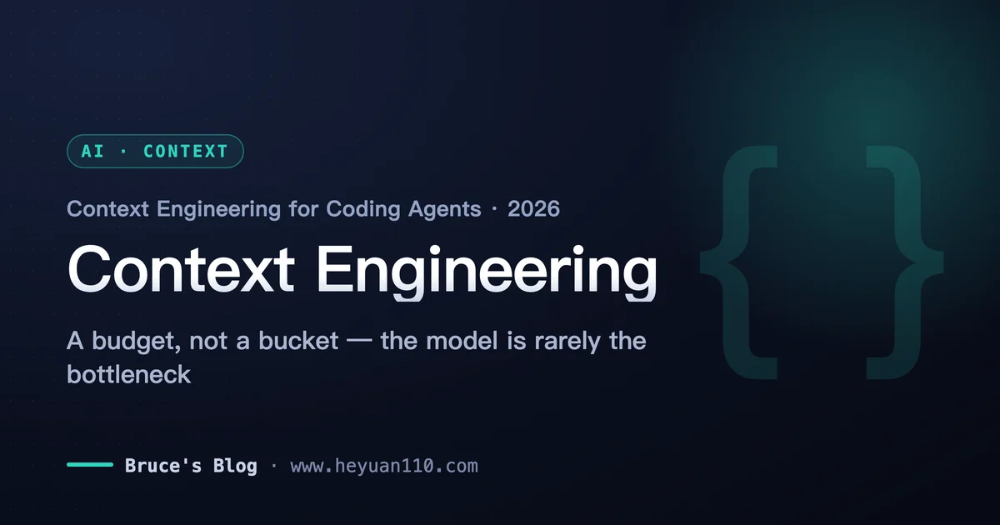
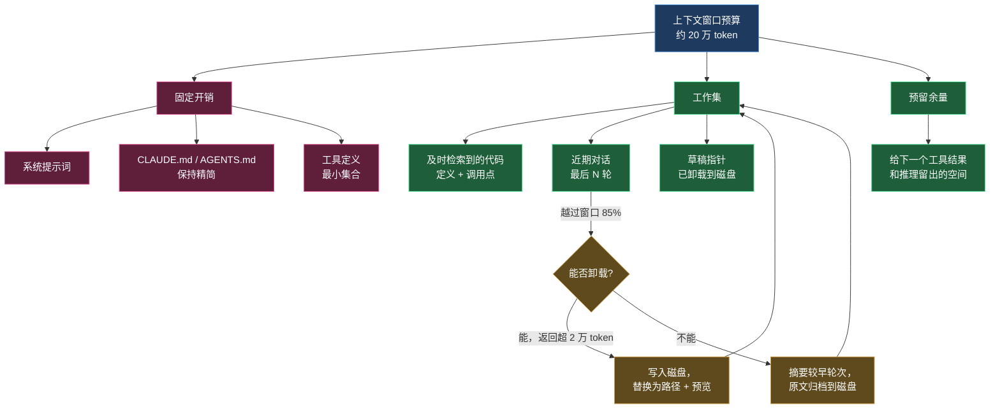
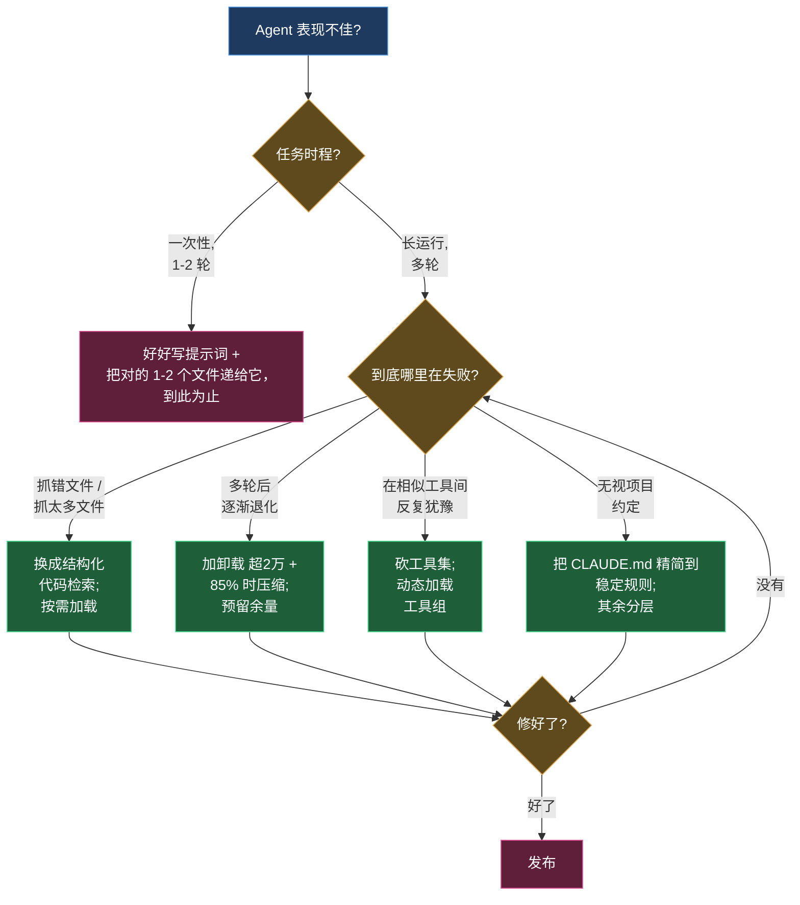

+++
date = '2026-06-16T11:00:00+08:00'
draft = false
title = '上下文工程 2026：编码 Agent 该做减法而不是加法'
description = '上下文工程 2026 实战：为什么删上下文比加上下文更有效——Sourcegraph 同任务实测 5K 精准检索打败 100K 摘要，precision@5 从 0.14 升到 0.48。附先卸载再摘要的阈值打法、工具极简与 CLAUDE.md 精简原则。'
toc = true
tags = ['Context Engineering', 'AI Coding Agents', 'Context Window', 'Claude Code', 'LLM']
keywords = ['上下文工程 2026', 'context engineering', '编码 agent 上下文', '上下文窗口管理', '上下文压缩']

[[params.faqItems]]
question = "2026 年面向编码 Agent 的上下文工程到底指什么？"
answer = "指在一个长时间运行的 Agent 循环里，决定模型每一次推理看到哪些 token：检索什么、压缩什么、卸载什么、暴露哪些工具。2026 年它已经从「写好文档」变成「主动管理一份 token 预算」。"

[[params.faqItems]]
question = "上下文窗口更大是不是就不需要上下文工程了？"
answer = "不是。模型在远未达到标称上限时就开始退化，接近 100 万 token 时会撞墙。Sourcegraph 的测试里，5K token 的精准检索在同一任务上打败了 100K token 的摘要。更大的窗口只改变「装得下什么」，不改变「模型真正注意什么」。"

[[params.faqItems]]
question = "给编码 Agent 喂上下文，向量检索 RAG 是最好的方式吗？"
answer = "对代码来说通常不是。结构化检索（返回符号的定义和调用点）往往优于概率式的向量检索——在 Sourcegraph 基准里 precision@5 从 0.14 提升到 0.48。散文用向量检索，代码用代码智能检索。"

[[params.faqItems]]
question = "我的 CLAUDE.md 或 AGENTS.md 应该写多大？"
answer = "越小越好。它会被拼接进每一轮对话，所以每一行都是对 token 预算持续征收的税。只放全项目通用的稳定规则，把任务相关的细节做成按需加载，而不是全塞进一个文件。"
+++

现在大多数人调教编码 Agent 的功夫，都花在了错误的层面上。抠 prompt 措辞、把指令文件越写越长、把「可能用得上」的文件统统塞进窗口——背后是同一个直觉：喂得越饱，Agent 越强。这几乎是上下文工程（context engineering）的创世神话。

2026 年最硬的证据说的恰恰相反。Sourcegraph 在完全相同的任务上跑基准：拿着 100K token 代码库摘要的 Agent，表现比拿着 5K token 精准检索的**更差**。上下文多了二十倍，结果反而变差——不是误差级的差，是可测量的差。

这也不是孤例。一个被广泛引用的行业数字：企业 Agent 失败中 65% 源于上下文漂移——模型在错误的 token 上推理——而不是模型能力。瓶颈从来不是 Agent 能知道什么，而是它被迫盯着什么。

今年早些时候我写过一篇[偏理论的上下文工程深潜](/zh/posts/ai/2026-02-24-context-engineering-deep-dive/)，讲失效模式和「Specs 是新的源代码」那套论证。这篇是实战手册，从头到尾只论证一件事：**上下文窗口是一份要花的预算，不是一个要装满的桶——而预算里杠杆最大的动作，通常是减法，不是加法**。本文大部分篇幅都用来证明它，因为这恰恰是几乎所有人搞反的地方。

## 上下文工程到底是什么：一份预算，不是一个桶

两年前，「上下文工程」大体就是写好文档、写个像样的系统提示词。这个理解现在已经危险地过时了，因为编码 Agent 跑得**很长**：一次 Claude Code 会话能在七个小时里啃完一个 1250 万行的代码库，调用工具几百次。

在这样的循环里，上下文窗口不是你一次性准备好的简报。它是一份会不断被填满、会退化、必须一轮一轮主动管理的实时资源。

所以给个工作定义：上下文工程是设计一条流水线，去组装、修剪、排序模型在某一次推理调用中看到的每一个 token——行为设定、检索到的代码、历史消息、工具定义，全在争夺同一块有限空间。

接受这个框架，重要的问题就换了一批。不再是「我该告诉 Agent 什么」，而是「我该逐出什么来腾地方」「这段对话什么时候该压缩」「这是不是 Agent 此刻所需信息的最省 token 表示」。

赌注是有数据背书的，不是感觉。Anthropic 2026 年的 Agentic Coding 报告把上下文工程称为「2026 年的承重技能」，并给出：维护良好上下文文件的团队，出错率低 40%，任务完成速度快 55%。2026 年一份调查里，82% 的 IT 与数据负责人认为单靠提示词工程已经不够，95% 认为上下文工程对规模化跑 Agent 很重要。

这不是概念炒作。这是整个行业发现：自家 Agent 输在注意力上，不是输在智力上。

## 上下文工程 vs 提示词工程：单轮手艺 vs 整个循环

还是有人问，上下文工程和提示词工程是不是换个说法而已。对一次性的聊天回复，说实话，区别很薄；对编码 Agent，这就是全部。

提示词工程优化的是一条消息：怎么措辞才能拿到更好的回答，是施加在单轮上的手艺。但看看 Agent 对话里真正落进来的是什么：读一个文件，800 行进来了；跑一次测试，5000 行堆栈进来了；grep 一把代码库，40 个匹配进来了。

这些没有一个是谁「写的提示词」，它们是堆积出来的。决定什么留下、什么被摘要、什么写到磁盘只留一个路径引用——这就是上下文工程，再怎么打磨提示词也碰不到它。

关系一句话说清：提示词工程是上下文工程的子集。这个框架还附送一个免费诊断——你的 Agent 第一轮很稳、第三十轮崩掉，那不是提示词问题，是上下文管理问题。

## 为什么删上下文比加上下文更有效

我见过的大多数团队「做上下文工程」就两个动作：把 AGENTS.md 越写越长，给整个仓库挂向量索引。盯着这两个动作看一秒——都是**加法**，都让人觉得很有生产力。

而 2026 年最好的证据——上下文腐烂研究、Sourcegraph 的检索基准、生产框架里的压缩打法——全都指向反方向：真正的杠杆是删掉 token，或者更好，压根别让它进来。

这是整门学科最反直觉的内核，所以它吃掉本文大部分篇幅。四组证据，从「加法为什么有害」一路讲到「怎么删而不丢信息」。

> 截至 2026 年，上下文工程里最硬的实测结果都在减法方向：Sourcegraph 基准中，5K token 精准检索在相同编码任务上打败了 100K token 摘要；结构化代码检索把 precision@5 从 0.140 提升到 0.478。

### 上下文腐烂是物理规律，不是能用提示词绕过的 bug

加上下文的成本曲线是向下弯的。上下文腐烂（context rot）真实存在，且在每个主流模型家族上都被测量过：输入越长，连简单任务的准确率都会退化；一个无关干扰项就能让精度明显下降。

更糟的是，不管标称窗口多大，模型都会在 100 万 token 附近撞墙。100 万 token 的窗口是容量上限，不是目标。

想清楚这意味着什么：过了相关性那个点，每个多塞进来的 token 期望价值是**负的**——每个「可能相关」的预加载文件，都是一张奖品为「模型分心」的彩票。

「为了保险多塞点」这个直觉完全是反的：你买的不是保险，是打了折的注意力。一旦接受「多余的 token 会伤人」，「我能删掉什么」就不再是可做可不做的优化，而是第一个要问的问题。

### 精度打败体积，而且不是险胜

开头那个 Sourcegraph 结果值得拆开看，因为机制才是重点。100K 摘要没有给模型更多可用信息，只给了更多可分心的东西；5K 精准检索赢，是因为里面每个 token 都在承重。体积让了二十倍的先手，还是输给了精度。

落地做法是及时检索：不预加载一堆猜测，给 Agent 在需要时去取的能力。一行文件引用加一个读取工具，在 Agent 真正判定这个文件相关之前，几乎零成本。

Anthropic 的结构化笔记模式是同一个原理——Agent 把草稿写到上下文窗口**之外**的文件里，需要时再读回来，长期记忆在真正用到之前不占 token 预算。

而 Agent 去取的时候，怎么取决定一切。让团队损失最大的误解是：给编码 Agent 喂上下文，用向量 RAG 就对了。散文可以，代码不行——代码有结构：定义、引用、调用图。理解这种结构的检索，会碾压把源文件当 token 袋子的检索。

Sourcegraph 的数字把差距钉死了。基线的 grep+读取检索，文件召回率 0.127、precision@5 是 0.140；换成代码智能检索——返回符号的实际定义加它的调用点——召回率升到 0.277，precision@5 升到 0.478。精度翻了三倍多，改的只是取**什么**，不是取多少。

下游效果更夸张：一个 Kubernetes 任务从两小时超时变成 89 秒成功；一次跨文件重构从 84 分钟、96 次工具调用，降到 4.4 分钟、5 次调用。

把 96 对 5 这组数字再读一遍。这是减法论证最深的一层：精度不只是改善答案，它直接压缩轮数；轮数少了，对话里堆积的垃圾就少，窗口给剩下的轮次留得就干净。精度是会复利的。

膨胀也复利，只是方向相反：今天放进来的每个垃圾 token，都会喂出一个更糊涂的轮次，明天生产更多垃圾。

### 真要删的时候，无损地删：先卸载，再摘要

Agent 跑得够长，再聪明的检索也挡不住对话被填满，减法从选修变成必修——问题只剩怎么删而不毁掉信息。2026 年的生产框架已经收敛出一套带明确阈值的打法，LangChain 的 Deep Agents 是最干净的样本。

任何单条超过 2 万 token 的工具返回，卸载到文件系统，在上下文里替换成一个文件路径加十行预览；会话越过窗口的 85%，就把较早的工具调用截断成指向磁盘内容的指针。

只有当卸载还不够时才摘要——生成一份包含会话意图、产物、下一步的结构化摘要，同时把原始消息写到磁盘作为权威记录。

这个顺序本身就是课程：**先卸载，再摘要**。卸载是无损减法——内容还在，只是改用路径引用；摘要是有损的，而且失败方式很阴：摘要悄悄丢掉那条唯一重要的约束，三轮之后 Agent 跑偏了，没人知道为什么。

如果你要压缩，就得让「大海捞针式恢复」可测试：当 Agent 后来发现需要那条被摘要掉的细节时，它还取得回来吗？取不回来，就是压得太狠了。

### 删掉常驻开销：工具和 CLAUDE.md

前面讲的都是工作集。但有两个科目**每一轮**都坐在窗口里，这让它们成为收益最高的下刀处。

先说工具。你暴露的每个工具定义，每一轮都占着上下文；每一对近似重复的工具，都逼模型烧一轮去纠结选哪个。这不是零头——带着相互冲突假设的臃肿工具集，是有据可查的浪费轮数、把 Agent 搞糊涂的根源。

我的规则：只暴露覆盖当前任务的、最小的一组无歧义工具，并按需动态加载工具组，而不是一次性挂上你拥有的每一个 [MCP 服务器](/zh/posts/ai/2026-02-20-mcp-protocol-guide/)。Agent 写后端代码时，作用域里的 Figma 工具纯粹是税。更少、更锋利的工具，永远赢过大而全的 API 包装。

再说指令文件。[CLAUDE.md 和 AGENTS.md](/zh/posts/ai/2026-02-28-claude-code-claudemd-guide/) 会被拼接进每一轮，是大多数团队预算里被纵容得最厉害的科目。我经常见到 400 行的 CLAUDE.md 把整个架构重讲一遍——每一行都在每一轮被永久征税，不管当前任务碰不碰那个子系统。

精简原则：永远加载的文件里只放稳定的、全项目通用的规则——约定、硬约束、那几条「到处都别这么干」。所有任务相关的东西，推到 Agent 按需加载的文件里去。

一个短短的根文件写着「鉴权逻辑在 `src/auth/`，动它之前先读 `src/auth/README.md`」，胜过 200 行重述那个二十次任务里只碰一次的鉴权流程。更细的组织方式见我的 [CLAUDE.md 记忆指南](/zh/posts/ai/2026-01-12-claudemd-memory-guide/)，同一套分层逻辑也支撑着持久的 [Agent 记忆系统](/zh/posts/ai/2026-02-21-ai-agent-memory-systems/)——常驻层保持极小，可检索层承载大头。

## 上下文窗口管理：分配、预留、压缩

减法是战略，预算是记账。上下文窗口是一份有明细科目的预算，你的工作是分配：每一个花在过期堆栈上的 token，都是从 Agent 真正要改的那个文件那里挪走的 token。分配和压缩循环画出来是这样：

落到纪律上是三件事：清楚你的固定开销（纯负担，压到最低）；让工作集保持精准（及时检索、过期即逐出）；永远预留余量。

余量为什么排进前三？因为一个把窗口跑到 99% 满的 Agent 没有余地思考——下一个大的工具返回，会逼它在最糟糕的时刻仓皇压缩。

## 那些看着像进步的伪技巧

2026 年一些说得最自信的建议，其实在悄悄帮倒忙，而且它们有个共同点：全是加法。三个该停的做法，每一个都已经被上面的证据判过刑。

**「为了保险」把窗口塞满**。这是白交上下文腐烂税——用每个主流模型家族上都测到过的注意力退化，换一份不存在的保险。

**把整个仓库嵌入向量库，然后称之为上下文工程**。对代码，这在精度上比结构化检索差大约 3 倍，还给你添了一套要和不断变化的代码库保持同步的基础设施。除非检索对象是散文文档，代码智能工具才是更好的默认。

**不看状态、按固定节奏压缩**。「每 N 轮压一次保持整洁」会扔掉 Agent 可能还需要的细节，还在窗口只用了 30% 时白白引入目标漂移风险。预算逼你压的时候再压，不要定时压。

反方向的取舍同样要诚实：对短的一次性任务，这套机制全都不值。任务是「给这个函数加个空值检查」，一个带着那一个文件的朴素提示词，胜过任何检索流水线、压缩方案或记忆系统。

上下文工程是给长时程 Agent 的纪律；在两轮的任务上，它纯是负担。让仪式感匹配时程。

## 哪种失败用哪个修法

下面是我在 Agent 表现不佳、要判断拉哪根杠杆时真正用的决策树：

注意这棵树从头到尾没说过「加点上下文」。上面每个修法都是减法或者磨刀：更紧的检索、卸载、更小的工具集、更瘦的 CLAUDE.md。

用法是：诊断具体的失败，施加唯一针对它的技巧，验证，停手。别一股脑同时上向量库、摘要流水线、300 行 AGENTS.md 然后祈祷——它们各自回答**不同**的失败，用在错的失败上，只会加成本、不解决问题。

## 你该带走什么

如果你在 2026 年跑编码 Agent，把上下文窗口当预算管，并且默认做减法：及时检索、代码优先用结构化检索、先卸载再摘要、工具集和 CLAUDE.md 都保持精简、永远预留余量。

抵制那三个加法型伪技巧——塞满窗口、把整个仓库做 RAG、定时压缩。并且按时程校准：一次性的小改动，这些都不适用；一次七小时的 Agent 长跑，全都适用。

模型会一直变强，但 token 预算永远有限。知道什么该留在预算之外，才是区分「能发布的 Agent」和「只会空转的 Agent」的那项技能。

## 延伸阅读

- [上下文工程深潜：AI 编程中最被低估的核心技能](/zh/posts/ai/2026-02-24-context-engineering-deep-dive/) —— 这份实战手册背后的理论与失效模式
- [CLAUDE.md 记忆指南](/zh/posts/ai/2026-01-12-claudemd-memory-guide/) —— 如何组织那份「永远加载」的上下文文件
- [Claude Code CLAUDE.md 指南](/zh/posts/ai/2026-02-28-claude-code-claudemd-guide/) —— CLAUDE.md/AGENTS.md 的实用组织方式
- [AI Agent 记忆系统](/zh/posts/ai/2026-02-21-ai-agent-memory-systems/) —— 上下文窗口之外的持久记忆
- [MCP 协议完全指南](/zh/posts/ai/2026-02-20-mcp-protocol-guide/) —— 连接工具而不撑爆上下文

外部来源：[Anthropic 2026 Agentic Coding 报告摘要](https://www.claudeainews.com/news/anthropic-2026-agentic-coding-report)、[Sourcegraph：上下文工程实战指南](https://sourcegraph.com/blog/context-engineering)、[LangChain：Deep Agents 的上下文管理](https://www.langchain.com/blog/context-management-for-deepagents)、[开源软件中 AI Agent 的上下文工程（arXiv）](https://arxiv.org/html/2510.21413v1)。
