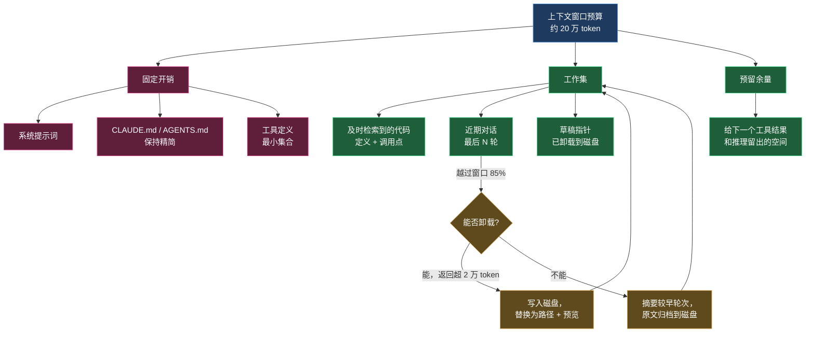
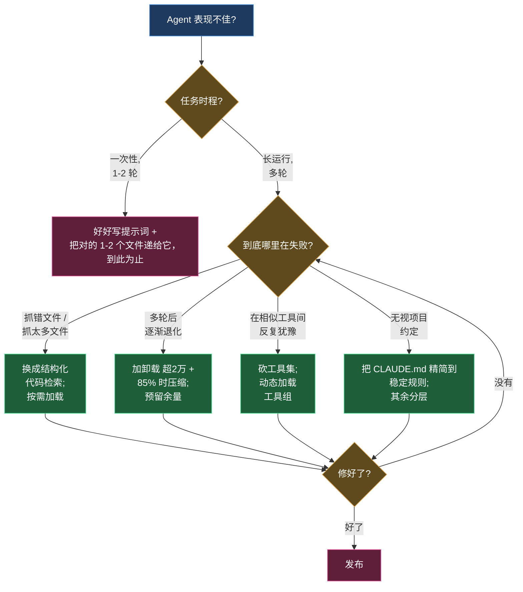

+++
date = '2026-06-16T11:00:00+08:00'
draft = false
title = '面向编码 Agent 的上下文工程 2026：把窗口当预算管'
description = '2026 年编码 Agent 的上下文工程实战：把上下文窗口当预算来分配，精准检索、及时压缩、CLAUDE.md 保持精简，并识别那些让 Agent 变差的伪需求。'
toc = true
tags = ['Context Engineering', 'AI Coding Agents', 'Context Window', 'Claude Code', 'LLM']
keywords = ['上下文工程 2026', 'context engineering', '编码 agent 上下文', '上下文窗口管理', '上下文压缩']

[[params.faqItems]]
question = "2026 年面向编码 Agent 的上下文工程到底指什么？"
answer = "指在一个长时间运行的 Agent 循环里，决定模型每一次推理看到哪些 token：检索什么、压缩什么、卸载什么、暴露哪些工具。2026 年它已经从「写好文档」变成「主动管理一份 token 预算」。"

[[params.faqItems]]
question = "上下文窗口更大是不是就不需要上下文工程了？"
answer = "不是。模型在远未达到标称上限时就开始退化，接近 100 万 token 时会撞墙。Sourcegraph 的测试里，5K token 的精准检索在同一任务上打败了 100K token 的摘要。更大的窗口只改变「装得下什么」，不改变「模型真正注意什么」。"

[[params.faqItems]]
question = "给编码 Agent 喂上下文，向量检索 RAG 是最好的方式吗？"
answer = "对代码来说通常不是。结构化检索（返回符号的定义和调用点）往往优于概率式的向量检索——在 Sourcegraph 基准里 precision@5 从 0.14 提升到 0.48。散文用向量检索，代码用代码智能检索。"

[[params.faqItems]]
question = "我的 CLAUDE.md 或 AGENTS.md 应该写多大？"
answer = "越小越好。它会被拼接进每一轮对话，所以每一行都是对 token 预算持续征收的税。只放全项目通用的稳定规则，把任务相关的细节做成按需加载，而不是全塞进一个文件。"
+++

关于 2026 年的编码 Agent，有一个不太舒服的事实：模型很少是瓶颈。决定 Claude Code、Codex 或 Cursor 能否干净地完成一次跨文件重构、还是空转一小时的，是你摆在它面前的东西。Anthropic 2026 年的 Agentic Coding 报告把上下文工程称为「2026 年的承重技能」，数据也支持这个说法——维护良好上下文文件的团队，出错率低 40%，任务完成速度快 55%。

今年早些时候我写过一篇[偏理论的上下文工程深潜](/posts/ai/2026-02-24-context-engineering-deep-dive/)，讲的是失效模式和「Specs 是新的源代码」这套论证。这篇正好相反：它是给真正在跑编码 Agent 的人准备的 2026 实战手册——哪些技巧真有效、有什么数据佐证、哪些流行做法其实是让 Agent 悄悄变差的伪工作。我的核心主张很简单：**别再把上下文窗口当成一个要装满的桶，把它当成一份要花的预算。**

## 2026 年的上下文工程：从写文档到管预算

两年前，「上下文工程」大体就是写好文档、写个像样的系统提示词。这个理解现在已经危险地不完整了。2026 年最关键的变化是：编码 Agent 跑得*很长*。一次 Claude Code 会话可以在七个小时里啃完一个 1250 万行的代码库，调用工具几百次。在这样的循环里，上下文窗口不是你一次性准备好的简报——它是一份会不断被填满、会退化、必须一轮一轮主动管理的实时资源。

这个变化重塑了整门学科。上下文工程是这样一件事：设计一条流水线，去组装、修剪、排序模型在某一次推理调用中看到的每一个 token——行为设定、检索到的代码、历史消息、工具定义，全都在争夺同一块有限空间。一旦接受这个框架，重要的问题就变了。不再是「我该告诉 Agent 什么」，而是「我该逐出什么来腾地方」「这段对话什么时候该压缩」「这是不是 Agent 此刻所需信息的最省 token 的表示方式」。

整个行业都真切感受到了这个转向。2026 年的一份调查中，82% 的 IT 与数据负责人认为单靠提示词工程已经不够，95% 认为上下文工程对规模化运行 Agent 很重要。这不是概念炒作——而是大家意识到，编码 Agent 的失败几乎从来不是「模型推理不出来」，而是「模型在错误的四万个 token 上推理」。一个被广泛引用的数字是：企业 Agent 失败中 65% 源于上下文漂移，而非模型能力。

## 上下文工程 vs 提示词工程：对 Agent 为什么关键

还是有人问，上下文工程和提示词工程是不是换个说法而已。对于一次性的聊天回复，说实话，这个区别很薄。但对编码 Agent，这就是全部。

提示词工程优化的是一条消息：你怎么措辞才能得到更好的回答，是施加在单轮上的手艺。上下文工程管理的是整个*循环*里的信息环境——而编码 Agent 的循环恰恰是所有有意思的失败发生的地方。Agent 读一个文件，这文件 800 行落进了对话；它跑测试，5000 行堆栈落进了对话；它 grep 代码库，40 个匹配落进了对话。这些没有一个是谁「写的提示词」，它们是*堆积*出来的。管理这种堆积——决定什么留下、什么被摘要、什么写到磁盘上只留一个路径引用——这就是上下文工程，再怎么打磨提示词也碰不到它。

最清楚的关系是：提示词工程是上下文工程的一个子集。提示词是 token 预算里的一个切片；上下文工程拥有整份预算以及它随时间的演化。如果你的 Agent 第一轮表现很好、到第三十轮就崩了，那你不是提示词有问题，你是上下文管理有问题——本文剩下的部分讲的就是修它的技巧。

## 真正有效的几个技巧

我见过很多团队「做上下文工程」的方式，是写一个越来越长的 AGENTS.md，再给整个仓库挂一个向量索引。这两件事都让人觉得很有生产力。但杠杆都不在这里。下面是四个有真实数据撑腰的技巧。

### 1. 及时检索胜过把代码库倒进去

最常见的错误是「前置装载」：把尽可能多的「可能相关」文件塞进上下文，让 Agent「什么都有」。这实际上是有害的。Sourcegraph 2026 年的基准很直白——在完全相同的任务上，Agent 拿着 100K token 的摘要*比*拿着 5K token 的精准检索表现更差。更大的上下文没给模型更多可用信息，只给了它更多可被干扰的东西。

解法是及时加载：给 Agent 在需要时去取的能力，而不是预先塞一堆猜测。一行文件引用加一个读取工具，在 Agent 真正判定这个文件相关之前，几乎不花什么成本。这和 Anthropic 的结构化笔记模式是同一个原理——Agent 把草稿写到上下文窗口*之外*的文件里，需要时再读回来，让长期记忆在真正用到之前都不占 token 预算。

### 2. 结构化代码检索胜过向量检索

这是让团队损失最大的一个误解：以为给编码 Agent 喂上下文，用向量 RAG 就对了。散文可以，代码不行。代码是有结构的——定义、引用、调用图——理解这种结构的检索，会碾压把源文件当作 token 袋子的检索。

Sourcegraph 的数字把差距量化了。基线的 grep+读取检索，文件召回率 0.127、precision@5 是 0.140。换成代码智能检索——返回符号的实际定义加它的调用点——文件召回率升到 0.277，precision@5 升到 0.478，精度翻了三倍多。这不是学术上的小数点。在一个 Kubernetes 任务上，它把两小时超时变成了 89 秒成功；一次跨文件重构从 84 分钟、96 次工具调用，降到 4.4 分钟、5 次调用。精准检索不只是改善答案，它直接压缩了轮数，而更少的轮数又让窗口保持干净。精度是会复利的。

### 3. 长循环 Agent 的压缩与卸载

Agent 一旦跑得够长，再聪明的检索也挡不住对话被填满。这时压缩（compaction）和卸载（offloading）就该上场了，2026 年的生产级框架已经收敛出一套带明确阈值的打法。以 LangChain 的 Deep Agents 为例：任何单条超过 2 万 token 的工具返回，都会被卸载到文件系统，在上下文里替换成一个文件路径加十行预览；当会话越过窗口的 85%，就把较早的工具调用截断成指向磁盘内容的指针；只有当卸载还不够时，才做摘要——生成一份包含会话意图、产物、下一步的结构化摘要，同时把原始消息写到磁盘作为权威记录。

这里的顺序是刻意的，值得照搬：**先卸载，再摘要。** 卸载是无损的——内容还在，只是改用路径引用——而摘要是有损的、有目标漂移的风险。激进压缩真正的危险是：一份摘要悄悄丢掉了那条唯一重要的约束，三轮之后 Agent 就跑偏了。如果你要压缩，就得让「大海捞针式的恢复」是可测的：当 Agent 后来发现需要那条被摘要掉的细节时，它还取得回来吗？取不回来，就是压得太狠了。

### 4. 工具极简主义

你暴露的每一个工具定义，都在每一轮里占着上下文窗口；每一对近似重复的工具，都会逼模型花一轮去纠结选哪个。这不是可以忽略的零头。带着相互冲突假设的臃肿工具集，是有据可查的「浪费轮数、把 Agent 搞糊涂」的根源。我的规则是：只暴露覆盖当前任务所需的、最小的一组无歧义工具，并且按需动态加载工具组，而不是一次性挂上你拥有的每一个 [MCP 服务器](/posts/ai/2026-02-20-mcp-protocol-guide/)。Agent 在写后端代码时并不需要一个 Figma 工具在作用域里，那个定义纯粹是税。更少、更锋利的工具，永远好过一个大而全的 API 包装。

## 上下文窗口管理：分配它，而不是填满它

如果你只从这篇文章带走一个心智模型，就带走这个：上下文窗口是一份有明细科目的预算，你的工作是分配。每一个花在过期堆栈上的 token，都是从 Agent 真正要改的那个文件那里挪走的 token。下面是我对这份分配和压缩循环的思考方式：

落到纪律上：清楚你的固定开销（它们纯是负担，要压到最低），让工作集保持精准（及时检索、过期即逐出），并且永远预留余量，好让下一个工具结果和模型的推理有地方落。一个把窗口跑到 99% 满的 Agent 没有余地思考——下一个大的工具返回会逼它在最糟糕的时刻仓皇压缩。

## 组织 CLAUDE.md 与 AGENTS.md：精简、分层、按需

因为 [CLAUDE.md 和 AGENTS.md](/posts/ai/2026-02-28-claude-code-claudemd-guide/) 会被拼接进每一轮，它们是大多数团队预算里被最过度纵容的科目。我经常见到 400 行的 CLAUDE.md，把整个架构重讲一遍。这里面每一行，都在每一轮被永久征税，不管当前任务碰不碰那个子系统。

精简原则：只有稳定的、全项目通用的规则才放进「永远加载」的文件——约定、硬约束、那几条「到处都别这么干」的规则。所有任务相关的东西都推到 Agent 按需加载的文件里去。一个短短的根文件写着「鉴权逻辑在 `src/auth/`，动它之前先读 `src/auth/README.md`」，比 200 行重述那个二十次任务里只碰一次的鉴权流程有价值得多。我在 [CLAUDE.md 记忆指南](/posts/ai/2026-01-12-claudemd-memory-guide/) 里更细地讲了怎么组织这些文件，同样的分层逻辑也支撑着持久的 [Agent 记忆系统](/posts/ai/2026-02-21-ai-agent-memory-systems/)——常驻层保持极小，可检索层承载大头。

## 那些伪需求：该停下来的做法

2026 年一些说得最自信的建议，其实在悄悄帮倒忙。三个我会劝你放弃的做法：

**「为了保险」把上下文窗口塞满。** 「上下文越多越安全」这个直觉恰恰是反的。上下文腐烂（context rot）是真实且被测量过的，在每个主流模型家族上都成立：随着输入变长，即便是简单任务的准确率也会退化，而一个干扰项就能让精度明显下降。100 万 token 的窗口是容量上限，不是目标。塞满它，你是在为退化的注意力付费。

**把整个仓库嵌入向量库，然后称之为上下文工程。** 对代码，如上面的数字所示，这在精度上比结构化检索差大约 3 倍，还给你增加了一套要和不断变化的代码库保持同步的基础设施。除非你检索的是散文文档，代码智能工具才是更好的默认选择。

**不看状态、按固定节奏压缩。** 「每 N 轮压一次保持整洁」会扔掉 Agent 可能需要的细节，还在窗口只用了 30% 时白白引入目标漂移的风险。压缩要在预算逼你压的时候压，而不是定时压。

诚实地讲，反方向的取舍也成立：对于短的一次性任务，这些都不值得。如果任务是「给这个函数加个空值检查」，一个带着那一个文件的朴素提示词，胜过任何检索流水线、压缩方案或记忆系统。上下文工程是给长时程 Agent 的纪律。在两轮的任务上，这套机制纯是负担。让仪式感匹配时程。

## 决策框架：什么时候用哪个技巧

下面是我在 Agent 表现不佳、需要判断该拉哪根杠杆时真正用的决策树：

这张图把整篇文章的论点编码进去了：诊断具体的失败，施加唯一针对它的技巧，验证，然后停手。别一股脑同时上一个向量库、一条摘要流水线、一个 300 行的 AGENTS.md，然后祈祷。它们每一个都是对*不同*失败的回答，用在错的失败上，只会加成本、不解决问题。

## 你该带走什么

如果你在 2026 年跑编码 Agent，就把上下文窗口当预算来主动管理：及时检索、代码优先用结构化检索、先卸载再摘要、CLAUDE.md 和工具集都保持精简、永远预留余量。抵制那三个伪需求——塞满窗口、把整个仓库做 RAG、定时压缩。并且按时程校准：一次性的小改动，这些都不适用；一次七小时的 Agent 长跑，全都适用。模型会一直变强，但 token 预算永远有限，会不会花这份预算，才是区分「能发布的 Agent」和「只会空转的 Agent」的那项技能。

## 延伸阅读

- [上下文工程深潜：AI 编程中最被低估的核心技能](/posts/ai/2026-02-24-context-engineering-deep-dive/) —— 这份实战手册背后的理论与失效模式
- [CLAUDE.md 记忆指南](/posts/ai/2026-01-12-claudemd-memory-guide/) —— 如何组织那份「永远加载」的上下文文件
- [Claude Code CLAUDE.md 指南](/posts/ai/2026-02-28-claude-code-claudemd-guide/) —— CLAUDE.md/AGENTS.md 的实用组织方式
- [AI Agent 记忆系统](/posts/ai/2026-02-21-ai-agent-memory-systems/) —— 上下文窗口之外的持久记忆
- [MCP 协议完全指南](/posts/ai/2026-02-20-mcp-protocol-guide/) —— 连接工具而不撑爆上下文

外部来源：[Anthropic 2026 Agentic Coding 报告摘要](https://www.claudeainews.com/news/anthropic-2026-agentic-coding-report)、[Sourcegraph：上下文工程实战指南](https://sourcegraph.com/blog/context-engineering)、[LangChain：Deep Agents 的上下文管理](https://www.langchain.com/blog/context-management-for-deepagents)、[开源软件中 AI Agent 的上下文工程（arXiv）](https://arxiv.org/html/2510.21413v1)。
