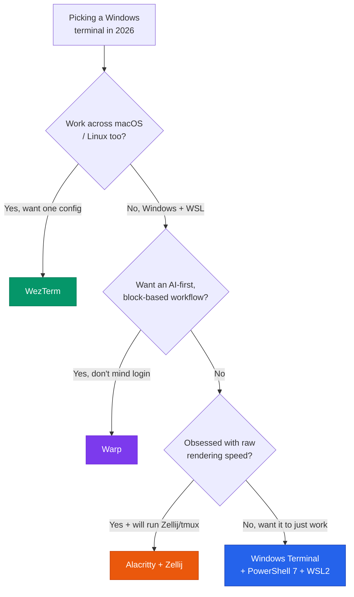
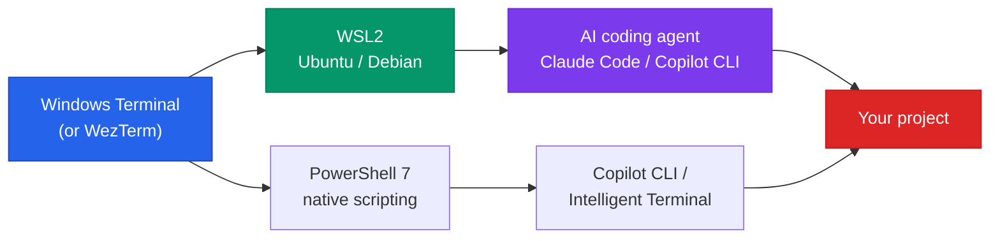

+++
date = '2026-06-22T12:00:00+08:00'
draft = false
title = 'Best Windows Terminal 2026: Ranked for Developers'
description = 'Windows Terminal + PowerShell 7 + WSL2 is the best Windows terminal for most developers in 2026. WezTerm for cross-platform, Warp for AI-first workflows.'
toc = true
tags = ['Windows Terminal', 'WezTerm', 'Terminal', 'Dev Tools', 'WSL']
keywords = ['best windows terminal 2026', 'windows terminal apps', 'wezterm vs windows terminal', 'best terminal for wsl', 'windows terminal for developers', 'warp terminal windows', 'alacritty windows']

[[params.faqItems]]
question = "What is the best Windows terminal in 2026?"
answer = "For most developers, Windows Terminal with PowerShell 7 and WSL2 is the best default in 2026 — it now ships native GitHub Copilot CLI and Intelligent Terminal integration. Pick WezTerm if you want a faster, cross-platform GPU terminal with a built-in multiplexer, or Warp if you want an AI-native, block-based workflow."

[[params.faqItems]]
question = "WezTerm vs Windows Terminal — which is better?"
answer = "Windows Terminal wins on WSL integration, Copilot CLI, and quake mode; it's the safer default. WezTerm wins on rendering speed, a built-in multiplexer (no tmux needed), and identical config across Windows, macOS and Linux. Choose WezTerm if you work on multiple operating systems and want one Lua config everywhere."

[[params.faqItems]]
question = "Is Warp available on Windows?"
answer = "Yes. Warp launched a Windows preview in May 2026, bringing its Agent Mode, block-based UI, and AI command generation to Windows. It requires an account/login and is a different kind of tool than Windows Terminal — great for AI-driven workflows, less ideal if you want a lightweight, offline default terminal."

[[params.faqItems]]
question = "What is the best terminal for WSL?"
answer = "Windows Terminal is the best terminal for WSL2 in 2026. It auto-detects installed Linux distros, opens each in its own tab or pane, and handles Unicode, GPU rendering and profiles better than legacy consoles. WezTerm also works well with WSL if you prefer its multiplexer."

[[params.faqItems]]
question = "Do I still need PowerShell 7 in 2026?"
answer = "Yes, if you script on Windows. PowerShell 7.4.6+ is the version required for AI Shell and Copilot integration, and it's cross-platform, faster, and far better than the legacy Windows PowerShell 5.1 that still ships as the default. Install it separately and set it as your Windows Terminal default profile."
+++


Use Windows Terminal with PowerShell 7 as your default profile and WSL2 for your Linux work — for roughly 90% of developers, that's the best Windows terminal setup in 2026, and it's probably already installed on your machine. The one upgrade rule worth memorizing: move to WezTerm when you split your week across Windows, macOS, and Linux and want a single config file that follows you everywhere. Every other switch — Warp for its AI agent workflow, Alacritty for raw speed — is a special case, and this guide will tell you in about two minutes whether you're actually in one.

That answer would have sounded lazy two years ago, when recommending the built-in terminal was a shrug. Not anymore. Microsoft spent the past year turning Windows Terminal into an AI-native shell — GitHub Copilot CLI and Intelligent Terminal now ship inside it — and in doing so quietly built a moat that WezTerm, Alacritty, and even Warp don't have. The burden of proof has flipped: the alternatives now have to justify themselves.

<!--more-->

## Best Windows Terminal 2026: The Verdict Up Front

Selection guides usually bury the decision at the bottom. This one puts it first — trace your own path through the tree, then treat the rest of the article as a reference manual for whichever branch you land on.



Here's the same judgment as a cheat sheet you can screenshot:

| Terminal | Best for | Speed | Multiplexer | AI built-in | Cross-platform | Verdict |
|----------|----------|-------|-------------|-------------|----------------|---------|
| **Windows Terminal** | WSL users, most developers | Good | No (use tmux) | Yes (Copilot CLI) | Windows only | The default that won |
| **WezTerm** | Multi-OS power users | Fast | Yes (built-in) | No | Yes (Lua config) | Best upgrade |
| **Alacritty** | Speed maximalists | Fastest | No | No | Yes | Component, not a terminal |
| **Warp** | AI-first, team workflows | Good | Blocks | Yes (Agent Mode) | Yes | Different species |
| **PowerShell 7** | Scripting (shell, not emulator) | — | — | AI Shell / Copilot | Yes | Install regardless |

One name is deliberately missing: Ghostty. The darling of 2025 still has no official Windows build as of mid-2026 — only community projects like Winghostty fill the gap. So any "best terminal 2026" listicle telling you to install [Ghostty](https://ghostty.org/) on Windows is either wrong or quietly pointing you at an unaffiliated third-party build. Don't chase it on Windows yet.

Whichever branch you landed on, installation is one WinGet line — no installers to hunt down:

```powershell
winget install Microsoft.WindowsTerminal   # the default pick
winget install Microsoft.PowerShell        # PowerShell 7 (not the legacy 5.1)
wsl --install -d Ubuntu                    # WSL2 + Ubuntu
winget install wez.wezterm                 # cross-platform upgrade
winget install Alacritty.Alacritty         # speed play (pair with Zellij/tmux)
winget install Warp.Warp                   # AI-native, needs an account
```

## What Changed in the Windows Terminal Landscape

For years the conversation was simple: Windows Terminal was "good enough," Linux and macOS had the interesting toys, and power users grumbled. Three shifts broke that stalemate, and they explain every ranking above.

First, WSL2 matured from curiosity into the default development target. "Edit on Windows, run in Linux" is now how a huge share of web and AI developers work, which makes *how your terminal talks to WSL* the single most important selection criterion — ahead of fonts, themes, and benchmark numbers.

Second, AI moved into the command line. At Build 2026, Microsoft shipped Intelligent Terminal, which pipes failed-command context to an agent pane and offers GitHub Copilot CLI inline the moment a command errors. Meanwhile Warp — the venture-backed, AI-native terminal — finally reached Windows in a May 2026 preview. The terminal stopped being a passive text box and became a place where an agent runs.

Third, the "fast GPU terminal" category consolidated. Alacritty and WezTerm are the two mature Rust options left standing, which is why they're the only speed plays on this list. Everything else in that niche is either unmaintained, macOS-only, or — like Ghostty — not officially on Windows.

## Windows Terminal: The Default That Won

In 2026, [Windows Terminal](https://github.com/microsoft/terminal) is not the terminal you settle for — it's the one with the widest set of advantages, and every alternative has to beat it on a specific axis to deserve your time.

Start with WSL, because that's where it's untouchable. Windows Terminal auto-discovers every installed Linux distribution and gives each one its own profile, so Ubuntu, your PowerShell 7 session, and a raw `cmd` prompt are each one tab away. No other terminal integrates this cleanly, because no other terminal is built by the company that ships WSL. If your day is "edit in VS Code, run in Ubuntu under WSL2," this alone outweighs any 20x rendering benchmark.

Then there's the AI layer — the part most comparison articles miss. GitHub Copilot CLI now runs inline in Windows Terminal, and Intelligent Terminal automatically surfaces the context of a failed command and offers a fix you can run in a dedicated agent pane. Notably, Microsoft archived the older AI Shell project in January 2026 and folded that effort into the terminal itself rather than shipping a bolt-on module. That's a meaningful signal: the AI capability is native to the terminal now, not a plugin you install elsewhere.

This matters even if you never touch Copilot. If your daily driver is an AI coding agent — say, [Claude Code, whose complete workflow I covered here](/posts/ai/2026-02-28-claude-code-complete-guide/) — running it inside a terminal that also understands your failed commands is a genuine convenience, not a gimmick.

The honest weakness is rendering speed. In vtebench scrolling tests, Windows Terminal takes around 2,460ms where Alacritty finishes in about 106ms — a 20x gap on paper. That number is real, and it's also mostly irrelevant to daily work: unless you routinely `cat` enormous files or run tools that spew tens of thousands of lines a second, you won't perceive it. I've used Windows Terminal as a daily driver and never once thought "this is too slow" during normal coding, git, and build work. Benchmark latency and felt latency are different things, and the people selling you a Rust terminal know it.

**Bottom line:** if you're on WSL, want Copilot CLI and quake mode, or just want the lowest-friction setup, stop here. The only reasons to keep reading are a built-in multiplexer without tmux, or a config that has to work identically on three operating systems.

## WezTerm: The Cross-Platform Upgrade

[WezTerm](https://wezterm.org/) is what I recommend when someone has actually outgrown Windows Terminal — not vaguely, but by hitting a specific wall. It's a GPU-accelerated, Rust-built emulator with something neither Windows Terminal nor Alacritty ships out of the box: a real, single-process multiplexer with searchable scrollback, panes, workspaces, and session management, all configured in Lua.

The killer feature is consistency. WezTerm behaves identically on Windows, macOS, and Linux, driven by one `~/.wezterm.lua`. Switch machines — Windows desktop at work, Mac at home — and you get a byte-for-byte identical terminal, keybindings included, with nothing to relearn. Windows Terminal structurally can't match that, because it's Windows-only by design. If you built a setup you love after reading my [macOS terminal emulator comparison](/posts/macos/2025-01-22-terminal-tools-guide/), WezTerm is how you carry it onto Windows unchanged.

The built-in multiplexer matters more than it sounds, too. On Windows Terminal, persistent sessions and complex pane layouts mean running tmux inside WSL — which works, and which I walk through in the [tmux guide for AI-assisted development](/posts/ai/2026-03-03-tmux-guide-ai-development/). WezTerm bakes that capability in natively, so panes and persistent workspaces work on native Windows shells as well, not just inside WSL. For SSH-heavy work across many hosts, that's a daily quality-of-life gain.

The cost is Lua. There's no rich settings UI like Windows Terminal's; you edit a config file, and the power comes with a learning curve. For some people that's the whole appeal. For others it's a Saturday afternoon they'd rather keep. And if you live entirely in Windows + WSL and don't need the multiplexer, you don't need WezTerm — that's the honest boundary of this recommendation.

## Alacritty: The Fastest, With an Asterisk

[Alacritty](https://alacritty.org/) answers exactly one question: what's the fastest, lowest-latency terminal I can run? It's an OpenGL/GPU emulator with a deliberately minimal feature set, and it wins raw benchmarks handily — that ~106ms vtebench figure above is Alacritty's. If your work genuinely involves throwing enormous volumes of text at the screen, it is measurably the best tool.

The asterisk is the minimalism, and it's a big one: no tabs, no split panes, no scrollbar, no settings UI. That's not an oversight you can configure around. The maintainers exclude those features on purpose, because they'd compromise the speed obsession — it's the philosophy, not a roadmap gap.

So never run Alacritty alone. The real stack is Alacritty as the fast rendering surface plus Zellij or tmux doing all the tab, pane, and session work. Inside WSL, "Alacritty + Zellij" is genuinely excellent — maximum rendering speed under a modern multiplexer UI. But that's two tools to install, learn, and configure, and if you skip the multiplexer you'll be miserable within an hour, because you can't even open a second tab. Alacritty is a component, not a complete terminal experience. Commit to the pair or don't start.

## Warp: A Different Species

[Warp](https://www.warp.dev/) landed on Windows in a May 2026 preview, and it's the most genuinely different option on this list. It isn't "Windows Terminal but faster" — it's a rethink of what a terminal is. Input and output are grouped into blocks you can navigate, share, and re-run; AI command generation is built in; and Agent Mode executes multi-step tasks with step-by-step approval, using your shell, saved commands, and codebase context.

For a certain workflow, that's fantastic. If you frequently ask "how do I do X on the command line," attach a failing command's output for a fix, or save and share team Workflows via Warp Drive, Warp does things nothing else here does. It's also where the terminal overlaps conceptually with agent-driven shell and browser automation — a space I explored in the [Claude Code browser automation writeup](/posts/ai/2026-01-28-claude-code-browser-automation/).

Here's why it still isn't my default pick. Warp requires an account and login — real friction, and for some teams a compliance question about where terminal context flows. The block UI, delightful for exploratory work, feels heavy when you just want a fast, quiet, offline prompt. And critically, in 2026 you don't need to switch terminals to get AI on the command line — Microsoft put Copilot CLI directly inside Windows Terminal. Adopt Warp because you want its block-and-agent model, not because you think it's the only way to get an AI-assisted prompt.

## PowerShell 7, WSL2, and Where the Terminal Actually Matters

The terminal is the window; the shell and environment behind it do most of the work. Getting those two layers right matters more than which emulator you picked — and it's exactly where people over-index on the emulator and under-invest in the fundamentals.

On the shell side: if you script on Windows in 2026, install [PowerShell 7](https://github.com/PowerShell/PowerShell) and make it your default profile. Don't settle for the legacy Windows PowerShell 5.1 that still ships as the built-in default — PowerShell 7 is cross-platform, meaningfully faster, and 7.4.6+ is the version AI Shell and Copilot integration require. It's a two-minute WinGet install that most people skip, then wonder why their AI tooling misbehaves.

On the environment side: WSL2 is where the real work happens for most modern development. Your terminal's job is to be a clean, fast, Unicode-correct window onto your Linux distro — precisely what Windows Terminal and WezTerm do well. It's also the layer where your AI coding agents live: running Claude Code, Codex CLI, or Copilot CLI inside WSL under a good terminal is the standard 2026 setup. If you're assembling that stack, my [comparison of terminal AI coding tools](/posts/ai/2026-04-14-terminal-ai-coding-tools-2026-comparison/) covers which agent to run once the terminal is sorted.

Here's the full stack I'd actually set up on a Windows dev machine in 2026 — terminal, shell, environment, and AI agent as one system:



## Two Mistakes That Cost the Most Time

Both of the expensive mistakes come from treating benchmarks and hype as buying advice.

Mistake one: **installing Alacritty as your only terminal because it won a benchmark.** You get a screamingly fast rendering surface with no tabs and no panes, and you'll be fighting it within the hour. Commit to the full Alacritty + Zellij stack from day one, or start with Windows Terminal and never think about it again.

Mistake two: **switching terminals to get AI you already had.** People see Warp's Agent Mode and assume Windows Terminal is now obsolete for AI work. It isn't — Copilot CLI and Intelligent Terminal are native to Windows Terminal in 2026. Switch to Warp for its block-and-agent model specifically, not for "AI in the terminal" generally. And don't burn a weekend on Ghostty either; there's still no official Windows build, and the third-party ones are unaffiliated.

If you're unsure, here's the move: Windows Terminal, PowerShell 7 as the default profile, WSL2 for the Linux work. Then spend the hours you would have spent evaluating terminals on setting up your AI coding agent inside that stack — that's where the actual productivity lives in 2026.

## Related Reading

- [Best Terminal Emulators in 2025: 23 Tools Compared for Every Platform](/posts/macos/2025-01-22-terminal-tools-guide/) — the cross-platform companion, including macOS and Linux picks
- [tmux Guide for AI-Assisted Development](/posts/ai/2026-03-03-tmux-guide-ai-development/) — the multiplexer that pairs with Windows Terminal and Alacritty
- [Terminal AI Coding Tools 2026 Comparison](/posts/ai/2026-04-14-terminal-ai-coding-tools-2026-comparison/) — which AI agent to run once your terminal is set up
- [Claude Code Complete Guide](/posts/ai/2026-02-28-claude-code-complete-guide/) — the AI coding agent I run inside WSL
- [Claude Code Browser Automation](/posts/ai/2026-01-28-claude-code-browser-automation/) — agent-driven automation from the command line
