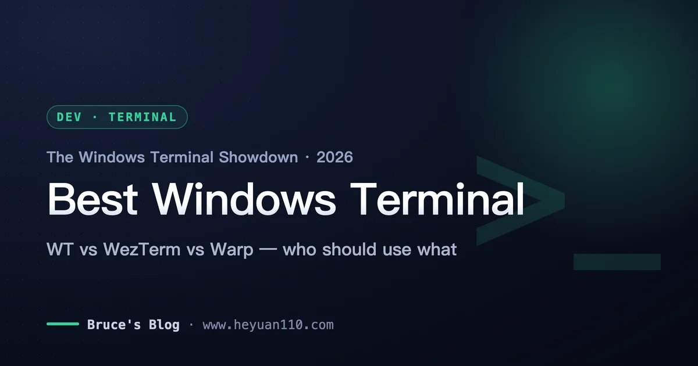
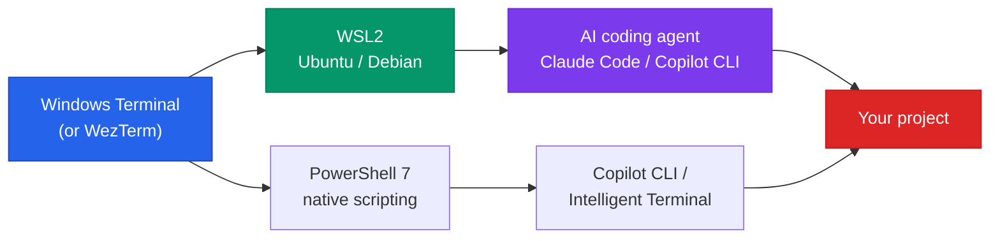
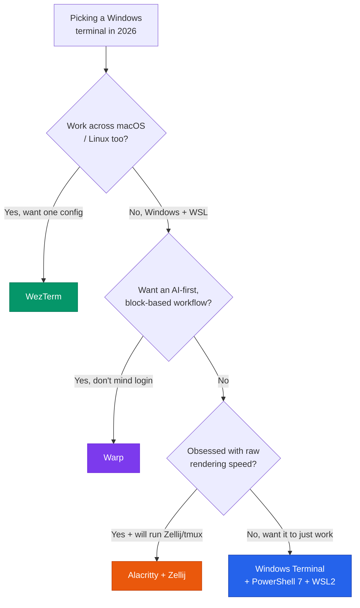

+++
date = '2026-06-22T12:00:00+08:00'
draft = false
title = 'Best Windows Terminal 2026: Ranked for Developers'
description = 'A ranked guide to the best Windows terminal in 2026 — Windows Terminal, WezTerm, Alacritty, Warp and PowerShell 7. Which to pick for WSL, AI coding and speed.'
toc = true
tags = ['Windows Terminal', 'WezTerm', 'Terminal', 'Dev Tools', 'WSL']
keywords = ['best windows terminal 2026', 'windows terminal apps', 'wezterm vs windows terminal', 'best terminal for wsl', 'windows terminal for developers', 'warp terminal windows', 'alacritty windows']

[[params.faqItems]]
question = "What is the best Windows terminal in 2026?"
answer = "For most developers, Windows Terminal with PowerShell 7 and WSL2 is the best default in 2026 — it now ships native GitHub Copilot CLI and Intelligent Terminal integration. Pick WezTerm if you want a faster, cross-platform GPU terminal with a built-in multiplexer, or Warp if you want an AI-native, block-based workflow."

[[params.faqItems]]
question = "WezTerm vs Windows Terminal — which is better?"
answer = "Windows Terminal wins on WSL integration, Copilot CLI, and quake mode; it's the safer default. WezTerm wins on rendering speed, a built-in multiplexer (no tmux needed), and identical config across Windows, macOS and Linux. Choose WezTerm if you work on multiple operating systems and want one Lua config everywhere."

[[params.faqItems]]
question = "Is Warp available on Windows?"
answer = "Yes. Warp launched a Windows preview in May 2026, bringing its Agent Mode, block-based UI, and AI command generation to Windows. It requires an account/login and is a different kind of tool than Windows Terminal — great for AI-driven workflows, less ideal if you want a lightweight, offline default terminal."

[[params.faqItems]]
question = "What is the best terminal for WSL?"
answer = "Windows Terminal is the best terminal for WSL2 in 2026. It auto-detects installed Linux distros, opens each in its own tab or pane, and handles Unicode, GPU rendering and profiles better than legacy consoles. WezTerm also works well with WSL if you prefer its multiplexer."

[[params.faqItems]]
question = "Do I still need PowerShell 7 in 2026?"
answer = "Yes, if you script on Windows. PowerShell 7.4.6+ is the version required for AI Shell and Copilot integration, and it's cross-platform, faster, and far better than the legacy Windows PowerShell 5.1 that still ships as the default. Install it separately and set it as your Windows Terminal default profile."
+++

The biggest mistake people make when picking a Windows terminal in 2026 is assuming the default — Windows Terminal — is the "boring" choice you upgrade away from. Two years ago that was arguably true. Today it's backwards. Microsoft spent the last year turning Windows Terminal into an AI-native shell with native GitHub Copilot CLI and Intelligent Terminal integration, and in doing so it built a moat that WezTerm, Alacritty, and even Warp don't have. If you're searching for the **best Windows terminal in 2026**, the honest answer for most developers is: you probably already have it installed.

But "probably" is doing a lot of work in that sentence. There are real reasons to switch — cross-platform consistency, raw rendering speed, or an AI-first workflow — and there are real traps, like installing Alacritty because it topped a benchmark and then discovering it has no tabs. This guide ranks the five terminals that actually matter on Windows, tells you exactly who each one is for, and — more importantly — who should *not* use it.

<!--more-->

## The 2026 Windows terminal landscape has actually shifted

For years, the Windows terminal conversation was simple: Windows Terminal was "good enough," Linux and macOS had the interesting toys, and power users grumbled. Three things broke that stalemate in 2026.

First, WSL2 matured into a first-class development target rather than a curiosity. The workflow of "edit on Windows, run in Linux" is now the default for a huge share of web and AI developers, which makes *how your terminal talks to WSL* the single most important selection criterion — more than fonts, more than themes, more than benchmark numbers.

Second, AI moved into the command line. At Build 2026 Microsoft shipped "Intelligent Terminal," which pipes failed-command context to an agent pane and offers GitHub Copilot CLI inline the moment a command errors. Meanwhile Warp — the venture-backed, AI-native terminal — finally reached Windows in a May 2026 preview. The terminal stopped being a passive text box and became a place where an agent runs.

Third, the "fast GPU terminal" category consolidated. Alacritty and WezTerm are the mature Rust options; Ghostty, the darling of 2025, still has *no official Windows build* as of mid-2026 — only community projects like Winghostty fill the gap. I mention this because a lot of "best terminal 2026" listicles will tell you to install Ghostty on Windows, and that advice is either wrong or is quietly pointing you at an unaffiliated third-party build. Don't chase it on Windows yet.

So the landscape in 2026 is five serious contenders, and the right pick depends entirely on which of three things you value: WSL/AI integration, cross-platform consistency, or raw speed.

## Windows Terminal: the default that quietly won

Here's the reframe I want you to take away: in 2026, Windows Terminal is not the terminal you settle for — it's the terminal with the widest set of advantages, and the burden of proof is on the alternatives.

Start with WSL. Windows Terminal auto-discovers every installed Linux distribution and gives each one a profile, so switching between Ubuntu, your PowerShell 7 session, and a raw `cmd` prompt is one tab away. No other terminal integrates this cleanly on Windows, because no other terminal is built by the same company that ships WSL. If most of your work is "edit in VS Code, run in Ubuntu under WSL2," this integration alone is worth more than a 20x rendering benchmark.

Then there's the AI layer, which is the part most comparison articles miss. GitHub Copilot CLI is now available inline in Windows Terminal, and Microsoft's Intelligent Terminal surfaces the context of a failed command automatically and offers a fix you can run in a dedicated agent pane. Notably, the older AI Shell project was archived in January 2026 — Microsoft folded that effort into the terminal itself rather than a bolt-on module. That's a meaningful signal: the AI capability is now native to the terminal, not a plugin you install elsewhere. If your daily driver is an AI coding agent — and if you use something like [Claude Code, the complete workflow of which I covered here](/posts/ai/2026-02-28-claude-code-complete-guide/) — running it inside a terminal that also understands your failed commands is a genuine convenience.

The honest weakness is rendering speed. In vtebench scrolling tests, Windows Terminal takes around 2,460ms where Alacritty finishes in about 106ms — a 20x gap on paper. That number is real and it is also mostly irrelevant to daily work: unless you routinely `cat` enormous files or run tools that spew tens of thousands of lines a second, you will not perceive it. I've used Windows Terminal as a daily driver and never once thought "this is too slow" during normal coding, git, and build work. Benchmark latency and felt latency are different things, and vendors selling you a Rust terminal know that.

**Use Windows Terminal if:** you're on WSL, you want Copilot CLI and quake mode, or you simply want the lowest-friction setup that 90% of Windows developers should run. **Skip it if:** you need a built-in multiplexer without tmux, or you work across three operating systems and want one identical config file.

## WezTerm: the cross-platform upgrade for power users

WezTerm is the terminal I recommend when someone has actually outgrown Windows Terminal — not because they think they have, but because they hit a specific wall. It's a GPU-accelerated, Rust-built emulator with something neither Windows Terminal nor Alacritty offers out of the box: a real, single-process multiplexer with searchable scrollback, panes, workspaces, and session management, all configurable in Lua.

The killer feature is consistency. WezTerm runs the same on Windows, macOS, and Linux, driven by the same `~/.wezterm.lua` config. If you switch machines — a Windows desktop at work, a Mac at home — you get a byte-for-byte identical terminal, keybindings and all, without relearning anything. That is a real, durable advantage that Windows Terminal structurally cannot match, because Windows Terminal is Windows-only by design. If you already read my [macOS terminal emulator comparison](/posts/macos/2025-01-22-terminal-tools-guide/) and set up something you liked there, WezTerm is the way to carry that exact setup onto Windows.

The built-in multiplexer also matters more than it sounds. On Windows Terminal, if you want persistent sessions and complex pane layouts you reach for tmux inside WSL — which works, and which I walk through in the [tmux guide for AI-assisted development](/posts/ai/2026-03-03-tmux-guide-ai-development/). WezTerm bakes that capability in natively, so you can have panes and persistent workspaces on native Windows shells too, not just inside WSL. For SSH-heavy work across many hosts, that's a real quality-of-life gain.

The cost is configuration. WezTerm expects you to write Lua. There's no rich settings UI like Windows Terminal's; you edit a config file, and the power comes with a learning curve. For a lot of people that's a feature — for others it's a Saturday afternoon they'd rather not spend.

**Use WezTerm if:** you work across multiple operating systems, want one Lua config everywhere, and value a built-in multiplexer over WSL's tmux. **Skip it if:** you live entirely in WSL and Windows (Windows Terminal already covers you), or you dislike config-file-driven tools.

## Alacritty: the fastest, with an asterisk

Alacritty is the answer to exactly one question: what is the fastest, lowest-latency terminal I can run? It's an OpenGL/GPU emulator with a deliberately minimal feature set, and it wins raw benchmarks handily — the ~106ms vtebench figure above is Alacritty. If your work genuinely involves throwing enormous volumes of text at the screen, it is measurably the best tool.

But that minimalism is the asterisk, and it's a big one. Alacritty has no tabs, no split panes, no scrollbar, and no settings UI — by design. The maintainers exclude those features specifically because they'd compromise the speed obsession. This is not an oversight you can configure around; it's the philosophy.

So the correct way to use Alacritty is never alone. The real stack is Alacritty as the fast rendering surface plus a multiplexer — Zellij or tmux — doing all the tab, pane, and session work. Inside WSL, "Alacritty + Zellij" is genuinely excellent: you get maximum rendering speed and a modern multiplexer UI. But that's two tools to install, learn, and configure, and if you skip the multiplexer you'll be miserable within an hour because you can't even open a second tab.

The mistake I see constantly: someone reads that Alacritty "won the benchmark," installs it as their only terminal, and then bounces off it because basic quality-of-life features are simply absent. Alacritty is a component, not a complete terminal experience.

**Use Alacritty if:** you want maximum speed, you're happy pairing it with Zellij or tmux, and minimalism appeals to you. **Skip it if:** you want tabs and panes to just work out of the box, or you're not willing to run a multiplexer.

## Warp: the AI-native terminal (and a different species)

Warp arrived on Windows in a May 2026 preview, and it's the most genuinely different option on this list. It's not "Windows Terminal but faster" — it's a rethink of what a terminal is. Input and output are grouped into blocks you can navigate, share, and re-run; there's built-in AI command generation; and Agent Mode can execute multi-step tasks with step-by-step approval, using your shell, saved commands, and codebase context.

For a certain workflow, this is fantastic. If you frequently ask "how do I do X on the command line," attach a failing command's output for a fix, or want to save and share team Workflows via Warp Drive, Warp is doing something the others don't. It's the terminal most oriented around AI-driven and collaborative work, and if that's your daily reality it earns its place. This is also where Warp overlaps conceptually with agent-driven browser and shell automation — a space I explored in the [Claude Code browser automation writeup](/posts/ai/2026-01-28-claude-code-browser-automation/).

But I want to be direct about why I don't rank it as a default. Warp requires an account and login — a real friction point and, for some teams, a compliance question about where terminal context flows. Its block-based UI, delightful for exploratory work, can feel heavy for someone who just wants a fast, quiet, offline prompt. And critically, in 2026 you don't need to switch terminals to get AI in the command line — Microsoft put Copilot CLI directly inside Windows Terminal. Warp is a *different species*, not a drop-in Windows Terminal replacement. Adopt it because you want its block-and-agent model, not because you think you need it for "AI in the terminal."

**Use Warp if:** you want an AI-first, block-based workflow and team Workflow sharing, and you don't mind logging in. **Skip it if:** you want a lightweight, offline, no-account default, or the block UI gets in your way.

## PowerShell 7, WSL, and where the terminal actually matters

Here's the point that reframes the whole comparison: the terminal is the window, but the shell and the environment behind it do most of the work. Picking the right terminal matters far less than pairing it with the right shell and WSL setup — and this is exactly where people over-index on the emulator and under-invest in the fundamentals.

On the shell side, if you script on Windows in 2026, install PowerShell 7 and make it your default profile — don't settle for the legacy Windows PowerShell 5.1 that still ships as the built-in default. PowerShell 7 is cross-platform, meaningfully faster, and 7.4.6+ is the version required for AI Shell and Copilot integration to work. This is a two-minute WinGet install that most people skip, then wonder why their AI tooling misbehaves.

On the environment side, WSL2 is where the real work happens for most modern development. Your Windows terminal's job is to be a clean, fast, Unicode-correct window onto your Linux distro — which is precisely what Windows Terminal (and WezTerm) do well. This is also the layer where your AI coding agents live: running Claude Code, Codex CLI, or Copilot CLI inside WSL under a good terminal is the standard 2026 setup. If you're assembling that stack, my [comparison of terminal AI coding tools](/posts/ai/2026-04-14-terminal-ai-coding-tools-2026-comparison/) covers which agent to run once your terminal is sorted.

The workflow below is the one I'd actually recommend for a Windows developer in 2026 — terminal, shell, environment, and AI agent as a single stack:

## The decision framework: which Windows terminal should you pick?

If you take one thing from this article, make it this decision tree. Selection isn't about which terminal has the most features — it's about matching the terminal to what you actually value.

And here's the same judgment as a cheat sheet you can screenshot:

| Terminal | Best for | Speed | Multiplexer | AI built-in | Cross-platform | Verdict |
|----------|----------|-------|-------------|-------------|----------------|---------|
| **Windows Terminal** | WSL users, most developers | Good | No (use tmux) | Yes (Copilot CLI) | Windows only | The default that won |
| **WezTerm** | Multi-OS power users | Fast | Yes (built-in) | No | Yes (Lua config) | Best upgrade |
| **Alacritty** | Speed maximalists | Fastest | No | No | Yes | Component, not a terminal |
| **Warp** | AI-first, team workflows | Good | Blocks | Yes (Agent Mode) | Yes | Different species |
| **PowerShell 7** | Scripting (shell, not emulator) | — | — | AI Shell / Copilot | Yes | Install regardless |

## Common mistakes to avoid

Two errors cost people the most time, and both come from treating benchmarks and hype as buying advice.

The first is **installing Alacritty as your only terminal because it won a benchmark.** You'll have a screamingly fast rendering surface with no tabs and no panes, and you'll be fighting it within the hour. If you want Alacritty, commit to the full "Alacritty + Zellij" stack from day one — otherwise start with Windows Terminal and never think about it again.

The second is **switching terminals to get AI when you didn't need to.** People see Warp's Agent Mode and assume Windows Terminal is now obsolete for AI work. It isn't — Copilot CLI and Intelligent Terminal are native to Windows Terminal in 2026. Switch to Warp because you specifically want its block-and-agent model, not because you believe it's the only way to get an AI-assisted command line. And if you're on Windows, don't burn a weekend trying to get Ghostty running — there's no official Windows build yet, and the third-party builds are unaffiliated.

My concrete recommendation: if you're a Windows developer and unsure, run Windows Terminal with PowerShell 7 as your default profile and WSL2 for your Linux work. Spend the time you'd have spent evaluating terminals on setting up your AI coding agent inside that stack instead — that's where the real productivity is in 2026.

## Related Reading

- [Best Terminal Emulators in 2025: 23 Tools Compared for Every Platform](/posts/macos/2025-01-22-terminal-tools-guide/) — the cross-platform companion, including macOS and Linux picks
- [tmux Guide for AI-Assisted Development](/posts/ai/2026-03-03-tmux-guide-ai-development/) — the multiplexer that pairs with Windows Terminal and Alacritty
- [Terminal AI Coding Tools 2026 Comparison](/posts/ai/2026-04-14-terminal-ai-coding-tools-2026-comparison/) — which AI agent to run once your terminal is set up
- [Claude Code Complete Guide](/posts/ai/2026-02-28-claude-code-complete-guide/) — the AI coding agent I run inside WSL
- [Claude Code Browser Automation](/posts/ai/2026-01-28-claude-code-browser-automation/) — agent-driven automation from the command line
