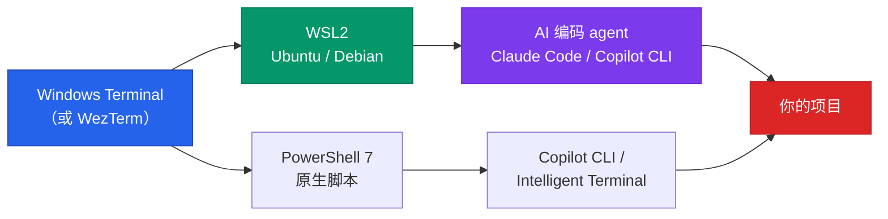
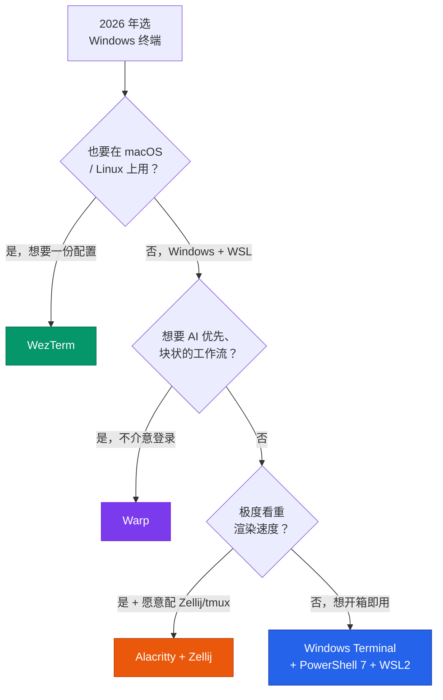

+++
date = '2026-06-22T12:00:00+08:00'
draft = false
title = '2026 Windows 终端推荐：6 款横评与选型决策'
description = '2026 年 Windows 终端到底该用哪个？Windows Terminal、WezTerm、Alacritty、Warp、PowerShell 7 全面横评，含 WSL 与 Claude Code 配合场景，附选型决策树，帮你按速度、WSL 和 AI 编码需求一次选对终端。'
toc = true
tags = ['Windows Terminal', 'WezTerm', 'Terminal', 'Dev Tools', 'WSL']
keywords = ['windows 终端推荐', 'windows 好用的终端', 'windows terminal 推荐 2026', 'windows 命令行工具', 'windows 终端 vs wezterm', 'wsl 终端', 'warp 终端 windows']

[[params.faqItems]]
question = "2026 年 Windows 终端推荐用哪个？"
answer = "对大多数开发者，2026 年 Windows 最好用的终端就是 Windows Terminal + PowerShell 7 + WSL2 这套默认组合——它现在原生集成了 GitHub Copilot CLI 和 Intelligent Terminal。想要更快的 GPU 渲染和跨平台一致体验就上 WezTerm，想要 AI 块状交互就试 Warp。"

[[params.faqItems]]
question = "Windows Terminal 和 WezTerm 哪个好？"
answer = "Windows Terminal 胜在 WSL 集成、Copilot CLI 和 quake 模式，是更稳的默认；WezTerm 胜在渲染更快、内置多路复用器（不用装 tmux）、Windows/macOS/Linux 一份 Lua 配置全平台通用。如果你在多个操作系统间切换，选 WezTerm。"

[[params.faqItems]]
question = "Warp 终端支持 Windows 了吗？"
answer = "支持。Warp 于 2026 年 5 月推出 Windows 预览版，把 Agent Mode、块状界面和 AI 命令生成带到了 Windows。但它需要登录账号，且和 Windows Terminal 是两类不同的工具——适合 AI 驱动的工作流，不适合当轻量、离线的日常默认终端。"

[[params.faqItems]]
question = "WSL 用什么终端最好？"
answer = "2026 年 WSL2 最好用的终端是 Windows Terminal。它能自动识别已安装的 Linux 发行版，每个发行版单独一个 tab 或分屏，Unicode、GPU 渲染、配置文件都比老式控制台强。如果你偏好内置多路复用器，WezTerm 配 WSL 也很好。"

[[params.faqItems]]
question = "2026 年还需要装 PowerShell 7 吗？"
answer = "只要你在 Windows 上写脚本就需要。PowerShell 7.4.6+ 是 AI Shell 和 Copilot 集成要求的版本，它跨平台、更快，远好于系统自带的老版 Windows PowerShell 5.1。用 WinGet 单独安装，并设为 Windows Terminal 默认配置文件。"
+++

国内开发者选 Windows 终端时最大的误区，是把系统自带的 Windows Terminal 当成"凑合能用、迟早要换掉"的入门货。两年前这么说还算成立，2026 年这个判断已经反过来了。过去一年微软把 Windows Terminal 改造成了一个 AI 原生的命令行——原生集成 GitHub Copilot CLI 和 Intelligent Terminal——顺手挖了一条 WezTerm、Alacritty 甚至 Warp 都没有的护城河。如果你在搜 **windows 终端推荐**，对多数人来说最诚实的答案是：你想要的那个终端，大概率已经装在系统里了。

但"大概率"这三个字里藏着例外。确实有该换终端的理由——跨平台一致、极致渲染速度、AI 优先的工作流——也确实有坑，比如看到 Alacritty 跑分第一就装来当日用，结果发现它连 tab 都没有。这篇文章把 Windows 上真正值得考虑的 5 个终端排个序，讲清楚每个到底适合谁，以及更重要的——谁**不该**用它。

<!--more-->

## 2026 年 Windows 终端的格局确实变了

过去很多年，Windows 终端这个话题很简单：Windows Terminal"够用"，好玩的东西都在 Linux 和 macOS，极客们一边用一边抱怨。2026 年有三件事打破了这个僵局。

第一，WSL2 从"能跑 Linux 的玩具"彻底变成了一等公民开发环境。"Windows 上编辑、Linux 里运行"如今是大量 Web 和 AI 开发者的默认工作流，这让**终端怎么跟 WSL 打交道**成了选型第一标准——比字体、比配色、比跑分数字都重要。国内开发者尤其如此，很多人干脆把整个开发环境搬进了 WSL2 里的 Ubuntu。

第二，AI 进了命令行。微软在 Build 2026 上发布了 Intelligent Terminal，命令报错时会自动把上下文喂给 agent 面板，并内联提供 GitHub Copilot CLI。与此同时，风投背景的 AI 原生终端 Warp 也在 2026 年 5 月上了 Windows 预览版。终端不再是一个被动的文本框，而成了一个跑 agent 的地方。

第三，"GPU 快速终端"这个品类收敛了。Alacritty 和 WezTerm 是成熟的 Rust 选项；而 2025 年最火的 Ghostty，截至 2026 年年中**官方仍然没有 Windows 原生构建**——只有 Winghostty 这类社区项目在补位。我特意点出这一点，是因为不少"2026 终端推荐"清单会让你在 Windows 上装 Ghostty，这条建议要么是错的，要么是在悄悄把你引向一个非官方的第三方构建。Windows 上暂时别追它。

所以 2026 年的格局是 5 个正经选手，选谁完全取决于你更看重三件事里的哪一件：WSL/AI 集成、跨平台一致、还是纯粹的速度。

## Windows Terminal：悄悄赢了的默认选项

我想让你带走的核心判断是：2026 年的 Windows Terminal 不是那个你"将就用"的终端，而是优势面最宽的那个，举证责任在替代品这边。

先说 WSL。Windows Terminal 会自动发现每一个已安装的 Linux 发行版，给每个都配一个 profile，于是在 Ubuntu、PowerShell 7 会话、和原生 `cmd` 之间切换只需要点一个 tab。Windows 上没有别的终端能做到这么干净的集成，因为没有别的终端是由那个同时开发 WSL 的公司做的。如果你的日常就是"VS Code 里写代码、WSL2 的 Ubuntu 里跑"，这一项集成的价值就超过任何 20 倍的渲染跑分。

再说 AI 层，这是大多数对比文章漏掉的部分。GitHub Copilot CLI 现在内联在 Windows Terminal 里，微软的 Intelligent Terminal 会在命令失败时自动浮现上下文，并让你在专门的 agent 面板里跑修复。值得注意的是，早先的 AI Shell 项目在 2026 年 1 月已经归档——微软把这块能力直接折进了终端本身，而不是做成一个外挂模块。这是个很明确的信号：AI 能力现在是终端原生的，不是你去别处装的插件。如果你的日常主力是 AI 编码 agent——比如我在[《Claude Code 完全指南》](/posts/ai/2026-02-28-claude-code-complete-guide/)里详细写过的那套 Claude Code 工作流——把它跑在一个同时能读懂你报错命令的终端里，是实打实的便利。

它诚实的短板是渲染速度。在 vtebench 滚动测试里，Windows Terminal 大约要 2460ms，而 Alacritty 只要 106ms 左右——纸面上 20 倍的差距。这个数字是真的，同时也基本和日常无关：除非你经常 `cat` 巨大的文件，或者跑那种每秒吐几万行的工具，否则你根本感知不到。我把 Windows Terminal 当日用主力，正常写代码、跑 git、跑构建时从没觉得"这也太慢了"。跑分延迟和体感延迟是两回事，卖你 Rust 终端的人心里都清楚。

**该用 Windows Terminal 如果：** 你用 WSL、想要 Copilot CLI 和 quake 模式，或者你就想要那个 90% 的 Windows 开发者都该用的最省事配置。**别用如果：** 你需要不依赖 tmux 的内置多路复用器，或者你要在三个操作系统间用同一份配置。

## WezTerm：给高级用户的跨平台升级

WezTerm 是我推荐给"真正用腻了 Windows Terminal"的人的终端——不是自以为用腻了，而是撞上了某个具体的墙。它是 Rust 写的 GPU 加速终端，带着一个 Windows Terminal 和 Alacritty 都没有开箱能力：一个真正的单进程多路复用器，带可搜索的回滚缓冲、分屏、workspace 和会话管理，全部用 Lua 配置。

杀手锏是一致性。WezTerm 在 Windows、macOS、Linux 上表现完全一样，由同一份 `~/.wezterm.lua` 驱动。换机器时——公司的 Windows 台式、家里的 Mac——你拿到一个逐字节一致的终端，快捷键都不用重学。这是 Windows Terminal 结构上做不到的、持久的优势，因为 Windows Terminal 设计上就只能跑在 Windows。如果你读过我的[《macOS 终端横评》](/posts/macos/2025-01-22-terminal-tools-guide/)、在 Mac 上配了一套喜欢的环境，WezTerm 就是把这套原样搬到 Windows 的办法。

内置多路复用器的意义也比听起来大。在 Windows Terminal 上，想要持久会话和复杂分屏布局，你得在 WSL 里用 tmux——这能用，我在[《面向 AI 开发的 tmux 指南》](/posts/ai/2026-03-03-tmux-guide-ai-development/)里也讲过。WezTerm 把这个能力原生烤进去了，于是你在原生 Windows shell 上也能有分屏和持久 workspace，不止 WSL 里能用。对那种要 SSH 到一堆机器的活儿，这是实打实的体验提升。

代价是配置。WezTerm 要你写 Lua，没有 Windows Terminal 那种丰富的设置界面，你改的是一个配置文件，能力越强学习曲线越陡。对很多人这是特性，对另一些人这是一个不太想花的周末下午。

**该用 WezTerm 如果：** 你在多个操作系统间工作、想全平台一份 Lua 配置、且看重内置多路复用器胜过 WSL 里的 tmux。**别用如果：** 你完全活在 WSL 和 Windows 里（Windows Terminal 已经够了），或者你讨厌配置文件驱动的工具。

## Alacritty：最快，但有个星号

Alacritty 只回答一个问题：我能跑的、延迟最低最快的终端是哪个？它是 OpenGL/GPU 终端，功能刻意做得极简，跑分轻松夺冠——上面那个 106ms 的 vtebench 数字就是它。如果你的活儿真的涉及往屏幕上狂刷海量文本，它可测量地是最好的工具。

但这份极简就是那个星号，而且是个大星号。Alacritty 没有 tab、没有分屏、没有滚动条、没有设置界面——这全是设计使然。维护者故意剔除这些功能，因为它们会破坏对速度的偏执。这不是你能靠配置绕过去的疏漏，这是它的哲学。

所以用 Alacritty 的正确姿势是：永远别单独用。真正的组合是 Alacritty 当快速渲染层，加一个多路复用器——Zellij 或 tmux——去干所有 tab、分屏、会话的活。在 WSL 里，"Alacritty + Zellij"确实很香：你拿到最快的渲染速度和一个现代的多路复用器界面。但这是两个要装、要学、要配的工具，而且你要是跳过多路复用器，一小时内就会难受到崩溃，因为你连开第二个 tab 都做不到。

我常看到的错误是：有人读到 Alacritty"跑分第一"，装来当唯一终端，然后因为基本的体验功能全缺而弃坑。Alacritty 是一个组件，不是一套完整的终端体验。

**该用 Alacritty 如果：** 你要极致速度、乐意配 Zellij 或 tmux、且欣赏极简主义。**别用如果：** 你想要 tab 和分屏开箱即用，或者你不愿意再跑一个多路复用器。

## Warp：AI 原生终端（一个不同物种）

Warp 于 2026 年 5 月上了 Windows 预览版，是这份清单里真正最不一样的选项。它不是"更快的 Windows Terminal"，而是对"终端是什么"的重新设计。输入和输出被组织成一个个可导航、可分享、可重跑的 block；内置 AI 命令生成；Agent Mode 能带 step-by-step 审批地执行多步任务，用的是你的 shell、保存的命令和代码库上下文。

对某类工作流，这非常爽。如果你经常问"这个命令行操作怎么做"、贴一段报错让它给修复方案、或者想通过 Warp Drive 保存并分享团队 Workflow，Warp 在做别人不做的事。它是最围绕 AI 驱动和协作工作打造的终端，如果那就是你的日常，它当得起这个位置。这一块 Warp 在概念上也和 agent 驱动的浏览器/shell 自动化重叠——我在[《Claude Code 浏览器自动化》](/posts/ai/2026-01-28-claude-code-browser-automation/)里探讨过这个方向。

但我想直说为什么我不把它排成默认。Warp 要账号、要登录——这是实打实的摩擦，对某些团队还是个合规问题：终端上下文流去了哪里。它的块状界面用来探索很愉快，但对一个只想要快速、安静、离线提示符的人来说会显得笨重。而关键在于，2026 年你**不需要换终端就能在命令行里拿到 AI**——微软已经把 Copilot CLI 直接塞进了 Windows Terminal。Warp 是个*不同物种*，不是 Windows Terminal 的平替。你该因为想要它的 block-and-agent 模型去用它，而不是因为你以为"终端里要 AI 就得换成它"。

**该用 Warp 如果：** 你想要 AI 优先、块状的工作流和团队 Workflow 共享，且不介意登录。**别用如果：** 你要轻量、离线、免账号的默认终端，或者块状界面碍着你了。

## PowerShell 7、WSL 与终端真正重要的地方

这里有个能重新框定整场对比的判断：终端是那扇窗，但窗后面的 shell 和环境才干了大部分活。选对终端的重要性远不如把它跟对的 shell 和 WSL 环境配起来——而这恰恰是大家最容易在终端上用力过猛、在根基上投入不足的地方。

shell 这头，2026 年你只要在 Windows 上写脚本，就装 PowerShell 7 并设成默认 profile——别凑合用系统自带那个老版 Windows PowerShell 5.1。PowerShell 7 跨平台、明显更快，而且 7.4.6+ 是 AI Shell 和 Copilot 集成能跑起来的必需版本。这是一个两分钟的 WinGet 安装，很多人跳过了，然后纳闷自己的 AI 工具为什么抽风。

环境这头，WSL2 是当下多数开发真正干活的地方。你 Windows 终端的职责就是当一扇干净、快速、Unicode 正确的窗，照向你的 Linux 发行版——而这正是 Windows Terminal（和 WezTerm）擅长的。这一层也是你 AI 编码 agent 住的地方：在 WSL 里、在一个好终端下跑 Claude Code、Codex CLI 或 Copilot CLI，是 2026 年的标准配置。如果你在搭这套栈，我那篇[《终端 AI 编码工具 2026 横评》](/posts/ai/2026-04-14-terminal-ai-coding-tools-2026-comparison/)讲了终端搞定之后该选哪个 agent。

下面这张图就是我实际会推荐给 2026 年 Windows 开发者的组合——终端、shell、环境、AI agent 作为一整套栈：

## 选型决策：Windows 终端到底该选哪个

这篇文章你只带走一样东西的话，就带走这张决策树。选型不是看哪个终端功能最多，而是让终端匹配你真正看重的东西。

同一份判断，做成一张可以截图的速查表：

| 终端 | 最适合 | 速度 | 多路复用 | 内置 AI | 跨平台 | 结论 |
|------|--------|------|----------|---------|--------|------|
| **Windows Terminal** | WSL 用户、多数开发者 | 好 | 无（配 tmux） | 有（Copilot CLI） | 仅 Windows | 悄悄赢了的默认 |
| **WezTerm** | 多系统高级用户 | 快 | 有（内置） | 无 | 是（Lua 配置） | 最佳升级 |
| **Alacritty** | 速度极致党 | 最快 | 无 | 无 | 是 | 是组件不是终端 |
| **Warp** | AI 优先、团队协作 | 好 | 块状 | 有（Agent Mode） | 是 | 不同物种 |
| **PowerShell 7** | 写脚本（是 shell 不是终端） | — | — | AI Shell / Copilot | 是 | 无论如何都装 |

## 两个最费时间的坑

有两个错误最坑人，而且都来自把跑分和热度当成购买建议。

第一个是**因为 Alacritty 跑分第一就装来当唯一终端**。你会得到一个渲染快到飞起、却没有 tab 没有分屏的东西，一小时内就开始跟它较劲。要用 Alacritty，就从第一天起认命上"Alacritty + Zellij"整套；否则就用 Windows Terminal，然后再也不用惦记它。

第二个是**没必要换终端却为了 AI 换了**。有人看到 Warp 的 Agent Mode 就以为 Windows Terminal 在 AI 上过时了。并没有——2026 年 Copilot CLI 和 Intelligent Terminal 是 Windows Terminal 原生的。换 Warp 是因为你专门想要它的 block-and-agent 模型，不是因为你相信那是拿到 AI 命令行的唯一路。还有，你要是在 Windows 上，别搭进去一个周末折腾 Ghostty——官方还没有 Windows 构建，第三方构建也都是非官方的。

我的具体建议：如果你是 Windows 开发者、拿不定主意，就用 Windows Terminal，把 PowerShell 7 设成默认 profile，Linux 的活儿丢给 WSL2。把本来要花在评测终端上的时间，花在这套栈里配好你的 AI 编码 agent 上——2026 年真正的生产力在那儿。

## 延伸阅读

- [2025 年终端模拟器横评：23 款全平台工具对比](/posts/macos/2025-01-22-terminal-tools-guide/) —— 跨平台姊妹篇，含 macOS 与 Linux 选择
- [面向 AI 开发的 tmux 指南](/posts/ai/2026-03-03-tmux-guide-ai-development/) —— 和 Windows Terminal、Alacritty 搭配的多路复用器
- [终端 AI 编码工具 2026 横评](/posts/ai/2026-04-14-terminal-ai-coding-tools-2026-comparison/) —— 终端搞定后该选哪个 AI agent
- [Claude Code 完全指南](/posts/ai/2026-02-28-claude-code-complete-guide/) —— 我在 WSL 里跑的 AI 编码 agent
- [Claude Code 浏览器自动化](/posts/ai/2026-01-28-claude-code-browser-automation/) —— 命令行里的 agent 驱动自动化
