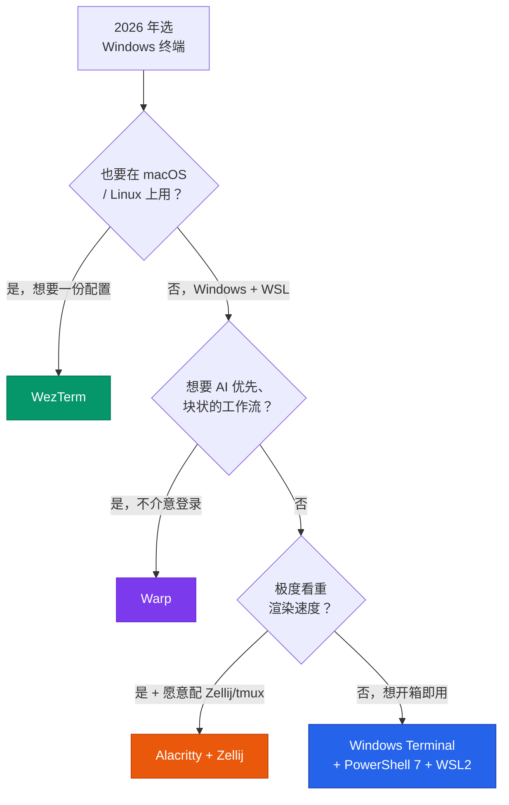
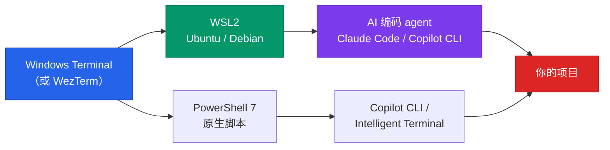

+++
date = '2026-06-22T12:00:00+08:00'
draft = false
title = '2026 Windows 终端推荐：5 款横评与选型决策'
description = '2026 年 Windows 终端推荐首选 Windows Terminal + PowerShell 7 + WSL2；跨平台选 WezTerm，极致速度选 Alacritty + Zellij，AI 工作流选 Warp。附选型决策树与速查表，帮你按需求一次选对。'
toc = true
tags = ['Windows Terminal', 'WezTerm', 'Terminal', 'Dev Tools', 'WSL']
keywords = ['windows 终端推荐', 'windows 好用的终端', 'windows terminal 推荐 2026', 'windows 命令行工具', 'windows 终端 vs wezterm', 'wsl 终端', 'warp 终端 windows']

[[params.faqItems]]
question = "2026 年 Windows 终端推荐用哪个？"
answer = "对大多数开发者，2026 年 Windows 最好用的终端就是 Windows Terminal + PowerShell 7 + WSL2 这套默认组合——它现在原生集成了 GitHub Copilot CLI 和 Intelligent Terminal。想要更快的 GPU 渲染和跨平台一致体验就上 WezTerm，想要 AI 块状交互就试 Warp。"

[[params.faqItems]]
question = "Windows Terminal 和 WezTerm 哪个好？"
answer = "Windows Terminal 胜在 WSL 集成、Copilot CLI 和 quake 模式，是更稳的默认；WezTerm 胜在渲染更快、内置多路复用器（不用装 tmux）、Windows/macOS/Linux 一份 Lua 配置全平台通用。如果你在多个操作系统间切换，选 WezTerm。"

[[params.faqItems]]
question = "Warp 终端支持 Windows 了吗？"
answer = "支持。Warp 于 2026 年 5 月推出 Windows 预览版，把 Agent Mode、块状界面和 AI 命令生成带到了 Windows。但它需要登录账号，且和 Windows Terminal 是两类不同的工具——适合 AI 驱动的工作流，不适合当轻量、离线的日常默认终端。"

[[params.faqItems]]
question = "WSL 用什么终端最好？"
answer = "2026 年 WSL2 最好用的终端是 Windows Terminal。它能自动识别已安装的 Linux 发行版，每个发行版单独一个 tab 或分屏，Unicode、GPU 渲染、配置文件都比老式控制台强。如果你偏好内置多路复用器，WezTerm 配 WSL 也很好。"

[[params.faqItems]]
question = "2026 年还需要装 PowerShell 7 吗？"
answer = "只要你在 Windows 上写脚本就需要。PowerShell 7.4.6+ 是 AI Shell 和 Copilot 集成要求的版本，它跨平台、更快，远好于系统自带的老版 Windows PowerShell 5.1。用 WinGet 单独安装，并设为 Windows Terminal 默认配置文件。"
+++


这份 2026 年 Windows 终端推荐可以浓缩成一句话：用 Windows Terminal，把 PowerShell 7 设成默认 profile，Linux 的活交给 WSL2。九成开发者的最优解就是这套，而且它大概率已经装在你机器上了。

唯一值得背下来的升级规则：同时在 Windows、macOS、Linux 上干活、想要一份配置走遍全平台的，换 WezTerm。其余的切换——为 Warp 的 AI agent 工作流、为 Alacritty 的极致速度——都是特例，这篇文章两分钟内就能告诉你，你算不算特例。

两年前这么推荐自带终端，多少有点敷衍；现在不是了。过去一年微软把 Windows Terminal 改造成了 AI 原生命令行——GitHub Copilot CLI 和 Intelligent Terminal 都已原生内置——顺手挖出一条 WezTerm、Alacritty 甚至 Warp 都没有的护城河。举证责任已经反转：该自证的是替代品。

<!--more-->

## Windows 终端推荐速查：决策树 + 一张表

选型文习惯把结论埋在最后，这篇反着来：图放最前面。先在决策树里走一遍自己的路径，剩下的正文当参考手册，只看你落在的那个分支就行。



同一份判断做成速查表，可以直接截图存下：

| 终端 | 最适合 | 速度 | 多路复用 | 内置 AI | 跨平台 | 结论 |
|------|--------|------|----------|---------|--------|------|
| **Windows Terminal** | WSL 用户、多数开发者 | 好 | 无（配 tmux） | 有（Copilot CLI） | 仅 Windows | 悄悄赢了的默认 |
| **WezTerm** | 多系统高级用户 | 快 | 有（内置） | 无 | 是（Lua 配置） | 最佳升级 |
| **Alacritty** | 速度极致党 | 最快 | 无 | 无 | 是 | 是组件不是终端 |
| **Warp** | AI 优先、团队协作 | 好 | 块状 | 有（Agent Mode） | 是 | 不同物种 |
| **PowerShell 7** | 写脚本（是 shell 不是终端） | — | — | AI Shell / Copilot | 是 | 无论如何都装 |

名单里故意少了一个名字：Ghostty。这个 2025 年的顶流，截至 2026 年年中仍然没有官方 Windows 构建，只有 Winghostty 这类社区项目在补位。

所以任何让你在 Windows 上装 [Ghostty](https://ghostty.org/) 的推荐清单，要么是错的，要么在悄悄把你引向一个非官方的第三方构建。Windows 上暂时别追它。

不管你落在哪个分支，安装都是一行 WinGet 的事，不用满网找安装包：

```powershell
winget install Microsoft.WindowsTerminal   # 默认首选
winget install Microsoft.PowerShell        # PowerShell 7（不是老版 5.1）
wsl --install -d Ubuntu                    # WSL2 + Ubuntu
winget install wez.wezterm                 # 跨平台升级选项
winget install Alacritty.Alacritty         # 速度党（记得配 Zellij/tmux）
winget install Warp.Warp                   # AI 原生，需要账号
```

## 2026 年 Windows 终端格局变了什么

很多年里这个话题很简单：Windows Terminal 够用，好玩的都在 Linux 和 macOS，极客一边用一边骂。2026 年有三件事打破了僵局，上面那张表的排序全由它们决定。

第一，WSL2 从玩具变成了默认开发环境。「Windows 上编辑、Linux 里运行」如今是大量 Web 和 AI 开发者的日常，**终端怎么跟 WSL 打交道**因此成了选型第一标准——排在字体、配色和跑分前面。

国内开发者感受尤其明显：不少人干脆把整个开发环境搬进了 WSL2 里的 Ubuntu，Windows 这头只留一扇窗。

第二，AI 进了命令行。微软在 Build 2026 上发布 Intelligent Terminal，命令一报错就自动把上下文喂给 agent 面板、内联提供 GitHub Copilot CLI；风投背景的 AI 原生终端 Warp 也在 2026 年 5 月上了 Windows 预览版。终端不再是被动的文本框，而成了跑 agent 的地方。

第三，「GPU 快速终端」这个品类收敛了。Rust 阵营里成熟的只剩 Alacritty 和 WezTerm，这也是榜单上只有它们俩打速度牌的原因。

## Windows Terminal：赢下默认位的那个

先立核心判断：2026 年的 [Windows Terminal](https://github.com/microsoft/terminal) 不是你「将就用」的终端，而是优势面最宽的那个——每个替代品都得在某条具体的轴上赢过它，才配占用你的时间。

WSL 是它碾压的地方。Windows Terminal 自动发现每一个已安装的 Linux 发行版、各配一个 profile，Ubuntu、PowerShell 7 会话、原生 `cmd` 各占一个 tab。没有别的终端能集成得这么干净，因为没有别的终端出自那家同时开发 WSL 的公司。

如果你的日常就是「VS Code 里写、WSL2 的 Ubuntu 里跑」，光这一项的价值就压过任何 20 倍的渲染跑分。

AI 层是多数对比文漏掉的部分。GitHub Copilot CLI 已经内联在 Windows Terminal 里；Intelligent Terminal 会在命令失败时自动浮出上下文，让你在专门的 agent 面板里跑修复。

一个更值得注意的信号：老的 AI Shell 项目在 2026 年 1 月已归档，微软把这块能力直接折进了终端本身。AI 现在是终端原生的，不是你去别处装的插件。

就算你不用 Copilot，这一层也有意义。如果你的主力是 AI 编码 agent——比如我在[《Claude Code 完全指南》](/zh/posts/ai/2026-02-28-claude-code-complete-guide/)里写过的那套工作流——把它跑在一个还能读懂你报错命令的终端里，是实打实的便利。

它诚实的短板是渲染速度。vtebench 滚动测试里 Windows Terminal 约 2460ms，Alacritty 约 106ms，纸面 20 倍差距。这个数字是真的，也基本和日常无关：除非你经常 `cat` 巨大文件、或者跑每秒吐几万行的工具，你感知不到。

我拿 Windows Terminal 当日常主力，写代码、跑 git、跑构建，从没有一次觉得「太慢」。跑分延迟和体感延迟是两回事，卖你 Rust 终端的人心里清楚。

**一句话结论**：用 WSL、想要 Copilot CLI 和 quake 模式、或者就想要最省事的配置，看到这里可以收工了。继续往下读只有两个理由：想要不依赖 tmux 的内置多路复用器，或者一份配置要在三个操作系统上通用。

## WezTerm：跨平台党的升级选项

[WezTerm](https://wezterm.org/) 是我留给「真撞了墙」的人的升级选项——不是感觉腻了想换，是撞上了具体的墙。

它是 Rust 写的 GPU 加速终端，带一样 Windows Terminal 和 Alacritty 都不开箱提供的东西：真正的单进程多路复用器——可搜索回滚、分屏、workspace、会话管理全都有，全部用 Lua 配置。

杀手锏是一致性。WezTerm 在 Windows、macOS、Linux 上行为完全一致，由同一份 `~/.wezterm.lua` 驱动；公司的 Windows 台式和家里的 Mac 之间切换，拿到的是逐字节相同的终端，快捷键都不用重学。

这是 Windows Terminal 结构上做不到的事——它设计上就只跑 Windows。如果你看过我的[《macOS 终端横评》](/zh/posts/macos/2025-01-22-terminal-tools-guide/)、在 Mac 上配好了一套喜欢的环境，WezTerm 就是把它原样搬上 Windows 的办法。

内置多路复用器的分量也比听上去重。Windows Terminal 里想要持久会话和复杂分屏，得进 WSL 跑 tmux——能用，我在[《面向 AI 开发的 tmux 指南》](/zh/posts/ai/2026-03-03-tmux-guide-ai-development/)里讲过怎么配。

WezTerm 把这个能力原生烤了进去：原生 Windows shell 上照样有分屏和持久 workspace，不局限在 WSL 里。要 SSH 到一堆机器的活儿，这是每天都能感到的提升。

代价是 Lua。它没有 Windows Terminal 那种设置界面，你改的是配置文件，能力越强、曲线越陡。对一部分人这就是乐趣本身；对另一部分人，这是一个不想搭进去的周六下午。

完全活在 Windows + WSL、又用不上多路复用器的人，不需要 WezTerm——这是这条推荐的诚实边界。

## Alacritty：最快，但带一个大星号

[Alacritty](https://alacritty.org/) 只回答一个问题：我能跑到的延迟最低的终端是哪个？它是 OpenGL/GPU 终端，功能刻意做到极简，跑分轻松夺冠——上面那个 106ms 的 vtebench 数字就是它的。如果你的活儿真要往屏幕上狂灌文本，它可测量地就是最好的工具。

星号就是这份极简，而且很大：没有 tab、没有分屏、没有滚动条、没有设置界面。这不是能靠配置绕过的疏漏——维护者故意剔除这些功能，因为它们会破坏对速度的偏执。这是哲学，不是路线图欠账。

所以 Alacritty 永远别单独用。正确的组合是它当快速渲染层，Zellij 或 tmux 干所有 tab、分屏、会话的活。WSL 里的「Alacritty + Zellij」确实很香：最快的渲染速度，配一个现代的多路复用器界面。

但那是两个要装、要学、要配的工具；跳过多路复用器，你一小时内就会崩溃——连第二个 tab 都开不出来。Alacritty 是组件，不是完整的终端体验。要么认下这对组合，要么别开始。

## Warp：另一个物种

[Warp](https://www.warp.dev/) 在 2026 年 5 月上了 Windows 预览版，是榜单里真正最不一样的选项。它不是「更快的 Windows Terminal」，而是对「终端是什么」的重新设计。

输入输出被组织成可导航、可分享、可重跑的 block；AI 命令生成内置；Agent Mode 能带逐步审批地执行多步任务，用的是你的 shell、存好的命令和代码库上下文。

对某类工作流这非常爽。经常问「这个命令行操作怎么写」、贴报错要修复方案、想用 Warp Drive 保存并分享团队 Workflow 的人，Warp 干的是别家都不干的事。

这个方向也和 agent 驱动的 shell / 浏览器自动化在概念上重叠——我在[《Claude Code 浏览器自动化》](/zh/posts/ai/2026-01-28-claude-code-browser-automation/)里探过这条路。

但它仍然当不了我的默认推荐。Warp 要账号、要登录——实打实的摩擦，对某些团队还是个合规问题：终端上下文流去了哪里。块状界面用来探索很愉快，只想要一个快速、安静、离线的提示符时就显得笨重。

更关键的是，2026 年你**不需要换终端就能在命令行里用上 AI**——微软已经把 Copilot CLI 直接塞进了 Windows Terminal。换 Warp 的理由应该是你想要它的 block-and-agent 模型，而不是以为这是唯一路径。

## PowerShell 7 和 WSL2：终端底下那层才是重点

终端是窗，窗后面的 shell 和环境才干大部分活。把这两层配对，比纠结选哪个模拟器重要得多——而这恰恰是大家在模拟器上用力过猛、在根基上投入不足的地方。

shell 这头：2026 年只要还在 Windows 上写脚本，就装 [PowerShell 7](https://github.com/PowerShell/PowerShell) 并设成默认 profile，别凑合系统自带的老版 Windows PowerShell 5.1。

PowerShell 7 跨平台、明显更快，7.4.6+ 还是 AI Shell 和 Copilot 集成要求的版本。这是个两分钟的 WinGet 安装，很多人跳过，然后纳闷自己的 AI 工具为什么抽风。

环境这头：WSL2 是多数现代开发真正干活的地方。终端的职责就是当一扇干净、快速、Unicode 正确的窗，照向你的 Linux 发行版——这正是 Windows Terminal 和 WezTerm 擅长的。

这一层也是 AI 编码 agent 住的地方：在 WSL 里、在一个好终端下跑 Claude Code、Codex CLI 或 Copilot CLI，是 2026 年的标准配置。搭这套栈的话，我的[《终端 AI 编码工具 2026 横评》](/zh/posts/ai/2026-04-14-terminal-ai-coding-tools-2026-comparison/)讲了终端搞定之后该选哪个 agent。

下面是我真会在一台 Windows 开发机上配出来的完整栈——终端、shell、环境、AI agent 一套系统：



## 两个最烧时间的坑

两个最贵的错误，都来自把跑分和热度当成购买建议。

坑一：**因为 Alacritty 跑分第一就装来当唯一终端**。你会得到一个渲染快到飞起、却没 tab 没分屏的东西，一小时内就开始跟它较劲。要么第一天就认下 Alacritty + Zellij 整套，要么用 Windows Terminal，从此不再惦记。

坑二：**为了本来就有的 AI 换了终端**。有人看到 Warp 的 Agent Mode 就断定 Windows Terminal 在 AI 上过时了——并没有，2026 年 Copilot CLI 和 Intelligent Terminal 就是它的原生能力。

换 Warp 要冲着它的 block-and-agent 模型去，不是冲着「终端里有 AI」这个卖点。也别为 Ghostty 搭进去一个周末：官方 Windows 构建还是没有，第三方构建全是非官方的。

拿不定主意就照抄：Windows Terminal，PowerShell 7 设成默认 profile，Linux 的活丢给 WSL2。把本来要花在评测终端上的时间，拿去在这套栈里配好你的 AI 编码 agent——2026 年真正的生产力在那儿。

## 延伸阅读

- [2025 年终端模拟器横评：23 款全平台工具对比](/zh/posts/macos/2025-01-22-terminal-tools-guide/) —— 跨平台姊妹篇，含 macOS 与 Linux 选择
- [面向 AI 开发的 tmux 指南](/zh/posts/ai/2026-03-03-tmux-guide-ai-development/) —— 和 Windows Terminal、Alacritty 搭配的多路复用器
- [终端 AI 编码工具 2026 横评](/zh/posts/ai/2026-04-14-terminal-ai-coding-tools-2026-comparison/) —— 终端搞定后该选哪个 AI agent
- [Claude Code 完全指南](/zh/posts/ai/2026-02-28-claude-code-complete-guide/) —— 我在 WSL 里跑的 AI 编码 agent
- [Claude Code 浏览器自动化](/zh/posts/ai/2026-01-28-claude-code-browser-automation/) —— 命令行里的 agent 驱动自动化
