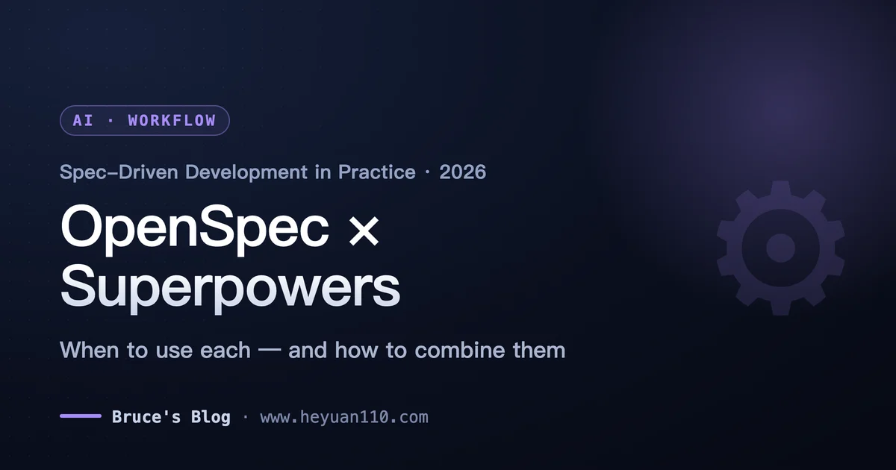
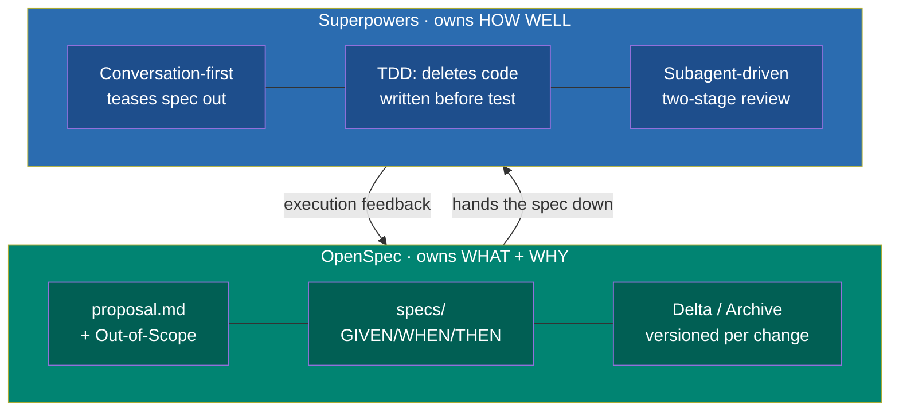
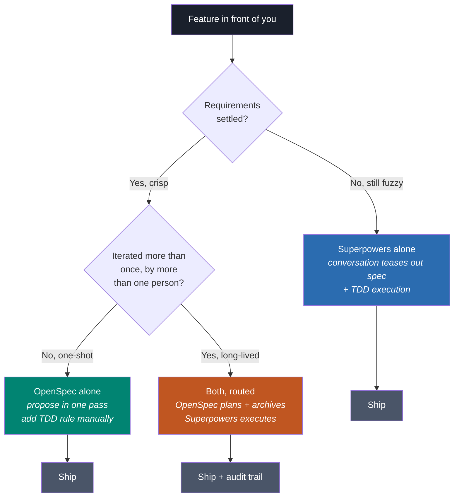
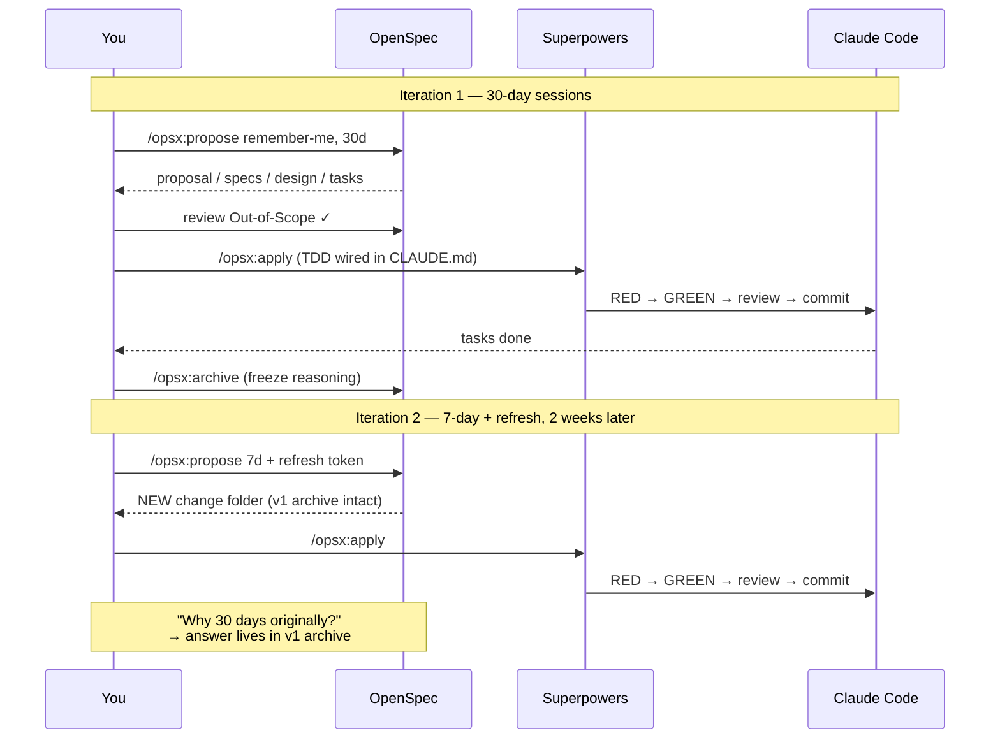

+++
date = '2026-06-28T13:00:00+08:00'
draft = false
title = 'OpenSpec vs Superpowers: The Real Spec-Driven Workflow'
description = 'OpenSpec vs Superpowers is the wrong question. Get the decision rule for when to use each, plus the CLAUDE.md wiring that makes them cooperate.'
toc = true
tags = ['Claude Code', 'OpenSpec', 'Superpowers', 'AI Development', 'Spec-Driven Development']
keywords = ['openspec superpowers', 'openspec vs superpowers', 'spec driven development claude code', 'openspec workflow', 'superpowers plugin claude code', 'claude code spec driven workflow 2026']

[[params.faqItems]]
question = "OpenSpec vs Superpowers: which should I use?"
answer = "They operate at different layers, so it is rarely either/or. Use Superpowers as your daily driver — it is conversation-first and owns execution discipline (TDD, subagents, code review). Add OpenSpec only when a feature will be re-iterated across multiple sessions or by more than one person, because its Delta/Archive model versions the decision history that Superpowers overwrites."

[[params.faqItems]]
question = "Do OpenSpec and Superpowers automatically work together?"
answer = "No. They are two independent systems that do not auto-chain. If you install both without routing rules, both planning systems fire on the same feature and produce out-of-sync docs within an hour. You must add explicit routing to CLAUDE.md: send planning to /opsx:propose, and spell out that /opsx:apply must follow TDD and code review."

[[params.faqItems]]
question = "What is spec-driven development in Claude Code?"
answer = "Spec-driven development (SDD) means the AI writes code against an agreed specification instead of improvising from a one-line prompt. In Claude Code, OpenSpec captures that spec as versioned files (proposal, specs, design, tasks), while Superpowers teases the spec out of a conversation first and then enforces test-first execution."

[[params.faqItems]]
question = "Is OpenSpec or Superpowers better for a solo developer?"
answer = "For solo work, start with Superpowers alone. Its conversation-first planning and TDD enforcement add value on any project size, and it persists a design doc and plan to disk. You only feel OpenSpec's advantage when you iterate on the same feature three or four times and need to reconstruct why an earlier decision was made."

[[params.faqItems]]
question = "Does spec-driven development actually improve AI code quality?"
answer = "It improves consistency and reduces rework, but it does not fix the deeper problem raised on Hacker News — agent adherence and laziness. Specs constrain what the agent should build; they do not guarantee it follows them. That is exactly why Superpowers pairs specs with hard execution rules like deleting code written before its test."
+++



## OpenSpec vs Superpowers: You're Asking the Wrong Question

Search traffic tells a clear story: people type "openspec vs superpowers" expecting a winner. After running both across real projects for months, my honest answer is that the versus framing is a trap. These tools do not compete for the same job any more than a blueprint competes with a site foreman. One decides *what* gets built and preserves *why*; the other decides *how well* it gets built and refuses to let the agent cut corners. Picking "the better one" is like asking whether a compiler or a linter is better — they live at different layers of the same pipeline.

I wrote the [full triple-stack breakdown of Claude Code, OpenSpec and Superpowers](/posts/ai/2026-04-09-claude-code-openspec-superpowers/) earlier this year, and it answered "what are these tools and is running all three overkill." This piece is the sequel that answers the question people actually keep searching for: given a real feature in front of you, *which one do you reach for, and how do you wire them so they cooperate instead of fighting?* If you want installation and the layer theory, read the mother article first. Here I assume you have both installed and want the working loop.

The data backs up why this cluster matters. As of mid-2026, [Superpowers](https://github.com/obra/superpowers) sits at roughly 249,000 GitHub stars and — this is the part most comparisons miss — it is no longer a Claude-only plugin. It now installs into Codex, Cursor, Antigravity, Copilot CLI, Kimi, OpenCode and more. It stopped being a plugin and became a methodology. [OpenSpec](https://openspec.dev/) sits at roughly 59,000 stars, deliberately narrower, focused on one thing: keeping implementation intent out of ephemeral chat history and in versioned files.

## The Layer Map: What Each Tool Actually Owns

Before any decision rule makes sense, you have to see the two tools on a single axis. The mistake I see repeated in every "vs" post is comparing them feature-by-feature as if they were rival editors. They are not on the same row of the table — they are on different rows.

OpenSpec owns the **artifact layer**. Its output is a set of files: `proposal.md` (including the critical Out-of-Scope section), a `specs/` directory of GIVEN/WHEN/THEN behavior, `design.md` for the reasoning behind choices, and `tasks.md` as the checklist. Its unique power is not that it writes these files — Superpowers writes design docs too — it is the *Delta/Archive model*. Every change lives in its own versioned folder and gets archived on completion, so three iterations later you can still reconstruct why version 1 chose bcrypt and version 2 switched to argon2. That history is the thing nothing else on this list preserves.

Superpowers owns the **behavior layer**. It does not hand you a template to fill in. It opens a conversation — "What are you really trying to do? Who is the user? What are the constraints?" — and teases the spec out of that dialogue. Then it enforces execution: true red/green TDD, subagent-driven development where independent agents work through each task with a two-stage review, and the notorious rule that any implementation written before its test gets *deleted, not warned about*. Its value is discipline, not documentation.



Here is the reframe that changes how you choose: **OpenSpec is document-first, Superpowers is conversation-first.** That single difference explains almost every situational trade-off. When your requirements are already crisp, document-first is faster — you just write them down. When your requirements are fuzzy, conversation-first is faster, because the dialogue does the discovery work that a blank template cannot. So the real question was never "which tool is better" but "how settled are my requirements right now?"

## The Decision Rule: When OpenSpec, When Superpowers, When Both

I resisted writing a decision tree for a long time because "it depends" felt more honest. But "it depends" is useless when you have a feature in front of you at 2pm and need to start. So here is the rule I actually follow, reduced to the two variables that matter: **how settled are the requirements, and how many times will this feature be touched?**

If requirements are fuzzy and it is a one-shot build, use Superpowers alone. Its conversation-first brainstorming is literally designed for the case where you cannot write the spec yet, and its TDD keeps a throwaway from becoming a liability. This is my default for probably 70% of daily work. Do not reach for OpenSpec here — writing a document-first spec for requirements you have not thought through yet is the single most common way people waste an hour and produce a spec they immediately rewrite.

If requirements are settled and the feature is a single clean unit, OpenSpec alone is genuinely faster than talking it out. You already know what you want; `/opsx:propose` turns it into structured artifacts in one pass, and you skip the Socratic questioning. But — and this is the honest edge case the "vs" posts skip — you lose Superpowers' execution discipline. So OpenSpec-alone only makes sense if you are comfortable reviewing the code yourself, or if you add TDD rules to CLAUDE.md manually.

The combination earns its overhead in exactly one quadrant: **a feature that will be iterated more than once, by more than one person, over more than one session.** That is where OpenSpec's Delta/Archive stops being theoretical. When a teammate reopens the feature in three weeks and asks "why is the session TTL 30 days?", the archived design delta answers instantly. Superpowers alone would have overwritten that reasoning on the next brainstorm.



## The Combined Loop in Practice: One Feature, Two Iterations

Theory is cheap. Here is the actual rhythm when you run both on a feature that gets revised — the case where the combination pays off. Say you are building a "remember me" login option, then two weeks later product decides the session length was wrong. This is where the two-tool loop shines and where a single tool quietly loses information.

Iteration one starts with `/opsx:propose Add remember-me checkbox with 30-day sessions`. OpenSpec generates the four artifacts. You open `proposal.md` and check Out-of-Scope — confirming the agent did not silently add "remember this device" fingerprinting you never asked for. Because planning already happened here, you do *not* let Superpowers' brainstorming fire again (more on why in the wiring section). Then `/opsx:apply` runs, and — only because your CLAUDE.md says so — Superpowers' TDD takes over: each task writes a failing test first, implements, self-reviews, commits. You finish with `/opsx:archive`, which merges the spec delta and freezes iteration one's reasoning.

Two weeks later the requirement changes to 7-day sessions with a refresh token. You run `/opsx:propose` again — a *new* change folder, not an edit of the old one. The archived first iteration still exists. When your reviewer asks "wait, why did we ever pick 30 days?", the answer is one `git log` away in the archived delta. Superpowers alone cannot do this: its second brainstorming session overwrites the first design doc, and the original reasoning is gone. That is the entire argument for the combination, made concrete.



## Wiring Them So They Don't Fight

This is the part almost every tutorial skips, and it is where people get burned. **OpenSpec and Superpowers do not auto-chain.** Install both with no configuration and you get a collision: the next time you describe a feature, Superpowers' `brainstorming` skill fires automatically *and* you also want to run `/opsx:propose`. Now you have a `docs/superpowers/specs/` design doc and an `openspec/changes/<id>/proposal.md` for the same feature, drifting out of sync within the hour. I have done this. It is maddening because both files look authoritative.

The fix is convention, enforced in CLAUDE.md. You pick one planning system by writing it down, because neither tool detects the other. Here is the routing block I paste into every project that runs both — copy it, adjust the paths, and the collision disappears:

````markdown
## Spec-driven routing (OpenSpec + Superpowers)

- For any NEW feature, ALWAYS start with `/opsx:propose`.
  Do NOT run Superpowers `brainstorming` or `writing-plans` —
  OpenSpec owns the planning phase in this repo.
- When running `/opsx:apply`, ALWAYS follow TDD:
  write a failing test first, then implementation. Delete any
  implementation written before its test.
- During apply, run the code-review skill before every commit,
  and open an isolated git worktree for the change.
- `/opsx:archive` is ALWAYS the last action of a completed change.
  Never leave a change un-archived — the next session will
  re-read the stale spec and re-implement finished work.
````

That block does three things the tools will not do on their own. It routes planning to OpenSpec so Superpowers' brainstorming stops competing. It manually turns on Superpowers' execution skills during `apply` — because, critically, TDD, code review, and worktree isolation *do not activate automatically* inside `/opsx:apply`; they only fire if CLAUDE.md tells them to. And it makes archiving non-negotiable, which prevents the single most common OpenSpec bug: forgetting to archive, then watching the next session re-implement work that is already done.

If you only remember one sentence from this article, make it this: **the tools give you the parts, CLAUDE.md is the assembly instructions, and without it the parts actively interfere with each other.** For the deeper mechanics of how these skills load and trigger, my [Claude Code skills guide](/posts/ai/2026-01-08-claudecode-skill-guide/) and the [Superpowers deep dive](/posts/ai/2026-02-01-superpowers-deep-dive/) cover the underlying model.

## Five Pitfalls I Hit Running This for Real

The mother article listed generic pitfalls; these are the specific ones that bit me *while running the combined workflow*, which is a different and sharper set.

**Treating "openspec vs superpowers" as either/or.** I spent my first week trying to decide which one to standardize on, when the answer was "both, at different layers." If you find yourself arguing which tool wins, you have misdiagnosed the layers. Reread the layer map.

**Over-speccing fuzzy requirements.** OpenSpec's document-first model punishes you when requirements are not settled. I once ran `/opsx:propose` on a half-formed idea, got a confident four-file spec, and rewrote all four files twice. Superpowers' conversation would have surfaced the ambiguity before committing anything to disk. Match the tool to how settled the requirement is.

**Assuming `/opsx:apply` enforces TDD.** It does not. The first time I ran the combined loop without the CLAUDE.md routing block, apply happily wrote implementation with zero tests, and I only noticed at code review. OpenSpec plans; it does not discipline execution. That is Superpowers' job, and only if you wire it in.

**Subagent token blowup on large task lists.** Superpowers' subagent-driven development rebuilds context per agent, which is fantastic for isolation and expensive for a 40-task change. On big features I now split into multiple OpenSpec changes rather than one giant `tasks.md`, so each subagent run stays cheap. The Hacker News crowd is right that token cost is the real trade-off here.

**Believing specs fix agent laziness.** The sharpest critique in the [Hacker News SDD thread](https://news.ycombinator.com/item?id=48231575) was that the bottleneck is "agent adherence and laziness," not spec quality. A perfect spec does not guarantee the agent follows it. This is precisely why Superpowers' hard rules — delete pre-test code, two-stage review — matter more than OpenSpec's document polish. Specs constrain; they do not compel.

## My 2026 Verdict

If you take one decision framework away: **default to Superpowers, promote to the combination when a feature crosses the "iterated by more than one person, over more than one session" line.** Superpowers is the tool that improves any project — its conversation-first planning and TDD enforcement add value at every scale, and in 2026 it works across nearly every coding agent, not just Claude Code. That breadth alone makes it the safer default bet. OpenSpec is the specialist you add when decision traceability becomes a real, felt bottleneck — usually the moment a teammate asks "why did we build it this way?" and nobody can answer.

Do not run the full combination on everything; that is the over-engineering trap the mother article warned about, and it is still true. A 30-minute script does not need a Delta/Archive audit trail. But when you do combine them, the CLAUDE.md routing block is not optional garnish — it is the thing that turns two tools that ignore each other into one coherent loop. Get the routing right and you get the best of both layers: OpenSpec remembers *why*, Superpowers guarantees *how well*, and Claude Code does the typing. For the broader Claude Code workflow this all sits inside, my [complete Claude Code guide](/posts/ai/2026-02-28-claude-code-complete-guide/) is the map.

---

**Related Reading:**

- [Claude Code + OpenSpec + Superpowers: Triple Stack or Overkill?](/posts/ai/2026-04-09-claude-code-openspec-superpowers/)
- [Superpowers Deep Dive: The Skills Framework That Turns Claude Code into a Senior Engineer](/posts/ai/2026-02-01-superpowers-deep-dive/)
- [Claude Code Skills Guide: How Agent Skills Actually Work](/posts/ai/2026-01-08-claudecode-skill-guide/)
- [Claude Code Complete Guide: From Beginner to Expert](/posts/ai/2026-02-28-claude-code-complete-guide/)
