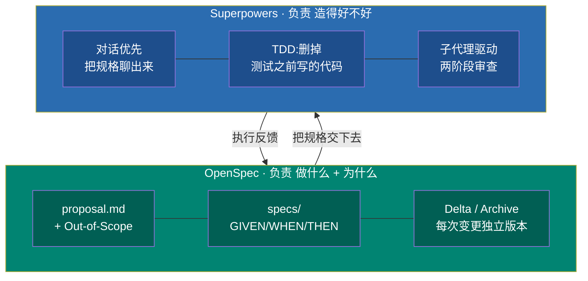
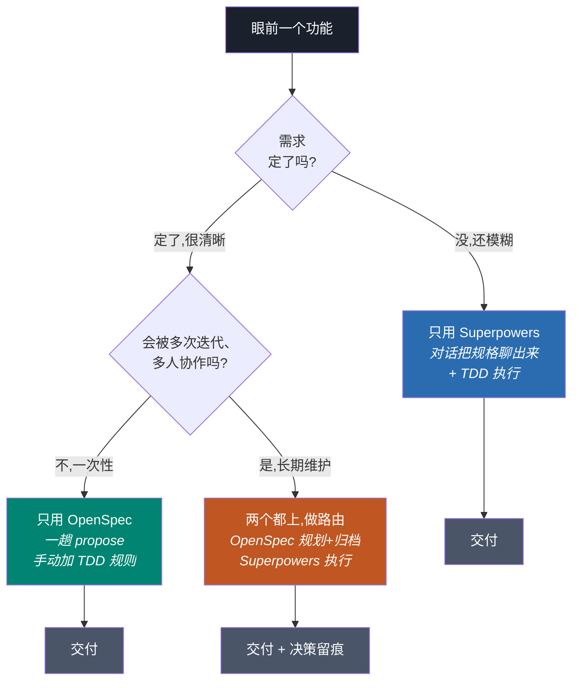
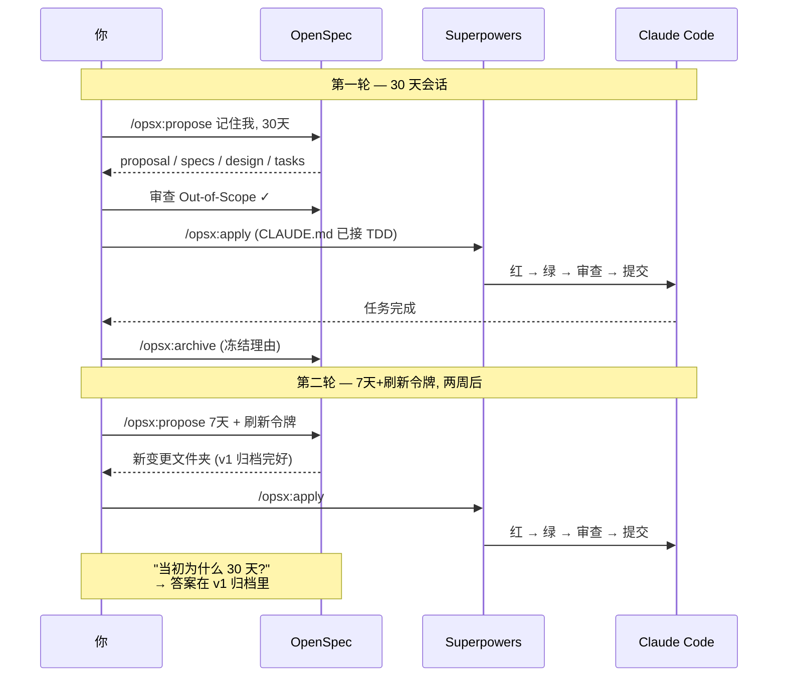

+++
date = '2026-06-28T13:00:00+08:00'
draft = false
title = 'OpenSpec vs Superpowers 实战工作流:spec 驱动开发怎么落地'
description = 'openspec vs superpowers 到底选哪个?本文给出分层地图、什么时候用哪个的决策规则,以及让两者协作不打架的 CLAUDE.md 接线配方,手把手跑一遍真实的 spec 驱动开发闭环。'
toc = true
tags = ['Claude Code', 'OpenSpec', 'Superpowers', 'AI Development', 'Spec-Driven Development']
keywords = ['openspec superpowers', 'openspec 教程', 'spec 驱动开发', 'claude code 工作流', 'openspec vs superpowers', 'superpowers 插件']

[[params.faqItems]]
question = "OpenSpec vs Superpowers 到底该选哪个?"
answer = "它们在不同层,基本不是二选一。日常默认用 Superpowers——它对话优先,负责执行纪律(TDD、子代理、代码审查)。只有当一个功能会跨多个会话、由多人反复迭代时才加上 OpenSpec,因为它的 Delta/Archive 机制能给决策历史留版本,而这正是 Superpowers 会被下一轮覆盖掉的东西。"

[[params.faqItems]]
question = "OpenSpec 和 Superpowers 会自动配合吗?"
answer = "不会。它们是两套独立系统,不会自动串联。如果你两个都装了却不加路由规则,同一个功能会触发两套规划系统,一小时内就产出两份不同步的文档。必须在 CLAUDE.md 里写明:规划走 /opsx:propose,并显式规定 /opsx:apply 必须走 TDD 和代码审查。"

[[params.faqItems]]
question = "Claude Code 里的 spec 驱动开发是什么?"
answer = "spec 驱动开发(SDD)是让 AI 按照约定好的规格文档写代码,而不是从一句话提示里即兴发挥。在 Claude Code 里,OpenSpec 把规格落成带版本的文件(proposal、specs、design、tasks),而 Superpowers 先用对话把规格聊出来,再强制测试先行地执行。"

[[params.faqItems]]
question = "个人开发者用 OpenSpec 还是 Superpowers?"
answer = "个人开发先只用 Superpowers。它的对话优先规划和 TDD 强制在任何规模都有价值,而且会把设计文档和计划落盘。只有当你对同一个功能反复迭代三四次、需要回溯当初为什么这么定时,才会真正感受到 OpenSpec 的优势。"

[[params.faqItems]]
question = "spec 驱动开发真能提升 AI 代码质量吗?"
answer = "它能提升一致性、减少返工,但解决不了更深层的问题——Hacker News 上被反复提到的'代理不听话、偷懒'。规格约束的是应该造什么,不保证代理真的照做。这正是 Superpowers 要给规格配上硬规则(比如删掉测试之前写的实现代码)的原因。"
+++


## openspec vs superpowers:先别急着二选一

搜索数据讲得很清楚:大量人在搜 "openspec vs superpowers",期待有个赢家。但我把两者在真实项目里跑了几个月后,诚实的答案是——"二选一"这个框架本身就是个坑。这两个工具争的根本不是同一件事,就像施工图纸和工地监理不是竞品一样。一个决定"造什么"并保留"为什么这么造";另一个决定"造得好不好",死活不让代理偷工减料。非要问"哪个更好",等于问编译器和 linter 谁更好——它们在同一条流水线的不同层。

今年早些时候我写过一篇[Claude Code + OpenSpec + Superpowers 三件套完整拆解](/posts/ai/2026-04-09-claude-code-openspec-superpowers/),那篇回答的是"这些工具是什么、三个一起上是不是过度"。这篇是续作,回答大家真正反复在搜的问题:面对眼前一个真实功能,**我到底该抓哪个,又怎么把它们接起来让它们配合而不是打架?** 想看安装和分层理论,先读母文;这里我默认你两个都装好了,只想要能用的实战闭环。

数据能说明这个话题为什么值得深挖。截至 2026 年年中,[Superpowers](https://github.com/obra/superpowers) 已经约 24.9 万 star,而且——这是多数对比文章漏掉的关键——它早已不是 Claude 专属插件了,如今能装进 Codex、Cursor、Antigravity、Copilot CLI、Kimi、OpenCode 等等。它已经从一个插件长成了一套方法论。[OpenSpec](https://openspec.dev/) 约 5.9 万 star,刻意做得更窄,只专注一件事:别让实现意图困在会话历史里,而是落进带版本的文件。

## 分层地图:谁负责"做什么",谁负责"怎么做"

任何决策规则要成立,你得先把两个工具放到同一根轴上看。我在每篇 "vs" 文章里都看到同一个错误:把它们逐个功能对比,好像它们是竞争的编辑器。它们根本不在表格的同一行——它们在不同的行。

OpenSpec 负责**产物层**。它的输出是一组文件:`proposal.md`(包含关键的 Out-of-Scope 边界)、一个装 GIVEN/WHEN/THEN 行为的 `specs/` 目录、记录选型理由的 `design.md`、以及当清单用的 `tasks.md`。它真正的独门本事不是"能写这些文件"——Superpowers 也写设计文档——而是那套 *Delta/Archive 机制*。每一次变更都活在自己独立的版本文件夹里,完成后归档,于是三轮迭代之后,你依然能重建出"为什么 v1 选了 bcrypt、v2 又换成 argon2"。这段历史,是这份清单上其他任何工具都留不住的东西。

Superpowers 负责**行为层**。它不给你一个模板去填。它开一段对话——"你到底想解决什么?用户是谁?约束是什么?"——把规格从对话里聊出来。然后它强制执行:真正的红/绿 TDD、子代理驱动开发(独立代理逐个任务推进,配两阶段审查)、以及那条臭名昭著的规则:任何在测试之前写出来的实现代码,直接*删掉,不是警告*。它的价值是纪律,不是文档。



有一个重构认知的关键点,直接改变你怎么选:**OpenSpec 是文档优先,Superpowers 是对话优先。** 这一个差别几乎解释了所有场景下的取舍。当你的需求已经很清晰,文档优先更快——直接写下来就行。当你的需求还很模糊,对话优先更快,因为对话能做完那份空白模板做不了的"需求发现"。所以真正的问题从来不是"哪个工具更好",而是"我现在的需求到底定没定"。

## 决策规则:什么时候用哪个

我很长时间拒绝写决策树,因为"看情况"听起来更诚实。但当你下午两点面对一个功能、必须开工时,"看情况"一点用都没有。所以下面是我真正在用的规则,归结为两个最要紧的变量:**需求定没定,以及这个功能会被碰几次。**

需求模糊、而且是一次性交付,只用 Superpowers。它的对话优先头脑风暴,天生就是为"你还写不出规格"这种情况设计的,而它的 TDD 能防止一个临时产物变成负债。这是我大概 70% 日常工作的默认选择。**这时千万别上 OpenSpec**——给一个你自己都没想清楚的需求写文档优先的规格,是最常见的浪费一小时、然后马上重写规格的翻车方式。

需求已经定死、功能是一个干净的单元,那 OpenSpec 单用确实比对话来回聊更快。你已经知道要什么,`/opsx:propose` 一趟就把它变成结构化产物,还省掉了苏格拉底式追问。但——这是 "vs" 文章都跳过的诚实边角——你丢掉了 Superpowers 的执行纪律。所以 OpenSpec 单用只在这种情况下成立:你愿意自己审代码,或者你手动往 CLAUDE.md 里加 TDD 规则。

两个组合起来,只有在一个象限里值回它的开销:**一个会被迭代不止一次、由不止一个人、跨不止一个会话触碰的功能。** 这才是 OpenSpec 的 Delta/Archive 从理论变现实的地方。当队友三周后重新打开这个功能、问"会话 TTL 为什么是 30 天?",归档的设计 delta 一秒就能回答。而 Superpowers 单用,早在下一次头脑风暴时就把这段理由覆盖掉了。



## 实战闭环:一个功能两轮迭代跑一遍

理论很廉价。下面是两个工具一起跑在一个会被改的功能上时,真实的节奏——也就是组合真正回本的场景。假设你在做一个"记住我"的登录选项,两周后产品又决定会话时长定错了。这正是双工具闭环发光的地方,也是单工具悄悄丢信息的地方。

第一轮从 `/opsx:propose Add remember-me checkbox with 30-day sessions` 开始。OpenSpec 生成四份产物。你打开 `proposal.md` 检查 Out-of-Scope——确认代理没有悄悄加上你根本没要的"记住此设备"指纹识别。因为规划已经在这里发生了,你就*不要*让 Superpowers 的 brainstorming 再次触发(为什么,下一节讲)。然后 `/opsx:apply` 跑起来,而且——只因为你的 CLAUDE.md 这么写了——Superpowers 的 TDD 接管:每个任务先写失败测试、再实现、自审、提交。最后用 `/opsx:archive` 收尾,合并 spec delta,把第一轮的理由冻结存档。

两周后需求改成 7 天会话加刷新令牌。你再跑一次 `/opsx:propose`——一个*新的*变更文件夹,而不是改旧的。归档的第一轮依然在。当你的审查人问"等等,当初为什么定 30 天?",答案就在归档 delta 里,一条 `git log` 的距离。Superpowers 单用做不到这点:它第二次头脑风暴会把第一份设计文档覆盖掉,原始理由就没了。这就是组合价值的全部论据,落到实处。



## 怎么接线才不打架:可复制的 CLAUDE.md 配方

这一节几乎所有教程都跳过,而它恰恰是最容易翻车的地方。**OpenSpec 和 Superpowers 不会自动串联。** 两个都装、零配置,你会撞车:下次你描述一个功能,Superpowers 的 `brainstorming` 技能自动触发,*同时*你又想跑 `/opsx:propose`。现在你为同一个功能有了一份 `docs/superpowers/specs/` 的设计文档,和一份 `openspec/changes/<id>/proposal.md`,一小时内就开始各说各话地漂移。我干过这事。抓狂就抓狂在两份文件看起来都像权威。

解法是"约定",写进 CLAUDE.md 强制执行。你必须靠写下来选定一套规划系统,因为两个工具都探测不到对方。下面是我在每个双工具项目里粘贴的路由块——复制它、改一下路径,撞车就消失了:

````markdown
## Spec 驱动路由(OpenSpec + Superpowers)

- 任何新功能,一律先跑 `/opsx:propose`。
  不要跑 Superpowers 的 brainstorming 或 writing-plans——
  本仓库的规划阶段归 OpenSpec。
- 跑 `/opsx:apply` 时,一律走 TDD:
  先写失败测试,再写实现。删掉任何测试之前写的实现代码。
- apply 期间,每次提交前跑 code-review 技能,
  并为该变更开一个隔离的 git worktree。
- `/opsx:archive` 永远是一个完成变更的最后一步。
  绝不留下未归档的变更——下一个会话会
  重读过期的 spec、把已完成的活重做一遍。
````

这个块做了三件工具自己不会做的事。它把规划路由给 OpenSpec,让 Superpowers 的 brainstorming 别再抢戏。它在 `apply` 期间手动打开 Superpowers 的执行技能——因为关键在于,TDD、代码审查、worktree 隔离在 `/opsx:apply` 里*不会自动激活*,只有 CLAUDE.md 明确要求时才触发。它还把归档变成不可商量的动作,从而堵住 OpenSpec 最常见的一个坑:忘了归档,然后眼睁睁看下个会话把已经做完的活重做一遍。

如果这篇文章你只记一句话,记这句:**工具给你零件,CLAUDE.md 是装配说明书,没有它,零件之间会主动互相干扰。** 关于这些技能怎么加载、怎么触发的底层机制,我的 [Claude Code 技能指南](/posts/ai/2026-01-08-claudecode-skill-guide/)和 [Superpowers 深度拆解](/posts/ai/2026-02-01-superpowers-deep-dive/)讲了背后的模型。

## 我踩过的 5 个坑

母文列的是通用坑;这里是我*在跑组合工作流时*真正被咬到的具体坑,这是一组更锋利、也更不一样的坑。

**把 "openspec vs superpowers" 当成二选一。** 我头一周一直在纠结该标准化用哪个,而答案是"两个都用,在不同层"。如果你发现自己在争哪个工具赢,说明你把分层诊断错了。回去重读分层地图。

**给模糊需求写过度的规格。** OpenSpec 的文档优先模型,会在需求没定时惩罚你。我曾对一个半成型的想法跑 `/opsx:propose`,拿到一份自信满满的四文件规格,然后把四份文件重写了两遍。Superpowers 的对话本可以在任何东西落盘之前就把这个模糊点暴露出来。让工具去匹配"需求定没定"。

**以为 `/opsx:apply` 会强制 TDD。** 它不会。我第一次没加 CLAUDE.md 路由块就跑组合闭环时,apply 高高兴兴地写出零测试的实现,我到代码审查才发现。OpenSpec 负责规划,它不管执行纪律。那是 Superpowers 的活,而且只有你接线它才生效。

**大任务清单上的子代理 token 爆炸。** Superpowers 的子代理驱动开发按代理重建上下文,这对隔离性极好,对一个 40 任务的变更却很贵。大功能上我现在会拆成多个 OpenSpec 变更,而不是一个巨大的 `tasks.md`,让每次子代理运行都保持便宜。Hacker News 那群人说得对,token 成本是这里真正的取舍。

**相信规格能治好代理偷懒。** [Hacker News 上那条 SDD 讨论串](https://news.ycombinator.com/item?id=48231575)里最锋利的批评是:瓶颈是"代理不听话、偷懒",不是规格质量。一份完美的规格不保证代理照做。这恰恰是为什么 Superpowers 的硬规则——删掉测试前的代码、两阶段审查——比 OpenSpec 的文档精美更重要。规格是约束;它不是强制。

## 我的 2026 选择

如果只带走一个决策框架:**默认用 Superpowers,当一个功能越过"多人、多会话反复迭代"这条线时,升级到组合。** Superpowers 是那个能改善任何项目的工具——它的对话优先规划和 TDD 强制在任何规模都加分,而且 2026 年它几乎能跑在每个编程代理上,不只是 Claude Code。光是这份通用性,就让它成为更稳的默认赌注。OpenSpec 是你在"决策可追溯"变成真实、可感的瓶颈时才加的专才——通常就是队友问出"我们当初为什么这么做?"而没人答得上来的那一刻。

别把完整组合套在所有东西上,那是母文警告过的过度工程陷阱,现在依然成立。一个 30 分钟的脚本不需要 Delta/Archive 审计链。但当你真的组合它们时,CLAUDE.md 路由块不是可有可无的点缀——它才是把两个互相无视的工具变成一个连贯闭环的关键。路由接对了,你就拿到两层的最好部分:OpenSpec 记住*为什么*,Superpowers 保证*造得好不好*,Claude Code 负责敲键盘。关于这一切所在的更大的 Claude Code 工作流,我的 [Claude Code 完全指南](/posts/ai/2026-02-28-claude-code-complete-guide/)是地图。

---

**延伸阅读:**

- [Claude Code + OpenSpec + Superpowers:三件套还是过度组合?](/posts/ai/2026-04-09-claude-code-openspec-superpowers/)
- [Superpowers 深度拆解:把 Claude Code 变成资深工程师的技能框架](/posts/ai/2026-02-01-superpowers-deep-dive/)
- [Claude Code 技能指南:Agent Skills 到底怎么工作](/posts/ai/2026-01-08-claudecode-skill-guide/)
- [Claude Code 完全指南:从入门到精通](/posts/ai/2026-02-28-claude-code-complete-guide/)
