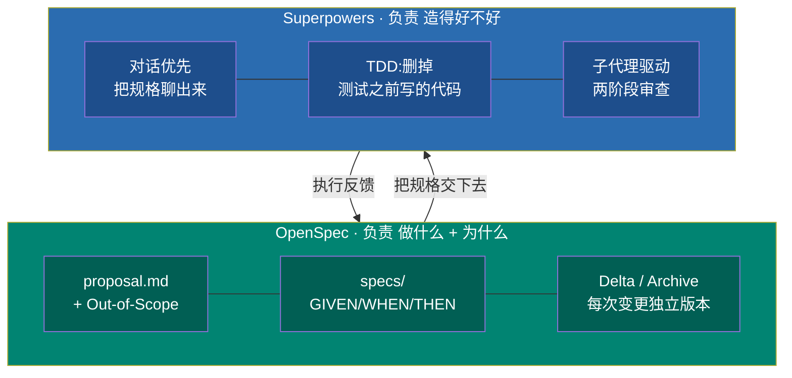
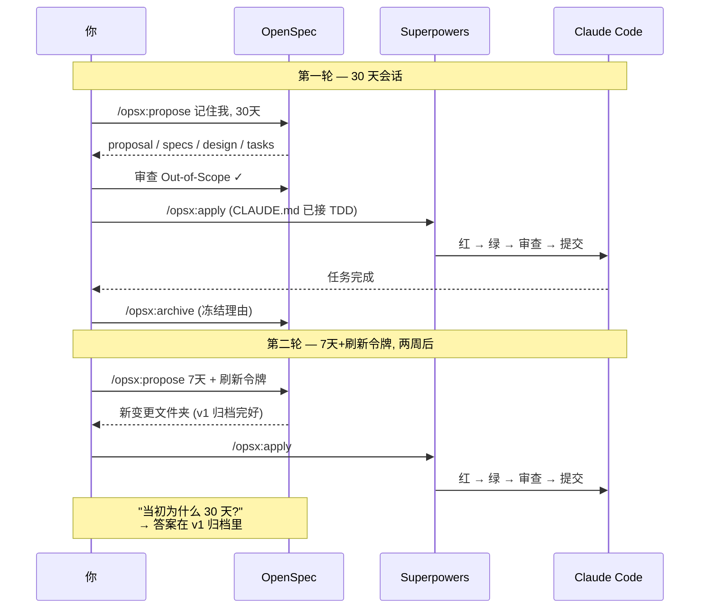
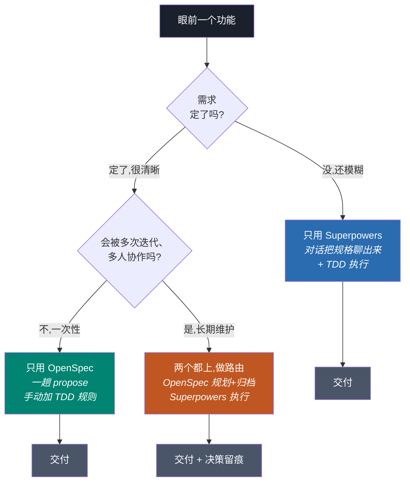

+++
date = '2026-06-28T13:00:00+08:00'
draft = false
title = 'OpenSpec vs Superpowers 实战工作流:spec 驱动开发怎么落地'
description = 'OpenSpec 和 Superpowers 一起装、零配置必打架:同一个功能一小时内长出两份互相矛盾的规格,apply 还写出零测试实现。本文给出我踩坑后沉淀的 CLAUDE.md 路由块和单用/组合决策规则,把 spec 驱动开发接成可照抄的 Claude Code 工作流。'
toc = true
tags = ['Claude Code', 'OpenSpec', 'Superpowers', 'AI Development', 'Spec-Driven Development']
keywords = ['openspec superpowers', 'openspec 教程', 'spec 驱动开发', 'claude code 工作流', 'openspec vs superpowers', 'superpowers 插件']

[[params.faqItems]]
question = "OpenSpec vs Superpowers 到底该选哪个?"
answer = "它们在不同层,基本不是二选一。日常默认用 Superpowers——它对话优先,负责执行纪律(TDD、子代理、代码审查)。只有当一个功能会跨多个会话、由多人反复迭代时才加上 OpenSpec,因为它的 Delta/Archive 机制能给决策历史留版本,而这正是 Superpowers 会被下一轮覆盖掉的东西。"

[[params.faqItems]]
question = "OpenSpec 和 Superpowers 会自动配合吗?"
answer = "不会。它们是两套独立系统,不会自动串联。如果你两个都装了却不加路由规则,同一个功能会触发两套规划系统,一小时内就产出两份不同步的文档。必须在 CLAUDE.md 里写明:规划走 /opsx:propose,并显式规定 /opsx:apply 必须走 TDD 和代码审查。"

[[params.faqItems]]
question = "Claude Code 里的 spec 驱动开发是什么?"
answer = "spec 驱动开发(SDD)是让 AI 按照约定好的规格文档写代码,而不是从一句话提示里即兴发挥。在 Claude Code 里,OpenSpec 把规格落成带版本的文件(proposal、specs、design、tasks),而 Superpowers 先用对话把规格聊出来,再强制测试先行地执行。"

[[params.faqItems]]
question = "个人开发者用 OpenSpec 还是 Superpowers?"
answer = "个人开发先只用 Superpowers。它的对话优先规划和 TDD 强制在任何规模都有价值,而且会把设计文档和计划落盘。只有当你对同一个功能反复迭代三四次、需要回溯当初为什么这么定时,才会真正感受到 OpenSpec 的优势。"

[[params.faqItems]]
question = "spec 驱动开发真能提升 AI 代码质量吗?"
answer = "它能提升一致性、减少返工,但解决不了更深层的问题——Hacker News 上被反复提到的'代理不听话、偷懒'。规格约束的是应该造什么,不保证代理真的照做。这正是 Superpowers 要给规格配上硬规则(比如删掉测试之前写的实现代码)的原因。"
+++


我第一次把 OpenSpec 和 Superpowers 同时压到一个功能上,收获的是两份互相打架的规格文档。Superpowers 的 brainstorming 技能自己触发,往 `docs/superpowers/specs/` 写了一份设计文档;我又跑了 `/opsx:propose`,`openspec/changes/<id>/proposal.md` 里长出第二份。

不到一小时,两份文件开始各说各话,而且看起来都像权威版本。同一套没接线的配置后来又咬了我一口:`/opsx:apply` 高高兴兴写完整个实现,一行测试都没有,我直到代码审查才发现。

现在,同一类功能在我这跑得干干净净:一次 `/opsx:propose`,每行实现之前先有失败测试,收尾一个 `/opsx:archive` 把决策理由冻结存档,留给三周后重开这个功能的人。工具本身一点没变。全部差别,是 CLAUDE.md 里十来行的路由块。

这篇就是从前一种状态走到后一种状态的实战记录——spec 驱动开发怎么真正落地,命令全给,可以照抄。

开工前先把一件事说破。搜索数据显示,大部分人是敲着 "openspec vs superpowers" 来的,想看个赢家。但两个工具在真实项目里跑了几个月后,我的结论是:"二选一"这个框架本身就是坑。

它们争的根本不是同一份活,就像施工图纸和工地监理不是竞品。一个决定"造什么"、留住"为什么";另一个决定"造得好不好",死活不让代理偷工减料。非要比,等于问编译器和 linter 谁更好——同一条流水线的不同层。

今年早些时候我写过[Claude Code + OpenSpec + Superpowers 三件套完整拆解](/zh/posts/ai/2026-04-09-claude-code-openspec-superpowers/),那篇回答的是"这些工具是什么、三个一起上是不是过度",安装和分层理论都在里面。这篇是续作:默认你两个都装好了,直接带你到能跑的闭环——它们在哪撞车、怎么接线、什么时候该抓哪个。

## OpenSpec 和 Superpowers 各管哪一层

要给两个工具做路由,得先知道各自把着哪份活。每篇 "vs" 文章都在犯同一个错:逐个功能对比,好像它们是竞争的编辑器。它们根本不在表格的同一行。

光看数字就能看出定位差多远。截至 2026 年年中,[Superpowers](https://github.com/obra/superpowers) 约 24.9 万 star,而且——多数对比文章漏掉的关键——它早就不是 Claude 专属插件了:Codex、Cursor、Antigravity、Copilot CLI、Kimi、OpenCode 都能装。它已经从一个插件长成一套方法论。

[OpenSpec](https://openspec.dev/) 约 5.9 万 star,刻意做窄,只专注一件事:别让实现意图困在会话历史里,而是落进带版本的文件。

OpenSpec 管**产物层**。输出是一组文件:`proposal.md`(含关键的 Out-of-Scope 边界)、装 GIVEN/WHEN/THEN 行为的 `specs/` 目录、记选型理由的 `design.md`、当清单用的 `tasks.md`。

但它真正的独门本事不是"会写这些文件"——Superpowers 也写设计文档——而是那套 *Delta/Archive 机制*。每次变更活在自己的版本文件夹里,完成即归档。三轮迭代之后,你依然能重建出"为什么 v1 选了 bcrypt、v2 换成 argon2"。这段历史,这套栈里没有别的东西留得住。

Superpowers 管**行为层**。它不给你模板去填,而是开一段对话——"你到底想解决什么?用户是谁?约束是什么?"——把规格从对话里聊出来。

然后它强制执行:真正的红/绿 TDD、子代理驱动开发(独立代理逐任务推进,配两阶段审查),还有那条臭名昭著的规则——任何写在测试之前的实现代码,直接*删掉,不是警告*。它的价值是纪律,不是文档。



一句话重构你的认知:**OpenSpec 是文档优先,Superpowers 是对话优先**。这一个差别几乎解释了所有场景的取舍。

需求已经清晰,文档优先更快——直接写下来就完了。需求还模糊,对话优先更快,因为对话能做完空白模板做不了的"需求发现"。所以真正的问题从来不是"哪个工具更好",而是"我现在的需求到底定没定"。

## 接线配方:让 OpenSpec 和 Superpowers 不打架的 CLAUDE.md

回到开头那次撞车。这一节几乎所有教程都跳过,而它恰恰是翻车重灾区:**OpenSpec 和 Superpowers 不会自动串联**,两个工具都探测不到对方。

零配置装双份的下场就是我开头那样:一描述功能,brainstorming 自动触发,你又要跑 `/opsx:propose`,同一个功能立刻有了 `docs/superpowers/specs/` 和 `openspec/changes/<id>/proposal.md` 两份规格,一小时内开始漂移。抓狂就抓狂在两份都像权威。

解法是"约定",写进 CLAUDE.md 强制执行——你必须靠白纸黑字选定一套规划系统,没人替你选。下面是我在每个双工具项目里都会粘贴的路由块,复制、改路径,撞车消失:

````markdown
## Spec 驱动路由(OpenSpec + Superpowers)

- 任何新功能,一律先跑 `/opsx:propose`。
  不要跑 Superpowers 的 brainstorming 或 writing-plans——
  本仓库的规划阶段归 OpenSpec。
- 跑 `/opsx:apply` 时,一律走 TDD:
  先写失败测试,再写实现。删掉任何测试之前写的实现代码。
- apply 期间,每次提交前跑 code-review 技能,
  并为该变更开一个隔离的 git worktree。
- `/opsx:archive` 永远是一个完成变更的最后一步。
  绝不留下未归档的变更——下一个会话会
  重读过期的 spec、把已完成的活重做一遍。
````

这个块做了三件工具自己死活不做的事。

第一,把规划路由给 OpenSpec,让 Superpowers 的 brainstorming 别再抢戏。

第二,在 apply 期间手动打开 Superpowers 的执行技能。TDD、代码审查、worktree 隔离在 `/opsx:apply` 里*不会自动激活*,只有 CLAUDE.md 点名才触发。我那次零测试实现,漏的就是这一条:OpenSpec 只管规划,不管执行纪律。

第三,把归档变成不可商量的动作。这堵住了 OpenSpec 最常见的一个坑:忘了归档,下个会话重读过期 spec,眼睁睁把做完的活重做一遍。

这篇文章只记一句话的话,记这句:**工具给你零件,CLAUDE.md 是装配说明书,没有它,零件会主动互相干扰**。这些技能怎么加载、怎么触发,底层机制在我的 [Claude Code 技能指南](/zh/posts/ai/2026-01-08-claudecode-skill-guide/)和 [Superpowers 深度拆解](/zh/posts/ai/2026-02-01-superpowers-deep-dive/)里讲透了。

## 实战闭环:一个功能,两轮迭代

路由接好之后,组合会稳定成下面这个节奏。我用一个具体例子走一遍——"记住我"登录选项,两周后产品又改会话时长——因为"会被改的功能"正是双工具闭环发光、单工具悄悄丢信息的地方。下面每条命令都能照抄。

第一轮从 `/opsx:propose Add remember-me checkbox with 30-day sessions` 开始,OpenSpec 生成四份产物。先打开 `proposal.md` 查 Out-of-Scope:确认代理没有悄悄塞进你根本没要的"记住此设备"指纹识别。

规划已经在这发生了,所以 Superpowers 的 brainstorming 绝不能再触发——这正是路由块在值班。接着跑 `/opsx:apply`,而且只因为你的 CLAUDE.md 这么写了,Superpowers 的 TDD 才会接管:每个任务先写失败测试、再实现、自审、提交。最后 `/opsx:archive` 收尾,合并 spec delta,把第一轮的理由冻结。

两周后需求改成 7 天会话加刷新令牌。再跑一次 `/opsx:propose`——它开的是一个*新的*变更文件夹,不动旧的,第一轮的归档原封不动。

审查人问"等等,当初为什么定 30 天?",答案就在归档 delta 里,一条 `git log` 的距离。Superpowers 单用做不到:第二次头脑风暴会覆盖第一份设计文档,原始理由就没了。组合的全部价值,就落在这一下。



## 决策规则:什么时候用 OpenSpec,什么时候用 Superpowers

上面的闭环是"两个都上"的场景,但多数功能配不上这个开销。我很长时间拒绝写决策规则,因为"看情况"听着更诚实——可下午两点面对一个功能必须开工时,"看情况"一点用没有。所以这是我真正在用的规则,压缩成两个最要紧的变量:**需求定没定,这个功能会被碰几次**。

需求模糊、一次性交付:只用 Superpowers。它的对话优先头脑风暴,天生就是为"你还写不出规格"这种情况设计的,TDD 又能防止临时产物变成负债。这是我大概 70% 日常工作的默认选择。

这时千万别上 OpenSpec。给自己都没想清楚的需求写文档优先的规格,是最经典的翻车路线:浪费一小时,产出一份马上要重写的规格。

需求定死、功能是干净的单元:OpenSpec 单用真比来回聊快。你已经知道要什么,`/opsx:propose` 一趟出结构化产物,还省掉苏格拉底式追问。但——"vs" 文章都跳过的诚实边角——你丢了 Superpowers 的执行纪律。所以单用的前提是你愿意自己审代码,或者手动往 CLAUDE.md 加 TDD 规则。

组合只在一个象限回本:**会被迭代不止一次、由不止一个人、跨不止一个会话触碰的功能**。这才是 Delta/Archive 从理论变现实的地方——就是上一节"TTL 为什么 30 天"那一幕。Superpowers 单用,早在下一次头脑风暴就把理由覆盖掉了。



## 我踩过的 5 个坑

母文列的是通用坑;这里是我*跑组合工作流时*真被咬到的具体坑,更锋利,也更不一样。

**把 "openspec vs superpowers" 当成二选一**。我头一周一直在纠结该标准化用哪个,答案却是"两个都用,在不同层"。你要是发现自己在争哪个工具赢,就是把分层诊断错了,回去重读分层地图。

**给模糊需求写过度的规格**。OpenSpec 的文档优先模型,会在需求没定时惩罚你。我曾对一个半成型的想法跑 `/opsx:propose`,拿到一份自信满满的四文件规格,然后把四份文件重写了两遍。Superpowers 的对话本可以在任何东西落盘之前就把模糊点暴露出来。让工具去匹配"需求定没定"。

**以为 `/opsx:apply` 会强制 TDD**。它不会——就是开头那次零测试翻车。我第一次没加 CLAUDE.md 路由块就跑组合闭环,apply 写出零测试的实现,我到代码审查才发现。OpenSpec 负责规划,不管执行纪律;那是 Superpowers 的活,而且你不接线它不干。

**大任务清单上的子代理 token 爆炸**。Superpowers 的子代理驱动开发按代理重建上下文,隔离性极好,但对一个 40 任务的变更就很贵。大功能上我现在拆成多个 OpenSpec 变更,而不是一份巨型 `tasks.md`,让每次子代理运行都保持便宜。Hacker News 那帮人说得对:token 成本才是这里真正的取舍。

**相信规格能治好代理偷懒**。[Hacker News 那条 SDD 讨论串](https://news.ycombinator.com/item?id=48231575)里最扎的批评是:瓶颈是"代理不听话、偷懒",不是规格质量。一份完美的规格不保证代理照做。这恰恰是 Superpowers 的硬规则——删掉测试前的代码、两阶段审查——比 OpenSpec 的文档精美更重要的原因。规格是约束,不是强制。

## 我的 2026 选择

只带走一个决策框架的话:**默认用 Superpowers,当功能越过"多人、多会话反复迭代"那条线,再升级成组合**。Superpowers 能改善任何项目——对话优先规划和 TDD 强制在任何规模都加分,而且 2026 年它几乎跑在每个编程代理上,不只是 Claude Code。光这份通用性,就让它成为更稳的默认赌注。

OpenSpec 是专才,等"决策可追溯"变成真实、可感的瓶颈再加——通常就是队友问出"我们当初为什么这么做?"而没人答得上来的那一刻。

别把完整组合套在所有东西上,那是母文警告过的过度工程陷阱,现在依然成立。一个 30 分钟的脚本,不需要 Delta/Archive 审计链。

但真要组合,CLAUDE.md 路由块不是可有可无的点缀——它才是把两个互相无视的工具变成一个连贯闭环的关键。路由接对了,两层的好处全拿:OpenSpec 记住*为什么*,Superpowers 保证*造得好不好*,Claude Code 负责敲键盘。这一切所在的更大 Claude Code 工作流,看我的 [Claude Code 完全指南](/zh/posts/ai/2026-02-28-claude-code-complete-guide/)。

---

**延伸阅读:**

- [Claude Code + OpenSpec + Superpowers:三件套还是过度组合?](/zh/posts/ai/2026-04-09-claude-code-openspec-superpowers/)
- [Superpowers 深度拆解:把 Claude Code 变成资深工程师的技能框架](/zh/posts/ai/2026-02-01-superpowers-deep-dive/)
- [Claude Code 技能指南:Agent Skills 到底怎么工作](/zh/posts/ai/2026-01-08-claudecode-skill-guide/)
- [Claude Code 完全指南:从入门到精通](/zh/posts/ai/2026-02-28-claude-code-complete-guide/)
