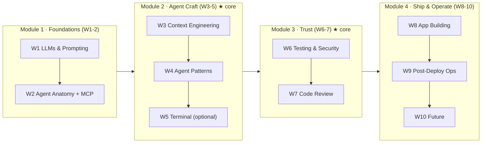

+++
date = '2026-07-02T14:00:00+08:00'
aliases = ['/posts/ai/2026-07-10-cs146s-study-guide/']
draft = false
title = 'CS146S Study Guide 2026: Lecture-by-Lecture Notes & Workbook'
description = 'Self-study Stanford CS146S in 2026: lecture-by-lecture verdicts, the exercises worth doing, Claude Code/Cursor tool mappings, and a route that skips filler.'
toc = true
tags = ['Stanford CS146S', 'Vibe Coding', 'AI Coding', 'Study Guide', 'Agentic Engineering']
keywords = ['cs146s study guide', 'cs146s lecture notes', 'cs146s the modern software developer', 'stanford cs146s syllabus 2026', 'stanford vibe coding course', 'how to self-study cs146s', 'cs146s assignments']

[[params.faqItems]]
question = "Is CS146S available online for free?"
answer = "Yes. The full syllabus, lecture slides, readings, and assignment code for Stanford CS146S (The Modern Software Developer) are public at themodernsoftware.dev and on GitHub. Guest lectures are the only component not fully available, though several talks exist on YouTube."

[[params.faqItems]]
question = "Is Stanford offering CS146S again in 2026?"
answer = "As of July 2026, ExploreCourses lists only the Autumn 2025 offering (instructor Mihail Eric). No Spring 2026 section ran. The 2026-27 bulletin publishes in mid-August 2026, so watch for an Autumn 2026 listing then. Eric also runs a paid 4-week public cohort on Maven, whose June 2026 run sold out."

[[params.faqItems]]
question = "How long does it take to self-study CS146S?"
answer = "Two weeks if you already use a coding agent daily and focus on Weeks 3, 4, 6, and 7 plus one real project. Six weeks if you follow the full 10-lecture sequence with assignments. Following the literal 10-week student pace is unnecessary — that cadence exists for quarter logistics, not learning efficiency."

[[params.faqItems]]
question = "Which CS146S weeks are the most important?"
answer = "Week 3 (Context Engineering), Week 4 (Agent Patterns), and Weeks 6-7 (Security and Code Review) carry most of the course's durable value. Week 5 (terminals) and Week 10 (future trends) are the safest to compress or skip for self-learners."

[[params.faqItems]]
question = "Do I need to do the CS146S assignments, or is reading enough?"
answer = "Do at least the Week 2 MCP server assignment and one full agent-built project. The final project is 80% of the Stanford grade for a reason: the course's thesis is that agent management is a practiced skill, not absorbed knowledge. Reading alone gives you vocabulary, not capability."
+++

Most people who bookmark Stanford CS146S never get past Week 1. I know because I did exactly that on my first pass: opened [themodernsoftware.dev](https://themodernsoftware.dev), read the Week 1 readings, felt productive, and stalled. The problem wasn't the material — it's that a university syllabus is optimized for enrolled students with grades and deadlines, not for a working developer studying at night. A **CS146S study guide** for self-learners needs to answer different questions: which lectures carry the value, which exercises are worth your limited hours, and what tool you should actually run each concept on in 2026.

That's what this workbook is. I've already written a five-part deep-dive series on the course content itself (starting with the [full course overview](/posts/ai/2026-02-24-stanford-cs146s-overview/)); this article is the operational layer on top — a lecture-by-lecture verdict table, tool mappings, and two study routes depending on where you're starting from. My core claim up front: **don't replay CS146S linearly. Invert it.** Roughly 60% of the durable value sits in three weeks of material (3, 4, and 6), and the 80%-weight final project — not the readings — is the actual course.

## CS146S in July 2026: What Actually Changed

Before planning a study route, you need to know what you're studying against. I verified the current state through Stanford's own systems rather than secondhand posts, because "is this course still running?" is the first thing every self-learner asks and most answers online are stale.

The honest status: **the Fall 2025 run remains the latest complete public offering.** Stanford's [ExploreCourses](https://explorecourses.stanford.edu/) lists CS146S only for Autumn 2025-26 (3 units, instructor Mihail Eric); no Spring 2026 section was offered. The 2026-27 bulletin publishes in mid-August 2026, so whether an Autumn 2026 edition runs is unconfirmed as I write this. Everything in this guide is based on the most recent public materials — which, notably, have kept growing: the [assignments repository](https://github.com/mihail911/modern-software-dev-assignments) has climbed to 3.8k stars and over 900 forks since I first covered the course in February.

The more interesting signal is what the instructor did next. Eric now teaches a compressed 4-week public version — [AI Software Development: From First Prompt to Production Code](https://maven.com/the-modern-software-developer/ai-course) on Maven — and the June 22–July 17, 2026 cohort **sold out**. Read that as market validation: professional developers are paying for a 4-week distillation of what the free materials already contain. Which tells you two things. First, the demand for structured study of this material is real, not hype residue. Second, even the creator concluded that 10 weeks compresses to 4 for working developers. This guide follows the same logic, for free.

| What | Status (July 2026) | Source |
|------|-------------------|--------|
| Stanford course | Autumn 2025 only; no Spring 2026 section; 2026-27 TBA in August | ExploreCourses |
| Course site + slides | Fully public, Fall 2025 materials | [themodernsoftware.dev](https://themodernsoftware.dev) |
| Assignments (8 weeks) | Public, 3.8k stars, Python 3.12 + Poetry | [GitHub](https://github.com/mihail911/modern-software-dev-assignments) |
| Paid public cohort | 4 weeks, June 2026 run sold out | [Maven](https://maven.com/the-modern-software-developer/ai-course) |
| Guest lectures | Partially available (some talks on YouTube) | — |

## The Master Table: Every Lecture, One Verdict, One Exercise

This is the artifact I wish someone had handed me in February. Each row: what the week is really about in one sentence, the single exercise with the best effort-to-insight ratio, the tool I'd run it on today, and where to go deeper. The star ratings are my judgment, not Stanford's — I explain the reasoning in the notes that follow.

| Wk | Lecture | Verdict (mine) | Do this (2–4 hrs) | Tool in 2026 | Deep read |
|----|---------|----------------|--------------------|--------------|-----------|
| 1 | LLMs & Prompting | ★★☆ Necessary floor, don't linger | Build the prompting playground; test one prompt 10× and measure variance | Any frontier model API | [Karpathy's LLM deep dive](https://www.youtube.com/watch?v=7xTGNNLPyMI) |
| 2 | Agent Anatomy & MCP | ★★★ The one assignment everyone should do | Write an MCP server from scratch, no framework | Claude Code + MCP SDK | [Part 1 §Week 2](/posts/ai/2026-02-24-stanford-cs146s-overview/) |
| 3 | Context Engineering | ★★★ Highest ROI of the course | Write a design doc, feed it to an agent, diff output vs. no-doc run | Claude Code / Cursor rules | [Part 2: Context Engineering](/posts/ai/2026-02-24-context-engineering-deep-dive/) |
| 4 | Agent Patterns | ★★★ Where "vibe coding" becomes management | Ship one real feature end-to-end with checkpointed autonomy | Claude Code plan mode | [Part 3: Agent Manager](/posts/ai/2026-02-24-agent-manager-patterns/) |
| 5 | Modern Terminal | ★☆☆ Skippable for CLI-native devs | Skim the Warp vs Claude Code positioning doc | Warp (or skip) | Warp University |
| 6 | Testing & Security | ★★★ The week that separates demo from product | Run a security scan on your own AI-written repo; count real vs. false positives | Semgrep + agent review pass | [Part 4: Secure Vibe Coding](/posts/ai/2026-02-24-secure-vibe-coding/) |
| 7 | Code Review | ★★☆ Pairs with W6; do them together | Adversarially review an AI PR: find 3 issues the agent missed | GitHub PR + second agent as critic | [Part 4: Secure Vibe Coding](/posts/ai/2026-02-24-secure-vibe-coding/) |
| 8 | Automated App Building | ★★☆ Fun, but the lesson is the gap | One-prompt an app, then list everything blocking production | v0 / Lovable, then Claude Code | [Part 5: Prototype to Production](/posts/ai/2026-02-24-prototype-to-production/) |
| 9 | Post-Deployment Ops | ★★☆ Read, don't build (unless ops is your job) | Read Google's SRE intro through an "agent on-call" lens | Read-only week | [Part 5: Prototype to Production](/posts/ai/2026-02-24-prototype-to-production/) |
| 10 | Future of SWE | ★☆☆ Podcast-tier; listen while commuting | Watch the Casado talk if available; skip otherwise | — | [Part 1 §Week 10](/posts/ai/2026-02-24-stanford-cs146s-overview/) |

Screenshot that table — it's the compressed version of everything below. Note the shape of the ratings: value clusters in Weeks 2–4 and 6–7, exactly the middle of the course. The edges (orientation at the start, futurism at the end) are where a self-learner's discipline goes to die, and they're also the most compressible.

## How the Course Actually Breaks Down

The official syllabus presents ten flat weeks, but flattening hides the structure that matters for study planning. When I mapped the lectures by what they demand from you — reading vs. building vs. judging — four modules emerged, and they're not equally weighted:

Module 2 and Module 3 are the course. Module 1 is the on-ramp, Module 4 is the panorama. This matters because the two core modules also happen to be the two that age the slowest: tool names in Week 5 (Warp) and Week 8 (v0) have already shifted since Fall 2025, but context failure modes, autonomy checkpoints, and security review gates haven't moved at all. If you're worried the Fall 2025 materials are stale — the most common objection I hear — the answer is that the perishable parts are precisely the ones I'm telling you to compress.

## CS146S Lecture Notes: Week-by-Week Commentary

The master table gives you the verdicts; this section gives you the reasoning, uneven on purpose. The important weeks get paragraphs, the skippable ones get sentences.

### Weeks 1–2: Compress the First, Build the Second

Week 1's readings are genuinely good — Karpathy's LLM deep dive alone is worth the time if you've never watched it — but if you've been using AI coding tools for six months, this week is review. The one thing worth keeping is the mindset shift the assignment forces: treating prompts as experiments with measurable variance rather than incantations. I ran the same extraction prompt ten times against the playground when I did this assignment, and the output schema drifted in three of ten runs. That number, not any reading, is what convinced me to stop trusting single-shot prompt results.

Week 2 is a different story, and it's my strongest "do the assignment" recommendation of the whole course. Building an MCP server from scratch — not from a template, not by asking an agent to scaffold it — is the fastest way to stop treating agents as magic. Once you've written the tool-listing handshake and watched a model decide (sometimes wrongly) which of your tools to call, the entire agent ecosystem stops being mysterious. The assignment took me one evening, and it permanently changed how I write tool descriptions in my own projects: I now treat every description string as a prompt, because I've seen from the server side that that's exactly what it is.

### Week 3: The Highest-ROI Week — Do Not Skim

If you only study one week deeply, make it this one. Context engineering is the skill that separates people who get consistent output from coding agents and people who get lottery tickets, and Week 3's reading list is still the best curated set on the topic — the [four context failure modes](https://www.dbreunig.com/2025/06/22/how-contexts-fail-and-how-to-fix-them.html) piece in particular explains failures you've experienced but couldn't name (poisoning, distraction, confusion, conflict).

The exercise I'd assign myself, having done it: take a real feature from your backlog, write a one-page design doc (constraints, non-goals, relevant files, business rules), and run the same agent on the task twice — once with the doc, once with a bare prompt. Diff the two outputs. In my run, the bare-prompt version invented a data model that contradicted an existing one two directories away; the doc version didn't. That diff is the course's central lesson made visible in an afternoon. I unpack the full week in [Part 2 of the deep-dive series](/posts/ai/2026-02-24-context-engineering-deep-dive/), and if you want the 2026 state of the practice beyond the course materials — what held up, what turned out to be pseudo-technique — I updated my position in [Context Engineering for Coding Agents 2026](/posts/ai/2026-06-16-context-engineering-2026/).

### Week 4: Where You Become a Manager

Week 4 asks the question the whole industry is circling: how much autonomy do you grant an agent, and where do you place checkpoints? The readings are effectively a Claude Code ecosystem tour (Boris Cherney, Claude Code's creator, was the guest), but the durable content is the autonomy spectrum: simple tasks run unattended, medium tasks get 80% time savings plus human polish, complex tasks need staged reviews. The assignment — ship a complete project directing an agent rather than typing code — is the second-most important exercise in the course, and it's the natural continuation of your Week 3 design doc. Full treatment in [Part 3: Agent Manager patterns](/posts/ai/2026-02-24-agent-manager-patterns/).

### Week 5: Skip It (Probably)

Here's a judgment the official syllabus can't make but I can: Week 5 is the week most shaped by its guest speaker's company (Warp's CEO), and if you already live in a terminal with Claude Code, there's little here you don't do daily. Skim the Warp-vs-Claude-Code positioning doc for the taxonomy, and move on. The exception: if you came to AI coding through GUI-first tools like Cursor and the terminal intimidates you, this week earns its slot — terminal fluency is a prerequisite for most serious agent workflows.

### Weeks 6–7: The Gate Between Toy and Product

I treat these as one unit, and together they're the most sobering material in the course. The Week 6 readings include Semgrep's study running coding agents against 11 large open-source projects: Claude Code surfaced 46 real vulnerabilities but with an 86% false-positive rate, and — worse — non-deterministic results on identical code. Sit with what that means: AI security review is real enough to be useful and unreliable enough that it cannot be your only gate. Week 7 extends this to code review generally, and the practical insight is that AI-written code fails differently from human code — it looks locally correct while carrying systematic blind spots at edge cases and trust boundaries.

The self-study exercise that made this concrete for me: I pointed a security scan plus a second agent (as adversarial reviewer) at a repo I had largely vibe-coded weeks earlier. The scan flagged eleven findings; three were real, and one of the real ones — an unvalidated redirect — was in code I remembered "reviewing" at generation time. Nothing in the readings hit as hard as finding my own approved vulnerability. Both weeks are covered in depth in [Part 4: Secure Vibe Coding](/posts/ai/2026-02-24-secure-vibe-coding/).

### Weeks 8–10: The Panorama — Read at Podcast Speed

Week 8 (one-prompt app building) is the most fun and the most misunderstood: the lesson isn't that you can generate an app, it's the itemized gap between that app and something you'd bill customers for. Generate one, then write the production-blocker list — that list is the actual deliverable. Week 9 (post-deployment ops) I'd handle as reading, not building, unless operations is your day job; the SRE-meets-agents material is a preview of where the industry is going rather than a skill you'll use next sprint. Week 10 is a futures discussion — worth your commute, not your desk time. All three fold into [Part 5: From Prototype to Production](/posts/ai/2026-02-24-prototype-to-production/).

## Self-Study Routes: The Two-Week Core vs. the Six-Week Full Pass

Students take this course in ten weeks because quarters are ten weeks. You don't have that constraint, and you also don't have the thing that makes the slow pace work for students — external deadlines and a grade. My experience with self-paced material is blunt: any plan longer than six weeks silently becomes a plan I've abandoned. So here are the two routes I'd actually recommend, keyed to one question:

If the answer to the entry question is "not yet," don't start with CS146S at all — the course assumes CS111-level programming plus some tool familiarity, and starting cold is how bookmarks die. Spend a week with a hands-on primer first (my [vibe coding guide](/posts/ai/2026-02-22-vibe-coding-guide/) exists for exactly this), then enter through the full six-week route: Weeks 1–2 with the MCP assignment, the core loop, the project, one elective from Module 4.

If you already direct agents weekly, take the two-week core: half a day skimming Module 1, then Weeks 3 → 4 → 6/7 as three consecutive exercise blocks, then the project. This is, not coincidentally, close to what the sold-out Maven cohort compresses to — four weeks at 3–4 hours per week is roughly the same total hours.

One more difference between you and an enrolled student, and it cuts in your favor: students must follow the Fall 2025 tool choices to match assignment specs. You can substitute freely — run Week 4 on whatever agent you actually use, point Week 6's scan at your actual codebase. The self-learner's version of this course is more relevant to your work than the graded version, if you do the substitution deliberately.

## The Final Project Is 80% of the Grade — Here's Your Substitute

The single most revealing line in the CS146S syllabus is the grading table: final project 80%, weekly assignments 15%, participation 5%. A course that grades this way is telling you it doesn't believe reading produces the skill. I agree with that design completely, which is why I'll say plainly: if you read all ten weeks and build nothing, you did not take this course. You read about it.

The self-learner's substitute needs the same shape as the real final project — one repository that exercises the whole pipeline. My spec, which I've run myself: pick something you genuinely want to exist (mine was an internal dashboard I'd been putting off). Write the design doc before any generation (Week 3). Build it by directing an agent with explicit checkpoints, not by accepting a single giant diff (Week 4). Before calling it done, run a security scan plus an adversarial agent review, and fix what's real (Weeks 6–7). Deploy it somewhere with at least minimal logging (Weeks 8–9, at reduced depth). The whole thing fits in two focused weekends, and it converts the course from vocabulary into capability. It also leaves you with the one thing no reading provides: a concrete memory of where your agent workflow broke, which is where your actual learning lives.

## Where This Guide Stops

Two honest limits. First, everything here is keyed to the Fall 2025 public materials — the latest complete run as of July 2026. If Stanford lists an Autumn 2026 edition when the new bulletin publishes in August, expect the guest lineup and Week 5/8 tool choices to change, and expect the core modules to survive intact; I'll revisit this guide if the new syllabus diverges meaningfully. Second, this workbook deliberately trades depth for navigation — each core week deserves more than a verdict and an exercise, which is why the five-part deep-dive series exists. Use this page to decide where to spend your hours; use the series to spend them.

## Related Reading

- [Stanford CS146S Deep Dive (Part 1): Course Overview](/posts/ai/2026-02-24-stanford-cs146s-overview/) — what the course is and the full 10-week syllabus
- [Part 2: Context Engineering](/posts/ai/2026-02-24-context-engineering-deep-dive/) — the Week 3 material in depth
- [Part 3: Agent Manager Patterns](/posts/ai/2026-02-24-agent-manager-patterns/) — Week 4's autonomy spectrum and collaboration patterns
- [Part 4: Secure Vibe Coding](/posts/ai/2026-02-24-secure-vibe-coding/) — Weeks 6–7 on security and review
- [Part 5: From Prototype to Production](/posts/ai/2026-02-24-prototype-to-production/) — Weeks 8–9 on shipping and operating
- [Context Engineering for Coding Agents 2026](/posts/ai/2026-06-16-context-engineering-2026/) — what held up since the course, and what didn't
- [Vibe Coding Guide 2026](/posts/ai/2026-02-22-vibe-coding-guide/) — the on-ramp if you haven't shipped with an agent yet
