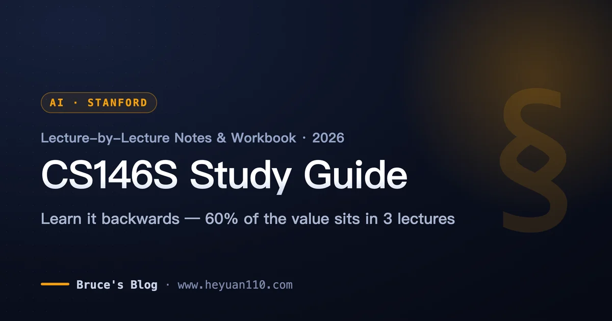
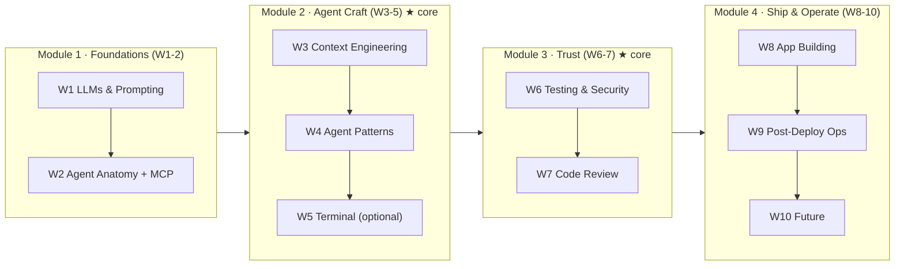
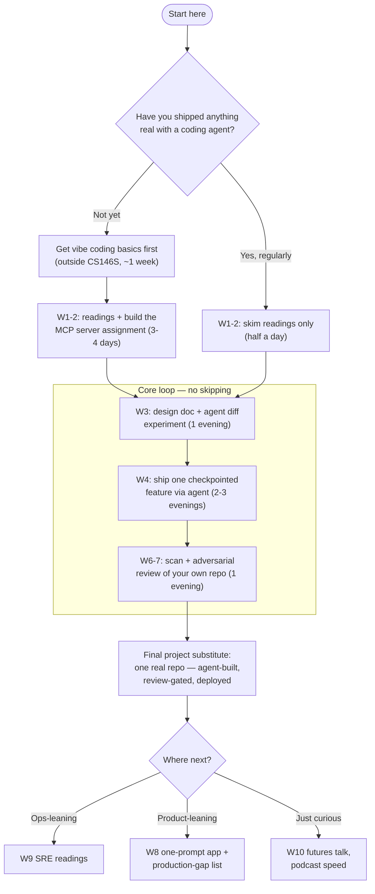

+++
date = '2026-07-02T14:00:00+08:00'
aliases = ['/posts/ai/2026-07-10-cs146s-study-guide/']
draft = false
title = 'CS146S Study Guide 2026: Lecture-by-Lecture Notes & Workbook'
description = 'Self-study Stanford CS146S in 2026: lecture-by-lecture verdicts, the exercises worth doing, Claude Code/Cursor tool mappings, and a route that skips filler.'
toc = true
tags = ['Stanford CS146S', 'Vibe Coding', 'AI Coding', 'Study Guide', 'Agentic Engineering']
keywords = ['cs146s study guide', 'cs146s lecture notes', 'cs146s the modern software developer', 'stanford cs146s syllabus 2026', 'stanford vibe coding course', 'how to self-study cs146s', 'cs146s assignments']

[[params.faqItems]]
question = "Is CS146S available online for free?"
answer = "Yes. The full syllabus, lecture slides, readings, and assignment code for Stanford CS146S (The Modern Software Developer) are public at themodernsoftware.dev and on GitHub. Guest lectures are the only component not fully available, though several talks exist on YouTube."

[[params.faqItems]]
question = "Is Stanford offering CS146S again in 2026?"
answer = "As of July 2026, ExploreCourses lists only the Autumn 2025 offering (instructor Mihail Eric). No Spring 2026 section ran. The 2026-27 bulletin publishes in mid-August 2026, so watch for an Autumn 2026 listing then. Eric also runs a paid 4-week public cohort on Maven, whose June 2026 run sold out."

[[params.faqItems]]
question = "How long does it take to self-study CS146S?"
answer = "Two weeks if you already use a coding agent daily and focus on Weeks 3, 4, 6, and 7 plus one real project. Six weeks if you follow the full 10-lecture sequence with assignments. Following the literal 10-week student pace is unnecessary — that cadence exists for quarter logistics, not learning efficiency."

[[params.faqItems]]
question = "Which CS146S weeks are the most important?"
answer = "Week 3 (Context Engineering), Week 4 (Agent Patterns), and Weeks 6-7 (Security and Code Review) carry most of the course's durable value. Week 5 (terminals) and Week 10 (future trends) are the safest to compress or skip for self-learners."

[[params.faqItems]]
question = "Do I need to do the CS146S assignments, or is reading enough?"
answer = "Do at least the Week 2 MCP server assignment and one full agent-built project. The final project is 80% of the Stanford grade for a reason: the course's thesis is that agent management is a practiced skill, not absorbed knowledge. Reading alone gives you vocabulary, not capability."
+++

You searched for three answers, so here they are up front. Stanford **CS146S** ("The Modern Software Developer") is a ten-lecture course on building software with AI coding agents — prompting, agent anatomy and MCP, context engineering, security, code review, and shipping — first taught by Mihail Eric in Fall 2025. It's worth self-studying in 2026, with one caveat this whole page defends: don't replay it linearly, because roughly 60% of the durable value sits in Weeks 3, 4, and 6–7, and the 80%-weight final project — not the readings — is the actual course. And nearly everything is free: full syllabus, slides, and readings at [themodernsoftware.dev](https://themodernsoftware.dev), eight weeks of assignment code on [GitHub](https://github.com/mihail911/modern-software-dev-assignments), with guest lectures the only piece not fully public.

That's the search answer. What no snippet can give you is the self-learner's operating manual: which lectures carry the value, which exercises repay your limited evening hours, and which tool to run each concept on in 2026. That's what this **CS146S study guide** is — a lecture-by-lecture verdict table, tool mappings, and two study routes keyed to where you're starting from. The course content itself gets full treatment in my five-part deep-dive series (start with the [course overview](/posts/ai/2026-02-24-stanford-cs146s-overview/)); this page is the operational layer on top.

One confession before the tables, because it shapes every recommendation below. On my first pass in February I did exactly what most people who bookmark this course do: read the Week 1 material, felt productive, stalled. The problem wasn't the material — it's that a university syllabus is optimized for enrolled students with grades and deadlines, not for a working developer studying at night. Everything on this page exists to prevent that stall.

## CS146S in July 2026: What Actually Changed

**The Fall 2025 run is still the latest complete public offering.** I checked Stanford's own systems rather than secondhand posts: [ExploreCourses](https://explorecourses.stanford.edu/) lists CS146S only for Autumn 2025-26 (3 units, instructor Mihail Eric), and no Spring 2026 section ran.

The 2026-27 bulletin publishes in mid-August 2026, so whether an Autumn 2026 edition happens is unconfirmed as I write this. But the materials haven't gone cold — the opposite. The [assignments repository](https://github.com/mihail911/modern-software-dev-assignments) has climbed to 3.8k stars and over 900 forks since I first covered the course in February.

The strongest signal is what the instructor did next. Eric compressed the course into a paid 4-week public version on Maven — [AI Software Development: From First Prompt to Production Code](https://maven.com/the-modern-software-developer/ai-course) — and the June 22–July 17, 2026 cohort **sold out**.

Read that sellout as two separate data points. First, demand for structured study of this material is real, not hype residue: working developers are paying for a distillation of what the free materials already contain. Second, even the course's creator concluded that ten weeks compresses to four for professionals. This guide follows the same logic, for free.

> As of July 2026, Stanford CS146S has run publicly once (Autumn 2025, instructor Mihail Eric). All lecture slides, readings, and eight weeks of assignments are free at themodernsoftware.dev and on GitHub (3.8k stars); the only paid option is a 4-week Maven cohort, whose June 2026 run sold out.

Every resource in one table — this plus the master table below is the whole guide in screenshot form:

| What | Status (July 2026) | Source |
|------|-------------------|--------|
| Stanford course | Autumn 2025 only; no Spring 2026 section; 2026-27 TBA in August | [ExploreCourses](https://explorecourses.stanford.edu/) |
| Course site + slides | Fully public, Fall 2025 materials | [themodernsoftware.dev](https://themodernsoftware.dev) |
| Assignments (8 weeks) | Public, 3.8k stars, Python 3.12 + Poetry | [GitHub](https://github.com/mihail911/modern-software-dev-assignments) |
| Paid public cohort | 4 weeks, June 2026 run sold out | [Maven](https://maven.com/the-modern-software-developer/ai-course) |
| Guest lectures | Partially available (some talks on YouTube) | — |
| Content deep-dives | Five-part series on this blog, free | [Part 1](/posts/ai/2026-02-24-stanford-cs146s-overview/) |

## The Master Table: Every Lecture, One Verdict, One Exercise

This is the artifact I wish someone had handed me in February — screenshot it, and the rest of the page becomes reference material. Each row: what the week is really about in one sentence, the single exercise with the best effort-to-insight ratio, the tool I'd run it on today, and where to go deeper. The star ratings are my judgment, not Stanford's; the reasoning follows in the notes.

| Wk | Lecture | Verdict (mine) | Do this (2–4 hrs) | Tool in 2026 | Deep read |
|----|---------|----------------|--------------------|--------------|-----------|
| 1 | LLMs & Prompting | ★★☆ Necessary floor, don't linger | Build the prompting playground; test one prompt 10× and measure variance | Any frontier model API | [Karpathy's LLM deep dive](https://www.youtube.com/watch?v=7xTGNNLPyMI) |
| 2 | Agent Anatomy & MCP | ★★★ The one assignment everyone should do | Write an MCP server from scratch, no framework | Claude Code + MCP SDK | [Part 1 §Week 2](/posts/ai/2026-02-24-stanford-cs146s-overview/) |
| 3 | Context Engineering | ★★★ Highest ROI of the course | Write a design doc, feed it to an agent, diff output vs. no-doc run | Claude Code / Cursor rules | [Part 2: Context Engineering](/posts/ai/2026-02-24-context-engineering-deep-dive/) |
| 4 | Agent Patterns | ★★★ Where "vibe coding" becomes management | Ship one real feature end-to-end with checkpointed autonomy | Claude Code plan mode | [Part 3: Agent Manager](/posts/ai/2026-02-24-agent-manager-patterns/) |
| 5 | Modern Terminal | ★☆☆ Skippable for CLI-native devs | Skim the Warp vs Claude Code positioning doc | Warp (or skip) | Warp University |
| 6 | Testing & Security | ★★★ The week that separates demo from product | Run a security scan on your own AI-written repo; count real vs. false positives | Semgrep + agent review pass | [Part 4: Secure Vibe Coding](/posts/ai/2026-02-24-secure-vibe-coding/) |
| 7 | Code Review | ★★☆ Pairs with W6; do them together | Adversarially review an AI PR: find 3 issues the agent missed | GitHub PR + second agent as critic | [Part 4: Secure Vibe Coding](/posts/ai/2026-02-24-secure-vibe-coding/) |
| 8 | Automated App Building | ★★☆ Fun, but the lesson is the gap | One-prompt an app, then list everything blocking production | v0 / Lovable, then Claude Code | [Part 5: Prototype to Production](/posts/ai/2026-02-24-prototype-to-production/) |
| 9 | Post-Deployment Ops | ★★☆ Read, don't build (unless ops is your job) | Read Google's SRE intro through an "agent on-call" lens | Read-only week | [Part 5: Prototype to Production](/posts/ai/2026-02-24-prototype-to-production/) |
| 10 | Future of SWE | ★☆☆ Podcast-tier; listen while commuting | Watch the Casado talk if available; skip otherwise | — | [Part 1 §Week 10](/posts/ai/2026-02-24-stanford-cs146s-overview/) |

Notice the shape of the ratings before you plan anything. Value clusters in Weeks 2–4 and 6–7 — the middle of the course. The edges (orientation at the start, futurism at the end) are where a self-learner's discipline goes to die, and they're also the most compressible.

## How the Course Actually Breaks Down

**The ten flat weeks hide a four-module structure with very unequal weights.** I mapped the lectures by what each one demands from you — reading, building, or judging — and this is what emerged:

Modules 2 and 3 are the course. Module 1 is the on-ramp; Module 4 is the panorama.

This split also answers the most common objection I hear — "aren't the Fall 2025 materials stale by now?" The perishable parts (Warp in Week 5, v0 in Week 8) are precisely the ones I'm telling you to compress. The core modules — context failure modes, autonomy checkpoints, security review gates — haven't moved since Fall 2025. Tool names expire in months; engineering judgment expires in years.

## CS146S Lecture Notes: Week-by-Week Commentary

The master table gives you verdicts; this section gives you the reasoning, uneven on purpose. Important weeks get paragraphs, skippable weeks get sentences.

### Weeks 1–2: Compress the First, Build the Second

**Week 1 is review if you've been using AI coding tools for six months** — with one takeaway worth keeping. The readings are genuinely good (Karpathy's LLM deep dive alone justifies the week if you've never watched it), but the durable part is the mindset the assignment forces: prompts are experiments with measurable variance, not incantations. When I ran the same extraction prompt ten times against the playground, the output schema drifted in three of ten runs. That 3-in-10 number — not any reading — is what made me stop trusting single-shot prompt results.

**Week 2 is my strongest "do the assignment" call in the entire course.** Build an MCP server from scratch — not from a template, not agent-scaffolded. It's the fastest way to stop treating agents as magic: once you've written the tool-listing handshake and watched a model decide (sometimes wrongly) which of your tools to call, the ecosystem stops being mysterious. The assignment cost me one evening and permanently changed how I write tool descriptions in my own projects — I now treat every description string as a prompt, because I've seen from the server side that that's exactly what it is.

### Week 3: The Highest-ROI Week — Do Not Skim

**If you study only one week deeply, make it this one.** Context engineering is what separates people who get consistent output from coding agents from people who get lottery tickets, and Week 3's reading list is still the best curated set on the topic. The [four context failure modes](https://www.dbreunig.com/2025/06/22/how-contexts-fail-and-how-to-fix-them.html) piece in particular names failures you've experienced but couldn't articulate: poisoning, distraction, confusion, conflict.

The exercise, which I've run myself: take a real feature from your backlog, write a one-page design doc (constraints, non-goals, relevant files, business rules), then run the same agent on the task twice — once with the doc, once with a bare prompt. Diff the outputs. In my run, the bare-prompt version invented a data model that contradicted an existing one two directories away; the doc version didn't. One afternoon, and the course's central lesson is sitting in your terminal.

I unpack the full week in [Part 2 of the deep-dive series](/posts/ai/2026-02-24-context-engineering-deep-dive/). For the 2026 state of the practice beyond the course materials — what held up, what turned out to be pseudo-technique — I updated my position in [Context Engineering for Coding Agents 2026](/posts/ai/2026-06-16-context-engineering-2026/).

### Week 4: Where You Become a Manager

**Week 4's durable content is the autonomy spectrum — and its assignment is the second most important in the course.** The question it tackles is the one the whole industry keeps circling: how much autonomy do you grant an agent, and where do you place checkpoints? The spectrum's answer: simple tasks run unattended; medium tasks get 80% time savings plus human polish; complex tasks need staged reviews.

The readings are effectively a Claude Code ecosystem tour — Boris Cherney, Claude Code's creator, was the guest — but the spectrum outlives any particular tool. The assignment, shipping a complete project by directing an agent rather than typing code, continues naturally from your Week 3 design doc. Full treatment in [Part 3: Agent Manager patterns](/posts/ai/2026-02-24-agent-manager-patterns/).

### Week 5: Skip It (Probably)

**If you already live in a terminal with Claude Code, skip this week.** Here's a judgment the official syllabus can't make but I can: this is the lecture most shaped by its guest speaker's company (Warp's CEO), and there's little in it that a CLI-native developer doesn't already do daily. Skim the Warp-vs-Claude-Code positioning doc for the taxonomy and move on. The exception: if you came to AI coding through GUI-first tools like Cursor and the terminal intimidates you, this week earns its slot — terminal fluency is a prerequisite for most serious agent workflows.

### Weeks 6–7: The Gate Between Toy and Product

**Treat these two as one unit — together they're the most sobering material in the course.** The Week 6 readings include Semgrep's study running coding agents against 11 large open-source projects: Claude Code surfaced 46 real vulnerabilities, but with an 86% false-positive rate and non-deterministic results on identical code. Sit with that combination. AI security review is real enough to be useful and unreliable enough that it cannot be your only gate.

Week 7 extends the skepticism to code review generally. The practical insight: AI-written code fails differently from human code — it looks locally correct everywhere while carrying systematic blind spots at edge cases and trust boundaries.

The exercise that made this concrete for me: I pointed a security scan plus a second agent (as adversarial reviewer) at a repo I had largely vibe-coded weeks earlier. Eleven findings; three real; and one of the real ones — an unvalidated redirect — sat in code I remembered "reviewing" at generation time. Nothing in the readings hit as hard as finding my own approved vulnerability. Both weeks in depth: [Part 4: Secure Vibe Coding](/posts/ai/2026-02-24-secure-vibe-coding/).

### Weeks 8–10: The Panorama — Read at Podcast Speed

**Week 8's lesson is the gap, not the generation.** One-prompt app building is the most fun week and the most misunderstood: generate an app, then write the itemized list of everything blocking production — that list is the actual deliverable. **Week 9 is a reading week** unless operations is your day job; SRE-meets-agents is a preview of where the industry is heading, not a skill for next sprint. **Week 10 is worth your commute, not your desk time.** All three fold into [Part 5: From Prototype to Production](/posts/ai/2026-02-24-prototype-to-production/).

## Self-Study Routes: The Two-Week Core vs. the Six-Week Full Pass

**Students take ten weeks because quarters are ten weeks — you should take two or six.** You don't have the quarter constraint, and you also lack the two things that make a slow pace survivable for students: external deadlines and a grade. My experience with self-paced material is blunt: any plan longer than six weeks silently becomes a plan I've abandoned. So, two routes, split by one question:

Side by side, the two routes look like this:

| | Two-week core | Six-week full pass |
|---|--------------|--------------------|
| You are | Already directing agents weekly | Haven't shipped anything real with an agent |
| Before starting | Nothing | ~1 week with a hands-on primer — my [vibe coding guide](/posts/ai/2026-02-22-vibe-coding-guide/) exists for exactly this |
| Weeks 1–2 | Skim readings, half a day | Readings + the MCP server assignment, 3–4 days |
| Core loop | W3 → W4 → W6/7 as three consecutive exercise blocks | Same blocks, spread across weeks |
| Project | One real repo, two focused weekends | Same |
| Module 4 | Optional, pick by interest | One elective |

If your answer to the entry question is "not yet," don't start with CS146S at all. The course assumes CS111-level programming plus some tool familiarity, and starting cold is how bookmarks die. Spend the primer week first, then enter through the six-week route.

Time-check the two-week core against the market, and it holds up: it's close to what the sold-out Maven cohort compresses to — four weeks at 3–4 hours per week is roughly the same total hours.

One difference between you and an enrolled student cuts in your favor. Students must follow the Fall 2025 tool choices to match assignment specs; you can substitute freely — run Week 4 on whatever agent you actually use, point Week 6's scan at your own codebase. Done deliberately, the self-learner's version of this course is more relevant to your work than the graded one.

## The Final Project Is 80% of the Grade — Here's Your Substitute

**A course that grades final project 80%, weekly assignments 15%, participation 5% is telling you it doesn't believe reading produces the skill.** I agree with that design completely, so I'll say it plainly: if you read all ten weeks and build nothing, you did not take this course. You read about it.

The substitute needs the same shape as the real final project — one repository that exercises the whole pipeline. My spec, which I've run myself (mine was an internal dashboard I'd been putting off):

1. **Pick something you genuinely want to exist.** Motivation, not information, is the scarce resource in self-study.
2. **Write the design doc before any generation** — constraints, non-goals, relevant files, business rules (Week 3).
3. **Build by directing an agent with explicit checkpoints**, not by accepting one giant diff (Week 4).
4. **Gate it before calling it done**: a security scan plus an adversarial agent review, then fix what's real (Weeks 6–7).
5. **Deploy it somewhere with at least minimal logging** (Weeks 8–9, at reduced depth).

The whole thing fits in two focused weekends, and it converts the course from vocabulary into capability. It also leaves you with the one thing no reading provides: a concrete memory of where your agent workflow broke — which is where your actual learning lives.

## Where This Guide Stops

Two honest limits. First, everything here is keyed to the Fall 2025 public materials — the latest complete run as of July 2026. If Stanford lists an Autumn 2026 edition when the new bulletin publishes in August, expect the guest lineup and the Week 5/8 tool choices to change, and expect the core modules to survive intact; I'll revisit this guide if the new syllabus diverges meaningfully.

Second, this workbook deliberately trades depth for navigation. Each core week deserves more than a verdict and an exercise, which is why the five-part deep-dive series exists. Use this page to decide where to spend your hours; use the series to spend them.

## Related Reading

- [Stanford CS146S Deep Dive (Part 1): Course Overview](/posts/ai/2026-02-24-stanford-cs146s-overview/) — what the course is and the full 10-week syllabus
- [Part 2: Context Engineering](/posts/ai/2026-02-24-context-engineering-deep-dive/) — the Week 3 material in depth
- [Part 3: Agent Manager Patterns](/posts/ai/2026-02-24-agent-manager-patterns/) — Week 4's autonomy spectrum and collaboration patterns
- [Part 4: Secure Vibe Coding](/posts/ai/2026-02-24-secure-vibe-coding/) — Weeks 6–7 on security and review
- [Part 5: From Prototype to Production](/posts/ai/2026-02-24-prototype-to-production/) — Weeks 8–9 on shipping and operating
- [Context Engineering for Coding Agents 2026](/posts/ai/2026-06-16-context-engineering-2026/) — what held up since the course, and what didn't
- [Vibe Coding Guide 2026](/posts/ai/2026-02-22-vibe-coding-guide/) — the on-ramp if you haven't shipped with an agent yet
