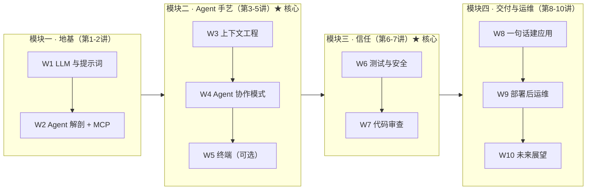

+++
date = '2026-07-02T14:00:00+08:00'
aliases = ['/posts/ai/2026-07-10-cs146s-study-guide/']
draft = false
title = '斯坦福 CS146S 自学手册 2026：逐讲笔记与实操路线'
description = '斯坦福 CS146S（The Modern Software Developer）自学手册：逐讲核心判断、必做练习与 2026 工具映射（Claude Code/Cursor），附两周速通与六周路线图。'
toc = true
tags = ['Stanford CS146S', 'Vibe Coding', 'AI Coding', 'Study Guide', 'Agentic Engineering']
keywords = ['stanford cs146s', 'cs146s', '斯坦福 cs146s', 'cs146s 笔记', 'cs146s 自学', '斯坦福 cs146s 笔记', 'cs146s 课程', 'stanford ai 编程课', 'cs146s 学习路线', '斯坦福 vibe coding 课程', 'cs146s 作业']

[[params.faqItems]]
question = "CS146S 是什么课？"
answer = "CS146S（The Modern Software Developer）是斯坦福 2025 年秋季首开的 AI 编程课，讲师 Mihail Eric，3 学分。内容覆盖 LLM 基础、Agent 架构、上下文工程、安全、代码审查到部署运维的完整软件工程生命周期，课程材料全部公开免费。"

[[params.faqItems]]
question = "CS146S 可以免费自学吗？"
answer = "可以。完整大纲、每讲 PPT、阅读材料都在官网 themodernsoftware.dev 公开，8 周作业代码在 GitHub（已 3.8k stars），国内都能直接访问。唯一不完整的是嘉宾演讲，部分能在 YouTube 找到。"

[[params.faqItems]]
question = "CS146S 自学要多久？"
answer = "如果你已经每天用 coding agent，聚焦第 3、4、6、7 讲加一个真实项目，两周够了；零基础走完整路线约六周。照搬学生的 10 周节奏没有必要——那是学期制的产物，不是学习效率的最优解。"

[[params.faqItems]]
question = "CS146S 哪几讲最值得学？"
answer = "第 3 讲（上下文工程）、第 4 讲（Agent 协作模式）、第 6-7 讲（安全与代码审查）承载了课程大部分长期价值。第 5 讲（终端工具）和第 10 讲（趋势展望）对自学者最可以压缩或跳过。"

[[params.faqItems]]
question = "2026 年斯坦福还开 CS146S 吗？"
answer = "截至 2026 年 7 月，ExploreCourses 只有 2025 秋季一期记录，2026 春季没有开课；2026-27 学年课表 8 月中旬发布。讲师 Mihail Eric 在 Maven 开了 4 周付费公开版，2026 年 6 月那期已售罄。"
+++

搜 **CS146S** 的人想知道三件事，开头先答完。第一，这是斯坦福 2025 秋季首开的 AI 编程课（The Modern Software Developer，讲师 Mihail Eric），十讲覆盖提示词、Agent 架构与 MCP、上下文工程、安全、代码审查到部署运维。第二，值得跟，但别按十周顺序啃——约 60% 的长期价值集中在第 3、4、6-7 讲，占总评 80% 的 Final Project 才是课程主体。第三，资料几乎全部免费：大纲、PPT、阅读材料在官网 [themodernsoftware.dev](https://themodernsoftware.dev)，8 周作业代码在 [GitHub](https://github.com/mihail911/modern-software-dev-assignments)，只有嘉宾演讲不全。

搜索答案给完了。摘要给不了的，是自学者真正需要的操作手册：哪几讲值钱、每讲该做哪个练习、2026 年该用什么工具落地。这篇 **CS146S 自学**手册干的就是这件事——一张逐讲判断总表、工具映射、按起点分流的两条路线。课程内容本身我写过五篇精读（从[课程全解析](/zh/posts/ai/2026-02-24-stanford-cs146s-overview/)开始），这篇是架在五篇之上的操作层。

国内读者关心的访问问题也一并交代：官网和 GitHub 都能直接打开；嘉宾演讲和第 1 讲的 Karpathy 视频在 YouTube 上，需要自己解决网络条件；Maven 付费版要国际信用卡——不过看完这篇，你大概率用不着它。

动手排计划之前，先坦白一件事，它决定了下面所有建议的形状。我 2 月份第一次打开官网时，也是把 Week 1 读完、产生一种"我在学习"的错觉，然后搁置了两周。问题不在材料——这门课的选材放到今天仍是同类最佳——而在大学课表是为有学分、有 deadline 的在校生设计的，不是为下班后挤时间的工程师设计的。

## 2026 年 7 月，CS146S 现在是什么状态

**2025 秋那一期仍然是最新的完整公开版本。** 这是我直接查斯坦福自己的系统得出的结论，不是转述二手帖子：[ExploreCourses](https://explorecourses.stanford.edu/) 上 CS146S 只有 Autumn 2025-26 一条记录（3 学分，讲师 Mihail Eric），2026 春季没有开课。

2026-27 学年课表要到 8 月中旬才发布，秋季续不续开，写这篇时还没有官方答案。但材料没有凉，反而在升温：[作业仓库](https://github.com/mihail911/modern-software-dev-assignments)从我 2 月第一次写它时涨到了 3.8k stars、900+ forks。

更有信息量的是讲师的动向。Eric 把课压缩成 4 周，在 Maven 上开了付费公开版 [AI Software Development: From First Prompt to Production Code](https://maven.com/the-modern-software-developer/ai-course)，2026 年 6 月 22 日到 7 月 17 日这期**已售罄**。

售罄这个信号值得拆成两句话看。第一，职业开发者愿意为免费材料的"结构化版本"掏钱，说明系统学这套东西的需求是真实的，不是热点余温。第二，连课程作者本人都认为，面向在职开发者，10 周可以压成 4 周——本文的路线遵循同一个逻辑，但你不用花钱。

> 截至 2026 年 7 月，斯坦福 CS146S 只完整开过一期（2025 秋，讲师 Mihail Eric）。全部 PPT、阅读材料和 8 周作业在 themodernsoftware.dev 与 GitHub 免费公开（3.8k stars）；唯一的付费选项是 Maven 上的 4 周公开版，2026 年 6 月期已售罄。

资源一张表备齐，连同下面的逐讲总表，就是这份手册的截图版：

| 项目 | 状态（2026 年 7 月） | 国内访问 | 来源 |
|------|---------------------|----------|------|
| 斯坦福正课 | 仅 2025 秋季一期；2026 春未开；2026-27 待 8 月课表 | — | [ExploreCourses](https://explorecourses.stanford.edu/) |
| 官网 + PPT | 全部公开（2025 秋季版材料） | 可直接访问 | [themodernsoftware.dev](https://themodernsoftware.dev) |
| 作业代码（8 周） | 公开，3.8k stars，Python 3.12 + Poetry | 可直接访问 | [GitHub](https://github.com/mihail911/modern-software-dev-assignments) |
| 付费公开版 | Maven 4 周制，2026 年 6 月期售罄 | 需国际信用卡 | [Maven](https://maven.com/the-modern-software-developer/ai-course) |
| 嘉宾演讲 | 部分可看（散见 YouTube） | 需自备网络条件 | — |
| 本站精读系列 | 五篇免费 | 可直接访问 | [第一篇](/zh/posts/ai/2026-02-24-stanford-cs146s-overview/) |

## 逐讲总表：一句判断、一个练习、一个工具

这是我 2 月份研究这门课时最希望有人递给我的一张表——截图存好，后面的正文就变成了查证用的参考资料。每行四件事：这一讲真正在讲什么、性价比最高的练习、2026 年我会用什么工具做、想深入去读哪篇。星级是我的判断，不是斯坦福的，理由在后面逐讲展开。

| 讲 | 主题 | 我的判断 | 配套实操（2-4 小时） | 2026 工具 | 深读 |
|----|------|----------|---------------------|-----------|------|
| 1 | LLM 与提示词 | ★★☆ 必要的地基，别恋战 | 做 prompting playground 作业：同一提示词跑 10 次，量化方差 | 任意前沿模型 API | [Karpathy LLM 深潜](https://www.youtube.com/watch?v=7xTGNNLPyMI) |
| 2 | Agent 解剖与 MCP | ★★★ 全课最该动手的一个作业 | 徒手写一个 MCP Server，不用框架不用脚手架 | Claude Code + MCP SDK | [第一篇 §Week 2](/zh/posts/ai/2026-02-24-stanford-cs146s-overview/) |
| 3 | 上下文工程 | ★★★ 全课 ROI 最高 | 写一页设计文档喂给 agent，和裸提示词跑同一任务做 diff | Claude Code / Cursor rules | [第二篇：上下文工程](/zh/posts/ai/2026-02-24-context-engineering-deep-dive/) |
| 4 | Agent 协作模式 | ★★★ 从"写代码"到"管 Agent"的分水岭 | 用带检查点的方式指挥 agent 完整交付一个真实功能 | Claude Code plan mode | [第三篇：Agent Manager](/zh/posts/ai/2026-02-24-agent-manager-patterns/) |
| 5 | 现代终端 | ★☆☆ 终端老手可跳过 | 扫一眼 Warp vs Claude Code 的定位文档即可 | Warp（或直接跳过） | Warp University |
| 6 | 测试与安全 | ★★★ demo 和产品之间的那道闸门 | 对自己 vibe coding 出来的仓库跑安全扫描，数真假阳性 | Semgrep + agent 复审 | [第四篇：安全 Vibe Coding](/zh/posts/ai/2026-02-24-secure-vibe-coding/) |
| 7 | 代码审查 | ★★☆ 和第 6 讲捆着学 | 对抗式审查一个 AI PR：找出 agent 自己没发现的 3 个问题 | GitHub PR + 第二个 agent 当评审 | [第四篇：安全 Vibe Coding](/zh/posts/ai/2026-02-24-secure-vibe-coding/) |
| 8 | 一句话建应用 | ★★☆ 好玩，但课在"差距"上 | 一句话生成一个应用，然后列出所有不能上生产的理由 | v0 / Lovable，然后 Claude Code | [第五篇：原型到生产](/zh/posts/ai/2026-02-24-prototype-to-production/) |
| 9 | 部署后运维 | ★★☆ 读就行，别搭（除非你做运维） | 用"agent 值班"的视角读 Google SRE 导论 | 纯阅读周 | [第五篇：原型到生产](/zh/posts/ai/2026-02-24-prototype-to-production/) |
| 10 | 软件工程的未来 | ★☆☆ 播客级内容，通勤听 | 有 Casado 演讲就看，没有就跳过 | — | [第一篇 §Week 10](/zh/posts/ai/2026-02-24-stanford-cs146s-overview/) |

排计划之前先看一眼星级的分布形状。价值集中在第 2-4 讲和第 6-7 讲，也就是课程的中段；两头——开头的入门铺垫、结尾的趋势畅想——恰恰是自学者热情耗尽的地方，也恰恰是最可压缩的部分。

## 课程的真实结构：四个模块，权重不等

**官方大纲平铺十讲，平铺之下藏着一个权重严重不等的四模块结构。** 我按"每讲对你的要求是读、是做、还是判断"重新归类之后，结构是这样的：

模块二和模块三就是这门课本身。模块一是引桥，模块四是全景图。

这个划分还顺手回答了最高频的疑虑——"2025 秋的材料是不是过时了"。会过时的部分（第 5 讲的 Warp、第 8 讲的 v0 这些产品名）恰好是我建议你压缩的部分；两个核心模块讲的上下文失效模式、自主度检查点、安全审查闸门，从 2025 秋到现在一个都没变。工具名的保质期以月计，工程判断的保质期以年计。

## CS146S 逐讲笔记：判断的理由

总表给结论，这一节给推导。篇幅刻意不均——重要的讲多写，该跳的讲一句话打发。

### 第 1-2 讲：第 1 讲快进，第 2 讲动手

**用了半年以上 AI 编程工具的人，第 1 讲基本是复习**，但有一样东西值得留下。阅读清单本身质量很高——没看过 Karpathy 那个几小时的 LLM 深潜视频的话，它单独就值回这一讲——真正耐久的是作业强迫你建立的实验心态：把提示词当成有可测方差的实验对象，而不是咒语。

我做这个作业时，把同一个信息抽取提示词连跑了十次，输出 schema 在其中三次发生了漂移。让我从此不再信"跑一次就当结论"的，是这个 3/10 的数字，不是任何一篇阅读材料。

**第 2 讲是我在整门课里喊得最响的一次"必须做作业"。** 徒手写一个 MCP Server——不套模板，也不让 agent 帮你脚手架——是给 agent 祛魅最快的路径。亲手写完工具列表握手、亲眼看着模型（有时是错误地）决定调用你的哪个工具之后，整个 agent 生态就不神秘了。

这个作业花了我一个晚上，却永久改变了我在自己项目里写工具描述的方式。我现在把每一条 description 都当提示词来写，因为我在 server 这一侧亲眼确认过：它就是提示词。

### 第 3 讲：全课 ROI 最高的一讲，禁止跳读

**只精读一讲的话，选这讲。** 上下文工程是"从 coding agent 拿到稳定输出的人"和"每次都在抽奖的人"之间的分界线，而第 3 讲的阅读清单至今仍是这个主题下最好的一份选材。尤其是[上下文的四种失效模式](https://www.dbreunig.com/2025/06/22/how-contexts-fail-and-how-to-fix-them.html)那篇，它给你经历过却叫不出名字的故障逐个命了名：污染、分心、混淆、冲突。

配套练习我自己跑过，也建议你照做：从积压需求里挑一个真实功能，写一页设计文档（约束、非目标、相关文件、业务规则），让同一个 agent 把任务跑两遍——一遍带文档、一遍裸提示词，diff 两次输出。

我那次实验里，裸提示词版本凭空发明了一个数据模型，和两层目录之外的既有模型直接冲突；带文档的版本没有。一个下午，这门课的中心论点就摆在你自己的终端里。

这一讲的完整拆解见[精读第二篇：上下文工程](/zh/posts/ai/2026-02-24-context-engineering-deep-dive/)。想知道课程之后这套方法在 2026 年哪些站住了、哪些被证明是伪技巧，我在[《上下文工程 2026》](/zh/posts/ai/2026-06-16-context-engineering-2026/)里更新过立场。

### 第 4 讲：你从工程师变成管理者的那一讲

**第 4 讲耐久的内容是那条自主度光谱，它的作业是全课第二重要的练习。** 它回答的是全行业都在绕圈的问题：给 agent 多大自主权、检查点设在哪。光谱的答案：简单任务放手跑，中等任务省 80% 时间但要人工收尾，复杂任务必须分段审查。

阅读材料基本是一次 Claude Code 生态巡礼——嘉宾就是 Claude Code 之父 Boris Cherney——但光谱比任何具体工具都活得久。作业是全程指挥 agent 而不是亲手敲代码地交付一个完整项目，正好接在你第 3 讲写的设计文档后面。完整分析见[精读第三篇：Agent Manager](/zh/posts/ai/2026-02-24-agent-manager-patterns/)。

### 第 5 讲：大概率可以跳

**本来就活在终端里、天天跑 Claude Code 的人，直接跳。** 这是官方大纲说不出口、但我可以直说的判断：第 5 讲是被嘉宾公司（Warp 的 CEO）塑形最重的一讲，对命令行原住民来说没有多少不在每天做的事。扫一眼 Warp vs Claude Code 那篇定位文档，拿个分类框架就够了。

例外只有一种：你是从 Cursor 这类 GUI 工具入门、对命令行发怵的人。那这一讲值得认真上——终端熟练度是后面所有严肃 agent 工作流的前置条件。

### 第 6-7 讲：玩具和产品之间的闸门

**这两讲当一个整体学，它们合起来是全课最清醒的部分。** 第 6 讲的阅读材料里有 Semgrep 拿 coding agent 扫 11 个大型开源项目的实测：Claude Code 找出 46 个真实漏洞，但误报率 86%，更糟的是同样代码两次扫描结果不一致。这组数字值得反复咀嚼——AI 安全审查真实到值得用，又不可靠到绝不能当唯一闸门。

第 7 讲把同样的怀疑延伸到代码审查。实用结论一句话：AI 代码的失效方式和人类代码不同——局部看处处正确，但在边界条件和信任边界上有系统性盲区。

让这一切变得具体的，是我给自己做的练习：把安全扫描加第二个 agent（当对抗式评审）指向一个我几周前基本靠 vibe coding 写完的仓库。扫出 11 个 findings，3 个是真的；其中一个真漏洞——一处未校验的重定向——就在我记得当时"审过"的代码里。

任何阅读材料的教育效果，都比不上发现自己亲手批准过的漏洞。两讲的深度展开见[精读第四篇：安全 Vibe Coding](/zh/posts/ai/2026-02-24-secure-vibe-coding/)。

### 第 8-10 讲：全景图，用播客速度过

**第 8 讲的课在"差距"上，不在"生成"上。** 一句话生成应用最好玩也最容易学歪：重点不是你能生成一个应用，而是它和能收钱的产品之间的逐项差距。生成一个，然后写出"不能上生产的理由清单"——清单才是交付物。

**第 9 讲当阅读周处理**，除非运维是你的本职。SRE 遇上 agent 那套东西是行业去向的预告片，不是你下个迭代就会用的技能。**第 10 讲配得上你的通勤时间**，配不上你的书桌时间。三讲都收在[精读第五篇：原型到生产](/zh/posts/ai/2026-02-24-prototype-to-production/)里。

## 自学路线：两周速通还是六周完整

**在校生用十周，是因为学期就是十周；你应该用两周或六周。** 你没有学期约束，也没有让慢节奏对学生生效的那两样东西——外部 deadline 和成绩单。我对自学材料的经验很直白：任何超过六周的计划，都会悄悄变成一个已放弃的计划。所以路线只给两条，用一个问题分流：

两条路线并排比一下：

| | 两周速通 | 六周完整 |
|---|---------|---------|
| 适合谁 | 已经每周指挥 agent 干活 | 还没用 agent 交付过真实的东西 |
| 前置 | 无 | 先花约 1 周跟上手型入门——我的 [Vibe Coding 完全指南](/zh/posts/ai/2026-02-22-vibe-coding-guide/)就是为这个写的 |
| 第 1-2 讲 | 只扫阅读材料，半天 | 阅读 + MCP Server 作业，3-4 天 |
| 核心闭环 | 第 3 → 4 → 6/7 讲，三个连续练习块 | 同样三块，摊开到几周 |
| 项目 | 一个真实仓库，两个专注的周末 | 相同 |
| 模块四 | 按兴趣选，可不做 | 选修一讲 |

如果分流问题的答案是"还没有"，那就先别碰 CS146S。这门课默认你有 CS111 级别的编程底子加基本工具经验，冷启动硬啃是收藏夹吃灰的标准路径——先补那一周入门，再走六周路线进场。

拿两周速通和市场对个表，它站得住：这条路线和售罄的 Maven 付费版在总时长上几乎重合（4 周 × 每周 3-4 小时）。这不是巧合，这就是这套材料对在职开发者的天然密度。

还有一处自学者反而占便宜。在校生必须按 2025 秋的工具选型走，因为作业要对规格评分；你可以自由替换——第 4 讲用你真实在用的 agent 跑，第 6 讲的扫描直接指向你自己的代码库。只要替换是有意识的，自学版 CS146S 比学分版更贴近你的工作。

## Final Project 占总评 80%：自学者的替代方案

**一门课把分数排成 Final Project 80%、周作业 15%、课堂参与 5%，等于明说它不相信"读"能产生这项能力。** 这个设计我完全同意，所以话也说直白：十讲全读完但什么都没做，你就没上过这门课，你只是读了一篇关于它的长文。

替代方案要和真 Final Project 同构——用一个仓库把整条管线走通。我自己跑过一遍的规格（我选的是拖了很久没做的一个内部看板）：

1. **挑一个你真心希望它存在的东西。** 自学里稀缺的是动力，不是信息。
2. **生成任何代码之前先写设计文档**——约束、非目标、相关文件、业务规则（第 3 讲）。
3. **用带显式检查点的方式指挥 agent 构建**，而不是一口气收下一个巨型 diff（第 4 讲）。
4. **宣布完成之前先过闸门**：安全扫描加对抗式 agent 审查，修掉真问题（第 6-7 讲）。
5. **部署到带最低限度日志的环境**（第 8-9 讲，降低深度即可）。

整套流程两个专注的周末装得下，它把这门课从词汇表变成肌肉记忆。它还会留给你任何阅读都给不了的东西：一份"我的 agent 工作流在哪一步断掉"的具体记忆——你真正的学习发生在那里。

## 这份手册的边界

两个诚实的限定。第一，本文全部基于 2025 秋季的公开材料——截至 2026 年 7 月这是最新的完整版本。如果 8 月发布的 2026-27 课表里出现秋季新开的 CS146S，嘉宾阵容和第 5、8 讲的工具选型大概率会换，两个核心模块大概率原样保留；新大纲若有实质变化，我会回来更新这篇。

第二，这份手册刻意用深度换导航——每个核心讲值得的篇幅远超"一句判断加一个练习"，所以五篇精读系列才存在。用这一页决定把时间花在哪，用那五篇去把时间花掉。

## Related Reading

- [斯坦福 CS146S 全解析（第一篇）：课程综述](/zh/posts/ai/2026-02-24-stanford-cs146s-overview/) — 课程是什么、完整 10 周大纲
- [第二篇：上下文工程](/zh/posts/ai/2026-02-24-context-engineering-deep-dive/) — 第 3 讲的深度展开
- [第三篇：Agent Manager](/zh/posts/ai/2026-02-24-agent-manager-patterns/) — 第 4 讲的自主度光谱与协作模式
- [第四篇：安全 Vibe Coding](/zh/posts/ai/2026-02-24-secure-vibe-coding/) — 第 6-7 讲的安全与审查
- [第五篇：原型到生产](/zh/posts/ai/2026-02-24-prototype-to-production/) — 第 8-9 讲的交付与运维
- [上下文工程 2026：哪些方法真的有效](/zh/posts/ai/2026-06-16-context-engineering-2026/) — 课程之后，这套方法的最新战况
- [Vibe Coding 完全指南 2026](/zh/posts/ai/2026-02-22-vibe-coding-guide/) — 还没用 agent 交付过东西的人从这里进
