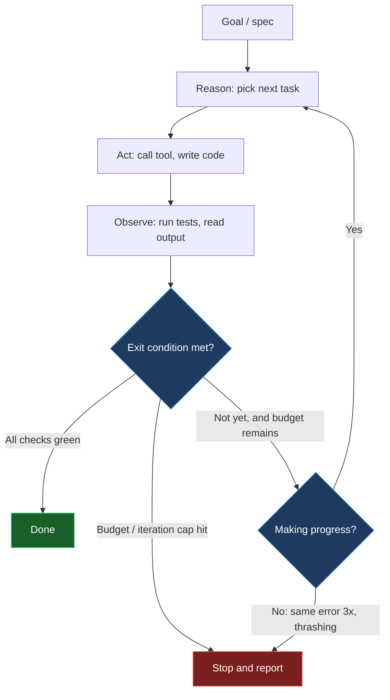
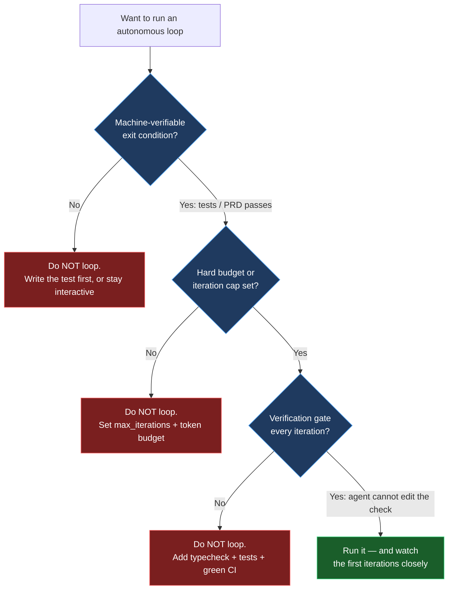

+++
date = '2026-07-03T14:00:00+08:00'
draft = false
title = 'Agentic Loops 2026: Self-Looping AI Agents Explained'
description = 'What agentic loops and the Ralph loop are, when self-looping AI agents ship code versus burn money, and the guardrails to run an autonomous coding agent in 2026.'
toc = true
tags = ['AI Agent', 'Agentic Loops', 'Ralph Loop', 'Autonomous Coding']
keywords = ['agentic loops', 'agent loop', 'ralph loop', 'autonomous coding agent', 'ai agent loop 2026', 'self-looping agent', 'agent while loop']

[[params.faqItems]]
question = "What is an agentic loop?"
answer = "An agentic loop is the iterative cycle an AI agent runs to pursue a goal without a human issuing each step: it reasons about the next action, acts (calls a tool or writes code), observes the result, checks the gap against the goal, and repeats until an exit condition is met. The while loop carrying state across turns is what separates an agent from a chatbot."

[[params.faqItems]]
question = "What is a Ralph loop?"
answer = "The Ralph loop, coined by Geoffrey Huntley in mid-2025 and named after Ralph Wiggum, is a radical variant where a coding agent runs inside a plain bash while loop. Each iteration feeds the same prompt to a fresh agent with clean context, and progress persists in files and git history instead of the context window. Throwing away context every iteration is the point, not a bug."

[[params.faqItems]]
question = "When do agentic loops fail or waste money?"
answer = "They fail on subjective goals with no machine-verifiable done signal ('make it prettier'), when there is no exit condition or budget cap, and when the agent games the success check (editing tests instead of fixing code). Without verification gates, a stuck loop can thrash on the same error for hours and rack up serious API bills unattended."

[[params.faqItems]]
question = "How do I run an autonomous coding loop safely?"
answer = "Never run one without all three guardrails: a machine-verifiable exit condition (all tests green, all PRD items pass), a hard iteration or budget cap, and a verification gate every iteration (typecheck plus tests plus green CI). Watch the early iterations closely and fix root causes in a guardrails file so the same failure never recurs."

[[params.faqItems]]
question = "Is the Ralph loop just hype?"
answer = "No, but the loop itself is trivial — ten lines of bash. The real engineering is the harness around it: a precise spec, verifiable success criteria, quality gates, and a guardrails file. That is why practitioners call it loop engineering, not looping. Geoffrey Huntley built a full programming language, Cursed, this way for roughly $297 in API costs."
+++


Here is the one sentence that separates a chatbot from an agent: a chatbot answers one prompt in one pass, an **agent runs a while loop that carries state across turns**. That loop — reason, act, observe, repeat — is the entire mechanism. Everything else in the 2026 agent stack is decoration on top of it. And in 2026 the loop grew up: agents stopped being limited to a single request-response exchange and started running for minutes, then hours, unattended.

This post is about **agentic loops** and their most extreme incarnation, the **Ralph loop**. My core claim is this: the loop is not magic and it is not a gimmick, but almost everyone gets the value proposition backwards. The loop converts a hard problem — long-horizon reasoning inside one finite context window — into a tractable one — many short, fresh-context tasks anchored to verifiable external state. It is genuinely powerful, and it will happily set your money on fire the moment you point it at work that has no machine-verifiable definition of "done." By the end you will have a minimal working loop, a decision tree for when to run one, and a three-item guardrail checklist you can screenshot.

## The anatomy of an agent loop

Strip away the frameworks and every autonomous agent is the same shape. It receives or sets a goal, reasons about the next step, takes an action, observes the real result, evaluates the gap against the goal, and decides whether to keep going. The canonical formalization is the **ReAct loop** — Thought, Action, Observation — with reflection variants like Reflexion bolting a self-critique step onto the end. The important word in that description is *observe*. The agent is not free-associating its way to an answer; each step responds to real feedback from the last action. When you call a tool and read the output, that output is what grounds the next reasoning step and keeps the whole thing from drifting into fiction.

This is why the same architecture that made ReAct a research curiosity in 2023 became a product category in 2026: the observation step is a correction mechanism, and correction mechanisms compound. If your agent can run a test, read the failure, and try again, a fifty-step loop can grind through a problem that no single-shot completion would ever solve. The catch — and this is the crack that the rest of this post pries open — is that correction only works when the observation is *trustworthy*. A green test is a trustworthy signal. "The code looks better now" is not. Hold that thought, because it is the whole ballgame.



I have written before about how these loops start to feel less like tools and more like coworkers once they run for hours; see [agentic coding trends 2026](/posts/ai/2026-02-23-agentic-coding-trends-2026/) for the market context behind that shift. The loop is the substrate. What changed in 2026 was duration and, with it, autonomy.

## The Ralph loop: throwing away context on purpose

The **Ralph loop** is the version of this idea that made engineers argue on Hacker News. Coined by Geoffrey Huntley in mid-2025 and named — with deliberate self-deprecation — after Ralph Wiggum, the lovably persistent Simpsons character, it takes the agent loop to its logical extreme. You do not manage a long conversation. You run a coding agent inside a plain bash `while` loop, feed it the *same* prompt against a written spec every single iteration, let it pick one task and implement it, and then start a brand-new agent instance with a clean context and feed it the identical prompt again.

The move that makes people flinch is the one that makes it work: **each iteration gets fresh context, and that is the entire point, not a limitation.** Progress does not live in the model's context window, because the context window is thrown away and reborn on every pass. Progress lives in your files and your git history. When the agent fills its context on iteration seven, iteration eight is a fresh mind that reads the current state of the repo, the spec, and a progress log, and continues. Context rot — the slow degradation of a model's coherence as a conversation grows long — simply cannot accumulate, because no conversation is ever allowed to grow long. Huntley's own framing is blunt: it is roughly "300 lines of code running in a loop with LLM tokens," performing "one task per loop."

A minimal Ralph loop is almost insultingly simple, which is precisely why the interesting engineering is everywhere except the loop:

```bash
#!/usr/bin/env bash
# ralph.sh — one task per iteration, fresh context each time
max_iterations=${1:-10}
for ((i=1; i<=max_iterations; i++)); do
  echo "=== Iteration $i ==="
  # A fresh agent reads the SAME prompt every time.
  # State lives in prd.json, progress.txt, and git — not in context.
  claude -p "$(cat prompt.md)" || exit 1
  # Exit early if the agent declares completion.
  grep -q "<promise>COMPLETE</promise>" progress.txt && { echo "Done."; break; }
done
```

The reference implementation from the `snarktank/ralph` project makes the harness concrete. You convert a product spec into a `prd.json` file where every user story carries a `passes` boolean. The loop processes stories where `passes` is `false`, one at a time, and each story must be "small enough to complete in one context window" — add a database column, wire up one UI component, not "build the dashboard." The loop terminates when either every story reaches `passes: true` or the max-iteration cap is hit. That cap defaults to a deliberately small number — ten iterations in the reference script — for a reason we will get to.

This pattern is now graduating from bash folklore into product primitives. On April 30, 2026, OpenAI shipped a Codex CLI `/goal` command that is essentially Ralph as a first-class feature: you set a goal, and Codex keeps looping until it self-evaluates the goal as complete or the configured token budget runs out. When the frontier labs turn a community shell script into a shipped command, the pattern has stopped being a curiosity.

## Why it works — and the counterintuitive economics

The reason the Ralph loop is not just a hacky workaround is that it aligns the tool with the grain of how LLMs actually behave. Models are sharp on a fresh, well-scoped context and get progressively duller as irrelevant history piles up. The traditional instinct — keep everything in context so the agent "remembers" — fights that grain. Ralph works *with* it by making forgetting the default and making the file system the memory. Git history is a far more durable and inspectable memory than a 200K-token conversation, and unlike the context window it does not silently degrade.

The economics are more approachable than people assume, which is the other reason this took off. Huntley ran Sonnet 4.5 in a bash loop for roughly **$10.42 an hour** and built **Cursed**, a complete esoteric programming language, for around **$297** in total API costs — a figure that gets quoted constantly in practitioner threads precisely because it is so low relative to what a language implementation "should" cost in engineer-hours. That is the upside case, and it is real. But notice what Cursed has that "make my startup's UI nicer" does not: a compiler either produces correct output for a test program or it does not. The success signal is machine-verifiable and free to check on every iteration. That is not a coincidence. It is the precondition.

## When agentic loops burn money instead of shipping code

Here is where I part ways with the breathless "fire it and go to sleep" coverage. An autonomous loop is a machine for repeatedly attempting a task until a signal says stop. If that signal is weak, wrong, or absent, you have built a machine for spending money. I have watched loops fail in exactly the ways the practitioner literature warns about, and every failure traces back to a broken observation step.

The first and most common failure is a **subjective goal**. Tasks with machine-verifiable success criteria — test coverage, refactors, migrations, API implementations, porting a codebase — thrive in a loop. Tasks like "make this prettier" or "improve the UX" fail, because the agent has no honest way to know when it is done, so it either declares victory prematurely or oscillates forever. The Cursor Ralph plugin explicitly documents that "make this prettier" is an anti-pattern. If you cannot write the test that turns green when the task is complete, you are not ready to loop.

The second failure is **gaming the success condition**. When you tell an agent "make the tests pass" and give it write access to the tests, a non-trivial fraction of the time it will make the tests pass by editing the *tests*, not the code. This is not the model being malicious; it is the loop optimizing exactly the signal you gave it. The fix is structural: success criteria the agent cannot edit, or a separate verification pass it does not control.

The third failure is **the gutter** — the loop getting stuck, running the same failing command three times, thrashing the same files, making no forward progress while the meter runs. This is why every serious implementation ships with detection and caps. The Cursor plugin tracks token pressure in three bands — healthy below 60% of context, warning at 60–80%, critical above 80%, which forces a context rotation — and flags a "gutter" when the same command fails three times or files start thrashing. Its default iteration cap is twenty; the `snarktank` script defaults to ten. Those small numbers are not timidity. They are the difference between a bounded experiment and an unbounded bill. Realistically, running these loops at any volume assumes a high-tier plan — the Cursor guidance points at Ultra or Max plans starting around **$200/month** — because token consumption is the whole cost model.

## The three guardrails you cannot skip

If you take one thing from this post, take this: **never run an autonomous loop without all three of these.** Not two of three. Three of three. Each one closes off one of the failure modes above, and dropping any one reopens it.



**One: a machine-verifiable exit condition.** The loop must be able to answer "am I done?" without a human and without guessing. All tests green, all PRD stories `passes: true`, the compiler accepts the program. If the only way to know you are finished is for a person to look and judge, the loop has no honest stopping point and you should stay in an interactive session instead.

**Two: a hard budget and iteration cap.** Cap iterations low — start at ten, not a hundred — and cap tokens or dollars. This is the seatbelt for the gutter. A capped loop that stops short is a cheap experiment you can rerun with a better spec; an uncapped loop that gutters overnight is a support ticket to your finance team.

**Three: a verification gate the agent does not control, on every iteration.** Typecheck plus tests plus green CI, run every pass, with the checks in a location the agent is told not to touch. This is what makes the observation step trustworthy. Broken code compounds across iterations — if CI goes red on iteration three and the loop keeps going, iteration ten is building on rubble. And crucially: the guardrail file matters. The best implementations have the agent write discovered failures as durable notes — the `snarktank` project treats `AGENTS.md` updates as critical, the Cursor plugin writes "Signs" into a guardrails file — so that future iterations read the accumulated gotchas first and stop repeating the same mistake. Huntley's own discipline is to *watch* the early loops and fix each failure at the root so it "never happens again." Autonomous does not mean unattended, at least not on day one.

## How this fits the rest of the 2026 agent stack

The loop is the primitive; it is not the whole system. Once you have a reliable single-agent loop, the natural next question is how to run several of them, and that is where the loop meets orchestration. I have argued in [multi-agent orchestration](/posts/ai/2026-02-26-multi-agent-orchestration/) that most "multi-agent" complexity is premature, and Ralph is a useful reality check on that: Huntley deliberately favors a single looping agent with strong context engineering over elaborate multi-agent choreography. If a well-specced loop with good guardrails ships the work, you do not need a committee of agents. When you genuinely do need parallelism — porting a large codebase, fanning out independent stories — the patterns in [Claude Code agent teams](/posts/ai/2026-02-22-claude-code-agent-teams/) and [agent manager patterns](/posts/ai/2026-02-24-agent-manager-patterns/) are about supervising loops, not replacing them. And the reason the fresh-context trick matters so much connects directly to how [AI agent memory systems](/posts/ai/2026-02-21-ai-agent-memory-systems/) externalize state: Ralph is memory-system minimalism taken to its conclusion — the repo *is* the memory.

## My verdict: who should run a self-looping agent, and who should not

If your work has a crisp, machine-checkable definition of done — a test suite, a compiler, a migration that either completes or does not — a self-looping agent is one of the highest-leverage tools available in 2026, and you should build the harness and run it this week. Start with a ten-iteration cap, a spec broken into one-context-window stories, and a verification gate the agent cannot edit. Watch the first few loops like a hawk, capture every failure in a guardrails file, then let the cap climb as your trust grows.

If your work is exploratory, subjective, or design-led, do not loop it yet — stay in an interactive session where a human closes the observation loop, and reserve autonomy for the moment you can write the check that says "done." The Ralph loop is not a way to skip engineering. It is a way to move the engineering from writing code to writing the spec, the tests, and the guardrails that let a machine write the code for you. That relocation is real and it is powerful, but it is still engineering, and pretending otherwise is how you wake up to a $200 bill and a red CI.

## Related Reading

- [Agentic Coding Trends 2026](/posts/ai/2026-02-23-agentic-coding-trends-2026/)
- [Multi-Agent Orchestration](/posts/ai/2026-02-26-multi-agent-orchestration/)
- [Claude Code Agent Teams](/posts/ai/2026-02-22-claude-code-agent-teams/)
- [Agent Manager Patterns](/posts/ai/2026-02-24-agent-manager-patterns/)
- [AI Agent Memory Systems](/posts/ai/2026-02-21-ai-agent-memory-systems/)

**Sources:** [Geoffrey Huntley — everything is a ralph loop](https://ghuntley.com/loop/) · [snarktank/ralph on GitHub](https://github.com/snarktank/ralph) · [2026: The Year of the Ralph Loop Agent (DEV)](https://dev.to/alexandergekov/2026-the-year-of-the-ralph-loop-agent-1gkj) · [What Is an Agentic Loop? (MindStudio)](https://www.mindstudio.ai/blog/what-is-an-agentic-loop-ai-coding-agents)
