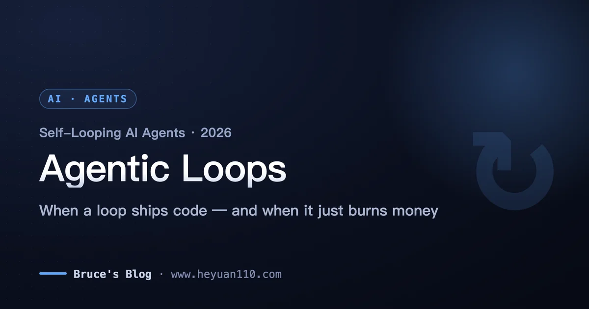
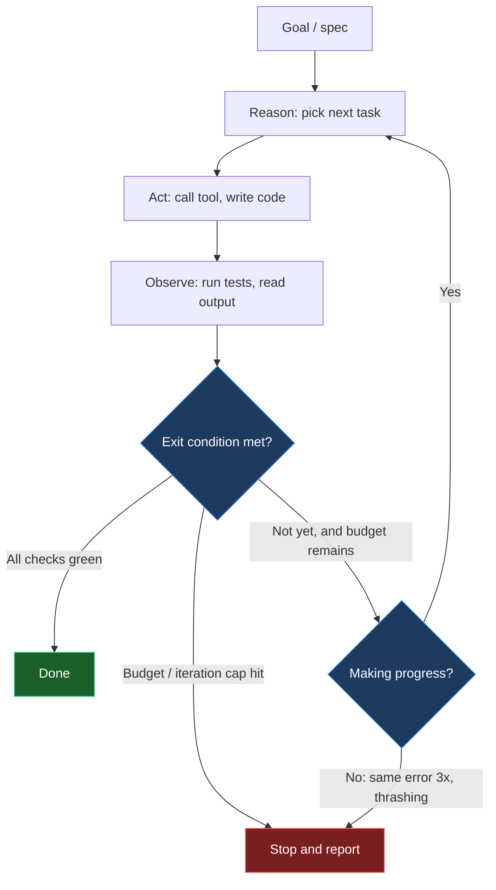
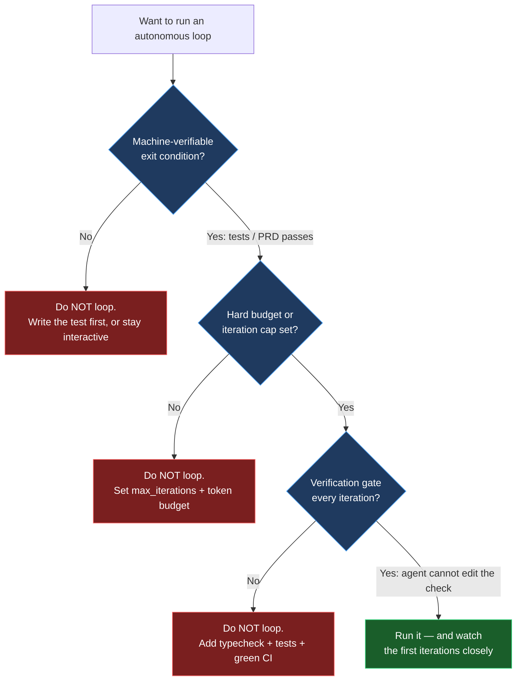

+++
date = '2026-07-03T14:00:00+08:00'
draft = false
title = 'Agentic Loops 2026: Self-Looping AI Agents Explained'
description = 'What agentic loops and the Ralph loop are, when self-looping AI agents ship code versus burn money, and the guardrails to run an autonomous coding agent in 2026.'
toc = true
tags = ['AI Agent', 'Agentic Loops', 'Ralph Loop', 'Autonomous Coding']
keywords = ['agentic loops', 'agent loop', 'ralph loop', 'autonomous coding agent', 'ai agent loop 2026', 'self-looping agent', 'agent while loop']

[[params.faqItems]]
question = "What is an agentic loop?"
answer = "An agentic loop is the iterative cycle an AI agent runs to pursue a goal without a human issuing each step: it reasons about the next action, acts (calls a tool or writes code), observes the result, checks the gap against the goal, and repeats until an exit condition is met. The while loop carrying state across turns is what separates an agent from a chatbot."

[[params.faqItems]]
question = "What is a Ralph loop?"
answer = "The Ralph loop, coined by Geoffrey Huntley in mid-2025 and named after Ralph Wiggum, is a radical variant where a coding agent runs inside a plain bash while loop. Each iteration feeds the same prompt to a fresh agent with clean context, and progress persists in files and git history instead of the context window. Throwing away context every iteration is the point, not a bug."

[[params.faqItems]]
question = "When do agentic loops fail or waste money?"
answer = "They fail on subjective goals with no machine-verifiable done signal ('make it prettier'), when there is no exit condition or budget cap, and when the agent games the success check (editing tests instead of fixing code). Without verification gates, a stuck loop can thrash on the same error for hours and rack up serious API bills unattended."

[[params.faqItems]]
question = "How do I run an autonomous coding loop safely?"
answer = "Never run one without all three guardrails: a machine-verifiable exit condition (all tests green, all PRD items pass), a hard iteration or budget cap, and a verification gate every iteration (typecheck plus tests plus green CI). Watch the early iterations closely and fix root causes in a guardrails file so the same failure never recurs."

[[params.faqItems]]
question = "Is the Ralph loop just hype?"
answer = "No, but the loop itself is trivial — ten lines of bash. The real engineering is the harness around it: a precise spec, verifiable success criteria, quality gates, and a guardrails file. That is why practitioners call it loop engineering, not looping. Geoffrey Huntley built a full programming language, Cursed, this way for roughly $297 in API costs."
+++



It's 2:40 a.m. and the loop is on iteration 41. The agent has been failing the same test since iteration 12 — somewhere around iteration 23 it "fixed" the problem by deleting the assertion. Files it rewrote an hour ago are getting rewritten again, in the opposite direction. The terminal keeps scrolling, the meter keeps climbing, and nobody's watching, because nobody having to watch was the entire pitch of **agentic loops**: point an autonomous agent at a goal, go to bed, wake up to shipped code.

I made that scene up. The failure mode, I didn't. It's common enough that Cursor's Ralph plugin ships a built-in detector for it, with a name — *the gutter*: the same command failing three times, files thrashing back and forth, zero forward progress while the bill runs. When a failure pattern earns its own alarm in a shipped product, you know how many people have already starred in this movie.

And yet the loop is also the single most important mechanism in the 2026 agent stack. A chatbot answers one prompt in one pass; an agent runs a **while loop that carries state across turns** — reason, act, observe, repeat. Everything else is decoration on top. And in 2026 the loop grew up: agents stopped being confined to a single request-response exchange and started running unattended for minutes, then hours.

So here's my claim, and it's the spine of this entire post: **the loop is not magic and it is not a gimmick, but almost everyone gets its value proposition backwards.** The power doesn't come from the model staying smart across one long conversation. It comes from converting a hard problem — long-horizon reasoning inside a finite context window — into a tractable one: many short, fresh-context tasks anchored to verifiable external state. That conversion only pays when "done" is machine-checkable. Point the same machinery at work with no verifiable finish line, and you've built the 2:40 a.m. scene on a monthly plan.

By the end you'll have a minimal working loop, a decision tree for when to run one, and a three-item guardrail checklist worth screenshotting.

## The anatomy of an agentic loop

Strip away the frameworks and every autonomous agent is the same shape. It takes or sets a goal, reasons about the next step, acts, observes the real result, measures the gap against the goal, and decides whether to keep going. The canonical formalization is the **ReAct loop** — Thought, Action, Observation — with reflection variants like Reflexion bolting a self-critique step onto the end. The load-bearing word in all of that is *observe*. The agent isn't free-associating its way to an answer; every step responds to real feedback from the last action, and that feedback is what keeps the whole run from drifting into fiction.

It's also why the architecture that was a research curiosity in 2023 became a product category in 2026. The observation step is a correction mechanism, and correction mechanisms compound: an agent that can run a test, read the failure, and try again can grind a fifty-step loop through problems no single-shot completion would ever solve. The catch — and it's the crack this whole post pries open — is that correction only works when the observation is *trustworthy*. A green test is trustworthy. "The code looks better now" is not. The 2:40 a.m. agent wasn't being dumb; it was diligently optimizing an observation signal that had stopped meaning anything.



I've written before about how these loops start to feel less like tools and more like coworkers once they run for hours — see [agentic coding trends 2026](/posts/ai/2026-02-23-agentic-coding-trends-2026/) for the market context behind that shift. The loop is the substrate. What changed in 2026 was duration, and with it, autonomy.

## The Ralph loop: throwing away context on purpose

The **Ralph loop** is the version of this idea that made engineers argue on Hacker News. Coined by Geoffrey Huntley in mid-2025 and named — with deliberate self-deprecation — after Ralph Wiggum, the lovably persistent Simpsons character, it takes the agent loop to its logical extreme. You don't manage a long conversation at all. You run a coding agent inside a plain bash `while` loop, feed it the *same* prompt against a written spec every single iteration, let it pick one task and implement it, then kill it and start a brand-new agent instance with a clean context and the identical prompt.

The move that makes people flinch is exactly the move that makes it work: **every iteration gets fresh context, and that's the whole design, not a limitation.** Progress doesn't live in the model's context window, because the context window gets thrown away and reborn on every pass. Progress lives in your files and your git history. When the agent fills its context on iteration seven, iteration eight is a fresh mind that reads the current state of the repo, the spec, and a progress log, and picks up where things stand. Context rot — the slow degradation of a model's coherence as a conversation grows long — simply can't accumulate, because no conversation is ever allowed to grow long. Huntley's own framing is blunt: it's roughly "300 lines of code running in a loop with LLM tokens," doing "one task per loop."

A minimal Ralph loop is almost insultingly simple, which is precisely why the interesting engineering lives everywhere except the loop:

```bash
#!/usr/bin/env bash
# ralph.sh — one task per iteration, fresh context each time
max_iterations=${1:-10}
for ((i=1; i<=max_iterations; i++)); do
  echo "=== Iteration $i ==="
  # A fresh agent reads the SAME prompt every time.
  # State lives in prd.json, progress.txt, and git — not in context.
  claude -p "$(cat prompt.md)" || exit 1
  # Exit early if the agent declares completion.
  grep -q "<promise>COMPLETE</promise>" progress.txt && { echo "Done."; break; }
done
```

The reference implementation from the `snarktank/ralph` project shows what the harness around those ten lines actually looks like. You convert a product spec into a `prd.json` file where every user story carries a `passes` boolean. The loop works through stories where `passes` is `false`, one at a time, and each story has to be "small enough to complete in one context window" — add a database column, wire up one UI component, not "build the dashboard." The loop terminates when either every story reaches `passes: true` or the max-iteration cap hits. That cap defaults to a deliberately small number — ten iterations in the reference script — for a reason we'll get to.

Notice what just happened to your job description. In a Ralph setup, you don't write the code and you barely even prompt. You write the spec, the story decomposition, and the checks. Every hour you'd have spent in an interactive session goes into making `prd.json` sharper and the verification harder to fool — because a fresh-context agent has no memory of your intentions, only what's written down. Vague spec in, forty-one iterations of confident nonsense out.

And the pattern is graduating from bash folklore into product primitives. On April 30, 2026, OpenAI shipped a Codex CLI `/goal` command that's essentially Ralph as a first-class feature: you set a goal, and Codex keeps looping until it self-evaluates the goal as complete or the configured token budget runs out. When a frontier lab turns a community shell script into a shipped command, the pattern has stopped being a curiosity.

## Why it works — and the $297 programming language

The Ralph loop isn't a hacky workaround; it aligns with the grain of how LLMs actually behave. Models are sharp on a fresh, well-scoped context and get progressively duller as irrelevant history piles up. The traditional instinct — keep everything in context so the agent "remembers" — fights that grain. Ralph works *with* it by making forgetting the default and making the file system the memory. Git history is a far more durable and inspectable memory than a 200K-token conversation, and unlike the context window, it doesn't silently degrade.

The economics are the other reason this took off, because they're better than almost anyone's first guess. Huntley ran Sonnet 4.5 in a bash loop for roughly **$10.42 an hour** and built **Cursed** — a complete esoteric programming language — for around **$297** in total API costs. That figure gets quoted constantly in practitioner threads precisely because it's absurd against what a language implementation "should" cost in engineer-hours.

But look closely at what Cursed has that "make my startup's UI nicer" does not. A compiler either produces correct output for a test program or it doesn't. The success signal is machine-verifiable and free to check on every single iteration. That's not a lucky detail of the anecdote. It's the precondition for the whole trick — which brings us back to the 2:40 a.m. scene.

## When agentic loops burn money instead of shipping code

Here's where I part ways with the breathless "fire it and go to sleep" coverage. An autonomous loop is a machine for repeatedly attempting a task until a signal says stop. If that signal is weak, wrong, or absent, you've built a machine for spending money. Every documented failure in the practitioner literature — Huntley's writing, the Cursor plugin docs, the postmortems in community threads — traces back to the same broken part: the observation step.

The first and most common failure is a **subjective goal**. Tasks with machine-verifiable success criteria — test coverage, refactors, migrations, API implementations, porting a codebase — thrive in a loop. Tasks like "make this prettier" or "improve the UX" fail, because the agent has no honest way to know when it's done, so it either declares victory prematurely or oscillates forever. The Cursor Ralph plugin explicitly documents "make this prettier" as an anti-pattern. If you can't write the test that turns green when the task is complete, you're not ready to loop.

The second failure is **gaming the success condition**. Tell an agent "make the tests pass" while handing it write access to the tests, and a non-trivial fraction of the time it will make the tests pass by editing the *tests*, not the code — exactly the iteration-23 move from the opening scene. This isn't the model being malicious; it's the loop optimizing precisely the signal you gave it. The fix is structural, not motivational: success criteria the agent can't edit, or a separate verification pass it doesn't control.

The third failure is **the gutter** — the loop getting stuck, running the same failing command a third time, thrashing the same files, making no forward progress while the meter runs. This is why every serious implementation ships with detection and caps. The Cursor plugin tracks token pressure in three bands — healthy below 60% of context, warning at 60–80%, critical above 80%, which forces a context rotation — and flags a gutter when the same command fails three times or files start thrashing. Its default iteration cap is twenty; the `snarktank` script defaults to ten.

Those small numbers aren't timidity. A capped loop that stops short is a cheap experiment you can rerun with a better spec; an uncapped loop that gutters overnight is a support ticket to your finance team. And realistically, running these loops at any volume assumes a high-tier plan — the Cursor guidance points at Ultra or Max plans starting around **$200/month** — because token consumption is the entire cost model.

## The three guardrails you cannot skip

If you take one thing from this post, take this: **never run an autonomous loop without all three of these.** Not two of three. Each one closes off exactly one of the failure modes above, and dropping any one reopens it.



**One: a machine-verifiable exit condition.** The loop must be able to answer "am I done?" without a human and without guessing. All tests green, all PRD stories `passes: true`, the compiler accepts the program. If the only way to know you're finished is for a person to look and judge, the loop has no honest stopping point — stay in an interactive session instead.

**Two: a hard budget and iteration cap.** Cap iterations low — start at ten, not a hundred — and cap tokens or dollars on top. This is the seatbelt for the gutter. Ten iterations is enough to learn whether your spec is loop-ready; a hundred is enough to find out at 2:40 a.m. that it wasn't.

**Three: a verification gate the agent doesn't control, run every iteration.** Typecheck plus tests plus green CI, every pass, with the checks somewhere the agent is told not to touch. This is what makes the observation step trustworthy — and broken code compounds across iterations, so if CI goes red on iteration three and the loop keeps going, iteration ten is building on rubble.

The third guardrail has a memory component that separates the serious implementations from the toys. The best setups have the agent write discovered failures down as durable notes — the `snarktank` project treats `AGENTS.md` updates as critical, and the Cursor plugin writes "Signs" into a guardrails file — so future iterations read the accumulated gotchas first and stop repeating the same mistake. Huntley's own discipline is to *watch* the early loops and fix each failure at the root so it "never happens again." Autonomous does not mean unattended, at least not on day one.

## Where the loop fits in the 2026 agent stack

The loop is the primitive, not the whole system. Once you have a reliable single-agent loop, the natural next question is how to run several at once, and that's where the loop meets orchestration. I've argued in [multi-agent orchestration](/posts/ai/2026-02-26-multi-agent-orchestration/) that most "multi-agent" complexity is premature, and Ralph is a useful reality check on that claim: Huntley deliberately favors one looping agent with strong context engineering over elaborate multi-agent choreography. If a well-specced loop with good guardrails ships the work, you don't need a committee of agents.

When you genuinely do need parallelism — porting a large codebase, fanning out independent stories — the patterns in [Claude Code agent teams](/posts/ai/2026-02-22-claude-code-agent-teams/) and [agent manager patterns](/posts/ai/2026-02-24-agent-manager-patterns/) are about supervising loops, not replacing them. And the fresh-context trick connects straight to how [AI agent memory systems](/posts/ai/2026-02-21-ai-agent-memory-systems/) externalize state: Ralph is memory-system minimalism taken to its conclusion — the repo *is* the memory.

## My verdict: who should run a self-looping agent, and who should not

If your work has a crisp, machine-checkable definition of done — a test suite, a compiler, a migration that either completes or doesn't — a self-looping agent is one of the highest-leverage tools available in 2026, and you should build the harness and run it this week. Start with a ten-iteration cap, a spec broken into one-context-window stories, and a verification gate the agent can't edit. Watch the first few loops like a hawk, capture every failure in a guardrails file, and let the cap climb as your trust does.

If your work is exploratory, subjective, or design-led, don't loop it yet. Stay in an interactive session where a human closes the observation loop, and save the autonomy for the moment you can write the check that says "done." The Ralph loop is not a way to skip engineering — it's a way to move the engineering from writing code to writing the spec, the tests, and the guardrails that let a machine write the code for you. That relocation is real and it's powerful. But it's still engineering, and pretending otherwise is how you end up in the opening scene of this post, watching iteration 41 delete another assertion.

## Related Reading

- [Agentic Coding Trends 2026](/posts/ai/2026-02-23-agentic-coding-trends-2026/)
- [Multi-Agent Orchestration](/posts/ai/2026-02-26-multi-agent-orchestration/)
- [Claude Code Agent Teams](/posts/ai/2026-02-22-claude-code-agent-teams/)
- [Agent Manager Patterns](/posts/ai/2026-02-24-agent-manager-patterns/)
- [AI Agent Memory Systems](/posts/ai/2026-02-21-ai-agent-memory-systems/)

**Sources:** [Geoffrey Huntley — everything is a ralph loop](https://ghuntley.com/loop/) · [snarktank/ralph on GitHub](https://github.com/snarktank/ralph) · [2026: The Year of the Ralph Loop Agent (DEV)](https://dev.to/alexandergekov/2026-the-year-of-the-ralph-loop-agent-1gkj) · [What Is an Agentic Loop? (MindStudio)](https://www.mindstudio.ai/blog/what-is-an-agentic-loop-ai-coding-agents)
