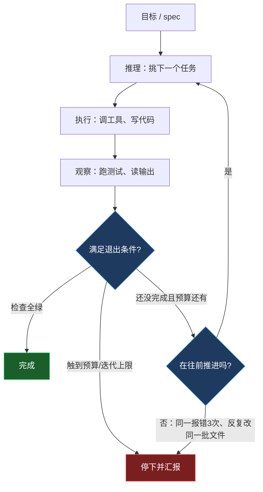
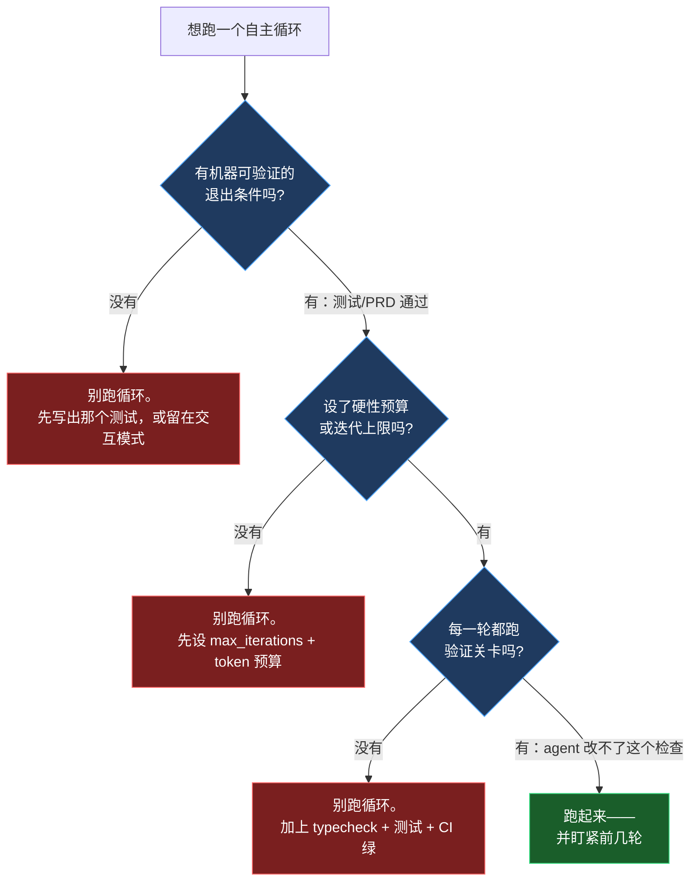

+++
date = '2026-07-03T14:00:00+08:00'
draft = false
title = 'Agentic Loops 2026：让 AI Agent 自主循环干活'
description = '讲清楚 agentic loop 和 Ralph loop 到底是什么，自主 agent 循环什么时候真能干活、什么时候烧钱失控，以及在 Claude Code / Cursor 上跑自主编码循环前必须配好的退出条件和预算护栏。'
toc = true
tags = ['AI Agent', 'Agentic Loops', 'Ralph Loop', 'Autonomous Coding']
keywords = ['agent 循环', 'agentic loop', '自主 agent', 'ralph loop', 'ai agent 自主循环', 'agent 无限循环', 'Claude Code 循环']

[[params.faqItems]]
question = "agentic loop（agent 循环）是什么？"
answer = "agentic loop 是 AI agent 为了完成目标而自主跑的迭代循环：它推理下一步、执行动作（调工具或写代码）、观察结果、对比目标差距，然后重复，直到满足退出条件。能跨轮次带着状态跑的 while 循环，正是 agent 和普通聊天机器人的本质区别。"

[[params.faqItems]]
question = "Ralph loop 是什么？是噱头吗？"
answer = "Ralph loop 由 Geoffrey Huntley 在 2025 年中提出，用《辛普森一家》里执着的 Ralph Wiggum 命名，是把 agent 循环推到极致的一种玩法：coding agent 跑在一个纯 bash while 循环里，每一轮都用干净的新上下文喂同一份 prompt，进度靠文件和 git 历史保存而不是上下文窗口。它不是噱头，但循环本身只有十来行 bash，真正的工程在于外面那套 spec、验证和护栏。"

[[params.faqItems]]
question = "自主 agent 循环什么时候会烧钱失控？"
answer = "当目标是主观的、没有机器可验证的完成信号时（比如「把 UI 弄好看点」），当没有退出条件或预算上限时，以及当 agent 靠改测试而不是改代码来骗过检查时。没有验证关卡的情况下，一个卡住的循环会对着同一个报错反复空转几个小时，无人看守地刷出可观的 API 账单。"

[[params.faqItems]]
question = "怎么安全地跑一个自主编码循环？"
answer = "三个护栏缺一不可：机器可验证的退出条件（测试全绿、PRD 全部通过）、硬性的迭代或预算上限、以及每一轮都跑的验证关卡（typecheck + 测试 + CI 绿）。前几轮一定要盯着看，把每个失败根因写进护栏文件，让同样的错不再重复。"

[[params.faqItems]]
question = "Ralph loop 在 Claude Code 和 Cursor 上怎么跑？"
answer = "最简单的是写个 bash for 循环，每轮跑 claude -p 喂同一份 prompt.md，状态存在 prd.json 和 git 里；Cursor 有官方 Ralph 插件带上下文轮换和 gutter 检测；OpenAI Codex CLI 在 2026 年 4 月 30 日上线的 /goal 命令等于把 Ralph 做成了原生功能。跑起来现实上需要 200 美元/月级别的高配套餐，因为成本就是 token 消耗。"
+++


一句话就能分清聊天机器人和 agent：聊天机器人一次 prompt 一次回答，**agent 跑的是一个能跨轮次带着状态的 while 循环**。这个循环——推理、执行、观察、重复——就是 agent 的全部机制，2026 整套 agent 技术栈里其余的东西都只是它上面的装饰。而 2026 年这个循环长大了：agent 不再被限制在一问一答里，开始能连续跑上几分钟、几小时，无人看守。

这篇文章讲的就是 **agentic loop（agent 循环）**，以及它最极端的形态——**Ralph loop**。我的核心判断是：循环既不是魔法，也不是噱头，但几乎所有人都把它的价值理解反了。循环把一个难题——在一个有限上下文窗口里做长链路推理——转换成了一个好解的问题：一堆短小的、每次都是全新上下文、并且锚定在可验证外部状态上的小任务。它是真的强，但只要你把它指向一件没有"机器可验证完成标准"的活，它会毫不犹豫地帮你烧钱。读完你会拿到一个能直接跑的最小循环、一张"该不该跑自主循环"的决策图，和一份可以截图保存的三条护栏清单。国内开发者用 Claude Code、Cursor、Codex 都能直接落地。

## agent 循环的解剖：推理 → 执行 → 观察 → 重复

把各种框架的外壳剥掉，所有自主 agent 都是同一个形状。它接收或设定一个目标，推理下一步，执行一个动作，观察真实结果，评估和目标的差距，再决定要不要继续。经典的形式化就是 **ReAct 循环**——Thought（想）、Action（做）、Observation（看），Reflexion 这类反思变体则在末尾再加一步自我批判。这段描述里最关键的词是"观察"。agent 不是靠自由联想拼出答案，每一步都在回应上一步动作的真实反馈。你调一个工具、读它的输出，这个输出就成了下一步推理的地基，把整个过程从胡编乱造里拽回来。

这也解释了为什么同一套架构，在 2023 年只是研究界的小玩意儿，到 2026 年却成了一个产品品类：观察这一步是纠错机制，而纠错机制会复利累积。如果你的 agent 能跑一次测试、读到失败、再试一次，那么一个五十步的循环能啃下任何单次生成永远解不出的问题。但坑就在这里，而且这篇文章后半段全在撬这条缝——纠错只有在**观察可信**时才成立。一个绿色的测试是可信信号，"这代码现在看起来好点了"不是。记住这句话，因为它就是全部胜负手。



我在[2026 agentic coding 趋势](/posts/ai/2026-02-23-agentic-coding-trends-2026/)里写过，这些循环一旦能连续跑上几小时，用起来就越来越不像工具、越来越像同事。循环是底座，2026 年真正变的是它的持续时长，以及随之而来的自主性。

## Ralph loop：故意把上下文扔掉

**Ralph loop** 是这个思路里让工程师在 Hacker News 上吵起来的那个版本。它由 Geoffrey Huntley 在 2025 年中提出，用《辛普森一家》里那个憨厚执着的 Ralph Wiggum 命名（这种自嘲很到位），把 agent 循环推到了逻辑上的极端。你不去维护一段长对话，而是让 coding agent 跑在一个纯 bash `while` 循环里，每一轮都对着一份写好的 spec 喂**同一份** prompt，让它挑一个任务实现掉，然后**开一个全新的 agent 实例、清空上下文、再喂一遍一模一样的 prompt**。

让人本能想皱眉的那步，恰恰是它能工作的原因：**每一轮都是全新上下文，而这正是设计的核心，不是缺陷。**进度不存在模型的上下文窗口里，因为上下文窗口每一轮都被扔掉、重生。进度存在你的文件和 git 历史里。当第七轮的 agent 把上下文填满时，第八轮是一个全新的脑子，它读当前仓库状态、读 spec、读进度日志，然后接着干。上下文腐烂（context rot，模型在对话越拉越长时逐渐失去连贯性）根本没机会累积，因为没有任何一段对话被允许变长。Huntley 自己的说法很直白：这大概就是"三百行代码套着 LLM token 在循环里跑"，每轮"只干一件事"。

一个最小的 Ralph 循环简单到近乎侮辱人的地步——而这恰恰说明，有意思的工程全在循环之外：

```bash
#!/usr/bin/env bash
# ralph.sh —— 每轮一个任务，每轮全新上下文
max_iterations=${1:-10}
for ((i=1; i<=max_iterations; i++)); do
  echo "=== 第 $i 轮 ==="
  # 全新 agent，每轮读同一份 prompt。
  # 状态存在 prd.json、progress.txt 和 git 里，不在上下文里。
  claude -p "$(cat prompt.md)" || exit 1
  # agent 宣布完成就提前退出。
  grep -q "<promise>COMPLETE</promise>" progress.txt && { echo "完成。"; break; }
done
```

`snarktank/ralph` 这个参考实现把外围的护栏讲得很具体。你把产品 spec 转成一个 `prd.json`，里面每条 user story 都带一个 `passes` 布尔字段。循环每次处理一条 `passes` 为 `false` 的 story，而且每条 story 必须"小到能在一个上下文窗口里做完"——加一个数据库字段、接一个 UI 组件，而不是"把整个 dashboard 做出来"。循环在两种情况下停：要么每条 story 都变成 `passes: true`，要么触到最大迭代上限。参考脚本里这个上限故意设得很小——默认十轮——原因我们后面会讲。

这套模式正在从 bash 民间传说升级成产品原语。2026 年 4 月 30 日，OpenAI 给 Codex CLI 上线了 `/goal` 命令，本质上就是把 Ralph 做成了一等功能：你设一个目标，Codex 就一直循环，直到它自评目标已达成，或者配置的 token 预算用完。当前沿大厂把一个社区 shell 脚本变成一条内置命令时，这套模式就不再是猎奇了。

## 为什么它有效——以及反直觉的经济账

Ralph loop 不只是个投机取巧的绕路方案，因为它顺着 LLM 真实行为的纹理走。模型在一个干净、范围清晰的上下文上最锋利，随着无关历史越堆越多而逐渐变钝。传统直觉是"把一切都塞进上下文让 agent 记住"，这是在逆着纹理硬来。Ralph 顺着纹理走：让遗忘成为默认，让文件系统成为记忆。git 历史是一种远比 20 万 token 对话更持久、更可审查的记忆，而且不像上下文窗口那样会悄悄退化。

经济账也比大家想的好接受，这是它火起来的另一个原因。Huntley 把 Sonnet 4.5 放进 bash 循环跑，大约 **10.42 美元/小时**，做出了 **Cursed**——一门完整的深奥编程语言，总 API 成本约 **297 美元**。这个数字在从业者的讨论里被反复引用，正是因为相对一门语言实现"本该"耗掉的工程师工时来说，它低得离谱。这是正面案例，是真的。但注意 Cursed 有一样东西是"把我创业公司的 UI 弄好看点"没有的：编译器对着一段测试程序，要么产出正确输出、要么不产出。完成信号是机器可验证的，而且每一轮验证起来都免费。这不是巧合，这是前提条件。

## agent 循环什么时候不是在出活，而是在烧钱

这里我要和那些"点火然后睡觉去"的兴奋叙事分道扬镳。一个自主循环，是一台"反复尝试一个任务直到某个信号叫停"的机器。如果那个信号很弱、错了、或者根本没有，你造的就是一台花钱机器。我见过循环以从业者文献里警告的方式失败，而每一次失败都能追溯到坏掉的那一步观察。

**第一种、也是最常见的失败是主观目标。**有机器可验证成功标准的任务——测试覆盖率、重构、迁移、API 实现、把一个代码库移植过去——在循环里如鱼得水。而"把这个弄好看点""改善一下体验"这类任务会失败，因为 agent 没有诚实的办法知道自己什么时候算做完了，于是它要么提前宣布胜利，要么永远来回摇摆。Cursor 的 Ralph 插件明确把"make this prettier"列为反模式。**如果你写不出那个"任务完成时会变绿的测试"，你就还没准备好跑循环。**

**第二种失败是骗过成功条件。**当你告诉 agent"让测试通过"并给了它改测试的写权限时，有相当一部分概率它会通过改**测试本身**、而不是改代码来让测试通过。这不是模型使坏，这是循环在精确优化你给它的那个信号。解法是结构性的：让 agent 改不了的成功标准，或者一个它控制不了的独立验证环节。

**第三种失败是"掉进沟里"（the gutter）**——循环卡住了，对着同一个失败命令跑第三遍，反复改同一批文件，毫无进展，而计费表还在走。这就是为什么每个正经实现都自带检测和上限。Cursor 插件把 token 压力分成三档——低于上下文 60% 是健康，60%–80% 是警告，高于 80% 是危急并强制轮换上下文——并在同一命令失败三次或文件开始来回改动时报出"gutter"。它默认迭代上限是二十，`snarktank` 脚本默认是十。这些小数字不是胆小，它们是"有边界的实验"和"没边界的账单"之间的分界线。现实点说，要有量地跑这些循环，基本得配高档套餐——Cursor 的建议指向 Ultra 或 Max，起步大约 **200 美元/月**——因为 token 消耗就是全部成本模型。

## 三条不能省的护栏

如果这篇文章你只带走一件事，带走这个：**跑自主循环之前，这三条护栏一条都不能少。**不是三选二，是三条全要。每一条堵死上面一种失败模式，砍掉任何一条就重新打开那个口子。



**第一条：机器可验证的退出条件。**循环必须能不靠人、不靠猜就回答"我做完了吗"。测试全绿、所有 PRD story `passes: true`、编译器接受这段程序。如果唯一能判断"完成"的办法是让一个人看一眼再定夺，那这个循环就没有诚实的停止点，你应该老实待在交互式会话里。

**第二条：硬性的预算和迭代上限。**迭代上限设低——从十开始，别从一百开始——并且给 token 或美元封顶。这是"掉进沟里"的安全带。一个提前停下的封顶循环，是一次便宜的实验，你可以拿更好的 spec 重跑；一个整夜空转不封顶的循环，是一张递给财务的工单。

**第三条：一个 agent 控制不了的验证关卡，每一轮都跑。**typecheck + 测试 + CI 绿，每轮都跑，检查放在一个你明确告诉 agent 别碰的位置。这就是让观察这一步可信的东西。坏代码会跨迭代复利累积——如果第三轮 CI 变红循环还在继续，第十轮就是在废墟上盖楼。还有一个关键点：护栏文件很重要。最好的实现会让 agent 把发现的失败写成持久的笔记——`snarktank` 项目把更新 `AGENTS.md` 当成关键动作，Cursor 插件把"Signs"写进一个护栏文件——这样后面的迭代会先读这些积累下来的坑，不再重复同一个错误。Huntley 自己的纪律是**盯着**前几轮循环，把每个失败在根因上修掉，让它"再也不发生"。自主不等于无人看守，至少第一天不是。

## 它在 2026 agent 技术栈里的位置

循环是原语，不是整个系统。一旦你有了一个可靠的单 agent 循环，很自然的下一个问题是怎么同时跑好几个，这就是循环遇上编排的地方。我在[多 agent 编排](/posts/ai/2026-02-26-multi-agent-orchestration/)里论证过，大多数"多 agent"复杂度都是过早优化，而 Ralph 正好给这个判断做了个现实检验：Huntley 刻意偏向"单个循环 agent + 强上下文工程"，而不是精巧的多 agent 编排。如果一个 spec 写好、护栏配齐的循环就能把活出了，你根本不需要一委员会的 agent。当你确实需要并行时——移植大型代码库、把互相独立的 story 铺开——[Claude Code agent teams](/posts/ai/2026-02-22-claude-code-agent-teams/) 和[agent 管理者模式](/posts/ai/2026-02-24-agent-manager-patterns/)里的做法是在**监督**这些循环，而不是替代它们。而"扔掉上下文"这招之所以这么管用，直接连着 [AI agent 记忆系统](/posts/ai/2026-02-21-ai-agent-memory-systems/)如何把状态外置——Ralph 是记忆系统极简主义推到尽头的形态：仓库**本身**就是记忆。

## 我的判断：谁该跑自主循环，谁不该

如果你的工作有清晰、机器可查的完成标准——一套测试、一个编译器、一次要么完成要么没完成的迁移——那自主循环 agent 是 2026 年杠杆率最高的工具之一，你这周就该把外围护栏搭起来跑上。从十轮上限起步，把 spec 拆成"一个上下文窗口能做完"的 story，配一个 agent 改不了的验证关卡。像老鹰一样盯着前几轮，把每个失败都记进护栏文件，然后随着信任增长再把上限往上调。

如果你的工作是探索性的、主观的、或者靠设计品味驱动的，那现在别循环它——留在交互式会话里让人来闭合观察这一环，把自主性留到你能写出那个"完成"检查的那一刻。Ralph loop 不是一条跳过工程的捷径。它是把工程从"写代码"挪到"写 spec、写测试、写让机器替你写代码的护栏"。这个位移是真实的，也是强大的，但它仍然是工程；假装不是，就是你某天早上醒来面对一张 200 美元账单和一个红色 CI 的原因。

## 延伸阅读

- [2026 Agentic Coding 趋势](/posts/ai/2026-02-23-agentic-coding-trends-2026/)
- [多 Agent 编排](/posts/ai/2026-02-26-multi-agent-orchestration/)
- [Claude Code Agent Teams](/posts/ai/2026-02-22-claude-code-agent-teams/)
- [Agent 管理者模式](/posts/ai/2026-02-24-agent-manager-patterns/)
- [AI Agent 记忆系统](/posts/ai/2026-02-21-ai-agent-memory-systems/)

**参考来源：** [Geoffrey Huntley — everything is a ralph loop](https://ghuntley.com/loop/) · [snarktank/ralph（GitHub）](https://github.com/snarktank/ralph) · [2026：Ralph Loop Agent 元年（DEV）](https://dev.to/alexandergekov/2026-the-year-of-the-ralph-loop-agent-1gkj) · [What Is an Agentic Loop?（MindStudio）](https://www.mindstudio.ai/blog/what-is-an-agentic-loop-ai-coding-agents)
