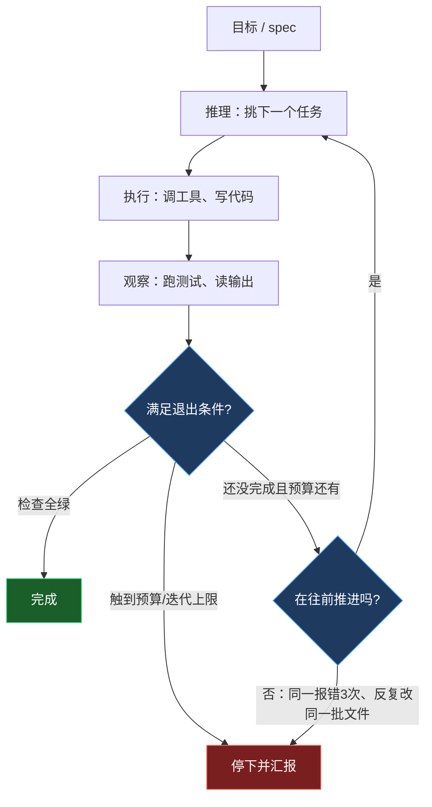
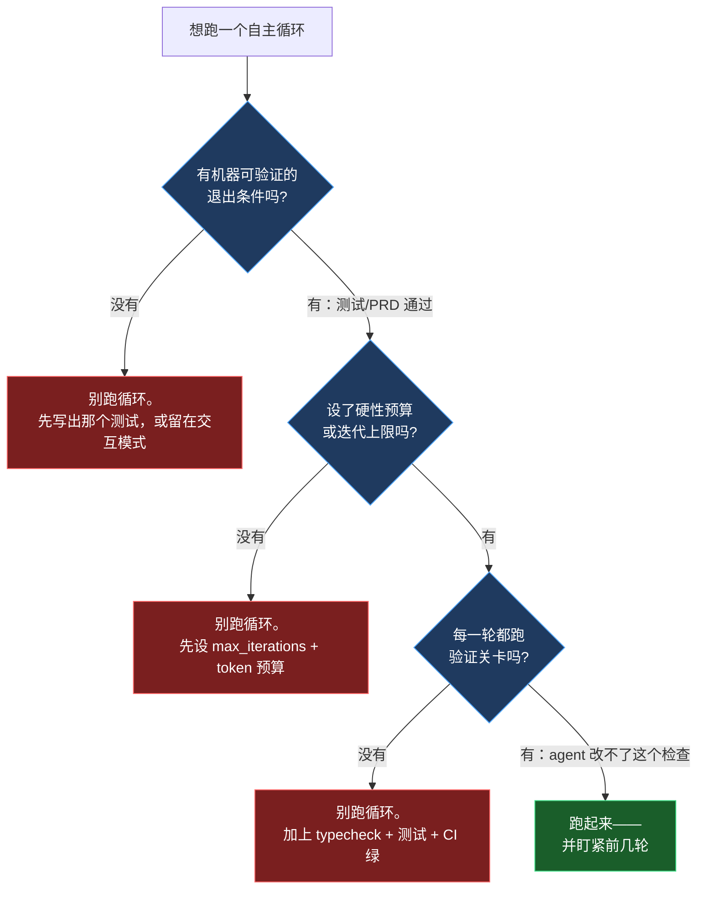

+++
date = '2026-07-03T14:00:00+08:00'
draft = false
title = 'Agentic Loops 2026：让 AI Agent 自主循环干活'
description = '讲清楚 agentic loop 和 Ralph loop 到底是什么，自主 agent 循环什么时候真能干活、什么时候烧钱失控，以及在 Claude Code / Cursor 上跑自主编码循环前必须配好的退出条件和预算护栏。'
toc = true
tags = ['AI Agent', 'Agentic Loops', 'Ralph Loop', 'Autonomous Coding']
keywords = ['agent 循环', 'agentic loop', '自主 agent', 'ralph loop', 'ai agent 自主循环', 'agent 无限循环', 'Claude Code 循环']

[[params.faqItems]]
question = "agentic loop（agent 循环）是什么？"
answer = "agentic loop 是 AI agent 为了完成目标而自主跑的迭代循环：它推理下一步、执行动作（调工具或写代码）、观察结果、对比目标差距，然后重复，直到满足退出条件。能跨轮次带着状态跑的 while 循环，正是 agent 和普通聊天机器人的本质区别。"

[[params.faqItems]]
question = "Ralph loop 是什么？是噱头吗？"
answer = "Ralph loop 由 Geoffrey Huntley 在 2025 年中提出，用《辛普森一家》里执着的 Ralph Wiggum 命名，是把 agent 循环推到极致的一种玩法：coding agent 跑在一个纯 bash while 循环里，每一轮都用干净的新上下文喂同一份 prompt，进度靠文件和 git 历史保存而不是上下文窗口。它不是噱头，但循环本身只有十来行 bash，真正的工程在于外面那套 spec、验证和护栏。"

[[params.faqItems]]
question = "自主 agent 循环什么时候会烧钱失控？"
answer = "当目标是主观的、没有机器可验证的完成信号时（比如「把 UI 弄好看点」），当没有退出条件或预算上限时，以及当 agent 靠改测试而不是改代码来骗过检查时。没有验证关卡的情况下，一个卡住的循环会对着同一个报错反复空转几个小时，无人看守地刷出可观的 API 账单。"

[[params.faqItems]]
question = "怎么安全地跑一个自主编码循环？"
answer = "三个护栏缺一不可：机器可验证的退出条件（测试全绿、PRD 全部通过）、硬性的迭代或预算上限、以及每一轮都跑的验证关卡（typecheck + 测试 + CI 绿）。前几轮一定要盯着看，把每个失败根因写进护栏文件，让同样的错不再重复。"

[[params.faqItems]]
question = "Ralph loop 在 Claude Code 和 Cursor 上怎么跑？"
answer = "最简单的是写个 bash for 循环，每轮跑 claude -p 喂同一份 prompt.md，状态存在 prd.json 和 git 里；Cursor 有官方 Ralph 插件带上下文轮换和 gutter 检测；OpenAI Codex CLI 在 2026 年 4 月 30 日上线的 /goal 命令等于把 Ralph 做成了原生功能。跑起来现实上需要 200 美元/月级别的高配套餐，因为成本就是 token 消耗。"
+++


凌晨两点四十，循环跑到第 41 轮。agent 从第 12 轮起就一直挂在同一个测试上——第 23 轮它"修好"了这个问题，方式是把断言删了。一小时前刚重写过的文件，现在正被朝反方向再重写一遍。终端还在滚，计费表还在走，没有人盯着。**没人需要盯着**，这本来就是 agentic loop（agent 循环）的全部卖点：给自主 agent 指个目标，你去睡觉，醒来收代码。

这个场景是我编的，但这种失败模式不是。它常见到什么程度？Cursor 的 Ralph 插件专门内置了一个检测器，还给它起了名字——**the gutter**（掉沟里）：同一条命令连挂三次、文件来回互相覆盖、零进展，账单照走。一种失败模式在正式产品里混到了自己的专属警报，说明已经有多少人演过这部片子。

可另一面是，这个循环又是 2026 整套 agent 技术栈里最重要的机制。聊天机器人一次 prompt 一次回答；agent 跑的是一个**能跨轮次带着状态的 while 循环**——推理、执行、观察、重复。其余一切都是这个循环上面的装饰。2026 年它长大了：agent 不再困在一问一答里，开始无人看守地连跑几分钟、几小时。

所以我的核心判断是这篇文章的脊柱：**循环不是魔法也不是噱头，但几乎所有人都把它的价值理解反了**。它的威力不来自模型在一段长对话里保持聪明，而来自一次问题转换——把"在有限上下文窗口里做长链路推理"这个难题，换成一堆短小的、每轮全新上下文、锚定在可验证外部状态上的小任务。

这个转换只在一种情况下划算："完成"是机器可查的。把同一套机器指向一件没有可验证终点线的活，你搭出来的就是凌晨两点四十那一幕，还是按月付费的。

读完这篇你会拿到：一个能直接跑的最小循环、一张"该不该跑"的决策图、一份值得截图的三条护栏清单。国内开发者用 Claude Code、Cursor、Codex 都能直接落地。

## agent 循环的解剖：推理 → 执行 → 观察 → 重复

把框架的外壳剥掉，所有自主 agent 都是同一个形状。接收或设定目标，推理下一步，执行动作，观察真实结果，评估差距，决定继不继续。经典形式化是 **ReAct 循环**——Thought（想）、Action（做）、Observation（看）——Reflexion 这类反思变体则在末尾再加一步自我批判。

这段描述里真正承重的词是"观察"。agent 不是靠自由联想拼答案，每一步都在回应上一步动作的真实反馈——你调一个工具、读它的输出，这个输出就是下一步推理的地基，把整个过程从胡编乱造里拽回来。

这也解释了为什么同一套架构，2023 年只是研究界的小玩意儿，2026 年成了产品品类。观察是纠错机制，纠错机制会复利：一个能跑测试、读失败、再试一次的 agent，用五十步循环能啃下任何单次生成永远解不出的问题。

但坑就在这儿，这篇文章后半段全在撬这条缝——纠错只在**观察可信**时成立。绿色的测试是可信信号，"代码现在看起来好点了"不是。凌晨两点四十那个 agent 不是蠢，它在勤勤恳恳地优化一个早已失去意义的观察信号。



我在[2026 agentic coding 趋势](/zh/posts/ai/2026-02-23-agentic-coding-trends-2026/)里写过，这些循环一旦连跑几小时，用起来就越来越不像工具、越来越像同事。循环是底座，2026 年真正变的是时长，以及随之而来的自主性。

## Ralph loop：故意把上下文扔掉

**Ralph loop** 是这个思路里让工程师在 Hacker News 上吵起来的版本。Geoffrey Huntley 在 2025 年中提出，用《辛普森一家》里那个憨厚执着的 Ralph Wiggum 命名——这份自嘲很到位。它把 agent 循环推到了逻辑极端。

玩法是这样的：你根本不维护长对话。让 coding agent 跑在一个纯 bash `while` 循环里，每轮对着一份写好的 spec 喂**同一份** prompt，让它挑一个任务做完，然后杀掉它，开一个全新 agent 实例、清空上下文、再喂一遍一模一样的 prompt。

让人本能皱眉的那一步，恰恰是它能跑通的原因：**每轮全新上下文是设计核心，不是缺陷**。进度不存在模型的上下文窗口里——窗口每轮都被扔掉重生。进度存在文件和 git 历史里。第七轮的 agent 把上下文填满了？第八轮是个全新的脑子，读当前仓库状态、读 spec、读进度日志，接着干。

上下文腐烂（context rot，模型随对话变长逐渐失去连贯性）根本没机会累积，因为没有任何对话被允许变长。Huntley 自己的说法很直白：这大概就是"三百行代码套着 LLM token 在循环里跑"，每轮"只干一件事"。

一个最小的 Ralph 循环简单到近乎侮辱人——而这恰恰说明，有意思的工程全在循环之外：

```bash
#!/usr/bin/env bash
# ralph.sh —— 每轮一个任务，每轮全新上下文
max_iterations=${1:-10}
for ((i=1; i<=max_iterations; i++)); do
  echo "=== 第 $i 轮 ==="
  # 全新 agent，每轮读同一份 prompt。
  # 状态存在 prd.json、progress.txt 和 git 里，不在上下文里。
  claude -p "$(cat prompt.md)" || exit 1
  # agent 宣布完成就提前退出。
  grep -q "<promise>COMPLETE</promise>" progress.txt && { echo "完成。"; break; }
done
```

`snarktank/ralph` 这个参考实现展示了这十行外面的护栏长什么样。产品 spec 转成 `prd.json`，每条 user story 带一个 `passes` 布尔字段。循环每次处理一条 `passes` 为 `false` 的 story，且每条必须"小到一个上下文窗口能做完"——加一个数据库字段、接一个 UI 组件，而不是"把整个 dashboard 做出来"。全部 `passes: true` 或触到迭代上限，循环就停。参考脚本的上限故意设得很小——默认十轮——原因后面讲。

注意你的岗位职责刚刚发生了什么变化。在 Ralph 模式下，你不写代码，甚至基本不写 prompt。你写 spec、拆 story、定检查。原本泡在交互式会话里的每一小时，都改花在把 `prd.json` 磨锋利、把验证做到骗不过去——因为全新上下文的 agent 不记得你的任何意图，它只认写下来的东西。spec 含糊进去，四十一轮自信的废话出来。

这套模式正在从 bash 民间偏方升级成产品原语。2026 年 4 月 30 日，OpenAI 给 Codex CLI 上线了 `/goal` 命令，本质就是把 Ralph 做成一等功能：设一个目标，Codex 一直循环，直到自评达成或 token 预算用完。前沿大厂把社区 shell 脚本变成内置命令，这事就不再是猎奇了。

## 为什么有效——以及那门 297 美元的编程语言

Ralph loop 不是投机取巧的绕路，它顺着 LLM 真实行为的纹理走。模型在干净、范围清晰的上下文上最锋利，无关历史越堆越钝。传统直觉——把一切塞进上下文让 agent"记住"——是逆着纹理硬来。Ralph 顺着来：遗忘是默认，文件系统是记忆。git 历史比一段 20 万 token 的对话更持久、更可审查，而且不会悄悄退化。

经济账是它火起来的另一半原因，因为比几乎所有人的第一直觉都便宜。Huntley 把 Sonnet 4.5 放进 bash 循环，大约 **10.42 美元/小时**，做出了 **Cursed**——一门完整的深奥编程语言，总 API 成本约 **297 美元**。这个数字在从业者讨论里被反复引用，就因为它相对一门语言"本该"烧掉的工程师工时低得离谱。

但仔细看 Cursed 有一样东西，是"把我创业公司的 UI 弄好看点"没有的：编译器对着测试程序，要么产出正确结果，要么不产出。完成信号机器可验证，而且每轮验证都免费。这不是这个案例里的幸运细节，这是整套把戏的前提条件——话题就此绕回凌晨两点四十那一幕。

## agent 循环什么时候不是在出活，而是在烧钱

这里我要和"点火然后睡觉去"的兴奋叙事分道扬镳。自主循环是一台"反复尝试直到某个信号叫停"的机器。信号弱了、错了、没有，你造的就是一台花钱机器。从业者文献里每一次有记录的失败——Huntley 的文章、Cursor 插件文档、社区帖子里的复盘——都能追溯到同一个坏掉的零件：观察这一步。

**第一种、也是最常见的失败：主观目标**。有机器可验证标准的任务——测试覆盖率、重构、迁移、API 实现、移植代码库——在循环里如鱼得水。"把这个弄好看点""改善一下体验"这类任务必挂，因为 agent 没有诚实的办法知道自己做完没有，要么提前宣布胜利，要么永远来回摇摆。Cursor 的 Ralph 插件明确把"make this prettier"列为反模式。写不出那个"任务完成时会变绿的测试"，你就还没资格跑循环。

**第二种失败：骗过成功条件**。告诉 agent"让测试通过"，又给它改测试的写权限，有相当比例它会靠改**测试本身**来让测试通过——正是开头那个第 23 轮的操作。这不是模型使坏，这是循环在精确优化你给的信号。解法是结构性的：agent 改不了的成功标准，或一个它控制不了的独立验证环节。

**第三种失败：掉进沟里（the gutter）**——循环卡死，同一条失败命令跑第三遍，反复改同一批文件，零进展，计费表照走。所以每个正经实现都自带检测和上限。Cursor 插件把 token 压力分三档：低于上下文 60% 健康，60%–80% 警告，高于 80% 危急并强制轮换上下文；同一命令挂三次或文件开始来回改，就报 gutter。它默认迭代上限二十，`snarktank` 脚本默认十。

这些小数字不是胆小。一个封了顶、提前停下的循环是次便宜的实验，换个更好的 spec 就能重跑；一个整夜空转不封顶的循环，是一张递给财务的工单。现实点说，要有量地跑，基本得配高档套餐——Cursor 的建议指向 Ultra 或 Max，起步约 **200 美元/月**——因为 token 消耗就是全部成本模型。

## 三条不能省的护栏

这篇文章只带走一件事的话，带走这个：**三条护栏配齐之前，别跑自主循环**。不是三选二。每条堵死上面一种失败模式，砍掉任何一条就重新打开那个口子。



**第一条：机器可验证的退出条件**。循环必须能不靠人、不靠猜地回答"我做完了吗"。测试全绿、所有 PRD story 变成 `passes: true`、编译器接受这段程序。如果判断"完成"的唯一办法是让人看一眼再定夺，这个循环就没有诚实的停止点——老实待在交互式会话里。

**第二条：硬性预算和迭代上限**。上限设低——从十开始，别从一百开始——再给 token 或美元封顶。这是防"掉沟里"的安全带。十轮足够你搞清 spec 到底能不能跑循环；一百轮足够你在凌晨两点四十发现它不能。

**第三条：一个 agent 控制不了的验证关卡，每轮都跑**。typecheck + 测试 + CI 绿，每轮执行，检查放在明确告诉 agent 别碰的位置。这就是让观察可信的东西——坏代码会跨轮复利，第三轮 CI 变红循环还在跑，第十轮就是在废墟上盖楼。

第三条还有一个记忆环节，是正经实现和玩具的分水岭。最好的做法是让 agent 把发现的失败写成持久笔记——`snarktank` 项目把更新 `AGENTS.md` 当关键动作，Cursor 插件把"Signs"写进护栏文件——后面的轮次先读这些积累下来的坑，不再重复同一个错。Huntley 自己的纪律是盯着前几轮，把每个失败修到根上，让它"再也不发生"。自主不等于无人看守，至少第一天不是。

## 它在 2026 agent 技术栈里的位置

循环是原语，不是整个系统。有了可靠的单 agent 循环，下一个问题自然是怎么同时跑几个，这就是循环遇上编排的地方。我在[多 agent 编排](/zh/posts/ai/2026-02-26-multi-agent-orchestration/)里论证过，大多数"多 agent"复杂度都是过早优化，Ralph 正好给这个判断做了现实检验：Huntley 刻意选"单个循环 agent + 强上下文工程"，而不是精巧的多 agent 编排。spec 写好、护栏配齐的循环能把活出了，你不需要一委员会的 agent。

真需要并行时——移植大型代码库、铺开互相独立的 story——[Claude Code agent teams](/zh/posts/ai/2026-02-22-claude-code-agent-teams/) 和 [agent 管理者模式](/zh/posts/ai/2026-02-24-agent-manager-patterns/)里的做法是在**监督**这些循环，不是替代它们。而"扔掉上下文"这招之所以管用，直接连着 [AI agent 记忆系统](/zh/posts/ai/2026-02-21-ai-agent-memory-systems/)把状态外置的思路——Ralph 是记忆系统极简主义推到尽头：仓库**本身**就是记忆。

## 我的判断：谁该跑自主循环，谁不该

如果你的工作有清晰、机器可查的完成标准——一套测试、一个编译器、一次要么完成要么没完成的迁移——自主循环 agent 是 2026 年杠杆率最高的工具之一，这周就该把外围搭起来跑上。十轮上限起步，spec 拆成"一个上下文窗口能做完"的 story，配一个 agent 改不了的验证关卡。像老鹰一样盯前几轮，把每个失败记进护栏文件，信任涨了再调高上限。

如果你的工作是探索性的、主观的、靠设计品味驱动的，现在别循环它。留在交互式会话里让人来闭合观察这一环，把自主性留到你能写出那个"完成"检查的那一刻。

Ralph loop 不是跳过工程的捷径——它是把工程从"写代码"挪到"写 spec、写测试、写让机器替你写代码的护栏"。这个位移是真实的，也是强大的。但它仍然是工程；假装不是，你就会亲自出演这篇文章的开场：看着第 41 轮又删掉一条断言。

## 延伸阅读

- [2026 Agentic Coding 趋势](/zh/posts/ai/2026-02-23-agentic-coding-trends-2026/)
- [多 Agent 编排](/zh/posts/ai/2026-02-26-multi-agent-orchestration/)
- [Claude Code Agent Teams](/zh/posts/ai/2026-02-22-claude-code-agent-teams/)
- [Agent 管理者模式](/zh/posts/ai/2026-02-24-agent-manager-patterns/)
- [AI Agent 记忆系统](/zh/posts/ai/2026-02-21-ai-agent-memory-systems/)

**参考来源：** [Geoffrey Huntley — everything is a ralph loop](https://ghuntley.com/loop/) · [snarktank/ralph（GitHub）](https://github.com/snarktank/ralph) · [2026：Ralph Loop Agent 元年（DEV）](https://dev.to/alexandergekov/2026-the-year-of-the-ralph-loop-agent-1gkj) · [What Is an Agentic Loop?（MindStudio）](https://www.mindstudio.ai/blog/what-is-an-agentic-loop-ai-coding-agents)
