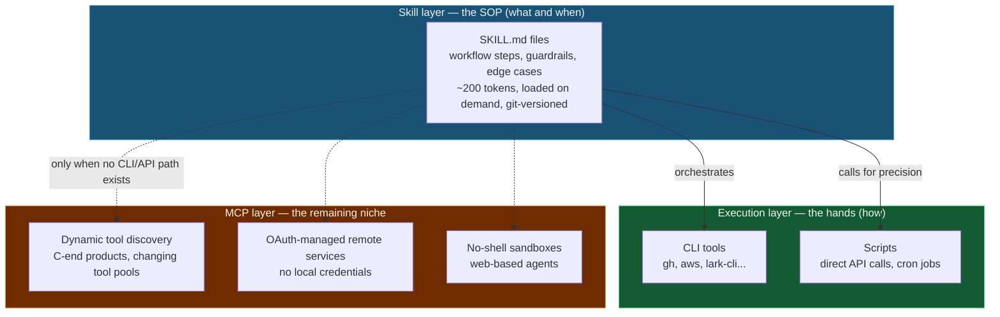
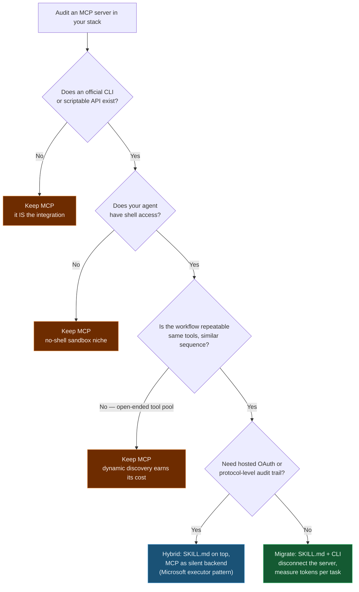

+++
date = '2026-07-04T10:00:00+08:00'
aliases = ['/posts/ai/2026-07-10-cli-skills-vs-mcp/']
draft = false
title = 'MCP vs Skills: Why CLI + Skill Wins the Agent Toolchain'
description = 'MCP servers burn 50K tokens where a 200-token SKILL.md does the same job. Why Perplexity, YC, and my own stack moved to CLI + Skills — and when MCP still wins.'
toc = true
tags = ['MCP', 'Agent Skills', 'CLI', 'AI Agent', 'Claude Code']
keywords = ['mcp vs skills', 'cli vs mcp', 'claude skills vs mcp', 'mcp alternatives', 'is mcp dead', 'agent toolchain 2026', 'skill.md vs mcp server']

[[params.faqItems]]
question = "Is MCP dead in 2026?"
answer = "No. MCP is being demoted, not buried. It lost its position as the default integration layer to CLI + Skills, but it still wins in four niches: dynamic tool discovery for consumer products, OAuth-managed remote services, sandboxed environments without a shell, and enterprise setups that need protocol-level audit boundaries."

[[params.faqItems]]
question = "What is the difference between MCP and Claude Skills?"
answer = "MCP is a JSON-RPC protocol: a resident server exposes tool schemas that get loaded into the model's context. A Skill is a Markdown file (SKILL.md) that tells the agent how to run existing CLI tools step by step. MCP defines tools for machines; Skills describe workflows for models. A GitHub MCP server costs tens of thousands of context tokens; a SKILL.md pointing at the gh CLI costs about 200."

[[params.faqItems]]
question = "Why do AI agents work better with CLI tools than MCP?"
answer = "Training data. Models have ingested billions of lines of shell commands, GitHub issues, and Stack Overflow answers, so CLI invocation is native behavior rather than learned schema-following. CLI calls also pay no schema-loading tax, support piping to pre-filter output before it hits the context window, and recover from errors by simply re-running a command."

[[params.faqItems]]
question = "When should I still use MCP instead of CLI + Skills?"
answer = "Keep MCP when there is no CLI equivalent for the service, when your agent runs in a no-shell sandbox (web-based agents), when the service requires OAuth flows you don't want to manage yourself, or when the tool population changes so often that dynamic discovery genuinely pays for its context cost."

[[params.faqItems]]
question = "How do I migrate from an MCP server to CLI + SKILL.md?"
answer = "Check three signals first: an official CLI exists (gh, aws, lark-cli...), your agent has shell access, and the workflow is repeatable. If all three hold, write a SKILL.md that names the CLI, shows 3-5 canonical command examples with expected output, and documents the failure modes. Then disconnect the MCP server and compare token usage per task — the drop is usually dramatic."
+++

CLI + Skills is replacing MCP as the default way to wire agents into tools, and the hardest number in the whole **MCP vs Skills** debate says the fight is basically over: GitHub's official MCP server initially spent on the order of 50,000 context tokens just *describing its tools* — later dieted down to roughly 23,000 — while a SKILL.md file that says "use the `gh` CLI, here's how" delivers the same capability in about 200. That's where the widely quoted 250x figure comes from, documented in [*Markdown is the New API*](https://juliofalbo.medium.com/markdown-is-the-new-api-how-skill-md-and-ai-gateways-unlock-ai-native-organizations-e929d05c0470). And it's rent, not a one-time fee: you pay it before the task starts, on every session, whether or not the task ever touches GitHub.

The people heading for the exits are the ones who bet earliest. In March 2026, Perplexity CTO Denis Yarats announced internally that the company was moving off MCP and back to APIs and CLIs. The same week, Y Combinator president Garry Tan posted that ["MCP sucks honestly"](https://x.com/garrytan/status/2031910564344262988) — too much context window, clunky auth, servers you have to toggle on and off — and that a Playwright CLI wrapper he vibe-coded in 30 minutes beat the MCP integration it replaced. I didn't need either of them to convince me. In one working day last week, my own agent stack hit three MCP failures in a row, and all three were rescued by the same thing: a plain script driving a plain CLI, orchestrated by a Markdown file.

So here's my position with no hedging: CLI + Skills has won the trunk of the agent toolchain, and MCP is retreating to a niche it gets to keep. Most of this post lives on the *why*, because the why is the part that generalizes — MCP charges an architecture tax that is real, structural, and unfixable by writing better servers. After that comes the honest counter-case, and a migration framework you can run against your own stack this week.

## The MCP Architecture Tax: Three Bills That Arrive Before Any Work Starts

For most of 2025, MCP was sold as the TCP/IP of the agent era — one protocol connecting every tool to every model. The pitch landed because it solved a real 2024 problem: models were unreliable tool users, and standardized schemas helped. By early 2026 the problem had inverted. Models got very good at using tools. What they can't afford anymore is the cost of MCP's way of *describing* them — and that cost isn't one line item. It's three, and they compound.

### Bill one: schema rent, collected every session

An MCP server front-loads its entire tool catalog into the model's context before anything happens. That's not a bug — dynamic discovery only works if the model can see what's available — but it is the tax. The GitHub numbers above are the canonical case, and what makes them damning isn't the size, it's the billing schedule: tens of thousands of tokens charged per session, up front, including sessions that never call a single GitHub tool. A SKILL.md loads on demand, when its trigger fires, and costs a couple hundred tokens when it does.

Chinese developer communities circulate splashier numbers — 10-32x per-call cost multipliers, 72% task reliability for MCP versus near-perfect for CLI. I haven't managed to trace those to a reproducible benchmark, so file them under folklore. You don't need folklore. The GitHub case alone is verifiable, and it's a two-orders-of-magnitude gap on the platform's flagship integration.

### Bill two: a measurably dumber model

The context cost has a second-order effect that's worse than the bill: it degrades the model itself. Every thousand tokens of schema is a thousand tokens of attention not spent on your actual problem, and tool-selection accuracy measurably drops as the tool list grows. I dug into this dynamic in my [context engineering deep dive](/posts/ai/2026-06-16-context-engineering-2026/) — attention is the scarce resource in an agent system, and MCP's design spends it on plumbing.

Put differently: you're not just paying for the tokens. You're paying with the quality of the answer.

### Bill three: making the model work in a foreign language

The deepest argument for CLI isn't operational — it's linguistic. A large model's training corpus contains billions of lines of shell commands with their outputs: Stack Overflow answers, GitHub issues, CI logs, dotfiles, tutorials. When an agent runs `gh pr list --state open --json title,author`, it's doing something it has seen literally millions of times, error messages and human recovery included. When the same agent calls an MCP tool, it's following a schema it first saw thirty seconds ago in its own context window. One of these is native fluency; the other is reading the instruction manual at the workbench.

This is why "just let it use the CLI" keeps outperforming carefully engineered tool definitions. You're not teaching the model a new skill — you're getting out of the way of one it already has.

And fluency comes with a toolbox MCP structurally lacks. CLI output pipes through `jq` or `grep`, so only the relevant slice ever reaches the context window. CLI errors are plain text the model has seen a million times. CLI debugging means pasting the exact command into your own terminal and watching it fail in front of you. When an MCP call goes wrong, you're reading someone else's server logs; with a CLI, the reproduction *is* the command.

Three bills, one root cause: MCP moves tool knowledge into the most expensive real estate in the system — the context window — and charges you rent on it every single session.

## One Day, Three MCP Failures: When the Tax Comes Due

Industry quotes are cheap, so here's what happened inside my own toolchain in a single working day of completely mundane blog-operations work. The failure modes were all different; the ending was identical every time — and that pattern matters more than any single failure.

**Failure one: the browser MCP that couldn't reach my browser.** I wanted to pull Google Search Console data for this blog — a task I'd done manually a hundred times in a logged-in Chrome session. The obvious move was the chrome-devtools MCP server: navigation, clicking, and network inspection, all wrapped as tools. Except the server spun up its own isolated Chrome instance with a fresh profile — no cookies, no login state. Fine, I thought, I'll log in. Google's automation detection blocked the sign-in flow. I tried attaching to my real browser instead; tab targeting misfired and clicks landed on the wrong page. Forty minutes into fighting the abstraction, I deleted the MCP config and wrote roughly 60 lines of puppeteer-core that connect straight to Chrome's debugging port on my already-logged-in profile — the same port-9222 technique from my [Chrome DevTools MCP setup guide](/posts/ai/2026-03-17-chrome-devtools-mcp-guide/). It worked on the first run. The MCP layer hadn't merely failed to help; it had actively built an isolation wall between me and a resource I already owned.

**Failure two: the MCP server that stopped existing.** My blog cover images used to be generated through Rube, a hosted MCP aggregator that proxied Gemini's image API. Rube shut down. Not degraded — gone. Every workflow routed through it died on the spot. The fix took one afternoon: a ~100-line Python script that calls the Gemini API directly, renders at 4K, and downsamples to a 1200×630 WebP. It's faster than the MCP path ever was, it supports resolutions the proxy never exposed, and its only dependency is an API key in my environment. That script has already outlived the "infrastructure" it replaced, and it will outlive the next one too, because a script's dependency graph is `python + requests + one API`, while a hosted MCP server's dependency graph includes someone else's business model.

**Failure three: admitting the browser was never the right tool.** After failure one, I stepped back and asked why I was driving a browser at all. Search Console and Google Analytics both have official APIs with service-account auth. The end state is a headless script authenticated by a personal service account, run by cron every week, dumping data my agent reads as plain files. No MCP, no browser, no login state to expire. The lesson generalizes: a surprising fraction of MCP servers wrap things that already have a scriptable interface one layer down.

Three failures, one diagnosis. In each case the MCP layer was either a fault point (isolated instance, flaky targeting) or a disappearing dependency (a hosted server that folded), while the layer beneath it — CLI, script, official API — stayed permanently available. The CompanyOS builders put this exact property into words: their skills survive MCP outages, because when a server disconnects [you downgrade from automatic to manual, but the workflow knowledge survives](https://thenewstack.io/skills-vs-mcp-agent-architecture/). I used to nod along at that line. Now I've lived it three times before dinner.

## The People Who Built MCP Are the Ones Walking Away

What separates Q1 2026 from ordinary tech-Twitter contrarianism is who's doing the abandoning. Sentry's David Cramer built Sentry's own MCP server, then wrote that ["many MCP servers don't need to exist"](https://thenewstack.io/skills-vs-mcp-agent-architecture/) — they're either poor API wrappers or replaceable by a skill file. Garry Tan's team told him, after his 30-minute Playwright wrapper, that Vercel had already shipped one — which tracks, because Vercel CEO Guillermo Rauch had framed the whole shift in one line: *CLIs are the de-facto MCPs for agents.* Perplexity made it institutional, launching an Agent API that positions APIs as the substrate and MCP as an optional layer, not the foundation.

Even Anthropic — MCP's creator — published an engineering post on [code execution with MCP](https://www.anthropic.com/engineering/code-execution-with-mcp) conceding that loading full tool definitions into context doesn't scale, and proposing that agents write code against MCP tools instead of calling them directly. Read that twice: the protocol's own author now recommends putting a code layer between the model and the protocol. When your earliest adopters start describing your standard as overhead, that's not a marketing problem. That's a unit-economics problem.

## Skills Are What Actually Replaced MCP

Here's the subtlety the "CLI vs MCP" framing misses: raw CLI access alone didn't dethrone MCP. What dethroned it was CLI *plus a knowledge layer* — the SKILL.md file. A skill is a Markdown document encoding a workflow: which commands to run, in what order, what the edge cases are, when to stop and ask. It's a standard operating procedure written for a reader that happens to be a model. I argued in [Agent Skills: Why Markdown Files Are the New Programs](/posts/ai/2026-01-19-agent-skills-new-programming/) that this is a genuine programming paradigm; six months later I'd sharpen it: **Skills took over MCP's orchestration value, and CLI took over its execution value. Between the two, nothing was left for MCP to do in the common case.**

I run this architecture in production, and it's not a toy. My daily driver is a set of 27 skills wrapping `lark-cli`, the official Feishu/Lark command-line tool — 11 business domains, 200-plus commands, shipped with official skills alongside — that I covered in my [Lark CLI guide](/posts/ai/2026-03-29-lark-cli-guide/). Messaging, docs, spreadsheets, calendar, approvals, video-conference records: each one a SKILL.md that names the CLI subcommands, shows canonical invocations, and flags the identity and permission gotchas. Resident MCP servers required: zero. When I ask my agent to "pull yesterday's meeting notes and message the summary to the team," it reads two Markdown files — a few hundred tokens each, loaded only when triggered — runs four CLI commands, and it's done. The equivalent MCP topology would be two resident servers, tens of thousands of schema tokens, and two more processes that can be down when I need them. The blog itself runs the same way — the cover-image skill from failure two is now a SKILL.md orchestrating a direct-API Python script.

The strongest outside validation comes from CompanyOS, which is instructive precisely because it *kept* its MCP servers. The system connects 8 of them, for Gmail, Linear, and Help Scout — but its builder is explicit that the soul of the system is [12 skill files totaling about 2,000 lines of Markdown](https://thenewstack.io/skills-vs-mcp-agent-architecture/) encoding workflows, guardrails, tone, and decision logic. The MCP servers are plumbing; the skills are the asset. Changing behavior means editing Markdown and committing — a feedback loop measured in minutes, reviewable by teammates who can't read the server's implementation language. Intelligence in Markdown, transport wherever convenient: that's the actual end state, and it demotes MCP from "the integration" to one of several interchangeable pipes.

There is one honest cost, and I'd rather state it plainly than bury it: a text SOP is not code, and it will not execute with 100% determinism. A model can misread a step, skip a guardrail, or improvise where you wanted compliance. My mitigation, learned the hard way: anything that must be exact goes into a script the skill *calls*; the skill's prose handles only the judgment calls. Skills for decisions, scripts for precision. And if a workflow tolerates zero deviation and involves zero judgment, it shouldn't be a skill at all — it should be a cron job, which is exactly where my Search Console pipeline ended up.

## Where MCP Still Wins: The Honest Counter-Case

Most "MCP is dead" posts fail their own credibility test by never steelmanning the other side, so let me do it properly — I still run MCP servers for specific jobs, and the reasons are structural, not sentimental.

**No shell, no CLI thesis.** Everything above assumes your agent has a shell. Web-based agents, mobile assistants, and locked-down enterprise sandboxes often don't, and for them the entire argument evaporates. MCP's transport works over HTTP into environments where "just run gh" isn't a sentence that means anything. That's not a small market — it's most consumer AI products.

**Dynamic discovery earns its cost when the tool pool actually changes.** My lark skills work because Feishu's command surface is stable. A consumer agent facing an open-ended ecosystem — users connecting their own third-party services at runtime — genuinely needs runtime discovery, and a protocol with schemas beats a folder of Markdown for that. The mistake of 2025 wasn't building MCP; it was defaulting to a dynamic-discovery protocol for static toolsets, paying flexibility prices for flexibility nobody used.

**Managed auth and audit boundaries.** When my puppeteer script attaches to my logged-in Chrome, it inherits my full session — convenient, and exactly the kind of ambient authority that makes security teams sweat. A remote MCP server with hosted OAuth gives an enterprise a chokepoint: scoped tokens, revocation, an audit log of every call. And be honest about the flip side of the CLI thesis: handing an agent a shell hands it arbitrary command execution. I wrote about that tension in my [MCP security guide](/posts/ai/2026-02-23-mcp-security-guide/) — when the threat model includes prompt injection, a constrained protocol surface is a feature. Cross-platform consistency cuts the same way: my skills quietly assume macOS and would need real work on Windows, while a protocol schema doesn't care.

Notice the common thread: every one of these wins is *environmental* — no shell, no stable tools, no acceptable local credentials. None of them is "MCP integrates better when a CLI exists and works." That's why this is a demotion rather than a death: MCP keeps the territories defined by constraints, and loses everywhere developers have a choice.

## Convergence, Not Funeral: Skills on Top, MCP Underneath

The most credible preview of the end state came from Microsoft, of all places. Their [.NET Skills Executor](https://devblogs.microsoft.com/foundry/dotnet-ai-skills-executor-azure-openai-mcp/) is a hybrid: SKILL.md files discovered from a directory drive the agentic loop, while MCP servers sit underneath as one execution backend among several, invoked silently when a skill's step needs them. Microsoft simultaneously ships [official skills repositories](https://github.com/microsoft/skills) grounding coding agents in Markdown. When the company that operationalizes every enterprise standard puts skills on top and MCP underneath, that's the org chart of the future stack: **Skill as the SOP layer, CLI and scripts as the default execution layer, MCP as fallback transport for the cases the first two can't reach.**

This resolves the false binary in most "is MCP dead" takes. The question was never protocol versus no protocol; it was which layer owns the knowledge. In 2025 we tried stuffing workflow knowledge into tool schemas — those 50K-token definitions were badly compressed SOPs — and it failed because schemas are a terrible medium for judgment. Once the knowledge moved into Markdown, cheap and versionable and readable by both models and humans, the transport underneath became a commodity, and commodities get selected on cost. CLI is the cheapest transport in existence, because the model already speaks it. My January [Skills vs MCP comparison](/posts/ai/2026-01-06-skillmcp/) treated the two as complementary peers; six months of production later, I'm revising that. Complementary, yes. Peers, no. One is the trunk, the other is a branch.

## A Migration Framework You Can Run This Week

Enough thesis. Here's the decision procedure I actually used to migrate my own stack, formulated as signals. Audit each MCP server you run against these five:

1. **A CLI or scriptable API already exists** for the service (`gh`, `aws`, `kubectl`, `lark-cli`, an official REST API with token auth). The MCP server is a translation layer over something your agent could touch directly.
2. **Your agent has shell access.** If yes, the CLI thesis applies in full.
3. **The workflow is repeatable.** You call the same 3-5 tools in similar sequences. You're paying dynamic-discovery prices for a static routine.
4. **Schema cost dwarfs usage.** The server loads thousands of tokens of definitions and you use a fifth of its tools. Check your session logs — this one is measurable.
5. **The server needs babysitting.** Auth re-configuration, resident process management, "have you tried toggling it off and on" — Garry Tan's entire complaint list.

Three or more signals: write the SKILL.md, point it at the CLI, disconnect the server, and measure tokens-per-task before and after. The SKILL.md itself needs only four sections — which tool, canonical command examples with real output, failure modes and recovery, and hard boundaries the agent must not cross. Mine average under a hundred lines.

One warning from my own migration: don't skip the "measure" step. The token drop is the headline number, but the number that actually changed my behavior was failure recovery time. When the puppeteer script breaks, I paste the command and see the error. When the MCP path broke, I was reading someone else's server logs. Debuggability is the compounding return here, and it never shows up in the token bill.

My bottom line, stated as a falsifiable position: by the end of 2026, the default answer to "how do I connect my agent to X" will be "is there a CLI for X?" — and MCP will be the answer only when that question returns no. If you're starting a new agent project today, start with skills and CLI, and add an MCP server the day you hit one of the environmental constraints above. Not before.

## Related Reading

- [Skills vs MCP in Claude Code: Two Ways to Extend AI Capabilities](/posts/ai/2026-01-06-skillmcp/)
- [MCP vs Skills vs Hooks in Claude Code: Which Extension Do You Need?](/posts/ai/2026-04-02-mcp-vs-skills-claude-code/)
- [Agent Skills: Why Markdown Files Are the New Programs](/posts/ai/2026-01-19-agent-skills-new-programming/)
- [Lark CLI Complete Guide: Control Feishu with Terminal and AI Agents](/posts/ai/2026-03-29-lark-cli-guide/)
- [Chrome DevTools MCP Setup: Fix "Opens New Window" + Port 9222](/posts/ai/2026-03-17-chrome-devtools-mcp-guide/)
- [MCP Protocol Explained: The Universal Standard for AI Integration](/posts/ai/2026-02-20-mcp-protocol-guide/)
- [Context Engineering for Coding Agents 2026: What Works](/posts/ai/2026-06-16-context-engineering-2026/)
