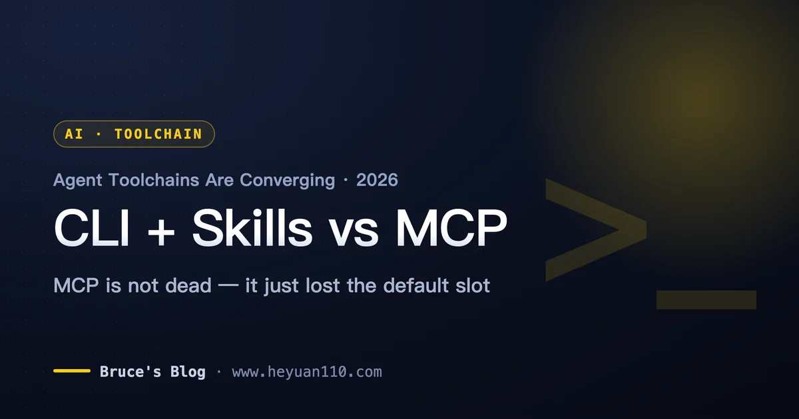
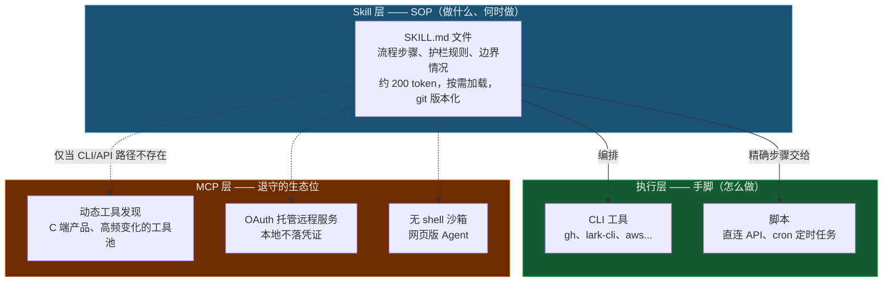
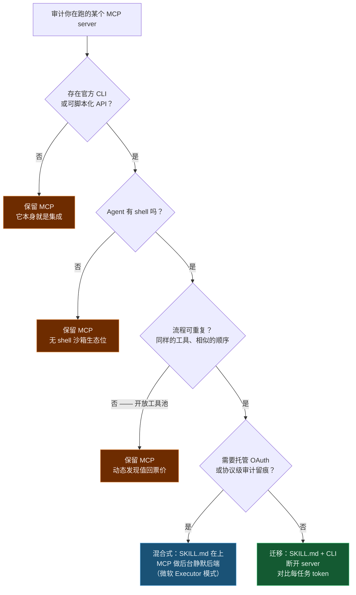

+++
date = '2026-07-04T10:00:00+08:00'
aliases = ['/posts/ai/2026-07-10-cli-skills-vs-mcp/']
draft = false
title = 'MCP 落伍了？CLI + Skill 才是 Agent 工具链的未来'
description = 'MCP 没死，但已从默认集成方式降级：GitHub MCP 光描述工具就吃约 5 万 token，一份 SKILL.md 只要 200。第一手生产实践讲透 CLI + Skill 为什么接管 Agent 工具链、MCP 还守着哪些场景，附迁移决策框架。'
toc = true
tags = ['MCP', 'Agent Skills', 'CLI', 'AI Agent', 'Claude Code']
keywords = ['mcp 落伍', 'mcp vs skill', 'cli skill 未来', 'agent 工具链选型', 'mcp 已死', 'mcp 替代方案', 'skill.md 怎么写']

[[params.faqItems]]
question = "MCP 已死是真的吗？"
answer = "不是死亡，是降级。MCP 失去的是「默认集成方式」的地位——固定流程、有 CLI 可用的场景已经被 Skill + CLI 接管。但在动态工具发现、无 shell 沙箱、OAuth 托管远程服务、需要协议级审计的企业场景里，MCP 仍然是唯一解或最优解。"

[[params.faqItems]]
question = "MCP 和 Skill 到底有什么区别？"
answer = "MCP 是 JSON-RPC 协议：常驻 server 把工具 schema 灌进模型上下文，GitHub MCP 一度要消耗约 5 万 token。Skill 是一个 SKILL.md 文件：用大白话告诉模型该跑哪些 CLI 命令、什么顺序、注意什么坑，只占约 200 token 且按需加载。前者是给机器定义工具，后者是给模型写操作手册。"

[[params.faqItems]]
question = "为什么 AI Agent 用 CLI 比用 MCP 更可靠？"
answer = "训练语料决定的。模型见过几十亿行 shell 命令、报错信息和人类的排错过程，跑 CLI 是母语级行为；而 MCP 工具的 schema 是它 30 秒前才在上下文里第一次见到的。CLI 还能用管道预过滤输出、报错直接重跑、命令复制到终端就能复现——这三点 MCP 都做不到。"

[[params.faqItems]]
question = "什么时候还是应该用 MCP？"
answer = "四种情况：目标服务没有 CLI 或可脚本化的 API；你的 Agent 跑在没有 shell 的环境（网页版 Agent、受限沙箱）；服务需要托管 OAuth 授权，你不想自己管凭证；工具池高频变化，动态发现的价值真的能覆盖它的上下文成本。"

[[params.faqItems]]
question = "怎么把一个 MCP server 迁移成 SKILL.md + CLI？"
answer = "先核对三个信号：官方 CLI 存在（gh、lark-cli、aws 等）、Agent 有 shell、流程可重复。满足就写一个 SKILL.md：写清用哪个 CLI、给 3-5 条带真实输出的命令示例、列出失败模式和兜底方案，然后断开 MCP server，对比迁移前后每个任务的 token 消耗。"
+++

CLI + Skill 正在取代 MCP，成为 Agent 接工具的默认方式——这不是预测，是正在发生的事实。整场 **MCP vs Skill** 争论里最硬的一个数字：GitHub 官方 MCP server 光是*描述自己的工具*就吃掉约 5 万 token 上下文（后来砍到约 2.3 万），而一份写着「用 `gh` 命令行，示例如下」的 SKILL.md 只要约 200 token 就干同样的活。广为流传的「250 倍」就是从这组数字算出来的，出处见 [《Markdown is the New API》](https://juliofalbo.medium.com/markdown-is-the-new-api-how-skill-md-and-ai-gateways-unlock-ai-native-organizations-e929d05c0470)。

更狠的是，这笔钱是房租不是一次性买断：任务还没开始就先交，每个会话都交，不管这次任务碰不碰 GitHub。

最早下注的人正在离场。今年 3 月，Perplexity CTO Denis Yarats 内部宣布弃用 MCP、回归 API 和 CLI。同一周，YC 总裁 Garry Tan 发帖 ["MCP sucks honestly"](https://x.com/garrytan/status/2031910564344262988)——吃上下文、认证难用、server 要手动开关——他花 30 分钟给 Playwright 撸的 CLI wrapper，比被它替掉的 MCP 集成还好用。

但说服我的不是他们。上周有一个工作日，我自己的 Agent 工具链连续三次栽在 MCP 上，三次都被同一个东西救回来：一段普通脚本 + 一个普通 CLI + 一份 Markdown 编排文件。

立场直接亮出来：**CLI + Skill 已经拿下 Agent 工具链的主干，MCP 退守一块它守得住的生态位**。这篇文章的大头花在「为什么」上——MCP 的架构税真实存在、是结构性的、靠写更好的 server 修不掉。讲完税，再给 MCP 说公道话，最后给一个这周就能跑的迁移决策框架。

## MCP 的架构税：活还没干，三张账单先到

2025 年大半年，MCP 被包装成 Agent 时代的 TCP/IP——一个协议连接所有工具和所有模型。这个故事能卖出去，因为它解决了 2024 年的真问题：那时模型不太会用工具，标准化 schema 确实帮了忙。

到 2026 年初，问题反转了。模型已经很会用工具，付不起的是 MCP *描述工具*的方式的成本。这个成本不是一笔账，是三笔，而且互相叠加。

### 第一笔：schema 房租，每个会话都收

MCP server 的设计是把整个工具目录预先灌进模型上下文——动态发现要求模型先看到有什么可用，这不是 bug，是设计本身。但它同时就是税。

GitHub 那组数字是最典型的案例。扎心的不是数字大小，是收费方式：两万多 token 每个会话预收一次，包括那些一条 GitHub 工具都没调的会话。SKILL.md 是按需加载，触发了才读，读也只要两百来 token。

中文社区流传更夸张的数据——「MCP 调用成本 10-32 倍」「任务可靠率 72%」。我没能找到可复现的 benchmark 出处，建议当社区传说看，别拿去做严肃决策。但你也不需要传说：GitHub 这一个案例就可验证，而且是平台旗舰集成上两个数量级的差距。

### 第二笔：模型实打实变笨

上下文成本有一层比账单更疼的二阶伤害：它降低模型本身的表现。每一千 token 的 schema，就是模型少一千 token 注意力花在你真正的问题上；工具列表越长，选错工具的概率越高——这是可测量的。

我在[上下文工程那篇](/zh/posts/ai/2026-06-16-context-engineering-2026/)里展开过这个机制：注意力是 Agent 系统里最稀缺的资源，而 MCP 的设计把它花在了管道上。

换句话说，你付的不只是 token 钱，还搭上了答案的质量。

### 第三笔：逼模型说外语

CLI 最深层的优势不是工程上的，是语言学上的。大模型的训练语料里装着几十亿行 shell 命令和对应输出：Stack Overflow、GitHub Issues、CI 日志、dotfiles、教程文档。

Agent 跑 `gh pr list --state open --json title,author` 时，它在做一件见过几百万次的事，连报错信息和人类怎么排错都见过。调 MCP 工具时，它在照着 30 秒前才第一次出现在自己上下文里的 schema 干活。一边是母语，一边是趴在工作台上现翻说明书。

这就是为什么「直接让它用 CLI」反复打败精心设计的工具定义：你不是在教模型新技能，你是在给它已有的技能让路。

母语还自带一套 MCP 结构上给不了的工具箱。输出能用 `jq`、`grep` 管道预过滤，只有相关的那一片才进上下文；报错是模型见过一百万次的纯文本；调试就是把命令原样粘进你自己的终端，亲眼看它怎么挂。MCP 出错时你在翻别人 server 的日志，CLI 出错时**命令本身就是复现步骤**。

三笔账单，一个病根：MCP 把工具知识搬进了整个系统里最贵的地皮——上下文窗口——然后每个会话向你收一次租。

## 一天三次 MCP 掉链子：税单上门的样子

行业名言不值钱，讲讲我自己工具链在一个工作日里发生的事，干的还全是最平常的博客运营活。三次失败的模式各不相同，结局一模一样——这个模式比任何单次失败都重要。

**第一次：连不上我自己浏览器的浏览器 MCP。** 我想抓这个博客的 Google Search Console 数据。GSC 我在 Chrome 里天天登着，看起来最顺手的方案是 chrome-devtools MCP——导航、点击、抓网络请求全封装成了工具。

结果 MCP server 起的是一个全新 profile 的隔离 Chrome：没 cookie，没登录态。想着那就登录一次呗，Google 的自动化检测直接把登录流程拦了。改成 attach 我的真实浏览器，tab 定位又失灵，点击落在错误的页面上。

跟这层抽象搏斗四十分钟后，我删掉 MCP 配置，用 puppeteer-core 写了 60 行左右的脚本，直连已登录 Chrome 的调试端口——就是我在 [Chrome DevTools MCP 配置教程](/zh/posts/ai/2026-03-17-chrome-devtools-mcp-guide/)里写过的 9222 端口那套。一次跑通。MCP 层不是没帮上忙，是**主动在我和一个我本来就拥有的资源之间砌了一堵隔离墙**。

**第二次：直接消失的 MCP server。** 博客封面图生成，原来走 Rube——一个托管 MCP 聚合服务，代理 Gemini 的生图 API。Rube 停服了。不是变慢，不是降级，是没了，所有经过它的工作流当场全灭。

修复花了一个下午：一百行出头的 Python 脚本直连 Gemini API，先按 4K 出图再降采样成 1200×630 的 WebP。比走 MCP 时更快，还支持了代理层从没暴露过的分辨率，依赖只有环境里的一个 API key。

这个脚本已经活得比它替代的那层「基础设施」久了，而且会继续活下去。因为脚本的依赖清单是 `python + requests + 一个 API`，托管 MCP server 的依赖清单里包含**别人家公司的商业模式**。

**第三次：想明白浏览器从头到尾就不该出场。** 第一次失败后我退一步问自己：我为什么要驱动浏览器？GSC 和 GA 都有官方 API，都支持服务账号认证。

最终方案：个人服务账号认证的 headless 脚本，cron 每周自动执行，数据落成本地文件让 Agent 直接读。没有 MCP，没有浏览器，没有会过期的登录态。这个教训可以推广——相当一部分 MCP server 包装的东西，往下挖一层本来就有可脚本化的接口。

三次失败，一个诊断：MCP 层要么是故障点（隔离实例、点击失灵），要么是会消失的依赖（停服的托管服务），而它下面那层——CLI、脚本、官方 API——永远可用。CompanyOS 的构建者把这个性质说得很直白：[server 断开时你从自动降级为手动，但流程知识还在](https://thenewstack.io/skills-vs-mcp-agent-architecture/)。这句话我以前是点头赞同，现在是一天亲测三遍。

## 离场的都是当初下注最重的人

2026 年一季度这波退潮和普通的推特唱衰不一样，关键看**是谁在退**。Sentry 的 David Cramer 亲手搭过 Sentry 自己的 MCP server，然后公开写下[「许多 MCP server 根本没必要存在」](https://thenewstack.io/skills-vs-mcp-agent-architecture/)——要么是糟糕的 API 封装，要么一个 Skill 文件就能替代。

Garry Tan 撸完那个 30 分钟的 Playwright wrapper，团队才告诉他 Vercel 早就做了一个。这也对得上 Vercel CEO Guillermo Rauch 那句被广泛引用的定调："CLIs are the de-facto MCPs for agents"。Perplexity 则把转向写进了产品——新上的 Agent API 把 API 当基座、MCP 当可选层，而不是地基。（顺带核查一个中文社区流传的细节：「100 行代码、效果好 100 倍」在 Garry Tan 原帖里并不存在，他自己只说了「30 分钟」，引用时别放大。）

连 Anthropic——MCP 的发明者——都发了一篇[工程博客](https://www.anthropic.com/engineering/code-execution-with-mcp)承认全量工具定义灌进上下文撑不住规模，建议让 Agent 写代码去调 MCP 工具，而不是直接调。协议作者本人建议在模型和协议之间垫一层代码，这个信号怎么读都不乐观。最早的采用者开始把你的标准叫「开销」时，那不是营销问题，是单位经济问题。

国内的动向和硅谷同频。飞书 3 月底开源了 lark-cli——注意，是 CLI，不是又一个 MCP server——覆盖 11 个业务域、200 多条命令，还官方配套了 Agent Skill。当国内头部协作平台选择用 CLI + Skill 的形态对接 Agent 生态时，这已经不是社区偏好，是厂商拿真金白银的研发资源投的票。

## 真正替代 MCP 的是 Skill 这一层

多数「CLI vs MCP」文章漏掉一个关键：光有 CLI 并没有掀翻 MCP，掀翻它的是 **CLI 加一层知识文件**——SKILL.md。Skill 就是这层知识：写清楚跑哪些命令、什么顺序、边界情况怎么办、什么时候停下来问人。它是写给模型看的 SOP。

我在 [Agent Skills：用大白话写程序的时代来了](/zh/posts/ai/2026-01-19-agent-skills-new-programming/)里论证过这是一种真正的编程范式。半年之后我想把结论磨得更尖：**Skill 接管了 MCP 的编排价值，CLI 接管了它的执行价值，两头一夹，常规场景下 MCP 就没剩下什么了**。

这套架构我在生产环境天天跑，不是玩具。日常主力是 27 个封装 lark-cli 的飞书 Skill——发消息、编辑文档、多维表格、日程、审批、会议纪要，每个都是一份 SKILL.md：写明用哪些子命令、给出标准调用示例、标注身份和权限的坑。完整评测见我的 [Lark CLI 完全指南](/zh/posts/ai/2026-03-29-lark-cli-guide/)。常驻 MCP server 数量：零。

对 Agent 说「把昨天的会议纪要拉出来，摘要发给团队群」，它读两份 Markdown——各几百 token，触发才加载——跑四条 CLI 命令，收工。同样的拓扑换成 MCP：两个常驻 server、几万 token 的 schema，外加两个随时可能挂掉的进程。这个博客本身也是同一套打法——第二个故事里那个封面图 Skill，现在就是一份 SKILL.md 编排一个直连 API 的 Python 脚本。

外部最有分量的佐证来自 CompanyOS，它有意思恰恰因为它**没有**抛弃 MCP：系统连着 8 个 MCP server 对接 Gmail、Linear、Help Scout，但构建者明说系统的灵魂是 [12 个 Skill 文件、约 2000 行 Markdown](https://thenewstack.io/skills-vs-mcp-agent-architecture/)——工作流、护栏规则、语气校准、决策逻辑全在里面。MCP server 是水管，Skill 才是资产。

改行为等于改 Markdown 提交 git：反馈回路以分钟计，团队里不会写代码的人也能 review。智能住在 Markdown 里、传输层随便换——这才是终局形态，它把 MCP 从「集成本身」降级成了「几根可互换水管里的一根」。

Skill 的代价也要摆出来，这是我踩出来的：**文字 SOP 不是代码，做不到 100% 确定性执行**。模型会读漏一步、跳过一条护栏、在你要求照章办事的地方自作主张。

我的解法是一条硬规矩：凡是必须精确的步骤，写成脚本让 Skill 去调用；SKILL.md 的文字只负责需要判断力的部分。**判断归 Skill，精确归脚本**。如果一个流程零容忍偏差且不需要任何判断，那它根本不该是 Skill——该是 cron 任务，我的 GSC 数据管线最后就落在了那里。

## 说句公道话：MCP 仍然赢的场景

「MCP 已死」的文章大多败在从不给对方摆事实，我不想犯同样的错——何况我自己现在还在跑几个 MCP server，理由是结构性的，不是怀旧。

**没有 shell，CLI 论就不成立。** 上面所有论证都有一个隐藏前提：你的 Agent 摸得到 shell。网页版 Agent、移动端助手、锁死的企业沙箱，很多根本没有。对它们来说「直接跑 gh 就行」是一句没有意义的话，而 MCP 的 HTTP 传输恰恰能进这些环境。这不是小众市场——大部分 C 端 AI 产品都在这个范畴里。

**工具池真的高频变化时，动态发现是真价值。** 我的飞书 Skill 能跑得稳，是因为 lark-cli 的命令面稳定。一个面向开放生态的 C 端 Agent——用户在运行时接入自己的第三方服务——真的需要运行时发现，这时带 schema 的协议就是比一个文件夹的 Markdown 强。2025 年的错误不是造了 MCP，而是**把动态发现协议当成了静态工具集的默认方案**，为没人用到的灵活性付了全额账单。

**托管授权和审计边界。** 我的 puppeteer 脚本连上已登录 Chrome 时，继承的是我的完整会话——方便，但也正是让安全团队睡不着的那种全量授权。远程 MCP server 配托管 OAuth，给企业的是一个卡口：细粒度 token、可撤销、每次调用留痕。

而且要对 CLI 路线的另一面诚实：**给 Agent 一个 shell，等于给它任意命令执行的能力**。我在 [MCP 安全指南](/zh/posts/ai/2026-02-23-mcp-security-guide/)里写过这个张力——当威胁模型里有提示词注入时，受限的协议面反而是优点。跨平台也是同理：我的 Skill 默默假设了 macOS，搬去 Windows 得返工，协议 schema 则不挑操作系统。

注意这些 MCP 赢面的共性：全是**环境约束**——没 shell、工具不稳定、凭证不能落地。没有一条是「在 CLI 存在且能用的前提下，MCP 集成得更好」。这就是我说「降级而非死亡」的准确含义：MCP 守住的是由约束定义的领土，在开发者有得选的地方全线撤退。

## 不是葬礼，是分层收敛：微软给出的终局预览

终局长什么样，目前最可信的预览来自微软。他们的 [.NET Skills Executor](https://devblogs.microsoft.com/foundry/dotnet-ai-skills-executor-azure-openai-mcp/) 是个混合体：从目录里发现 SKILL.md 文件驱动 Agent 主循环，MCP server 沉到下面做众多执行后端之一，Skill 的某一步需要时才静默调用。微软同时还维护着[官方 Skill 仓库](https://github.com/microsoft/skills)。

当最擅长把标准落地成企业产品的公司把 Skill 放上层、MCP 压下层时，未来工具栈的组织架构图已经画出来了：**Skill 当 SOP 层，CLI/脚本当默认执行层，MCP 当前两层够不到时的兜底传输**。

这也解开了「MCP 是否已死」的伪二元对立。问题从来不是「要不要协议」，而是**知识住在哪一层**。2025 年我们试图把流程知识塞进工具 schema——那些 5 万 token 的定义，本质上就是压缩得很烂的 SOP——失败是因为 schema 是承载判断力的糟糕介质。

知识搬进 Markdown 之后，便宜、可版本化、人和模型都能读；知识层一独立，下面的传输层就沦为大宗商品，而大宗商品按成本竞争。CLI 是世界上最便宜的传输，因为模型本来就会说它。我在一月份的 [Skill 与 MCP 的区别](/zh/posts/ai/2026-01-06-skillmcp/)里把两者当互补的平级来写；跑了半年生产之后我要修正结论：互补没错，平级不再——一个是主干，一个是支线。

## 迁移决策框架：这周就能跑

理论说完，给可以直接抄的作业。这是我迁移自己工具链时实际用的判断流程，浓缩成五个信号，逐个核对你在跑的每个 MCP server：

1. **官方 CLI 或可脚本化 API 已存在**（gh、aws、kubectl、lark-cli、带 token 认证的 REST API）——这个 MCP server 只是在你的 Agent 和它本可直达的东西之间做翻译。
2. **Agent 有 shell**——有，CLI 论全额适用。
3. **流程可重复**——你翻来覆去调的就是那 3-5 个工具、相似的顺序，却在为静态例行公事支付动态发现的价格。
4. **schema 成本远超使用率**——server 加载几千上万 token 的定义，你只用其中五分之一的工具。翻一下会话日志，这条是可测量的。
5. **server 需要人伺候**——认证反复重配、常驻进程要管、动不动「关了再开试试」。Garry Tan 骂的全套。

命中三条以上：写 SKILL.md、指向 CLI、断开 server、对比迁移前后每任务 token。SKILL.md 只需要四段——用哪个工具、带真实输出的标准命令示例、失败模式和兜底、模型不许越过的硬边界。我自己的平均不到一百行。

最后一条来自我自己迁移的提醒：别省掉「测量」这步。token 下降是标题党数字，真正改变我行为的是故障恢复时间——puppeteer 脚本坏了，我把命令一粘就看到报错；MCP 路径坏的那次，我在翻别人 server 的日志。可调试性才是复利，而它从来不体现在 token 账单上。

把我的立场写成一句可以被证伪的话：到 2026 年底，「怎么把 Agent 接到 X」的默认答案会变成「X 有 CLI 吗」，只有这个问题答「没有」时，MCP 才出场。今天新起 Agent 项目，从 Skill + CLI 开始；撞上前面那几种环境约束的那天，再加 MCP server——别提前。

## Related Reading

- [Skill 与 MCP 的区别：两种扩展 AI 能力的方式](/zh/posts/ai/2026-01-06-skillmcp/)
- [MCP vs Skills vs Hooks：Claude Code 三种扩展怎么选](/zh/posts/ai/2026-04-02-mcp-vs-skills-claude-code/)
- [Agent Skills：用大白话写程序的时代来了](/zh/posts/ai/2026-01-19-agent-skills-new-programming/)
- [Lark CLI 完全指南：用命令行和 AI Agent 操控飞书](/zh/posts/ai/2026-03-29-lark-cli-guide/)
- [Chrome DevTools MCP 配置教程：9222 端口连接已登录浏览器](/zh/posts/ai/2026-03-17-chrome-devtools-mcp-guide/)
- [MCP 协议全面解析：AI 连接万物的通用标准](/zh/posts/ai/2026-02-20-mcp-protocol-guide/)
- [Context Engineering for Coding Agents 2026: What Works](/zh/posts/ai/2026-06-16-context-engineering-2026/)
