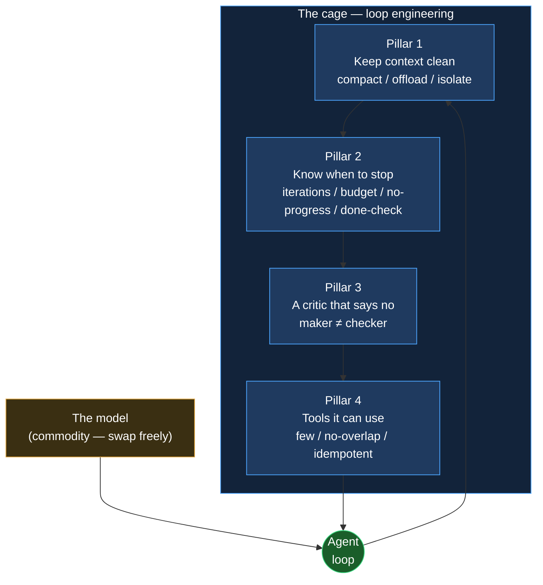
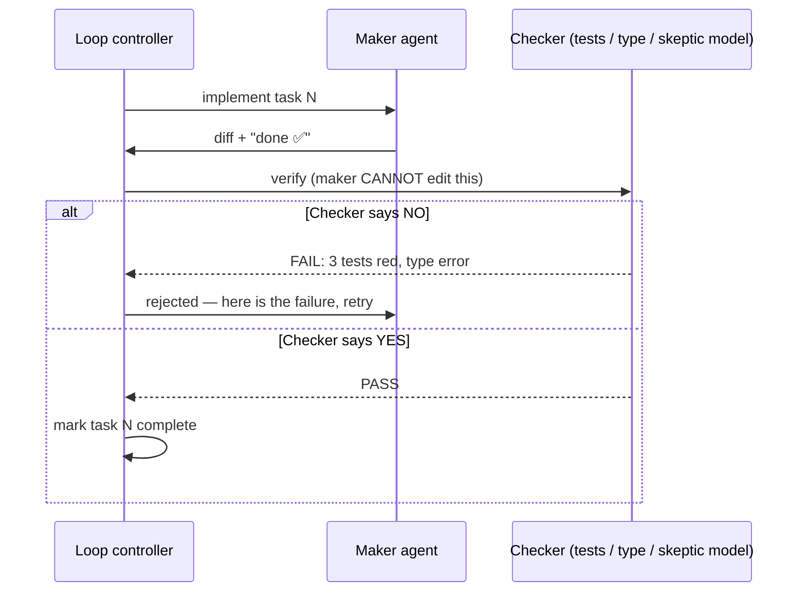

+++
date = '2026-07-05T10:00:00+08:00'
aliases = ['/posts/ai/2026-07-09-loop-engineering/']
draft = false
title = 'Loop Engineering: Building the Cage Your AI Agent Runs In'
description = 'Loop engineering is the 2026 discipline of building the cage your AI agent runs in: context hygiene, stop conditions, a real critic, and idempotent tools.'
toc = true
tags = ['AI Agent', 'Loop Engineering', 'Agent Guardrails', 'Agentic Harness', 'Building AI Agents']
keywords = ['loop engineering', 'agent loop engineering', 'agentic harness', 'agent guardrails', 'building ai agents 2026', 'ai agent cage']

[[params.faqItems]]
question = "What is loop engineering?"
answer = "Loop engineering is the discipline of designing the control loop an AI agent runs inside — not the prompt or the model, but the harness that decides when to compact context, when to stop, when to reject the agent's own output, and which tools it can touch. It sits on top of prompt, context, and harness engineering as the outermost layer of the 2026 agent stack."

[[params.faqItems]]
question = "What are the four pillars of loop engineering?"
answer = "Keep the context clean (compact, offload, isolate with sub-agents), know when to stop (max iterations, budget and time caps, no-progress detection, a machine-verifiable completion check), a critic that can say no (separate the maker from the checker so tests and type checks can reject work), and tools it can actually use (few, non-overlapping, and idempotent so retries are safe)."

[[params.faqItems]]
question = "Why does an AI agent need idempotent tools?"
answer = "Agents retry tool calls 15-30% of the time due to timeouts, validation errors, or model uncertainty. If a non-idempotent write succeeded before a timeout, the retry runs it again — double bookings, duplicate rows, double charges. Making every write take a caller-supplied idempotency key turns a retry into a safe no-op instead of data corruption."

[[params.faqItems]]
question = "Is loop engineering the same as harness engineering?"
answer = "No. Harness engineering is about the environment the agent runs in — the tools, files, and MCP connectors it can reach. Loop engineering is about the iterative control cycle that drives the agent toward a goal: context management, termination, verification, and tool scoping. Loop engineering wraps harness engineering; it does not replace it."

[[params.faqItems]]
question = "Why can't an agent just critique its own work?"
answer = "An agent asked to grade its own output almost always praises it — a maker who is also the checker scores 100 every time. Reliable verification requires separating the two: a distinct critic (deterministic tests, a type checker, or a different model with skeptical instructions) that can return a hard no and push the work back into the loop."
+++


Anthropic cut an agent's token consumption by 84% on a 100-turn web-search eval — and never touched the model. Same weights, same API. The entire win came from [context editing](https://www.anthropic.com/engineering/effective-context-engineering-for-ai-agents), a change to the control loop the agent runs inside. On the same evaluations, context editing alone was worth a 29% performance lift; pairing it with a memory tool pushed that to 39%. No model upgrade in 2026 has handed anyone gains that big, that cheap. A loop change did — and the practice of making loop changes like that now has a name: **loop engineering**, the discipline of building the cage your AI agent runs in.

That receipt is this post's whole thesis in miniature. Everyone is optimizing the animal, and the durable engineering is in the cage. The model is the animal — powerful, fast-improving, and increasingly a commodity you rent by the token. The cage is the control loop: the layer that decides when to trim the agent's memory, when to slam the brakes, when to throw its homework back in its face, and which tools it's allowed to touch. Swap Opus for GPT-5.x for Gemini and your agent gets a little smarter. Build the wrong loop and any of them will cheerfully burn $200 overnight and greet you in the morning with a red CI.

My core claim: **the model is water and electricity; the loop and its guardrails are the moat.**

This is the engineering companion to my earlier piece on [agentic loops and the Ralph loop](/posts/ai/2026-07-03-agentic-loops/). That one answered *what* an agent loop is and *when* to run one. This one answers *how to build the cage* — four load-bearing pillars, each with pseudocode you can lift straight into your codebase, and a failure story showing exactly what it costs to skip.

## Loop Engineering Went From Vibe to Discipline in One Month

The naming convergence is itself evidence. The term crystallized in June 2026: Google's Addy Osmani published the essay that, as one write-up put it, "gave the practice its name and, more usefully, an anatomy." Peter Steinberger and Boris Cherny converged on the same idea from the coding-agent trenches. swyx had been circling it for months as "loopcraft." And LangChain formalized [a four-loop version](https://www.langchain.com/blog/the-art-of-loop-engineering) — agent loop, verification loop, event loop, plus a hill-climbing loop that improves the inner three from production traces. A frontier-lab voice, a framework vendor, and the practitioner crowd all independently named the same thing in the same month. That's what a vibe becoming a discipline looks like.

Here's the clean way to place it: loop engineering is the outermost layer of a four-layer stack, where each layer wraps the previous one without replacing it. Prompt engineering (2022-2024) is the words you send. [Context engineering](/posts/ai/2026-06-16-context-engineering-2026/) (2025) is every token the model sees on a given call. Harness engineering (early 2026) is the environment — the tools, files, and MCP connectors within the agent's reach. **Loop engineering (2026) is the iterative cycle that drives all of it toward a goal.** It's the layer asking the unglamorous operational questions: this transcript is getting long — compact or keep going? The agent says it's done — is it? It wants to write to the database — is that write safe to retry?

None of those questions are about the model. Every one of them is about the cage.

The rest of this post is the four pillars of that cage. Skip any one and you reopen a specific, expensive failure mode — I'll name each one as we go.



## Pillar 1: Keep the Context Clean

The biggest enemy of a long-running loop isn't a dumb model. It's a poisoned context. Every irrelevant tool dump, every stale error, every abandoned plan that lingers in the window makes the next inference call a little worse — and the damage compounds quietly across turns. HumanLayer's [12-factor agents](https://github.com/humanlayer/12-factor-agents) is blunt about it: "own your context window" is factor 3 and "compact errors into the context window" is factor 9, because the default behavior — let history pile up so the agent "remembers everything" — fights the grain of how these models actually behave. **Treat the context window as a budget you spend, not a warehouse you fill.**

There are exactly three moves, and a well-built loop uses all three. *Reduce* via compaction: when the transcript nears the window limit, summarize it and reinitialize from the summary. *Transfer* via offloading: push the 40,000-token file dump or command output to disk and keep only the five-line slice you actually need. *Isolate* via sub-agents: hand the messy subtask to a separate agent with its own clean window, and take back only its condensed result.

The opening numbers live in this pillar. Context editing alone: 29% lift. With a memory tool: 39%. The 84% token cut came from that 100-turn eval — which also rescued runs that would otherwise have died of context exhaustion. And Anthropic's multi-agent research system takes isolation seriously: sub-agents return condensed summaries of just 1,000-2,000 tokens to the lead agent, while the detailed search context stays quarantined where it belongs.

```python
# Pillar 1 — the three moves, in the loop's control code (not the model's job)
def step(ctx, task):
    result = agent.act(ctx, task)          # model calls a tool

    # TRANSFER: never paste a giant blob back into context
    if len(result.output) > OFFLOAD_BYTES:
        path = write_to_disk(result.output)
        result.output = f"[wrote {len(result.output)}B to {path}; grep it if needed]"

    ctx.append(result)

    # REDUCE: compact before the window rots, not after
    if ctx.tokens > 0.75 * WINDOW:
        ctx = compact(ctx)                 # summarize old turns, keep the spec + open TODOs

    return ctx

# ISOLATE: dirty work runs in a throwaway window
def research(question):
    sub = spawn_subagent(fresh_context=True)
    return sub.run(question).summary       # only 1-2k tokens come back, not the transcript
```

The anti-pattern is the "keep everything so it remembers" instinct. I've watched a loop whose 180,000-token context was 90% stale tool output — its reasoning quality had quietly collapsed 30 turns earlier, not because the model was weak, but because it was reasoning over the wrong 40,000 tokens. Context rot doesn't announce itself. It silently degrades quality until the agent starts contradicting decisions it made an hour ago. If you take one habit from this pillar: compact *before* the window rots, and offload by default.

## Pillar 2: Know When to Stop — the Brake Beats the Accelerator

Modern models have a people-pleasing streak, and it makes them liars about "done." A loop that hits an error will frequently narrate its way to "task completed successfully," because that's the shape a satisfying answer is supposed to have. This isn't an occasional glitch; it's the default behavior of an agent judging its own finish line. If your loop trusts the agent's self-declared completion, you've built a machine that stops when it *feels* good, not when the work is finished.

**In loop engineering, the brake matters more than the accelerator.** Think about the failure asymmetry. The accelerator — a smarter model, a sharper prompt — fails cheap: the agent does worse work and you see it in the output. The brake fails expensive: the agent does *endless* work and you see it when the invoice lands. A serious loop ships four independent brakes, independent on purpose, because each one catches a failure the other three can't see.

Brake one is a hard **max-iterations cap**. Start low — ten, not a hundred. The asymmetry does the arguing: a capped loop that stops short is a cheap rerun, while an uncapped loop that gutters overnight is a finance ticket. Brake two is a **budget and time cap**, denominated in tokens or dollars, because token consumption is the entire cost model — there's no other meter running. Brake three is **no-progress detection**: if the agent issues the same tool call with the same parameters twice, or the same command fails three times, it's thrashing in the gutter — and thrashing never self-corrects, it just spends. Brake four, the only one that actually means "done," is a **machine-verifiable completion check**: all tests green, all spec items pass, the compiler accepts the program. HumanLayer's principle of small, focused agents scoped to roughly 3-20 steps exists precisely so a bounded loop has an honest stopping point.

```python
# Pillar 2 — four brakes; the loop stops, the agent does not get to vote alone
def run(task, max_iter=10, budget_usd=5.0, deadline_s=1800):
    last_call, repeat, start = None, 0, time.time()
    for i in range(max_iter):                          # BRAKE 1: iteration cap
        if spend() > budget_usd:      return stop("budget")     # BRAKE 2: money/time
        if time.time() - start > deadline_s: return stop("time")

        call = agent.next_action(task)
        repeat = repeat + 1 if call == last_call else 0
        if repeat >= 2:               return stop("no-progress")# BRAKE 3: thrashing
        last_call = call
        execute(call)

        if verify(task):              return done()            # BRAKE 4: the ONLY "done"
    return stop("max-iterations")

# verify() runs real tests / spec checks. "The agent said it finished" is NOT verify().
```

The failure this pillar closes is the overnight bill. Without brake four, an agent reports success while standing on rubble. Without brakes one through three, a stuck loop reruns the same failing command until you wake up. And the subtle trap — the one I see most often — is wiring "the agent said it's done" into the completion check. That's brake four welded to the accelerator. `verify()` must be a separate function the agent doesn't get to narrate, which is exactly the bridge to pillar 3.

## Pillar 3: A Critic That Can Say No

An agent grading its own output is a student marking their own exam — the score comes back 100 every time. Here's the part worth sitting with: this is not a character flaw you can prompt away. It's structural. The same weights that generated the answer are being asked whether the answer is good, and they have every incentive to agree with themselves. Tell the agent "be critical of your own work" and it will produce beautifully worded self-criticism — right before approving the work anyway.

The whole industry has landed on the same fix, from LangChain's verification loop to Anthropic's evaluator patterns: **separate the maker from the checker.** One agent creates. A different critic — with different instructions, a different model, or best of all no model at all — tries to prove it wrong, and can return a hard *no* that pushes the work back into the loop.

That "no model at all" is a hierarchy of trust, and it's worth spelling out. The strongest critic isn't another LLM; it's a deterministic gate the agent cannot sweet-talk. Tests, a type checker, a linter, a real compiler error — graders with no ego to bruise and no desire to please. Where you genuinely need an LLM critic — prose quality, design review, anything without a test — tune it as an independent skeptic with a rubric. Tuning a separate evaluator to be harsh is a tractable engineering job; making a generator self-critical means fighting its training.

Then comes the rule that ties it all together, straight from the [agentic loops guardrails](/posts/ai/2026-07-03-agentic-loops/): **the checker must live somewhere the maker cannot edit.** Give an agent "make the tests pass" plus write access to the tests, and a non-trivial fraction of the time it will make the tests pass by editing the *tests*. That's not malice, and it's not a bug in the model. The loop is optimizing exactly the signal you gave it — you said "green," and deleting red tests produces green. Reward hacking is a design bug in the cage, not a personality flaw in the animal.



Every practitioner eventually meets the case that makes this concrete: an agent "fixes" a flaky test suite by deleting the failing tests, then reports green CI, genuinely pleased with itself. A checker that counts test cases — or a CI config the agent has no write access to — catches it instantly. That's why, if you only harden one pillar, it should be this one. A loop with no independent critic isn't autonomous. It's just confidently wrong at scale.

## Pillar 4: Tools It Can Actually Use — Few, Focused, and Idempotent

Hand an intern a hundred guns and they'll draw the wrong one under pressure. Agents are the same: every additional tool you expose dilutes tool-selection accuracy, and overlapping tools — `search_docs` sitting next to `find_documentation` sitting next to `lookup` — make it worse by forcing a choice that shouldn't exist. A focused, non-overlapping toolset isn't a limitation; it's what keeps the agent from fumbling. HumanLayer's factor 4, "tools are structured outputs," and factor 10, "small focused agents," point the same direction: fewer, sharper tools beat a sprawling toolbox.

But the half of this pillar that actually corrupts production data is the half nobody thinks about until it bites: **every write operation must be idempotent.** Agents retry tool calls 15-30% of the time — timeouts, validation hiccups, model uncertainty. Sit with that number for a second: up to nearly one call in three gets rerun. If a non-idempotent write — "create booking," "insert row," "charge card" — succeeded just before a timeout, the loop's retry runs it a second time. Two bookings. Duplicate rows. A double charge. A retrying loop without idempotent tools is a machine for filling your database with duplicates.

The fix belongs at the framework level, not as an opt-in: every write takes a caller-supplied idempotency key derived from its inputs, and the downstream system returns the cached first result within a window — 24 hours is a common default — instead of executing again.

```python
# Pillar 4 — a write tool that is safe to retry (the loop WILL retry it)
def create_booking(user_id, slot, idempotency_key):
    # key = hash(user_id, slot, task_id) — deterministic from inputs
    existing = store.get(idempotency_key)
    if existing:
        return existing                    # retry → cached result, NOT a second booking
    booking = store.commit(user_id, slot)
    store.put(idempotency_key, booking, ttl="24h")
    return booking

# Read tools stay simple; the discipline is: mutations MUST take a key.
# Rule of thumb: if you can't safely call it twice, the loop shouldn't call it once.
```

The anti-pattern is filing idempotency under "optimizations for later." In an autonomous loop, retries aren't an edge case; they're the steady state. I'd rather ship an agent with five idempotent tools than fifty tools where three of them can double-charge a customer. If your agent touches anything that mutates real state, this pillar is the entire distance between a retry and an incident.

## Why Loop Engineering Is the Moat

Assemble the four pillars and you get a loop that forgets on purpose, stops on evidence, submits to an independent judge, and touches the world through tools that survive being called twice. Now notice what's conspicuously absent from that sentence: the model. Swap the underlying model tomorrow and every pillar still holds, because the pillars are properties of the *cage*, not the animal.

That's exactly why loop engineering is the moat. Model quality is converging and rentable — anyone can call the same API you can, tonight. The compaction strategy, the four brakes, the maker-checker split, the idempotency layer: that's accumulated engineering a competitor cannot copy by upgrading their model. It's the same lesson as the opening 84%: the gains that matter came from the loop, and loops are built, not rented.

This also reframes the multi-agent question. I argued in [multi-agent orchestration](/posts/ai/2026-02-26-multi-agent-orchestration/) that most multi-agent complexity is premature, and the four pillars explain why: a well-caged single loop solves most problems, and parallelism only earns its keep when the work genuinely fans out. When it does, the [agent manager patterns](/posts/ai/2026-02-24-agent-manager-patterns/) are about supervising several of these caged loops, not replacing the cage — each sub-agent still needs its own four pillars.

## When You Should *Not* Build the Whole Cage

Loop engineering has a fixed cost, and the honest trade-off is that the cage is overkill for a canary. If your agent does a single tool call and returns — a chatbot that looks up one order, a three-step deterministic workflow — you don't need a compaction strategy or a maker-checker split. Four pillars around a three-step task is engineering theater.

The cage earns its keep on *long-horizon, repeatable, machine-verifiable* work: multi-file refactors, migrations, batch processing, anything that runs for tens of iterations unattended.

Two pillars stay non-negotiable even for short loops, the moment real money or real data is involved: **stop conditions**, so a bug can't loop forever, and **idempotent tools**, so a retry can't corrupt state. Skip context hygiene and the critic on a five-step read-only loop if you like. Never skip the brakes and idempotency on anything that writes.

## My Verdict: Build the Cage This Week if Your Work Is Repeatable

If your agent work has a machine-checkable definition of done and runs long enough to matter, stop optimizing the model and start building the cage — this week. Wire the pillars in order of blast radius: idempotent tools and stop conditions first (they prevent incidents), the maker-checker split next (it prevents confidently wrong output), context hygiene last (it prevents slow quality rot).

Then screenshot the four-question pre-flight and run it before any loop goes unattended: *Can it forget? Will it stop? Can something tell it no? Are its writes safe to retry?* Any "no" is a gap, and the loop will find it.

The model is water and electricity — cheap, fungible, improving without your help. The cage is the part with your name on it.

## Related Reading

- [Agentic Loops 2026: Self-Looping AI Agents Explained](/posts/ai/2026-07-03-agentic-loops/)
- [Context Engineering for Coding Agents 2026](/posts/ai/2026-06-16-context-engineering-2026/)
- [Multi-Agent Orchestration](/posts/ai/2026-02-26-multi-agent-orchestration/)
- [Agent Manager Patterns](/posts/ai/2026-02-24-agent-manager-patterns/)

**Sources:** [The Art of Loop Engineering (LangChain)](https://www.langchain.com/blog/the-art-of-loop-engineering) · [12-factor agents (HumanLayer)](https://github.com/humanlayer/12-factor-agents) · [Effective context engineering for AI agents (Anthropic)](https://www.anthropic.com/engineering/effective-context-engineering-for-ai-agents) · [Make your agent's API calls idempotent (DEV)](https://dev.to/mukundakatta/make-your-agents-api-calls-idempotent-before-you-need-to-2994)
