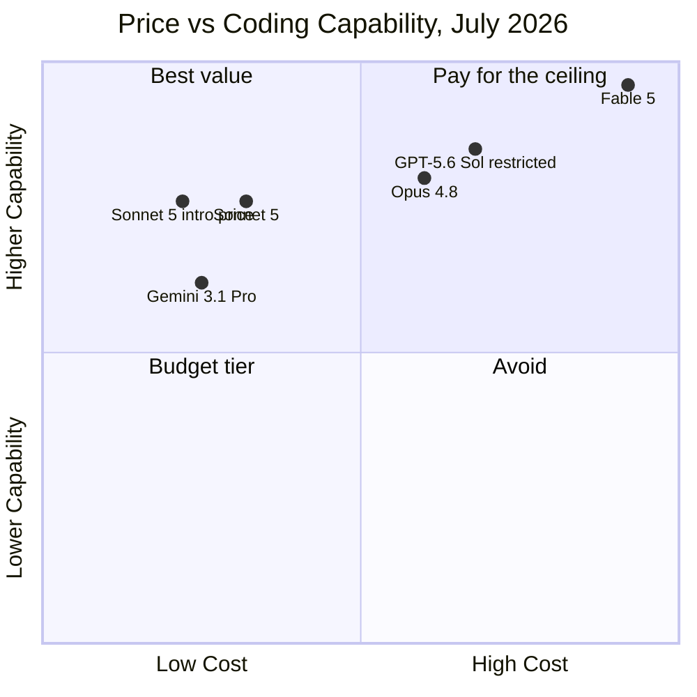
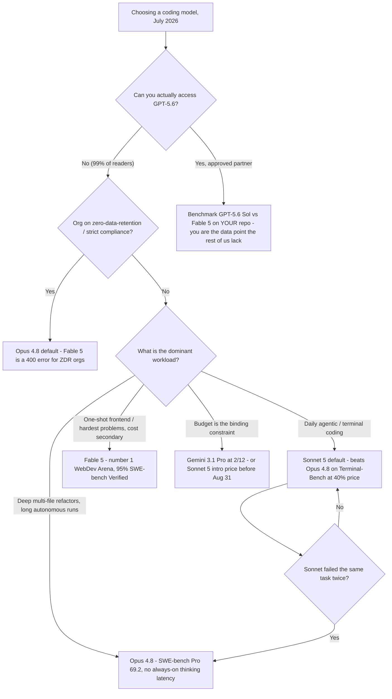

+++
date = '2026-07-07T11:00:00+08:00'
aliases = ['/posts/ai/2026-07-09-best-ai-coding-models-2026/']
draft = false
title = 'Best AI Coding Models 2026: Fable 5 vs Sonnet 5 vs GPT-5.6'
description = 'Fable 5 tops SWE-bench at 95%, but Sonnet 5 beats Opus 4.8 on Terminal-Bench at 40% of the price. A decision framework for picking your coding model in 2026.'
toc = true
tags = ['AI Coding Models', 'Claude', 'LLM Benchmarks', 'Model Comparison']
keywords = ['best ai coding model 2026', 'fable 5 vs gpt-5.6', 'claude sonnet 5 vs opus', 'best llm for coding', 'claude fable 5 benchmark', 'sonnet 5 pricing', 'is gpt-5.6 available']

[[params.faqItems]]
question = "What is the best AI coding model in 2026?"
answer = "Claude Fable 5 tops the benchmarks — 95% on SWE-bench Verified and #1 on WebDev Arena. But for most developers the best practical choice is Claude Sonnet 5: it beats Opus 4.8 on Terminal-Bench 2.1 at roughly 40% of the price."

[[params.faqItems]]
question = "Is Claude Sonnet 5 better than Opus 4.8 for coding?"
answer = "For agentic terminal work, yes — Sonnet 5 scores 80.4 vs Opus 4.8's 74.6 on Terminal-Bench 2.1. Opus 4.8 still leads on deep multi-file refactors (SWE-bench Pro 69.2 vs 63.2) and long-horizon autonomous runs."

[[params.faqItems]]
question = "Can I use GPT-5.6 right now?"
answer = "Almost certainly not. As of July 2026, GPT-5.6 (Sol, Terra, Luna) is a limited preview restricted to roughly 20 government-approved partner companies, available only through the OpenAI API and Codex — it is not in ChatGPT."

[[params.faqItems]]
question = "How much does Claude Fable 5 cost?"
answer = "$10 per million input tokens and $50 per million output tokens — 2x Opus 4.8 and 5x Sonnet 5's introductory pricing. Because thinking is always on, real output spend runs higher than the sticker suggests."

[[params.faqItems]]
question = "Why was Claude Fable 5 suspended in June 2026?"
answer = "Three days after its June 12 launch, the US Commerce Department ordered Anthropic to suspend all foreign-national access over cyber-capability concerns. The export controls were lifted on June 30 and the model returned to global availability in early July."
+++

The best AI coding model of 2026 got banned by the US government three days after launch. The second-most-hyped one, GPT-5.6, is technically "released" but you almost certainly can't use it. And the model that quietly wins the benchmark closest to real daily coding work costs 40% of what the flagship does. If you searched for the **best AI coding model 2026** expecting a clean leaderboard answer, this is the article that tells you why the leaderboard answer is wrong — and what to actually put in your config.

My position up front: **Fable 5 is the strongest coding model you can buy today, and most developers still shouldn't buy it.** For roughly 90% of coding work, Claude Sonnet 5 at introductory pricing is the correct default, with Opus 4.8 as the escalation tier. GPT-5.6 is not a real option for you yet, whatever the launch coverage implied. The rest of this post is the evidence.

## The Best AI Coding Models of July 2026 at a Glance

Here is the field as it actually stands this week, with pricing per million tokens:

| Model | Input / Output | Context | Coding headline | Availability |
|---|---|---|---|---|
| **Claude Fable 5** | $10 / $50 | 1M | 95% SWE-bench Verified, #1 WebDev Arena | Public again since early July (post export-control suspension) |
| **Claude Opus 4.8** | $5 / $25 | 1M | SWE-bench Pro 69.2, best long-horizon agentic runs | Public |
| **Claude Sonnet 5** | $3 / $15 (intro **$2 / $10** through Aug 31) | 1M | Terminal-Bench 2.1: 80.4 — beats Opus 4.8 | Public |
| **GPT-5.6 Sol** | $5 / $30 | — | Flagship of the Sol/Terra/Luna trio | ~20 government-approved partners only |
| **GPT-5.6 Terra / Luna** | ~$2.50 / $15 and $1 / $6 | — | Mid and budget tiers | Same restricted preview |
| **Gemini 3.1 Pro** | $2 / $12 | 1M | 80.6% SWE-bench Verified | Public |

Two things jump out of that chart. First, the top-left quadrant — high capability, low cost — is owned entirely by Sonnet 5, and the introductory pricing pushes it further left until August 31. Second, GPT-5.6 Sol sits in a strong position on paper, but "on paper" is doing enormous work in that sentence: a model you cannot call is a model with zero effective capability, and I'll come back to that.

## Why the #1 Coding Model Isn't the One You Should Use

The single most useful data point of this entire model generation is one most coverage buried: on [Terminal-Bench 2.1](https://llm-stats.com/blog/research/claude-sonnet-5-vs-claude-opus-4-8), **Sonnet 5 scores 80.4 against Opus 4.8's 74.6**. That is not "the cheap model closes the gap." That is the mid-tier model beating the flagship outright, on the same harness, on the benchmark that most closely resembles what a coding agent actually does all day — running shell commands, managing environments, recovering from errors, chaining multi-step terminal work. If you use Claude Code, Cursor's agent mode, or any terminal-driven workflow, Terminal-Bench is a far better proxy for your experience than SWE-bench is.

Why does this happen? Deep-reasoning benchmarks like SWE-bench Pro reward a model that thinks long and hard about a gnarly multi-file patch — and there Opus 4.8 still clearly wins, 69.2 to Sonnet 5's 63.2. But agentic terminal work rewards a different profile: fast turns, disciplined tool use, not overthinking a `sed` command. Anthropic's own migration notes say Sonnet 5 is "more agentic by default" and reaches for tools and self-verification loops more readily. The flagship's extra reasoning depth is wasted — sometimes actively counterproductive — on the 80% of coding tasks that are fundamentally plumbing. This is the same lesson I keep hitting in my [harness engineering experiments](/posts/ai/2026-02-19-claude-code-vs-codex/): the model's ceiling matters less than how well its default behavior matches the loop you run it in.

The mistake I see constantly — in Reddit threads, in team Slack channels, in my own past behavior — is treating the benchmark leaderboard as a shopping list sorted by "buy the top one if you can afford it." The correct read is: **match the benchmark to your workload, then buy the cheapest model that clears your bar.** For terminal-driven agentic coding in July 2026, that model is Sonnet 5, and it isn't close once price enters the equation.

## Fable 5: The Benchmark King With Two Asterisks

Let me be fair to the flagship first, because the numbers are genuinely historic. Fable 5 hits [95% on SWE-bench Verified](https://www.vals.ai/benchmarks/swebench) — confirmed on vals.ai's independent leaderboard, not just Anthropic's launch deck. On [WebDev Arena](https://arena.ai/leaderboard/code/webdev/) it sits at #1 with 1653 Elo, 92 points clear of second place — the widest gap the arena has ever recorded — and it leads every sub-leaderboard from React to data-viz. For one-shot frontend generation, "give it a design brief, get back a working page," nothing else is in the same weight class right now. If a single Fable 5 run replaces a day of your work and someone else pays the token bill, use it without guilt.

Now the asterisks. **Asterisk one: the vendor-scaffolding problem.** The 80.3% SWE-bench Pro headline number was produced with Anthropic's own agentic scaffolding, and independent evaluators have [contested how much of that survives on a neutral harness](https://techjacksolutions.com/ai-brief/claude-fable-5s-swe-bench-pro-score-is-contested-what-indepe/). The 95% SWE-bench Verified figure holds up independently; the Pro figure should be read as "best case with the vendor's harness." Whenever a launch benchmark and an independent leaderboard disagree, believe the leaderboard.

**Asterisk two: operational risk, and it's not hypothetical.** Fable 5 launched June 12. Three days later, the US Commerce Department [ordered Anthropic to suspend access](https://www.anthropic.com/news/fable-mythos-access) for all foreign nationals — inside or outside the US — citing the model's demonstrated ability to discover vulnerabilities and autonomously compromise networked systems. The model effectively vanished for two and a half weeks until the [controls were lifted on June 30](https://www.cnbc.com/2026/06/30/anthropic-says-trump-admin-has-lifted-export-controls-on-claude-fable-5-and-mythos-5.html). If you had built a production pipeline on Fable 5 in week one, you spent the second half of June doing an emergency model migration. I don't think this repeats soon, but the precedent is now set: a frontier model can be switched off by regulator directive with 72 hours' notice. That is a new line item in any serious model-selection rubric, and it structurally favors keeping your default on a boring, stable tier and treating the flagship as a swappable enhancement.

There are also mundane frictions the launch coverage skipped: thinking is always on (you cannot disable it, and single hard-task turns can run many minutes), API pricing at $10/$50 is 2x Opus and 5x Sonnet's intro rate, and Fable 5 requires 30-day data retention — organizations on zero-data-retention agreements get a flat 400 error on every request. Security-adjacent work also trips its cyber classifiers more often than on any previous Claude model. None of these are dealbreakers for the right task; all of them are reasons it makes a poor default.

## Sonnet 5: The Best Coding Model for Most Developers

Here is my actual recommendation, stated plainly: **set Sonnet 5 as your default coding model today, and re-evaluate on September 1 when the introductory pricing ends.** Through August 31, Sonnet 5 costs $2/$10 per million tokens — a fifth of Fable 5, 40% of Opus 4.8 — while beating the latter on the benchmark that best matches interactive coding-agent work. In three weeks of running it as my Claude Code default, the subjective experience matches the numbers: turns come back faster than Opus 4.8, it reaches for the terminal more willingly, and on routine tasks — write a migration, fix this failing test, wire up an endpoint — I genuinely cannot tell the output apart from the flagship's. The tasks where I can tell are exactly the ones the benchmarks predict: sprawling multi-file refactors where Opus 4.8's deeper reasoning stops it from painting itself into a corner.

That leads to the escalation rule I'd give any team: **Sonnet 5 by default; escalate to Opus 4.8 when Sonnet fails the same task twice; reserve Fable 5 for tasks where one run plausibly replaces a day of work.** Two failures is the signal that the task is reasoning-bound rather than execution-bound, which is precisely the regime where the Opus premium pays for itself. Escalating on the first failure wastes money — plenty of first failures are prompt problems, not capability problems.

One trap to price in before you commit budgets: Sonnet 5 uses a new tokenizer that produces roughly **30% more tokens for the same text** than Sonnet 4.6. The per-token sticker went sideways, but per-request cost on migrated workloads drifts up, and `max_tokens` limits tuned for 4.6 can silently truncate output. If you're on a subscription rather than the API, this mostly doesn't matter — I've covered how the plans map to actual usage in my [Claude pricing complete guide](/posts/ai/2026-04-03-claude-pricing-complete-guide/), and if you're deciding whether the free tier gets you anywhere, see [Claude free tier limits in 2026](/posts/ai/2026-07-08-claude-free-tier-limits/).

## GPT-5.6 and Gemini 3: The Rest of the Field

> **Update (July 9, 2026):** GPT-5.6 went GA two days after this post was published. The ~20-company government preview is over — Sol ($5/$30), Terra ($2.50/$15), and Luna ($1/$6) are now generally available in ChatGPT, the API, Codex, and the new ChatGPT Work. The section below is preserved as written pre-GA; my full read of the launch, including why the benchmark claims still deserve a discount, is in [GPT-5.6 Release: Pricing, ChatGPT Work, and the Codex Merger](/posts/ai/2026-07-10-gpt-5-6-general-availability/).

**GPT-5.6 is the strangest launch of the year, because it's a launch you can't use.** OpenAI [previewed the Sol, Terra, and Luna trio on June 26](https://openai.com/index/previewing-gpt-5-6-sol/) — Sol at $5/$30 as the flagship, Terra at roughly half that, Luna at $1/$6 — and then, [at the US government's request](https://techcrunch.com/2026/06/26/openai-limits-gpt-5-6-rollout-after-government-request-says-restrictions-shouldnt-be-the-norm/), restricted access to a preview of roughly 20 approved partner companies, API and Codex only, with nothing in ChatGPT. OpenAI calls the restriction a "short-term step" and says it shouldn't become the norm; no public date exists. So every "Fable 5 vs GPT-5.6" comparison you've read is comparing a model you can buy against vendor-published numbers for a model you can't. My advice is boring but correct: ignore GPT-5.6 in your planning until the day you can create an API key for it, then re-run this comparison. If the government-preview pattern holds — and both frontier labs have now been through it in a single month — expect a few weeks of partner exclusivity before public access.

**Gemini 3.1 Pro is the budget pick with a real argument.** At $2/$12 it undercuts even Sonnet 5's post-intro pricing, and 80.6% on SWE-bench Verified is a legitimately strong score — better than anything that existed six months ago. Where it loses to Sonnet 5, in my testing and in the agentic benchmarks, is in tool-use discipline inside long agent loops; it's a strong answer engine and a middling terminal operator. If your workflow is chat-style coding assistance rather than autonomous agents, or your bill is the binding constraint, it's a defensible choice. One more data point that should keep everyone humble: China's open-weight GLM-5.2 [overtook Fable 5 on Design Arena's HTML leaderboard](https://www.techradar.com/pro/chinas-answer-to-claudes-fable-5-comes-top-of-the-html-web-design-contest-as-the-ceo-tells-elon-musk-glm-will-reach-mythos-class-before-q1-2027) this month. Leaderboard positions in 2026 have a half-life measured in weeks, which is one more argument against paying flagship prices for a lead that may not survive the quarter.

## Decision Framework: Which Coding Model Should You Use?

Here is the whole article as one decision tree. Screenshot this part if nothing else:

A few notes on applying it. The "failed twice" gate matters more than it looks: in my logs, roughly half of first-attempt failures on Sonnet 5 were prompt or context problems that would have failed identically on Opus 4.8, and escalating on them just burns the price difference for nothing. The ZDR branch is absolute, not a preference — Fable 5 rejects every request from a zero-data-retention org with a 400, so for those teams the "best model" question answers itself at Opus 4.8. And if you're choosing the harness as well as the model, that's a separate decision I've written up in [Claude Code vs Cursor vs Windsurf](/posts/ai/2026-02-18-claude-code-vs-cursor-vs-windsurf-2026/) — the short version is that in 2026 the harness choice moves your results more than a one-tier model upgrade does.

## When Not to Use a Flagship Model

The inverse list is worth spelling out, because "when to use the expensive one" gets written about constantly and "when it actively hurts you" almost never. Don't use Fable 5 — and often not even Opus 4.8 — in these situations:

**Interactive coding sessions where latency is the experience.** Fable 5's thinking cannot be turned off, and hard-task turns run minutes. In a tight edit-run-fix loop, a model that answers in 15 seconds at 90% quality beats a model that answers in 4 minutes at 97%. You'll iterate three times in the time the flagship takes to answer once.

**High-volume, low-difficulty pipelines.** Test generation, docstring backfills, lint-fix sweeps, commit-message drafting. The capability delta on these tasks is approximately zero and the cost delta is 5x. This is what Haiku 4.5 ($1/$5) and Gemini 3.1 Pro exist for.

**Security and offensive-adjacent research.** Fable 5's cyber classifiers are the strictest Anthropic has shipped — that's literally what triggered the export-control episode. Benign pentesting tooling and CTF work trip refusals often enough that the flagship is a productivity downgrade for that domain. Use Opus 4.8.

**Anything where a two-week outage is unacceptable.** June proved that frontier-model availability now has a regulatory failure mode. Production pipelines should default to a stable tier with the flagship behind a config flag, not the other way around.

The meta-point: the price-capability frontier in 2026 is convex. Each tier up costs roughly 2x and returns maybe 1.1–1.2x on typical work. The flagship premium only clears that bar on tasks at the edge of what's possible — which is a real and valuable category, but it is not your Tuesday.

## The Bottom Line

If you remember three sentences from this post: Sonnet 5 is the best AI coding model for most developers in 2026, and its introductory pricing through August 31 makes this the single best month to standardize on it. Fable 5 is the genuine capability king — 95% SWE-bench Verified, an unprecedented WebDev Arena lead — but its price, latency, compliance requirements, and freshly demonstrated regulatory risk make it an escalation tier, not a default. And GPT-5.6 doesn't exist for you yet; revisit when it ships publicly, not when the benchmarks drop.

## Related Reading

- [Claude API Cost Calculator](/tools/claude-token-cost-calculator.html) — interactive per-call / monthly cost comparison across all current models
- [Claude Free Tier Limits in 2026: What You Actually Get](/posts/ai/2026-07-08-claude-free-tier-limits/)
- [Claude Pricing Complete Guide: API vs Pro vs Max](/posts/ai/2026-04-03-claude-pricing-complete-guide/)
- [Claude Code vs Codex: Which Agentic CLI Wins](/posts/ai/2026-02-19-claude-code-vs-codex/)
- [Claude Code vs Cursor vs Windsurf in 2026](/posts/ai/2026-02-18-claude-code-vs-cursor-vs-windsurf-2026/)
