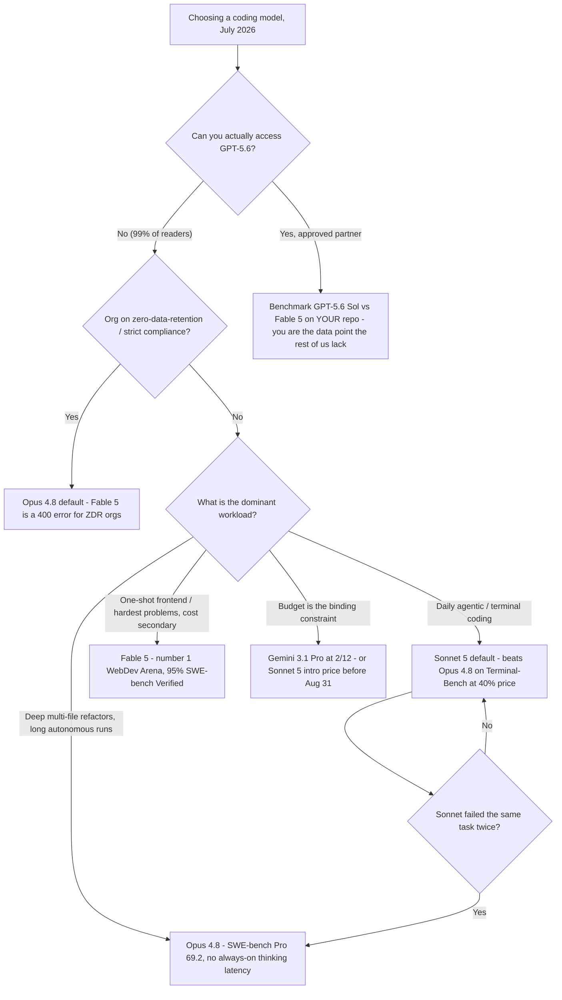
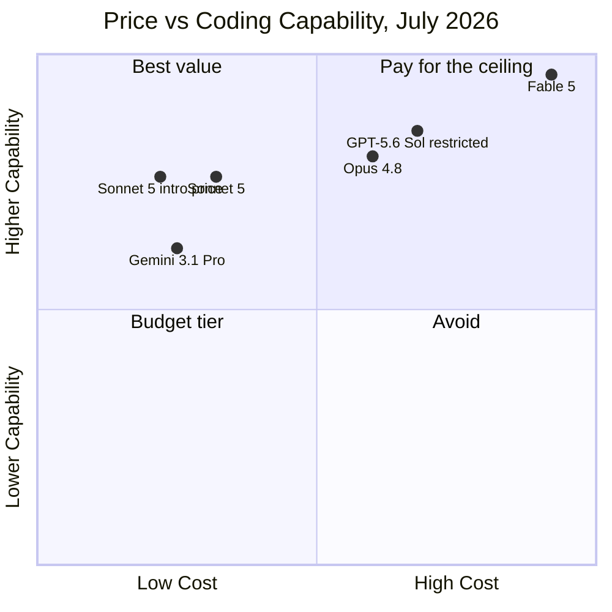

+++
date = '2026-07-07T11:00:00+08:00'
aliases = ['/posts/ai/2026-07-09-best-ai-coding-models-2026/']
draft = false
title = 'Best AI Coding Models 2026: Fable 5 vs Sonnet 5 vs GPT-5.6'
description = 'Sonnet 5 is the best AI coding model for most developers in 2026 — it beats Opus 4.8 on Terminal-Bench at 40% of the price. Fable 5 is the escalation tier.'
toc = true
tags = ['AI Coding Models', 'Claude', 'LLM Benchmarks', 'Model Comparison']
keywords = ['best ai coding model 2026', 'fable 5 vs gpt-5.6', 'claude sonnet 5 vs opus', 'best llm for coding', 'claude fable 5 benchmark', 'sonnet 5 pricing', 'is gpt-5.6 available']

[[params.faqItems]]
question = "What is the best AI coding model in 2026?"
answer = "For most developers: Claude Sonnet 5. It beats Opus 4.8 on Terminal-Bench 2.1 (80.4 vs 74.6) — the benchmark closest to real agentic coding — at roughly 40% of the price. Claude Fable 5 tops the raw leaderboards (95% SWE-bench Verified, #1 WebDev Arena) but only makes sense as an escalation tier."

[[params.faqItems]]
question = "Is Claude Sonnet 5 better than Opus 4.8 for coding?"
answer = "For agentic terminal work, yes — Sonnet 5 scores 80.4 vs Opus 4.8's 74.6 on Terminal-Bench 2.1. Opus 4.8 still leads on deep multi-file refactors (SWE-bench Pro 69.2 vs 63.2) and long-horizon autonomous runs."

[[params.faqItems]]
question = "Can I use GPT-5.6 right now?"
answer = "Almost certainly not. As of July 2026, GPT-5.6 (Sol, Terra, Luna) is a limited preview restricted to roughly 20 government-approved partner companies, available only through the OpenAI API and Codex — it is not in ChatGPT."

[[params.faqItems]]
question = "How much does Claude Fable 5 cost?"
answer = "$10 per million input tokens and $50 per million output tokens — 2x Opus 4.8 and 5x Sonnet 5's introductory pricing. Because thinking is always on, real output spend runs higher than the sticker suggests."

[[params.faqItems]]
question = "Why was Claude Fable 5 suspended in June 2026?"
answer = "Three days after its June 12 launch, the US Commerce Department ordered Anthropic to suspend all foreign-national access over cyber-capability concerns. The export controls were lifted on June 30 and the model returned to global availability in early July."
+++

Make Claude Sonnet 5 your default coding model — that's the answer. If you searched for the **best AI coding model 2026**, here it is in one line: Sonnet 5 beats the flagship Opus 4.8 head-to-head on Terminal-Bench 2.1, the benchmark closest to what a coding agent actually does all day, at 40% of the price — and just $2/$10 per million tokens through August 31. Keep Opus 4.8 as your escalation tier for reasoning-heavy refactors, save Fable 5 for the rare task where one run replaces a day of your work, and plan as though GPT-5.6 doesn't exist until the day you can create an API key for it.

That's the whole recommendation. Everything below is evidence and edge cases — but the obvious pushback deserves a straight answer first. Fable 5 scores 95% on SWE-bench Verified and leads WebDev Arena by the widest margin the arena has ever recorded, so why doesn't the strongest model win? Five reasons: benchmark fit, price, latency, compliance, and a regulatory episode that knocked it offline for two and a half weeks. This guide is built for scanning — grab the table and the decision tree in the next section, and stop reading the moment your case is covered.

## Best AI Coding Model 2026: The 30-Second Version

One row of this table describes you. Start there:

| Your situation | Use this | Why |
|---|---|---|
| Daily agentic / terminal coding (most readers) | **Sonnet 5** | Terminal-Bench 2.1: 80.4 vs Opus 4.8's 74.6, at 40% of the price |
| Deep multi-file refactors, long autonomous runs | **Opus 4.8** | SWE-bench Pro 69.2 vs Sonnet 5's 63.2 |
| One-shot frontend builds, hardest problems, cost secondary | **Fable 5** | 95% SWE-bench Verified; #1 WebDev Arena by 92 Elo |
| Zero-data-retention / strict compliance org | **Opus 4.8** | Fable 5 returns a 400 error on every ZDR request |
| Budget is the binding constraint | **Gemini 3.1 Pro** | $2/$12 with a legitimate 80.6% SWE-bench Verified |
| High-volume, low-stakes pipelines (tests, docstrings, lint) | **Haiku 4.5** | $1/$5; the capability delta on these tasks is roughly zero |

The same logic as a decision tree — screenshot this part if nothing else:

Three notes before you apply it. First, the "failed twice" gate is load-bearing: in my logs, roughly half of first-attempt failures on Sonnet 5 were prompt or context problems that would have failed identically on Opus 4.8 — escalating after one failure mostly burns the price difference for nothing. Two consecutive failures are the real signal that a task is reasoning-bound rather than execution-bound, which is exactly the regime where the Opus premium earns its keep. Second, the ZDR branch is a hard wall, not a preference; Fable 5 rejects every request from a zero-data-retention org with a 400, so for those teams the model question settles itself at Opus 4.8. Third, if you're choosing a harness as well as a model, know that the harness choice moves your results more than a one-tier model upgrade does — I've written that decision up separately in [Claude Code vs Cursor vs Windsurf](/posts/ai/2026-02-18-claude-code-vs-cursor-vs-windsurf-2026/).

## AI Coding Model Prices and Benchmarks, July 2026

Here's the full field as it stands this week, priced per million tokens:

| Model | Input / Output | Context | Coding headline | Availability |
|---|---|---|---|---|
| **Claude Fable 5** | $10 / $50 | 1M | 95% SWE-bench Verified, #1 WebDev Arena | Public again since early July (post export-control suspension) |
| **Claude Opus 4.8** | $5 / $25 | 1M | SWE-bench Pro 69.2, best long-horizon agentic runs | Public |
| **Claude Sonnet 5** | $3 / $15 (intro **$2 / $10** through Aug 31) | 1M | Terminal-Bench 2.1: 80.4 — beats Opus 4.8 | Public |
| **GPT-5.6 Sol** | $5 / $30 | — | Flagship of the Sol/Terra/Luna trio | ~20 government-approved partners only |
| **GPT-5.6 Terra / Luna** | ~$2.50 / $15 and $1 / $6 | — | Mid and budget tiers | Same restricted preview |
| **Gemini 3.1 Pro** | $2 / $12 | 1M | 80.6% SWE-bench Verified | Public |

Two takeaways from that chart. The best-value quadrant — high capability, low cost — belongs to Sonnet 5 alone, and the introductory pricing drags it even further left until August 31. And GPT-5.6 Sol's strong position is entirely theoretical: a model you can't call has zero effective capability, whatever the vendor slides say. More on that in a minute.

One footnote on the Sonnet 5 row: the regular price is $3/$15 once the intro window closes. Build long-term budgets on the regular rate and treat the intro pricing as a bonus, not the baseline.

## Why Sonnet 5 Is the Best Coding Model for Most Developers

One number should anchor your default choice: on [Terminal-Bench 2.1](https://llm-stats.com/blog/research/claude-sonnet-5-vs-claude-opus-4-8), **Sonnet 5 scores 80.4 to Opus 4.8's 74.6**. Read that again — it isn't "the cheaper model gets close." The mid-tier model beats the flagship outright, on the same harness, on the benchmark that looks most like a coding agent's actual workday: running shell commands, managing environments, recovering from errors, chaining multi-step terminal work. If you live in Claude Code, Cursor's agent mode, or any terminal-driven loop, Terminal-Bench predicts your experience far better than SWE-bench does.

The reversal has a mechanical explanation, not a mystical one. Deep-reasoning benchmarks like SWE-bench Pro reward long, patient thought about a gnarly multi-file patch — Opus 4.8 still clearly wins there, 69.2 to 63.2. Agentic terminal work rewards the opposite temperament: quick turns, disciplined tool use, no four-minute meditation on a `sed` command. Anthropic's own migration notes describe Sonnet 5 as "more agentic by default," quicker to reach for tools and self-verification loops. On the 80% of coding that is fundamentally plumbing, the flagship's extra reasoning depth is wasted — sometimes actively in the way. It's the same lesson from my [harness engineering experiments](/posts/ai/2026-02-19-claude-code-vs-codex/): a model's ceiling matters less than how well its default behavior fits the loop you run it in.

Three weeks of running Sonnet 5 as my Claude Code default match the numbers. Turns come back noticeably faster than on Opus 4.8, it goes to the terminal more willingly, and on routine work — write a migration, fix a failing test, wire up an endpoint — I genuinely can't tell its output from the flagship's. Where I can tell is exactly where the benchmarks predict: sprawling multi-file refactors, where Opus 4.8's deeper reasoning keeps it from painting itself into a corner.

As a team rule, it compresses to one line: Sonnet 5 by default, Opus 4.8 after two consecutive failures on the same task, Fable 5 only for jobs where one run plausibly replaces a day of work.

The mistake to avoid — I've made it myself — is reading a leaderboard as a shopping list sorted by "buy the top one you can afford." The correct read is: **match the benchmark to your workload, then buy the cheapest model that clears your bar.** For terminal-driven agentic coding in July 2026, that model is Sonnet 5, and once price enters the equation it isn't close.

One budget trap to price in before you commit: Sonnet 5 ships a new tokenizer that produces roughly **30% more tokens for the same text** than Sonnet 4.6. The per-token sticker held steady, but per-request cost on migrated workloads drifts up, and `max_tokens` limits tuned for 4.6 can silently truncate output. If you're on a subscription rather than the API, this mostly washes out — how the plans map to actual usage is in my [Claude pricing complete guide](/posts/ai/2026-04-03-claude-pricing-complete-guide/), and if you're wondering whether the free tier gets you anywhere at all, see [Claude free tier limits in 2026](/posts/ai/2026-07-08-claude-free-tier-limits/).

## Fable 5: The Benchmark King, With Two Asterisks

Credit where it's due, because the numbers are genuinely historic. Fable 5 hits [95% on SWE-bench Verified](https://www.vals.ai/benchmarks/swebench) — confirmed on vals.ai's independent leaderboard, not just Anthropic's launch deck. On [WebDev Arena](https://arena.ai/leaderboard/code/webdev/) it sits at #1 with 1653 Elo, 92 points clear of second place — the widest gap ever recorded there — and it tops every sub-leaderboard from React to data-viz. For one-shot frontend work, "hand it a design brief, get back a working page," nothing else is in its weight class. If a single Fable 5 run replaces a day of your work and someone else covers the token bill, use it without a second thought.

Now the asterisks.

**Asterisk one: vendor scaffolding.** The 80.3% SWE-bench Pro headline number came off Anthropic's own agentic scaffolding, and independent evaluators have [contested how much of it survives on a neutral harness](https://techjacksolutions.com/ai-brief/claude-fable-5s-swe-bench-pro-score-is-contested-what-indepe/). The 95% Verified figure holds up independently; read the Pro figure as "best case on the vendor's harness." When a launch deck and an independent leaderboard disagree, side with the leaderboard — every time.

**Asterisk two: regulatory risk, demonstrated rather than hypothetical.** Fable 5 launched June 12. Three days later, the US Commerce Department [ordered Anthropic to suspend access](https://www.anthropic.com/news/fable-mythos-access) for all foreign nationals — inside or outside the US — citing the model's demonstrated ability to discover vulnerabilities and autonomously compromise networked systems. It was effectively gone for two and a half weeks, until the [controls were lifted on June 30](https://www.cnbc.com/2026/06/30/anthropic-says-trump-admin-has-lifted-export-controls-on-claude-fable-5-and-mythos-5.html). Anyone who bet a production pipeline on it in week one spent late June doing an emergency migration. I don't expect a rerun soon, but the precedent now exists: a frontier model can be switched off by regulator directive on 72 hours' notice. That's a new line item in any serious selection rubric, and it structurally favors a boring, stable default with the flagship behind a config flag — not the other way around.

There are also everyday frictions the launch coverage skipped. Thinking is always on — you can't disable it, and single hard-task turns can run for minutes. API pricing at $10/$50 is 2x Opus and 5x Sonnet's intro rate. Mandatory 30-day data retention locks out zero-data-retention orgs with a flat 400 on every request. And security-adjacent work trips its cyber classifiers more often than on any previous Claude model. None of these kills it for the right task; together, they're the complete case against making it a default.

## GPT-5.6 and Gemini 3.1 Pro: The Rest of the Field

> **Update (July 9, 2026):** GPT-5.6 went GA two days after this post was published. The ~20-company government preview is over — Sol ($5/$30), Terra ($2.50/$15), and Luna ($1/$6) are now generally available in ChatGPT, the API, Codex, and the new ChatGPT Work. The section below is preserved as written pre-GA; my full read of the launch, including why the benchmark claims still deserve a discount, is in [GPT-5.6 Release: Pricing, ChatGPT Work, and the Codex Merger](/posts/ai/2026-07-10-gpt-5-6-general-availability/).

**GPT-5.6 is a launch you can't use.** OpenAI [previewed the Sol, Terra, and Luna trio on June 26](https://openai.com/index/previewing-gpt-5-6-sol/) — Sol at $5/$30 as the flagship, Terra at roughly half that, Luna at $1/$6 — then, [at the US government's request](https://techcrunch.com/2026/06/26/openai-limits-gpt-5-6-rollout-after-government-request-says-restrictions-shouldnt-be-the-norm/), restricted access to a preview of roughly 20 approved partner companies, API and Codex only, nothing in ChatGPT. OpenAI calls the restriction a "short-term step" that shouldn't become the norm; no public date exists. Which means every "Fable 5 vs GPT-5.6" comparison you've read pits a model you can buy against vendor-published numbers for a model you can't. My advice is dull and correct: leave GPT-5.6 out of your planning until the day you can create an API key for it, then rerun this comparison. If the government-preview pattern holds — both frontier labs have now been through it in a single month — expect a few weeks of partner exclusivity before public access.

**Gemini 3.1 Pro is the budget pick with a real argument.** At $2/$12 it undercuts even Sonnet 5's post-intro pricing, and 80.6% on SWE-bench Verified is a genuinely strong score — better than anything that existed six months ago. Where it loses to Sonnet 5, in my testing and in the agentic benchmarks alike, is tool-use discipline inside long agent loops: it's a strong answer engine and a middling terminal operator. If your workflow is chat-style coding assistance rather than autonomous agents, or the bill is your binding constraint, it's a defensible choice. And one data point to keep everyone humble: China's open-weight GLM-5.2 [overtook Fable 5 on Design Arena's HTML leaderboard](https://www.techradar.com/pro/chinas-answer-to-claudes-fable-5-comes-top-of-the-html-web-design-contest-as-the-ceo-tells-elon-musk-glm-will-reach-mythos-class-before-q1-2027) this month. Leaderboard positions in 2026 have a half-life measured in weeks — one more reason not to pay flagship prices for a lead that may not survive the quarter.

## When Not to Use a Flagship Coding Model

"When to use the expensive one" gets written about constantly; "when it actively hurts you" almost never. Skip Fable 5 — and often even Opus 4.8 — in these four situations:

**Interactive sessions where latency is the experience.** Fable 5's thinking can't be turned off, and hard-task turns run minutes. In a tight edit-run-fix loop, a model that answers in 15 seconds at 90% quality beats one that answers in 4 minutes at 97% — you'll iterate three times before the flagship finishes once.

**High-volume, low-difficulty pipelines.** Test generation, docstring backfills, lint-fix sweeps, commit-message drafting. The capability delta on these tasks is approximately zero and the cost delta is 5x. This is exactly what Haiku 4.5 ($1/$5) and Gemini 3.1 Pro exist for.

**Security and offensive-adjacent research.** Fable 5's cyber classifiers are the strictest Anthropic has shipped — they're literally what triggered the export-control episode. Benign pentesting tooling and CTF work trip refusals often enough that the flagship becomes a productivity downgrade in that domain. Use Opus 4.8.

**Anything where a two-week outage is unacceptable.** June proved that frontier-model availability now carries a regulatory failure mode. Production pipelines should default to a stable tier with the flagship behind a config flag, never the reverse.

The meta-point behind all four: the price-capability frontier in 2026 is convex. Each tier up costs roughly 2x and returns maybe 1.1–1.2x on typical work. The flagship premium only clears that bar on tasks at the edge of what's possible — a real and valuable category, but not your average Tuesday.

## The Bottom Line

Three sentences to leave with. Sonnet 5 is the best AI coding model for most developers in 2026, and its introductory pricing through August 31 makes this the single best month to standardize on it. Fable 5 is the genuine capability king — 95% SWE-bench Verified, an unprecedented WebDev Arena lead — but its price, latency, compliance requirements, and freshly demonstrated regulatory risk make it an escalation tier, not a default. And GPT-5.6 doesn't exist for you yet; revisit it when you can create an API key, not when the benchmark posts drop.

## Related Reading

- [Claude API Cost Calculator](/tools/claude-token-cost-calculator.html) — interactive per-call / monthly cost comparison across all current models
- [Claude Free Tier Limits in 2026: What You Actually Get](/posts/ai/2026-07-08-claude-free-tier-limits/)
- [Claude Pricing Complete Guide: API vs Pro vs Max](/posts/ai/2026-04-03-claude-pricing-complete-guide/)
- [Claude Code vs Codex: Which Agentic CLI Wins](/posts/ai/2026-02-19-claude-code-vs-codex/)
- [Claude Code vs Cursor vs Windsurf in 2026](/posts/ai/2026-02-18-claude-code-vs-cursor-vs-windsurf-2026/)
