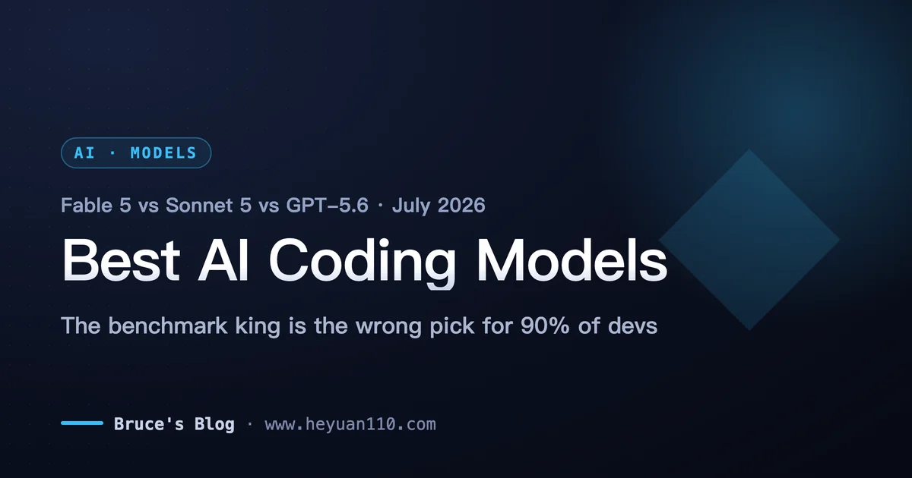
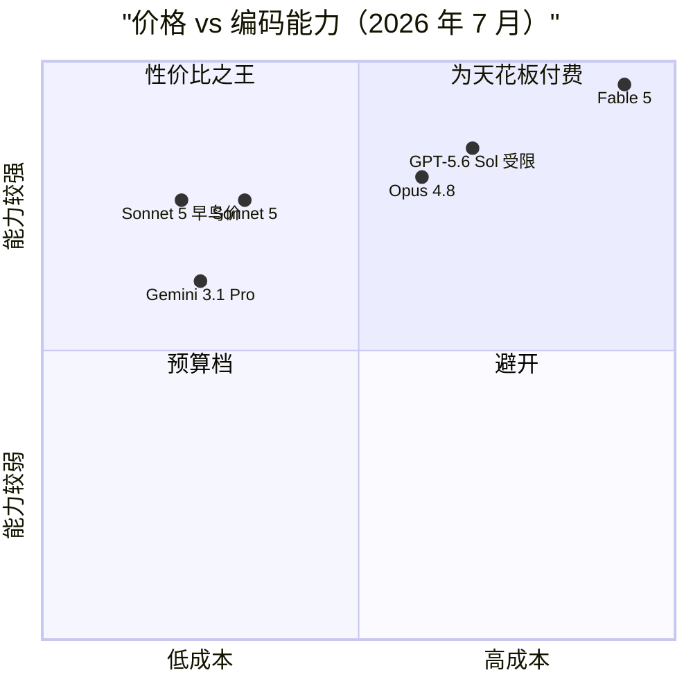
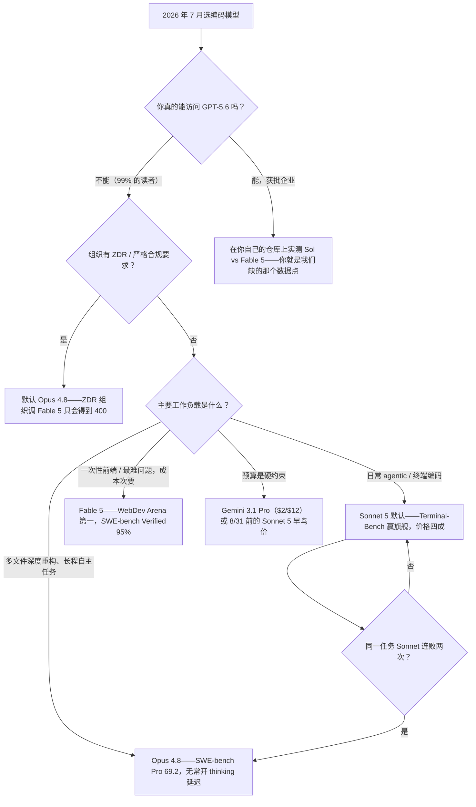

+++
date = '2026-07-07T11:00:00+08:00'
aliases = ['/posts/ai/2026-07-09-best-ai-coding-models-2026/']
draft = false
title = '2026 最强 AI 编码模型对比：Fable 5、Sonnet 5 还是 GPT-5.6？'
description = 'Fable 5 以 95% SWE-bench Verified 和 WebDev Arena 榜首成为 2026 最强编码模型，但 Sonnet 5 在 Terminal-Bench 上反超旗舰 Opus 4.8，价格只有四成。本文给出个人、团队、企业的模型选择决策树，以及什么场景千万别用旗舰。'
toc = true
tags = ['AI Coding Models', 'Claude', 'LLM Benchmarks', 'Model Comparison']
keywords = ['最强编码模型 2026', 'fable 5 对比', 'claude 模型选择', 'ai 编程模型推荐', 'sonnet 5 价格', 'fable 5 出口管制', 'gpt-5.6 什么时候能用']

[[params.faqItems]]
question = "2026 年最强的 AI 编码模型是哪个？"
answer = "看 benchmark 是 Claude Fable 5：SWE-bench Verified 95%、WebDev Arena 榜首。但对大多数开发者，实际最优解是 Sonnet 5——它在 Terminal-Bench 2.1 上反超旗舰 Opus 4.8，价格只有四成。"

[[params.faqItems]]
question = "写代码选 Sonnet 5 还是 Opus 4.8？"
answer = "日常 agentic 终端工作选 Sonnet 5（Terminal-Bench 2.1 得分 80.4 对 74.6，直接赢了旗舰）；跨大量文件的深度重构和长时间自主任务选 Opus 4.8（SWE-bench Pro 69.2 对 63.2）。"

[[params.faqItems]]
question = "GPT-5.6 现在能用吗？"
answer = "基本不能。截至 2026 年 7 月，GPT-5.6（Sol/Terra/Luna）只对约 20 家政府批准的合作企业开放受限预览，且仅限 API 和 Codex，ChatGPT 里都没有。对普通开发者来说它暂时不存在。"

[[params.faqItems]]
question = "Claude Fable 5 多少钱？"
answer = "API 价格每百万 token 输入 $10、输出 $50，是 Opus 4.8 的 2 倍、Sonnet 5 introductory 价的 5 倍。而且它的 thinking 无法关闭，实际输出开销比价目表看起来更高。"

[[params.faqItems]]
question = "Fable 5 六月为什么被停用？"
answer = "6 月 12 日发布仅三天后，美国商务部以网络安全能力为由下达出口管制指令，要求 Anthropic 暂停所有外国用户访问。管制于 6 月 30 日解除，7 月初恢复全球可用。"
+++

2026 年最强的 AI 编码模型，发布三天就被美国政府下架了；呼声最高的挑战者 GPT-5.6"发布"了但你根本用不上；而在最贴近日常编码工作的那个 benchmark 上悄悄赢了旗舰的，是一个价格只有四成的中端模型。如果你搜"**最强编码模型 2026**"是想要一个排行榜答案，这篇文章要告诉你的恰恰是：排行榜答案是错的——以及你的配置文件里到底该填哪个模型。

先把立场亮出来：**Fable 5 是今天你能买到的最强编码模型，但大多数开发者不应该买它。** 对九成的编码工作，正确的默认选择是 introductory 价格期内的 Claude Sonnet 5，Opus 4.8 做升级档位。GPT-5.6 目前对你来说不是一个真实选项，无论发布会讲得多热闹。下面是证据。

## 2026 年 7 月编码模型全景（含价格）

先看牌桌上的实际情况，价格均为每百万 token：

| 模型 | 输入 / 输出 | 上下文 | 编码亮点 | 可用性 |
|---|---|---|---|---|
| **Claude Fable 5** | $10 / $50 | 1M | SWE-bench Verified 95%、WebDev Arena 第一 | 7 月初恢复公开（此前被出口管制停用两周半） |
| **Claude Opus 4.8** | $5 / $25 | 1M | SWE-bench Pro 69.2，长程自主任务最稳 | 公开 |
| **Claude Sonnet 5** | $3 / $15（8 月 31 日前 **$2 / $10**） | 1M | Terminal-Bench 2.1 得 80.4，反超 Opus 4.8 | 公开 |
| **GPT-5.6 Sol** | $5 / $30 | — | Sol/Terra/Luna 三件套旗舰 | 仅约 20 家政府批准企业 |
| **GPT-5.6 Terra / Luna** | 约 $2.5 / $15 和 $1 / $6 | — | 中端和低价档 | 同样受限 |
| **Gemini 3.1 Pro** | $2 / $12 | 1M | SWE-bench Verified 80.6% | 公开 |

这张象限图有两个信息量最大的点。第一，左上角"高能力低成本"的区域被 Sonnet 5 独占，8 月 31 日前的 introductory 价格还在把它往更左边推。第二，GPT-5.6 Sol 纸面位置不错——但"纸面"两个字在这里承担了全部重量：一个你调不通的模型，有效能力就是零。后面细说。

## 为什么榜一不是你该用的那个

这一代模型里信息量最大、却被大多数报道埋掉的一个数字是：在 [Terminal-Bench 2.1](https://llm-stats.com/blog/research/claude-sonnet-5-vs-claude-opus-4-8) 上，**Sonnet 5 拿了 80.4，旗舰 Opus 4.8 只有 74.6**。注意，这不是"便宜模型缩小了差距"，而是中端模型在同一测试框架下正面赢了旗舰。而 Terminal-Bench 测的恰恰是编码 agent 每天真正在干的事：跑 shell 命令、管理环境、从报错里恢复、串联多步终端操作。如果你用 Claude Code、Cursor 的 agent 模式或任何终端驱动的工作流，Terminal-Bench 对你体验的预测力远高于 SWE-bench。

为什么会出现中端反超？因为 SWE-bench Pro 这类深度推理测试奖励的是"对着一个棘手的多文件补丁苦想"——这方面 Opus 4.8 依然明显领先（69.2 对 63.2）。但 agentic 终端工作奖励的是另一种性格：回合快、工具用得果断、不对一条 `sed` 命令过度思考。Anthropic 自己的迁移文档也写了，Sonnet 5"默认更 agentic"，更愿意主动调工具、跑自检循环。旗舰多出来的那截推理深度，在占编码工作八成的"管道活"上是浪费的，有时甚至是负资产。这和我在 [Claude Code vs Codex](/posts/ai/2026-02-19-claude-code-vs-codex/) 那篇里反复撞见的结论是同一个：模型的能力天花板，不如它的默认行为跟你工作循环的匹配度重要。

我在 Reddit、在各种团队群、在我自己过去的行为里反复看到同一个错误：把 benchmark 排行榜当成"买得起就买榜一"的购物清单。正确的读法是：**先找到跟你工作负载对应的那个 benchmark，然后买过线模型里最便宜的那个。** 2026 年 7 月，对终端驱动的 agentic 编码，这个模型就是 Sonnet 5——把价格放进等式之后，甚至不接近。

## Fable 5：戴着两个星号的榜一

先公平地说旗舰，因为数字确实是历史级的。Fable 5 在 [SWE-bench Verified 上拿到 95%](https://www.vals.ai/benchmarks/swebench)——这是 vals.ai 独立榜单确认的，不是发布会 PPT。在 [WebDev Arena](https://arena.ai/leaderboard/code/webdev/) 上它以 1653 Elo 排第一，领先第二名 92 分，是这个竞技场有史以来最大的分差，而且从 React 到数据可视化的每个子榜都是第一。一句话：一次性前端生成——"给一份设计稿描述，直接吐一个能跑的页面"——目前没有对手。如果一次 Fable 5 运行能顶你一天的工作、而且 token 账单是老板出，放心用。

然后是星号。**星号一：厂商脚手架问题。** 发布时那个 80.3% 的 SWE-bench Pro 头条数字，是用 Anthropic 自家的 agentic 脚手架跑出来的，独立评测方[对中立框架下能剩多少存疑](https://techjacksolutions.com/ai-brief/claude-fable-5s-swe-bench-pro-score-is-contested-what-indepe/)。95% 那个 Verified 分数经得起独立验证，Pro 分数则应该读作"厂商 harness 下的最好情况"。一条通用原则：发布数字和独立榜单打架时，信独立榜单。

**星号二：运营风险，而且不是假设。** Fable 5 于 6 月 12 日发布，三天后美国商务部[下令 Anthropic 暂停所有外国用户的访问](https://www.anthropic.com/news/fable-mythos-access)——无论人在美国境内还是境外——理由是该模型展示出的漏洞发现和自主入侵联网系统的能力。模型实际消失了两周半，直到 [6 月 30 日管制解除](https://www.cnbc.com/2026/06/30/anthropic-says-trump-admin-has-lifted-export-controls-on-claude-fable-5-and-mythos-5.html)。如果你在发布第一周就把生产管线押在 Fable 5 上，那你六月下半月就是在做紧急模型迁移。我不认为这事很快重演，但先例已经立在那里了：一个前沿模型可以在 72 小时通知内被监管指令关停。这是模型选型评分表上的一个新条目，而且它在结构上支持一种策略——默认档位放在无聊但稳定的层级，把旗舰做成一个可随时替换的增强项，而不是反过来。

还有几个发布报道跳过的日常摩擦：thinking 无法关闭（难题单回合能跑好几分钟）；API 价 $10/$50 是 Opus 的 2 倍、Sonnet introductory 价的 5 倍；Fable 5 强制要求 30 天数据保留——签了零数据保留（ZDR）协议的组织，每个请求都会直接吃 400 错误。安全相关的工作也比以往任何 Claude 模型更容易触发它的 cyber 分类器拒答。这些单独看都不致命，合起来就是"它不适合当默认模型"的完整理由。

## Sonnet 5：大多数人的正确答案

把我的实际建议说白：**今天就把 Sonnet 5 设成你的默认编码模型，9 月 1 日 introductory 价结束时再重新评估一次。** 8 月 31 日前，Sonnet 5 是 $2/$10 每百万 token——Fable 5 的五分之一、Opus 4.8 的四成——同时在最贴近交互式编码 agent 工作的 benchmark 上赢了后者。我把它当 Claude Code 默认模型跑了三周，主观体验和数字对得上：回合明显比 Opus 4.8 快，更愿意主动下终端，在写迁移脚本、修挂掉的测试、接一个 endpoint 这类日常任务上，我真的分不出它和旗舰的输出差别。能分出差别的场景恰好就是 benchmark 预测的那些：铺开一大片文件的深度重构，Opus 4.8 更深的推理让它不容易把自己写进死胡同。

由此得出我会给任何团队的升级规则：**默认 Sonnet 5；同一个任务 Sonnet 连败两次再升 Opus 4.8；Fable 5 只留给"一次运行可能顶一天工作量"的任务。** "连败两次"这个门槛比看起来重要：第一次失败里有相当比例是 prompt 或上下文的问题，换 Opus 也一样败，第一败就升级纯属把差价烧掉。两连败才说明任务是推理受限而不是执行受限——那正是 Opus 溢价能赚回来的区间。

有一个坑要在做预算前先算进去：Sonnet 5 换了新 tokenizer，同样的文本会产生**约 30% 更多的 token**。单价没变，但迁移过来的工作负载单请求成本会往上飘，按 Sonnet 4.6 调好的 `max_tokens` 还可能悄悄截断输出。如果你走订阅而不是 API，这事基本不影响你——各档订阅怎么换算成实际用量，我在 [Claude 价格完全指南](/posts/ai/2026-04-03-claude-pricing-complete-guide/)里拆过；想先白嫖试试水的，可以看[2026 年 Claude 免费额度实测](/posts/ai/2026-07-08-claude-free-tier-limits/)。

## GPT-5.6 和 Gemini 3：牌桌上的其他人

**GPT-5.6 是今年最诡异的发布：一场你用不上的发布。** OpenAI 在 [6 月 26 日预览了 Sol、Terra、Luna 三件套](https://openai.com/index/previewing-gpt-5-6-sol/)——旗舰 Sol $5/$30，Terra 约半价，Luna $1/$6——然后[应美国政府要求](https://techcrunch.com/2026/06/26/openai-limits-gpt-5-6-rollout-after-government-request-says-restrictions-shouldnt-be-the-norm/)把访问限制在约 20 家获批合作企业的预览里，仅限 API 和 Codex，ChatGPT 里连影子都没有。OpenAI 称限制是"短期措施"、不应成为常态，但没有任何公开时间表。所以你读到的每一篇"Fable 5 对比 GPT-5.6"，本质上都是拿一个买得到的模型去比一个买不到的模型的厂商自报数字。我的建议无聊但正确：在你能给 GPT-5.6 创建 API key 的那天之前，把它从你的选型里划掉；到那天再重跑一遍这个对比。参考两家前沿实验室一个月内先后经历的"政府预览"模式，公开访问大概率是几周量级的事。

**Gemini 3.1 Pro 是有真实论据的预算之选。** $2/$12 比 Sonnet 5 恢复原价后还便宜，SWE-bench Verified 80.6% 放在半年前就是全场最强。它输给 Sonnet 5 的地方——我的实测和 agentic 类 benchmark 一致——是长 agent 循环里的工具使用纪律：它是个很强的问答引擎，但只是个中游的终端操作员。如果你的工作流是对话式编码辅助而非自主 agent，或者账单就是你的硬约束，它站得住。再补一个让所有人保持谦卑的数据点：中国的开源权重模型 GLM-5.2 本月[在 Design Arena 的 HTML 榜上反超了 Fable 5](https://www.techradar.com/pro/chinas-answer-to-claudes-fable-5-comes-top-of-the-html-web-design-contest-as-the-ceo-tells-elon-musk-glm-will-reach-mythos-class-before-q1-2027)。2026 年的榜单排名，半衰期以周计——这也是别为一个可能撑不过这个季度的领先优势支付旗舰溢价的又一条理由。

## 选型决策树：直接抄作业

整篇文章压缩成一棵决策树，只截一张图的话截这里：

几条落地注意事项。"连败两次"的门槛前面说过，不再重复。ZDR 那个分支是硬约束不是偏好——Fable 5 对零数据保留组织直接拒绝服务，这类团队的"最强模型"问题在 Opus 4.8 处自动收敛。另外，如果你同时在选 harness 而不只是模型，那是另一个维度的决策，我在 [Claude Code vs Cursor vs Windsurf](/posts/ai/2026-02-18-claude-code-vs-cursor-vs-windsurf-2026/) 里写过——一句话结论：2026 年，harness 的选择对结果的影响大于模型升一档。

## 什么场景别碰旗舰

"什么时候该用贵的"人人都写，"什么时候贵的反而害你"几乎没人写。以下场景别用 Fable 5——很多时候连 Opus 4.8 都别用：

**延迟即体验的交互式编码。** Fable 5 的 thinking 关不掉，难题单回合以分钟计。在"改—跑—修"的紧循环里，15 秒给你 90 分答案的模型，胜过 4 分钟给你 97 分的——旗舰答一轮的时间你已经迭代三轮了。

**高频低难度的流水线任务。** 批量生成测试、补 docstring、lint 修复、写 commit message。这类任务上旗舰和中端的能力差约等于零，成本差是 5 倍。Haiku 4.5（$1/$5）和 Gemini 3.1 Pro 就是为这个存在的。

**安全和攻防相关的研究。** Fable 5 的 cyber 分类器是 Anthropic 出过的最严的一版——出口管制那出戏就是它引发的。正常的渗透测试工具、CTF 相关工作触发拒答的频率高到影响效率。这个领域用 Opus 4.8。

**任何不能接受两周停服的场景。** 六月已经证明，前沿模型的可用性多了一种监管性故障模式。生产管线的正确姿势是默认稳定档、旗舰藏在配置开关后面，而不是反过来。

一个元结论：2026 年的价格-能力曲线是凸的——每往上一档，成本约 2 倍，日常任务上的回报大约 1.1 到 1.2 倍。旗舰溢价只在"能力边界上的任务"里划算。那是一个真实且有价值的类别，但它不是你的每个周二。

## 一句话总结

只记三句话的话：Sonnet 5 是 2026 年大多数开发者的最优编码模型，8 月 31 日前的 introductory 价让这个月成为切换的最佳时机；Fable 5 是货真价实的能力之王，但价格、延迟、合规要求和刚刚上演过的监管风险决定了它是升级档而不是默认档；GPT-5.6 目前对你不存在，等它公开发售那天再回来重读这篇对比。

## 相关阅读

- [Claude API 成本计算器](/tools/claude-token-cost-calculator.html) — 按你的用量实时对比各模型每次调用/每月成本
- [2026 年 Claude 免费额度实测：免费版到底能干什么](/posts/ai/2026-07-08-claude-free-tier-limits/)
- [Claude 价格完全指南：API、Pro、Max 怎么选](/posts/ai/2026-04-03-claude-pricing-complete-guide/)
- [Claude Code vs Codex：两大 agentic CLI 对决](/posts/ai/2026-02-19-claude-code-vs-codex/)
- [Claude Code vs Cursor vs Windsurf：2026 终极对比](/posts/ai/2026-02-18-claude-code-vs-cursor-vs-windsurf-2026/)
