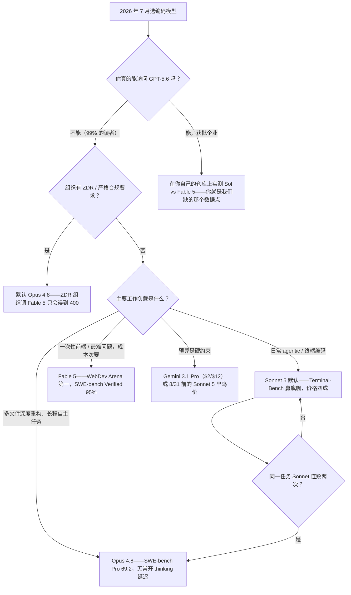
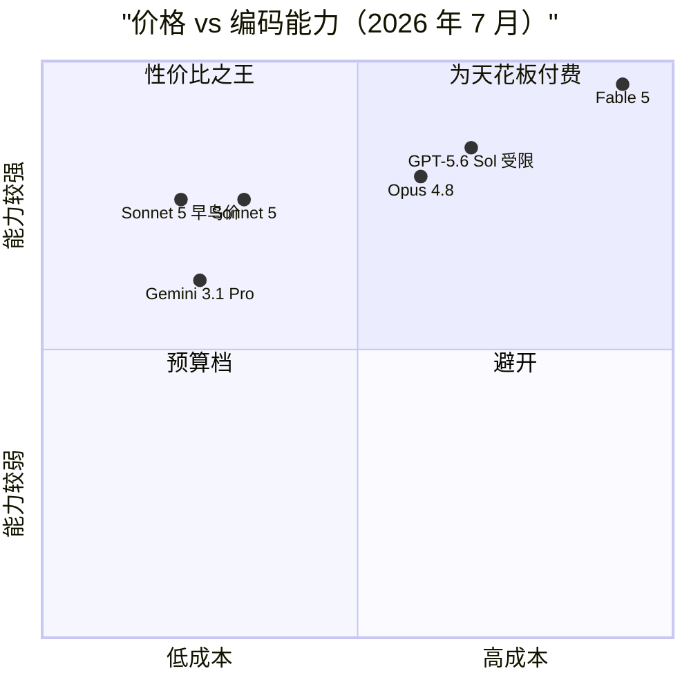

+++
date = '2026-07-07T11:00:00+08:00'
aliases = ['/posts/ai/2026-07-09-best-ai-coding-models-2026/']
draft = false
title = '2026 最强 AI 编码模型对比：Fable 5、Sonnet 5 还是 GPT-5.6？'
description = '2026 年写代码选哪个模型？直接答案：大多数人选 Sonnet 5——Terminal-Bench 反超旗舰 Opus 4.8，价格只有四成；Fable 5 留给一次顶一天工作量的任务。附选型决策树与价格速查表。'
toc = true
tags = ['AI Coding Models', 'Claude', 'LLM Benchmarks', 'Model Comparison']
keywords = ['最强编码模型 2026', 'fable 5 对比', 'claude 模型选择', 'ai 编程模型推荐', 'sonnet 5 价格', 'fable 5 出口管制', 'gpt-5.6 什么时候能用']

[[params.faqItems]]
question = "2026 年最强的 AI 编码模型是哪个？"
answer = "对大多数开发者，答案是 Claude Sonnet 5：它在 Terminal-Bench 2.1 上以 80.4 对 74.6 反超旗舰 Opus 4.8，价格只有四成。纯看榜单最强的是 Fable 5（SWE-bench Verified 95%、WebDev Arena 榜首），但它只适合当升级档，不适合当默认。"

[[params.faqItems]]
question = "写代码选 Sonnet 5 还是 Opus 4.8？"
answer = "日常 agentic 终端工作选 Sonnet 5（Terminal-Bench 2.1 得分 80.4 对 74.6，直接赢了旗舰）；跨大量文件的深度重构和长时间自主任务选 Opus 4.8（SWE-bench Pro 69.2 对 63.2）。"

[[params.faqItems]]
question = "GPT-5.6 现在能用吗？"
answer = "基本不能。截至 2026 年 7 月，GPT-5.6（Sol/Terra/Luna）只对约 20 家政府批准的合作企业开放受限预览，且仅限 API 和 Codex，ChatGPT 里都没有。对普通开发者来说它暂时不存在。"

[[params.faqItems]]
question = "Claude Fable 5 多少钱？"
answer = "API 价格每百万 token 输入 $10、输出 $50，是 Opus 4.8 的 2 倍、Sonnet 5 introductory 价的 5 倍。而且它的 thinking 无法关闭，实际输出开销比价目表看起来更高。"

[[params.faqItems]]
question = "Fable 5 六月为什么被停用？"
answer = "6 月 12 日发布仅三天后，美国商务部以网络安全能力为由下达出口管制指令，要求 Anthropic 暂停所有外国用户访问。管制于 6 月 30 日解除，7 月初恢复全球可用。"
+++

先给答案：默认编码模型设成 Claude Sonnet 5。如果你搜"**最强编码模型 2026**"是想知道该往配置文件里填哪个名字，一句话版本是——Sonnet 5 在最贴近编码 agent 日常工作的 Terminal-Bench 2.1 上正面赢了旗舰 Opus 4.8，价格只有四成，8 月 31 日前更是只要 $2/$10 每百万 token。Opus 4.8 留作推理密集型重构的升级档，Fable 5 只用在"一次运行顶一天工作量"的任务上，GPT-5.6 则在你能创建 API key 之前当它不存在。

建议到此讲完了，剩下的全是证据和边界条件。但有个明显的反问必须先接住：Fable 5 在 SWE-bench Verified 上拿了 95%，WebDev Arena 领先幅度创了历史纪录，为什么最强的模型反而不是答案？五个原因——benchmark 匹配度、价格、延迟、合规，外加一场让它下线两周半的监管风波。这篇按速查结构组织，下一节的表格和决策树先拿走，查到你自己的情况就可以关页面了。

## 2026 编码模型选型：30 秒速查版

这张表里总有一行是你，从这里开始。表格给结论，正文给论证和数字出处——哪一行不放心，翻到对应章节看证据就行：

| 你的情况 | 选它 | 理由 |
|---|---|---|
| 日常 agentic / 终端编码（大多数读者） | **Sonnet 5** | Terminal-Bench 2.1 得 80.4，赢 Opus 4.8 的 74.6，价格四成 |
| 多文件深度重构、长程自主任务 | **Opus 4.8** | SWE-bench Pro 69.2 对 Sonnet 5 的 63.2 |
| 一次性前端生成、最难的问题、成本次要 | **Fable 5** | SWE-bench Verified 95%，WebDev Arena 领先 92 Elo |
| 组织有零数据保留（ZDR）/ 严格合规要求 | **Opus 4.8** | Fable 5 对 ZDR 组织的每个请求都返回 400 |
| 预算是硬约束 | **Gemini 3.1 Pro** | $2/$12，SWE-bench Verified 80.6% 货真价实 |
| 高频低难度流水线（测试、docstring、lint） | **Haiku 4.5** | $1/$5，这类任务上能力差距约等于零 |

同一套逻辑画成决策树，只截一张图的话截这里：

用之前有三条注意事项。第一，"连败两次"这个门槛是承重墙：我自己的日志里，Sonnet 5 第一次失败的案例约有一半是 prompt 或上下文的问题，换 Opus 照样败——第一败就升级，基本是白烧差价。两连败才是任务"推理受限"而非"执行受限"的真信号，那正是 Opus 溢价能赚回来的区间。

第二，ZDR 那个分支是硬墙不是偏好。Fable 5 对零数据保留组织直接拒绝服务，这类团队的选型问题在 Opus 4.8 处自动收敛，没得谈。

第三，如果你同时在选 harness 而不只是模型，先知道一个结论：2026 年 harness 的选择对结果的影响，大于模型升一档。这个维度我在 [Claude Code vs Cursor vs Windsurf](/zh/posts/ai/2026-02-18-claude-code-vs-cursor-vs-windsurf-2026/) 里单独拆过。

## 2026 年 7 月全场价格与 benchmark 一览

牌桌上的完整阵容，价格均为每百万 token：

| 模型 | 输入 / 输出 | 上下文 | 编码亮点 | 可用性 |
|---|---|---|---|---|
| **Claude Fable 5** | $10 / $50 | 1M | SWE-bench Verified 95%、WebDev Arena 第一 | 7 月初恢复公开（此前被出口管制停用两周半） |
| **Claude Opus 4.8** | $5 / $25 | 1M | SWE-bench Pro 69.2，长程自主任务最稳 | 公开 |
| **Claude Sonnet 5** | $3 / $15（8 月 31 日前 **$2 / $10**） | 1M | Terminal-Bench 2.1 得 80.4，反超 Opus 4.8 | 公开 |
| **GPT-5.6 Sol** | $5 / $30 | — | Sol/Terra/Luna 三件套旗舰 | 仅约 20 家政府批准企业 |
| **GPT-5.6 Terra / Luna** | 约 $2.5 / $15 和 $1 / $6 | — | 中端和低价档 | 同样受限 |
| **Gemini 3.1 Pro** | $2 / $12 | 1M | SWE-bench Verified 80.6% | 公开 |

象限图读出两件事。"高能力低成本"的黄金区域被 Sonnet 5 一家独占，8 月 31 日前的 introductory 价还在把它往更左推。而 GPT-5.6 Sol 的漂亮站位纯属纸面数据——一个你调不通的模型，有效能力就是零，厂商 PPT 说什么都没用。下文细说。

顺带提醒表里 Sonnet 5 那行的括号：恢复原价后是 $3/$15。做长期预算按原价算，早鸟价当成额外折扣，别反过来。

## 为什么大多数人的最优解是 Sonnet 5

一个数字就够你定默认模型了：在 [Terminal-Bench 2.1](https://llm-stats.com/blog/research/claude-sonnet-5-vs-claude-opus-4-8) 上，**Sonnet 5 拿 80.4，Opus 4.8 只有 74.6**。注意读法——这不是"便宜模型追近了差距"，而是中端模型在同一测试框架下正面击败旗舰。而 Terminal-Bench 测的恰恰是编码 agent 每天真正在干的事：跑 shell 命令、管理环境、从报错里恢复、串联多步终端操作。用 Claude Code、Cursor agent 模式或任何终端驱动工作流的人，看 Terminal-Bench 比看 SWE-bench 准得多。

反超有明确的机制解释，不玄学。SWE-bench Pro 这类深度推理测试，奖励的是对着棘手的多文件补丁慢慢苦想——这方面 Opus 4.8 依然明显领先，69.2 对 63.2。但 agentic 终端工作奖励另一种性格：回合快、工具用得果断、不对一条 `sed` 命令冥想四分钟。

Anthropic 自己的迁移文档也写了，Sonnet 5"默认更 agentic"，更愿意主动调工具、跑自检循环。编码工作里八成本质上是管道活，旗舰多出来的推理深度在这上面是浪费，有时甚至碍事。这和我在 [Claude Code vs Codex](/zh/posts/ai/2026-02-19-claude-code-vs-codex/) 那篇反复撞见的结论是同一个：模型的能力天花板，不如它的默认行为跟你工作循环的匹配度重要。

我把 Sonnet 5 当 Claude Code 默认模型跑了三周，体感和数字对得上。回合明显比 Opus 4.8 快，更愿意主动下终端；写迁移脚本、修挂掉的测试、接一个 endpoint 这类日常活，我真分不出它和旗舰的输出差别。能分出差别的场景恰好就是 benchmark 预测的那些——铺开一大片文件的深度重构，Opus 4.8 更深的推理让它不容易把自己写进死胡同。

落成团队规则就是一句话：默认 Sonnet 5，同一任务连败两次升 Opus 4.8，Fable 5 只接"一次运行顶一天工作量"的活。

要避开的错误读法我自己也犯过：把排行榜当成"买得起就买榜一"的购物清单。正确读法是**先找到跟你工作负载对应的 benchmark，再买过线模型里最便宜的那个**。2026 年 7 月，对终端驱动的 agentic 编码，这个模型就是 Sonnet 5——把价格放进等式后甚至不接近。

做预算前还有一个坑要先算进去：Sonnet 5 换了新 tokenizer，同样的文本会多产生**约 30% 的 token**。单价没动，但迁移过来的负载单请求成本会往上飘，按 Sonnet 4.6 调好的 `max_tokens` 还可能悄悄截断输出。走订阅而非 API 的人基本不受影响——各档订阅怎么换算成实际用量，我在 [Claude 价格完全指南](/zh/posts/ai/2026-04-03-claude-pricing-complete-guide/)里拆过；想先白嫖试水的看[2026 年 Claude 免费额度实测](/zh/posts/ai/2026-07-08-claude-free-tier-limits/)。

## Fable 5：戴着两个星号的榜一

先把功劳记足，数字确实是历史级的。Fable 5 在 [SWE-bench Verified 上拿到 95%](https://www.vals.ai/benchmarks/swebench)——vals.ai 独立榜单确认过，不是发布会 PPT。在 [WebDev Arena](https://arena.ai/leaderboard/code/webdev/) 上它以 1653 Elo 排第一，领先第二名 92 分，是这个竞技场开榜以来最大分差，从 React 到数据可视化的每个子榜全是第一。

一次性前端生成——"给一份设计稿描述，直接吐一个能跑的页面"——目前没有对手。如果一次运行能顶你一天的工作、token 账单还是老板出，放心用。

然后是星号。

**星号一：厂商脚手架问题**。发布时那个 80.3% 的 SWE-bench Pro 头条数字，是用 Anthropic 自家 agentic 脚手架跑出来的，独立评测方[对中立框架下能剩多少存疑](https://techjacksolutions.com/ai-brief/claude-fable-5s-swe-bench-pro-score-is-contested-what-indepe/)。95% 的 Verified 分数经得起独立验证，Pro 分数则该读作"厂商 harness 下的最好情况"。通用原则：发布数字和独立榜单打架，永远信独立榜单。

**星号二：监管风险，已经上演过，不是假设**。Fable 5 于 6 月 12 日发布，三天后美国商务部[下令 Anthropic 暂停所有外国用户访问](https://www.anthropic.com/news/fable-mythos-access)——不分境内境外——理由是该模型展示出的漏洞发现和自主入侵联网系统的能力。模型实际消失了两周半，直到 [6 月 30 日管制解除](https://www.cnbc.com/2026/06/30/anthropic-says-trump-admin-has-lifted-export-controls-on-claude-fable-5-and-mythos-5.html)。

发布第一周就把生产管线押上去的人，六月下半月全在做紧急迁移。我不认为这事很快重演，但先例已立：一个前沿模型可以在 72 小时通知内被监管指令关停。选型评分表从此多了一个条目，而且它在结构上支持一种策略——默认档放无聊但稳定的层级，旗舰藏在配置开关后面，而不是反过来。

还有几个发布报道跳过的日常摩擦。Thinking 关不掉，难题单回合能跑好几分钟；API 价 $10/$50 是 Opus 的 2 倍、Sonnet introductory 价的 5 倍；强制 30 天数据保留，把 ZDR 组织直接挡在门外（每个请求都吃 400）；安全相关工作触发 cyber 分类器拒答的频率也是历代 Claude 之最。单独看都不致命，合起来就是"别拿它当默认"的完整理由。

## GPT-5.6 和 Gemini 3.1 Pro：牌桌上的其他人

> **更新（2026 年 7 月 9 日）**：本文发布两天后，GPT-5.6 正式全量开放。"约 20 家政府批准企业"的预览限制已解除——Sol（$5/$30）、Terra（$2.50/$15）、Luna（$1/$6）现已登陆 ChatGPT、API、Codex 和全新的 ChatGPT Work。下面这一节保留 GA 前的原文框架不动；关于这次发布的完整解读（包括为什么跑分依然要打折听），见新文[《GPT-5.6 正式发布：三档价格、Codex 并入 ChatGPT Work 全解读》](/zh/posts/ai/2026-07-10-gpt-5-6-general-availability/)。

**GPT-5.6 是一场你用不上的发布**。OpenAI 在 [6 月 26 日预览了 Sol、Terra、Luna 三件套](https://openai.com/index/previewing-gpt-5-6-sol/)——旗舰 Sol $5/$30，Terra 约半价，Luna $1/$6——然后[应美国政府要求](https://techcrunch.com/2026/06/26/openai-limits-gpt-5-6-rollout-after-government-request-says-restrictions-shouldnt-be-the-norm/)把访问限制在约 20 家获批企业的预览里，仅限 API 和 Codex，ChatGPT 里连影子都没有。OpenAI 称限制是"短期措施"、不应成为常态，但没有公开时间表。

这意味着你读到的每篇"Fable 5 对比 GPT-5.6"，都是拿一个买得到的模型，去比一个买不到的模型的厂商自报数字。我的建议无聊但正确：在能给 GPT-5.6 创建 API key 那天之前，把它从选型里划掉，到那天再重跑一遍这个对比。参考两家前沿实验室一个月内先后经历的"政府预览"模式，公开访问大概率是几周量级的事。

**Gemini 3.1 Pro 是有真实论据的预算之选**。$2/$12 比 Sonnet 5 恢复原价后还便宜，SWE-bench Verified 80.6% 放在半年前就是全场最强。它输给 Sonnet 5 的地方——我的实测和 agentic 类 benchmark 一致——是长 agent 循环里的工具使用纪律：它是个很强的问答引擎，但只是个中游的终端操作员。对话式编码辅助为主、或者账单就是硬约束的人，选它站得住。

再补一个让所有人保持谦卑的数据点：中国的开源权重模型 GLM-5.2 本月[在 Design Arena 的 HTML 榜上反超了 Fable 5](https://www.techradar.com/pro/chinas-answer-to-claudes-fable-5-comes-top-of-the-html-web-design-contest-as-the-ceo-tells-elon-musk-glm-will-reach-mythos-class-before-q1-2027)。2026 年的榜单排名半衰期以周计——这也是别为一个可能撑不过本季度的领先优势付旗舰溢价的又一条理由。

## 什么场景别碰旗舰

"什么时候该用贵的"人人都写，"什么时候贵的反而害你"几乎没人写。以下四种场景别用 Fable 5，很多时候连 Opus 4.8 都别用：

**延迟即体验的交互式编码**。Fable 5 的 thinking 关不掉，难题单回合以分钟计。在"改—跑—修"的紧循环里，15 秒给你 90 分答案的模型胜过 4 分钟给 97 分的——旗舰答一轮的时间你已经迭代三轮了。

**高频低难度的流水线任务**。批量生成测试、补 docstring、lint 修复、写 commit message。这类任务上旗舰和中端的能力差约等于零，成本差是 5 倍。Haiku 4.5（$1/$5）和 Gemini 3.1 Pro 就是为这个存在的。

**安全和攻防相关的研究**。Fable 5 的 cyber 分类器是 Anthropic 出过最严的一版——出口管制那出戏就是它引发的。正常的渗透测试工具、CTF 相关工作触发拒答的频率高到影响效率。这个领域用 Opus 4.8。

**任何不能接受两周停服的场景**。六月已经证明，前沿模型的可用性多了一种监管性故障模式。生产管线的正确姿势是默认稳定档、旗舰藏在配置开关后面，而不是反过来。

四条背后是同一个元结论：2026 年的价格-能力曲线是凸的——每往上一档，成本约 2 倍，日常任务上的回报大约 1.1 到 1.2 倍。旗舰溢价只在"能力边界上的任务"里划算。那是一个真实且有价值的类别，但它不是你的每个周二。

## 一句话总结

只记三句话的话：Sonnet 5 是 2026 年大多数开发者的最优编码模型，8 月 31 日前的 introductory 价让这个月成为切换的最佳时机；Fable 5 是货真价实的能力之王，但价格、延迟、合规要求和刚上演过的监管风险决定了它是升级档而不是默认档；GPT-5.6 目前对你不存在，等你能创建 API key 那天再回来重读这篇对比。

## 相关阅读

- [Claude API 成本计算器](/tools/claude-token-cost-calculator.html) — 按你的用量实时对比各模型每次调用/每月成本
- [2026 年 Claude 免费额度实测：免费版到底能干什么](/zh/posts/ai/2026-07-08-claude-free-tier-limits/)
- [Claude 价格完全指南：API、Pro、Max 怎么选](/zh/posts/ai/2026-04-03-claude-pricing-complete-guide/)
- [Claude Code vs Codex：两大 agentic CLI 对决](/zh/posts/ai/2026-02-19-claude-code-vs-codex/)
- [Claude Code vs Cursor vs Windsurf：2026 终极对比](/zh/posts/ai/2026-02-18-claude-code-vs-cursor-vs-windsurf-2026/)
