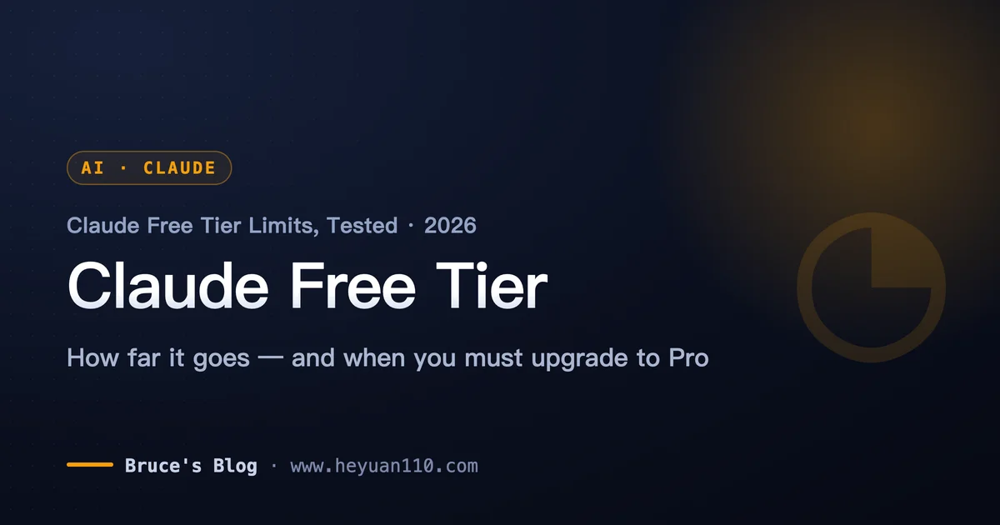
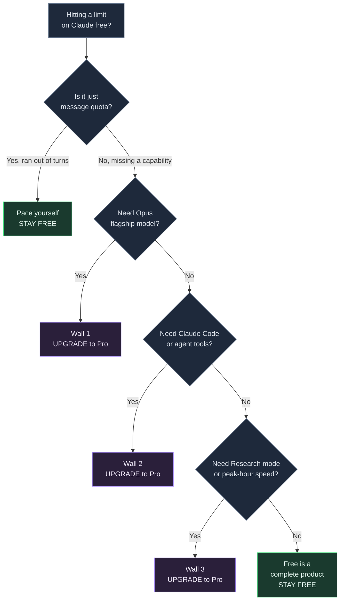
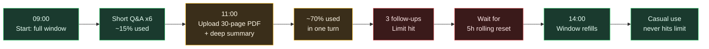

+++
date = '2026-07-08T10:00:00+08:00'
draft = false
title = 'Claude AI Free Tier Limits 2026: Is Free Enough?'
description = 'Claude free plan 2026: how many messages you get (15-40 per 5 hours), what free can and cannot do, and the exact signals that mean you should upgrade to Pro.'
toc = true
tags = ['Claude', 'AI Pricing', 'Claude Pro', 'LLM']
keywords = ['claude ai free tier limits 2026', 'claude pro pricing 2026', 'claude ai pricing plans 2026', 'claude free plan limits', 'is claude free enough']

[[params.faqItems]]
question = "How many messages can I send on the Claude free plan?"
answer = "Roughly 15-40 messages per rolling 5-hour window, or about 30-100 per day if you spread usage out. Anthropic counts tokens, not messages, so long chats and big file uploads can burn the quota in as few as 5 turns."

[[params.faqItems]]
question = "Is the Claude free tier enough in 2026?"
answer = "For casual, intermittent use - research questions, writing help, occasional coding - yes, the free tier is genuinely enough. You should upgrade only if you hit one of three walls: you need the Opus flagship model, you need Claude Code, or you need Research mode and throttle-free peak-hour access."

[[params.faqItems]]
question = "How much does Claude Pro cost in 2026?"
answer = "Claude Pro is $20/month, or $17/month billed annually ($200 up front). It unlocks Opus, Claude Code, Research mode, unlimited Projects, and roughly 5x the free usage during peak hours."

[[params.faqItems]]
question = "What's the difference between Claude free and Pro?"
answer = "Free gives you Sonnet-class chat with web search, memory, Artifacts, and file uploads. Pro adds the Opus flagship model, Claude Code, Research mode, unlimited Projects, and much higher usage limits. The gap is capabilities, not just message volume."

[[params.faqItems]]
question = "Does the free plan use Opus?"
answer = "No. The free plan defaults to Sonnet and does not include the Opus flagship model. Opus 4.8 is paid-only, so if you specifically need the strongest reasoning model, free will not give it to you no matter how you budget your messages."
+++

**The Claude AI free tier in 2026 gives you roughly 15–40 messages per rolling 5-hour window — about 30–100 a day if you spread them out.** That's the number you searched for, so it goes first. The range is wide because Claude meters tokens, not messages: a run of short questions lands you near 40, while a single 40-page PDF with a detailed-summary request can drain the whole window in 5–8 turns. Everything below is the fine print that decides where in that range you land — what the free plan actually includes, how to squeeze the most out of it, and the three signals that mean it's time to pay $20 for Pro.

> As of July 2026, the Claude free plan allows roughly 15–40 messages per rolling 5-hour window (about 30–100 per day), metered by tokens rather than message count. It includes the Sonnet model, web search, Artifacts, and file uploads — but not Opus 4.8, Claude Code, or Research mode.

## Claude Free Tier Limits 2026: The Quick Reference

One caveat before the table. Anthropic doesn't publish an exact message count for any consumer tier — the [official support docs](https://support.claude.com/en/articles/11647753-how-do-usage-and-length-limits-work) describe usage as a "conversation budget," and the [pricing page](https://claude.com/pricing) just says "usage limits apply." Every hard number here, mine included, is an observed estimate. The 15–40 figure is where my own testing and multiple independent trackers converge — treat it as a reliable range, not a promise.

| Limit | Claude free plan (2026) |
|---|---|
| Messages per 5-hour window | ~15–40 (observed, not official) |
| Messages per day | ~30–100 if spread out |
| What's metered | Tokens — your prompt and Claude's reply spend from one budget |
| Reset schedule | Rolling: refills 5 hours after your first message; no midnight reset |
| Default model | Sonnet class |
| Opus 4.8 | Not available on free |
| File uploads | Up to 20 files, 500MB each |
| Claude Code / Cowork / Design | Not included |
| Research mode | Not included |
| Peak-hour priority | None — free users are throttled first |
| Upgrade price | [Claude Pro](https://claude.ai/upgrade): $20/month, or $17/month billed annually |

Two rows in that table do most of the damage to people's expectations: the metering unit and the reset schedule. They deserve two minutes each, because together they explain nearly every "why did Claude cut me off so fast?" complaint you'll find online.

## How the Free Tier Meters Usage: Tokens, Not Messages

Claude doesn't count your messages — it counts tokens, and both sides of the conversation spend from the same budget. A token is roughly three-quarters of an English word. Your 20-word question might cost 27 tokens; Claude's 600-word answer costs about 800 more, and both come out of your window. "How many messages do I get" is genuinely unanswerable, because a message isn't the unit being sold.

That's the entire explanation for the wide 15–40 range. A session of short, text-only questions barely dents the budget, so you'll see 35–40 turns. Drop in a 40-page PDF and ask for a detailed summary, and you've committed thousands of tokens in one shot — that session can exhaust the same budget in 5–8 turns. During my test week, the fastest I ever burned through a window was a single long document analysis plus three follow-ups. The slowest was an afternoon of quick factual questions that never tripped the limit at all.

The second mechanic is the **rolling 5-hour window**, and it's the one nobody expects. Your quota does not reset at midnight. It starts counting from your first message and refills continuously five hours later. The design is deliberate — it stops people from stockpiling a full day's allowance and dumping it at 12:01 AM.

In practice, the rolling window rewards steady, spread-out use and punishes marathon sessions. Send everything in a 90-minute burst and you will hit the wall; check in a few times across the day and you may never see it. The same token-budget logic governs the paid tiers too — I dig into the mechanics in my [Claude rate limits explainer](/posts/ai/2026-02-28-claude-rate-limits/).

## What the Free Plan Includes — and What's Paid-Only

The common assumption — "free is a crippled demo" — is simply wrong. The 2026 free tier is more capable than the free tier of most AI products, and the split is cleaner than you'd guess: free gets nearly every *feature*, while paid gets the stronger model, the agentic tools, and the headroom.

| Included on free | Paid-only |
|---|---|
| Sonnet-class model (the balanced default) | Opus 4.8 flagship model |
| Web search | Claude Code (agentic terminal tool) |
| Memory across conversations | Claude Cowork (desktop task automation) |
| Artifacts — interactive apps, visualizations, games | Claude Design |
| File uploads (20 files, 500MB each) | Research mode (cited multi-source reports) |
| Projects for organizing chats | Unlimited Projects |
| Code execution | Doubled 5-hour limits (permanent since May 6, 2026) |
| Desktop extensions + MCP connectors | No peak-hour throttling |
| Extended thinking (limited form) | Priority access during high demand |

That left column reframes the whole free-vs-paid question. You don't pay to unlock basic functionality — you pay to unlock a *different tier of capability* and more of it. If your use of Claude looks like "ask a question, get an answer, maybe upload a document" — a smarter search engine with memory — the free tier is a complete product, not a locked-down trial, and it will serve you for months without complaint.

## How to Stretch the Free Tier

Every tactic below falls straight out of the two mechanics above — token metering and the rolling window. None of them are hacks or loopholes; they're just spending the same budget where it counts.

| Tactic | Why it works |
|---|---|
| Spread usage across the day | The window refills continuously — three short sessions beat one marathon burst |
| Start a fresh chat per topic | Long threads carry growing context that quietly costs tokens on every single turn |
| Batch your document questions | Ask everything about a PDF in one focused prompt instead of five follow-ups that each re-process it |
| Ask for the depth you need | A one-page summary costs a fraction of an exhaustive analysis — Claude's output bills against you too |
| Time your heavy jobs | If one big analysis will drain the window, run it when you can afford the 5-hour wait |

The pattern behind all five: on the free tier, *how* you spend a turn matters far more than how many turns you take. Ten heavy document analyses will lock you out faster than a hundred quick questions.

Budgeting works — right up until the thing you need isn't in the free tier at all. That's the next section, and it's the part that actually decides whether you should pay.

## When Free Stops Being Enough: The Three Walls

Here's the most common upgrade mistake: **people pay for Pro because they hit the message limit once, when the real question is which capability they actually need.** Running out of messages is a quota problem, and quota problems have the free workarounds above. Hitting a wall is a capability problem, and capability problems have exactly one fix: pay. Here are the three walls, in the order most people hit them.

### Wall 1: You need the Opus flagship model

The free tier gives you Sonnet, not **Opus 4.8**. For everyday writing, summarizing, and straightforward code, Sonnet is excellent and you'll rarely feel the difference. But for the hardest reasoning — multi-step architecture decisions, subtle debugging, dense technical or legal analysis — Opus is measurably stronger, and there is no free path to it.

The tell: you keep thinking "the answer is close but not quite there" on genuinely hard problems. That's Wall 1. It's a model-capability gap, and no amount of message budgeting fills it.

### Wall 2: You need Claude Code or the agentic tools

This is the wall developers hit, and it's a hard one. **Claude Code** — the agentic terminal tool that reads your repo, edits files, and runs commands — is paid-only. So are Claude Cowork (desktop task automation) and Claude Design. If your workflow is "chat in a browser," free is fine. If your workflow is "let an agent work across my codebase," free gives you nothing here, and the workaround does not exist.

This is the single most common reason a developer should stop stretching the free tier. I've written separately about the [true cost of Claude Code](/posts/ai/2026-02-25-claude-code-pricing/) and the [expensive mistakes people make with it](/posts/ai/2026-02-25-claude-code-mistakes/) once they do pay — worth reading before you commit.

### Wall 3: You need Research mode or throttle-free peak access

**Research mode** — where Claude runs an extended multi-source investigation and synthesizes a cited report — is paid-only. And there's a quieter version of this wall that matters more than people realize: **priority access**. On May 6, 2026, Anthropic permanently doubled the 5-hour session limits for Pro and Max and removed peak-hour throttling for paid users. The free tier didn't get that.

So during high-demand hours, free users are the first to be throttled or slowed — exactly when you most want Claude to be responsive. If your work is time-sensitive and you keep getting slowed down mid-afternoon, that's Wall 3, and it's worth $20 to skip.

## Free vs Pro in 2026: The Decision Table

Put the walls and the numbers together and the decision is clean. This is the table I'd hand a friend who asked whether to upgrade.

| Signal | What it means | Verdict |
|---|---|---|
| You hit the message limit once a week | Quota problem, not capability | **Stay free**, pace yourself |
| You hit it daily during real work | Free is now a bottleneck | Consider Pro |
| "The answer's almost right but not quite" on hard problems | You need Opus | **Upgrade (Wall 1)** |
| You want an agent working in your repo | You need Claude Code | **Upgrade (Wall 2)** |
| You need cited multi-source research or fast peak-hour access | You need Research / priority | **Upgrade (Wall 3)** |
| You just chat and upload the occasional file | Free is a complete product | **Stay free** |

The honest trade-off: **[Claude Pro](https://claude.ai/upgrade) is $20/month, or $17/month billed annually.** For a professional whose income depends on the tool, that's a rounding error — don't agonize over it. For a student or casual user who chats a few times a day, it's real money for capabilities you may never touch, and paying "to be safe" is the mistake in the other direction. If you want the full economic breakdown across Pro, Max, and API, the ROI math is in my [complete Claude pricing guide](/posts/ai/2026-04-03-claude-pricing-complete-guide/).

One more visual, because "how long does free last" is the wrong question — it depends entirely on what you do with each window. Here's how the same free-tier day plays out under two very different workloads:

Same account, same limits, opposite outcomes. If you find yourself constantly front-loading big files into fresh windows, that's a stronger upgrade signal than any raw message count will ever be.

## Two Mistakes That Cost People Money

The first mistake is **upgrading too early.** People pay for Pro after one frustrating afternoon at the limit, then use Claude twice a week and never touch Opus, Claude Code, or Research. That's $240 a year for message headroom they don't need. The test is simple: if you can't name which of the three walls you hit, you don't need to upgrade yet — you need to pace yourself.

The second mistake is **staying free too long.** The mirror image is the developer spending hours copy-pasting code between their editor and the Claude web chat, manually feeding it context, working around the absence of Claude Code — to save $20. If your time is worth anything, the agentic tools pay for themselves in the first afternoon. Wall 2 is the one people rationalize past far too long.

The rule of thumb I use: if you've said "I wish Claude could just do this in my repo" more than twice this week, stop stretching free and pay.

## Related Reading

- [Claude API Cost Calculator](/tools/claude-token-cost-calculator.html) — interactive per-call / monthly cost comparison across all current models
- [Claude Code Pricing: What It Really Costs](/posts/ai/2026-02-25-claude-code-pricing/)
- [Claude Rate Limits Explained](/posts/ai/2026-02-28-claude-rate-limits/)
- [The Complete Claude Pricing Guide (Free, Pro, Max, API)](/posts/ai/2026-04-03-claude-pricing-complete-guide/)
- [Expensive Mistakes People Make With Claude Code](/posts/ai/2026-02-25-claude-code-mistakes/)
