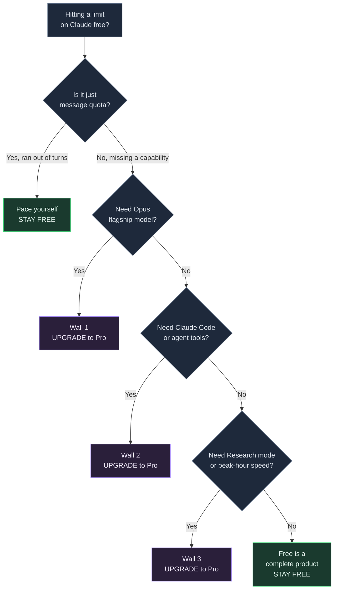
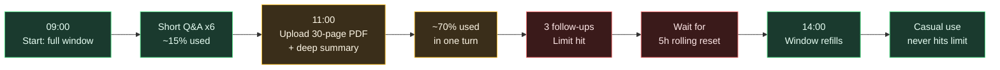

+++
date = '2026-07-08T10:00:00+08:00'
draft = false
title = 'Claude AI Free Tier Limits 2026: Is Free Enough?'
description = 'Claude free plan 2026: how many messages you get (15-40 per 5 hours), what free can and cannot do, and the exact signals that mean you should upgrade to Pro.'
toc = true
tags = ['Claude', 'AI Pricing', 'Claude Pro', 'LLM']
keywords = ['claude ai free tier limits 2026', 'claude pro pricing 2026', 'claude ai pricing plans 2026', 'claude free plan limits', 'is claude free enough']

[[params.faqItems]]
question = "How many messages can I send on the Claude free plan?"
answer = "Roughly 15-40 messages per rolling 5-hour window, or about 30-100 per day if you spread usage out. Anthropic counts tokens, not messages, so long chats and big file uploads can burn the quota in as few as 5 turns."

[[params.faqItems]]
question = "Is the Claude free tier enough in 2026?"
answer = "For casual, intermittent use - research questions, writing help, occasional coding - yes, the free tier is genuinely enough. You should upgrade only if you hit one of three walls: you need the Opus flagship model, you need Claude Code, or you need Research mode and throttle-free peak-hour access."

[[params.faqItems]]
question = "How much does Claude Pro cost in 2026?"
answer = "Claude Pro is $20/month, or $17/month billed annually ($200 up front). It unlocks Opus, Claude Code, Research mode, unlimited Projects, and roughly 5x the free usage during peak hours."

[[params.faqItems]]
question = "What's the difference between Claude free and Pro?"
answer = "Free gives you Sonnet-class chat with web search, memory, Artifacts, and file uploads. Pro adds the Opus flagship model, Claude Code, Research mode, unlimited Projects, and much higher usage limits. The gap is capabilities, not just message volume."

[[params.faqItems]]
question = "Does the free plan use Opus?"
answer = "No. The free plan defaults to Sonnet and does not include the Opus flagship model. Opus 4.8 is paid-only, so if you specifically need the strongest reasoning model, free will not give it to you no matter how you budget your messages."
+++

I spent a week running my daily work entirely on the Claude free tier to answer one question that the pricing page refuses to answer directly: **how much can you actually get done before it stops you, and when does "free" stop being enough?**

Here is the conclusion up front, because it is the whole point of this article. The Claude free tier in 2026 gives you roughly **15-40 messages per rolling 5-hour window** - about 30-100 a day if you pace yourself - and for most people who use Claude the way they use a search engine, that is genuinely enough. But the moment you should upgrade has nothing to do with running out of messages. It has to do with hitting one of **three capability walls** that no amount of budgeting will get you past. Figure out which wall you hit, and you know exactly whether to pay.

## Claude AI free tier limits 2026: the real numbers

Anthropic does not publish an exact message count for any consumer tier. The [official support docs](https://support.claude.com/en/articles/11647753-how-do-usage-and-length-limits-work) describe usage as a "conversation budget" and the [pricing page](https://claude.com/pricing) just says "usage limits apply." So every hard number you see online, including mine, is an observed estimate, not a promise. With that caveat, the convergent figure across my own testing and multiple independent trackers is **15-40 messages per 5-hour window**.

The single most important thing to understand is that this is not a message counter. Claude meters **tokens**, not turns. A token is roughly three-quarters of a word, and both your prompt and Claude's reply spend from the same budget. This is why the range is so wide: a session of short, text-only questions might let you send 35-40 messages, while a session where you drop in a 40-page PDF and ask for a detailed summary can exhaust the same budget in **5-8 turns**. During my test week, the fastest I ever burned through a window was a single long document analysis plus three follow-ups. The slowest was an afternoon of quick factual questions that never tripped the limit at all.

The second thing that trips people up is the **rolling 5-hour window**. Your quota does not reset at midnight. It starts counting from your first message and refills continuously five hours later. This design is deliberate - it stops people from stockpiling a full day's allowance and dumping it at 12:01 AM. In practice it means the free tier rewards steady, spread-out use and punishes marathon sessions. If you send everything in a 90-minute burst, you will hit the wall; if you check in a few times across the day, you may never see it. I dig into the mechanics of these windows in my [Claude rate limits explainer](/posts/ai/2026-02-28-claude-rate-limits/), because the same token-budget logic governs the paid tiers too.

## What the free plan actually includes (more than you'd think)

Here is where the common assumption - "free is a crippled demo" - is simply wrong. The 2026 free tier is far more capable than the free tier of most AI products. On the free plan you get the **Sonnet-class model** (Anthropic's balanced default), **web search**, **memory across conversations**, **Artifacts** (interactive apps, visualizations, and games rendered inline), **file uploads** (up to 20 files, 500MB each), **Projects** for organizing chats, **code execution**, **desktop extensions**, and **MCP connectors** for wiring Claude into external tools. Extended thinking - the "take your time and reason harder" mode - is available too, in a limited form.

That feature list matters because it reframes the whole free-vs-paid question. Most people assume you pay to unlock basic functionality. You don't. You pay to unlock a *different tier of capability* and *more of it*. The free tier is a complete product for a casual user, not a locked-down trial. If your use of Claude looks like "ask a question, get an answer, maybe upload a document" - a smarter search engine with memory - the free tier will serve you for months without complaint.

## The three walls: when free stops being enough

Everything above is why I push back hard on the most common upgrade mistake I see: **people upgrade to Pro because they hit the message limit once, when the real question is which capability they actually need.** Running out of messages is a quota problem, and quota problems have free workarounds (pace yourself, keep chats short, start fresh conversations). Hitting a wall is a capability problem, and capability problems have exactly one fix: pay. Here are the three walls, in the order most people hit them.

### Wall 1: You need the Opus flagship model

The free tier gives you Sonnet, not **Opus 4.8**. For everyday writing, summarizing, and straightforward code, Sonnet is excellent and you will rarely feel the difference. But for the hardest reasoning - multi-step architecture decisions, subtle debugging, dense technical or legal analysis - Opus is measurably stronger, and there is no free path to it. If you keep thinking "the answer is close but not quite there" on genuinely hard problems, you have hit Wall 1. No amount of message budgeting fixes a model-capability gap.

### Wall 2: You need Claude Code or the agentic tools

This is the wall developers hit, and it is a hard one. **Claude Code** - the agentic terminal tool that reads your repo, edits files, and runs commands - is paid-only. So are Claude Cowork (desktop task automation) and Claude Design. If your workflow is "chat in a browser," free is fine. If your workflow is "let an agent work across my codebase," free gives you nothing here, and the workaround does not exist. This is the single most common reason a developer should stop trying to stretch the free tier. I've written separately about the [true cost of Claude Code](/posts/ai/2026-02-25-claude-code-pricing/) and the [expensive mistakes people make with it](/posts/ai/2026-02-25-claude-code-mistakes/) once they do pay - worth reading before you commit.

### Wall 3: You need Research mode or throttle-free peak access

**Research mode** - where Claude runs an extended multi-source investigation and synthesizes a cited report - is paid-only. And there is a quieter version of this wall that matters more than people realize: **priority access**. On May 6, 2026, Anthropic permanently doubled the 5-hour session limits for Pro and Max and removed peak-hour throttling for paid users. The free tier did not get that. So during high-demand hours, free users are the first to be throttled or slowed, exactly when you most want Claude to be responsive. If your work is time-sensitive and you keep getting slowed down mid-afternoon, that is Wall 3, and it is worth $20 to skip.

## Free vs Pro in 2026: the decision framework

Put the walls and the numbers together and the decision is clean. Here is the framework I would give a friend, and the one that would have saved me from over-thinking my own upgrade.

| Signal | What it means | Verdict |
|---|---|---|
| You hit the message limit once a week | Quota problem, not capability | **Stay free**, pace yourself |
| You hit it daily during real work | Free is now a bottleneck | Consider Pro |
| "The answer's almost right but not quite" on hard problems | You need Opus | **Upgrade (Wall 1)** |
| You want an agent working in your repo | You need Claude Code | **Upgrade (Wall 2)** |
| You need cited multi-source research or fast peak-hour access | You need Research / priority | **Upgrade (Wall 3)** |
| You just chat and upload the occasional file | Free is a complete product | **Stay free** |

The honest trade-off: **[Claude Pro](https://claude.ai/upgrade) is $20/month, or $17/month billed annually.** For a professional whose income depends on the tool, that is a rounding error and you should not agonize over it. For a student or casual user who chats a few times a day, it is real money for capabilities you may never touch - and paying it "to be safe" is the mistake in the other direction. If you want the full economic breakdown across Pro, Max, and API, I put ROI math in my [complete Claude pricing guide](/posts/ai/2026-04-03-claude-pricing-complete-guide/).

Here is how the free tier plays out over a typical working day, and why "how long does free last" is the wrong question - it depends entirely on what you do with each window.

The timeline makes the real lesson visible: on the free tier, **what you do matters far more than how many times you do it.** Ten heavy document analyses will lock you out faster than a hundred quick questions. If you find yourself constantly front-loading big files, that is a stronger upgrade signal than a raw message count ever will be.

## Two mistakes that cost people money

The first mistake is **upgrading too early.** I see people pay for Pro after one frustrating afternoon where they hit the limit, then use Claude twice a week and never touch Opus, Claude Code, or Research. They are paying $240 a year for message headroom they don't need. If you cannot name which of the three walls you hit, you don't need to upgrade yet - you need to pace yourself.

The second mistake is **staying free too long.** The mirror image is the developer who spends hours copy-pasting code between their editor and the Claude web chat, manually feeding it context, working around the absence of Claude Code - to save $20. If your time is worth anything, the agentic tools pay for themselves in the first afternoon. Wall 2 is the one people rationalize past for far too long. The rule of thumb I use: if you have said "I wish Claude could just do this in my repo" more than twice this week, stop stretching free and pay.

## Related Reading

- [Claude API Cost Calculator](/tools/claude-token-cost-calculator.html) — interactive per-call / monthly cost comparison across all current models
- [Claude Code Pricing: What It Really Costs](/posts/ai/2026-02-25-claude-code-pricing/)
- [Claude Rate Limits Explained](/posts/ai/2026-02-28-claude-rate-limits/)
- [The Complete Claude Pricing Guide (Free, Pro, Max, API)](/posts/ai/2026-04-03-claude-pricing-complete-guide/)
- [Expensive Mistakes People Make With Claude Code](/posts/ai/2026-02-25-claude-code-mistakes/)
