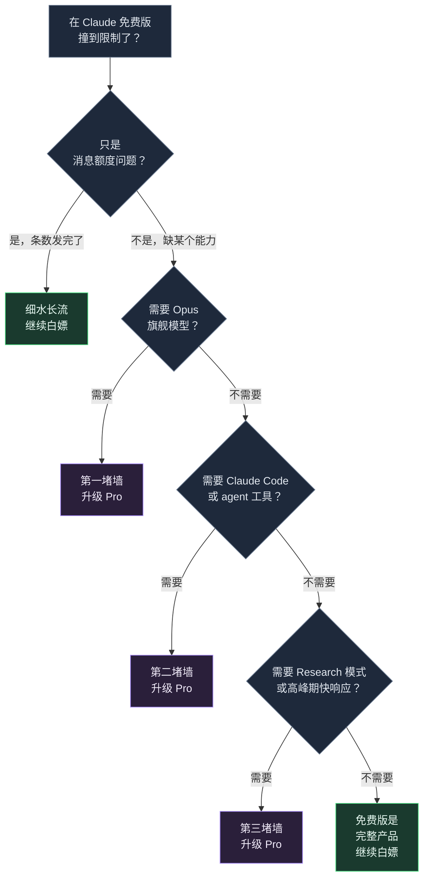

+++
date = '2026-07-08T10:00:00+08:00'
draft = false
title = 'Claude 免费版额度实测 2026：能用多久，何时升 Pro'
description = 'Claude 免费版 2026 每 5 小时能发 15-40 条、每天约 30-100 条，实测能撑多久、哪些能力用不了、出现哪些信号就必须升级 Pro，一篇讲清楚。'
toc = true
tags = ['Claude', 'AI Pricing', 'Claude Pro', 'LLM']
keywords = ['claude 免费版额度', 'claude 免费能用多久', 'claude 免费版限制 2026', 'claude 免费版 vs pro', 'claude 免费版能用 opus 吗']

[[params.faqItems]]
question = "Claude 免费版一天能发多少条？"
answer = "大约每 5 小时滚动窗口 15-40 条，全天摊开用约 30-100 条。注意 Claude 按 token 计费不按条数，长对话和大文件会让额度在五六条内就烧完。"

[[params.faqItems]]
question = "Claude 免费版能用多久？"
answer = "额度按滚动 5 小时窗口刷新，不在午夜重置。从你第一条消息开始计时，5 小时后逐步回满。所以关键不是发了几条，而是每条有多重——十次大文档分析比一百次简短提问更快触顶。"

[[params.faqItems]]
question = "Claude 免费版够用吗？"
answer = "如果你只是偶尔问问题、写点东西、传个文档，免费版完全够用，能白嫖好几个月。只有撞上三堵墙——需要 Opus 旗舰模型、需要 Claude Code、需要 Research 模式或高峰期不被限速——才需要升级。"

[[params.faqItems]]
question = "Claude 免费版和 Pro 有什么区别？"
answer = "免费版给你 Sonnet 级对话，含联网、记忆、Artifacts、文件上传。Pro 每月 20 美元，解锁 Opus 旗舰模型、Claude Code、Research 模式、无限 Projects，以及高峰期约 5 倍的用量。差的是能力，不只是条数。"

[[params.faqItems]]
question = "Claude 免费版能用 Opus 吗？"
answer = "不能。免费版默认只有 Sonnet，Opus 4.8 是付费专属。所以如果你就是需要最强推理模型，无论怎么省着发消息，免费版都给不了你。"
+++

我花了一周把日常工作全压在 Claude 免费版上，就想搞清楚官方定价页死活不肯直说的一件事：**免费版到底能白嫖多久，什么时候「免费」才真的不够用？**

先把结论放最前面，因为这就是全文的重点。Claude 免费版 2026 大约给你**每 5 小时滚动窗口 15-40 条消息**——摊开用一天约 30-100 条——对大多数把 Claude 当搜索引擎用的人来说，这个额度是真的够。但真正该升级的那一刻，跟「消息发完了」一点关系都没有，而是你撞上了**三堵墙**里的某一堵，靠省着发消息永远绕不过去。搞清楚你撞的是哪堵墙，就知道该不该掏这 20 美元。

## Claude 免费版额度 2026：真实数字长这样

Anthropic 从不公布任何消费级套餐的确切条数。[官方帮助文档](https://support.claude.com/en/articles/11647753-how-do-usage-and-length-limits-work)把用量描述成一份「对话预算」，[定价页](https://claude.com/pricing)只写一句「适用用量限制」。所以你在网上看到的每一个硬数字（包括我的）都是实测估算，不是官方承诺。带着这个前提，我自己实测和多个第三方追踪器汇聚出来的数字是：**每 5 小时窗口 15-40 条**。

最关键的一点是：这**不是一个消息计数器，Claude 计的是 token，不是条数**。一个 token 差不多是四分之三个英文单词（中文更耗），你的提问和 Claude 的回答从同一份预算里扣。这就是为什么区间这么宽——一场全是短文本的简短问答可能让你发到 35-40 条，而一场你甩进去一个 40 页 PDF 让它详细总结的对话，可能**五到八条就烧光**。我那周实测里，最快一次触顶就是一次长文档分析加三个追问；最慢的一次是一下午零碎的事实性提问，压根没碰到上限。

第二个坑是**滚动 5 小时窗口**。你的额度不在午夜重置，而是从你发第一条消息开始计时，5 小时后逐步回满。这个设计是故意的——防止有人攒一整天的额度在凌晨 0:01 一次性倒出来。落到实操上就是：免费版奖励「细水长流」，惩罚「马拉松式猛怼」。你要是 90 分钟内把话全说完，一定撞墙；你要是一天里分几次来问，可能压根见不到墙。我在[Claude 速率限制机制那篇](/posts/ai/2026-02-28-claude-rate-limits/)里拆过这套窗口的底层逻辑，因为付费版走的也是同一套 token 预算。

## 免费版到底送了什么（比你想的多）

这里正是「免费版就是个残废试用版」这个偏见彻底错的地方。2026 的 Claude 免费版比市面上大多数 AI 产品的免费档强太多。免费版你能拿到：**Sonnet 级模型**（Anthropic 的均衡默认款）、**联网搜索**、**跨对话记忆**、**Artifacts**（内联渲染的交互应用、可视化、小游戏）、**文件上传**（最多 20 个文件、单个 500MB）、整理对话的 **Projects**、**代码执行**、**桌面扩展**，以及把 Claude 接到外部工具的 **MCP 连接器**。连「多想一会儿再回答」的扩展思考也有，只是有限量。

这份清单之所以重要，是因为它把整个「免费 vs 付费」的问题重新框定了。多数人以为你付费是为了解锁基本功能。不是的。你付费是为了解锁**另一个能力层级**和**更大的用量**。免费版对一个轻度用户来说是一个完整产品，不是被锁死的试用。如果你用 Claude 的样子就是「问个问题、拿个答案、偶尔传个文档」——一个带记忆的、更聪明的搜索引擎——那免费版能伺候你好几个月都不带皱眉的。

## 三堵墙：免费什么时候就不够了

上面这些，正是我要狠狠反驳的那个最常见升级误区：**很多人是因为某天撞了一次消息上限就去开 Pro，但真正该问的是「我到底需要哪个能力」。** 消息发完是额度问题，额度问题有免费解法（细水长流、对话别拖太长、开新对话）；撞墙是能力问题，能力问题只有一个解法：付费。下面按大多数人撞到的先后顺序，讲这三堵墙。

### 第一堵墙：你需要 Opus 旗舰模型

免费版给的是 Sonnet，不是 **Opus 4.8**。日常写作、总结、直白的代码，Sonnet 已经很出色，你基本感觉不到差别。但碰到最硬的推理——多步架构决策、微妙的 debug、又密又专的技术或法律分析——Opus 明显更强，而且没有任何免费路径能摸到它。如果你在真正的难题上老是觉得「答案很接近但差那么一口气」，你就撞上第一堵墙了。这是模型能力的鸿沟，省再多消息也填不平。

### 第二堵墙：你需要 Claude Code 或那些 agent 工具

这是开发者撞的墙，而且是堵硬墙。**Claude Code**——那个能读你仓库、改文件、跑命令的终端 agent 工具——是付费专属。Claude Cowork（桌面任务自动化）和 Claude Design 也是。如果你的工作流是「在浏览器里聊天」，免费版没问题；如果你的工作流是「放一个 agent 在我代码库里干活」，免费版在这一块给你的是零，而且没有替代方案。这是开发者最该停止硬撑免费版的头号理由。我另外写过[Claude Code 的真实成本](/posts/ai/2026-02-25-claude-code-pricing/)，也写过[大家在 Claude Code 上踩的烧钱坑](/posts/ai/2026-02-25-claude-code-mistakes/)——在你真掏钱之前值得先看看。

### 第三堵墙：你需要 Research 模式或高峰期不被限速

**Research 模式**——Claude 跑一场跨多源的深度调研、产出带引用的报告——是付费专属。还有一个更安静、但比大家以为的更要命的版本：**优先访问权**。2026 年 5 月 6 日，Anthropic 永久性地把 Pro 和 Max 的 5 小时窗口额度翻倍，并取消了付费用户的高峰期限速。免费版没这待遇。于是在高需求时段，免费用户是第一批被限速、被拖慢的——偏偏就在你最需要 Claude 反应快的时候。如果你的活儿有时效性，还老是在下午被拖慢，那就是第三堵墙，花 20 美元跳过去很值。

## 免费 vs Pro 2026：一张决策速查表

把三堵墙和那些数字拼到一起，决策就清爽了。下面这张表就是我会直接甩给朋友的框架，也是当初能救我少纠结的那张。

| 信号 | 说明 | 结论 |
|---|---|---|
| 一周才撞一次消息上限 | 额度问题，不是能力问题 | **继续白嫖**，细水长流 |
| 正经干活时每天都撞 | 免费版成了瓶颈 | 可以考虑 Pro |
| 难题上「答案差一口气」 | 你需要 Opus | **升级（第一堵墙）** |
| 想让 agent 在仓库里干活 | 你需要 Claude Code | **升级（第二堵墙）** |
| 要带引用的多源调研或高峰期快速响应 | 你需要 Research / 优先权 | **升级（第三堵墙）** |
| 就是聊聊天、偶尔传个文档 | 免费版是完整产品 | **继续白嫖** |

诚实说清代价：**[Claude Pro](https://claude.ai/upgrade) 每月 20 美元，年付则每月约 17 美元。** 对一个靠这工具吃饭的专业人士，这是零头，别纠结。但对一个一天聊几句的学生或轻度用户，这就是真金白银，买的还是你可能永远碰不到的能力——「为了保险」而付费，是另一个方向上的错。想看 Pro、Max、API 之间完整的 ROI 账，我在[Claude 定价完全指南](/posts/ai/2026-04-03-claude-pricing-complete-guide/)里算过。

下面这条时间线，能让你看清「免费能用多久」为什么是个问错了的问题——它完全取决于你拿每个窗口去干什么。

这条时间线把真正的道理摆到明面上：在免费版上，**你干什么，比你干多少次重要得多。** 十次重型文档分析锁死你的速度，比一百次简短提问快得多。如果你发现自己老是一上来就猛塞大文件，那才是比「发了多少条」强得多的升级信号。

## 两个让人白花钱的错

第一个错是**升级太早**。我见过太多人，某个下午撞了一次上限、憋得难受就开了 Pro，结果一周用两次 Claude，Opus、Claude Code、Research 一个都没碰过。他们一年花 240 美元，买的是自己根本不需要的消息余量。如果你说不出自己撞的是三堵墙里的哪一堵，那你还不到升级的时候——你只是需要细水长流。

第二个错是**免费版硬撑太久**。镜像版本就是那个开发者：花好几个小时在编辑器和 Claude 网页对话之间复制粘贴代码、手动喂上下文、绕开没有 Claude Code 这件事——就为了省 20 美元。只要你的时间还值点钱，那些 agent 工具第一个下午就把成本赚回来了。第二堵墙，是大家合理化拖延得最久的一堵。我的经验法则是：如果这一周你说「要是 Claude 能直接在我仓库里把这事办了就好了」超过两次，就别再抠免费版，掏钱吧。

## 延伸阅读

- [Claude Code 定价：到底要花多少钱](/posts/ai/2026-02-25-claude-code-pricing/)
- [Claude 速率限制机制详解](/posts/ai/2026-02-28-claude-rate-limits/)
- [Claude 定价完全指南（免费 / Pro / Max / API）](/posts/ai/2026-04-03-claude-pricing-complete-guide/)
- [大家在 Claude Code 上踩的烧钱坑](/posts/ai/2026-02-25-claude-code-mistakes/)
