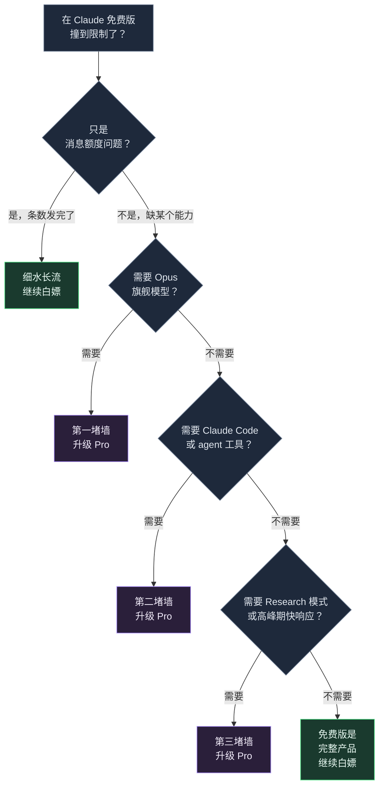

+++
date = '2026-07-08T10:00:00+08:00'
draft = false
title = 'Claude 免费版额度 2026：能发多少条，何时升 Pro'
description = 'Claude 免费版额度 2026 直接给答案：每 5 小时滚动窗口约 15-40 条消息，全天约 30-100 条，按 token 计费不按条数。免费版含 Sonnet 和联网搜索，但没有 Opus 和 Claude Code——撞上三堵墙再升 Pro 才划算。'
toc = true
tags = ['Claude', 'AI Pricing', 'Claude Pro', 'LLM']
keywords = ['claude 免费版额度', 'claude 免费能用多久', 'claude 免费版限制 2026', 'claude 免费版 vs pro', 'claude 免费版能用 opus 吗']

[[params.faqItems]]
question = "Claude 免费版一天能发多少条？"
answer = "大约每 5 小时滚动窗口 15-40 条，全天摊开用约 30-100 条。注意 Claude 按 token 计费不按条数，长对话和大文件会让额度在五六条内就烧完。"

[[params.faqItems]]
question = "Claude 免费版能用多久？"
answer = "额度按滚动 5 小时窗口刷新，不在午夜重置。从你第一条消息开始计时，5 小时后逐步回满。所以关键不是发了几条，而是每条有多重——十次大文档分析比一百次简短提问更快触顶。"

[[params.faqItems]]
question = "Claude 免费版够用吗？"
answer = "如果你只是偶尔问问题、写点东西、传个文档，免费版完全够用，能白嫖好几个月。只有撞上三堵墙——需要 Opus 旗舰模型、需要 Claude Code、需要 Research 模式或高峰期不被限速——才需要升级。"

[[params.faqItems]]
question = "Claude 免费版和 Pro 有什么区别？"
answer = "免费版给你 Sonnet 级对话，含联网、记忆、Artifacts、文件上传。Pro 每月 20 美元，解锁 Opus 旗舰模型、Claude Code、Research 模式、无限 Projects，以及高峰期约 5 倍的用量。差的是能力，不只是条数。"

[[params.faqItems]]
question = "Claude 免费版能用 Opus 吗？"
answer = "不能。免费版默认只有 Sonnet，Opus 4.8 是付费专属。所以如果你就是需要最强推理模型，无论怎么省着发消息，免费版都给不了你。"
+++

**Claude 免费版额度 2026 的答案是：每 5 小时滚动窗口约 15-40 条消息**，全天摊开用约 30-100 条。你搜这个词就是想要这个数，所以它放第一句。

区间之所以这么宽，是因为 Claude 计的是 token 不是条数：全程短问答能发到 40 条上下，甩一个 40 页 PDF 让它详细总结，**五到八条就能烧光整个窗口**。

下面全是决定你落在区间哪一头的细则：免费版到底送了什么、怎么把免费额度榨到最后一滴，以及哪三个信号出现了才值得掏 20 美元升 Pro。

> 截至 2026 年 7 月，Claude 免费版每 5 小时滚动窗口约可发 15-40 条消息（全天约 30-100 条），按 token 计量而非条数。免费版包含 Sonnet 模型、联网搜索、Artifacts 和文件上传，但不含 Opus 4.8、Claude Code 和 Research 模式。

## Claude 免费版额度 2026：一张速查表

看表之前先交代一句：Anthropic 从不公布任何消费级套餐的确切条数。[官方帮助文档](https://support.claude.com/en/articles/11647753-how-do-usage-and-length-limits-work)把用量描述成一份「对话预算」，[定价页](https://claude.com/pricing)只写「适用用量限制」。

所以你在网上看到的每个硬数字（包括我的）都是实测估算。15-40 这个区间是我自己实测和多个第三方追踪器汇聚出来的结果——当可靠区间用，别当官方承诺。

| 项目 | Claude 免费版（2026） |
|---|---|
| 每 5 小时窗口消息数 | 约 15-40 条（实测值，非官方） |
| 每天消息数 | 摊开用约 30-100 条 |
| 计量单位 | token——你的提问和 Claude 的回答扣同一份预算 |
| 刷新机制 | 滚动窗口：从第一条消息起算，5 小时后回满，不在午夜重置 |
| 默认模型 | Sonnet 级 |
| Opus 4.8 | 免费版没有 |
| 文件上传 | 最多 20 个文件，单个 500MB |
| Claude Code / Cowork / Design | 不含 |
| Research 模式 | 不含 |
| 高峰期优先权 | 没有——免费用户最先被限速 |
| 升级价格 | [Claude Pro](https://claude.ai/upgrade)：每月 20 美元，年付约合每月 17 美元 |

这张表里最坑人预期的是两行：计量单位和刷新机制。各值得花两分钟搞懂——网上几乎所有「为什么我这么快就被掐断」的抱怨，根子都在这两行。

## 免费版怎么计量：按 token，不按条数

Claude 不数你发了几条，它数 token，而且对话双方花的是同一份预算。一个 token 差不多是四分之三个英文单词（中文更耗）。你 20 个词的提问可能是 27 个 token，Claude 600 词的回答再扣 800 个——都从你的窗口里出。

这就是 15-40 这个区间为什么这么宽的全部原因。一场全是短文本的问答几乎不伤预算，能发到 35-40 条；甩进去一个 40 页 PDF 要详细总结，一轮就砸进去几千 token，**同一份预算五到八条就见底**。

我那周实测里，最快一次触顶就是一次长文档分析加三个追问；最慢的一次是一下午零碎的事实性提问，压根没碰到上限。

第二个机制是**滚动 5 小时窗口**，也是最出乎意料的一个。额度不在午夜重置，而是从你第一条消息开始计时，5 小时后逐步回满。这个设计是故意的——防止有人攒一整天的额度在凌晨 0:01 一次性倒出来。

落到实操上：滚动窗口奖励细水长流，惩罚马拉松式猛怼。90 分钟内把话全说完，一定撞墙；一天里分几次来问，可能压根见不到墙。付费版走的也是同一套 token 预算，底层逻辑我在[Claude 速率限制机制那篇](/zh/posts/ai/2026-02-28-claude-rate-limits/)里拆过。

## 免费版送了什么、什么必须付费

「免费版就是个残废试用版」这个偏见是彻底错的。2026 的 Claude 免费版比市面上大多数 AI 产品的免费档强得多，而且分界线比你猜的干净：功能几乎全给免费版，付费买的是更强的模型、agent 工具和更大的余量。

| 免费版就有 | 付费专属 |
|---|---|
| Sonnet 级模型（均衡默认款） | Opus 4.8 旗舰模型 |
| 联网搜索 | Claude Code（终端 agent 工具） |
| 跨对话记忆 | Claude Cowork（桌面任务自动化） |
| Artifacts——内联交互应用、可视化、小游戏 | Claude Design |
| 文件上传（20 个文件、单个 500MB） | Research 模式（带引用的多源调研报告） |
| 整理对话的 Projects | 无限 Projects |
| 代码执行 | 5 小时额度翻倍（2026 年 5 月 6 日起永久生效） |
| 桌面扩展 + MCP 连接器 | 高峰期不限速 |
| 扩展思考（限量版） | 高需求时段优先访问 |

左边这一列把整个「免费 vs 付费」的问题重新框定了。你付费不是为了解锁基本功能，而是为了解锁**另一个能力层级**和更大的用量。

如果你用 Claude 的样子就是「问个问题、拿个答案、偶尔传个文档」——一个带记忆的、更聪明的搜索引擎——那免费版是个完整产品，不是被锁死的试用，白嫖几个月不带皱眉的。

## 怎么把免费额度榨到最后一滴

下面每一招都直接从上面两个机制推出来——token 计量和滚动窗口。没有一个是黑科技，全是把同一份预算花在刀刃上。

| 招数 | 为什么管用 |
|---|---|
| 把使用摊到一天各时段 | 窗口持续回满——三场短会话胜过一场马拉松 |
| 一个话题开一个新对话 | 长对话带着越滚越大的上下文，每一轮都在悄悄扣 token |
| 文档问题打包问 | 关于一个 PDF 的问题一次问全，别拆成五个追问让它反复重读 |
| 只要你需要的深度 | 「一页纸总结」比「详尽分析」便宜好几倍——Claude 的输出也算你的账 |
| 挑时机干重活 | 一次大分析注定烧光窗口的话，挑一个等得起 5 小时的时间点跑 |

五招背后是同一个规律：在免费版上，**每一条怎么花，比发了多少条重要得多**。十次重型文档分析锁死你的速度，比一百次简短提问快得多。

省着用确实管用——直到你需要的东西根本不在免费版里。这才是下一节的内容，也是真正决定你该不该掏钱的部分。

## 三堵墙：免费什么时候就不够了

最常见的升级误区是：**很多人因为某天撞了一次消息上限就去开 Pro**，但真正该问的是「我到底缺哪个能力」。消息发完是额度问题，额度问题有上面那些免费解法；撞墙是能力问题，能力问题只有一个解法：付费。下面按大多数人撞到的先后顺序讲这三堵墙。

### 第一堵墙：你需要 Opus 旗舰模型

免费版给的是 Sonnet，不是 **Opus 4.8**。日常写作、总结、直白的代码，Sonnet 已经很出色，你基本感觉不到差别。但碰到最硬的推理——多步架构决策、微妙的 debug、又密又专的技术或法律分析——Opus 明显更强，而且没有任何免费路径能摸到它。

判断标志：你在真正的难题上老是觉得「答案很接近但差那么一口气」。这就是第一堵墙——模型能力的鸿沟，省再多消息也填不平。

### 第二堵墙：你需要 Claude Code 或那些 agent 工具

这是开发者撞的墙，而且是堵硬墙。**Claude Code**——能读你仓库、改文件、跑命令的终端 agent 工具——是付费专属，Claude Cowork（桌面任务自动化）和 Claude Design 也是。

你的工作流是「在浏览器里聊天」，免费版没问题；是「放一个 agent 在我代码库里干活」，免费版给你的是零，而且没有替代方案。这是开发者最该停止硬撑免费版的头号理由。

真掏钱之前值得先看两篇：我写过[Claude Code 的真实成本](/zh/posts/ai/2026-02-25-claude-code-pricing/)，也写过[大家在 Claude Code 上踩的烧钱坑](/zh/posts/ai/2026-02-25-claude-code-mistakes/)。

### 第三堵墙：你需要 Research 模式或高峰期不被限速

**Research 模式**——Claude 跑一场跨多源的深度调研、产出带引用的报告——是付费专属。还有一个更安静但更要命的版本：**优先访问权**。2026 年 5 月 6 日，Anthropic 永久性地把 Pro 和 Max 的 5 小时窗口额度翻倍，并取消了付费用户的高峰期限速。免费版没这待遇。

于是在高需求时段，免费用户是第一批被限速、被拖慢的——偏偏就在你最需要 Claude 反应快的时候。如果你的活儿有时效性，还老是在下午被拖慢，那就是第三堵墙，花 20 美元跳过去很值。

## 免费 vs Pro 2026：决策速查表

把三堵墙和前面的数字拼到一起，决策就清爽了。朋友来问「要不要升级」，我直接甩这张表。

| 信号 | 说明 | 结论 |
|---|---|---|
| 一周才撞一次消息上限 | 额度问题，不是能力问题 | **继续白嫖**，细水长流 |
| 正经干活时每天都撞 | 免费版成了瓶颈 | 可以考虑 Pro |
| 难题上「答案差一口气」 | 你需要 Opus | **升级（第一堵墙）** |
| 想让 agent 在仓库里干活 | 你需要 Claude Code | **升级（第二堵墙）** |
| 要带引用的多源调研或高峰期快速响应 | 你需要 Research / 优先权 | **升级（第三堵墙）** |
| 就是聊聊天、偶尔传个文档 | 免费版是完整产品 | **继续白嫖** |

诚实说清代价：**[Claude Pro](https://claude.ai/upgrade) 每月 20 美元，年付约合每月 17 美元**。对靠这工具吃饭的专业人士，这是零头，别纠结。但对一天聊几句的学生或轻度用户，这是真金白银，买的还是你可能永远碰不到的能力——「为了保险」而付费，是另一个方向上的错。

想看 Pro、Max、API 之间完整的 ROI 账，我在[Claude 定价完全指南](/zh/posts/ai/2026-04-03-claude-pricing-complete-guide/)里算过。

再来一张图，因为「免费能用多久」本身就是问错了的问题——它完全取决于你拿每个窗口去干什么。同一个免费账号，两种用法，一天下来结局完全相反：

同样的额度，相反的结局。如果你发现自己老是一开窗口就猛塞大文件，那才是比「发了多少条」强得多的升级信号。

## 两个让人白花钱的错

第一个错是**升级太早**。某个下午撞了一次上限、憋得难受就开了 Pro，结果一周用两次 Claude，Opus、Claude Code、Research 一个都没碰过——一年 240 美元，买的是自己根本不需要的消息余量。检验很简单：说不出自己撞的是三堵墙里的哪一堵，就还不到升级的时候，你只是需要细水长流。

第二个错是**免费版硬撑太久**。镜像版本就是那个开发者：花好几个小时在编辑器和 Claude 网页之间复制粘贴代码、手动喂上下文、绕开没有 Claude Code 这件事——就为了省 20 美元。只要你的时间还值点钱，agent 工具第一个下午就把成本赚回来了。第二堵墙，是大家合理化拖延得最久的一堵。

我的经验法则：这一周里你说「要是 Claude 能直接在我仓库里把这事办了就好了」超过两次，就别再抠免费版，掏钱吧。

## 延伸阅读

- [Claude API 成本计算器](/tools/claude-token-cost-calculator.html) — 按你的用量实时对比各模型每次调用/每月成本
- [Claude Code 定价：到底要花多少钱](/zh/posts/ai/2026-02-25-claude-code-pricing/)
- [Claude 速率限制机制详解](/zh/posts/ai/2026-02-28-claude-rate-limits/)
- [Claude 定价完全指南（免费 / Pro / Max / API）](/zh/posts/ai/2026-04-03-claude-pricing-complete-guide/)
- [大家在 Claude Code 上踩的烧钱坑](/zh/posts/ai/2026-02-25-claude-code-mistakes/)
