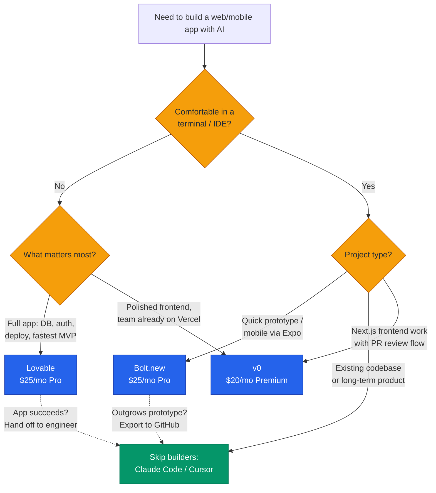
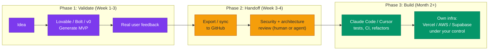

+++
date = '2026-07-08T12:00:00+08:00'
aliases = ['/posts/ai/2026-07-09-lovable-vs-v0-vs-bolt/']
draft = false
title = 'Lovable vs v0 vs Bolt: AI App Builders Compared 2026'
description = "Lovable if you can't code, v0 if you ship Next.js on Vercel, Bolt for a browser IDE and Expo mobile — and when engineers should skip all three for Claude Code."
toc = true
tags = ['AI App Builder', 'Lovable', 'v0', 'Bolt.new', 'Vibe Coding']
keywords = ['lovable vs v0 vs bolt', 'lovable ai review 2026', 'loveable ai', 'best ai app builder 2026', 'v0 vs bolt', 'bolt.new review 2026', 'ai app builder comparison']

[[params.faqItems]]
question = "Which is better in 2026: Lovable, v0, or Bolt?"
answer = "It depends on who you are. Lovable is best for non-technical founders who need a full-stack MVP with database and auth. v0 is best for frontend work inside the Vercel/Next.js ecosystem, especially after its February 2026 Git integration. Bolt.new is best for developers who want an in-browser IDE with framework flexibility and Expo mobile support."

[[params.faqItems]]
question = "Is Lovable AI worth it in 2026?"
answer = "Yes for validating a product idea fast: $25/month gets you a working full-stack app on React plus Supabase without touching code. No for long-term core products — the Supabase coupling and credit-based billing make complex apps expensive to iterate on, and the generated code still needs a security review before production."

[[params.faqItems]]
question = "What is the difference between v0 and Bolt?"
answer = "v0 (by Vercel) generates production-quality React/Next.js code and now supports Git branches, PRs, and existing codebases, but gravitates hard toward the Vercel ecosystem. Bolt.new runs a full dev environment in your browser via WebContainers, supports more frameworks and Expo mobile apps, but its token billing scales with project size, so costs grow as your app grows."

[[params.faqItems]]
question = "Can I export my code from Lovable, v0, or Bolt?"
answer = "All three support GitHub sync, so you own the code. But export is not architecture freedom: Lovable apps are deeply coupled to Supabase (auth, storage policies, edge functions), and v0 output assumes Vercel/Next.js conventions. Migrating the repo is easy; migrating the architecture is a real project."

[[params.faqItems]]
question = "When should I use Claude Code or Cursor instead of an AI app builder?"
answer = "If you are comfortable in a terminal or IDE, already have a codebase, or are building something you will maintain for years — use Claude Code or Cursor. App builders sell a packaged environment (hosting, deploy, database wiring), not a smarter AI. For engineers, that package is mostly overhead you are paying a markup on."
+++

Verdict first, so you can leave early. If you can't code and need a working product in front of users this week, pick **Lovable** — $25/month buys a full-stack app with a real database and auth. If your team ships Next.js on Vercel, pick **v0** — it's the only builder whose output arrives as a reviewable pull request. If you're a developer who wants a dev environment in a browser tab, or you need a mobile app via Expo, pick **Bolt.new**. And if you're at home in a terminal, pick none of them — Claude Code or Cursor beats all three on cost and control. That's the entire **Lovable vs v0 vs Bolt** decision. If one of those sentences is you, close the tab. You're done.

Still here? Then you either fall between two of those lines, or you'd like receipts before betting a product on a five-sentence ruling. Fair — and worth doing, because this market is loud right now, and loud markets breed lazy comparisons. Search interest in "loveable ai" (yes, with the extra "e") jumped again this week in the US, driven by news that the company is [reportedly doubling its valuation to $13.2 billion](https://techcrunch.com/2026/07/08/lovable-reportedly-in-talks-to-double-its-valuation-to-13-2b/) eighteen months after launch. People are typing a product name they can't spell into Google. That's the ambient hype level you're navigating.

So this piece is built as a reference, not a narrative review. Skim the tables, jump to the section for whichever tool you're leaning toward, and don't skip the billing parts — the real differences between these three aren't in the feature lists. They're in what each one quietly costs you after week one.

## Lovable vs v0 vs Bolt: The 30-Second Table

| | Lovable | v0 | Bolt.new |
|---|---|---|---|
| Best for | Non-coders who need a complete app: database, auth, deploy | Next.js/Vercel teams that want PR-based review | Developers prototyping fast; the only Expo mobile path |
| Worst for | Long-term production apps | Anything not hosted on Vercel | Projects that outgrow prototype size |
| Entry price | $25/mo Pro | $20/mo Premium | $25/mo Pro |
| Signature move | Idea to deployed full-stack app in one chat | Every chat is a Git branch that merges as a PR | Real Node.js environment inside a browser tab |
| Exit story | Hand the repo to an engineer | Output already lands as PRs in your repo | Export to GitHub before the bill bends |

Every cell in that table gets unpacked below, with sources. If you screenshot only one thing, make it this table plus the billing one further down.

## Three Species, Not Three Brands

The table works because these aren't three brands of the same product — they're three different species, and picking the wrong species costs far more than picking the wrong brand. Most bad reviews of all three tools, in Reddit threads and "best AI app builder 2026" listicles alike, trace back to a species mismatch rather than a product defect. Near-identical entry pricing ($20–25/month) feeds the illusion that they're interchangeable. What they actually sell is three different answers to three different questions:

- **Lovable** answers: *"I have a product idea and I don't code. Get me to a working app."* It's a conversational full-stack generator that hides the code by default and wires up React, Supabase (PostgreSQL, auth, storage), and deployment in one flow. The unit of work is a *product decision*.
- **v0** answers: *"I need production-grade frontend inside the Vercel ecosystem."* Since [the new v0 shipped in February 2026](https://vercel.com/blog/introducing-the-new-v0), every chat lives on its own Git branch with auto-commits and PR-based merges, there's a VS Code-style editor, and you can import an existing codebase. The unit of work is a *pull request*.
- **Bolt.new** answers: *"I want a full dev environment in a browser tab."* Built by StackBlitz on WebContainers, it runs Node.js in your browser, supports multiple frameworks including [Expo for React Native mobile apps](https://expo.dev/blog/bolt-expo-integration-announcement), and shows you every file. The unit of work is a *codebase*.

One thing they no longer compete on is code quality. All three run frontier Anthropic models under the hood, and output quality converged in 2025. What didn't converge — what's actually diverging — is the workflow each wraps around the model, and how each one bills you as your project matures. That's where the rest of this piece lives.

## Lovable: A Brilliant Incubator You Shouldn't Live In

Lovable gets the most space in this comparison because the gap between its marketing and its reality is the widest — in both directions. The numbers are genuinely absurd: roughly $500M ARR with 146 employees as of June 2026, per [TechCrunch's reporting](https://techcrunch.com/2026/03/11/lovable-says-it-added-100m-in-revenue-last-month-alone-with-just-146-employees/), on the heels of a $330M Series B. Revenue like that doesn't come from developers. It comes from the enormous population of people with product ideas and no way to execute them — and for that population, judged as an incubator for non-technical founders, Lovable is the best product in the category. It earns every dollar.

Here's what $25/month buys on the Pro tier (100 monthly credits plus daily grants, per the [official pricing page](https://lovable.dev/pricing)): a chat interface that produces a complete application — React frontend, Supabase backend with real PostgreSQL, working authentication, file storage, one-click deployment. Tasks are priced in credits: "make the button gray" runs about 0.5 credits, "build me a landing page with images" about 1.7. A solo founder validating one idea typically fits a full month of iteration inside the Pro plan. Set that against the $5,000–15,000 a freelance developer would charge for the same MVP, and the value proposition doesn't need a hard sell.

Now the judgment Lovable's marketing will never hand you: **Lovable is a validation tool, not a production platform.** Two specific traps wait for anyone who misses the distinction.

Trap one: credit burn is nonlinear in app complexity. Early edits on a small app are cheap. But once your app has dozens of interconnected features, every change drags more context, costs more credits, and fails more often — so the tenth week of iteration costs a multiple of the first. The pricing page doesn't show you this curve. The invoice does.

Trap two: security. The [Veracode GenAI security report](https://www.veracode.com/blog/) found roughly 45% of AI-generated code samples failed security tests with OWASP-class vulnerabilities. Lovable's output is no exception — the problem is that Lovable's target users are exactly the people least equipped to notice. If your app touches payments or personal data, a human security review before launch is non-negotiable; I laid out why in [my guide to secure vibe coding](/posts/ai/2026-02-24-secure-vibe-coding/).

**Use Lovable if**: you can't code, you need to show a working product to users or investors within days, and you accept that success means eventually handing the codebase to an engineer. **Skip it if**: you're a developer (you'll fight the abstraction all day), or the app is the long-term core of your business.

## Bolt.new: The Developer Pick With a Compounding Bill

Bolt gets the second-biggest chunk of this comparison because it hides the single most under-reported fact in the category. We'll get there — first, what it is.

Technically, Bolt is the most interesting of the three. StackBlitz built it on WebContainers, which boot a real Node.js environment inside your browser tab — no remote VM, no waiting for a container to spin up. You see the full file tree, you can edit any file directly, you can open a terminal. Bolt is the only one of the three that feels like an IDE rather than a chat product, and that defines its species: **developers who want AI speed without giving up visibility into the code.**

It also owns the category's clearest differentiator: mobile. Through its [official Expo partnership](https://expo.dev/blog/bolt-expo-integration-announcement), Bolt scaffolds React Native projects with Expo Router and NativeWind, testable on a real phone via Expo Go within minutes. Neither Lovable nor v0 offers a native mobile path at all.

Be precise about that mobile boundary, though, because Bolt's marketing isn't. WebContainers cannot run Xcode, Android Studio, or the EAS build pipeline. Bolt gets you React Native *code*, not a signed binary — App Store submission still means setting up EAS on your own machine. "Idea to app store without writing code" is true for the first 80% of the distance and silent about the last 20%.

Now the under-reported fact, and I'll be blunt because almost no comparison spells it out: **Bolt's token consumption scales with your project size, not your request size.** Most of Bolt's token spend goes to syncing your project's file system into the model's context — so the same one-line change costs dramatically more in week six than in week one, purely because the codebase grew. The [pricing page](https://bolt.new/pricing) advertises 10M tokens for $25/month, which sounds enormous until a mid-sized project starts eating six figures of tokens per message; community cost breakdowns like [Banani's analysis](https://www.banani.co/blog/bolt-new-pricing) consistently flag this as the number-one source of surprise bills. Bolt softens the curve with token rollover (unused paid tokens survive one extra month) and diff-based syncing, but the shape doesn't change: **Bolt is cheap for small projects and gets expensive precisely when your project starts succeeding.**

**Use Bolt if**: you're a developer prototyping across frameworks, you want mobile via Expo, or you need to hand someone a running full-stack demo in a browser tab. **Skip it if** — or rather, plan for the moment when — your project grows past prototype size. At that point, export to GitHub and continue in a real agentic tool; the pipeline at the end of this post formalizes exactly that handoff.

## v0: Excellent for Vercel Shops, Exhausting for Everyone Else

v0 gets the shortest section — not because it's the weakest product, but because its decision has no middle ground. Inside its niche it's arguably the most professional tool here; outside it, there's nothing to deliberate. If you're a Vercel/Next.js shop, it's excellent. If you're not, don't.

The product changed in February 2026, and the change matters. v0 spent 2024–2025 pigeonholed as "the React component generator," and honestly, the pigeonhole was fair. [The new v0](https://vercel.com/blog/introducing-the-new-v0) is a different animal: a sandbox runtime that mirrors real deployment environments, native GitHub integration where every chat is a branch and merges happen through PRs, a full code editor, database connections, and — the strategic tell — the ability to import an *existing* codebase rather than only greenfield generation.

That import feature reframes the category. Lovable and Bolt are places where projects are born; v0 now positions itself as a place where existing products get built *onto*. A designer or PM on a Vercel-deployed Next.js team can open v0, describe a new settings page, and produce an actual PR against main that an engineer reviews like any other PR. No other builder does that with first-class Git semantics, and it quietly solves the worst problem with AI app builders — output trapped in a walled garden nobody on the team can review.

Two costs, both real. First, **ecosystem gravity**: nothing locks you in contractually, but every default assumes Next.js, Vercel deployment, and Vercel's infrastructure conventions — building something for AWS in v0 is swimming upstream. Second, **billing predictability**: v0 moved to token-metered credits, and community pricing trackers [documented per-token rates roughly doubling in early 2026](https://costbench.com/software/ai-coding-assistants/v0-vercel/) while plan prices stayed flat. A simple component costs pennies; a complex multi-file generation can eat a meaningful chunk of the $20 monthly Premium credit in a few prompts, and you don't know the price until it runs. As I found across token-metered tools in [my Claude Code vs Cursor vs Windsurf comparison](/posts/ai/2026-02-18-claude-code-vs-cursor-vs-windsurf-2026/), unpredictable metering degrades behavior: you start rationing prompts instead of iterating freely, which defeats the point of the tool.

**Use v0 if**: you or your team ship on Vercel/Next.js, you care about code quality and PR-based review, and frontend is the bulk of the work. **Skip it if**: you need a full standalone app with minimal setup (Lovable is faster), or your stack isn't Next.js (the gravity will exhaust you).

## Lovable vs v0 vs Bolt Pricing: Three Billing Models, Three Failure Modes

Set the feature lists aside; billing is where these products actually diverge. Here's the second table worth screenshotting — not features, *failure modes*:

| | Lovable | v0 | Bolt.new |
|---|---|---|---|
| Entry paid tier | $25/mo (100 credits + daily grants) | $20/mo Premium ($20 credits) | $25/mo (10M tokens) |
| Billing unit | Credits per task | Tokens → credits | Tokens |
| What drives cost | Task complexity | Model choice × generation size | **Project size** (file sync) |
| Failure mode | Complex apps burn credits per edit | Cost unknown until generation runs | Same edit costs more as app grows |
| Rollover | Limited (1–2 months) | Monthly reset | Paid tokens +1 month |
| Team tier | $50/mo Business | $30/user Team | $30/user Teams |

One pattern runs through all three: **entry pricing is designed around week-one usage, and every one of these tools gets more expensive per unit of progress as your app matures.** That's not a scandal — context is genuinely expensive, and these companies pass through frontier-model token costs — but it dictates the correct mental model: pay for the sprint, not the marathon. All three are at their best in the first two to four weeks of a project's life. Plan your exit before you start, and the pricing is fine. Drift into month four of maintaining a production app inside any of them, and you're paying agency prices for chatbot ergonomics.

## Code Export Is Not Architecture Freedom

All three tools sync to GitHub, and all three marketing pages say some version of "you own your code." Technically true, practically misleading — and it's the misconception most worth dismantling.

Owning the repository is the easy 20%. What you don't own is architectural independence. A Lovable app isn't "a React app that happens to use Supabase" — its auth flows, row-level-security policies, storage rules, and edge functions are woven into Supabase's specific model, and [independent audits of the migration path](https://wz-it.com/en/blog/lovable-vs-bolt-vs-v0-comparison-2026/) conclude that moving to another backend is "more than a table export"; it's a re-architecture. v0 output assumes Next.js conventions and deploys most naturally to Vercel infrastructure. Bolt is the most portable of the three — plain code in standard frameworks, one more reason it's the developer pick — but even Bolt projects inherit whatever service wiring (Supabase, Netlify, Stripe) the AI chose in minute one: decisions you never consciously made, which you'll live with for years.

My rule: **evaluate these tools by the cost of leaving, not the cost of joining.** Joining costs $25. Leaving Lovable with a successful product costs an engineering engagement. That asymmetry is the real price tag — and, to be fair, the entire business model behind a $13.2B valuation. The exit cost *is* the moat.

## When the Answer Is None of Them

Most comparisons omit this section because it doesn't fit the affiliate-link business model: **for a large class of users, the correct answer to "Lovable vs v0 vs Bolt" is "none."**

Here's the boundary as I draw it. App builders sell three things bundled: an AI coding model, a managed environment (hosting, database, deploy pipeline), and a chat abstraction that hides files. The model is no longer a differentiator — Claude Code, Cursor, and the app builders all run frontier models. So what you're really paying for is the environment and the abstraction. If you already have both — you're comfortable in a terminal, you know what `git push` and a Vercel deploy are — the bundle is pure overhead, and a terminal-native agent gives you strictly more control at comparable or lower cost. I've documented that workflow in depth in my [Claude Code complete guide](/posts/ai/2026-02-28-claude-code-complete-guide/), and the trendline I described in [agentic coding trends for 2026](/posts/ai/2026-02-23-agentic-coding-trends-2026/) has only accelerated: agents keep absorbing builder territory — they now deploy, drive browsers, and manage infrastructure — and Vercel itself ships an [agent-oriented browser toolchain](/posts/ai/2026-01-13-vercel-agent-browser/) that points at exactly this convergence.

Concretely, skip all three app builders when any of these is true:

1. **You already use a coding agent daily.** Claude Code with a Supabase MCP server replicates 90% of Lovable's backend wiring — on your machine, in your repo, under your review process.
2. **The project is brownfield.** Only v0 even attempts existing-codebase import; agents were built for it.
3. **The app is your long-term core product.** You'll need architecture decisions, tests, CI, and observability — none of which chat abstractions handle well.
4. **You have compliance or data-residency requirements.** A managed builder's convenience is precisely the control you're required to keep.

And the honest inverse: if the person building is a designer, PM, or founder who will *never* open a terminal, Claude Code's power is irrelevant. For them, the abstraction isn't overhead — it's the entire product. Tool judgments are user judgments.

## The Decision, As a Flowchart

Everything above, compressed into the version I'd send a friend:

The dotted arrows are the most important part of the diagram. **Every successful app-builder project eventually flows toward an agentic workflow.** The builders are on-ramps, not destinations.

## From Prototype to Production: The Realistic Workflow

Which brings me to what I actually recommend in 2026 — not a tool, but a *pipeline* with a planned handoff point, one I've refined since writing about [taking prototypes to production](/posts/ai/2026-03-09-prototype-to-production/):

The single highest-leverage move in this pipeline is doing the Phase 2 handoff *on schedule* — before the credit/token curve bends upward, and before undocumented architecture decisions calcify. Teams that treat the app builder as a disposable first draft consistently beat teams that try to make it permanent.

## The Verdict, One More Time — With Receipts

- **Lovable** — best AI app builder for non-technical founders in 2026, full stop. Budget $25–50/month for a 3–4 week validation sprint, then plan the engineering handoff. The $500M ARR is deserved; just don't confuse a brilliant incubator with a production platform.
- **v0** — best for frontend engineers and product teams inside the Vercel/Next.js ecosystem. The February 2026 Git/PR workflow makes it the only builder that fits professional review processes. Watch the token metering.
- **Bolt.new** — best for developers who want a browser-native environment, and the only real mobile (Expo) path. Export before your project gets big, or the file-sync token curve will find you.
- **None of them** — the right answer for working engineers with an agentic toolchain, brownfield codebases, or compliance requirements. Claude Code or Cursor plus your own infrastructure wins on control, cost curve, and longevity.

The market will keep telling you these tools replace developers. Eighteen months of watching this category has convinced me of nearly the opposite: they're the widest funnel ever built *into* software engineering — millions of validated prototypes that all eventually need what engineers (and engineering-grade agents) provide. Pick your species accordingly.

## Related Reading

- [Claude Code vs Cursor vs Windsurf: 2026 Comparison](/posts/ai/2026-02-18-claude-code-vs-cursor-vs-windsurf-2026/)
- [Claude Code Complete Guide](/posts/ai/2026-02-28-claude-code-complete-guide/)
- [Agentic Coding Trends 2026](/posts/ai/2026-02-23-agentic-coding-trends-2026/)
- [Vercel Agent Browser: What It Signals](/posts/ai/2026-01-13-vercel-agent-browser/)
- [From Prototype to Production](/posts/ai/2026-03-09-prototype-to-production/)
- [Secure Vibe Coding](/posts/ai/2026-02-24-secure-vibe-coding/)
