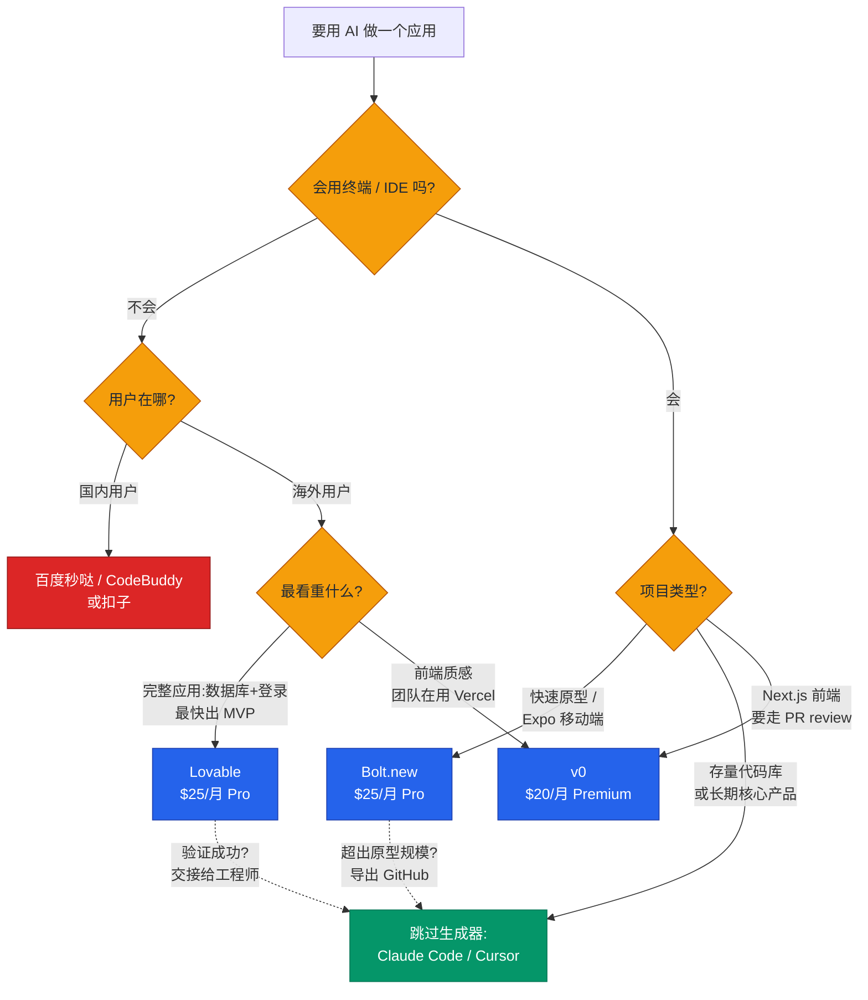
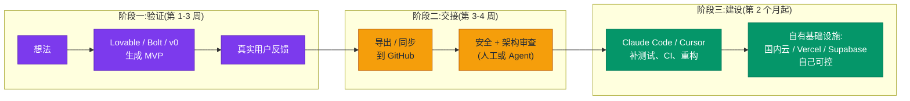

+++
date = '2026-07-08T12:00:00+08:00'
aliases = ['/posts/ai/2026-07-09-lovable-vs-v0-vs-bolt/']
draft = false
title = 'Lovable vs v0 vs Bolt:2026 AI 应用生成器怎么选'
description = 'Lovable、v0、Bolt 哪个好?不会写代码做全栈 MVP 选 Lovable,Vercel/Next.js 前端选 v0,要浏览器 IDE 和 Expo 移动端选 Bolt,会用终端直接上 Claude Code。附三种计费模式的隐藏成本、vercel.app 被墙等国内硬坑与国产替代。'
toc = true
tags = ['AI App Builder', 'Lovable', 'v0', 'Bolt.new', 'Vibe Coding']
keywords = ['lovable 评测', 'ai 建站工具对比 2026', 'v0 bolt 对比', 'ai 应用生成器', 'lovable 国内替代', 'ai 无代码开发工具', 'lovable v0 bolt 哪个好']

[[params.faqItems]]
question = "Lovable、v0、Bolt 三个哪个好?"
answer = "取决于你是谁:完全不会写代码、要快速做出带数据库和登录的完整应用,选 Lovable;做 Next.js 前端、团队已经在用 Vercel,选 v0;想要浏览器里的完整开发环境、或者要做 Expo 移动端,选 Bolt.new。会用终端的工程师,大多数情况下直接用 Claude Code 或 Cursor 更划算。"

[[params.faqItems]]
question = "Lovable 在国内能用吗?"
answer = "Lovable 官网国内可以访问,但注册和付费需要国际信用卡,底层依赖的 Supabase 国内访问延迟较高,部署产物默认在海外节点。做面向国内用户的产品,要考虑百度秒哒、腾讯 CodeBuddy(GenieAI)、扣子等国产替代,或者导出代码后自己部署到国内云。"

[[params.faqItems]]
question = "v0 生成的网站国内能访问吗?"
answer = "有坑:v0 默认部署到 Vercel,而 vercel.app 域名在国内长期无法直接访问。必须绑定自定义域名并配置合适的 DNS 解析才能让国内用户正常打开,这是很多人用 v0 做落地页后才发现的问题。"

[[params.faqItems]]
question = "AI 应用生成器做出来的代码能商用吗?"
answer = "代码所有权归你,三家都支持 GitHub 导出。但 Veracode 报告显示约 45% 的 AI 生成代码存在 OWASP 类安全漏洞,涉及支付或用户数据的应用,上线前必须做人工安全审查。导出代码也不等于架构自由:Lovable 深度绑定 Supabase,迁移后端是一个真正的工程项目。"

[[params.faqItems]]
question = "什么时候不该用 AI 应用生成器?"
answer = "四种情况:已经每天在用 Claude Code / Cursor 等编码 Agent;要改造现有代码库而不是从零开始;这个应用是你的长期核心产品;有合规或数据本地化要求。这些场景下应用生成器的托管便利反而是负担,终端 Agent 加自有基础设施是更好的选择。"
+++

先给结论,省你时间。完全不会写代码、这周就要把能用的产品摆到用户面前:选 **Lovable**,25 美元/月,数据库、登录、部署一条龙。团队在 Vercel 上跑 Next.js:选 **v0**,它是唯一把产出变成可 review PR 的生成器。想要浏览器里的完整开发环境、或者要做 Expo 移动端:选 **Bolt.new**。会用终端的工程师:三个都别买,Claude Code 或 Cursor 在成本和控制力上全面占优。

这就是 **Lovable、v0、Bolt** 选型的完整答案。对上号的,现在就可以关掉这篇。

还在看?那你要么卡在两条结论之间,要么想看到证据再下注。都合理——这个赛道现在声量大到失真:美国 Google Trends 上"loveable ai"这个**拼错的**搜索词本周又冲了一波,起因是这家公司[估值据报道要翻倍到 132 亿美元](https://techcrunch.com/2026/07/08/lovable-reportedly-in-talks-to-double-its-valuation-to-13-2b/),而它成立才十八个月。大量的人连名字都没拼对就冲进了搜索框。

所以这篇按速查手册写,不按测评写。表格优先,直接跳到你在纠结的那个工具,重点看计费部分——三个工具真正的差异不在功能列表,而在第一周结束之后,它们各自悄悄收你多少钱。国内用户特有的坑(国际信用卡、vercel.app 被墙、备案)和国产替代,正文里单独讲。

## Lovable vs v0 vs Bolt:30 秒速查表

| | Lovable | v0 | Bolt.new |
|---|---|---|---|
| 最适合 | 不会代码,要完整应用:数据库+登录+部署 | Vercel/Next.js 团队,要走 PR review | 快速做原型的开发者;唯一的 Expo 移动端路径 |
| 最不适合 | 长期维护的生产应用 | 不部署在 Vercel 的一切项目 | 超出原型规模的项目 |
| 付费起步 | $25/月 Pro | $20/月 Premium | $25/月 Pro |
| 招牌能力 | 聊着天从想法到上线全栈应用 | 每个对话是一个 Git 分支,以 PR 合并 | 浏览器标签页里跑真实 Node.js 环境 |
| 国内直用 | 官网可访问,付费要国际信用卡 | vercel.app 默认部署国内打不开 | 本地浏览器计算,网络依赖最轻 |
| 退出路径 | 把仓库交接给工程师 | 产出本来就是你仓库里的 PR | 在账单上翘之前导出 GitHub |

表里每一格下文都有展开和出处。只截一张图的话,截这张,加上后面那张计费翻车表。

## 三个物种,不是三个牌子

这张表之所以成立,是因为这三个不是同一产品的三个牌子,而是三个不同物种。选错物种比选错牌子亏得多——网上对这三家的差评,追根溯源大多是"物种错配",不是产品本身烂。

三家 20-25 美元/月的趋同定价强化了"它们是竞品"的错觉。拆开看,它们卖的是对三个不同问题的回答:

- **Lovable** 回答的是:"我有产品想法但不会写代码,帮我做出能用的应用。"对话式全栈生成,默认把代码藏起来,一条龙打包 React 前端 + Supabase 后端(PostgreSQL、登录鉴权、文件存储)+ 一键部署。它的工作单位是**一个产品决策**。
- **v0**(Vercel 出品)回答的是:"我要在 Vercel 生态里做生产级前端。"[2026 年 2 月的大改版](https://vercel.com/blog/introducing-the-new-v0)之后,每个对话独占一个 Git 分支、自动 commit、走 PR 合并,还能导入已有代码库。它的工作单位是**一个 Pull Request**。
- **Bolt.new**(StackBlitz 出品)回答的是:"我要一个跑在浏览器标签页里的完整开发环境。"基于 WebContainers 在浏览器里直接跑 Node.js,文件树全部可见可编辑,还支持 [Expo 做 React Native 移动端](https://expo.dev/blog/bolt-expo-integration-announcement)。它的工作单位是**一个代码库**。

有一样东西三家已经不比了:代码质量。底层都是前沿 Anthropic 模型,输出质量 2025 年就趋同了。还在分化的是两样——包在模型外面的工作流,以及项目变大之后各家怎么收你的钱。这篇文章的主菜就在这两样上。

## Lovable:出色的孵化器,别住在里面

Lovable 在这篇里占的篇幅最大,因为它的营销和现实之间的落差最大——两个方向都是。数据先摆出来:据 [TechCrunch 报道](https://techcrunch.com/2026/03/11/lovable-says-it-added-100m-in-revenue-last-month-alone-with-just-146-employees/),截至 2026 年 6 月约 5 亿美元 ARR,员工只有 146 人,刚关完 3.3 亿美元 B 轮。

这种收入结构说明了一切:钱不是开发者掏的,是全球"有想法但不会执行"的巨大人群掏的。按"非技术创始人的孵化器"这个标准评价,Lovable 是品类里最好的产品,每一分钱都挣得名副其实。

25 美元/月的 Pro 档([官方定价页](https://lovable.dev/pricing):每月 100 credits 加每日赠送)买到的是:聊着天就能得到完整应用——React 前端、真实的 PostgreSQL 数据库、能用的登录系统、文件存储、一键上线。计费按 credit:改个按钮颜色约 0.5 credit,"做个带图片的落地页"约 1.7 credit。

单人验证一个想法,一个月的迭代基本装得进 Pro 档。对比外包一个 MVP 动辄三五万人民币,这笔账不用多算。

但有个 Lovable 自己的营销绝不会说的硬判断:**Lovable 是验证工具,不是生产平台**。两个具体的坑等着没想明白这一点的人。

坑一:credit 消耗随应用复杂度非线性上涨。应用小的时候改什么都便宜;等几十个功能开始互相牵扯,每次修改要带的上下文更多、消耗更大、失败率也更高——第十周的迭代成本是第一周的好几倍。定价页不会给你画这条曲线,账单会。

坑二:安全。[Veracode 的 GenAI 安全报告](https://www.veracode.com/blog/)发现约 45% 的 AI 生成代码样本过不了安全测试,存在 OWASP 类漏洞。Lovable 的输出不例外,而它的目标用户恰恰是最没能力发现这些问题的人群。涉及支付或用户数据的应用,上线前的人工安全审查没有商量余地,为什么可以看我写的[安全 vibe coding 指南](/zh/posts/ai/2026-02-24-secure-vibe-coding/)。

**国内视角**再加三条:官网访问没问题,但付费需要国际信用卡;底层 Supabase 的国内访问延迟明显,面向国内用户的应用体验会打折;部署产物默认在海外节点,备案无从谈起。所以 Lovable 适合做**面向海外用户**的产品验证或内部演示;要做国内 C 端产品,要么验证完导出代码部署到国内云,要么看后面的国产替代。

**适合你**:不会代码、几天内要把能用的产品摆到用户或投资人面前、接受"成功了就交接给工程师"这个结局。**不适合你**:你本身是开发者(会整天跟抽象层打架),或者这个应用是你的长期核心业务。

## Bolt.new:开发者之选,账单会复利

Bolt 占第二大篇幅,因为它藏着整个品类最少被讲透的一个事实。先说它是什么,再揭这个底。

技术上 Bolt 是三者中最有意思的。StackBlitz 的 WebContainers 直接在浏览器标签页里启动真实的 Node.js 环境——不用远程虚拟机,不用等容器。文件树全可见、任何文件可手改、有终端。三个工具里只有 Bolt 用起来像 IDE 而不是聊天产品,这也精确圈定了它的物种:**想要 AI 速度、但不愿放弃代码可见性的开发者**。

它还握着整个品类最清晰的差异化能力:移动端。通过[与 Expo 的官方合作](https://expo.dev/blog/bolt-expo-integration-announcement),Bolt 能脚手架出带 Expo Router 和 NativeWind 的 React Native 项目,几分钟内用 Expo Go 在真机上跑起来。Lovable 和 v0 完全没有原生移动端路径。

但移动端的边界要说清楚,因为 Bolt 的营销不会说。WebContainers 跑不了 Xcode、Android Studio 和 EAS 构建管线——Bolt 给你的是 React Native **代码**,不是签名的安装包,上架 App Store 仍然要在自己机器上配 EAS。"不写代码从想法到应用商店"只在前 80% 的路程上成立,对最后 20% 保持沉默。

现在揭底,我直说:**Bolt 的 token 消耗跟项目大小挂钩,不跟需求大小挂钩**。它的大部分 token 花在把你的项目文件同步进模型上下文——同样是改一行字,第六周的花费远高于第一周,纯粹因为代码库长大了。

[官方定价](https://bolt.new/pricing)是 25 美元/月 1000 万 token,听着很多,但中等规模项目单条消息就能消耗六位数 token。[Banani 的成本分析](https://www.banani.co/blog/bolt-new-pricing)把这列为惊喜账单的头号来源。Bolt 用 token 顺延一个月和 diff 同步来缓解,但曲线的本质不变:**Bolt 在项目小的时候便宜,恰好在项目开始成功的时候变贵**。

国内访问方面,Bolt 的架构反而是优势:计算在本地浏览器里跑,网络依赖比另外两家轻,主要瓶颈在模型请求和 npm 源(可以换国内镜像)。

**适合你**:跨框架快速做原型的开发者、要走 Expo 移动端、或者要把一个能跑的全栈 demo 用浏览器标签页丢给别人。**不适合你**——更准确说,要提前规划的时刻:项目超出原型规模。到那一步就导出 GitHub,换真正的 Agent 工具继续,文末的管线专门讲这个交接。

## v0:Vercel 用户的最优解,也只属于 Vercel 用户

v0 的篇幅最短,不是因为它最弱——在自己的生态位里它可能是三者中最专业的——而是因为它的决策没有中间地带。你是 Vercel/Next.js 团队,它就是最优解;不是,就别碰。没什么好纠结的。

这个产品在 2026 年 2 月变了,而且变得很关键。v0 在 2024-2025 年一直被定型为"React 组件生成器",说实话当时这个定型是公允的。[全新的 v0](https://vercel.com/blog/introducing-the-new-v0) 是另一个物种:沙箱运行时对齐真实部署环境、原生 GitHub 集成(每个对话一个分支、PR 合并)、VS Code 风格编辑器、数据库连接,以及最有战略意味的——**可以导入已有代码库**,不再只能从零生成。

导入已有代码库这个功能重新划定了赛道。Lovable 和 Bolt 是项目"出生"的地方,v0 把自己定位成往现有产品上"续建"的地方:一个跑在 Vercel 上的 Next.js 团队,设计师或产品经理打开 v0 描述一个新的设置页,产出的是一个工程师可以按正常流程 review 的真实 PR。三个工具里只有 v0 有一等公民级的 Git 语义,这恰恰化解了 AI 生成工具最恶心的问题——产出物锁在一个团队没人能审的花园里。

代价有两个,都真实。第一,**生态引力**:没有合同意义上的锁定,但一切默认假设都是 Next.js + Vercel,想用 v0 做部署到阿里云或 AWS 的项目等于逆流游泳。第二,**计费不可预测**:v0 改成按 token 折算 credit,社区价格追踪站[记录到 2026 年初费率大约翻倍](https://costbench.com/software/ai-coding-assistants/v0-vercel/)而套餐标价不动。简单组件几分钱,复杂的多文件生成几个 prompt 就能吃掉 20 美元月度额度的一大块,而且跑完才知道花了多少。我在 [Claude Code vs Cursor vs Windsurf 对比](/zh/posts/ai/2026-02-18-claude-code-vs-cursor-vs-windsurf-2026/)里说过:不可预测的计量会让人"省着问",迭代自由度没了,工具的意义就打了对折。

**国内视角有个致命细节**:v0 生成的项目默认部署到 Vercel,而 **vercel.app 域名在国内长期无法直接访问**。很多人用 v0 快速做了个落地页发到群里,才发现国内用户全部打不开。解法是绑自定义域名加配置 DNS,但这已经超出"非技术用户"的舒适区。所以国内业务用它写组件、拿代码可以,别指望它的部署链路。

**适合你**:团队在 Vercel/Next.js 上出货、在乎代码质量和 PR review、工作量大头在前端。**不适合你**:要最快出完整独立应用(Lovable 更快),或者技术栈不是 Next.js(生态引力会把你耗死)。

## Lovable、v0、Bolt 计费对比:三种翻车姿势

功能清单放一边,计费模式才是三个产品真正分道扬镳的地方。值得截图的第二张表——不比功能,比**翻车姿势**:

| | Lovable | v0 | Bolt.new |
|---|---|---|---|
| 付费起步 | $25/月(100 credits+每日赠送) | $20/月($20 额度) | $25/月(1000 万 token) |
| 计费单位 | 按任务扣 credit | token 折算 credit | token |
| 成本驱动因素 | 任务复杂度 | 模型档位 × 生成量 | **项目体积**(文件同步) |
| 翻车姿势 | 应用变复杂后每次修改都贵 | 跑完才知道花多少 | 同样的修改越到后期越贵 |
| 额度顺延 | 有限(1-2 个月) | 每月清零 | 付费 token 顺延 1 个月 |
| 团队档 | $50/月 Business | $30/人 Team | $30/人 Teams |
| 付款方式 | 国际信用卡 | 国际信用卡 | 国际信用卡 |

三家共用一条规律:**入门定价是围绕"第一周的用量"设计的,而单位进度成本都随应用成熟而上涨**。这不算黑幕——上下文真的贵,他们只是把前沿模型的 token 成本传导给你——但它决定了正确的心智模型:为冲刺付费,不为马拉松付费。

这三个工具的最佳状态都在项目生命周期的前 2-4 周。开工前就规划好退出点,这个价格没毛病;拖到第四个月还在里面维护生产应用,你就在用聊天机器人的人体工学,付外包公司的价钱。

## 能导出代码 ≠ 架构自由

三家都支持 GitHub 同步,营销页都写着"代码归你所有"。技术上没错,实践上误导——这是最值得拆掉的一个误区。

拿到仓库只是容易的那 20%,你拿不到的是**架构独立性**。Lovable 生成的不是"恰好用了 Supabase 的 React 应用"——它的登录流程、行级安全策略、存储规则、边缘函数全部编织在 Supabase 的特定模型里,[第三方对迁移路径的审计](https://wz-it.com/en/blog/lovable-vs-bolt-vs-v0-comparison-2026/)的结论是:换后端"远不止导出几张表",是重新架构。v0 的产出默认 Next.js 约定,最顺滑的归宿是 Vercel。Bolt 最可迁移——标准框架的普通代码,这也是它是开发者之选的又一个理由——但即便 Bolt,项目也继承了 AI 在第一分钟替你选的服务绑定(Supabase、Netlify、Stripe):你没主动做过的决策,会跟着你很多年。

我的原则:**评估这类工具,看离开的成本,别看加入的成本**。加入花 25 美元,带着一个成功的产品离开 Lovable 要花一次真正的工程改造。这个不对称才是真实价签——说句公道话,这也正是 132 亿美元估值背后的完整商业模式:离开成本就是护城河。

## 什么时候三个都别用:Claude Code 边界线

大多数对比文章不写这一节,因为写了就没法挂返佣链接:**对一大类用户,"Lovable vs v0 vs Bolt"的正确答案是"都不用"**。

边界线我这样画。应用生成器打包卖三样东西:AI 编码模型、托管环境(部署、数据库、域名)、隐藏文件的聊天抽象层。模型已经不是差异点——Claude Code、Cursor 和这三家用的都是前沿模型。所以你真正花钱买的是环境和抽象层。

如果这两样你本来就有——会用终端,知道 `git push` 和部署是什么——那这个打包对你就是纯粹的开销,终端原生的 Agent 给你严格更多的控制,成本曲线还更平。具体工作流我在 [Claude Code 完全指南](/zh/posts/ai/2026-02-28-claude-code-complete-guide/)里写透了;我在 [2026 Agentic Coding 趋势](/zh/posts/ai/2026-02-23-agentic-coding-trends-2026/)里描述的趋势只在加速:Agent 在不断吞掉生成器的地盘——也能部署、也能开浏览器、也能管基础设施,Vercel 自己都推出了[面向 Agent 的浏览器工具链](/zh/posts/ai/2026-01-13-vercel-agent-browser/),方向再明显不过。

具体来说,满足以下任何一条就跳过这三个生成器:

1. **你已经每天在用编码 Agent**。Claude Code 配一个 Supabase MCP server 能复刻 Lovable 九成的后端接线,而且在你自己的机器、自己的仓库、自己的 review 流程里。
2. **项目是存量改造,不是从零开始**。三家里只有 v0 勉强支持导入已有代码库,Agent 生来就是干这个的。
3. **这个应用是你的长期核心产品**。架构决策、测试、CI、可观测性——聊天抽象层全都做不好。
4. **有合规、备案或数据本地化要求**。托管生成器的便利,恰恰是监管要求你必须自己掌握的控制权。

反过来也要诚实:如果动手的人是设计师、产品经理、永远不会打开终端的创始人,Claude Code 再强也与他无关。对这些人,抽象层不是开销,就是产品本身。工具判断本质上是用户判断。

## 国产替代:用户在国内就看这里

面向国内用户的产品,三个海外工具的短板(付费、延迟、vercel.app 被墙、备案)会叠加放大,这时候国产替代值得认真看:

- **百度秒哒**:自然语言对话生成网站、H5、微信小程序——"要做小程序"这个国内高频需求,三个海外工具完全覆盖不了;
- **腾讯云 CodeBuddy / GenieAI**:对标 Lovable 的"想法到上线"全链路,全栈生成加直接上线,背靠腾讯云生态,备案链路顺;
- **扣子(Coze)**:严格说是 Agent 搭建平台而非应用生成器,但很多"我要个 AI 应用"的需求本质是 Agent 需求,在扣子上成本更低。

我的判断标准很简单:**用户在哪,工具就在哪**。海外用户,Lovable/v0/Bolt 加自定义域名;国内用户,要么国产平台,要么海外工具只当"代码草稿机"——生成完导出,部署自己来。最差的选择是用海外工具的默认部署链路服务国内用户,等于把产品体验押在一条你完全不可控的网络路径上。

## 选型决策树

把上面所有判断压缩成一张图,这是我会发给朋友的版本:

两条虚线箭头是整张图最重要的部分:**每一个成功的生成器项目,最终都会流向 Agent 工作流**。生成器是匝道,不是目的地。

## 从原型到生产:交接管线

所以我在 2026 年真正推荐的不是"选一个工具",而是"设计一条带交接点的管线"——这是我从[原型到生产](/zh/posts/ai/2026-03-09-prototype-to-production/)那篇之后持续打磨的流程:

整条管线杠杆最大的一步,是**按时执行阶段二的交接**——赶在 credit/token 成本曲线上翘之前、赶在没人记录的架构决策固化之前。把生成器当一次性草稿用的团队,长期看总是赢过想把它用成永久平台的团队。

## 最后再念一遍结论

- **Lovable**——2026 年非技术创始人的最佳选择,没有之一。按 3-4 周的验证冲刺预算 25-50 美元/月,提前规划工程交接。5 亿美元 ARR 名副其实,但别把出色的孵化器错当成生产平台。国内 C 端产品慎用其默认部署。
- **v0**——Vercel/Next.js 生态内前端工程师和产品团队的最佳选择,2 月改版后是唯一能融入专业 PR 流程的生成器。留意 token 计费,以及 vercel.app 在国内不可访问的硬坑。
- **Bolt.new**——想要浏览器原生环境的开发者之选,也是唯一的 Expo 移动端路径。在项目变大之前导出,否则文件同步的 token 曲线会教你做人。
- **都不用**——已有 Agent 工具链的工程师、存量代码库、合规场景的正确答案。Claude Code / Cursor 加自有基础设施,在控制力、成本曲线和长期性上全面占优。
- **国产替代**——用户在国内、要做小程序、要备案,直接看秒哒 / CodeBuddy / 扣子,别硬凹海外链路。

市场会持续告诉你这些工具在取代开发者。盯着这个赛道十八个月,我的结论几乎相反:它们是有史以来通往软件工程的最宽漏斗——数以百万计被验证过的原型,最终全都需要工程师(以及工程级的 Agent)提供的那些东西。按物种选工具,按用户选物种。

## Related Reading

- [Claude Code vs Cursor vs Windsurf:2026 对比](/zh/posts/ai/2026-02-18-claude-code-vs-cursor-vs-windsurf-2026/)
- [Claude Code 完全指南](/zh/posts/ai/2026-02-28-claude-code-complete-guide/)
- [2026 Agentic Coding 趋势](/zh/posts/ai/2026-02-23-agentic-coding-trends-2026/)
- [Vercel Agent Browser 意味着什么](/zh/posts/ai/2026-01-13-vercel-agent-browser/)
- [从原型到生产](/zh/posts/ai/2026-03-09-prototype-to-production/)
- [安全 Vibe Coding 指南](/zh/posts/ai/2026-02-24-secure-vibe-coding/)
