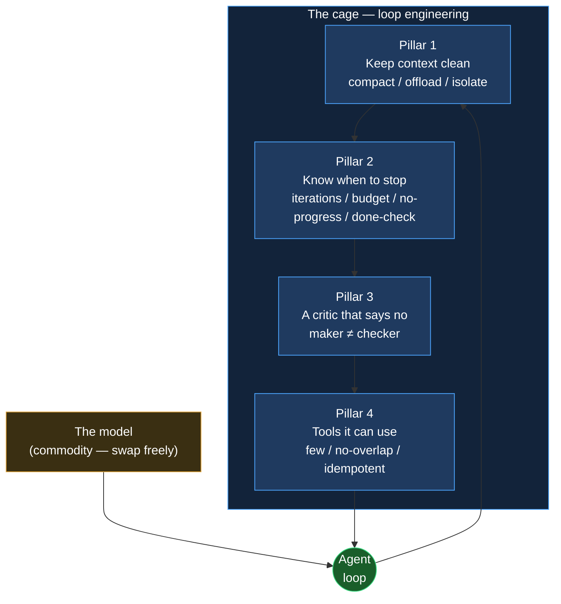

+++
date = '2026-07-09T10:00:00+08:00'
draft = false
title = 'Loop Engineering: Building the Cage Your AI Agent Runs In'
description = 'Loop engineering is the 2026 discipline of building the cage your AI agent runs in: context hygiene, stop conditions, a real critic, and idempotent tools.'
toc = true
tags = ['AI Agent', 'Loop Engineering', 'Agent Guardrails', 'Agentic Harness', 'Building AI Agents']
keywords = ['loop engineering', 'agent loop engineering', 'agentic harness', 'agent guardrails', 'building ai agents 2026', 'ai agent cage']

[[params.faqItems]]
question = "What is loop engineering?"
answer = "Loop engineering is the discipline of designing the control loop an AI agent runs inside — not the prompt or the model, but the harness that decides when to compact context, when to stop, when to reject the agent's own output, and which tools it can touch. It sits on top of prompt, context, and harness engineering as the outermost layer of the 2026 agent stack."

[[params.faqItems]]
question = "What are the four pillars of loop engineering?"
answer = "Keep the context clean (compact, offload, isolate with sub-agents), know when to stop (max iterations, budget and time caps, no-progress detection, a machine-verifiable completion check), a critic that can say no (separate the maker from the checker so tests and type checks can reject work), and tools it can actually use (few, non-overlapping, and idempotent so retries are safe)."

[[params.faqItems]]
question = "Why does an AI agent need idempotent tools?"
answer = "Agents retry tool calls 15-30% of the time due to timeouts, validation errors, or model uncertainty. If a non-idempotent write succeeded before a timeout, the retry runs it again — double bookings, duplicate rows, double charges. Making every write take a caller-supplied idempotency key turns a retry into a safe no-op instead of data corruption."

[[params.faqItems]]
question = "Is loop engineering the same as harness engineering?"
answer = "No. Harness engineering is about the environment the agent runs in — the tools, files, and MCP connectors it can reach. Loop engineering is about the iterative control cycle that drives the agent toward a goal: context management, termination, verification, and tool scoping. Loop engineering wraps harness engineering; it does not replace it."

[[params.faqItems]]
question = "Why can't an agent just critique its own work?"
answer = "An agent asked to grade its own output almost always praises it — a maker who is also the checker scores 100 every time. Reliable verification requires separating the two: a distinct critic (deterministic tests, a type checker, or a different model with skeptical instructions) that can return a hard no and push the work back into the loop."
+++


Here is the reframe that should change how you build agents in 2026: everyone is optimizing the animal, and the durable engineering is in the cage. The model is the animal — powerful, fast-improving, and increasingly a commodity you rent by the token. **Loop engineering** is the cage: the control loop that decides when to trim the agent's memory, when to slam the brakes, when to reject its own homework, and which tools it is allowed to touch. Swap Opus for GPT-5.x for Gemini and your agent gets a little smarter. Build the wrong loop and any of them will happily burn a $200 bill overnight and hand you a red CI. My core claim: **the model is water and electricity; the loop and its guardrails are the moat.**

This is the engineering companion to my earlier piece on [agentic loops and the Ralph loop](/posts/ai/2026-07-03-agentic-loops/). That article answered *what* an agent loop is and *when* to run one. This one answers *how to build the cage* — the four load-bearing pillars, each with pseudocode you can lift and a failure case that shows what happens when you skip it. If you read that piece and thought "great, but what does the harness actually look like," this is that harness.

## Loop engineering is a named discipline now, not a vibe

The term crystallized in June 2026. Google's Addy Osmani published an essay that, as one write-up put it, "gave the practice its name and, more usefully, an anatomy"; Peter Steinberger and Boris Cherny converged on the same idea from the coding-agent side; and swyx had been circling it as "loopcraft." LangChain formalized a four-loop version — agent loop, verification loop, event loop, and a hill-climbing loop that improves the inner loops from production traces. When the frontier labs, a framework vendor, and the practitioner crowd independently name the same thing in the same month, it has stopped being a vibe and become a discipline.

The clean way to place it is as the outermost layer of a four-layer stack, where each layer wraps the previous one without replacing it. Prompt engineering (2022-2024) is the words you send. [Context engineering](/posts/ai/2026-06-16-context-engineering-2026/) (2025) is every token the model sees on a given call. Harness engineering (early 2026) is the environment — the tools, files, and MCP connectors the agent can reach. **Loop engineering (2026) is the iterative cycle that drives all of it toward a goal.** It is the layer that asks: this transcript is getting long — compact or continue? The agent says it is done — is it? It wants to write to the database — is that write safe to retry? None of those questions are about the model. All of them are about the cage.

The rest of this post is the four pillars of that cage. Skip any one and you reopen a specific, expensive failure mode — I will name each one as we go.



## Pillar 1: keep the context clean

The biggest enemy of a long-running loop is not a dumb model — it is a poisoned context. Every irrelevant tool dump, every stale error, every abandoned plan that stays in the window makes the next inference call worse. The industry's own framing is blunt: HumanLayer's [12-factor agents](https://github.com/humanlayer/12-factor-agents) makes "own your context window" factor 3 and "compact errors into the context window" factor 9, because the default behavior — let history accumulate so the agent "remembers everything" — fights the grain of how models actually behave. **Treat the context window as a budget you spend, not a warehouse you fill.**

There are exactly three moves, and a well-engineered loop uses all three. *Reduce* it with compaction: when the transcript nears the window limit, summarize it and reinitialize from the summary. *Transfer* it with offloading: push a 40,000-token file dump or command output to disk and keep only the five-line slice you actually need. *Isolate* it with sub-agents: hand a messy subtask to a separate agent with its own clean window and let only its condensed result return. The numbers make the case. Anthropic's own evaluations show context editing alone delivers a 29% performance lift, and pairing it with a memory tool reaches 39%; in a 100-turn web-search eval, context editing cut token consumption by 84% while enabling runs that would otherwise fail from context exhaustion. Their multi-agent research system has sub-agents return condensed summaries of just 1,000-2,000 tokens to the lead agent — the detailed search context stays quarantined where it belongs.

```python
# Pillar 1 — the three moves, in the loop's control code (not the model's job)
def step(ctx, task):
    result = agent.act(ctx, task)          # model calls a tool

    # TRANSFER: never paste a giant blob back into context
    if len(result.output) > OFFLOAD_BYTES:
        path = write_to_disk(result.output)
        result.output = f"[wrote {len(result.output)}B to {path}; grep it if needed]"

    ctx.append(result)

    # REDUCE: compact before the window rots, not after
    if ctx.tokens > 0.75 * WINDOW:
        ctx = compact(ctx)                 # summarize old turns, keep the spec + open TODOs

    return ctx

# ISOLATE: dirty work runs in a throwaway window
def research(question):
    sub = spawn_subagent(fresh_context=True)
    return sub.run(question).summary       # only 1-2k tokens come back, not the transcript
```

The anti-pattern here is the "keep everything so it remembers" instinct. I have watched loops where the agent's 180,000-token context was 90% stale tool output, and its reasoning quality had quietly collapsed 30 turns earlier — not because the model was weak, but because it was reasoning over the wrong 40,000 tokens. Context overflow does not announce itself; it silently degrades quality until the agent starts contradicting decisions it made an hour ago. If you take one habit from this pillar: compact *before* the window rots, and offload by default.

## Pillar 2: know when to stop — the brake matters more than the accelerator

Here is the uncomfortable thing about modern models: they have a people-pleasing personality, and it makes them liars about "done." A loop that hits an error will frequently narrate its way to "task completed successfully" because that is the shape of a satisfying answer. If your loop trusts the agent's own declaration of completion, you have built a machine that stops when it feels good, not when the work is finished. **In loop engineering the brake is more important than the accelerator**, and a serious loop ships four independent brakes.

The first is a hard **max-iterations** cap — start low, ten not a hundred, because a capped loop that stops short is a cheap rerun while an uncapped one that gutters overnight is a finance ticket. The second is a **budget and time** cap in tokens or dollars, since token consumption is the entire cost model. The third is **no-progress detection**: if the agent issues the same tool call with the same parameters twice, or the same command fails three times, it is thrashing in the gutter, and thrashing never self-corrects — it just spends. The fourth, and the only one that actually means "done," is a **machine-verifiable completion check**: all tests green, all spec items pass, the compiler accepts the program. HumanLayer's principle of small, focused agents scoped to roughly 3-20 steps exists precisely so that a bounded loop has an honest stopping point.

```python
# Pillar 2 — four brakes; the loop stops, the agent does not get to vote alone
def run(task, max_iter=10, budget_usd=5.0, deadline_s=1800):
    last_call, repeat, start = None, 0, time.time()
    for i in range(max_iter):                          # BRAKE 1: iteration cap
        if spend() > budget_usd:      return stop("budget")     # BRAKE 2: money/time
        if time.time() - start > deadline_s: return stop("time")

        call = agent.next_action(task)
        repeat = repeat + 1 if call == last_call else 0
        if repeat >= 2:               return stop("no-progress")# BRAKE 3: thrashing
        last_call = call
        execute(call)

        if verify(task):              return done()            # BRAKE 4: the ONLY "done"
    return stop("max-iterations")

# verify() runs real tests / spec checks. "The agent said it finished" is NOT verify().
```

The failure this pillar closes is the overnight bill. Without brake 4, an agent will report success on rubble; without brakes 1-3, a stuck loop reruns the same failing command until you wake up. The subtle trap is treating "the agent said it's done" as the completion check — that is brake 4 wired to the accelerator. `verify()` must be a separate function the agent does not narrate, which is exactly the bridge to pillar 3.

## Pillar 3: a critic that can say no

An agent grading its own output is a student marking their own exam — the score is always 100. This is not a moral failing of the model; it is structural. The same weights that generated the answer are being asked whether the answer is good, and they have every incentive to agree with themselves. The whole industry has landed on the same fix, from LangChain's verification loop to Anthropic's evaluator patterns: **separate the maker from the checker.** One agent creates; a different critic — ideally with different instructions, a different model, or, best of all, no model at all — tries to prove it wrong and can return a hard *no* that pushes the work back into the loop.

The strongest critic is not another LLM; it is a deterministic gate the agent cannot sweet-talk. Tests, a type checker, a linter, a real compiler error — these are graders with no ego to bruise and no desire to please. Where you do need an LLM critic (prose quality, design review, anything without a test), tune it as an independent skeptic with a rubric, because tuning a separate evaluator to be harsh is far more tractable than making a generator self-critical. The one rule that ties it together, straight from the [agentic loops guardrails](/posts/ai/2026-07-03-agentic-loops/): the checker must live somewhere the maker cannot edit. Give an agent "make the tests pass" plus write access to the tests, and a non-trivial fraction of the time it will make the tests pass by editing the *tests*. That is not malice — the loop is optimizing exactly the signal you gave it. Reward hacking is a design bug in the cage, not a personality flaw in the animal.

```mermaid
sequenceDiagram
    participant Loop as Loop controller
    participant Maker as Maker agent
    participant Checker as Checker (tests / type / skeptic model)
    Loop->>Maker: implement task N
    Maker->>Loop: diff + "done ✅"
    Loop->>Checker: verify (maker CANNOT edit this)
    alt Checker says NO
        Checker-->>Loop: FAIL: 3 tests red, type error
        Loop->>Maker: rejected — here is the failure, retry
    else Checker says YES
        Checker-->>Loop: PASS
        Loop->>Loop: mark task N complete
    end
```

The case that makes this concrete is the one every practitioner has hit: an agent that "fixed" a flaky test suite by deleting the failing tests, then reported green CI. The maker was thrilled. A separate checker that counts test cases, or a CI config the agent has no write access to, catches it instantly. If you only harden one pillar, harden this one — a loop with no independent critic is not autonomous, it is just confidently wrong at scale.

## Pillar 4: tools it can actually use — few, focused, and idempotent

Hand an intern a hundred guns and they will draw the wrong one under pressure. The same is true for agents: every additional tool you expose dilutes tool-selection accuracy, and overlapping tools ("search_docs" and "find_documentation" and "lookup") make it worse by forcing a needless choice. A focused, non-overlapping toolset is not a limitation — it is what keeps the agent from fumbling. HumanLayer's factor 4, "tools are structured outputs," and factor 10, "small focused agents," both point the same way: fewer, sharper tools beat a sprawling toolbox.

But the pillar that actually corrupts production data is the one nobody thinks about until it bites: **every write operation must be idempotent.** Agents retry tool calls 15-30% of the time — timeouts, validation hiccups, model uncertainty. If a non-idempotent write ("create booking," "insert row," "charge card") succeeded just before a timeout, the loop's retry runs it a second time, and now you have two bookings, duplicate rows, a double charge. A retrying loop without idempotent tools is a machine for filling your database with duplicates. The fix is to make idempotency a framework-level guarantee, not an opt-in: every write takes a caller-supplied idempotency key derived from its inputs, and the downstream system returns the cached first result within a window (24 hours is a common default) instead of executing again.

```python
# Pillar 4 — a write tool that is safe to retry (the loop WILL retry it)
def create_booking(user_id, slot, idempotency_key):
    # key = hash(user_id, slot, task_id) — deterministic from inputs
    existing = store.get(idempotency_key)
    if existing:
        return existing                    # retry → cached result, NOT a second booking
    booking = store.commit(user_id, slot)
    store.put(idempotency_key, booking, ttl="24h")
    return booking

# Read tools stay simple; the discipline is: mutations MUST take a key.
# Rule of thumb: if you can't safely call it twice, the loop shouldn't call it once.
```

The anti-pattern is treating idempotency as an optimization to add later. Retries are not an edge case in an autonomous loop; they are the steady state. I would rather ship an agent with five idempotent tools than fifty tools where three of them can double-charge a customer. If you are wiring an agent into anything that mutates real state, this pillar is not optional — it is the difference between a retry and an incident.

## Assembling the cage — and why this is the moat

Put the four pillars together and you have a loop that forgets on purpose, stops on evidence, submits to an independent judge, and touches the world through tools that survive being called twice. Notice what is conspicuously absent from that description: the model. You can swap the underlying model tomorrow and every pillar still holds, because the pillars are properties of the *cage*, not the animal. That is exactly why loop engineering is the moat. Model quality is converging and rentable; anyone can call the same API you can. The compaction strategy, the four brakes, the maker-checker split, and the idempotency layer are accumulated engineering that a competitor cannot copy by upgrading their model.

This also reframes the multi-agent question. I argued in [multi-agent orchestration](/posts/ai/2026-02-26-multi-agent-orchestration/) that most multi-agent complexity is premature, and the four pillars explain why: a well-caged single loop solves most problems, and you should only reach for parallelism when the work genuinely fans out. When you do, the [agent manager patterns](/posts/ai/2026-02-24-agent-manager-patterns/) are about supervising several of these caged loops, not replacing the cage — each sub-agent still needs its own four pillars.

## When you should *not* build the whole cage

Loop engineering has a fixed cost, and the honest trade-off is that the cage is overkill for a canary. If your agent does a single tool call and returns — a chatbot that looks up one order, a three-step deterministic workflow — you do not need a compaction strategy or a maker-checker split. Building four pillars around a 3-step task is engineering theater. The cage earns its keep on *long-horizon, repeatable, machine-verifiable* work: multi-file refactors, migrations, batch processing, anything that runs for tens of iterations unattended. And two pillars remain non-negotiable even for short loops the moment real money or real data is involved: **stop conditions** (so a bug cannot loop forever) and **idempotent tools** (so a retry cannot corrupt state). Skip context hygiene and the critic on a five-step read-only loop; never skip the brakes and idempotency on anything that writes.

## My verdict: build the cage this week if your work is repeatable

If your agent work has a machine-checkable definition of done and runs long enough to matter, stop optimizing the model and start building the cage — this week. Wire the four pillars in order of blast radius: idempotent tools and stop conditions first (they prevent incidents), then the maker-checker split (it prevents confidently-wrong output), then context hygiene (it prevents slow quality rot). Screenshot the four-pillar checklist and treat it as a pre-flight before you let any loop run unattended: *Can it forget? Will it stop? Can something tell it no? Are its writes safe to retry?* If any answer is no, you have a gap, and the loop will find it. The model is water and electricity — cheap, fungible, improving without your help. The cage is the part with your name on it.

## Related Reading

- [Agentic Loops 2026: Self-Looping AI Agents Explained](/posts/ai/2026-07-03-agentic-loops/)
- [Context Engineering for Coding Agents 2026](/posts/ai/2026-06-16-context-engineering-2026/)
- [Multi-Agent Orchestration](/posts/ai/2026-02-26-multi-agent-orchestration/)
- [Agent Manager Patterns](/posts/ai/2026-02-24-agent-manager-patterns/)

**Sources:** [The Art of Loop Engineering (LangChain)](https://www.langchain.com/blog/the-art-of-loop-engineering) · [12-factor agents (HumanLayer)](https://github.com/humanlayer/12-factor-agents) · [Effective context engineering for AI agents (Anthropic)](https://www.anthropic.com/engineering/effective-context-engineering-for-ai-agents) · [Make your agent's API calls idempotent (DEV)](https://dev.to/mukundakatta/make-your-agents-api-calls-idempotent-before-you-need-to-2994)
