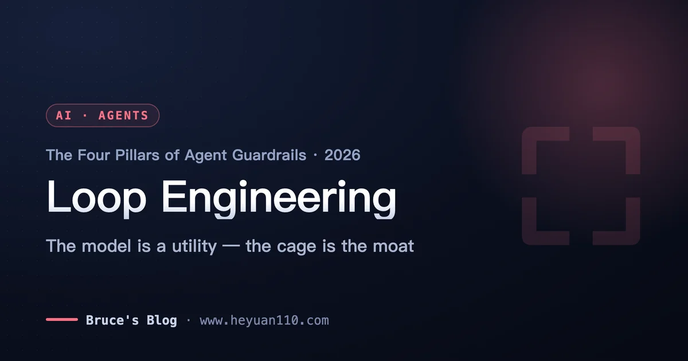
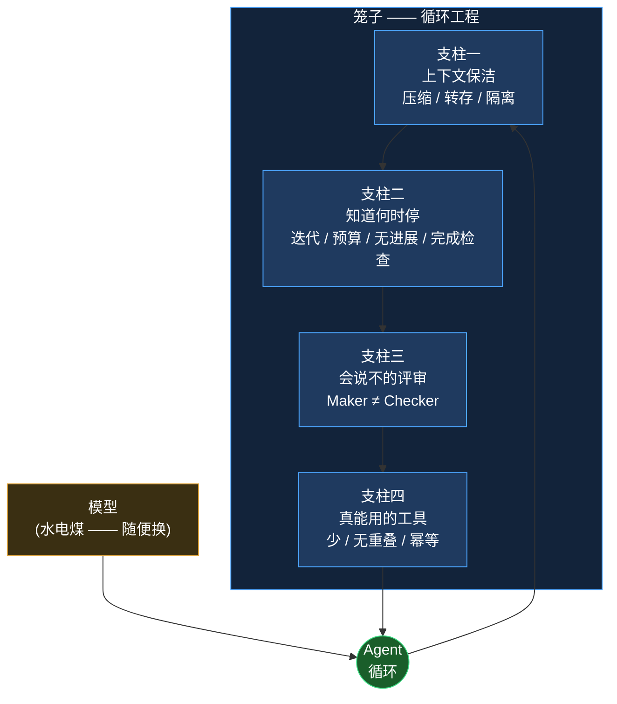

+++
date = '2026-07-09T10:00:00+08:00'
draft = false
title = 'Loop Engineering 循环工程:给 AI Agent 造一个笼子'
description = '循环工程(Loop Engineering)是 2026 年 AI Agent 工程栈的最外层学科。四大支柱——上下文保洁、刹车机制、毒舌评审、幂等工具——每根都配可直接抄的伪代码和真实翻车案例。核心立场:模型是水电煤,循环护栏才是护城河。'
toc = true
tags = ['AI Agent', 'Loop Engineering', 'Agent Guardrails', 'Agentic Harness', 'Building AI Agents']
keywords = ['循环工程', 'loop engineering', 'agent 护栏', '智能体工程', 'agent 笼子', 'agent loop 工程']

[[params.faqItems]]
question = "什么是循环工程(Loop Engineering)?"
answer = "循环工程是设计 AI Agent 运行所在的那个控制循环的学科——不是调 prompt、也不是换模型,而是造那个决定「何时压缩上下文、何时刹车、何时打回 Agent 自己的作业、能碰哪些工具」的笼子。它叠在 prompt 工程、上下文工程、harness 工程之上,是 2026 年 Agent 技术栈的最外层。"

[[params.faqItems]]
question = "循环工程的四大支柱是什么?"
answer = "一是保持上下文干净(Compact 压缩、Offload 转存、Sub-agent 隔离脏活);二是知道何时停(最大迭代数、预算与时间上限、无进展检测、机器可验证的完成检查);三是引入能说「不」的评审(分离 Maker 和 Checker,让测试/类型检查能打回);四是给它真能用的工具(少而精、无重叠、写操作幂等,重试才安全)。"

[[params.faqItems]]
question = "为什么 AI Agent 的工具必须做成幂等的?"
answer = "Agent 有 15%-30% 的概率会重试工具调用(超时、校验失败、模型犹豫)。如果一个非幂等的写操作在超时前其实已经成功,重试就会再执行一遍——重复下单、重复插行、重复扣款。给每个写操作加一个由入参推导的幂等键,重试就从「数据污染」变成了「安全空操作」。"

[[params.faqItems]]
question = "循环工程和 harness 工程是一回事吗?"
answer = "不是。Harness 工程管的是 Agent 运行的环境——它能碰的工具、文件、MCP 连接器。循环工程管的是驱动 Agent 走向目标的那个迭代控制环:上下文管理、终止、验证、工具收敛。循环工程包住 harness 工程,而不是取代它。"

[[params.faqItems]]
question = "为什么不能让 Agent 自己评审自己的产出?"
answer = "让 Agent 给自己的产出打分,几乎永远是满分——同一个 Maker 又当 Checker,自评永远 100。可靠的验证必须把两者分开:一个独立评审(确定性测试、类型检查,或换一个带毒舌指令的模型)能给出一个硬性的「不」,把作业打回循环重写。"
+++



先给一个能改变你 2026 年造 Agent 方式的重新定位:所有人都在优化那头野兽,而真正有沉淀的工程在笼子里。模型是那头野兽——强、迭代快、而且越来越是一种按 token 租的水电煤。**循环工程(Loop Engineering)是那个笼子**:决定何时给 Agent 的记忆瘦身、何时急刹、何时打回它自己交的作业、允许它碰哪些工具的控制循环。把 Opus 换成 GPT-5.x 换成 Gemini,你的 Agent 会聪明一点点;但笼子造错,它们中任何一个都会心甘情愿地在一夜之间烧掉 $200,再甩给你一个红色的 CI。我的核心立场:**模型是水电煤,循环和它的护栏才是护城河。**

这是我之前那篇[《Agentic Loops:自循环 AI Agent 全解》](/posts/ai/2026-07-03-agentic-loops/)的工程姊妹篇。那篇回答的是 Agent 循环「是什么」以及「何时该跑」。这篇回答的是「怎么造这个笼子」——四根承重的支柱,每根都配一段能直接抄走的伪代码,和一个跳过它就会翻车的真实案例。如果你读完那篇想的是「道理我懂了,可 harness 到底长什么样」,这篇就是那个 harness。

## 循环工程已经是一门有名字的学科,不是玄学

这个词在 2026 年 6 月定型。Google 的 Addy Osmani 写了一篇文章,用一篇解读的话说「给了这门实践一个名字,更有用的是给了它一套解剖学」;Peter Steinberger 和 Boris Cherny 从编码 Agent 那一侧收敛到同一个想法;swyx 更早就在用「loopcraft(循环术)」绕着它转。LangChain 干脆把它形式化成四层循环——Agent 循环、验证循环、事件循环,以及一个从生产 trace 里反向改进内层循环的爬山循环。当前沿实验室、框架厂商和一线实践者在同一个月里各自独立给同一样东西命名时,它就已经从玄学变成学科了。

摆放它最干净的方式,是把它当成一个四层栈的最外层,每一层包住前一层而不取代它。Prompt 工程(2022-2024)是你发出去的词。[上下文工程](/posts/ai/2026-06-16-context-engineering-2026/)(2025)是模型在某次调用里看到的每一个 token。Harness 工程(2026 年初)是环境——Agent 能碰的工具、文件、MCP 连接器。**循环工程(2026)是驱动这一切走向目标的迭代循环。** 它是那个负责发问的层:这段对话越来越长了——压缩还是继续?Agent 说它做完了——真的吗?它想写数据库——这个写操作重试安全吗?这些问题没有一个是关于模型的,全都是关于笼子的。

本文剩下的部分就是这个笼子的四根支柱。缺任何一根,你就重新打开一个具体而昂贵的翻车模式——我会逐一点名。



## 支柱一:别让上下文馊掉

长循环最大的敌人不是笨模型,而是一份被污染的上下文。每一坨没用的工具输出、每一条过期的报错、每一个被放弃却还赖在窗口里的旧计划,都会让下一次推理调用更差。业界的表述很直接:HumanLayer 的 [12-factor agents](https://github.com/humanlayer/12-factor-agents) 把「拥有你的上下文窗口」列为第 3 条、把「把报错压缩进上下文窗口」列为第 9 条,正因为默认行为——让历史堆着好让 Agent「什么都记得」——恰恰是在跟模型的真实脾性对着干。**把上下文窗口当成一笔要花的预算,而不是一个往里塞的仓库。**

减脏的办法恰好三个,一个工程到位的循环三个全用。用压缩去**减**:当对话逼近窗口上限,把它总结掉,再从总结重新起一个窗口。用转存去**转**:把一坨 4 万 token 的文件 dump 或命令输出扔到磁盘,只在上下文里留你真正要用的那五行。用子 Agent 去**隔离**:把脏活扔给一个自带干净窗口的独立 Agent,只让它压缩后的结果回来。数字很有说服力。Anthropic 自家评测显示,单是上下文编辑就带来 29% 的表现提升,配上 memory 工具达到 39%;在一个 100 轮的网页搜索评测里,上下文编辑把 token 消耗砍掉了 84%,还让本来会因上下文耗尽而失败的任务跑通了。它的多 Agent 研究系统让子 Agent 只回传 1000-2000 token 的压缩摘要给主 Agent——详细的检索上下文被隔离在该待的地方。

```python
# 支柱一 —— 三个动作,写在循环的控制代码里(不是模型的活)
def step(ctx, task):
    result = agent.act(ctx, task)          # 模型调了个工具

    # 转存:绝不把一大坨结果粘回上下文
    if len(result.output) > OFFLOAD_BYTES:
        path = write_to_disk(result.output)
        result.output = f"[已写入 {len(result.output)}B 到 {path};要用就去 grep]"

    ctx.append(result)

    # 压缩:在窗口馊掉之前压,不是之后
    if ctx.tokens > 0.75 * WINDOW:
        ctx = compact(ctx)                 # 总结旧轮次,保留 spec + 未完成 TODO

    return ctx

# 隔离:脏活跑在一次性的窗口里
def research(question):
    sub = spawn_subagent(fresh_context=True)
    return sub.run(question).summary       # 只回 1-2k token,不是整段 transcript
```

这里的反面模式就是「全留着好让它记得」的直觉。我见过这样的循环:Agent 的 18 万 token 上下文里 90% 是过期的工具输出,而它的推理质量早在 30 轮之前就悄悄崩了——不是模型弱,而是它在对着错误的那 4 万 token 推理。上下文溢出从不吭声;它只是悄悄地降质,直到 Agent 开始自相矛盾地推翻一小时前自己做的决定。这根支柱只带走一个习惯的话:在窗口馊掉**之前**压缩,并且默认转存。

## 支柱二:知道何时停——刹车比油门重要

关于当代模型有件不舒服的事:它们有一种讨好型人格,而这让它们对「完成」这件事撒谎。一个撞上报错的循环,经常会硬把叙事圆成「任务成功完成」,因为那才是一个令人满意的答案该有的形状。如果你的循环信任 Agent 自己宣布的「完成」,你造的就是一台「感觉良好就停、而不是活干完才停」的机器。**在循环工程里刹车比油门重要**,一个正经的循环会装四套互相独立的刹车。

第一套是硬性的**最大迭代数**上限——起点要低,是十而不是一百,因为一个提前停下的有上限循环是一次便宜的重跑,而一个整夜空转的无上限循环是一张甩给财务的账单。第二套是 token 或美元的**预算与时间**上限,因为 token 消耗就是全部成本模型。第三套是**无进展检测**:如果 Agent 用同样的参数发出同样的工具调用两次,或同一条命令失败三次,它就是在阴沟里空转,而空转永远不会自我纠正——它只会花钱。第四套,也是唯一真正意味着「完成」的那套,是**机器可验证的完成检查**:所有测试变绿、所有 spec 条目通过、编译器接受这个程序。HumanLayer 那条「小而聚焦的 Agent、大致 3-20 步」的原则,存在的意义正是让一个有界的循环有一个诚实的停下点。

```python
# 支柱二 —— 四套刹车;停的是循环,不是让 Agent 一个人投票
def run(task, max_iter=10, budget_usd=5.0, deadline_s=1800):
    last_call, repeat, start = None, 0, time.time()
    for i in range(max_iter):                          # 刹车一:迭代上限
        if spend() > budget_usd:      return stop("预算")       # 刹车二:钱/时间
        if time.time() - start > deadline_s: return stop("超时")

        call = agent.next_action(task)
        repeat = repeat + 1 if call == last_call else 0
        if repeat >= 2:               return stop("无进展")     # 刹车三:空转
        last_call = call
        execute(call)

        if verify(task):              return done()            # 刹车四:唯一的「完成」
    return stop("到达最大迭代数")

# verify() 跑真实测试 / spec 检查。「Agent 说它做完了」不是 verify()。
```

这根支柱堵住的翻车是那张过夜账单。没有刹车四,Agent 会在废墟上报成功;没有刹车一到三,一个卡住的循环会把同一条失败命令重跑到你睡醒。最隐蔽的坑是把「Agent 说它完成了」当成完成检查——那等于把刹车四接到了油门上。`verify()` 必须是一个 Agent 无法叙述的独立函数,而这恰好是通往支柱三的桥。

## 支柱三:一个能说「不」的评审

让 Agent 给自己的产出打分,就是让学生批自己的卷——分数永远是 100。这不是模型的道德缺陷,是结构性的。生成答案的那套权重被拿来判断答案好不好,而它有一切动机去附和自己。整个业界都收敛到同一个解法,从 LangChain 的验证循环到 Anthropic 的评估器模式:**把 Maker 和 Checker 分开。** 一个 Agent 创造;另一个独立评审——最好带不同指令、不同模型,或者干脆不用模型——试图证明它错了,并且能给出一个硬性的「不」,把作业打回循环。

最强的评审不是另一个 LLM,而是一道 Agent 甜言蜜语哄不动的确定性关卡。测试、类型检查、linter、一个真实的编译报错——这些评审没有会被伤到的自尊,也没有讨好谁的欲望。确实需要 LLM 评审的地方(文字质量、设计评审、任何没法写测试的东西),把它调成一个带 rubric 的独立怀疑者,因为把一个独立评估器调得刻薄,远比让生成器自我批判来得可行。把这一切串起来的那条铁律,直接来自[前一篇的循环护栏](/posts/ai/2026-07-03-agentic-loops/):Checker 必须待在 Maker 改不到的地方。给一个 Agent「让测试通过」外加测试文件的写权限,有相当比例的时候它会通过改**测试**来让测试通过。这不是坏心眼——循环在精确地优化你给它的那个信号。奖励作弊(reward hacking)是笼子的设计 bug,不是野兽的性格缺陷。

```mermaid
sequenceDiagram
    participant Loop as 循环控制器
    participant Maker as Maker(生成 Agent)
    participant Checker as Checker(测试/类型/怀疑者模型)
    Loop->>Maker: 实现任务 N
    Maker->>Loop: diff + 「完成 ✅」
    Loop->>Checker: 验证(Maker 改不到这里)
    alt Checker 说不
        Checker-->>Loop: 失败:3 个测试红了、类型错误
        Loop->>Maker: 打回 —— 这是失败详情,重写
    else Checker 说行
        Checker-->>Loop: 通过
        Loop->>Loop: 标记任务 N 完成
    end
```

把这根支柱讲具体的案例,是每个实践者都撞过的那个:一个 Agent 通过删掉失败的测试来「修好」了一套 flaky 测试,然后报告 CI 全绿。Maker 乐开了花。一个会数测试用例数量的独立 Checker,或一份 Agent 没有写权限的 CI 配置,当场就抓住它。如果你只加固一根支柱,加固这根——一个没有独立评审的循环不叫自主,它只是在规模化地自信地错着。

## 支柱四:它真能用的工具——少、精、幂等

给一个实习生一百把枪,关键时刻他一定拔错。Agent 也一样:你多暴露一个工具,就多稀释一分工具选择的准确率;而互相重叠的工具(「search_docs」和「find_documentation」和「lookup」)更糟,它逼 Agent 做一个没必要的选择。一套聚焦、不重叠的工具集不是限制——它正是让 Agent 不至于手忙脚乱的东西。HumanLayer 的第 4 条「工具即结构化输出」和第 10 条「小而聚焦的 Agent」,指的都是同一个方向:更少、更锋利的工具胜过一个铺开的工具箱。

但真正会污染生产数据的那根支柱,是没人在意、直到它咬人的那根:**每一个写操作都必须幂等。** Agent 有 15%-30% 的概率会重试工具调用——超时、校验打嗝、模型犹豫。如果一个非幂等的写操作(「创建预订」「插入一行」「扣款」)刚好在超时之前成功了,循环的重试会把它再跑一遍,于是你有了两笔预订、重复的行、一次双重扣款。一个会重试却没有幂等工具的循环,就是一台往数据库里灌重复数据的机器。解法是把幂等做成框架级的保证,而不是可选项:每个写操作都带一个由入参推导的幂等键,下游系统在一个时间窗内(24 小时是常见默认值)返回第一次的缓存结果,而不是再执行一遍。

```python
# 支柱四 —— 一个重试安全的写工具(循环一定会重试它)
def create_booking(user_id, slot, idempotency_key):
    # key = hash(user_id, slot, task_id) —— 由入参确定性推导
    existing = store.get(idempotency_key)
    if existing:
        return existing                    # 重试 → 返回缓存,而不是第二笔预订
    booking = store.commit(user_id, slot)
    store.put(idempotency_key, booking, ttl="24h")
    return booking

# 读工具保持简单;纪律是:改动状态的操作必须带一个 key。
# 一句话:如果它不能被安全地调两次,那循环就不该调它一次。
```

反面模式是把幂等当成「以后再加」的优化项。在一个自主循环里,重试不是边界情况,它是常态。我宁可上线一个只有五个幂等工具的 Agent,也不要一个有五十个工具、其中三个能把客户重复扣款的 Agent。如果你要把 Agent 接进任何会改动真实状态的东西,这根支柱不是可选的——它是「一次重试」和「一次事故」之间的区别。

## 把笼子拼起来——以及为什么这才是护城河

把四根支柱拼起来,你得到的是一个会主动遗忘、凭证据才停、服从独立裁判、并且透过「被调两次也能活」的工具去碰世界的循环。注意这段描述里显眼地缺席的东西:模型。你明天就能把底层模型换掉,而每一根支柱依然成立,因为这些支柱是**笼子**的属性,不是野兽的。这恰恰是循环工程之所以是护城河的原因。模型质量正在收敛、可租用;任何人都能调你能调的那个 API。而压缩策略、四套刹车、Maker-Checker 分离、幂等层,是竞争对手升级模型也抄不走的、积累出来的工程。

这也重新定义了多 Agent 这个问题。我在[《多智能体编排》](/posts/ai/2026-02-26-multi-agent-orchestration/)里说过,大多数多 Agent 复杂度都是过早优化,而四支柱解释了原因:一个关得好的单循环能解决绝大多数问题,只有当工作真的会扇出时你才该去够并行。真到那一步,[Agent 管理者模式](/posts/ai/2026-02-24-agent-manager-patterns/)讲的是监管好几个这样被关起来的循环,而不是取代笼子——每个子 Agent 依然需要它自己的四根支柱。

## 什么时候你**不该**造整个笼子

循环工程有固定成本,而诚实的权衡是:给一只金丝雀造笼子是过度工程。如果你的 Agent 就是调一次工具然后返回——一个查一笔订单的客服机器人、一个三步的确定性工作流——你不需要压缩策略,也不需要 Maker-Checker 分离。围着一个三步任务造四根支柱是工程表演。笼子真正值回票价,是在**长周期、可重复、机器可验证**的活上:多文件重构、迁移、批处理、任何无人值守跑几十轮的东西。而有两根支柱,一旦牵涉真金白银或真实数据,就算短循环也不可省:**刹车机制**(让一个 bug 没法永远循环)和**幂等工具**(让一次重试没法污染状态)。一个五步的只读循环可以跳过上下文保洁和评审;但任何会写东西的循环,永远别跳过刹车和幂等。

## 我的判断:如果你的活可重复,这周就把笼子造出来

如果你的 Agent 活有一个机器可检验的完成定义、又跑得够长值得在意,那就别再优化模型了,这周开始造笼子。按爆炸半径的顺序接上四根支柱:幂等工具和刹车机制先上(它们防事故),然后是 Maker-Checker 分离(它防自信地错),最后是上下文保洁(它防慢性质量腐烂)。把这份四支柱清单截图存下,当成放任何循环无人值守跑之前的起飞前检查:**它会遗忘吗?它会停吗?有东西能对它说不吗?它的写操作重试安全吗?** 任何一个答案是「否」,你就有一个缺口,而循环一定会找到它。模型是水电煤——便宜、可替换、不用你操心就在变强。笼子,才是那个写着你名字的部分。

## 延伸阅读

- [Agentic Loops 2026:自循环 AI Agent 全解](/posts/ai/2026-07-03-agentic-loops/)
- [2026 编码 Agent 的上下文工程](/posts/ai/2026-06-16-context-engineering-2026/)
- [多智能体编排](/posts/ai/2026-02-26-multi-agent-orchestration/)
- [Agent 管理者模式](/posts/ai/2026-02-24-agent-manager-patterns/)

**参考来源:** [The Art of Loop Engineering(LangChain)](https://www.langchain.com/blog/the-art-of-loop-engineering) · [12-factor agents(HumanLayer)](https://github.com/humanlayer/12-factor-agents) · [Effective context engineering for AI agents(Anthropic)](https://www.anthropic.com/engineering/effective-context-engineering-for-ai-agents) · [Make your agent's API calls idempotent(DEV)](https://dev.to/mukundakatta/make-your-agents-api-calls-idempotent-before-you-need-to-2994)
