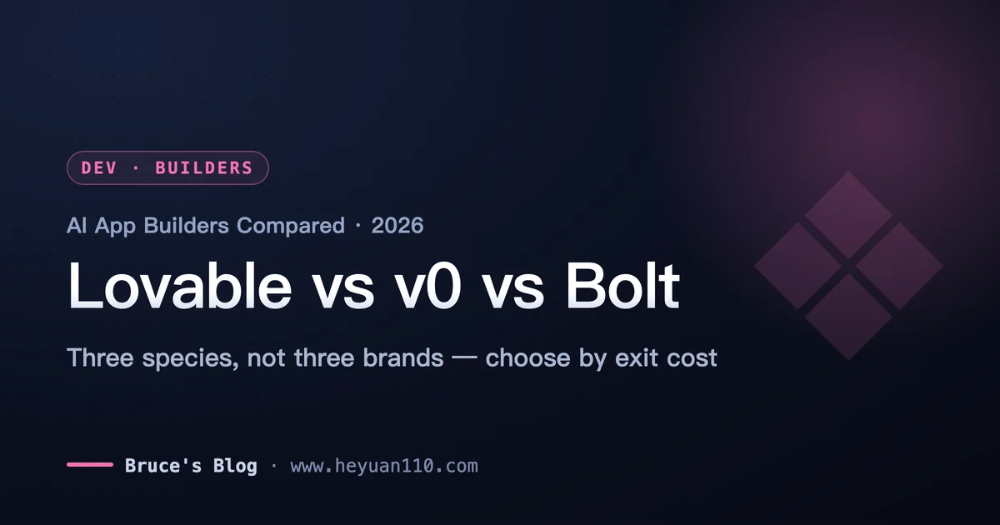
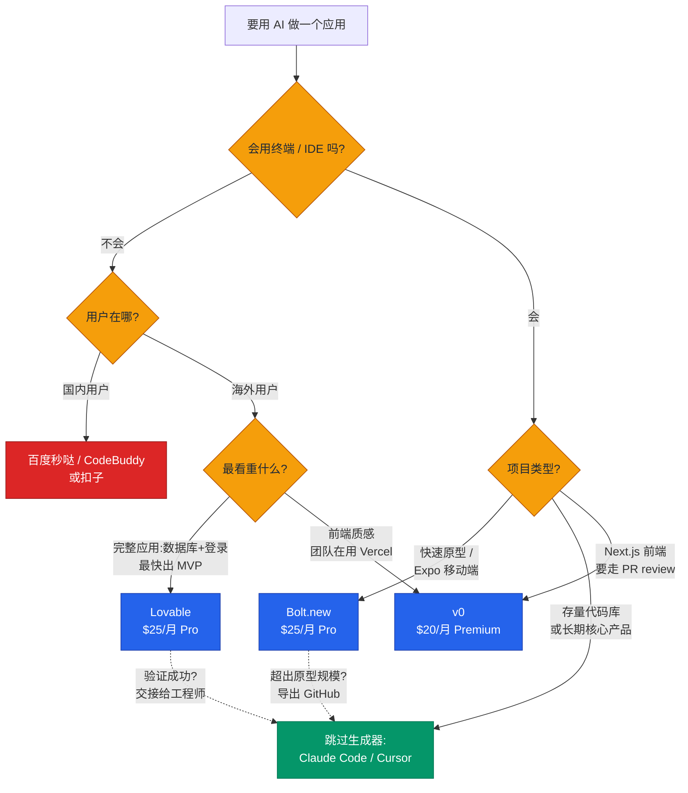
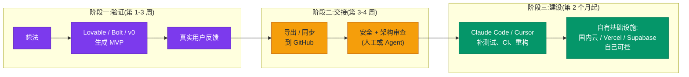

+++
date = '2026-07-09T12:00:00+08:00'
draft = false
title = 'Lovable vs v0 vs Bolt:2026 AI 应用生成器怎么选'
description = 'Lovable、v0、Bolt 深度评测:三种计费模式的隐藏成本、技术栈锁定真相、国内可用性与替代品,以及什么时候直接用 Claude Code 更划算。'
toc = true
tags = ['AI App Builder', 'Lovable', 'v0', 'Bolt.new', 'Vibe Coding']
keywords = ['lovable 评测', 'ai 建站工具对比 2026', 'v0 bolt 对比', 'ai 应用生成器', 'lovable 国内替代', 'ai 无代码开发工具', 'lovable v0 bolt 哪个好']

[[params.faqItems]]
question = "Lovable、v0、Bolt 三个哪个好?"
answer = "取决于你是谁:完全不会写代码、要快速做出带数据库和登录的完整应用,选 Lovable;做 Next.js 前端、团队已经在用 Vercel,选 v0;想要浏览器里的完整开发环境、或者要做 Expo 移动端,选 Bolt.new。会用终端的工程师,大多数情况下直接用 Claude Code 或 Cursor 更划算。"

[[params.faqItems]]
question = "Lovable 在国内能用吗?"
answer = "Lovable 官网国内可以访问,但注册和付费需要国际信用卡,底层依赖的 Supabase 国内访问延迟较高,部署产物默认在海外节点。做面向国内用户的产品,要考虑百度秒哒、腾讯 CodeBuddy(GenieAI)、扣子等国产替代,或者导出代码后自己部署到国内云。"

[[params.faqItems]]
question = "v0 生成的网站国内能访问吗?"
answer = "有坑:v0 默认部署到 Vercel,而 vercel.app 域名在国内长期无法直接访问。必须绑定自定义域名并配置合适的 DNS 解析才能让国内用户正常打开,这是很多人用 v0 做落地页后才发现的问题。"

[[params.faqItems]]
question = "AI 应用生成器做出来的代码能商用吗?"
answer = "代码所有权归你,三家都支持 GitHub 导出。但 Veracode 报告显示约 45% 的 AI 生成代码存在 OWASP 类安全漏洞,涉及支付或用户数据的应用,上线前必须做人工安全审查。导出代码也不等于架构自由:Lovable 深度绑定 Supabase,迁移后端是一个真正的工程项目。"

[[params.faqItems]]
question = "什么时候不该用 AI 应用生成器?"
answer = "四种情况:已经每天在用 Claude Code / Cursor 等编码 Agent;要改造现有代码库而不是从零开始;这个应用是你的长期核心产品;有合规或数据本地化要求。这些场景下应用生成器的托管便利反而是负担,终端 Agent 加自有基础设施是更好的选择。"
+++

美国 Google Trends 上,"loveable ai" 这个**拼错的**搜索词最近 24 小时又涨了 20%——大量的人听说有家公司[估值要翻倍到 132 亿美元](https://techcrunch.com/2026/07/08/lovable-reportedly-in-talks-to-double-its-valuation-to-13-2b/),连名字怎么拼都没搞清楚就冲进搜索框了。这就是 2026 年年中 AI 应用生成器赛道的热度。国内的讨论也不少,但大多数中文内容要么是功能翻译,要么根本没提国内用户会踩的坑。

这篇 **Lovable、v0、Bolt 对比评测**想解决三个问题:三个工具到底分别适合谁(给出硬判断,不搞"各有千秋");三种计费模式各自的隐藏成本在哪;以及中文读者特别关心的——**国内可用性如何、有哪些国产替代、什么时候干脆别用这三个**。

先亮核心立场:**这三个工具不是同一个产品的三个牌子,而是三个不同物种**。选错物种比选错牌子亏得多——网上大部分对这三家的差评,追根溯源都是"物种错配",不是产品本身烂。

## 先分清物种:三个工具回答三个不同的问题

最常见的错误决策方式是:三个都是 20-25 美元/月起步,价格差不多,那就挑个顺眼的。价格趋同强化了"它们是竞品"的错觉,但拆开看,三者回答的根本不是同一个问题:

- **Lovable** 回答的是:"我有产品想法但不会写代码,帮我做出能用的应用。"对话式全栈生成,默认把代码藏起来,一条龙打包 React 前端 + Supabase 后端(PostgreSQL、登录鉴权、文件存储)+ 一键部署。它的工作单位是**一个产品决策**。
- **v0**(Vercel 出品)回答的是:"我要在 Vercel 生态里做生产级前端。"[2026 年 2 月的大改版](https://vercel.com/blog/introducing-the-new-v0)之后,每个对话独占一个 Git 分支、自动 commit、走 PR 合并,还能导入已有代码库。它的工作单位是**一个 Pull Request**。
- **Bolt.new**(StackBlitz 出品)回答的是:"我要一个跑在浏览器标签页里的完整开发环境。"基于 WebContainers 在浏览器里直接跑 Node.js,文件树全部可见可编辑,还支持 [Expo 做 React Native 移动端](https://expo.dev/blog/bolt-expo-integration-announcement)。它的工作单位是**一个代码库**。

看清物种之后,对比的问题就变了。不用再纠结"谁生成的代码质量高"——2025 年之后三家底层都在用前沿大模型,输出质量已经趋同——真正该问的是"哪个工作流匹配我干活的方式"。下面逐个下判断。

## Lovable:非技术创始人的孵化器,不是生产平台

Lovable 的数据夸张到离谱:据 [TechCrunch 报道](https://techcrunch.com/2026/03/11/lovable-says-it-added-100m-in-revenue-last-month-alone-with-just-146-employees/),截至 2026 年 6 月约 5 亿美元 ARR,员工只有 146 人,刚关完 3.3 亿美元 B 轮。这种收入结构说明了一切:钱不是开发者掏的,是全球范围内"有想法但不会执行"的巨大人群掏的。这就是 Lovable 的物种定位——**非技术创始人的孵化器**,按这个标准评价,它是这个品类里最好的产品。

25 美元/月的 Pro 档([官方定价页](https://lovable.dev/pricing):每月 100 credits 加每日赠送)买到的是:聊着天就能得到完整应用——React 前端、真实的 PostgreSQL 数据库、能用的登录系统、文件存储、一键上线。计费按 credit:改个按钮颜色约 0.5 credit,"做个带图片的落地页"约 1.7 credit。单人验证一个想法,一个月的迭代基本装得进 Pro 档。对比外包一个 MVP 动辄三五万人民币,这个性价比不需要多解释。

但我要给一个 Lovable 自己的营销绝对不会说的硬判断:**Lovable 是验证工具,不是生产平台**。两个具体的坑等着没想明白这一点的人。第一,credit 消耗随应用复杂度非线性上涨——应用小的时候改什么都便宜,等功能之间开始互相牵扯,每次修改要带的上下文更多、消耗更大、失败率也更高,第十周的迭代成本是第一周的好几倍。第二,[Veracode 的 GenAI 安全报告](https://www.veracode.com/blog/)发现约 45% 的 AI 生成代码样本过不了安全测试,存在 OWASP 类漏洞——Lovable 的输出不例外,而它的目标用户恰恰是最没能力发现这些问题的人群。涉及支付或用户数据的应用,上线前的人工安全审查我认为没有商量余地,具体为什么可以看我之前写的[安全 vibe coding 指南](/posts/ai/2026-02-24-secure-vibe-coding/)。

**国内视角**还要加三条:官网访问没问题,但付费需要国际信用卡;底层 Supabase 的国内访问延迟明显,面向国内用户的应用体验会打折;部署产物默认在海外节点,备案更是无从谈起。所以我的建议是——Lovable 适合做**面向海外用户**的产品验证,或者纯粹的内部演示;要做国内 C 端产品,要么验证完导出代码自己部署到国内云,要么直接看下文的国产替代。

## v0:Vercel 生态的前端生产线

v0 在 2024-2025 年一直被定型为"React 组件生成器",说实话这个定型当时是公允的。2026 年 2 月之后不是了。[全新的 v0](https://vercel.com/blog/introducing-the-new-v0) 是另一个产品:沙箱运行时对齐真实部署环境、原生 GitHub 集成(每个对话一个分支、PR 合并、合并即部署)、VS Code 风格的编辑器、数据库连接,以及最关键的——**可以导入已有代码库**,不再只能从零生成。

导入已有代码库这个功能是战略信号。Lovable 和 Bolt 是项目"出生"的地方,v0 现在把自己定位成往现有产品上"续建"的地方。一个已经跑在 Vercel 上的 Next.js 团队,设计师或产品经理打开 v0 描述一个新的设置页,产出的是一个真实的、工程师可以按正常流程 review 的 PR。三个工具里只有 v0 做到了这一点,而这恰恰化解了 AI 生成工具最恶心的问题——产出物锁在一个团队没人能审的花园里。

代价同样真实。第一是**生态引力**:v0 没有合同意义上的锁定,但它的一切默认假设都是 Next.js + Vercel。想用 v0 做一个部署到阿里云的项目,等于逆流游泳。第二是**计费不可预测**:v0 改成了按 token 折算 credit 的计费,社区价格追踪站[记录到 2026 年初费率大约翻倍](https://costbench.com/software/ai-coding-assistants/v0-vercel/)而套餐标价不动。简单组件几分钱,复杂的多文件生成几个 prompt 就能吃掉 20 美元月度额度的一大块,而且跑完才知道花了多少。我在 [Claude Code vs Cursor vs Windsurf 对比](/posts/ai/2026-02-18-claude-code-vs-cursor-vs-windsurf-2026/)里说过:不可预测的计量会让人开始"省着问",迭代自由度没了,工具的意义就打了对折。

**国内视角有个致命细节**:v0 生成的项目默认部署到 Vercel,而 **vercel.app 域名在国内长期无法直接访问**。很多人用 v0 快速做了个落地页发到群里,才发现国内用户全部打不开。解法是绑定自定义域名并配置合适的 DNS 解析,但这已经超出了"非技术用户"的舒适区。所以我的判断:v0 适合**做海外市场前端的工程师和团队**;国内业务用它写组件、拿代码可以,别指望它的部署链路。

## Bolt.new:浏览器里的 IDE,按 token 计费的陷阱

Bolt.new 是三者中技术上最有意思的:StackBlitz 的 WebContainers 直接在浏览器标签页里启动真实的 Node.js 环境,不用等远程虚拟机。文件树全可见、任何文件可手改、有终端。三个工具里只有 Bolt 用起来像 IDE 而不是聊天产品,这也精确圈定了它的用户:**想要 AI 速度、但不愿放弃代码可见性的开发者**。

Bolt 还握着整个品类最清晰的差异化能力:移动端。通过[与 Expo 的官方合作](https://expo.dev/blog/bolt-expo-integration-announcement),Bolt 能脚手架出带 Expo Router 和 NativeWind 的 React Native 项目,几分钟内用 Expo Go 在真机上跑起来。Lovable 和 v0 完全没有原生移动端路径。但边界要说清楚,因为 Bolt 的营销不会说:WebContainers 跑不了 Xcode、Android Studio 和 EAS 构建管线——Bolt 给你的是 React Native **代码**,不是签名的安装包,上架 App Store 仍然要在自己机器上配 EAS。"不写代码从想法到应用商店"只在前 80% 的路程上成立。

Bolt 的坑是结构性的,我直说,因为这是全网评测里最少被讲透的一点:**Bolt 的 token 消耗跟项目大小挂钩,不跟需求大小挂钩**。它的大部分 token 花在把你的项目文件同步进模型上下文——同样是改一行字,第六周的花费远高于第一周,纯粹因为代码库长大了。[官方定价](https://bolt.new/pricing)是 25 美元/月 1000 万 token,听着很多,但中等规模项目单条消息就能消耗六位数 token。[Banani 的成本分析](https://www.banani.co/blog/bolt-new-pricing)把这列为惊喜账单的头号来源。Bolt 用 token 顺延一个月和 diff 同步来缓解,但曲线的本质不变:**Bolt 在项目小的时候便宜,恰好在项目开始成功的时候变贵**。国内访问方面,Bolt 的 WebContainers 架构反而是优势——计算在本地浏览器里跑,网络依赖比另外两家轻,主要瓶颈在模型请求和 npm 源(可以换国内镜像)。

## 三种计费模式,三种翻车姿势

值得截图保存的不是功能对比表,是**计费翻车模式对比表**:

| | Lovable | v0 | Bolt.new |
|---|---|---|---|
| 付费起步 | $25/月(100 credits+每日赠送) | $20/月($20 额度) | $25/月(1000 万 token) |
| 计费单位 | 按任务扣 credit | token 折算 credit | token |
| 成本驱动因素 | 任务复杂度 | 模型档位 × 生成量 | **项目体积**(文件同步) |
| 翻车姿势 | 应用变复杂后每次修改都贵 | 跑完才知道花多少 | 同样的修改越到后期越贵 |
| 额度顺延 | 有限(1-2 个月) | 每月清零 | 付费 token 顺延 1 个月 |
| 付款方式 | 国际信用卡 | 国际信用卡 | 国际信用卡 |

三家共同的规律:**入门定价是围绕"第一周的用量"设计的,而三家的单位进度成本都随应用成熟而上涨**。这不算黑幕——上下文真的贵,他们只是把前沿模型的 token 成本传导给你——但正确的心智模型是"**为冲刺付费,不为马拉松付费**"。这三个工具的最佳状态都在项目生命周期的前 2-4 周。开工前就规划好退出点,这个价格没毛病;拖到第四个月还在里面维护生产应用,你就在用聊天机器人的人体工学付外包公司的价钱。

## 锁定的真相:能导出代码 ≠ 架构自由

三家现在都支持 GitHub 同步,营销页都写着"代码归你所有"。技术上没错,实践上误导,这是我要拆的第二个误区。

拿到仓库只是容易的那 20%。你拿不到的是**架构独立性**。Lovable 生成的不是"恰好用了 Supabase 的 React 应用"——它的登录流程、行级安全策略、存储规则、边缘函数全部编织在 Supabase 的特定模型里,[第三方对迁移路径的审计](https://wz-it.com/en/blog/lovable-vs-bolt-vs-v0-comparison-2026/)的结论是:换后端"远不止导出几张表",是重新架构。v0 的产出默认 Next.js 约定、最顺滑的归宿是 Vercel 基础设施。Bolt 是三者中最可迁移的——标准框架的普通代码——这也是它是"开发者之选"的又一个理由,但即便 Bolt,项目也继承了 AI 在第一分钟替你选的服务绑定(Supabase、Netlify、Stripe),这些你没有主动做过的决策会跟着你很多年。

我的原则:**评估这类工具,看离开的成本,别看加入的成本**。加入花 25 美元,带着一个成功的产品离开 Lovable 要花一次真正的工程改造。这个不对称才是真实价签——说句公道话,这也正是那个 132 亿美元估值背后的完整商业模式:**离开成本就是护城河**。

## 什么时候三个都别用:Claude Code 边界线

接下来是大多数对比文章不写的部分,因为写了就没法挂返佣链接了:**对一大类用户,"Lovable vs v0 vs Bolt"的正确答案是"都不用"**。

边界线我这样画。应用生成器打包卖三样东西:AI 编码模型、托管环境(部署、数据库、域名)、隐藏文件的聊天抽象层。模型已经不是差异点——Claude Code、Cursor 和这三家用的都是前沿模型。所以你真正付费购买的是环境和抽象层。如果这两样你本来就有——你会用终端,知道 `git push` 和部署是什么——那这个打包对你就是纯粹的开销,终端原生的 Agent 给你严格更多的控制,成本曲线还更平。具体工作流我在 [Claude Code 完全指南](/posts/ai/2026-02-28-claude-code-complete-guide/)里写透了;而我在 [2026 Agentic Coding 趋势](/posts/ai/2026-02-23-agentic-coding-trends-2026/)里描述的趋势只在加速:编码 Agent 这一侧在不断吞掉应用生成器的地盘——Agent 现在也能部署、也能开浏览器、也能管基础设施,Vercel 自己都推出了[面向 Agent 的浏览器工具链](/posts/ai/2026-01-13-vercel-agent-browser/),方向再明显不过。

具体来说,满足以下任何一条就跳过这三个生成器:

1. **你已经每天在用编码 Agent。**Claude Code 配一个 Supabase MCP server 能复刻 Lovable 九成的后端接线,而且在你自己的机器、自己的仓库、自己的 review 流程里。
2. **项目是存量改造,不是从零开始。**三家里只有 v0 勉强支持导入已有代码库,Agent 生来就是干这个的。
3. **这个应用是你的长期核心产品。**架构决策、测试、CI、可观测性——聊天抽象层全都做不好。
4. **有合规、备案或数据本地化要求。**托管生成器的便利,恰恰是监管要求你必须自己掌握的控制权。

反过来也要诚实:如果动手的人是设计师、产品经理、永远不会打开终端的创始人,Claude Code 再强也与他无关——对这些人,生成器的抽象层不是开销,就是产品本身。工具判断本质上是用户判断。

## 国产替代:什么时候该看国内工具

面向国内用户的产品,三个海外工具的短板(付费、延迟、vercel.app 被墙、备案)会叠加放大,这时候国产替代值得认真看:

- **百度秒哒**:自然语言对话生成网站、H5、微信小程序,对"要做小程序"这个国内高频需求是三个海外工具完全覆盖不了的;
- **腾讯云 CodeBuddy / GenieAI**:对标 Lovable 的"想法到上线"全链路,全栈生成加直接上线,背靠腾讯云生态,备案链路顺;
- **扣子(Coze)**:严格说是 Agent 搭建平台而非应用生成器,但很多"我要个 AI 应用"的需求本质是 Agent 需求,在扣子上成本更低。

我的判断标准很简单:**用户在哪,工具就在哪**。海外用户,Lovable/v0/Bolt 加自定义域名;国内用户,要么国产平台,要么海外工具只当"代码草稿机"——生成完导出,部署自己来。最差的选择是用海外工具的默认部署链路服务国内用户,这等于把产品体验押在一条你完全不可控的网络路径上。

## 选型决策树

把上面所有判断压缩成一张图,这是我会发给朋友的版本:

注意两条虚线箭头,它们是整张图最重要的部分:**每一个成功的生成器项目,最终都会流向 Agent 工作流**。生成器是匝道,不是目的地。

## 从原型到生产:现实的工作流

所以我在 2026 年真正推荐的不是"选一个工具",而是"设计一条带交接点的管线"——这是我从[原型到生产](/posts/ai/2026-03-09-prototype-to-production/)那篇之后持续打磨的流程:

整条管线里杠杆最大的一步,是**按时执行阶段二的交接**——赶在 credit/token 成本曲线上翘之前、赶在那些没人记录的架构决策固化之前。把生成器当一次性草稿用的团队,长期看总是赢过想把它用成永久平台的团队。

## 结论

- **Lovable**——2026 年非技术创始人的最佳选择,没有之一。按 3-4 周的验证冲刺预算 25-50 美元/月,提前规划工程交接。5 亿美元 ARR 名副其实,但别把一个出色的孵化器错当成生产平台。国内 C 端产品慎用其默认部署。
- **v0**——Vercel/Next.js 生态内前端工程师和产品团队的最佳选择,2 月改版后是唯一能融入专业 PR 流程的生成器。留意 token 计费,以及 vercel.app 在国内不可访问的硬坑。
- **Bolt.new**——想要浏览器原生环境的开发者之选,也是唯一的 Expo 移动端路径。在项目变大之前导出,否则文件同步的 token 曲线会教你做人。
- **都不用**——已有 Agent 工具链的工程师、存量代码库、合规场景的正确答案。Claude Code / Cursor 加自有基础设施,在控制力、成本曲线和长期性上全面占优。
- **国产替代**——用户在国内、要做小程序、要备案,直接看秒哒 / CodeBuddy / 扣子,别硬凹海外链路。

市场会持续告诉你这些工具在取代开发者。盯着这个赛道十八个月,我的结论几乎相反:它们是有史以来通往软件工程的最宽漏斗——数以百万计被验证过的原型,最终全都需要工程师(以及工程级的 Agent)提供的那些东西。按物种选工具,按用户选物种。

## Related Reading

- [Claude Code vs Cursor vs Windsurf:2026 对比](/posts/ai/2026-02-18-claude-code-vs-cursor-vs-windsurf-2026/)
- [Claude Code 完全指南](/posts/ai/2026-02-28-claude-code-complete-guide/)
- [2026 Agentic Coding 趋势](/posts/ai/2026-02-23-agentic-coding-trends-2026/)
- [Vercel Agent Browser 意味着什么](/posts/ai/2026-01-13-vercel-agent-browser/)
- [从原型到生产](/posts/ai/2026-03-09-prototype-to-production/)
- [安全 Vibe Coding 指南](/posts/ai/2026-02-24-secure-vibe-coding/)
