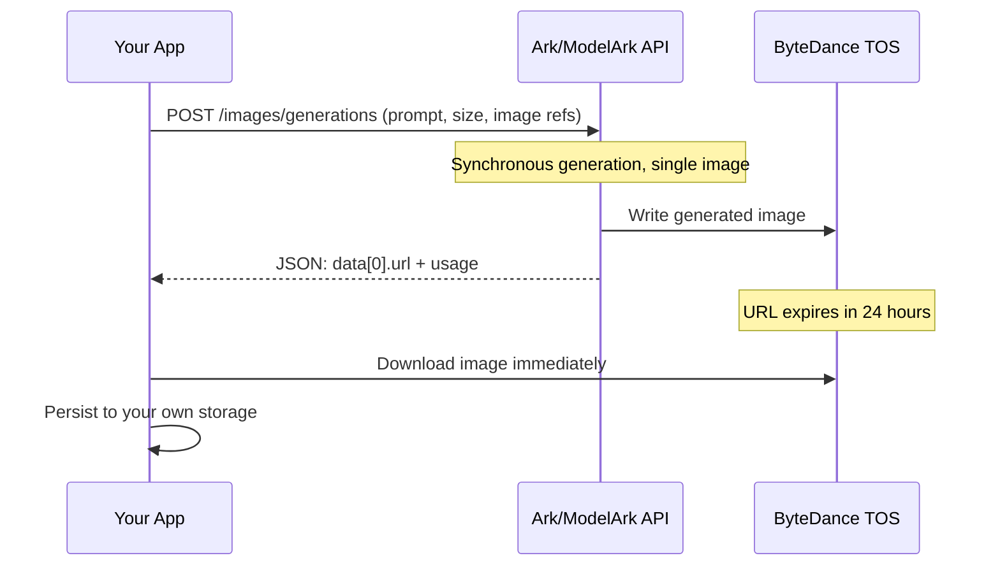
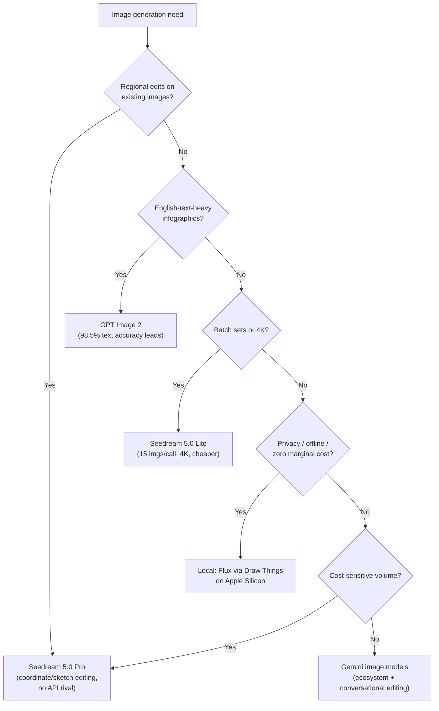

+++
date = '2026-07-09T18:00:00+08:00'
aliases = ['/posts/ai/2026-07-10-seedream-5-pro/']
draft = false
title = "Seedream 5.0 Pro: ByteDance's Image Model Takes On Gemini"
description = "Seedream 5.0 Pro launched July 8, 2026 at $0.045 per 1K image. I fact-check the Gemini comparison, walk through the API, and map who should actually switch."
toc = true
tags = ['Seedream', 'ByteDance', 'AI Image Generation', 'Gemini']
keywords = ['seedream 5 api', 'seedream vs gemini', 'bytedance image model', 'seedream 5.0 pro pricing', 'byteplus image api', 'how to use seedream 5.0 pro', 'gpt-image 2 alternative']

[[params.faqItems]]
question = "What is Seedream 5.0 Pro?"
answer = "Seedream 5.0 Pro is ByteDance's image generation model released on July 8, 2026. It focuses on precision editing — coordinate-based edits, sketch/scribble markers, multi-reference fusion — and native text rendering in 14 languages. It is available via Volcano Engine (China), BytePlus (international), and fal.ai."

[[params.faqItems]]
question = "Is Seedream 5.0 Pro better than Gemini's image model?"
answer = "Not on third-party leaderboards. As of July 10, 2026, Seedream 5.0 Pro appears on neither LMArena nor Artificial Analysis, where GPT Image 2 (high) leads at 1338 Elo. Its edge is price (roughly half of Western rivals) and interactive editing, not raw quality."

[[params.faqItems]]
question = "How much does the Seedream 5.0 Pro API cost?"
answer = "On BytePlus: $0.045 per 1K image, $0.09 per 2K image, plus $0.003 per input reference image (first one free). On fal.ai the same model costs $0.0675/$0.135 per image — a 50% markup. Billing is per image, not per token."

[[params.faqItems]]
question = "How do international developers access Seedream 5.0 Pro?"
answer = "Two routes: the official BytePlus ModelArk API (model ID dola-seedream-5-0-pro-260628) with an OpenAI-compatible images endpoint, or third-party hosts like fal.ai, which require no ByteDance account but charge about 1.5x the official rate."

[[params.faqItems]]
question = "What are Seedream 5.0 Pro's main limitations?"
answer = "Max resolution is 2K (the cheaper 5.0 Lite goes to 4K), it only outputs one image per request (no batch/sequential generation), no streaming, no web search, prompts should stay under 600 English words, and generated image URLs expire after 24 hours."
+++


The strangest thing about "ByteDance just beat Gemini at image generation" — the claim that flooded my feed within 48 hours of **Seedream 5.0 Pro** shipping on July 8, 2026 — is that ByteDance never made it. The launch one-pager calls the model 「全球第一梯队」: *first-tier globally*. Not first. The "beats Gemini" framing was bolted on downstream, by people who as far as I can tell never opened the launch doc. And the model itself, as of July 10, sits on exactly zero third-party leaderboards.

That gap between the claim and its evidence is worth a closer look, because the real story underneath is better than the fake one. I spent the past two days in the primary-source Chinese API documentation on Volcano Engine — most of which still has no English coverage — plus the early independent benchmark data. One honesty note up front: I haven't burned API credits on my own renders yet, so everything here comes from the official docs, ByteDance's published samples, and third-party measurements, not my own test images.

Here's my read: **Seedream 5.0 Pro isn't a better Gemini. It's a different product — a scriptable image *editor* at roughly half Gemini's price and a quarter of GPT-Image 2's — and if you evaluate it as a single-prompt beauty contest entrant, you'll walk away having missed the only part that matters.**

## The "Beats Gemini" Claim, Checked Against the Data

I ran this launch through the same vendor-benchmark discount framework I used for [GPT-5.6's launch numbers](/posts/ai/2026-07-10-gpt-5-6-general-availability/): who measured, on what, and can a third party reproduce it? Three layers, and each one undercuts the headline a little more.

**Layer one: what ByteDance actually said.** The official positioning is 「全球第一梯队通用场景生图大模型」 — a *first-tier* general-purpose image model. ByteDance never claims it beats Gemini or GPT-Image 2 outright. Credit where due: by frontier-lab launch standards, that's restrained. The superlative was added by social amplification, which means the loudest version of this story has no author willing to stand behind it.

**Layer two: third-party leaderboards.** As of July 10, 2026, Seedream 5.0 Pro appears on neither [LMArena's image leaderboards](https://arena.ai/blog/leaderboard-changelog/) — which added Seedream 5.0 *Lite* back on February 25, 2026 — nor [Artificial Analysis's text-to-image leaderboard](https://artificialanalysis.ai/image/leaderboard/text-to-image), where **GPT Image 2 (high) leads at 1338 Elo** and Gemini's Nano Banana line holds a top-five spot. A two-day-old model being unranked is normal. But it means nobody can honestly claim third-party superiority yet — in either direction.

**Layer three: the one independent measurement we do have.** [Atlas Cloud's July API benchmark](https://www.atlascloud.ai/blog/guides/2026-ai-image-api-benchmark-gpt-image-2-vs-nano-banana-2-pro-vs-seedream-5-0) put Seedream 5.0's **English text-rendering accuracy at 89.5%, versus 98.5% for GPT-Image 2 and 94.8% for Nano Banana Pro**. One lab, one prompt set — apply salt. But it points the same direction as ByteDance's own docs, which openly admit small-text structures are still unstable (「小字结构仍存在不稳定问题」). On the single dimension the hype cites most — text rendering — the available evidence says Seedream *trails* in English. Its 14-language breadth is real; its per-glyph English accuracy is not category-leading.

> As of July 10, 2026, Seedream 5.0 Pro is ranked on neither LMArena nor Artificial Analysis. It costs $0.045 per 1K image on BytePlus — roughly half of Gemini's image pricing and about a quarter of GPT Image 2 (high) — and it is the only major image API offering coordinate-based interactive editing.

So the honest scoreboard: unranked on quality arenas, behind on English text accuracy, roughly half to a quarter the price, and alone in offering coordinate-level editing via API. ByteDance isn't storming Gemini's castle with a bigger catapult. It's digging a tunnel under the pricing floor and selling a tool the incumbents don't stock.

## What Seedream 5.0 Pro Actually Shipped on July 8

Now pin the facts, because launch-day coverage blended shipped features with "coming soon" ones — and half the posts I saw got the difference wrong.

The model went live July 8, 2026 on Volcano Engine's Ark platform (model ID `doubao-seedream-5-0-pro-260628`) and internationally on [BytePlus ModelArk](https://docs.byteplus.com/en/docs/ModelArk/1541523) (model ID `dola-seedream-5-0-pro-260628`). Consumer-side, it's rolling into Doubao, Jimeng, and Dreamina — the same distribution playbook ByteDance ran with Seedance, which I unpacked in [my Seedance 2.0 deep dive](/posts/ai/2026-03-29-seedance-2-bytedance-ai-video/). Third-party hosting followed within a day: [fal.ai already serves it](https://fal.ai/models/bytedance/seedream/v5/pro/text-to-image), the fastest route if you don't want a ByteDance cloud account.

Of the four headline capabilities, three shipped:

1. **Interactive precision editing** — mark up the input image with coordinates, boxes, arrows, scribbles, or color swatches, and the model edits exactly those regions. This is the genuinely new part. The official docs show working examples where "replace the two marked items into the correspondingly marked positions" actually resolves coordinate correspondences across a composite image.
2. **Information visualization** — dense infographics, annotated menus, report-style layouts, with that honest small-text caveat attached by ByteDance itself.
3. **Native multilingual text** — 14 languages beyond Chinese and English, including right-to-left scripts.

The fourth, **layer separation** — decomposing a generated image into independently editable layers — is labeled 「即将上线」 (*coming soon*) in the official material. It is not in the July 8 API. Any post presenting it as shipped is a tell that the author didn't read the docs.

## The "Pro" Trap: It's a Specialization, Not a Superset

Here's the finding from the API reference that surprised me most, and that I haven't seen in any English coverage: Pro is not Lite plus more. The [official API docs](https://www.volcengine.com/docs/82379/1541523) are explicit that sending Lite-only parameters to Pro returns an error, not a silent ignore — these are two different tools:

| Capability | Seedream 5.0 Pro | Seedream 5.0 Lite |
|---|---|---|
| Max resolution | **2K** (1K/2K tiers) | **4K** (2K/3K/4K tiers) |
| Sequential/batch generation | ❌ single image only | ✅ up to 15 images per request |
| Streaming output | ❌ | ✅ |
| Web search tool | ❌ | ✅ |
| Max reference images | 10 | 14 |
| Interactive coordinate/sketch editing | ✅ (exclusive) | ❌ |
| Output format | png, jpeg | png, jpeg |
| Rate limit | 500 images/min | 500 images/min |

Read the first row again: **the model called "Pro" tops out at a lower resolution than the model called "Lite."** ByteDance is using "Pro" to mean *precision*, not *more features*. Pro is built for one high-stakes image where placement, text, and identity must land exactly; Lite is built for volume — storyboards, brand kits, comic strips, anything wanting 4-15 related images from one call.

This will bite evaluation teams. In every other vendor's lineup, the expensive model dominates the cheap one on specs, so the reflex is to benchmark Pro on a batch workload, watch it refuse, and file the whole family under "overhyped." If your use case is "a batch of 4K product variants," Pro is the wrong model even though it's the newer, pricier one.

## Calling the Seedream 5.0 Pro API

This section is distilled from the Volcano Engine [API reference](https://www.volcengine.com/docs/82379/1541523) and [tutorial](https://www.volcengine.com/docs/82379/1824121), both Chinese-only; the BytePlus docs mirror them for international accounts.

The endpoint is one synchronous POST — no task polling like video APIs:

```bash
curl https://ark.cn-beijing.volces.com/api/v3/images/generations \
  -H "Content-Type: application/json" \
  -H "Authorization: Bearer $ARK_API_KEY" \
  -d '{
    "model": "doubao-seedream-5-0-pro-260628",
    "prompt": "Vibrant close-up editorial portrait, sculptural hat, color-blocked styling, sharp focus on the eyes, shallow depth of field, Vogue cover aesthetic, medium format, hard studio light.",
    "size": "2K",
    "output_format": "png",
    "watermark": false
  }'
```

On BytePlus, swap the base URL for your ModelArk endpoint and the model ID for `dola-seedream-5-0-pro-260628`. The API is OpenAI-SDK compatible (`client.images.generate(...)` works), so migrating off `gpt-image` is a parameter rename, not a rewrite.

The full request lifecycle, including the one gotcha that will bite you in production:



Parameter cheat sheet (Pro-specific, verified against the July 10 docs):

| Parameter | Value / Range | Notes |
|---|---|---|
| `model` | `doubao-seedream-5-0-pro-260628` | `dola-...` on BytePlus |
| `prompt` | ≤ 600 English words / 300 Chinese chars | Longer prompts *lose* detail — the model starts dropping elements |
| `image` | URL or base64, 1-10 refs | Per image: ≤ 30 MB, ≤ 36 MP, aspect within [1/16, 16] |
| `size` (pixel mode) | total pixels 921,600 - 4,624,220 | e.g. `2048x1024` valid; `512x512` rejected (below floor) |
| `size` (tier mode) | `1K` or `2K` | Describe aspect ratio in the prompt; model picks dimensions |
| `output_format` | `png` / `jpeg` | New in 5.0; 4.x was jpeg-only |
| `response_format` | `url` / `b64_json` | **URLs die after 24h** — always persist |
| `watermark` | default `true` | Set `false` explicitly for production assets |
| `sequential_image_generation`, `stream`, `tools` | ❌ | Lite-only; Pro returns an error if passed |

Three things I dug out of the docs that I haven't seen mentioned anywhere in English:

**The 512×512 floor.** Minimum total pixel count is 921,600 (1280×720). You cannot generate thumbnails or sprites directly — a `512x512` request is rejected, not upscaled. Budget a downscale step.

**Prompt length is a trap.** The docs explicitly warn that past ~600 English words the model starts *ignoring* details rather than degrading gracefully. If you're porting verbose gpt-image prompts, compress them first.

**Interactive editing is just an image.** The coordinate/sketch editing has no special API surface — you draw the markers (boxes, arrows, scribbles, coordinate labels) onto the reference image yourself and describe them in the prompt: "add a ceramic coffee cup in the right marked region, remove all sketch lines." Which means you can generate the markup programmatically with Pillow or Canvas, turning Seedream 5.0 Pro into a scriptable regional editor. Of everything in this launch, this is the capability I'd actually build a product on.

## The Pricing Math: Seedream vs GPT-Image vs Gemini vs Flux

Billing is per image, not per token — the `output_tokens` field in responses is informational only. As of July 10, 2026:

| Route | 1K image | 2K image | Input refs |
|---|---|---|---|
| BytePlus (official intl.) | **$0.045** | **$0.09** | $0.003/image, first free |
| Volcano Engine (China) | ¥0.30 | ¥0.60 | ¥0.02/image, first free |
| fal.ai (third-party) | $0.0675 | $0.135 | $0.0045/extra ref |
| GPT Image 2 (high), typical | ~$0.17-0.25 | — | token-based |
| Gemini image (Nano Banana tier) | ~$0.10-0.13 | — | token-based |

The 1K/2K price boundary sits at 2.36 megapixels (~1536×1536), so a 1424×800 (16:9) hero image bills at the 1K rate. In practice: **a 10,000-image/month e-commerce pipeline runs about $450 on BytePlus versus roughly $1,700-2,500 on GPT Image 2 (high).** That's not a rounding error; that's the gap between "experiment" and "line item." The fal.ai convenience tax — 50% over official — is worth paying for prototyping (no ByteDance account, no KYC) but not at volume.

One non-obvious cost note for anyone doing image-to-video: Seedance 2.0/2.5 accepts Seedream 5.0 Pro *text-to-image* outputs without face review, but *image-to-image* outputs require KYC certification through ByteDance sales. If your pipeline is "edit a real person's photo, then animate it," there's a compliance gate in the middle that the pricing page never mentions.

## Three Takeaways, Depending on Who You Are

A launch this noisy deserves a sorted answer to "so what do I do about it." My selection logic, from the docs and the third-party data:



**If you run editing-heavy production pipelines** — e-commerce, ads, localized marketing, anywhere you modify images more than you conjure them — this launch is for you, and the OpenAI-compatible SDK makes a two-day trial nearly free. Same if you need CJK or minor-language text rendering, or your volume makes a 2-4x price gap material.

**If your output is English-text-dense infographics, this launch is a non-event.** GPT Image 2's 98.5% text accuracy is the number that matters for you, and Seedream's own docs concede small-text instability. Likewise if you need 4K deliverables (use Lite or Seedream 4.5, ironically), you're deep in Gemini's conversational workflow, or your images legally can't leave your machine — for that last case I've written a [complete Draw Things guide](/posts/ai/2026-02-15-draw-things-ultimate-guide/) and a [Mac mini local image generation setup](/posts/ai/2026-02-15-mac-mini-local-image-generation/).

**If you're a paying Gemini or GPT-Image customer, this launch just moved your negotiating floor.** ByteDance is rerunning its Seedance video play in images: near-frontier quality, a price that makes Western APIs look like luxury goods, and differentiation on production-workflow features instead of leaderboard Elo. "Takes on Gemini" is real — but the battlefield is the invoice and the editing workflow, not image quality. Watch LMArena over the next few weeks: if Seedream 5.0 Pro lands top-3 on Image Edit (its home turf) while holding $0.045, the question for a lot of teams flips from "why switch" to "why are we still paying 4x."

## Related Reading

- [Seedance 2.0: ByteDance's AI Video Play](/posts/ai/2026-03-29-seedance-2-bytedance-ai-video/) — the sibling model family and ByteDance's cluster strategy
- [GPT-5.6 General Availability: Reading Vendor Claims Critically](/posts/ai/2026-07-10-gpt-5-6-general-availability/) — the benchmark-discount framework used in this post
- [Draw Things Ultimate Guide](/posts/ai/2026-02-15-draw-things-ultimate-guide/) — local image generation when APIs aren't an option
- [Mac mini as a Local Image Generation Box](/posts/ai/2026-02-15-mac-mini-local-image-generation/) — zero-marginal-cost alternative for hobby volume
