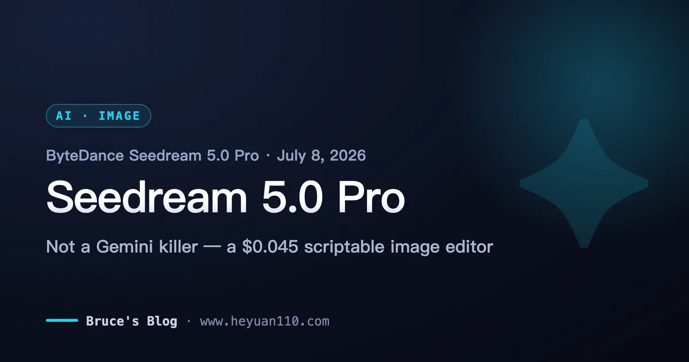
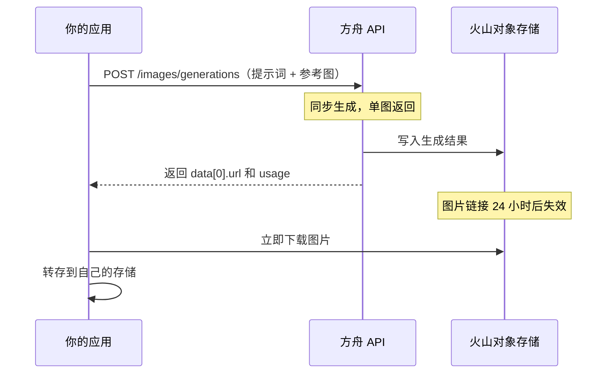
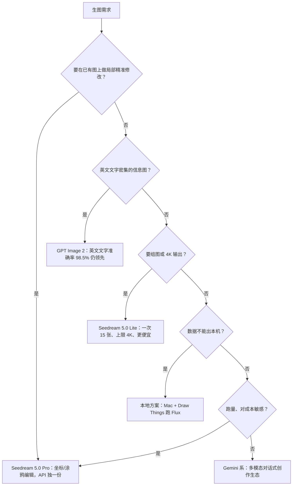

+++
date = '2026-07-09T18:00:00+08:00'
aliases = ['/posts/ai/2026-07-10-seedream-5-pro/']
draft = false
title = 'Seedream 5.0 Pro 上线：字节生图杀入 Gemini 腹地？API 实测与选型'
description = 'Seedream 5.0 Pro 于 2026 年 7 月 8 日上线火山方舟：1K 单张 0.3 元、2K 0.6 元，按张计费。本文核检"超过 Gemini"的真实出处，给出开通、调用、计费全流程实操，以及和即梦、Seedance 的联动关系与选型结论。'
toc = true
tags = ['Seedream', 'ByteDance', 'AI Image Generation', 'Gemini']
keywords = ['seedream 5.0 教程', '即梦 api', '豆包生图', 'seedream 5.0 pro 价格', '火山方舟 生图 api', 'seedream 对比 gemini', '字节 生图模型']

[[params.faqItems]]
question = "Seedream 5.0 Pro 是什么？怎么开通？"
answer = "Seedream 5.0 Pro 是字节 Seed 团队 2026 年 7 月 8 日发布的生图模型，主打交互式精准编辑和 14 国语言文字渲染。在火山方舟控制台开通模型服务、创建 API Key 即可调用，Model ID 为 doubao-seedream-5-0-pro-260628，也可在方舟体验中心免代码试用。"

[[params.faqItems]]
question = "Seedream 5.0 Pro 生图多少钱一张？"
answer = "按张计费：1K 档 0.3 元/张，2K 档 0.6 元/张，以 236 万像素（约 1536×1536）为分界；输入参考图 0.02 元/张，首张免费。响应里的 output_tokens 只是信息字段，不按 token 收费。"

[[params.faqItems]]
question = "Seedream 5.0 Pro 真的超过 Gemini 了吗？"
answer = "没有第三方数据支撑。截至 2026 年 7 月 10 日，它未上榜 LMArena 和 Artificial Analysis（榜首是 GPT Image 2，Elo 1338）；Atlas Cloud 独立测试其英文文字准确率 89.5%，低于 GPT-Image 2 的 98.5%。它的真实优势是价格和交互编辑，不是画质登顶。"

[[params.faqItems]]
question = "Seedream 5.0 Pro 和即梦是什么关系？"
answer = "同源不同壳：Seedream 5.0 Pro 是模型本体，通过火山方舟 API 提供；即梦（海外版 Dreamina）和豆包是搭载它的 C 端产品，发布后陆续接入。开发者走 API 按张付费，普通用户在即梦里用会员额度。"

[[params.faqItems]]
question = "Seedream 5.0 Pro 和 5.0 Lite 怎么选？"
answer = "Pro 是精度特化版：独占坐标/涂鸦交互编辑，但只能单图输出、上限 2K；Lite 支持组图（一次最多 15 张）、流式输出、联网搜索、上限 4K，价格更低。要精准改图选 Pro，要批量产图或 4K 选 Lite。"
+++



2026 年 7 月 8 日，字节 Seed 团队上线 Seedream 5.0 Pro，朋友圈和 X 上立刻刷起"字节生图超过 Gemini"的说法。我花了两天把火山方舟的 API 文档、官方教程和对客一页纸完整读了一遍，又去 LMArena 和 Artificial Analysis 查了榜单。先把结论放前面：**截至 7 月 10 日，"超过 Gemini"没有任何第三方数据支撑——它压根还没上榜；但这个模型真正的杀伤力也不在画质，而在于它把生图 API 从"抽卡机"改造成了"编辑器"，价格还只有 GPT-Image 2 的四分之一左右。** 评估姿势错了，结论就会错：拿它跟 Gemini 比单图颜值，你会失望；拿它当生产管线里的精准改图工具，你会发现 Gemini 和 GPT-Image 目前根本没有对位产品。

这篇文章偏实操：先钉死发布事实、核检宣传口径，然后是火山方舟开通到调用的完整流程、计费的真实算法、和即梦/Seedance 的联动关系，最后给出"谁该用、谁不用换"的明确结论。

## 7 月 8 日到底发布了什么

Seedream 5.0 Pro 于 7 月 8 日在火山方舟上线，Model ID `doubao-seedream-5-0-pro-260628`；海外走 [BytePlus ModelArk](https://docs.byteplus.com/en/docs/ModelArk/1541523)，Model ID `dola-seedream-5-0-pro-260628`。C 端陆续接入豆包、即梦和海外版 Dreamina——和 [Seedance 视频模型](/zh/posts/ai/2026-03-29-seedance-2-bytedance-ai-video/)一样的"API + 自家 App"双通道打法。第三方托管跟进极快，fal.ai 次日就挂上了模型页。

官方一页纸给的四个亮点，我按"已上线/未上线"拆开——因为首发当天很多转发把两者混在一起了：

**已上线**：① 交互式编辑——在参考图上画框、点坐标、涂鸦、标色块，模型按标记位置做局部生成和替换，这是 Pro 独占、也是全场最有含金量的能力；② 信息可视化——数据报告、菜单注解、知识科普图这类高密度排版，官方自己都标注了「小字结构仍存在不稳定问题」，这个诚实值得表扬；③ 原生 14 国小语种文字渲染。

**未上线**：图层分离（把生成图拆成可独立编辑的图层）在官方材料里明确写着「即将上线」，7 月 8 日的 API 里没有这个能力。看到"Seedream 5.0 Pro 支持图层编辑"的文章，可以直接判定作者没读文档。

## "超过 Gemini"核检：出处到底是什么

我沿用[写 GPT-5.6 发布时的厂商跑分打折框架](/zh/posts/ai/2026-07-10-gpt-5-6-general-availability/)：谁测的、测的什么、第三方能不能复现。

第一层，**字节官方怎么说的**。对客一页纸的原话是「全球第一梯队通用场景生图大模型」——注意，是"第一梯队"，不是"第一"。字节官方从头到尾没说超过 Gemini 或 GPT-Image 2，"超过 Gemini"是社交媒体传播中加的戏。这比多数厂商发布会克制。

第二层，**第三方榜单**。截至 2026 年 7 月 10 日：[LMArena 的更新日志](https://arena.ai/blog/leaderboard-changelog/)显示只有 Seedream 5.0 **Lite** 在 2 月 25 日进过榜，5.0 Pro 未收录；[Artificial Analysis 文生图榜](https://artificialanalysis.ai/image/leaderboard/text-to-image)榜首是 GPT Image 2 (high)，Elo 1338，Gemini 的 Nano Banana 系列稳居前五，Seedream 5.0 Pro 同样查无此人。发布才两天，没上榜很正常——但这意味着**目前任何方向的"第三方实锤"都不存在**。

第三层，**独立 API 实测**。目前唯一的独立数据点来自 [Atlas Cloud 七月的基准测试](https://www.atlascloud.ai/blog/guides/2026-ai-image-api-benchmark-gpt-image-2-vs-nano-banana-2-pro-vs-seedream-5-0)：Seedream 5.0 英文文字渲染准确率 **89.5%**，落后 GPT-Image 2 的 **98.5%** 和 Nano Banana Pro 的 **94.8%**。单一实验室的数据要打折，但方向和官方自己承认的"小字不稳定"一致：**恰恰在传播最热的"文字渲染"维度上，现有证据说明它在英文场景是落后的**。它强的是多语种覆盖广（中文 + 14 小语种），不是单字准确率登顶。

所以老实记分：画质榜未上榜、英文文字准确率落后、价格约为对手的四分之一到一半、坐标级交互编辑 API 全场独一份。字节不是造了台更大的攻城锤去砸 Gemini 的城墙，而是从定价地板下面挖了条隧道，顺手卖一把对手货架上没有的工具。这才是"杀入腹地"的真实含义。

## Pro 不是 Lite 的超集：先避开这个选型坑

[官方 API 文档](https://www.volcengine.com/docs/82379/1541523)写得很清楚：给 Pro 传 Lite 的专属参数会**直接报错**。两个模型是分工，不是高低配：

| 能力 | Seedream 5.0 Pro | Seedream 5.0 Lite |
|---|---|---|
| 分辨率上限 | **2K**（1K/2K 档） | **4K**（2K/3K/4K 档） |
| 组图生成 | ❌ 仅单图 | ✅ 一次最多 15 张 |
| 流式输出 | ❌ | ✅ |
| 联网搜索 | ❌ | ✅ |
| 参考图上限 | 10 张 | 14 张 |
| 坐标/涂鸦交互编辑 | ✅ 独占 | ❌ |
| 输出格式 | png / jpeg | png / jpeg |
| 限流 | 500 张/分钟 | 500 张/分钟 |

请再看一遍：**叫"Pro"的模型，分辨率上限反而比"Lite"低。** 字节这里的 Pro 指"精度"，不是"功能全"。要做分镜、品牌视觉套图、连环画这种一次出一组的活，或者要 4K 交付，Lite 才是正确答案；Pro 留给"这一张图的文字、位置、人物特征必须分毫不差"的场景。评估期直接拿 Pro 跑批量任务然后得出"又贵又残废"的结论，是我预计最常见的误判。

## 火山方舟实操：从开通到第一张图

国内开发者完整链路四步：① 注册火山引擎账号并实名认证；② 在火山方舟控制台「开通管理」里开通 Doubao-Seedream-5.0-Pro 模型服务；③ 「API Key 管理」页创建长效 API Key；④ 直接 curl 或用 SDK 调用。不想写代码可以先去方舟体验中心把参数玩明白再接 API。

接口是同步的——不像视频生成要建任务再轮询，一次 POST 直接返回图片链接：

```bash
curl https://ark.cn-beijing.volces.com/api/v3/images/generations \
  -H "Content-Type: application/json" \
  -H "Authorization: Bearer $ARK_API_KEY" \
  -d '{
    "model": "doubao-seedream-5-0-pro-260628",
    "prompt": "充满活力的特写编辑肖像，模特眼神犀利，头戴雕塑感帽子，色彩拼接丰富，景深较浅，Vogue 杂志封面美学，中画幅，强烈工作室灯光。",
    "size": "2K",
    "output_format": "png",
    "watermark": false
  }'
```

接口兼容 OpenAI SDK（`client.images.generate(...)` 直接可用），从 gpt-image 迁移基本是改个 base_url 和模型名的工作量。完整调用链路和最容易踩的坑如下：



Pro 版参数速查表（对照 7 月 10 日版文档核对过，建议截图保存）：

| 参数 | 取值/范围 | 备注 |
|---|---|---|
| `prompt` | 建议 ≤300 汉字 / 600 英文词 | 超长后模型会**丢元素**，不是缓慢降质 |
| `image` | URL 或 base64，1-10 张 | 单张 ≤30MB、≤3600 万像素、宽高比 [1/16, 16] |
| `size`（像素模式） | 总像素 921600 - 4624220 | `2048x1024` 合法；`512x512` 低于下限直接报错 |
| `size`（档位模式） | `1K` / `2K` | 宽高比写进 prompt，由模型定尺寸 |
| `output_format` | `png` / `jpeg` | 5.0 新增，4.x 只有 jpeg |
| `response_format` | `url` / `b64_json` | **url 24 小时失效**，务必转存 |
| `watermark` | 默认 `true` | 生产素材记得显式传 `false`，否则右下角带"AI生成"水印 |
| `sequential_image_generation` / `stream` / `tools` | ❌ | Lite 专属，Pro 传参报错 |

三个文档里挖出来的实操要点：**其一**，最小总像素 921600（1280×720），做小图标、缩略图必须生成后自己缩，API 不给小图。**其二**，交互编辑没有专门的 API 字段——标记（框、箭头、坐标号、涂鸦）是你自己画在参考图上传的，再用 prompt 描述"在右侧标记区域添加带杯碟的陶瓷咖啡杯，移除所有草图线条"。这意味着标记可以用 Pillow 程序化生成，Seedream 5.0 Pro 因此变成一个**可脚本化的区域编辑器**——我认为这是整个发布里最值得基于它做产品的一点。**其三**，默认加水印，第一次调用忘传 `watermark: false` 的人（包括我）都会得到一张带角标的"废图"。

## 计费怎么算：按张，不按 token

响应里有 `output_tokens` 字段（算法是宽×高÷256），很容易让人以为按 token 计费——**实际是按张**。截至 2026 年 7 月 10 日的价格：

| 渠道 | 1K 输出 | 2K 输出 | 输入参考图 |
|---|---|---|---|
| 火山方舟（国内） | **0.3 元/张** | **0.6 元/张** | 0.02 元/张，首张免费 |
| BytePlus（海外官方） | $0.045 | $0.09 | $0.003/张，首张免费 |
| fal.ai（第三方） | $0.0675 | $0.135 | 额外参考图 $0.0045 |
| GPT Image 2 (high) 参考 | 约 $0.17-0.25 | — | 按 token |

1K/2K 的分界线是 236 万总像素（约 1536×1536），也就是说 1424×800 的 16:9 横图按 1K 档 0.3 元计。算笔账：**月产 1 万张的电商图管线，方舟约 3000-6000 元人民币，GPT Image 2 (high) 约合 1.2 万-1.8 万元**——这是"试试看"和"预算审批"的区别。fal 比官方贵 50%，适合免注册快速原型，跑量不划算。

还有一个价格表上不写的合规细节：Seedance 2.0/2.0 mini/2.5 对 Seedream 5.0 Pro **文生图**产出的图片免人脸审核，但**图生图**产出要联系商务做 KYC 认证。"改真人照片再生成视频"的管线中间卡着一道审核门，做数字人业务的先把这条确认清楚再排期。

## 和即梦、豆包是什么关系

一句话：Seedream 5.0 Pro 是发动机，即梦和豆包是装了这台发动机的两辆车。模型本体只通过火山方舟/BytePlus API 提供，按张付费、可进生产系统；即梦（海外版 Dreamina）是面向创作者的 C 端产品，发布后陆续切换到 5.0 Pro，用的是会员积分额度。对开发者的实际意义：**想先免费感受模型上限，去即梦或方舟体验中心玩；要接业务，直接走 API，别折腾即梦的网页逆向**——按张三毛钱的官方价格下，逆向方案的维护成本毫无意义。

## 选型结论：谁该用，谁不用换



**该切 Seedream 5.0 Pro 的**：电商、广告、营销物料这类"改图多于生图"的生产管线；需要中文和小语种文字渲染的海报/本地化素材；月产几千张以上、价差已经是预算量级的团队。OpenAI 兼容接口让试错成本只有半天。

**不用换的**：主产英文信息图的（89.5% vs 98.5% 的文字准确率差距就是返工率差距）；要 4K 交付的（讽刺的是该用 Lite 或 4.5）；已经深度绑定 Gemini 对话式改图流程的；以及素材不能出内网的——本地生图我写过[Draw Things 完全指南](/zh/posts/ai/2026-02-15-draw-things-ultimate-guide/)和 [Mac mini 本地生图方案](/zh/posts/ai/2026-02-15-mac-mini-local-image-generation/)，零边际成本，隐私可控。

我的整体判断：字节在生图上复刻了 Seedance 在视频上的打法——用接近第一梯队的质量、四分之一的价格、外加对手没有的生产流程特性抢开发者。**"超过 Gemini"今天不成立，但"让 Gemini 的报价单变得难看"已经成立了。** 接下来两三周盯 LMArena：如果 5.0 Pro 在 Image Edit 榜（它的主场）进前三而价格不动，很多团队的问题就会从"为什么要换"变成"为什么还没换"。

## Related Reading

- [Seedance 2.0 深度解读：字节 AI 视频的集群打法](/zh/posts/ai/2026-03-29-seedance-2-bytedance-ai-video/)——同一战略在视频赛道的先行版
- [GPT-5.6 正式发布全解读](/zh/posts/ai/2026-07-10-gpt-5-6-general-availability/)——本文使用的厂商跑分打折框架出处
- [Draw Things 完全指南](/zh/posts/ai/2026-02-15-draw-things-ultimate-guide/)——API 之外的本地生图路线
- [Mac mini 本地生图方案](/zh/posts/ai/2026-02-15-mac-mini-local-image-generation/)——零边际成本的对照组
