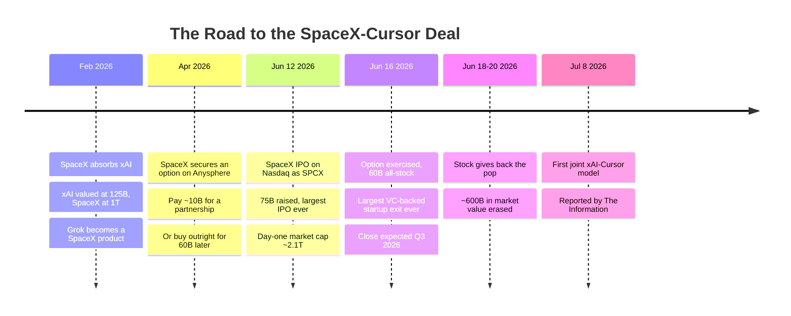
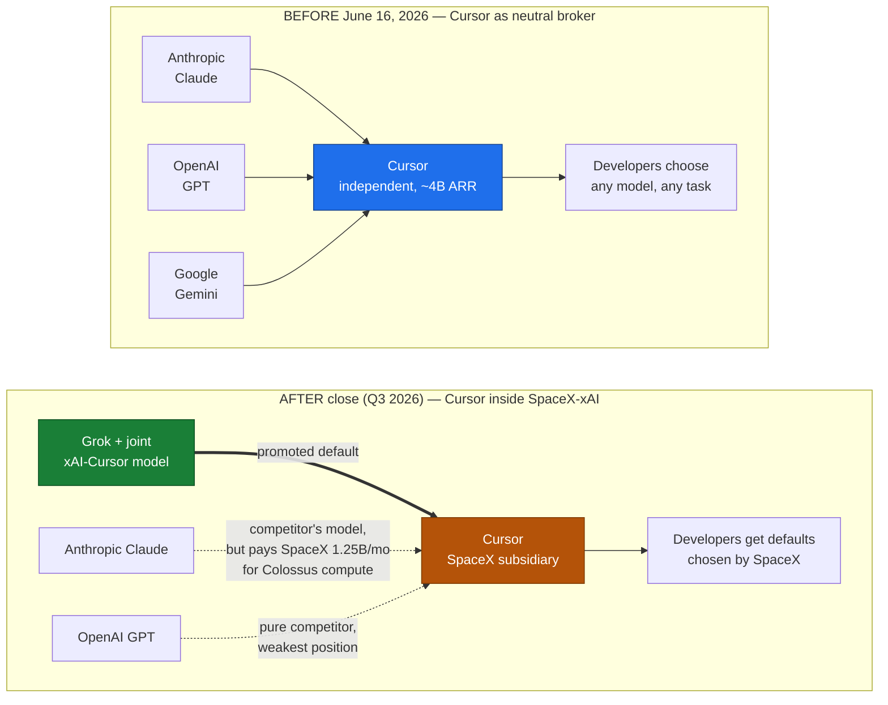
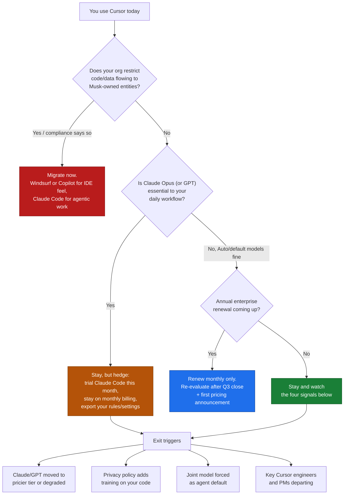

+++
date = '2026-07-09T13:00:00+08:00'
draft = false
title = "What SpaceX's $60B Cursor Acquisition Means for Developers"
description = "SpaceX confirmed a $60B all-stock deal for Cursor maker Anysphere, closing Q3 2026. What it means for Claude model access, pricing, and whether to switch."
toc = true
tags = ['Cursor', 'SpaceX', 'xAI', 'AI Coding', 'Claude Code', 'Acquisition']
keywords = ['spacex cursor acquisition', 'cursor acquired', 'cursor ai news', 'should i leave cursor', 'cursor alternatives 2026', 'spacex anysphere deal', 'cursor grok integration', 'is cursor still safe to use']

[[params.faqItems]]
question = "Did SpaceX really acquire Cursor for $60 billion?"
answer = "Yes, this is confirmed, not a rumor. On June 16, 2026, SpaceX announced it exercised an option to acquire Anysphere, the company behind Cursor, in a $60 billion all-stock deal — the largest acquisition of a venture-backed startup ever. Cursor CEO Michael Truell confirmed it in an official statement. The deal is expected to close in Q3 2026, pending regulatory approval."

[[params.faqItems]]
question = "Will Cursor stop supporting Claude and GPT models after the SpaceX acquisition?"
answer = "Not immediately, and probably not by a hard cutoff. Anthropic pays SpaceX-xAI roughly $1.25 billion per month for Colossus data center compute through 2029, which makes an abrupt Claude removal unlikely in either direction. The realistic risk is gradual: Grok and the new joint SpaceX-Cursor model become the promoted defaults, while third-party models drift to more expensive tiers."

[[params.faqItems]]
question = "Will Cursor prices go up after the SpaceX acquisition?"
answer = "There is no announced price change yet, but the structural pressure points up. SpaceX paid $60 billion in stock for a business at roughly $4 billion annualized revenue, days after a record IPO, and public investors erased about $600 billion of SpaceX market value within four days of the announcement. Monetization pressure on Cursor's 1M+ daily users is the most direct lever SpaceX has. Avoid annual commitments until post-close pricing is clear."

[[params.faqItems]]
question = "Should I switch from Cursor to Claude Code or Windsurf now?"
answer = "Don't panic-migrate, but prepare an exit. Nothing changes for your editor today — the deal closes in Q3 2026. If you depend on Claude models for serious agentic work, trial Claude Code now so a later switch costs you a weekend, not a quarter. If you want the Cursor-style IDE experience without SpaceX ownership, Windsurf and GitHub Copilot are the closest substitutes. Migrate immediately only if your employer restricts code data flowing to a Musk-owned entity."

[[params.faqItems]]
question = "What is the SpaceX-Cursor joint AI model?"
answer = "According to a staff memo reported by The Information, SpaceX's xAI division and Cursor planned to ship their first jointly developed coding model as early as July 8, 2026 — three weeks after the acquisition announcement and before the deal has even closed. It is the clearest signal that Cursor's future defaults will be in-house models, not the neutral model picker that built its reputation."
+++

On June 16, 2026 — four days after the largest IPO in history — SpaceX announced it would acquire Anysphere, the company behind Cursor, for **$60 billion in stock**. I spent a day fact-checking this before writing, because "rocket company buys code editor" reads like satire. It is not. [CNBC confirmed the deal](https://www.cnbc.com/2026/06/16/spacex-spcx-cursor-acquisition-ipo.html), Cursor CEO Michael Truell issued an official statement, and the transaction — the largest acquisition of a venture-backed startup ever — is expected to close in Q3 2026, pending regulatory approval.

The **SpaceX Cursor acquisition** is the most consequential event in developer tooling since GitHub sold to Microsoft, and I think most of the coverage is analyzing it wrong. This is not a story about an IDE. It is a story about what happens when the most popular *model-neutral* coding tool becomes a wholly owned subsidiary of a company that sells a competing model. In this post I'll lay out the verified facts, explain why the deal makes more sense than it looks (and why that's exactly the problem), and give you a concrete decision framework for whether you should leave Cursor — because "wait and see" is a strategy only if you know what you're waiting to see.

## The Deal, Verified: What Actually Happened

Because a story this strange attracts misinformation, here is the fact base, cross-checked against primary sources. Every load-bearing claim below comes from CNBC, Forbes, NPR, CBS News, or official company statements — not aggregator blogs.

The details that matter:

- **The buyer is really xAI wearing a spacesuit.** SpaceX merged with xAI in [February 2026](https://en.wikipedia.org/wiki/Initial_public_offering_of_SpaceX), folding Grok and the Colossus data centers into the rocket company before its June 12 Nasdaq debut (ticker SPCX, $75 billion raised, $1.77 trillion valuation — [the largest IPO ever](https://www.npr.org/2026/06/11/nx-s1-5853199/spacex-ipo-price-elon-musk)).
- **The deal was premeditated, not impulsive.** SpaceX quietly secured an option in April 2026: pay roughly $10 billion for a partnership, or acquire Anysphere outright for $60 billion later in the year. It exercised the buy option four days after going public.
- **It's all stock.** Anysphere shareholders get SpaceX Class A shares. Michael Truell's statement: *"SpaceX has exercised their option to acquire Cursor in an all-stock transaction with the goal of building the world's most useful AI models."* Note what that sentence is about — models, not editors.
- **Cursor is a real business, not vapor.** Roughly **$4 billion in annualized revenue** as of June 2026, up from $1 billion in November 2025, with about $2.6 billion of it from enterprise B2B, 64% of the Fortune 500 as customers, and over a million daily active users.
- **Public markets hated it.** SpaceX stock jumped 16% on announcement day, briefly making it the fourth most valuable US company — then reversed and erased roughly **$600 billion in market value over four days** as investors digested the dilution and the focus risk.

So the facts are solid. The question is what they mean.

## Why a Rocket Company Bought an IDE

The first misconception to kill: *"this is absurd, rockets have nothing to do with code editors."* That framing gets the acquirer wrong. Since February, SpaceX is not a rocket company that bought an AI lab — functionally, it's an AI company with a launch division, and the Cursor deal is **xAI buying the distribution it could never earn**.

Look at it from Grok's position. By early 2026, xAI had frontier-scale compute (Colossus 1 and 2 in Memphis) but almost no developer mindshare. One Hacker News commenter on [the announcement thread](https://news.ycombinator.com/item?id=48553224) put it brutally: *"xAI, a failed AI company which turned into a datacentre operator probably won't help."* Harsh, but directionally true — xAI's most successful 2026 business is renting GPUs. Anthropic pays [$1.25 billion per month for all of Colossus 1](https://techcrunch.com/2026/05/20/anthropic-will-pay-xai-1-25-billion-per-month-for-compute/); Google pays $920 million per month. Landlording for your competitors is profitable, but it's not an AI strategy.

Cursor fixes three of xAI's problems in one transaction. **Distribution**: a million-plus daily active developers and 64% of the Fortune 500, acquired overnight. **Data**: the interaction stream of professional developers — accepted edits, rejected suggestions, agentic task traces — is arguably the highest-quality coding RLHF corpus that exists outside of Anthropic and OpenAI. Several HN commenters converged on this as the real rationale: *"the data they have flowing through the system is valuable for training."* **Revenue optics**: $4 billion of fast-growing ARR looks wonderful inside a freshly public company that needs to justify a $1.7 trillion valuation with something other than launch contracts.

And here is the uncomfortable part for anyone hoping this deal falls apart: **$60 billion in post-IPO stock is cheap money**. At ~15x forward revenue, the multiple is aggressive but not insane by 2026 AI standards — and SpaceX paid in shares trading at a $2 trillion market cap, not cash. When your currency is that inflated, buying real revenue with it is close to free. The market's $600 billion tantrum suggests investors understood exactly this: the deal is rational for Musk and dilutive for them.

I made a related argument in [my agentic coding trends piece](/posts/ai/2026-02-23-agentic-coding-trends-2026/): 2026 is the year the coding-tool market consolidates around whoever controls both the model and the harness. SpaceX just bought the harness. Which brings us to the actual problem.

## The Model Neutrality Problem Is the Whole Story

Cursor's superpower was never the editor. VS Code forks are a commodity — Windsurf proved that, and so did a dozen others. Cursor won because it was **Switzerland**: the one serious tool where you could route a task to Claude Opus, GPT, or Gemini with a dropdown, and where enterprises could point sensitive codebases at whichever provider their compliance team trusted. That neutrality is structurally incompatible with being owned by a model vendor, and no amount of reassuring blog posts changes the incentive math.

The second misconception worth killing is the opposite panic: *"Anthropic will cut Claude off from Cursor tomorrow, just like Windsurf."* The Windsurf precedent is real — Anthropic pulled model access from Windsurf in 2025 while OpenAI was trying to acquire it, on the plain logic that you don't hand leverage to a competitor buying your distribution channel. But the SpaceX situation is close to inverted. Anthropic committed to roughly **$15 billion a year of SpaceX-xAI compute** through May 2029, [taking over all of Colossus 1](https://www.datacenterdynamics.com/en/news/anthropic-to-use-all-of-spacex-xais-colossus-1-data-center-compute/) and expanding into Colossus 2 — a deal [Anthropic itself announced](https://www.anthropic.com/news/higher-limits-spacex) as the thing funding higher Claude usage limits. When your landlord buys your biggest reseller, you don't burn the building down. Mutual hostage-taking is the most underrated stabilizer in this industry.

So the realistic failure mode isn't a cutoff. It's **erosion**. The joint xAI-Cursor model reportedly [shipping as early as July 8](https://finance.yahoo.com/technology/ai/articles/spacexai-plans-launch-model-cursor-210200389.html) — before the acquisition has even legally closed — becomes the default for new users. Grok gets the fast lane, the deepest agent integration, the unlimited tier. Claude and GPT stay technically available but drift toward premium pricing, slower rollout of new capabilities, and second-class agent support. Cursor already ran this playbook once with its in-house Composer model, which I examined in [my Cursor Composer 2 review](/posts/ai/2026-04-01-cursor-composer-2-review/) — the difference is that Composer was a hedge, and the joint model is now the mission. Truell's own statement says the goal is "building the world's most useful AI models." The model picker was the product; now it's a migration funnel.

## What Actually Changes for Cursor Users

Nothing changes in your editor today, and anyone telling you otherwise is farming clicks. The deal closes in Q3; until then Anysphere operates independently. But three things deserve your attention *before* close, because they determine what kind of product you'll be using in December.

**Pricing pressure is structural, not hypothetical.** SpaceX just paid 15x forward revenue with stock that public investors immediately repriced downward by $600 billion. The fastest way to make the math respectable is to grow Cursor's revenue aggressively — and the enterprise book (already $2.6 billion annualized) plus a million daily active individual users are the levers. I don't know that prices go up; I do know every incentive points that way, and that multiple HN commenters with enterprise seats reported their orgs *"have killed their cursor enterprise plans"* within days of the announcement. My concrete advice: **do not sign an annual Cursor commitment right now.** Stay monthly until post-close pricing is announced. The option value costs you a few dollars; the downside of prepaying for a product that changes owners and priorities mid-contract is a year of regret.

**Privacy and data-training terms are the fine print to watch.** Cursor's enterprise pitch leaned hard on privacy mode and SOC 2 — route your code to the provider you trust, nothing retained. Under a model-owning parent whose stated goal is training "the world's most useful AI models," the value of your interaction data goes from incidental to strategic. Watch for revisions to the privacy policy and enterprise DPA between now and close. If you work in defense, aerospace-adjacent, or any org with Musk-entity procurement restrictions (they exist, and they're more common than you'd think), your compliance team may make this decision for you regardless of what you prefer.

**The defaults will change, and defaults are destiny.** The July 8 joint model is the tell. Cursor's onboarding, its Auto mode, its agent presets — all of it will steadily favor in-house models, because that's what the $60 billion was for. If your workflow depends on choosing Claude Opus for hard refactors (which, per my [Cursor agent best-practices guide](/posts/ai/2026-01-19-cursor-agent-best-practices/), is exactly what you should be doing today), you are the user this transition treats worst: the tool will keep working while quietly making your preferred configuration more expensive and less supported.

## Winners and Losers in the Coding-Tool Market

| Player | Before June 16 | After | Net |
|--------|---------------|-------|-----|
| SpaceX-xAI | Frontier compute, no developer distribution | 1M+ DAU funnel, Fortune 500 foothold, coding data stream | Big win (if it doesn't fumble the users) |
| Cursor founders/investors | Private, ~$30B valuation trajectory | $60B in liquid public stock; founders' net worth doubled | Enormous win |
| Anthropic | Powers much of Cursor usage; Windsurf precedent available | Its biggest IDE channel is now owned by a model competitor — that also happens to be its landlord | Complicated; Claude Code becomes the strategic hedge |
| OpenAI | Model supplier to Cursor, lost Windsurf bid in 2025 | Weakest position: pure competitor with no compute entanglement | Loss |
| GitHub Copilot / Microsoft | Losing mindshare to Cursor all year | Inherits every enterprise that can't stomach Musk ownership | Quiet win by default |
| Windsurf | "Cursor but cheaper" | "Cursor but not SpaceX" — a much better pitch | Win |
| Developers | One great neutral tool | Neutrality gone; choice moves up a level, to which *company* you pick | Depends on what you do next |

The deeper industry read: the era of the independent, model-neutral coding harness is ending. Every serious harness is now attached to a model vendor — Claude Code to Anthropic, Copilot to Microsoft/OpenAI, Antigravity to Google, Cursor to SpaceX-xAI. I compared the top three in [Claude Code vs Cursor vs Windsurf](/posts/ai/2026-02-18-claude-code-vs-cursor-vs-windsurf-2026/) back in February, when "Cursor is the neutral option" was a genuine differentiator. That column of the comparison table just got deleted by M&A. From here on, choosing a coding tool means choosing a model ecosystem, and you should make that choice deliberately instead of inheriting it from whoever acquires your editor.

## Should You Leave Cursor? A Decision Framework

Here is the framework I'd actually use, rather than the vibes-based "Musk bad, leave now" or "nothing ever changes, stay forever" takes flooding your feed.

My own position, since this blog exists to state positions: **I would not build new team workflow on Cursor right now.** Not because the product got worse — it didn't, and its agent tooling remains excellent — but because the *stability of its assumptions* got worse. When I recommend a tool for a team, I'm underwriting eighteen months of its roadmap. Cursor's next eighteen months will be spent integrating with a trillion-dollar parent, shipping a house model, and justifying a $60 billion price tag. None of that work is for you.

For individuals, the calculus is gentler. If Cursor's Auto mode serves you fine, stay and enjoy it — you'll likely get a genuinely strong in-house model out of this, given the Colossus-scale compute behind it. Just keep your configuration portable: your `.cursorrules`, your MCP setup, your prompts. The practices that make you effective in Cursor's agent transfer almost entirely to Claude Code and Windsurf, which is precisely why switching costs are lower than they feel.

## The Bottom Line

The SpaceX Cursor acquisition is confirmed fact, rational strategy, and bad news for the specific thing that made Cursor special — in that order. xAI bought distribution, data, and revenue with inflated post-IPO paper, and the price of that trade is paid by users who valued Cursor as neutral ground. The Windsurf-style instant cutoff probably won't happen, because Anthropic's $15 billion-a-year compute entanglement makes cold war more profitable than hot war for everyone involved. What will happen is slower and harder to headline: defaults shift, tiers reshuffle, and one day in 2027 you'll notice the model picker feels less like a menu and more like a suggestion.

You don't need to leave Cursor this week. You need to stop being locked into it — monthly billing, portable config, one trial run of an alternative — so that if the erosion arrives, leaving is a decision you execute in an afternoon rather than a migration you dread for a quarter. Tool loyalty is a habit from an era when tools didn't change owners for $60 billion. That era ended on June 16.

## Related Reading

- [Claude Code vs Cursor vs Windsurf: The 2026 Comparison](/posts/ai/2026-02-18-claude-code-vs-cursor-vs-windsurf-2026/)
- [Cursor Agent Best Practices](/posts/ai/2026-01-19-cursor-agent-best-practices/)
- [Agentic Coding Trends 2026](/posts/ai/2026-02-23-agentic-coding-trends-2026/)
- [Cursor Composer 2 Review: The In-House Model Hedge](/posts/ai/2026-04-01-cursor-composer-2-review/)
- [Apple's AI Capitulation at WWDC 2026](/posts/ai/2026-06-09-apple-wwdc-2026-gemini-siri-pivot/)
- [Anthropic's $965B Valuation and Managed Agents](/posts/ai/2026-06-12-anthropic-965b-managed-agents/)
