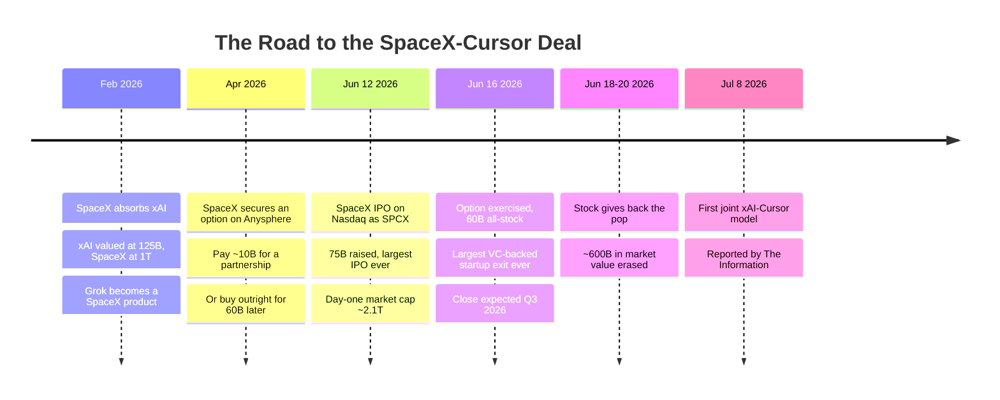
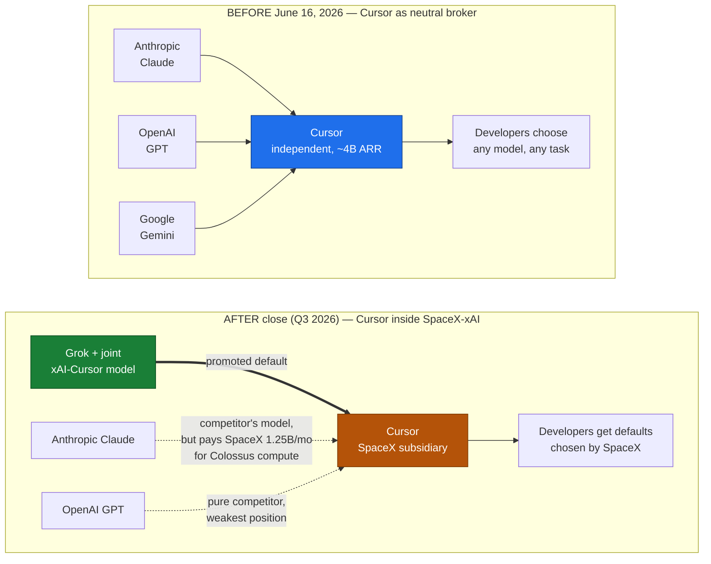
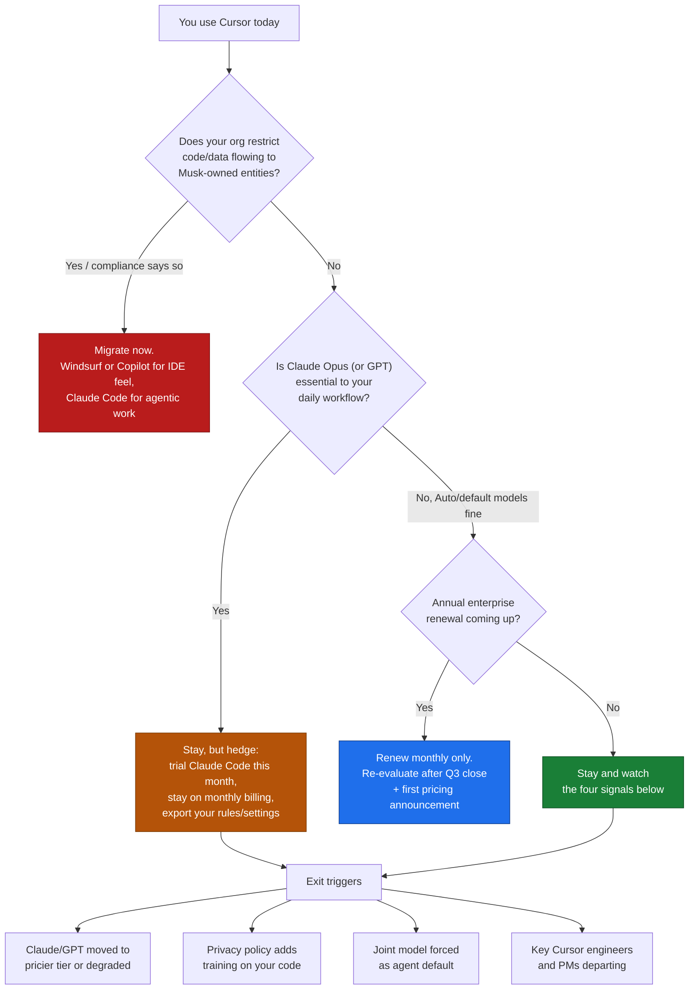

+++
date = '2026-07-09T13:00:00+08:00'
draft = false
title = "What SpaceX's $60B Cursor Acquisition Means for Developers"
description = "SpaceX confirmed a $60B all-stock deal for Cursor maker Anysphere, closing Q3 2026. What it means for Claude model access, pricing, and whether to switch."
toc = true
tags = ['Cursor', 'SpaceX', 'xAI', 'AI Coding', 'Claude Code', 'Acquisition']
keywords = ['spacex cursor acquisition', 'cursor acquired', 'cursor ai news', 'should i leave cursor', 'cursor alternatives 2026', 'spacex anysphere deal', 'cursor grok integration', 'is cursor still safe to use']

[[params.faqItems]]
question = "Did SpaceX really acquire Cursor for $60 billion?"
answer = "Yes, this is confirmed, not a rumor. On June 16, 2026, SpaceX announced it exercised an option to acquire Anysphere, the company behind Cursor, in a $60 billion all-stock deal — the largest acquisition of a venture-backed startup ever. Cursor CEO Michael Truell confirmed it in an official statement. The deal is expected to close in Q3 2026, pending regulatory approval."

[[params.faqItems]]
question = "Will Cursor stop supporting Claude and GPT models after the SpaceX acquisition?"
answer = "Not immediately, and probably not by a hard cutoff. Anthropic pays SpaceX-xAI roughly $1.25 billion per month for Colossus data center compute through 2029, which makes an abrupt Claude removal unlikely in either direction. The realistic risk is gradual: Grok and the new joint SpaceX-Cursor model become the promoted defaults, while third-party models drift to more expensive tiers."

[[params.faqItems]]
question = "Will Cursor prices go up after the SpaceX acquisition?"
answer = "There is no announced price change yet, but the structural pressure points up. SpaceX paid $60 billion in stock for a business at roughly $4 billion annualized revenue, days after a record IPO, and public investors erased about $600 billion of SpaceX market value within four days of the announcement. Monetization pressure on Cursor's 1M+ daily users is the most direct lever SpaceX has. Avoid annual commitments until post-close pricing is clear."

[[params.faqItems]]
question = "Should I switch from Cursor to Claude Code or Windsurf now?"
answer = "Don't panic-migrate, but prepare an exit. Nothing changes for your editor today — the deal closes in Q3 2026. If you depend on Claude models for serious agentic work, trial Claude Code now so a later switch costs you a weekend, not a quarter. If you want the Cursor-style IDE experience without SpaceX ownership, Windsurf and GitHub Copilot are the closest substitutes. Migrate immediately only if your employer restricts code data flowing to a Musk-owned entity."

[[params.faqItems]]
question = "What is the SpaceX-Cursor joint AI model?"
answer = "According to a staff memo reported by The Information, SpaceX's xAI division and Cursor planned to ship their first jointly developed coding model as early as July 8, 2026 — three weeks after the acquisition announcement and before the deal has even closed. It is the clearest signal that Cursor's future defaults will be in-house models, not the neutral model picker that built its reputation."
+++

The company that catches falling rockets with steel chopsticks just paid $60 billion for a code editor. Not a satellite maker, not a defense prime — a VS Code fork. And it's real: on June 16, 2026, four days after the largest IPO in history, SpaceX announced it would acquire Anysphere, the company behind Cursor, for **$60 billion in stock**. [CNBC confirmed the deal](https://www.cnbc.com/2026/06/16/spacex-spcx-cursor-acquisition-ipo.html), Cursor CEO Michael Truell put his name on an official statement, and the transaction — the largest acquisition of a venture-backed startup ever — is expected to close in Q3 2026, pending regulatory approval. The **SpaceX Cursor acquisition** is not satire, though I spent a day cross-checking sources before I believed it myself.

Here's why it isn't a joke: the buyer stopped being a rocket company months ago. SpaceX absorbed xAI in February 2026, which put Grok and the Colossus data centers inside the same ticker as Starship. Read the deal that way and the absurdity evaporates — an AI lab just bought the developer distribution it could never earn on its own. That makes this the most consequential event in developer tooling since GitHub sold to Microsoft, and I think most of the coverage is aimed at the wrong layer. This was never an IDE story. It's the story of the most popular *model-neutral* coding tool becoming a wholly owned subsidiary of a company that sells a competing model. So, quick and to the point: the verified facts, one sharp judgment about what dies here, and the concrete moves worth making — because "wait and see" is only a strategy if you know what you're waiting to see.

## The SpaceX Cursor Acquisition, Fact-Checked

A story this weird breeds embellished retellings fast, so before any opinion, the fact base. Every load-bearing claim below traces to CNBC, Forbes, NPR, CBS News, or an official company statement — not aggregator blogs.

Five details carry most of the weight:

- **The buyer is xAI wearing a spacesuit.** SpaceX folded xAI into itself in [February 2026](https://en.wikipedia.org/wiki/Initial_public_offering_of_SpaceX), then went public on June 12 as SPCX — [$75 billion raised, the largest IPO ever](https://www.npr.org/2026/06/11/nx-s1-5853199/spacex-ipo-price-elon-musk), at a $1.77 trillion valuation. Grok and Colossus were already inside the public company before the Cursor deal.
- **It was premeditated, not impulsive.** Back in April 2026, SpaceX quietly locked in an option: pay roughly $10 billion for a partnership, or buy Anysphere outright for $60 billion later in the year. It exercised the buy side four days after listing. The IPO wasn't adjacent to the acquisition — it minted the currency for it.
- **It's all stock.** Anysphere shareholders receive SpaceX Class A shares. Truell's statement: *"SpaceX has exercised their option to acquire Cursor in an all-stock transaction with the goal of building the world's most useful AI models."* Notice where that sentence lands — models, not editors.
- **Cursor is a serious business, not vapor.** Roughly **$4 billion in annualized revenue** as of June 2026, up from $1 billion in November 2025; about $2.6 billion of that from enterprise B2B; 64% of the Fortune 500 on the customer list; over a million daily active users.
- **Public markets gagged on it.** SpaceX stock popped 16% on announcement day — briefly making it the fourth most valuable US company — then reversed and shed roughly **$600 billion in market value over four days** as investors priced in the dilution and the focus risk.

Facts settled. Now the part that actually matters: what they mean.

## Why a Rocket Company Buying an IDE Isn't a Joke

Start with xAI's position in early 2026, because it explains the whole transaction. The company had frontier-scale compute — Colossus 1 and 2 in Memphis — and almost no developer mindshare. One commenter on [the Hacker News announcement thread](https://news.ycombinator.com/item?id=48553224) was brutal about it: *"xAI, a failed AI company which turned into a datacentre operator probably won't help."* Unkind, but not wrong about the business mix. xAI's best-performing 2026 product is other people's workloads: [Anthropic pays $1.25 billion a month](https://techcrunch.com/2026/05/20/anthropic-will-pay-xai-1-25-billion-per-month-for-compute/) for all of Colossus 1, and Google pays $920 million a month. Renting GPUs to your competitors is a fine business. It just isn't an AI strategy.

Cursor patches three holes with one signature. **Distribution**: a million-plus daily active developers and 64% of the Fortune 500, acquired overnight — a funnel Grok couldn't have built in a decade. **Data**: the interaction stream of working professionals — accepted edits, rejected suggestions, full agentic task traces — is arguably the best coding RLHF corpus outside Anthropic and OpenAI, and several HN commenters converged on this as the real prize: *"the data they have flowing through the system is valuable for training."* **Revenue optics**: $4 billion of fast-growing ARR looks terrific inside a freshly public company trying to justify a $1.7 trillion valuation with something other than launch contracts.

And if you're hoping the deal collapses under its own price tag, here's the uncomfortable math: **$60 billion in post-IPO stock is close to free money**. Fifteen times forward revenue is aggressive but not crazy by 2026 AI standards, and SpaceX paid in shares trading at a $2 trillion market cap — inflated paper for real revenue. The market's $600 billion tantrum says investors understood the trade perfectly: rational for Musk, dilutive for them.

I argued in [my agentic coding trends piece](/posts/ai/2026-02-23-agentic-coding-trends-2026/) that 2026 would consolidate the coding-tool market around whoever owns both the model and the harness. SpaceX just bought the biggest independent harness on the shelf. Which brings us to what actually breaks.

## Model Neutrality Is the Real Casualty

Cursor's moat was never the editor. VS Code forks are a commodity — Windsurf proved it, and a dozen lesser clones proved it again. What Cursor sold was **Switzerland**: the one serious tool where a dropdown routed your task to Claude Opus, GPT, or Gemini, and where an enterprise could point sensitive code at whichever provider its compliance team already trusted. Ownership by a model vendor doesn't dent that neutrality — it deletes it, and no reassuring blog post rewrites the incentive math.

The panicked version of this take is wrong too, and worth killing: *"Anthropic will cut Claude off from Cursor tomorrow, like it did to Windsurf."* The Windsurf precedent is real — Anthropic yanked model access in 2025 while OpenAI was circling, on the plain logic that you don't arm a competitor buying your distribution channel. But this time the leverage runs the other way. Anthropic has committed roughly **$15 billion a year of SpaceX-xAI compute** through May 2029, [taking over all of Colossus 1](https://www.datacenterdynamics.com/en/news/anthropic-to-use-all-of-spacex-xais-colossus-1-data-center-compute/) and expanding into Colossus 2 — a commitment [Anthropic itself announced](https://www.anthropic.com/news/higher-limits-spacex) as the thing funding higher Claude usage limits. When your landlord buys your biggest reseller, you don't torch the building. Mutual hostage-taking is the most underrated stabilizer in this industry.

So forget the cutoff. The realistic failure mode is **erosion**. The joint xAI-Cursor model — [reportedly shipping as early as July 8](https://finance.yahoo.com/technology/ai/articles/spacexai-plans-launch-model-cursor-210200389.html), before the deal has even legally closed — becomes the default for new users. Grok gets the fast lane, the deepest agent hooks, the generous tier. Claude and GPT stay on the menu but drift upmarket: pricier tiers, slower capability rollouts, second-class agent support. Cursor already rehearsed this play with its in-house Composer model, which I took apart in [my Cursor Composer 2 review](/posts/ai/2026-04-01-cursor-composer-2-review/) — except Composer was a hedge, and the joint model is now the stated mission. Truell's own words: the goal is "building the world's most useful AI models."

The model picker used to be the product. It's about to become a migration funnel.

## What Cursor Users Should Do Before the Deal Closes

Nothing changes in your editor this week, and anyone claiming otherwise is farming clicks — Anysphere operates independently until the Q3 close. But three clocks started ticking on June 16, and they determine what product you'll be using in December.

**One: don't sign anything annual.** The pricing pressure is structural, not hypothetical. SpaceX paid 15x forward revenue with stock the public promptly marked down by $600 billion, and the fastest way to fix that math is to squeeze more out of Cursor's enterprise book ($2.6 billion annualized) and its million-plus daily users. I can't prove prices go up; I can show you every incentive pointing that way — plus HN commenters with enterprise seats already reporting their orgs *"have killed their cursor enterprise plans"* within days of the announcement. Stay on monthly billing until post-close pricing lands. The option value costs a few dollars; prepaying for a product that changes owners and priorities mid-contract costs a year of regret.

**Two: read the privacy fine print like it matters, because now it does.** Cursor's enterprise pitch leaned hard on privacy mode and SOC 2 — your code goes only to the provider you chose, nothing retained. Under a parent whose stated goal is training "the world's most useful AI models," your interaction data stops being incidental and starts being strategic. Watch the privacy policy and the enterprise DPA for revisions between now and close. And if you work in defense, aerospace-adjacent, or any org with Musk-entity procurement restrictions — they exist, and they're more common than you'd think — compliance may make this whole decision for you.

**Three: assume the defaults will move against you.** The July 8 joint model is the tell. Onboarding, Auto mode, agent presets — all of it will tilt toward house models, because that tilt is what the $60 billion bought. If your workflow depends on picking Claude Opus for hard refactors — which, per my [Cursor agent best-practices guide](/posts/ai/2026-01-19-cursor-agent-best-practices/), is exactly what you should be doing today — you're the user this transition treats worst: the tool keeps working while your preferred configuration quietly gets more expensive and less supported.

## Who Should Be Nervous: Winners and Losers

| Player | Before June 16 | After | Net |
|--------|---------------|-------|-----|
| SpaceX-xAI | Frontier compute, no developer distribution | 1M+ DAU funnel, Fortune 500 foothold, coding data stream | Big win (if it doesn't fumble the users) |
| Cursor founders/investors | Private, ~$30B valuation trajectory | $60B in liquid public stock; founders' net worth doubled | Enormous win |
| Anthropic | Powers much of Cursor usage; Windsurf precedent available | Its biggest IDE channel is now owned by a model competitor — that also happens to be its landlord | Complicated; Claude Code becomes the strategic hedge |
| OpenAI | Model supplier to Cursor, lost Windsurf bid in 2025 | Weakest position: pure competitor with no compute entanglement | Loss |
| GitHub Copilot / Microsoft | Losing mindshare to Cursor all year | Inherits every enterprise that can't stomach Musk ownership | Quiet win by default |
| Windsurf | "Cursor but cheaper" | "Cursor but not SpaceX" — a much better pitch | Win |
| Developers | One great neutral tool | Neutrality gone; choice moves up a level, to which *company* you pick | Depends on what you do next |

If you want the single most nervous party in that table, it's OpenAI: pure competitor, no compute entanglement, no leverage — locked out of the largest third-party surface for its coding models. Second most nervous is any enterprise with Musk-entity restrictions and a Cursor-shaped hole in its toolchain. And the quiet winners didn't lift a finger: Windsurf's pitch upgraded overnight from "Cursor but cheaper" to "Cursor but not SpaceX," while Copilot inherits every org that can't stomach the new owner.

The bigger industry read: the independent, model-neutral coding harness is going extinct. Every serious harness now belongs to a model vendor — Claude Code to Anthropic, Copilot to Microsoft/OpenAI, Antigravity to Google, and now Cursor to SpaceX-xAI. When I wrote [Claude Code vs Cursor vs Windsurf](/posts/ai/2026-02-18-claude-code-vs-cursor-vs-windsurf-2026/) in February, "Cursor is the neutral option" was a genuine differentiator; M&A just deleted that column from the comparison table. From here on, choosing a coding tool means choosing a model ecosystem. Make that choice on purpose, not by inheriting it from whoever buys your editor.

## Should You Leave Cursor? A Decision Framework

Here's the framework I'd actually use, instead of the vibes-based "Musk bad, leave now" or "nothing ever changes, stay forever" takes flooding your feed.

My own position, since this blog exists to hold positions: **I would not build a new team workflow on Cursor right now.** Not because the product got worse — it didn't, and its agent tooling is still excellent — but because the stability of its assumptions got worse. Recommending a tool to a team means underwriting the next eighteen months of its roadmap, and Cursor's next eighteen months belong to integrating a trillion-dollar parent, shipping a house model, and justifying a $60 billion price tag. None of that work is for you.

For individuals, breathe. If Auto mode serves you fine, stay and enjoy it — with Colossus-scale compute behind it, the joint model may genuinely be strong. Just keep your setup portable: your `.cursorrules`, your MCP config, your prompts. The habits that make you effective in Cursor's agent transfer almost wholesale to Claude Code and Windsurf, which is exactly why switching costs less than it feels like it will.

## The Bottom Line

The SpaceX Cursor acquisition is verified fact, rational strategy, and a eulogy for the one thing that made Cursor special — in that order. xAI bought distribution, data, and revenue with inflated post-IPO paper, and the bill lands on the users who valued Cursor precisely as neutral ground. A Windsurf-style instant cutoff probably never comes, because Anthropic's $15-billion-a-year compute entanglement makes cold war more profitable than hot war for everyone involved. What comes instead is slower and harder to headline: defaults shift, tiers reshuffle, and some morning in 2027 the model picker feels less like a menu and more like a suggestion.

You don't need to leave Cursor this week. You need to make leaving cheap — monthly billing, portable config, one weekend trial of an alternative — so that if the erosion arrives, exiting is an afternoon's decision instead of a quarter's migration. Tool loyalty made sense in an era when tools didn't change owners for $60 billion. That era ended on June 16.

## Related Reading

- [Claude Code vs Cursor vs Windsurf: The 2026 Comparison](/posts/ai/2026-02-18-claude-code-vs-cursor-vs-windsurf-2026/)
- [Cursor Agent Best Practices](/posts/ai/2026-01-19-cursor-agent-best-practices/)
- [Agentic Coding Trends 2026](/posts/ai/2026-02-23-agentic-coding-trends-2026/)
- [Cursor Composer 2 Review: The In-House Model Hedge](/posts/ai/2026-04-01-cursor-composer-2-review/)
- [Apple's AI Capitulation at WWDC 2026](/posts/ai/2026-06-09-apple-wwdc-2026-gemini-siri-pivot/)
- [Anthropic's $965B Valuation and Managed Agents](/posts/ai/2026-06-12-anthropic-965b-managed-agents/)
