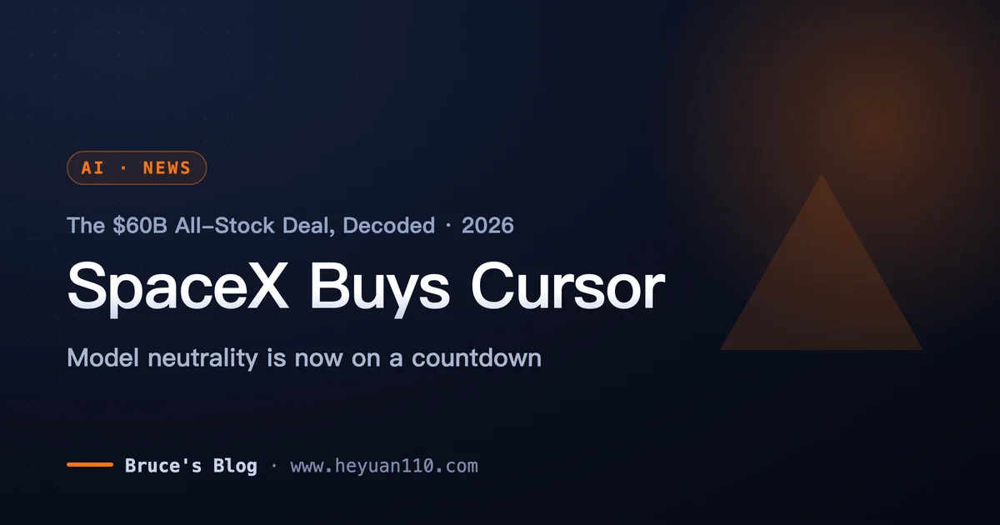
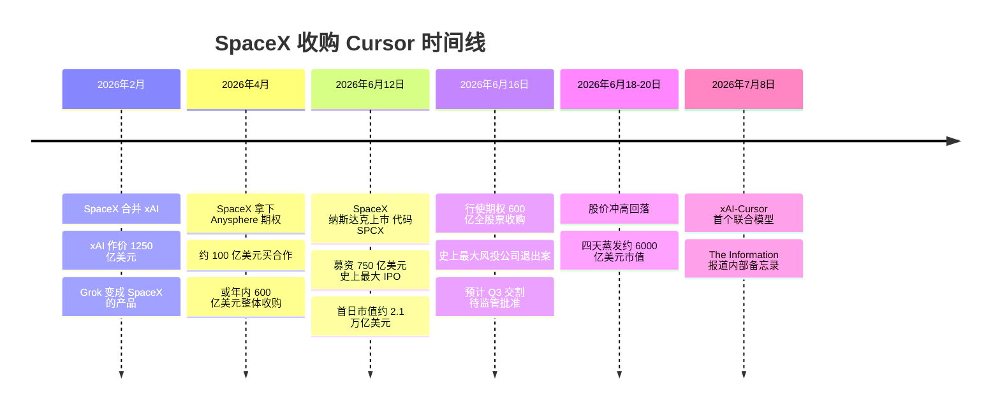
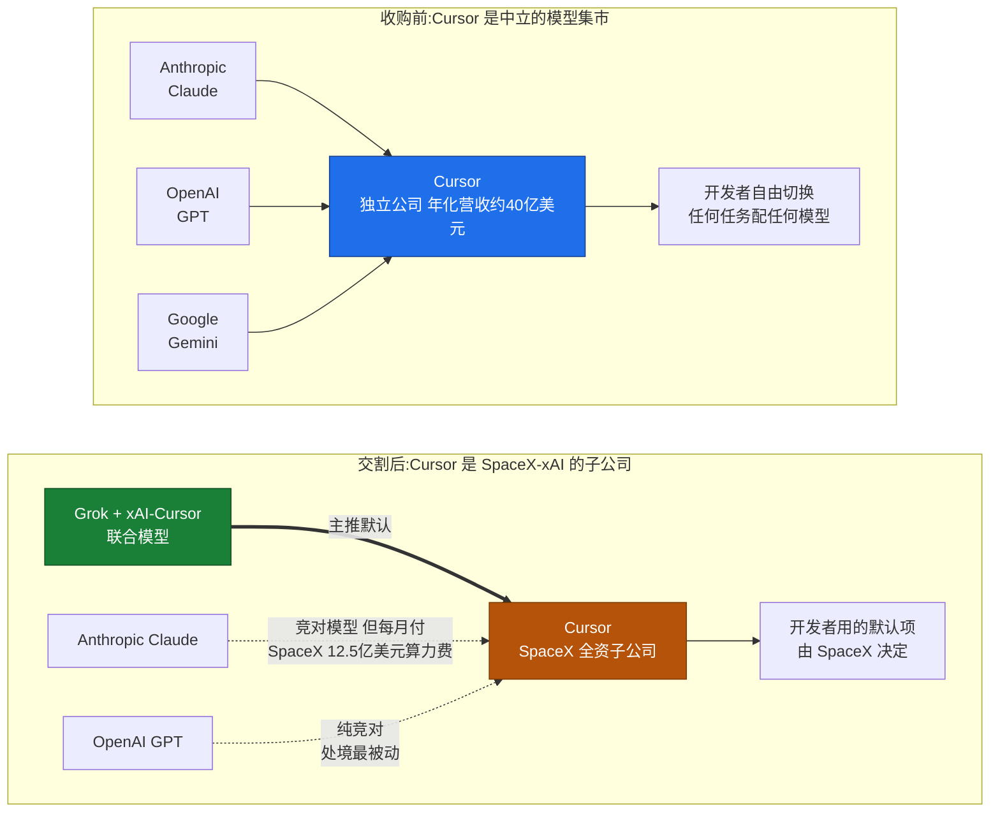
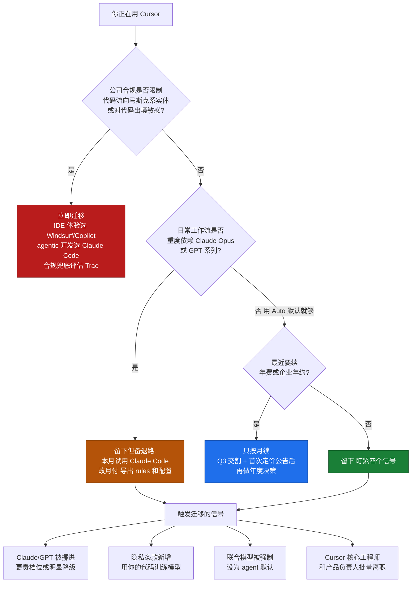

+++
date = '2026-07-09T13:00:00+08:00'
draft = false
title = 'SpaceX 600 亿美元收购 Cursor:还能用吗?要不要迁移?'
description = '已核实:SpaceX 于 2026 年 6 月 16 日以 600 亿美元全股票收购 Cursor 母公司 Anysphere,Q3 交割。本文分析 Claude 会不会被切、会不会涨价、国内开发者还能不能用、该不该迁移到 Claude Code。'
toc = true
tags = ['Cursor', 'SpaceX', 'xAI', 'AI Coding', 'Claude Code', 'Acquisition']
keywords = ['spacex 收购 cursor', 'cursor 被收购', 'cursor 还能用吗', 'cursor 替代品', 'cursor 涨价', 'xai cursor', 'cursor claude 被切', 'cursor 迁移 claude code']

[[params.faqItems]]
question = "SpaceX 真的收购 Cursor 了吗?是传闻还是实锤?"
answer = "实锤,不是传闻。2026 年 6 月 16 日,SpaceX 官宣行使期权,以 600 亿美元全股票收购 Cursor 母公司 Anysphere,这是史上最大的风投创业公司收购案。Cursor CEO Michael Truell 已发官方声明确认,交易预计 2026 年 Q3 交割,尚待监管批准。CNBC、Forbes、CBS 等主流媒体均有一手报道。"

[[params.faqItems]]
question = "Cursor 里的 Claude 模型会被切断吗?"
answer = "短期内大概率不会被一刀切。虽然 2025 年 Anthropic 曾在 OpenAI 洽购 Windsurf 时切断过 Claude 供应,但这次局面相反:Anthropic 每月向 SpaceX-xAI 支付约 12.5 亿美元租用 Colossus 数据中心算力,合同到 2029 年,双方深度互相绑定。真正的风险是温水煮青蛙——Grok 和 xAI-Cursor 联合模型成为推荐默认,Claude/GPT 逐渐被挤到更贵的档位。"

[[params.faqItems]]
question = "国内开发者还能继续用 Cursor 吗?"
answer = "目前可以正常使用,交易 Q3 才交割,产品和账号体系暂无变化。但要注意两点:一是 Cursor 归入马斯克系公司后,合规和地缘政治层面的不确定性上升,对国内用户的支付渠道和可用性存在长期变数;二是隐私条款可能在交割前后修订,涉及代码数据用于模型训练。建议保持月付、不买年费,同时准备好备选方案。"

[[params.faqItems]]
question = "Cursor 会涨价吗?"
answer = "官方暂未宣布涨价,但结构性压力都指向涨价。SpaceX 用约 15 倍远期营收的价格(600 亿美元)收购了年化营收约 40 亿美元的 Cursor,公告后四天 SpaceX 市值蒸发约 6000 亿美元,股东压力巨大。把 100 多万日活用户和 26 亿美元企业年化收入变现,是 SpaceX 手里最直接的杠杆。现阶段最实际的自保动作:只按月付费,不签年约。"

[[params.faqItems]]
question = "现在应该从 Cursor 迁移到什么工具?"
answer = "不用恐慌性迁移,但要备好退路。重度依赖 Claude 模型做 agentic 编程的,建议本月就试用 Claude Code,把迁移成本从一个季度压到一个周末;想要 Cursor 式 IDE 体验但不想要 SpaceX 的,Windsurf 和 GitHub Copilot 是最接近的替代;国内团队还可以评估字节 Trae 等本土方案。只有公司合规明确限制代码流向马斯克系实体时才需要立即迁移。"
+++

一家用机械臂在半空夹住火箭的公司,花 600 亿美元买了个代码编辑器。不是买卫星厂,不是买军工企业,是买了一个 VS Code fork。

这不是段子。2026 年 6 月 16 日,SpaceX 完成史上最大 IPO 的第四天,[CNBC 报道](https://www.cnbc.com/2026/06/16/spacex-spcx-cursor-acquisition-ipo.html)其官宣以 **600 亿美元全股票**收购 Cursor 母公司 Anysphere。Cursor CEO Michael Truell 发了官方声明,交易预计 Q3 交割、待监管批准,这是史上最大的风投创业公司收购案。**SpaceX 收购 Cursor** 是实锤——我动笔前花了一天交叉核实,因为它实在太像愚人节新闻。

它不荒诞的原因只有一个:买家早就不是"火箭公司"了。SpaceX 今年 2 月已经合并 xAI,Grok 和 Colossus 数据中心都装在这个上市主体里。换个读法,这笔交易一点也不拧巴:一家 AI 公司,买走了自己十年也攒不出来的开发者入口。

这也是我的核心判断:这是 GitHub 卖给微软之后,开发者工具市场最重要的一次易主,而且大多数解读看错了层——它不是 IDE 的故事,是"最大的中立模型集市"变成"模型厂商全资子公司"的故事。这篇快评讲三件事:核实过的事实、一个鲜明判断、以及国内开发者现在该做的动作。

## 先把事实钉死:SpaceX 收购 Cursor 是笔什么交易

越离奇的新闻,夸张版本长得越快。所以观点之前先上事实链,下面每一条都有 CNBC、Forbes、NPR、CBS 或公司官方声明背书,不是自媒体转述:

五个细节撑起整个故事:

- **买家本质是 xAI,火箭只是壳。** SpaceX 在 [2026 年 2 月合并了 xAI](https://en.wikipedia.org/wiki/Initial_public_offering_of_SpaceX),6 月 12 日以代码 SPCX 上市,募资 750 亿美元、史上最大 IPO。收购 Cursor 之前,Grok 和 Colossus 就已经在上市公司体内了。
- **剧本 4 月就写好了。** SpaceX 提前锁定期权结构:约 100 亿美元买合作,或年内 600 亿美元整体收购。上市第四天就行权——IPO 不是巧合,是给收购铸造货币。
- **全股票支付。** Anysphere 股东拿到 SpaceX A 类股。Truell 声明原话:"SpaceX 已行使期权,以全股票交易收购 Cursor,目标是打造世界上最有用的 AI 模型。"注意这句话落在哪个词上——模型,不是编辑器。
- **Cursor 是真金白银的生意。** 年化营收约 **40 亿美元**(2025 年 11 月还只有 10 亿),其中约 26 亿来自企业客户,财富 500 强里 64% 在用,日活开发者超过 100 万。
- **资本市场投了反对票。** 公告当天股价涨 16%,一度冲到美股市值第四;随后四天掉头向下,[蒸发约 6000 亿美元市值](https://medium.com/@reactjsbd/the-spacex-cursor-deal-wiped-out-600-billion-in-four-days-heres-what-actually-happened-c7aa0e9c4d2a)。稀释加主业失焦,股东把账算得明明白白。

事实钉完了。接下来说它们意味着什么。

## 为什么"造火箭的买 IDE"不是玩笑

站在 xAI 的位置看,这可能是它 2026 年做的最理性的一件事。年初的 xAI 手里全是算力、没有用户:Colossus 一期二期是前沿级配置,开发者心智几乎为零。

[HN 讨论这笔收购的帖子](https://news.ycombinator.com/item?id=48553224)里有条高赞评论很毒:"xAI,一家失败的 AI 公司,转型成了数据中心运营商。"难听,但业务结构上没冤枉它——xAI 今年最赚钱的生意是给对手当房东:[Anthropic 每月付 12.5 亿美元](https://techcrunch.com/2026/05/20/anthropic-will-pay-xai-1-25-billion-per-month-for-compute/)包下整个 Colossus 一期,Google 每月付 9.2 亿美元。收租是好生意,但收租不是 AI 战略。

买下 Cursor,一签字补齐三块短板。**入口**:100 多万日活开发者、64% 的财富 500 强,一夜到账,这是 Grok 靠自己十年也建不起来的分发渠道。**数据**:专业开发者的真实交互流——接受了哪些补全、拒绝了哪些、agent 任务的完整轨迹——是 Anthropic 和 OpenAI 之外最优质的编程 RLHF 语料,HN 上多位评论者都判断这才是收购的真实标的。**报表**:40 亿美元高速增长的年化营收,正好喂给一家急需向公众市场证明 1.7 万亿估值的新上市公司。

还有个让人无法指望交易黄掉的事实:**600 亿全股票对 SpaceX 近乎免费**。约 15 倍远期营收的倍数在 2026 年的 AI 市场不算疯,支付货币还是市值 2 万亿的新股——拿泡沫纸换真实营收,怎么算都划算。四天蒸发 6000 亿恰恰说明股东看懂了:对马斯克是理性交易,对他们是稀释。

我在[《2026 Agentic Coding 趋势》](/zh/posts/ai/2026-02-23-agentic-coding-trends-2026/)里判断过,今年编程工具市场会向"模型 + harness 一体化"收敛。SpaceX 直接把货架上最大的独立 harness 端走了——这正是接下来要讲的问题。

## Claude 会不会被切:Windsurf 剧本大概率不会重演

先拆恐慌版误读:"Anthropic 会像切 Windsurf 一样,马上切断 Cursor 的 Claude 供应。"

Windsurf 事件是真的:2025 年 OpenAI 洽购 Windsurf 期间,Anthropic 直接掐了它的模型供应,逻辑很直白——竞对要买你的分发渠道,你没理由继续递刀。但这次的杠杆是反着的。

**Anthropic 是 SpaceX-xAI 最大的算力客户**:每年约 150 亿美元、合同签到 2029 年 5 月,[包下整个 Colossus 一期还在扩到二期](https://www.datacenterdynamics.com/en/news/anthropic-to-use-all-of-spacex-xais-colossus-1-data-center-compute/)。[Anthropic 官方公告](https://www.anthropic.com/news/higher-limits-spacex)甚至把这笔算力说成 Claude 提高用量上限的底气。房东买了你最大的经销商,你不会烧房子——互为人质,是这个行业最被低估的稳定器。

所以真正的风险不是断供,是**温水**。先看收购前后的格局图:

温水的具体形态很好认:联合模型成为新用户默认——据 The Information 报道的内部备忘录,[它最早 7 月 8 日就发布](https://finance.yahoo.com/technology/ai/articles/spacexai-plans-launch-model-cursor-210200389.html),交易都还没交割;Grok 拿最快的响应通道、最深的 agent 集成、最松的限额;Claude 和 GPT 名义上还在列表里,但一步步挪进更贵的档位,新功能适配永远慢半拍。

Cursor 其实早就排练过这个剧本。自研 Composer 模型我在 [Composer 2 评测](/zh/posts/ai/2026-04-01-cursor-composer-2-review/)里拆过,当时它是对冲;现在"打造世界上最有用的 AI 模型"写进了 Truell 的官方声明,自研模型从对冲变成了使命。

模型选择器曾经是 Cursor 的产品本体,以后会变成导流漏斗。这是全文最重要的一句话。

## 谁该紧张:这笔收购的赢家和输家

最紧张的应该是 OpenAI。纯竞对、没有算力绑定、手里没有任何筹码——它的编程模型就此被挡在最大的第三方分发面之外。2025 年没买成 Windsurf,2026 年又眼看着最大的中立渠道落进对手口袋,两步都踏空。

躺赢的两家一根手指都没动。Windsurf 的销售话术一夜之间从"比 Cursor 便宜"升级成"不是 SpaceX 的 Cursor";GitHub Copilot 则自动接住每一家"不能接受马斯克实体"的企业订单。Anthropic 的处境最微妙:最大的 IDE 渠道被竞对买走,但对方又是自己的房东——Claude Code 从此成了它的战略对冲。

再往深一层看:独立、中立的编程 harness 这个物种正在灭绝。Claude Code 归 Anthropic,Copilot 归微软/OpenAI,Antigravity 归 Google,现在 Cursor 归 SpaceX-xAI——每一个像样的 harness 背后都站着一个模型厂商。以后选编程工具,等于选一个模型生态。这个选择应该你自己做,而不是等你的编辑器被谁收购后替你做。

## 国内开发者的三个现实问题

对国内用户,这笔收购还叠了一层国际用户不用考虑的风险。逐个说。

**第一,还能不能用?** 现在能,短期也不会变——Q3 才交割,账号、订阅、功能都照旧。但中长期不确定性实打实上升了:Cursor 从一家中立的旧金山创业公司,变成马斯克系上市公司的全资子公司,而 SpaceX 是美国国防承包商。

参考 Starlink 和 X 的先例,这类实体在支付渠道、出口合规、地区可用性上的政策弹性,比独立创业公司大得多。我不是说 Cursor 会对国内用户关门——没有任何证据指向这一点——但"永远可用"这个假设,该从你的规划里删掉了。虚拟卡付款、账号地区归属这类灰色操作的风险敞口,也会随母公司的合规等级水涨船高。

**第二,代码隐私怎么办?** 新东家 600 亿买的三样东西里就有"数据",官方声明写的目标是"造世界上最有用的 AI 模型"。Cursor 企业版引以为傲的隐私模式——代码只路由给你信任的模型商、不留存不训练——含金量需要重新称一称。

交割前后盯紧两份文件的修订:隐私政策和企业版 DPA(数据处理协议)。在跟外企协作、代码库有保密要求,或者公司安全团队本来就对代码出境敏感的,现在就该把 Cursor 的数据流向重新过一遍审。这不是阴谋论,是尽调。

**第三,会不会涨价?** 没官宣,但所有结构性压力都指向涨:600 亿收购价对应 40 亿年化营收,公告后四天蒸发 6000 亿市值,管理层给股东讲故事最快的办法,就是把 Cursor 的收入曲线拉陡。HN 上已经有企业用户反馈"我们合作的好几家公司砍掉了 Cursor 企业版"。

给国内个人用户的自保动作就一句:**只月付,别买年费**。每月多花的那点差价,买的是随时下车的自由。

## Cursor 替代品盘点:迁移去哪里

好消息是,2026 年 7 月这个时间点的退路,比一年前好得多。我在[《Claude Code vs Cursor vs Windsurf 2026 对比》](/zh/posts/ai/2026-02-18-claude-code-vs-cursor-vs-windsurf-2026/)里做过完整横评,这里按"你在乎什么"直接给结论:

- **在乎模型上限、做重度 agentic 开发** → **Claude Code**。Opus 系列在复杂重构和多文件任务上仍是天花板,terminal-first 工作流的迁移成本比想象中低——你在 Cursor agent 里攒的习惯(任务拆解、规则文件、MCP 配置)几乎原样平移,我的 [Cursor Agent 最佳实践](/zh/posts/ai/2026-01-19-cursor-agent-best-practices/)里的方法论八成能直接复用。
- **在乎 IDE 体验、想要"没有 SpaceX 的 Cursor"** → **Windsurf**。同为 VS Code fork,体验最接近,$15/月更便宜。它的销售话术已经从"比 Cursor 便宜"升级成"不是 SpaceX 的 Cursor"——这个定位反而因祸得福。
- **在乎预算、需求以补全为主** → **GitHub Copilot**,$10/月,背靠微软,企业合规最省心。那些"不能接受马斯克实体"的大公司订单,正在自动流向它。
- **在乎数据完全不出门** → **Continue.dev + 本地模型**,全链路自托管。
- **国内团队要合规兜底** → 把字节 **Trae** 这类本土 IDE 纳入评估。模型和体验跟第一梯队有差距,但"不受美国母公司政策波动影响"这一条,对某些团队就是决定性的。

## 决策树:该走该留,一张图定

亮明我的立场:**现在我不会把新团队的工作流建在 Cursor 上**。不是产品变差了——它的 agent 工具链依然顶级——是它的"前提假设"变得不稳了。

给团队选工具,本质是给它未来 18 个月的路线图背书。而 Cursor 接下来 18 个月的主线任务是:融入一个万亿级母公司、推自家模型、向股东证明 600 亿花得值。这些事没有一件是为用户做的。

个人用户可以从容得多。Auto 模式够用就留下——背靠 Colossus 级算力,联合模型说不定真的能打。但请把配置保持在"可携带"状态:`.cursorrules`、MCP 配置、常用 prompt 都存好。

这跟 [WWDC 2026 苹果把 Siri 交给 Gemini](/zh/posts/ai/2026-06-09-apple-wwdc-2026-gemini-siri-pivot/) 那篇讲的是同一个道理:平台方的战略转向从不提前打招呼,用户能做的,就是让自己的迁移成本永远小于一个周末。

## 写在最后

SpaceX 收购 Cursor,是核实过的事实、算得过来的生意、以及对"中立模型集市"这个物种的定点清除——三件事按这个顺序都成立。Anthropic 每年 150 亿美元的算力绑定,让 Windsurf 式的瞬间断供大概率不会重演。

会发生的是更慢、更难上头条的事:默认项挪动、档位重排。然后 2027 年的某一天,你突然发现模型选择器与其说是菜单,不如说是个建议。

你不需要这周就离开 Cursor,你需要的是**这周就解除对它的锁定**:改月付、配置可携带、花一个下午试一次替代品。工具忠诚是上一个时代的习惯——那个时代,你的编辑器不会以 600 亿美元易主。这个时代结束于 6 月 16 日。

## 相关阅读

- [Claude Code vs Cursor vs Windsurf:2026 全面对比](/zh/posts/ai/2026-02-18-claude-code-vs-cursor-vs-windsurf-2026/)
- [Cursor Agent 最佳实践](/zh/posts/ai/2026-01-19-cursor-agent-best-practices/)
- [2026 Agentic Coding 趋势](/zh/posts/ai/2026-02-23-agentic-coding-trends-2026/)
- [Cursor Composer 2 评测:自研模型这步棋](/zh/posts/ai/2026-04-01-cursor-composer-2-review/)
- [苹果 WWDC 2026 大转向:Siri 改用 Gemini](/zh/posts/ai/2026-06-09-apple-wwdc-2026-gemini-siri-pivot/)
- [Anthropic 9650 亿估值与 Managed Agents](/zh/posts/ai/2026-06-12-anthropic-965b-managed-agents/)
