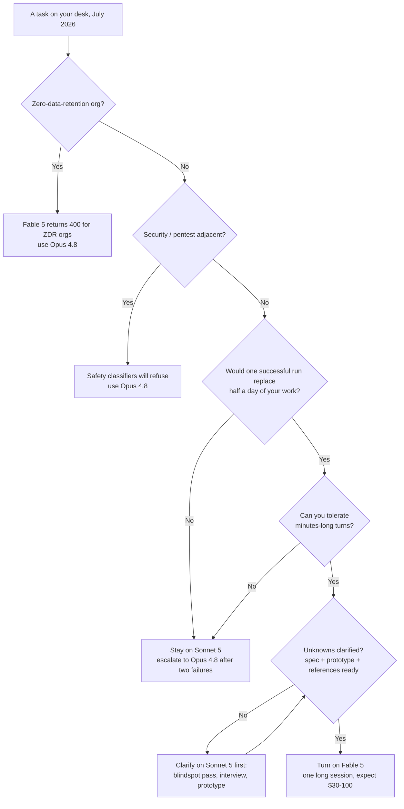
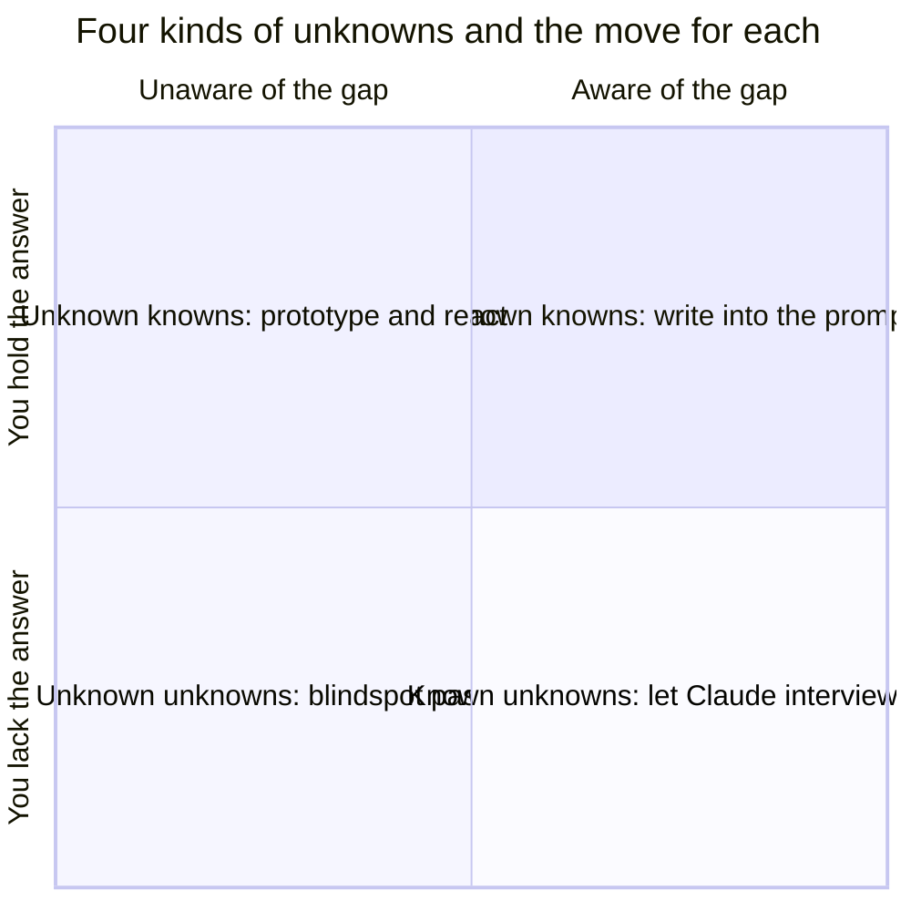

+++
date = '2026-07-10T15:00:00+08:00'
draft = false
title = 'Claude Fable 5: When the $10/$50 Flagship Is Worth It'
description = 'Fable 5 is usage-credits only after July 12, 2026. Real tasks cost $30-100, not the $10/$50 sticker. A decision tree for when it pays off, and how to prompt it.'
toc = true
tags = ['Claude', 'Fable 5', 'AI Coding Models', 'LLM Pricing']
keywords = ['claude fable 5', 'fable 5 review', 'is fable 5 worth it', 'fable 5 pricing', 'fable 5 vs opus 4.8', 'fable 5 usage credits', 'fable 5 subscription']

[[params.faqItems]]
question = "Is Claude Fable 5 included in Claude Pro or Max subscriptions?"
answer = "No. As of July 13, 2026, Fable 5 is not included in any Claude subscription plan. It remains selectable in Claude.ai and Claude Code, but bills against a separately funded usage-credit balance at $10/$50 per million tokens. Anthropic says it will restore in-plan access 'when capacity allows' but has given no date."

[[params.faqItems]]
question = "How much does Claude Fable 5 actually cost per task?"
answer = "The sticker is $10 per million input tokens and $50 per million output tokens, but always-on thinking and long agentic sessions inflate that. My estimate for a serious agentic coding task in July 2026 is $30-100 in API-equivalent spend — versus roughly $0.50-2 for the same task on Sonnet 5."

[[params.faqItems]]
question = "Is Fable 5 worth it compared to Opus 4.8?"
answer = "Only for tasks where one run plausibly replaces half a day or more of your own work: one-shot feature builds, deep analysis reports, and massive migrations. For everything else, Opus 4.8 at $5/$25 with no per-use billing — or Sonnet 5 — delivers indistinguishable results at a fraction of the cost."

[[params.faqItems]]
question = "Why does Fable 5 burn usage limits so fast?"
answer = "Three compounding reasons: adaptive thinking is always on and bills as output tokens at $50 per million; agentic sessions re-read growing context every turn; and unclarified requirements trigger expensive retries. One public test on a $200 Max plan burned 73% of a 5-hour window on just 3 tasks."

[[params.faqItems]]
question = "When will Fable 5 return to Claude subscription plans?"
answer = "Unknown. Anthropic's official statement says it plans to restore Fable 5 as a standard part of paid plans once there is sufficient serving capacity, but as of July 12, 2026 no timeline has been announced. Until then, access requires usage credits on top of any subscription."
+++

Three tasks. That's all it took to burn through 73% of a five-hour usage window — and one of the three never even finished. It happened to Kazike (卡兹克), a Chinese blogger on the $200/month Max 20x plan — the most expensive consumer tier Anthropic sells — during Fable 5's free window. He said it was the first time he'd ever felt token scarcity; in years of shipping code on Opus 4.8, it had never happened once.

Here's the part that should worry you: that was while Fable 5 was free.

On July 13, 2026, **Claude Fable 5** drops out of every subscription plan. That same burn rate now pulls real dollars from a separately funded usage-credit balance: $10 per million input tokens, $50 per million output. No frontier lab has ever done this — ship your best model, let everyone get a taste, then stick a meter on it.

So this post is about money, start to finish: what a Fable 5 task actually costs, which tasks are worth it, and how to make sure the run you pay for doesn't go sideways. "What should my default model be" is a different question — I covered it in [my cross-vendor comparison](/posts/ai/2026-07-07-best-ai-coding-models-2026/), and the answer is still Sonnet 5.

Cards on the table: Fable 5 is a per-task purchase, not a monthly teammate. At $30–100 a run, it only pencils out when one successful run plausibly replaces half a day of your own work.

## Where Fable 5 Lives After July 13

Fable 5 didn't disappear — it went from subscription perk to metered add-on. Its status has whipsawed all month, so here's the whole saga, checked against Anthropic's own statements and squeezed into one table:

| Date (2026) | What happened |
|---|---|
| June 9 | GA; in-plan access announced as free through June 22 |
| June 12 | US government [directive suspends access](https://www.anthropic.com/news/fable-mythos-access) for all foreign nationals |
| June 30 | Export controls lifted |
| July 1 | [Redeployed globally](https://www.anthropic.com/news/redeploying-fable-5); Pro/Max/Team get it for up to 50% of weekly limits, through July 7 |
| July 7 | After subscriber backlash, [extended five days](https://www.forbes.com/sites/sandycarter/2026/07/07/claude-fable-5-extends-by-five-more-days-10-moves-to-make-now/) to July 12, 11:59 PM PT |
| July 13 → | Usage credits only, at API rates, on top of any plan |

Read that sequence back: free, banned overnight, restored, pulled again — four states in one month. And the July 7 extension didn't come from goodwill; subscribers forced it, and what they were angry about is the math in the next section.

> As of July 13, 2026, Claude Fable 5 is not included in any Claude subscription plan. It bills through a separate usage-credit balance at $10 per million input tokens and $50 per million output tokens, and Anthropic has announced no date for restoring in-plan access.

Two claims making the rounds deserve corrections. First, Fable 5 is **not "API-only"** after the cutoff. It's still right there in the model picker in Claude.ai and Claude Code; it just bills your usage-credit balance instead of your plan's included limits. You can keep your $20 Pro plan and run Fable 5 tonight — you'll just be watching a dollar meter instead of a usage bar.

Second, "temporary" is doing a lot of work in Anthropic's framing. The company says it'll restore in-plan access once serving capacity allows — and as of July 12, there's no timeline attached. Budget as if this lasts months, not days.

Two hard constraints also carry over unchanged from June. Fable 5 has [mandatory 30-day data retention and is excluded from zero-data-retention agreements](https://platform.claude.com/docs/en/about-claude/models/introducing-claude-fable-5-and-claude-mythos-5) — ZDR organizations get a 400 on every request, full stop. And its safety classifiers decline with `stop_reason: "refusal"` often enough to matter for anything security-adjacent. Its unclassified sibling Mythos 5 remains limited to Project Glasswing partners, so it isn't an option for the rest of us.

## Fable 5 Pricing in Practice: How $10/$50 Becomes $30–100 a Task

The sticker price is the least useful number in this whole decision. Three multipliers sit between $10/$50 and what you actually spend — here's the math so you can plug in your own numbers.

**Multiplier one: thinking you cannot turn off.** On Fable 5, [adaptive thinking is the only mode](https://platform.claude.com/docs/en/about-claude/models/introducing-claude-fable-5-and-claude-mythos-5) — `thinking: {"type": "disabled"}` isn't supported, and thinking tokens bill as output at $50 per million. Even a "short answer" carries reasoning overhead, hard turns can think for minutes, and your only throttle is the `effort` parameter, which most people never touch.

The thinking tax deserves its own line item. A 60-turn coding session averaging 5K thinking tokens per turn is 300K tokens of pure thought — $15 before a single line of code gets written. Opus 4.8 ($5/$25) lets you choose when to pay for extended thinking, so the effective output-price gap is much wider than the nominal 2x.

**Multiplier two: agentic compounding.** A Claude Code session isn't one API call; it's dozens of turns, each re-reading a growing context. Prompt caching absorbs most of it — cache reads cost about a tenth of fresh input — but the snowball still rolls: a two-hour session over a mid-sized repo routinely racks up tens of millions of cache-read tokens plus hundreds of thousands of output tokens.

Napkin math for a typical deep task: ~15M cache reads ($15) + 1M fresh input ($10) + 400K output including thinking ($20) — call it $45. That's the anatomy behind my working estimate of $30–100 per serious run. Plug your own usage into my [Claude token cost calculator](/tools/claude-token-cost-calculator.html) — a 20-turn session and an 80-turn session are the difference between a coffee and a dinner.

**Multiplier three: retries you cause yourself.** Every run that comes back wrong because you under-specified it is a full-price run. Nobody budgets for this one, and it's the one you control most directly — the last section of this post is entirely about shrinking it.

With all three multipliers in view, that opening 73% stops being mysterious: one deep Fable 5 task ate roughly a quarter of a Max 20x window, on Anthropic's priciest consumer tier. Carry that into post-July-13 billing and it gets scarier — three deep tasks a day at my per-task estimate works out to about a $3,000 month. The same tasks on Sonnet 5: fifty cents to two bucks each.

This isn't a price hike. It's a change of unit — from dollars per month to dollars per task.

Which is why "is Fable 5 worth it" has no answer in the aggregate — it only resolves task by task. (For how the subscription tiers map to real usage generally, see my [Claude pricing complete guide](/posts/ai/2026-04-03-claude-pricing-complete-guide/).) The next section is the per-task answer.

## The Half-Day Test: Which Tasks Deserve Fable 5

The rule I actually use has one clause: **turn on Fable 5 only when a single successful run would plausibly replace at least half a day of your own skilled work.** At $30–100 per run against $300+ of engineer time, that's a 3–10x return with margin for partial misses. Below the bar, you're paying a 5–20x premium for output you couldn't tell apart from a cheaper model's.

Three archetypes clear the bar consistently, each with concrete evidence.

**The one-shot feature build.** Back to Kazike. He wanted a time-decayed "trending" section for his AI news site — clustering, decay weighting, plus the edge case where a quiet news day should collapse the section entirely. He went through two design sessions with Opus 4.8 and walked away unhappy both times; Fable 5 took the same requirement and had it designed, built, and in production in 30 minutes, edge cases included.

That's the profile: a task with real design judgment in it, where the flagship's extra depth converts directly into not needing you in the loop.

**The deep analysis report.** This is the archetype that changed my mind about what the price buys. The same user asked Opus 4.8 to back-test a month of scoring data and got a report he described as insight-free; Fable 5 ran autonomously for 1 hour 18 minutes and produced an analysis that took him 20 minutes to read — flagging problems in his scoring system he had never thought to ask about. Hold onto "never thought to ask"; the last section collects on it.

**The massive mechanical migration.** This is the category Anthropic's own launch material staked out: Stripe ran a full-library migration across a 50-million-line Ruby codebase in a single day — work a team would have scheduled in months. Few of us have Stripe's problem, but the shape generalizes: enormous, latency-tolerant, machine-checkable, where a per-run fee is noise against the alternative.

The bar cuts just as hard the other way. Interactive edit-run-fix loops fail twice over: the task value is small, and the always-on thinking latency wrecks the rhythm — while iterating, a model that answers in 15 seconds at 90% beats one that answers in four minutes at 97%. High-volume pipeline work (test generation, lint sweeps, commit messages) fails on value. Security work fails on refusals: Kazike reported Fable 5 declining to audit *his own codebase* for vulnerabilities. ZDR organizations fail with a hard 400.

None of those are edge cases. Together they cover most of a normal working week — which is the honest core of any Fable 5 review: it is simultaneously the strongest model available and the wrong choice for most hours of the day.

Here's the whole ledger in one flowchart — if you screenshot one thing from this post, make it this:

The most important node is the one that loops: if your unknowns aren't clarified, the tree won't let you spend — it sends you back to a cheap model first. Note also what this tree is not: it doesn't pick your vendor or your default; that's the [cross-vendor comparison](/posts/ai/2026-07-07-best-ai-coding-models-2026/). This one runs per task, after your default is set.

Quick reference by task type:

| Task type | Model | Why | Cost per run (my estimate) |
|---|---|---|---|
| One-shot feature / frontend build | **Fable 5** | #1 WebDev Arena; one run ships the feature | $30–60 |
| Deep analysis report over data or code | **Fable 5** | surfaces problems you didn't know to ask about | $50–100 |
| Massive mechanical migration | **Fable 5** | Stripe-scale work, machine-checkable | scale-dependent |
| Daily agentic coding | Sonnet 5 | beats Opus 4.8 on Terminal-Bench at 40% of the price | $0.5–2 |
| Deep multi-file refactor | Opus 4.8 | strong reasoning, no per-use meter | $5–15 |
| Interactive edit-run-fix loop | Sonnet 5 | Fable's thinking latency kills tight loops | cents |
| High-volume pipelines | Haiku 4.5 | capability delta ≈ 0, cost delta ~10x | cents |
| Security / pentest tooling | Opus 4.8 | Fable's classifiers refuse benign security work | — |
| Brainstorming / clarifying unknowns | Sonnet 5 | the prep loop for a Fable run | cents |

## Close Your Unknowns Before You Pay

Deciding *when* to turn Fable 5 on is half the job; the other half is making sure the paid run is the one that works. The best guidance here comes from inside Anthropic: Thariq Shihipar, an engineer on the Claude Code team, published [A Field Guide to Fable: Finding Your Unknowns](https://x.com/trq212/status/2073100352921215386) on July 3, and it passed two million views within days on the strength of one sentence: "Fable is the first model where I find the quality of the work is bottlenecked by my ability to clarify its unknowns."

His frame is simple. Your prompt and context are a map; the codebase and its real constraints are the territory; the gap between them is the unknowns — and when Claude hits an unknown, it decides based on its best guess of what you want. For years the bottleneck was model capability: you pushed the model, and the model was what fell short. Fable 5 flips that. When a run comes back wrong now, the cause is usually a hole in your map.

My one addition is a cost footnote: at $50 per million output tokens, every unknown the model has to guess at is a line item on your bill. Thariq's own summary is accidentally a billing strategy: "Every explainer, brainstorm, interview, prototype, and reference is a cheap way to find out what you didn't know before it gets expensive to fix."

He sorts unknowns into four quadrants, each with its own move:

**If you can state it, state it.** Known knowns are ordinary spec-writing; no technique required.

**If you know you haven't decided, get interviewed.** One prompt does it: "Interview me one question at a time about anything ambiguous. Prioritize questions whose answers would change the architecture." That last clause does the real work — without it, the model asks trivia.

**If you'd only recognize it on sight, go fishing.** Unknown knowns are the standards you hold but would never think to write down. Ask for four throwaway design directions in one HTML page with fake data; your reaction to what's wrong *is* the missing spec.

**If you can't even name the question, ask for a blindspot pass.** Say it straight: "I'm adding an auth provider but I've never touched this codebase's auth module. Do a blindspot pass: what are my unknown unknowns here?" Telling the model what you don't know is the method, not an embarrassment.

Now to collect on that phrase from the half-day test. The analysis-report archetype is worth $100 precisely because it *is* a paid, industrial-strength unknown-unknowns pass — run over your data instead of your prompt. The framework and the cost math aren't two separate pieces of advice; they're the same economics viewed from the prompt side.

### My Pre-Flight Checklist

The quadrants become a routine once you pin them to a sequence, and my biggest concrete recommendation is one Thariq's guide implies but never states: **run the entire clarification phase on Sonnet 5, and let Fable 5 touch only the final execution run.** Clarification is conversational, latency-sensitive, many-turn work — everything Fable 5 is bad at and Sonnet 5 is nearly free at. The cheap model asks the questions; the expensive model does the work.

**Before** (Sonnet 5, ~$1 of tokens):

- Blindspot pass over any unfamiliar territory
- Interview, one question at a time, architecture-changing questions first
- Throwaway prototype with fake data for anything visual or UX-shaped
- Reference pointers: "this Rust crate in `vendor/rate-limiter` has the backoff semantics I want; reimplement them in our TypeScript client" beats three paragraphs of prose
- An implementation plan with the most volatile decisions at the top — data model changes, type interfaces, anything user-facing — because those are what you'll actually want to veto

The artifacts that prep loop produces — spec, prototype, references, plan — are exactly the curated context the expensive run consumes. That's [context engineering](/posts/ai/2026-06-16-context-engineering-2026/) in its purest form.

**During** (Fable 5, the metered part):

- Start a fresh session and feed it the artifacts, not the conversation that produced them
- Run one long session, not several short ones — warm cache and intact context beat re-clarifying every restart, and on a per-token meter, restarts are literally money
- Have it keep an `implementation-notes.md`: on an edge case, take the conservative option, log the deviation, keep moving
- Define "done" — and when the loop stops — before you launch; designing the loop before paying for it is the whole thesis of [loop engineering](/posts/ai/2026-07-05-loop-engineering/), and it matters most when every lap has a price

**After** (either model):

- Ask for a walkthrough report, then a quiz on the changes
- Hold Thariq's line: merge only on a perfect score

A $50 run that ships code you don't understand isn't leverage; it's deferred debugging at flagship prices.

One last note from my own setup, because I didn't reason my way to these rules — I got burned into them. This blog's entire production pipeline runs on Claude Code — parallel agents drafting posts, generating covers, running validation — and parallelism is exactly where flagship pricing turns dangerous: a 5x per-token premium multiplied across N concurrent agents isn't an upgrade, it's a leak.

So my standing config is boring on purpose: cheap models by default, Fable 5 behind a manual, per-task escalation, released only for the single deep pass — the site-wide audit, the gnarly feature — where the half-day test genuinely clears. I paid real quota to learn that the thinking tax applies even to tasks that need no thinking. You don't have to pay it again.

## What to Remember

As of July 13, 2026, Fable 5 is a metered add-on: $10/$50, usage credits, no restoration date. Treat it as a per-task purchase whose real price is $30–100 a run, turn it on only for tasks that pass the half-day test — one-shot builds, deep analysis, huge migrations — and let Sonnet 5 run everything else. Before every paid run, spend a dollar of cheap tokens closing your unknowns: with a model this strong, the bottleneck and the bill point at the same thing — your own clarity.

## Related Reading

- [Best AI Coding Models 2026: Fable 5 vs Sonnet 5 vs GPT-5.6](/posts/ai/2026-07-07-best-ai-coding-models-2026/) — the cross-vendor "what should my default be" question
- [Claude Token Cost Calculator](/tools/claude-token-cost-calculator.html) — price your own Fable 5 session before you run it
- [Context Engineering in 2026](/posts/ai/2026-06-16-context-engineering-2026/) — the artifact-driven prep that makes expensive runs land
- [Loop Engineering: Designing the Loop Before You Run It](/posts/ai/2026-07-05-loop-engineering/)
- [Claude Pricing Complete Guide: API vs Pro vs Max](/posts/ai/2026-04-03-claude-pricing-complete-guide/)
