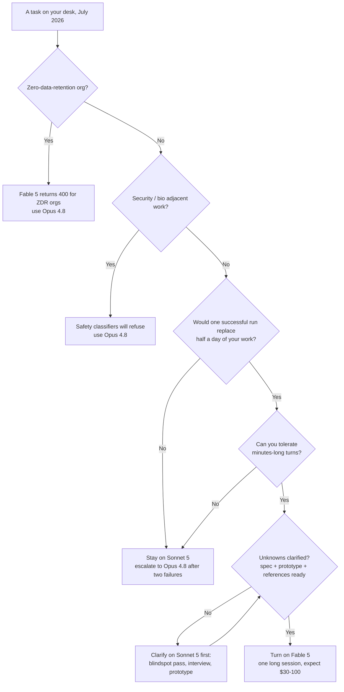
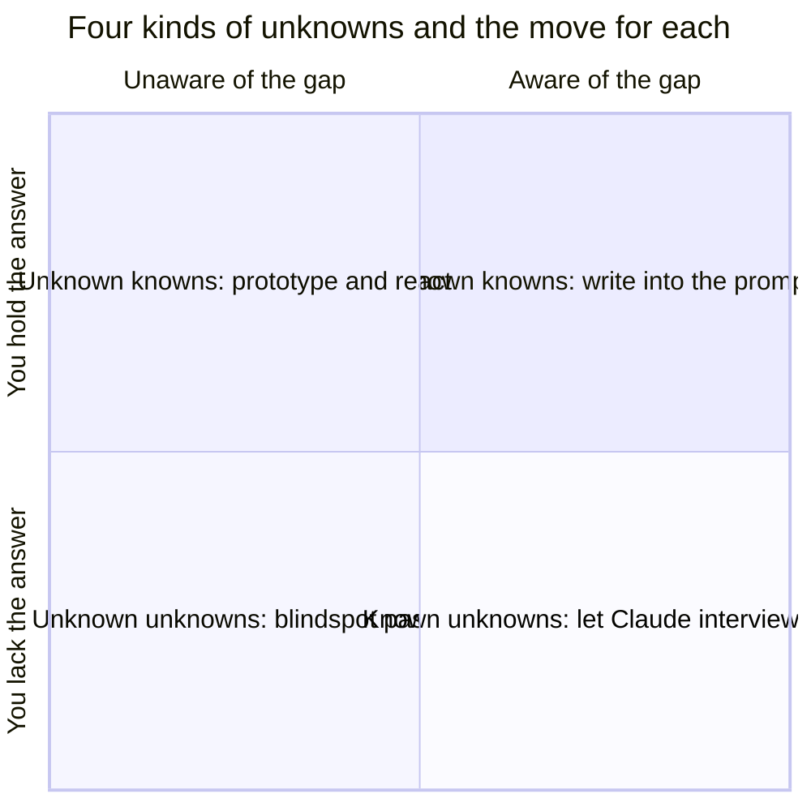

+++
date = '2026-07-10T15:00:00+08:00'
draft = false
title = 'Claude Fable 5: When the $10/$50 Flagship Is Worth It'
description = 'Fable 5 is usage-credits only after July 12, 2026. Real tasks cost $30-100, not the $10/$50 sticker. A decision tree for when it pays off, and how to prompt it.'
toc = true
tags = ['Claude', 'Fable 5', 'AI Coding Models', 'LLM Pricing']
keywords = ['claude fable 5', 'fable 5 review', 'is fable 5 worth it', 'fable 5 pricing', 'fable 5 vs opus 4.8', 'fable 5 usage credits', 'fable 5 subscription']

[[params.faqItems]]
question = "Is Claude Fable 5 included in Claude Pro or Max subscriptions?"
answer = "No. As of July 13, 2026, Fable 5 is not included in any Claude subscription plan. It remains selectable in Claude.ai and Claude Code, but bills against a separately funded usage-credit balance at $10/$50 per million tokens. Anthropic says it will restore in-plan access 'when capacity allows' but has given no date."

[[params.faqItems]]
question = "How much does Claude Fable 5 actually cost per task?"
answer = "The sticker is $10 per million input tokens and $50 per million output tokens, but always-on thinking and long agentic sessions inflate that. My estimate for a serious agentic coding task in July 2026 is $30-100 in API-equivalent spend — versus roughly $0.50-2 for the same task on Sonnet 5."

[[params.faqItems]]
question = "Is Fable 5 worth it compared to Opus 4.8?"
answer = "Only for tasks where one run plausibly replaces half a day or more of your own work: one-shot feature builds, deep analysis reports, and massive migrations. For everything else, Opus 4.8 at $5/$25 with no per-use billing — or Sonnet 5 — delivers indistinguishable results at a fraction of the cost."

[[params.faqItems]]
question = "Why does Fable 5 burn usage limits so fast?"
answer = "Three compounding reasons: adaptive thinking is always on and bills as output tokens at $50 per million; agentic sessions re-read growing context every turn; and unclarified requirements trigger expensive retries. One public test on a $200 Max plan burned 73% of a 5-hour window on just 3 tasks."

[[params.faqItems]]
question = "When will Fable 5 return to Claude subscription plans?"
answer = "Unknown. Anthropic's official statement says it plans to restore Fable 5 as a standard part of paid plans once there is sufficient serving capacity, but as of July 12, 2026 no timeline has been announced. Until then, access requires usage credits on top of any subscription."
+++

On July 12, 2026 at 11:59 PM Pacific, Claude Fable 5 leaves every subscription plan. From July 13, the strongest model you can buy bills like a metered utility — $10 per million input tokens, $50 per million output — even if you already pay $200 a month for Max. No frontier lab has done this before: shipped its best model, let everyone taste it, then moved it behind a separate meter. Which means **claude fable 5** now poses a question no previous model did. Not "which model should I default to" — I answered that in [my cross-vendor comparison](/posts/ai/2026-07-07-best-ai-coding-models-2026/), and the answer is still Sonnet 5. The new question is: **when is a single Fable 5 run worth real money, and how do you make sure you don't waste it?** This post answers only those two things.

My position up front: Fable 5 is a per-task purchase, not a monthly teammate. A serious agentic run costs $30–100 in my estimate — so it only clears its own bar when one run plausibly replaces half a day of your work, *and* you've done the cheap preparation first. The most expensive thing you can feed Fable 5 is a prompt you haven't thought through.

## Fable 5 Availability in July 2026: What Actually Changed

The status question has to come first, because most of what was written about Fable 5 access in June is already wrong. Here is the verified timeline, from Anthropic's own statements:

| Date (2026) | What happened |
|---|---|
| June 9 | Fable 5 GA on the API and in paid Claude plans; in-plan access announced through June 22 |
| June 12 | US government [directive orders Anthropic to suspend access](https://www.anthropic.com/news/fable-mythos-access) for all foreign nationals |
| June 30 | Export controls lifted |
| July 1 | [Redeployed globally](https://www.anthropic.com/news/redeploying-fable-5) on Claude.ai, Claude Code, Claude Cowork, and the API; included in Pro/Max/Team and select Enterprise plans for up to 50% of weekly usage limits, through July 7 |
| July 7 | After subscriber backlash, Anthropic [extends the window five days](https://www.forbes.com/sites/sandycarter/2026/07/07/claude-fable-5-extends-by-five-more-days-10-moves-to-make-now/), to July 12 at 11:59 PM PT |
| July 13 → | Usage credits only, at API rates, on top of any plan |

Two corrections to widely repeated claims. First, **Fable 5 is not "API-only" after the cutoff**. That framing spread from launch-week coverage, but the actual mechanism is different: the model stays selectable inside Claude.ai and Claude Code — it just draws from a separately funded usage-credit balance instead of your plan's included limits. You can keep your $20 Pro plan and still run Fable 5 tonight; you'll just watch a dollar meter instead of a usage bar. Second, the removal is framed as temporary but is **open-ended**: Anthropic's redeployment statement commits to restoring Fable 5 as a standard plan feature when serving capacity allows, and as of July 12, 2026, no timeline exists. Plan for the metered state to last months, not days.

> As of July 13, 2026, Claude Fable 5 is not included in any Claude subscription plan. It bills through a separate usage-credit balance at $10 per million input tokens and $50 per million output tokens, and Anthropic has announced no date for restoring in-plan access.

One more status fact that matters if you're deciding whether to build on it: the compliance profile didn't change with the redeployment. Fable 5 (and its unclassified sibling Mythos 5, still limited to Project Glasswing partners) carries [mandatory 30-day data retention and is excluded from zero-data-retention agreements](https://platform.claude.com/docs/en/about-claude/models/introducing-claude-fable-5-and-claude-mythos-5) — ZDR organizations get a 400 on every request, full stop. And its safety classifiers can decline requests with `stop_reason: "refusal"`, which for security-adjacent work happens often enough to matter. Both of these were true in June and remain true now.

## The Real Fable 5 Pricing: Why $10/$50 Understates the Bill

The sticker price is the least useful number in this decision, and I want to show the math rather than assert it. Three multipliers sit between "$10/$50" and what you actually spend.

**Multiplier one: thinking you cannot turn off.** On Fable 5, [adaptive thinking is the only mode](https://platform.claude.com/docs/en/about-claude/models/introducing-claude-fable-5-and-claude-mythos-5) — `thinking: {"type": "disabled"}` is not supported, and thinking tokens bill as output at $50 per million. A "short answer" still carries reasoning overhead, and hard turns can think for minutes. The `effort` parameter is your only throttle, and most people never touch it. Compare that with Opus 4.8, where you choose when to pay for extended thinking, and the effective output-price gap becomes larger than the nominal 2x.

**Multiplier two: agentic compounding.** A Claude Code session is not one API call; it's dozens of turns, each re-reading a growing context. Prompt caching softens this enormously — cache reads cost around a tenth of fresh input — but the snowball still rolls. A two-hour session over a mid-sized repo routinely accumulates tens of millions of cache-read tokens plus hundreds of thousands of output tokens. Priced out: roughly 15M cache reads (~$15) + 1M fresh input ($10) + 400K output including thinking ($20) lands a single deep task at about $45. That's the anatomy behind my working estimate: **a serious agentic Fable 5 task costs $30–100 in API-equivalent terms as of July 2026**. Plug your own numbers into my [Claude token cost calculator](/tools/claude-token-cost-calculator.html) — the difference between a 20-turn and an 80-turn session is the difference between a coffee and a dinner.

**Multiplier three: retries you cause yourself.** Every run that comes back wrong because you under-specified the task is a full-price run. This is the multiplier nobody budgets for and the one you control most directly — the second half of this post is entirely about shrinking it.

The compounding is not theoretical. During the free window, one of the most-shared Chinese write-ups on the launch came from the blogger 卡兹克, a $200/month Max 20x subscriber who publicly reported that **3 tasks — one of which never finished — consumed 73% of a full 5-hour usage window**. On the highest consumer tier Anthropic sells. He described it as the first time he'd ever felt token scarcity, something that never happened to him on Opus 4.8. Roughly speaking, one deep Fable 5 task ate a quarter of a Max 20x window; run three deep tasks a day through usage credits at my per-task estimate and you're staring at a ~$3,000 month. That, not abstract principle, is why the subscriber backlash forced the five-day extension — and why "is fable 5 worth it" is the wrong question in aggregate. It's only answerable per task. (For how the subscription tiers map to real usage generally, see my [Claude pricing complete guide](/posts/ai/2026-04-03-claude-pricing-complete-guide/).)

## When Is Fable 5 Worth It? The Half-Day Test

Here is the rule I actually use: **turn on Fable 5 only when a single successful run would plausibly replace at least half a day of your own skilled work.** At $30–100 per run against a half-day of engineer time ($300+ at typical rates), that's a 3–10x return — comfortable margin even when a run partially misses. Below that bar, you're paying a 5–20x model premium for outcomes a cheaper model delivers indistinguishably.

Three task archetypes clear the bar consistently, and the evidence for each is concrete. The first is the **one-shot feature build**. The same Max subscriber above had spent two design sessions with Opus 4.8 trying to add a time-decayed "trending" section to his AI news aggregator — clustering, decay weighting, the edge case where a quiet day should collapse the section entirely — and wasn't satisfied either time. He handed the same requirement to Fable 5, which designed and shipped the entire feature to production in 30 minutes, edge cases included. That's the profile: a task with real design judgment in it, where the flagship's extra depth converts directly into not needing you in the loop.

The second archetype is the **deep analysis report**, and it's the one that changed my mind about what the price buys. Same user, same pattern: he'd asked Opus 4.8 to back-test a month of scoring data across his monitoring pipeline and got a report he described as insight-free. Fable 5 ran autonomously for 1 hour 18 minutes and produced an analysis so detailed it took him 20 minutes to read — surfacing problems in his scoring system he had never thought to ask about. Hold onto that phrasing, because it's the bridge to the second half of this post: the tasks where Fable 5 earns its price are precisely the ones dense with *unknown unknowns*, where you're paying the model to find the questions, not just the answers.

The third is the **massive mechanical migration** — the category Anthropic's own launch material staked out with Stripe running a full-library migration across a 50-million-line Ruby codebase in a day, work a team would have scheduled in months. Few of us have Stripe's problem, but the shape generalizes: enormous, latency-tolerant, machine-checkable work where a per-run fee is noise against the alternative.

And the bar cuts hard the other way. Interactive edit-run-fix loops fail the test twice over — the task value is small and the always-on thinking latency wrecks the loop; a model that answers in 15 seconds at 90% quality beats one that answers in four minutes at 97% when you're iterating. High-volume pipeline work (test generation, lint sweeps, commit messages) fails on value. Security and pentest tooling fails on refusals — the classifiers that triggered June's export drama also decline benign hardening requests; the same user reported Fable 5 refusing to audit *his own codebase* for vulnerabilities. And ZDR organizations fail on a hard 400. None of these are edge cases; together they're most of a normal week. That's the honest core of any **fable 5 review**: it is simultaneously the best model I've used and the wrong model for most hours of the day.

## The "Should I Turn On Fable 5?" Decision Tree

Compressed into one picture — this is the screenshot to keep:

Note what this tree is not: it's not a "which vendor" tree — that one lives in the [cross-vendor comparison](/posts/ai/2026-07-07-best-ai-coding-models-2026/) and picks your *default*. This tree runs per task, after your default is set, and its most important node is the one that loops: if your unknowns aren't clarified, the tree sends you back to a cheap model before it lets you spend. The quick-reference version, by task type:

| Task type | Model | Why | Cost per run (my estimate) |
|---|---|---|---|
| One-shot feature / frontend build | **Fable 5** | #1 WebDev Arena; one run ships the feature | $30–60 |
| Deep analysis report over data or code | **Fable 5** | surfaces problems you didn't know to ask about | $50–100 |
| Massive mechanical migration | **Fable 5** | Stripe-scale work, machine-checkable | scale-dependent |
| Daily agentic coding | Sonnet 5 | beats Opus 4.8 on Terminal-Bench at 40% of the price | $0.5–2 |
| Deep multi-file refactor | Opus 4.8 | strong reasoning, no per-use meter | $5–15 |
| Interactive edit-run-fix loop | Sonnet 5 | Fable's thinking latency kills tight loops | cents |
| High-volume pipelines | Haiku 4.5 | capability delta ≈ 0, cost delta ~10x | cents |
| Security / pentest tooling | Opus 4.8 | Fable's classifiers refuse benign security work | — |
| Brainstorming / clarifying unknowns | Sonnet 5 | the prep loop for a Fable run | cents |

## How to Use Fable 5 Well: Close Your Unknowns Before You Pay

Deciding *when* is half the job. The other half is making sure the run you pay for is the run that works — and here the best guidance comes from inside Anthropic. Thariq Shihipar, an engineer on the Claude Code team, published [A Field Guide to Fable: Finding Your Unknowns](https://x.com/trq212/status/2073100352921215386) on July 3, and it racked up over two million views within days for one sentence in particular: "Fable is the first model where I find the quality of the work is bottlenecked by my ability to clarify its unknowns."

His frame: your prompt and context are a *map*; the codebase and its real constraints are the *territory*; and "the difference between the map and the territory is what I call unknowns. When Claude runs into an unknown, it needs to make a decision based on its best guess of what I want." For years the bottleneck was model capability — you pushed the model, and the model was the thing that fell short. Fable 5 inverts that. When a run comes back wrong now, the cause is usually a gap in *your* map, and — this is my addition to his argument — **at $50 per million output tokens, every unknown the model has to guess at is a line item on your bill**. Thariq's own summary is accidentally a billing strategy: "Every explainer, brainstorm, interview, prototype, and reference is a cheap way to find out what you didn't know before it gets expensive to fix."

He sorts unknowns into the classic four quadrants, and each quadrant has a distinct move:

**Known knowns** are the easy quadrant — things you can state, so state them; this is ordinary spec-writing. **Known unknowns** — the decisions you know you haven't made — get resolved by flipping the interview: "Interview me one question at a time about anything ambiguous. Prioritize questions whose answers would change the architecture." That prioritization clause does real work; without it the model asks trivia. **Unknown knowns** are the sneaky quadrant: standards you hold but would never think to write down, the "I'll know it when I see it" layer. You can't articulate these, so you fish for them — ask for four throwaway design directions in one HTML page with fake data, react to what's wrong, and your reaction *is* the missing spec. And **unknown unknowns** — the questions you don't know to ask — are the quadrant where you name the problem explicitly: "I'm adding an auth provider but I've never touched the auth module. Do a blindspot pass: what are my unknown unknowns here, so I can prompt you better?" Telling the model who you are and what you don't know is the point, not an embarrassment.

Notice the loop closing: the analysis-report archetype from the half-day test is valuable *because* it's a paid, industrial-strength unknown-unknowns pass over your data. The framework isn't separate advice from the cost math — it's the same economics viewed from the prompt side.

## From Framework to Routine: My Pre-Flight Checklist

The four quadrants become operational when you attach them to a sequence, and my single biggest concrete recommendation is one Thariq's guide implies but doesn't state: **run the entire clarification phase on Sonnet 5, and let Fable 5 touch only the final execution run.** Clarification is conversational, latency-sensitive, many-turn work — everything Fable 5 is bad at and Sonnet 5 is nearly free at. The cheap model asks the questions; the expensive model does the work. This is [context engineering](/posts/ai/2026-06-16-context-engineering-2026/) in its purest form: the artifacts you produce in the prep loop — spec, prototype, references, plan — are exactly the curated context the expensive run consumes.

**Before (Sonnet 5, ~$1 of tokens):** blindspot pass if any part of the territory is unfamiliar; interview, one question at a time, architecture-changing questions first; a throwaway prototype with fake data for anything visual or UX-shaped; pointers to reference code — "this Rust crate in `vendor/rate-limiter` has the backoff semantics I want; reimplement them in our TypeScript client" beats three paragraphs of prose; finally an implementation plan ordered with the most volatile decisions at the top — data model changes, type interfaces, anything user-facing — because those are what you'll actually want to veto.

**During (Fable 5, the metered part):** start a fresh session and feed it the artifacts, not the conversation that produced them. Run it as one long session rather than several short ones — a warm cache and intact context beat re-clarifying every restart, and on a per-token meter, restarts are literally money. Have it maintain an `implementation-notes.md`: when it hits an edge case and must deviate from the plan, take the conservative option, log the deviation, keep moving. And decide before you launch what "done" means and when the loop should stop — designing the loop *before* paying for the loop is the whole thesis of [loop engineering](/posts/ai/2026-07-05-loop-engineering/), and it matters most when each lap has a price on it.

**After (either model):** ask for a walkthrough report, then a quiz on the changes — and hold yourself to Thariq's standard of merging only on a perfect score. A $50 run that ships code you don't understand isn't leverage; it's deferred debugging at flagship prices.

I'll add the perspective from my own setup, because it shaped my rules here. This blog's entire production pipeline runs on Claude Code — parallel agents drafting posts, generating covers, running validation — and parallelism is exactly what makes flagship pricing dangerous: a 5x per-token premium multiplied across N concurrent agents isn't an upgrade, it's a leak. So my standing configuration is boring by design: the pipeline defaults to cheap models, Fable 5 sits behind a manual, per-task escalation, and it only comes out for the single deep pass — the site-wide audit, the gnarly feature — where the half-day test genuinely clears. I burned real quota learning that the always-on thinking tax applies even to tasks that don't need thinking; don't relearn it on your own credits.

## The Bottom Line

Three sentences to keep. As of July 13, 2026, Fable 5 is a metered add-on — $10/$50, usage credits, no restoration date — so treat it as a per-task purchase whose real price is $30–100 a run, not as a subscription perk that's temporarily missing. Turn it on only for tasks that pass the half-day test — one-shot builds, deep analysis, huge migrations — and keep Sonnet 5 as the default everything else runs on. And before every paid run, spend a dollar of cheap-model tokens closing your unknowns, because with a model this strong, the bottleneck — and the bill — is your own clarity.

## Related Reading

- [Best AI Coding Models 2026: Fable 5 vs Sonnet 5 vs GPT-5.6](/posts/ai/2026-07-07-best-ai-coding-models-2026/) — the cross-vendor "what should my default be" question
- [Claude Token Cost Calculator](/tools/claude-token-cost-calculator.html) — price your own Fable 5 session before you run it
- [Context Engineering in 2026](/posts/ai/2026-06-16-context-engineering-2026/) — the artifact-driven prep that makes expensive runs land
- [Loop Engineering: Designing the Loop Before You Run It](/posts/ai/2026-07-05-loop-engineering/)
- [Claude Pricing Complete Guide: API vs Pro vs Max](/posts/ai/2026-04-03-claude-pricing-complete-guide/)
