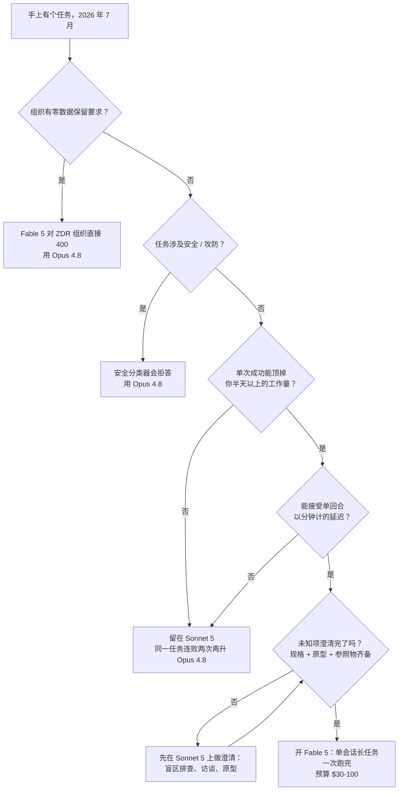
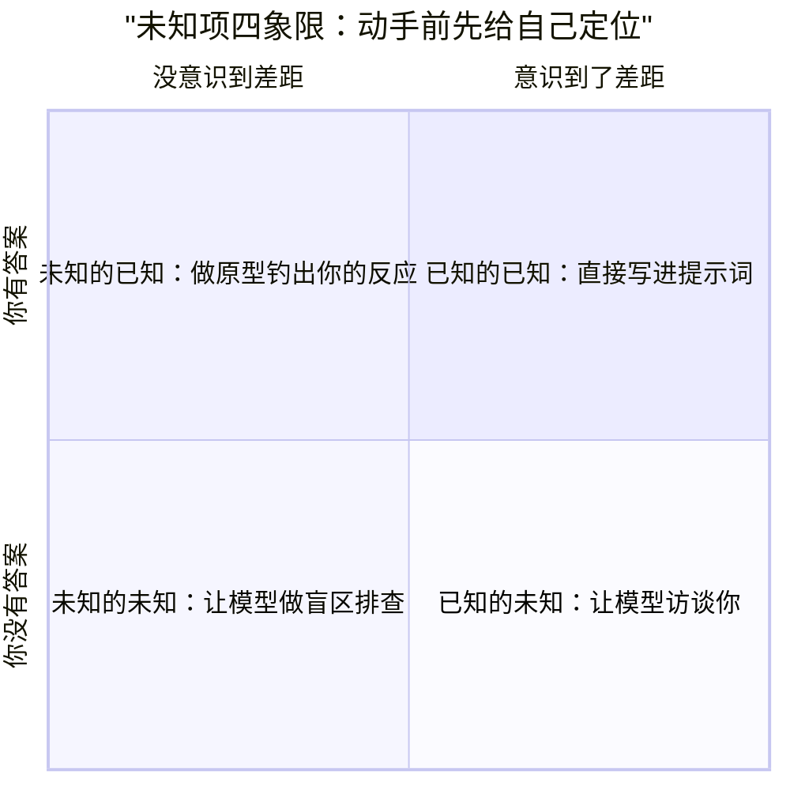

+++
date = '2026-07-10T15:00:00+08:00'
draft = false
title = 'Claude Fable 5 值不值：$10/$50 的决策账与用好它的方法'
description = '2026 年 7 月 13 日起 Fable 5 退出所有 Claude 订阅，只能用 usage credits 按 $10/$50 计费。本文算清单次任务 $30-100 的真实成本账，给出该不该开 Fable 5 的决策树，以及用未知项框架榨干每一次付费调用的完整流程。'
toc = true
tags = ['Claude', 'Fable 5', 'AI Coding Models', 'LLM Pricing']
keywords = ['claude fable 5', 'fable 5 价格', 'fable 5 值不值', 'fable 模型', 'fable 5 订阅', 'fable 5 额度', 'fable 5 怎么用']

[[params.faqItems]]
question = "Fable 5 还在 Claude Pro/Max 订阅里吗？"
answer = "不在了。2026 年 7 月 13 日起，Fable 5 不包含在任何 Claude 订阅方案里。它仍然可以在 Claude.ai 和 Claude Code 里选用，但按独立充值的 usage credits 计费，每百万 token 输入 $10、输出 $50。官方承诺容量充足后恢复进订阅，但没有给任何时间表。"

[[params.faqItems]]
question = "Fable 5 一次任务实际花多少钱？"
answer = "标价 $10/$50 每百万 token，但 thinking 关不掉、agentic 会话逐轮滚雪球，我的估算是一次认真的编码任务折合 API 开销 $30-100。同样的任务用 Sonnet 5 大约只要 $0.5-2。"

[[params.faqItems]]
question = "Fable 5 和 Opus 4.8 选哪个？"
answer = "只有单次运行能顶你半天以上工作量的任务值得开 Fable 5：一把梭的完整功能、深度分析报告、超大规模迁移。其余场景 Opus 4.8（$5/$25、不走按次计费）甚至 Sonnet 5 的产出基本无差别，价格只有几分之一。"

[[params.faqItems]]
question = "为什么 Fable 5 烧额度特别快？"
answer = "三个原因叠加：adaptive thinking 永远开启且按 $50/M 的输出价计费；agentic 会话每轮都要重读不断变长的上下文；需求没说清导致的整次返工全部按原价再烧一遍。有 Max $200 用户实测 3 个任务烧掉 5 小时额度的 73%。"

[[params.faqItems]]
question = "Fable 5 什么时候恢复进订阅方案？"
answer = "未知。Anthropic 官方声明的说法是等服务容量充足后将 Fable 5 恢复为付费方案的标准组成部分，但截至 2026 年 7 月 12 日没有公布任何时间表。在那之前，用它就要在订阅之外单独充值 usage credits。"
+++

三个任务，烧掉 5 小时额度窗口的 73%——其中一个还没跑完。这是公众号作者卡兹克在 Fable 5 免费窗口期的公开实测，而他用的是 $200/月的 Max 20x，Anthropic 卖给个人用户的最高档位。他的原话是：第一次感受到 token 不够用。在他拿 Opus 4.8 做开发的日子里，这种事从没发生过。

我看到这个数字的第一反应是：这还是免费的时候。

2026 年 7 月 13 日起，**Claude Fable 5** 退出所有订阅方案。同样的燃烧速度，从此改成从你单独充值的 usage credits 里扣真钱：每百万 token 输入 $10、输出 $50。前沿实验室从没这么干过——把最强的模型放出来让所有人尝鲜，然后单独给它装一块电表。

所以这篇文章从头到尾只算一件事：钱。一次 Fable 5 任务实际花多少、什么任务配得上这个价、怎么保证付费的那次运行不白跑。至于「日常默认用哪个模型」，我在[跨厂商模型对比](/zh/posts/ai/2026-07-07-best-ai-coding-models-2026/)里答过，答案依然是 Sonnet 5，这里不再重复。

先把立场摆桌上：Fable 5 是按次购买的外聘专家，不是包月的同事。单次 $30 到 $100，只有大概率能顶掉你半天以上工作量的任务，才配得上它。

## 7 月 13 日之后，Fable 5 在哪、怎么收费

Fable 5 没有下架，只是从订阅福利变成了按表计费的外挂档。它过去一个月的状态反复横跳，我按 Anthropic 官方声明逐条核实过，压缩成一张表：

| 日期（2026） | 发生了什么 |
|---|---|
| 6 月 9 日 | GA 上线，宣布订阅内免费用到 6 月 22 日 |
| 6 月 12 日 | 美国政府[下令暂停](https://www.anthropic.com/news/fable-mythos-access)所有外国用户访问 |
| 6 月 30 日 | 出口管制解除 |
| 7 月 1 日 | [全球重新上线](https://www.anthropic.com/news/redeploying-fable-5)，Pro/Max/Team 可用至周额度 50%，截止 7 月 7 日 |
| 7 月 7 日 | 订阅用户反弹，[延长五天](https://www.forbes.com/sites/sandycarter/2026/07/07/claude-fable-5-extends-by-five-more-days-10-moves-to-make-now/)至 7 月 12 日 23:59（太平洋时间） |
| 7 月 13 日起 | 仅限 usage credits，按 API 价计费 |

一个月之内：免费尝鲜、一夜禁用、恢复、再移除，四个状态走完。7 月 7 日那次五天延期是被订阅用户的反弹硬逼出来的——而逼出它的不是情怀，是下一节那本账。

> 截至 2026 年 7 月 13 日，Claude Fable 5 不包含在任何 Claude 订阅方案中。它通过独立充值的 usage credits 计费，每百万 token 输入 $10、输出 $50，Anthropic 未公布恢复订阅内访问的日期。

两个流传很广的说法需要纠正。第一，7 月 13 日之后 Fable 5 不是「只能走 API」：它仍然留在 Claude.ai 和 Claude Code 的模型选单里，只是从 usage credits 余额扣钱、不占订阅额度。

也就是说，你可以留着 $20 的 Pro，今晚照样跑 Fable 5——区别是你盯的东西从额度条变成了美元表。

第二，「临时移除」实际上是无限期。官方承诺容量充足后把它恢复为订阅方案的标准部分，但截至 7 月 12 日没给任何时间表。做预算按「这个状态持续几个月」来打算，别按「过几天就回来」。

最后两条硬约束，决定你到底能不能碰它。Fable 5 强制 [30 天数据保留、不适用零数据保留协议](https://platform.claude.com/docs/en/about-claude/models/introducing-claude-fable-5-and-claude-mythos-5)，ZDR 组织的每个请求直接吃 400；它的安全分类器会以 `stop_reason: "refusal"` 拒答，安全相关工作触发频率高到影响正常干活。

至于没装分类器的兄弟版 Mythos 5——仍然只对 Project Glasswing 合作方开放，你我碰不到。

## Fable 5 的真实成本：$10/$50 怎么变成单次 $30-100

标价是整笔账里信息量最低的数字。从 $10/$50 到你实际掏的钱，中间隔着三个乘数——我把算法摆出来，你随时可以代入自己的数字。

**乘数一：关不掉的 thinking**。Fable 5 上 [adaptive thinking 是唯一的思考模式](https://platform.claude.com/docs/en/about-claude/models/introducing-claude-fable-5-and-claude-mythos-5)，`thinking: {"type": "disabled"}` 不被支持，而思考 token 全部按 $50/M 的输出价计费。

也就是说，哪怕一句「简短回答」也自带推理开销，难题单回合能思考好几分钟。唯一的油门是 `effort` 参数——而大多数人从没碰过它。

这笔 thinking 税值得单独算给你看。一场 60 回合的编码会话，每回合平均思考 5K token，光思考就是 30 万 token——$15，一行代码还没写就先扣掉了。对比 Opus 4.8（$5/$25）可以自己决定什么时候花钱深度思考，两者实际的输出价差远大于名义上的 2 倍。

**乘数二：agentic 滚雪球**。一次 Claude Code 会话不是一次 API 调用，是几十个回合，每回合都要重读一遍越滚越大的上下文。提示词缓存能挡掉大半——缓存读约是新输入价的十分之一——但雪球照样滚：两小时的中型仓库会话，累计几千万缓存读 token 加几十万输出 token 是常态。

把一个典型深度任务解剖开：约 15M 缓存读（$15）+ 1M 新输入（$10）+ 40 万含思考的输出（$20），落在 $45 左右。这就是「单次 $30-100」这个工作估算的来历。

拿你自己的用量去 [Claude token 成本计算器](/tools/claude-token-cost-calculator.html)里跑一遍——20 轮会话和 80 轮会话，是一杯咖啡和一顿晚饭的差别。

**乘数三：你自己造成的返工**。每一次因为需求没说清而跑偏的运行，都是一次全价运行。这是没人写进预算、却最受你控制的乘数——本文最后一节整个都在讲怎么压它。

三个乘数齐了，回头解剖开头那个 73%：一个深度 Fable 5 任务约等于四分之一个 Max 20x 窗口，Anthropic 最贵的个人档位，四个任务就见底。

换算到 7 月 13 日之后的计费方式更吓人——按我的单次估算，每天跑三个深度任务，一个月就是三千美元上下。而同样的任务换 Sonnet 5，大约 $0.5 到 $2。

这不是涨价，是计价单位换了：从「每月多少钱」换成「每个任务多少钱」。

所以「fable 5 值不值」在整体层面是个伪问题，它只能按任务逐个回答。各档订阅怎么换算成真实用量，[Claude 价格完全指南](/zh/posts/ai/2026-04-03-claude-pricing-complete-guide/)里有完整拆解；下一节直接给逐任务的回答方法。

## 半天工作量测试：什么任务配得上 Fable 5

我实际在用的规则只有一条：**单次成功运行大概率能顶掉你至少半天的工作量，才开 Fable 5**。$30-100 一次，对上半天工程师时间（通行价 $300 以上），是 3 到 10 倍回报，就算这次运行打了折扣也有安全边际。够不到这条线，你就是在为便宜模型也能无差别做到的产出，付 5 到 20 倍溢价。

三类任务能稳定过线，每一类都有具体证据。

**第一类：一把梭的完整功能**。还是卡兹克：他想给自己的 AI 资讯站加一个带时间衰减的「当前热点」区块——聚簇、衰减加权，还有「安静的日子整个区块要消失」这种边界情况。跟 Opus 4.8 讨论两轮方案，两次都不满意；同样的需求扔给 Fable 5，30 分钟设计加开发完毕直接上线，边界情况全考虑到了。

这就是典型画像：真正需要设计判断的任务，旗舰多出来的那截深度，直接兑换成「不需要你盯着」。

**第二类：深度分析报告**。这是真正改变我对这个价格看法的一类。同一位用户让 Opus 4.8 回测一个月的评分数据，拿到一份他自己形容为没有洞见的报告；Fable 5 自主跑了 1 小时 18 分钟，产出的分析详细到他花 20 分钟才读完——里面指出的评分体系问题，很多是他从没想到要问的。

记住「没想到要问」这几个字，最后一节要回收。

**第三类：超大规模机械迁移**。Anthropic 官方发布材料押注的类别：Stripe 用 Fable 5 在 5000 万行的 Ruby 代码库上做全库迁移，一天完成——按团队排期是以月计的活。没几个人有 Stripe 的问题，但形状是通用的：体量巨大、不在乎延迟、结果可机器校验，单次费用相对替代方案就是零头。

这条线反过来切得同样狠。改—跑—修的交互循环双重不及格：任务价值小，而且关不掉的 thinking 延迟会毁掉节奏——迭代的时候，15 秒给 90 分的模型胜过 4 分钟给 97 分的。

不及格名单还很长。高频流水线（批量测试、lint 修复、commit message）在价值上不及格；安全攻防在拒答上不及格——卡兹克实测，连让 Fable 5 审计他**自己的代码库**有没有漏洞都被拒了；ZDR 组织则直接 400 出局。

这些不是边角案例。加起来，就是一个普通工作周的大多数时间——任何一篇诚实的 fable 5 测评都绕不开这句话：它同时是目前最强的模型，和一天里大多数时刻的错误选择。

整笔账压成一张图，要截图存就存这张：

树上最重要的节点是那个会绕回去的环：未知项没澄清，树不放你花钱，先把你打回便宜模型。另外注意这棵树不管「选哪家厂商」——那是[跨厂商对比](/zh/posts/ai/2026-07-07-best-ai-coding-models-2026/)里决定默认档的事；这棵树在默认档定好之后，按任务逐次跑。

按任务类型的速查版：

| 任务类型 | 用哪个模型 | 为什么 | 单次成本量级（我的估算） |
|---|---|---|---|
| 一把梭完整功能 / 前端 | **Fable 5** | WebDev Arena 第一，一次运行直接交付 | $30–60 |
| 数据 / 代码库深度分析报告 | **Fable 5** | 挖出你没想到要问的问题 | $50–100 |
| 超大规模机械迁移 | **Fable 5** | Stripe 级别的活，结果可机器校验 | 看规模 |
| 日常 agentic 编码 | Sonnet 5 | Terminal-Bench 反超 Opus 4.8，价格四成 | $0.5–2 |
| 多文件深度重构 | Opus 4.8 | 推理够深，且不走按次计费 | $5–15 |
| 改—跑—修交互循环 | Sonnet 5 | Fable 的 thinking 延迟会毁掉节奏 | 几美分 |
| 高频流水线任务 | Haiku 4.5 | 能力差约等于零，成本差约 10 倍 | 几美分 |
| 安全 / 渗透测试相关 | Opus 4.8 | Fable 的分类器连善意加固都拒 | — |
| 头脑风暴 / 澄清未知项 | Sonnet 5 | 给 Fable 运行做准备的循环 | 几美分 |

## 付钱之前：先花一美元，关掉你的未知项

决定什么时候开只是半件事，另一半是保证付费的那次运行就是成功的那次。这方面最好的方法论来自 Anthropic 内部。

Claude Code 团队工程师 Thariq Shihipar 在 7 月 3 日发布了 [A Field Guide to Fable: Finding Your Unknowns](https://x.com/trq212/status/2073100352921215386)，几天内阅读量破两百万，爆点是一句话——Fable 是第一个让他觉得「工作质量的瓶颈，卡在我能不能替它澄清未知项」的模型。

他的框架不复杂。你的提示词和上下文是地图，代码库和真实约束是疆域，两者之间的差距就是未知项——Claude 一旦撞上未知项，只能按「它猜你想要什么」来做决定。过去很多年瓶颈在模型那边，你推着模型走，掉链子的是模型；Fable 5 把这个关系倒了过来，现在一次运行跑偏，原因通常是你的地图上有洞。

我只给他的论证补一个成本注脚：在 $50/M 的输出价下，模型每猜一个你没说清的未知项，都是账单上的一行。Thariq 自己的总结句无意中就是一份计费策略：每一次讲解、头脑风暴、访谈、原型和参照，都是在事情变贵之前，便宜地弄清你原来不知道什么。

未知项分四种，每种对应一个明确的动作：

**说得出来的，直接写**。已知的已知就是普通的规格撰写，没什么技巧可言。

**知道自己没定的，让模型访谈你**。提示词就一句：「一次只问我一个问题，围绕所有含糊的地方，优先问那些答案会改变架构的。」最后那个优先级从句是真正干活的部分——不加它，模型只会问细枝末节。

**看到才认得的，去钓**。你心里有标准、但绝不会想到写下来的那层东西，说不出来就钓出来：让模型用假数据在一个 HTML 页里出四个风格迥异的方案，你对「哪里不对劲」的反应，本身就是缺失的那段规格。

**连问题都提不出的，点名要盲区排查**。直接说：「我要加一个鉴权提供方，但我从没碰过这个代码库的鉴权模块。做一次盲区排查，我在这里的未知的未知有哪些？」把你不懂什么告诉模型，是方法本身，不丢人。

现在回收上一节留的钩子。深度分析报告之所以值 $100，正因为它就是一次付费的、工业强度的「未知的未知」排查，只不过对象换成了你的数据。未知项框架和前面的成本账不是两套建议——是同一笔经济账，从提示词那一侧看过去的样子。

### 我的起飞前检查单

四个象限接上一条时间线才算落地。我最想给的一条具体建议，Thariq 的指南暗示了但没有明说：**整个澄清阶段放在 Sonnet 5 上跑，Fable 5 只碰最后那次执行**。

道理很直接：澄清是对话式、对延迟敏感、多回合的活，每一条都是 Fable 5 的短板、Sonnet 5 近乎免费的长处。便宜模型负责问问题，贵模型负责干活。

**运行前**（Sonnet 5，约 $1 的 token）：

- 疆域里有陌生地带，先做盲区排查
- 一次一个问题地访谈，改变架构的问题排最前
- 视觉或交互类的东西，用假数据做个一次性原型
- 给参照物：「`vendor/rate-limiter` 里这个 Rust crate 的退避语义就是我要的，照着在我们的 TypeScript 客户端重写」——一句话胜过三段描述
- 最后要一份实现方案，最易变的决策排最上面：数据模型改动、类型接口、一切面向用户的东西——那些才是你真正会想否决的部分

这套准备产出的制品——规格、原型、参照物、方案——恰好就是贵的那次运行要消费的、筛选过的上下文。这就是[上下文工程](/zh/posts/ai/2026-06-16-context-engineering-2026/)最纯粹的形态。

**运行中**（Fable 5，走电表的部分）：

- 新开一个会话，喂制品本身，不喂产出制品的聊天记录
- 跑一个长会话而不是几个短的——缓存是热的、上下文是完整的；在按 token 计费的电表下，重启就是字面意义上的烧钱
- 让它维护一份 `implementation-notes.md`：撞上边界情况就选保守选项、记下偏离、继续走
- 启动前先定义「什么算完成、循环什么时候停」——先设计循环再为循环付钱，这是[循环工程](/zh/posts/ai/2026-07-05-loop-engineering/)那篇的全部论点，当每一圈都有标价时，它比任何时候都重要

**运行后**（哪个模型都行）：

- 先要一份讲解报告，再要一套关于这次改动的测验
- 按 Thariq 的标准执行：测验满分才允许合并

一次 $50 的运行如果交付的是你看不懂的代码，那不是杠杆，是按旗舰价预付的调试债。

最后说说我自己的配置，因为上面这些规则就是这么被烫出来的。这个博客的整条生产流水线跑在 Claude Code 上：并行 agent 写稿、生成封面、跑校验。而并行恰恰是旗舰定价最危险的地方——5 倍的单 token 溢价乘上 N 个并发 agent，不是升级，是漏水。

所以我的常驻配置无聊得很：流水线默认便宜模型，Fable 5 藏在手动的、按任务的升级开关后面，只放给全站审计、难啃功能这种真正过线的单次深活。「thinking 税对不需要思考的任务照收不误」这一课，我是用真额度学的——你不用再交一遍学费。

## 最后三句

第一句：Fable 5 从 2026 年 7 月 13 日起是按表计费的外挂档——$10/$50、走 usage credits、恢复无期——把它当成单价 $30-100 的按次采购，别当暂时缺货的订阅福利。

第二句：只为过了半天测试的任务开它——一把梭功能、深度分析、巨型迁移——其余一切留在 Sonnet 5 上跑。

第三句：付费之前，先花一美元的便宜 token 关掉未知项。面对一个这么强的模型，瓶颈和账单指向同一个东西：你自己的清晰度。

## 相关阅读

- [2026 最强 AI 编码模型对比：Fable 5、Sonnet 5 还是 GPT-5.6](/zh/posts/ai/2026-07-07-best-ai-coding-models-2026/) — 跨厂商「默认档选谁」的那个问题
- [Claude Token 成本计算器](/tools/claude-token-cost-calculator.html) — 跑之前先算算你这次 Fable 5 会话要花多少
- [2026 上下文工程指南](/zh/posts/ai/2026-06-16-context-engineering-2026/) — 让昂贵运行一次落地的制品化准备
- [循环工程：先设计循环，再启动循环](/zh/posts/ai/2026-07-05-loop-engineering/)
- [Claude 价格完全指南：API、Pro、Max 怎么选](/zh/posts/ai/2026-04-03-claude-pricing-complete-guide/)
