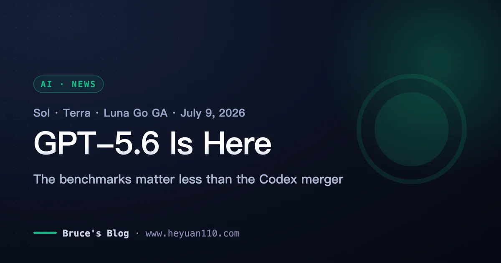
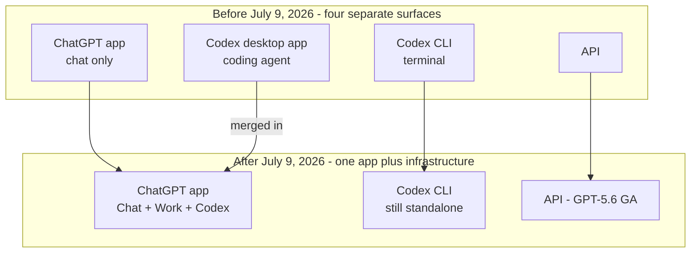
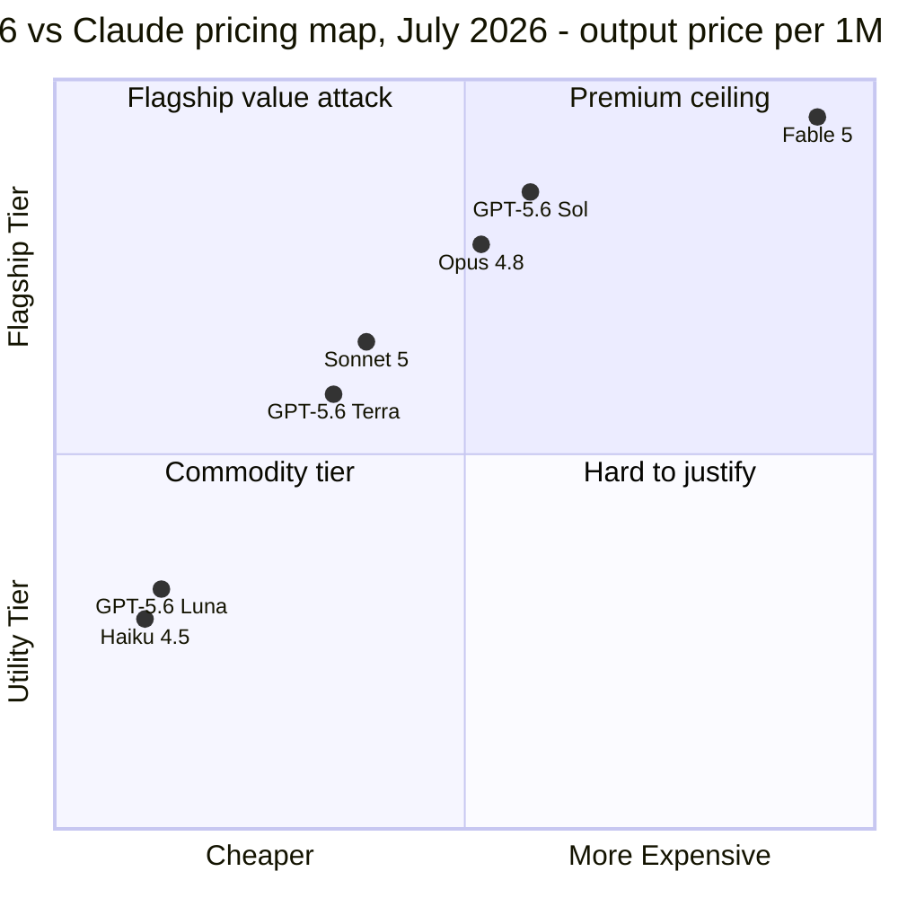

+++
date = '2026-07-10T16:00:00+08:00'
draft = false
title = 'GPT-5.6 Release: Pricing, ChatGPT Work, and the Codex Merger'
description = 'GPT-5.6 went GA on July 9, 2026: Sol/Terra/Luna pricing, the Codex-ChatGPT Work merger, what OpenAI benchmark claims hide, and whether to switch from Claude.'
toc = true
tags = ['GPT-5.6', 'OpenAI', 'AI Coding Models', 'Model Comparison']
keywords = ['gpt-5.6 release', 'gpt 5.6 sol', 'chatgpt work codex', 'gpt-5.6 vs claude', 'gpt-5.6 pricing', 'is gpt-5.6 available', 'gpt-5.6 api price']

[[params.faqItems]]
question = "Is GPT-5.6 available now?"
answer = "Yes. As of July 9, 2026, GPT-5.6 (Sol, Terra, Luna) is generally available in ChatGPT, ChatGPT Work, Codex, and the OpenAI API, rolling out globally within 24 hours. The June preview restriction to ~20 government-approved partners has been lifted."

[[params.faqItems]]
question = "How much does GPT-5.6 cost?"
answer = "Per million tokens: Sol is $5 input / $30 output, Terra is $2.50 / $15, and Luna is $1 / $6. All three ship with a 1M-token context window and 128K max output."

[[params.faqItems]]
question = "What is ChatGPT Work?"
answer = "ChatGPT Work is OpenAI's agent mode launched July 9, 2026, powered by GPT-5.6 and Codex. It reads local files, uses apps and a built-in browser, and can run on a task for hours. It shipped first on Pro, Enterprise, and Edu plans, with Plus and Business following within days."

[[params.faqItems]]
question = "Did Codex get replaced by ChatGPT Work?"
answer = "Merged, not replaced. The Codex desktop app folded into the ChatGPT app, which now houses Chat, Work, and Codex in one product. The Codex CLI continues as a separate tool, and Codex remains the engine behind ChatGPT Work's execution."

[[params.faqItems]]
question = "Is GPT-5.6 better than Claude for coding?"
answer = "Unproven. Sol's headline 80 on the Coding Agent Index was scored on OpenAI's own Codex harness, while Fable 5 beats Sol 80% to 64.6% on SWE-bench Pro. Until harness-neutral benchmarks land, treat the coding claims as marketing, and test Luna at $1/$6 if you're curious."
+++

Two weeks ago I wrote that GPT-5.6 "doesn't exist for you yet" and told readers to ignore it until they could create an API key. That day arrived faster than I expected: on July 9, 2026, OpenAI [made the GPT-5.6 release official](https://openai.com/index/gpt-5-6/) — Sol, Terra, and Luna, generally available across ChatGPT, the API, Codex, and a brand-new agent product called ChatGPT Work, rolling out globally within 24 hours. The ~20-company government preview that made the June 26 launch a non-event is over.

So this is the follow-up I owed you. My position after two days of digging: **the benchmark numbers are the least important part of this launch, and the product consolidation is the most important part.** OpenAI just merged Codex into ChatGPT and bet the company on "one app that does all your agent work." That bet — not a 2.8-point lead on a vendor-harnessed index — is what should change how you think about the next six months. Below: what actually shipped, why I'd discount every comparison chart in the announcement, what the Codex merger signals, and a concrete low-cost way to test GPT-5.6 without disrupting a Claude Code workflow.

## What Shipped in the GPT-5.6 Release on July 9

Let's get the verifiable facts down first, because half the coverage blurs preview-era claims with GA-day reality.

> As of July 9, 2026, GPT-5.6 is generally available in three tiers, priced per million tokens: **Sol at $5 input / $30 output**, **Terra at $2.50 / $15**, and **Luna at $1 / $6**. All three have a 1M-token context window, 128K max output, and a February 16, 2026 knowledge cutoff.

The rollout covers four surfaces at once: ChatGPT (every paid plan, with the model picker updating over 24 hours), the API, Codex, and [ChatGPT Work](https://openai.com/index/chatgpt-for-your-most-ambitious-work/) — an agent that reads your local files, drives your apps, browses with a built-in browser, and per OpenAI can "stay with a project for hours." Work launched on Pro, Enterprise, and Edu plans on day one, with Plus and Business promised "in the coming days," a staggering pattern [TechCrunch confirmed](https://techcrunch.com/2026/07/09/openai-launches-its-new-family-of-models-with-gpt-5-6/) in its launch coverage.

The June 26 restriction — roughly 20 government-approved partner organizations, API and Codex only, nothing in ChatGPT — is fully lifted. That restriction lasted 13 days, almost exactly matching the two-and-a-half-week suspension Claude Fable 5 served in June. Both frontier labs have now been through a government-gated launch in a single month, and both exited it quickly. I said in my [best AI coding models 2026 roundup](/posts/ai/2026-07-07-best-ai-coding-models-2026/) that regulatory availability risk is a new line item in model selection; the good news from July is that so far the outages resolve in weeks, not quarters.

## Read the GPT-5.6 Benchmarks Like a Skeptic

Now the numbers OpenAI wants you to remember: Sol scores **80 on the Artificial Analysis Coding Agent Index, 2.8 points above Claude Fable 5**, and **53.6 on Agents' Last Exam, 13.1 points above Fable 5**. On the Intelligence Index, Sol lands within one point of Fable 5 while finishing tasks in 61% less time at roughly half the estimated cost. Impressive — and every one of those framings deserves a discount, for reasons the announcement does not volunteer.

Here is the detail that matters: [Artificial Analysis ran the Coding Agent Index with Sol inside OpenAI's own Codex harness](https://artificialanalysis.ai/articles/gpt-5-6-has-landed). If that rings a bell, it should. Three weeks ago, Anthropic published an 80.3% SWE-bench Pro score for Fable 5 produced on its own agentic scaffolding, and independent evaluators contested how much survived on a neutral harness — I covered that controversy at length in the [models roundup](/posts/ai/2026-07-07-best-ai-coding-models-2026/). The exact same caveat now applies in the other direction, down to the eerily identical score of 80. A model evaluated inside the harness its own vendor tuned for it is showing you its ceiling, not your expected experience.

The counter-evidence is right there in public data. On SWE-bench Pro, **Fable 5 scores 80% against Sol's 64.6%** — a 15-point gap in Anthropic's favor on the deepest coding benchmark available. OpenAI's response was remarkable: rather than dispute the score, it [published an audit claiming roughly 30% of SWE-bench Pro tasks are broken](https://simonwillison.net/2026/Jul/9/gpt-5-6/). Maybe that audit is right — benchmark rot is real. But notice the pattern: each lab embraces the benchmark it wins and litigates the methodology of the one it loses. When the referees start playing for the teams, the scoreboard stops being evidence. Simon Willison's hands-on assessment matches my prior here: he found Sol "definitely very competent" but not exceeding Anthropic's models on the complex coding tasks he actually runs. That's the most honest sentence written about this launch so far.

| Claim | Number | Who produced it | Harness | My discount |
|---|---|---|---|---|
| Coding Agent Index | Sol 80, +2.8 vs Fable 5 | Artificial Analysis | OpenAI's Codex harness | Ceiling number; wait for neutral-harness runs |
| Agents' Last Exam | Sol 53.6, +13.1 vs Fable 5 | OpenAI announcement | OpenAI's | Vendor-published; no independent replication yet |
| Intelligence Index | Within 1 pt of Fable 5, 61% less time, ~half cost | Artificial Analysis | Standard | The efficiency claim I find most credible |
| SWE-bench Pro | Fable 5 80% vs Sol 64.6% | Public leaderboard | Contested both ways | The gap OpenAI is auditing rather than closing |

The one claim I *do* buy is efficiency. Token-per-task and wall-clock reductions are harder to game than pass rates, they replicate across Artificial Analysis's independent cost measurements (Sol's coding runs came out ~40% cheaper than Fable 5 at max reasoning), and they're consistent with the pricing OpenAI chose. If GPT-5.6 has a real edge, it's cost-per-outcome, not capability ceiling.

## The Real Headline: Codex Merged Into ChatGPT Work

Strip away the benchmark theater and the durable news is organizational: **the Codex desktop app no longer exists as a separate product.** As [The Decoder](https://the-decoder.com/openai-pairs-its-gpt-5-6-public-rollout-with-chatgpt-work-a-new-agent-that-handles-entire-workflows/) and [MacRumors](https://www.macrumors.com/2026/07/09/openai-chatgpt-work/) both report, Chat, Work, and Codex now live in a single ChatGPT app on every plan, with Codex serving as the execution engine behind Work's file-editing and hours-long task runs. The Codex CLI survives as a separate tool for terminal die-hards, but the center of gravity has visibly moved.

This is a philosophical fork in the road, and it's worth naming both branches. OpenAI is now betting that agent workflows belong in **one consumer super-app**: the same window where you chat also edits your spreadsheet, refactors your repo, and browses on your behalf. Anthropic is running the opposite play — Claude Code as a standalone CLI/SDK with composable primitives, where the terminal is the product and the app is secondary. I've been arguing since my [CLI + Skills vs MCP piece](/posts/ai/2026-07-10-cli-skills-vs-mcp/) that agent capability increasingly lives in the thin, scriptable layer rather than the integrated shell; OpenAI just placed a very large bet on the integrated shell. Both bets can pay off — they target different users. The super-app wins the analyst drafting decks and the PM wrangling spreadsheets. The CLI wins the engineer who wants agents inside CI, cron, and git worktrees.

What the merger tells you about OpenAI's read of the market: Codex as a standalone developer product wasn't growing into a business that justified its own app, but Codex as the *muscle* behind a mass-market agent is a much bigger story. That's a rational consolidation — and it carries a real cost for developers. When your coding agent is a tab inside a consumer app, its roadmap follows consumer priorities. If you picked Codex over Claude Code last winter (I compared them in [Claude Code vs Codex](/posts/ai/2026-02-19-claude-code-vs-codex/)), the tool you chose just changed owners internally, and the CLI's second-class status is worth watching over the next two quarters.

## GPT-5.6 Pricing vs Claude: A Deliberate Price War

The pricing is the most legible strategy document OpenAI has published this year. Look at where each tier lands relative to Anthropic's lineup:

Three deliberate collisions. **Sol at $5/$30 sits directly on Opus 4.8's $5/$25** — identical input price, slightly higher output — while claiming Fable-class capability. That positions Sol as "the flagship at the co-flagship's price," undercutting Fable 5's $10/$50 by half. **Terra at $2.50/$15 slides under Sonnet 5's standard $3/$15**, matching output exactly and shaving input — a price picked by someone staring at Anthropic's rate card. And **Luna at $1/$6 brackets Haiku 4.5's $1/$5**, conceding a dollar of output to ship a bigger context window.

The squeeze this puts on Anthropic is specific and time-boxed. Sonnet 5's introductory $2/$10 pricing expires August 31, and I've recommended it as the default coding model precisely because of that intro rate. On September 1, Sonnet reverts to $3/$15 — and suddenly Terra is the cheaper mid-tier on paper. My prediction, for the record: **Anthropic either extends the intro pricing past August 31 or answers with a cut within weeks of it lapsing.** Frontier-model pricing in 2026 behaves like cloud-storage pricing in 2014, and holding a price umbrella above a well-funded competitor is how you donate market share. If you're budgeting API spend for Q4, build in the assumption that mid-tier prices go down, not up.

## What Claude Code Users Should Actually Do

Here's the practical part, since half my readers run Claude Code daily and are wondering whether this release demands action. My answer: **don't migrate, but do run a cheap experiment this week.** Migration on GA-day benchmarks is exactly the mistake I warned about when Fable 5 launched — you'd be moving on vendor ceiling numbers before a single harness-neutral evaluation exists. But ignoring a price-competitive model family entirely is its own error, and OpenAI priced Luna specifically to make trying it painless.

The experiment I'd run: take $5 of API credit, point Luna ($1/$6) at your five most recent real tasks — not toy prompts, the actual migration scripts and failing tests from your week — and compare outputs against whatever you currently run. Five dollars buys you roughly 500K tokens of Luna output, which is more than enough for a genuine read on tool-use discipline and instruction-following. If Luna impresses, escalate the same tasks to Terra before touching Sol; the tier gaps (75 vs 77 vs 80 on the Coding Agent Index) are small enough that the cheap tier tells you most of what the expensive one would.

Then hold your migration decision until you see three signals, none of which exist as of July 10, 2026. First, **harness-neutral benchmarks**: Sol scored on the same scaffolding as Claude models — Terminal-Bench or SWE-bench runs where neither vendor controls the harness. Second, **two weeks of production anecdata** from people who moved real workloads, because GA-day models have a documented history of quiet regressions and rate-limit turbulence in week one. Third, **post-honeymoon pricing**: OpenAI has not said whether current rates are permanent, and Anthropic's response move lands within two months. If all three break in GPT-5.6's favor, migrating in September costs you nothing you'd have gained in July. If they don't, you saved a workflow rebuild. And if you're weighing this against just staying on Anthropic's free-to-cheap tiers meanwhile, I've mapped what those actually get you in [Claude's free tier limits](/posts/ai/2026-07-08-claude-free-tier-limits/).

## The Bottom Line

The GPT-5.6 release is real, global, and priced to fight — that much survives scrutiny. The capability claims mostly don't, yet: the flagship coding number rode OpenAI's own harness, the deepest public benchmark still favors Fable 5 by 15 points, and the launch's most credible edge is cost-per-task, not raw ceiling. The story I'd actually remember from July 9 is the merger: OpenAI folded its developer agent into a consumer super-app while Anthropic keeps shipping composable developer primitives, and that divergence will shape your tooling options far longer than this quarter's leaderboard. Run the $5 Luna experiment, watch for neutral-harness numbers, and keep your default where it is until the evidence — not the announcement — moves.

## Related Reading

- [Best AI Coding Models 2026: Fable 5 vs Sonnet 5 vs GPT-5.6](/posts/ai/2026-07-07-best-ai-coding-models-2026/) — the pre-GA landscape this post updates
- [MCP vs Skills: Why CLI + Skill Wins the Agent Toolchain](/posts/ai/2026-07-10-cli-skills-vs-mcp/) — the composable-primitives thesis behind my read of the merger
- [Claude Code vs Codex: 8-Dimension Head-to-Head](/posts/ai/2026-02-19-claude-code-vs-codex/) — how the two agent CLIs compared before Codex changed shape
- [Claude Free Tier Limits in 2026: What You Actually Get](/posts/ai/2026-07-08-claude-free-tier-limits/)
