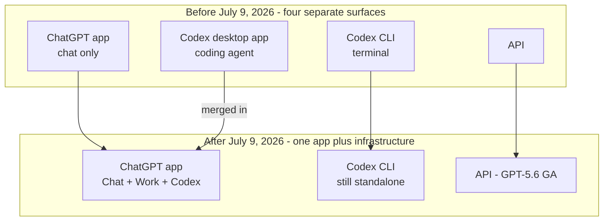
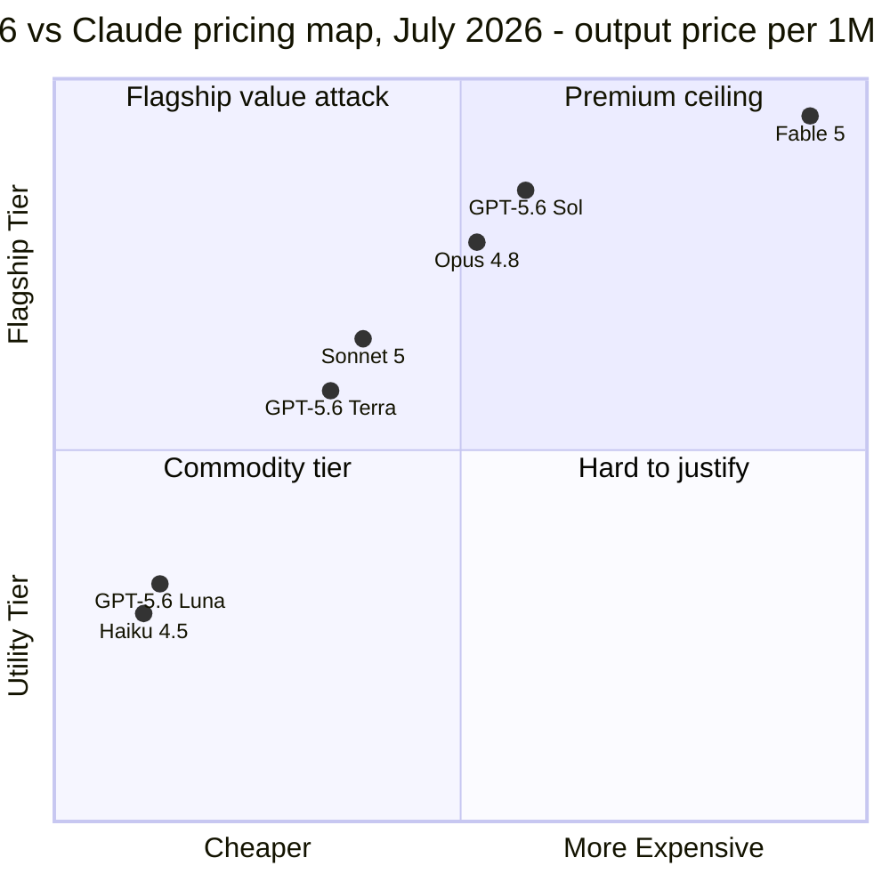

+++
date = '2026-07-10T16:00:00+08:00'
draft = false
title = 'GPT-5.6 Release: Pricing, ChatGPT Work, and the Codex Merger'
description = 'GPT-5.6 went GA on July 9, 2026: Sol/Terra/Luna pricing, the Codex-ChatGPT Work merger, what OpenAI benchmark claims hide, and whether to switch from Claude.'
toc = true
tags = ['GPT-5.6', 'OpenAI', 'AI Coding Models', 'Model Comparison']
keywords = ['gpt-5.6 release', 'gpt 5.6 sol', 'chatgpt work codex', 'gpt-5.6 vs claude', 'gpt-5.6 pricing', 'is gpt-5.6 available', 'gpt-5.6 api price']

[[params.faqItems]]
question = "Is GPT-5.6 available now?"
answer = "Yes. As of July 9, 2026, GPT-5.6 (Sol, Terra, Luna) is generally available in ChatGPT, ChatGPT Work, Codex, and the OpenAI API, rolling out globally within 24 hours. The June preview restriction to ~20 government-approved partners has been lifted."

[[params.faqItems]]
question = "How much does GPT-5.6 cost?"
answer = "Per million tokens: Sol is $5 input / $30 output, Terra is $2.50 / $15, and Luna is $1 / $6. All three ship with a 1M-token context window and 128K max output."

[[params.faqItems]]
question = "What is ChatGPT Work?"
answer = "ChatGPT Work is OpenAI's agent mode launched July 9, 2026, powered by GPT-5.6 and Codex. It reads local files, uses apps and a built-in browser, and can run on a task for hours. It shipped first on Pro, Enterprise, and Edu plans, with Plus and Business following within days."

[[params.faqItems]]
question = "Did Codex get replaced by ChatGPT Work?"
answer = "Merged, not replaced. The Codex desktop app folded into the ChatGPT app, which now houses Chat, Work, and Codex in one product. The Codex CLI continues as a separate tool, and Codex remains the engine behind ChatGPT Work's execution."

[[params.faqItems]]
question = "Is GPT-5.6 better than Claude for coding?"
answer = "Unproven. Sol's headline 80 on the Coding Agent Index was scored on OpenAI's own Codex harness, while Fable 5 beats Sol 80% to 64.6% on SWE-bench Pro. Until harness-neutral benchmarks land, treat the coding claims as marketing, and test Luna at $1/$6 if you're curious."
+++

The official announcement wants you to walk away with one number — Sol scoring 80 on the Coding Agent Index, 2.8 points clear of Claude Fable 5 — and that number is the most overrated line in the entire GPT-5.6 release. The most underrated line sits well below the fold, phrased like a housekeeping note: the Codex desktop app is gone, folded into ChatGPT. The first claim was produced on OpenAI's own harness and will be litigated for weeks. The second quietly redrew how the world's most-watched AI company thinks agents should be packaged and sold — and it'll still be shaping your tooling choices in January.

Quick catch-up for anyone who tuned out in June. On July 9, 2026, OpenAI [took GPT-5.6 to general availability](https://openai.com/index/gpt-5-6/): three tiers named Sol, Terra, and Luna, live across ChatGPT, the API, Codex, and a brand-new agent product called ChatGPT Work, rolling out worldwide within 24 hours. The June 26 "launch" that reached roughly 20 government-approved partner organizations is over; this one reaches everyone. Two weeks ago, in my [best AI coding models roundup](/posts/ai/2026-07-07-best-ai-coding-models-2026/), I wrote that GPT-5.6 "doesn't exist for you yet" and told readers to leave it off their shortlists until they could create an API key for it. That day came faster than I expected, so consider this the follow-up I owed you.

My call, stated up front: nobody should migrate this week, most API buyers should spend $5 on one specific experiment, and if you're a Claude Code user whose workflow is earning its keep, the only section here that genuinely concerns you is the pricing one — the durable effect of this launch on your life runs through Anthropic's rate card, not OpenAI's model picker. The rest of this post backs those three sentences up.

## What Shipped in the GPT-5.6 Release on July 9

Facts first, because a surprising share of the coverage still blends June's preview-era claims into GA-day reality.

> As of July 9, 2026, GPT-5.6 is generally available in three tiers, priced per million tokens: **Sol at $5 input / $30 output**, **Terra at $2.50 / $15**, and **Luna at $1 / $6**. All three have a 1M-token context window, 128K max output, and a February 16, 2026 knowledge cutoff.

The rollout hits four surfaces at once: ChatGPT (every paid plan, with the model picker updating over 24 hours), the API, Codex, and [ChatGPT Work](https://openai.com/index/chatgpt-for-your-most-ambitious-work/) — an agent that reads your local files, drives your apps, browses with a built-in browser, and, in OpenAI's words, can "stay with a project for hours." Work shipped day one on Pro, Enterprise, and Edu plans, with Plus and Business promised "in the coming days" — [TechCrunch confirmed](https://techcrunch.com/2026/07/09/openai-launches-its-new-family-of-models-with-gpt-5-6/) the staggered rollout in its launch coverage.

One piece of context deserves a line before we move on. The June 26 restriction — roughly 20 government-approved organizations, API and Codex only, nothing in ChatGPT — lasted exactly 13 days, almost the same span as the two-and-a-half-week export-control suspension Claude Fable 5 served in June. Both frontier labs went through a government-gated launch inside a single month, and both came out the other side fast. I flagged regulatory availability risk as a new line item in model selection back in the [roundup](/posts/ai/2026-07-07-best-ai-coding-models-2026/); July's tentative good news is that these outages resolve in weeks, not quarters.

## Read the GPT-5.6 Benchmarks Like a Skeptic

Now the numbers OpenAI leads with: Sol posts **80 on the Artificial Analysis Coding Agent Index, 2.8 points above Claude Fable 5**, and **53.6 on Agents' Last Exam, 13.1 points above Fable 5**. On the Intelligence Index, Sol lands within a point of Fable 5 while finishing tasks in 61% less time at roughly half the estimated cost. Every one of those framings deserves a haircut, for reasons the announcement doesn't volunteer.

Start with the harness, because it's the whole ballgame. [Artificial Analysis scored Sol inside OpenAI's own Codex harness](https://artificialanalysis.ai/articles/gpt-5-6-has-landed). We watched this exact movie three weeks ago, from the other side: Anthropic published an 80.3% SWE-bench Pro score for Fable 5 on its own agentic scaffolding, and independent evaluators immediately asked how much of it would survive a neutral setup — I walked through that fight in the [models roundup](/posts/ai/2026-07-07-best-ai-coding-models-2026/). Same script, opposite direction, right down to the eerily matching score of 80. A model measured inside the harness its own vendor tuned for it is showing you its ceiling, not your Tuesday afternoon.

The counter-evidence is sitting in public data. On SWE-bench Pro, **Fable 5 leads Sol 80% to 64.6%** — a fifteen-point gap on the deepest coding benchmark anyone can inspect. And OpenAI's response is more revealing than the score itself: rather than contest the number, it [published an audit arguing that roughly 30% of SWE-bench Pro's tasks are broken](https://simonwillison.net/2026/Jul/9/gpt-5-6/). Maybe the audit is right — benchmark rot is a real problem. But clock the pattern: each lab embraces the leaderboard it tops and audits the methodology of the one it doesn't. Once both sides grade their own homework, the grades stop settling arguments. Simon Willison's hands-on read matches mine: he found Sol "definitely very competent" but not better than Anthropic's models on the complex coding tasks he actually runs. That's still the most honest sentence anyone has written about this launch.

| Claim | Number | Who produced it | Harness | My discount |
|---|---|---|---|---|
| Coding Agent Index | Sol 80, +2.8 vs Fable 5 | Artificial Analysis | OpenAI's Codex harness | Ceiling number; wait for neutral-harness runs |
| Agents' Last Exam | Sol 53.6, +13.1 vs Fable 5 | OpenAI announcement | OpenAI's | Vendor-published; no independent replication yet |
| Intelligence Index | Within 1 pt of Fable 5, 61% less time, ~half cost | Artificial Analysis | Standard | The efficiency claim I find most credible |
| SWE-bench Pro | Fable 5 80% vs Sol 64.6% | Public leaderboard | Contested both ways | The gap OpenAI is auditing rather than closing |

The one claim I do buy is efficiency. Token-per-task and wall-clock reductions are much harder to juice than pass rates, they replicate in Artificial Analysis's independent cost measurements — Sol's coding runs came out roughly 40% cheaper than Fable 5 at max reasoning — and they're consistent with the prices OpenAI chose. If GPT-5.6 has a genuine edge, it's cost per outcome, not a higher capability ceiling.

## The Real Headline: Codex Merged Into ChatGPT Work

Set the scoreboard aside and here's what will still be true in six months: **the Codex desktop app no longer exists as a separate product.** As [The Decoder](https://the-decoder.com/openai-pairs-its-gpt-5-6-public-rollout-with-chatgpt-work-a-new-agent-that-handles-entire-workflows/) and [MacRumors](https://www.macrumors.com/2026/07/09/openai-chatgpt-work/) both report, Chat, Work, and Codex now live inside a single ChatGPT app on every plan, with Codex serving as the execution engine behind Work's file edits and hours-long task runs. The Codex CLI survives as a standalone tool for terminal die-hards, but you can see exactly where the center of gravity went.

Name the fork honestly, because it's a real one. OpenAI is now betting that agent workflows belong in **one consumer super-app**: the same window you chat in also fixes your spreadsheet, refactors your repo, and browses on your behalf. Anthropic is running the opposite play — Claude Code as a standalone CLI/SDK built from composable primitives, where the terminal is the product and the app is a sideshow. I've argued since my [CLI + Skills vs MCP piece](/posts/ai/2026-07-10-cli-skills-vs-mcp/) that agent capability keeps accruing to the thin, scriptable layer rather than the integrated shell; OpenAI just placed an enormous bet on the shell. Both bets can pay off, because they're aimed at different people. The super-app wins the analyst drafting decks and the PM buried in spreadsheets. The CLI wins the engineer wiring agents into CI, cron, and git worktrees.

Here's what the merger tells you about OpenAI's internal math: Codex as a standalone developer product wasn't growing into a business that justified its own app, but Codex as the muscle inside a mass-market agent is a much bigger story. That's a rational consolidation — and the bill lands on developers. When your coding agent becomes a tab inside a consumer app, its roadmap inherits consumer priorities. If you picked Codex over Claude Code last winter — I compared them in [Claude Code vs Codex](/posts/ai/2026-02-19-claude-code-vs-codex/) — the tool you chose just changed owners internally, and how second-class the CLI gets over the next two quarters is worth watching.

## GPT-5.6 Pricing vs Claude: A Deliberate Price War

The rate card is the most legible strategy memo OpenAI has published this year. Plot each tier against Anthropic's lineup and the intent is hard to miss:

Three aimed shots. **Sol at $5/$30 parks directly on top of Opus 4.8's $5/$25** — identical input price, output a touch higher — while claiming Fable-class capability. That's "the flagship at the co-flagship's price," and it undercuts Fable 5's $10/$50 by half. **Terra at $2.50/$15 tucks in just under Sonnet 5's standard $3/$15**, matching output to the cent and shaving the input price — a number chosen by someone with Anthropic's pricing page open in the next tab. **Luna at $1/$6 brackets Haiku 4.5's $1/$5**, conceding a dollar of output to offer the bigger context window.

The squeeze on Anthropic comes with a date attached. Sonnet 5's introductory $2/$10 pricing expires August 31 — that intro rate is a big part of why I've recommended Sonnet as the default coding model. On September 1 it reverts to $3/$15, and Terra suddenly becomes the cheaper mid-tier on paper. So let me put a prediction in writing: **Anthropic either extends the intro pricing past August 31 or answers with a cut within weeks of it lapsing.** Frontier-model pricing in 2026 behaves like cloud-storage pricing in 2014, and holding a price umbrella over a well-funded competitor is how you donate market share. If you're budgeting API spend for Q4, build in the assumption that mid-tier prices go down, not up.

## Should You Switch to GPT-5.6? Sorting Out Who This Is For

"Should I switch" has three different answers depending on your seat, so here's the judgment this launch actually calls for, sorted by who you are.

**If Claude Code is your daily driver and it's working: don't migrate, and feel free to ignore nearly everything else about this release.** Migrating on GA-day numbers is exactly the mistake I warned about when Fable 5 launched — you'd be moving on vendor ceiling scores before a single harness-neutral evaluation exists. Nothing that shipped on July 9 changes what your terminal does today. The one thing worth keeping an eye on is the September pricing chess match above, because that's where this launch eventually touches your bill.

**If you buy API tokens in any volume: don't switch, but don't ignore it either — run the cheap experiment this week.** Take $5 of credit, point Luna ($1/$6) at your five most recent real tasks — the actual failing tests and migration scripts from your week, not toy prompts — and compare outputs against your current default. Five dollars buys roughly 500K tokens of Luna output, which is plenty for a genuine read on tool-use discipline and instruction-following. If Luna impresses, escalate the same tasks to Terra before touching Sol; at 75, 77, and 80 on the Coding Agent Index, the tier gaps are small enough that the cheap tier tells you most of what the expensive one would.

**And whoever you are, gate any real migration on three signals — none of which exists as of July 10, 2026.** First, harness-neutral benchmarks: Terminal-Bench or SWE-bench runs where neither vendor controls the scaffolding. Second, two weeks of production anecdata from people who moved real workloads, because GA-week models have a documented history of quiet regressions and rate-limit turbulence. Third, post-honeymoon pricing: OpenAI hasn't said current rates are permanent, and Anthropic's counter-move lands within two months. If all three break GPT-5.6's way, migrating in September costs you nothing July would have gained; if they don't, you just saved yourself a workflow rebuild. And if the real question is whether to ride Anthropic's free-to-cheap tiers in the meantime, I mapped exactly what those get you in [Claude's free tier limits](/posts/ai/2026-07-08-claude-free-tier-limits/).

## The Bottom Line

The GPT-5.6 release is real, global, and priced for a fight — that part survives scrutiny. The capability story mostly doesn't, yet: the flagship coding score rode OpenAI's own harness, the deepest public benchmark still favors Fable 5 by fifteen points, and the launch's most credible edge is cost per task, not a raised ceiling. What I'd actually remember from July 9 is the merger: OpenAI folded its developer agent into a consumer super-app while Anthropic keeps selling composable developer primitives, and that fork will shape your tooling options long after this quarter's leaderboard is forgotten. Spend the $5 on Luna, watch for neutral-harness numbers, and don't move your default until the evidence — not the announcement — moves first.

## Related Reading

- [Best AI Coding Models 2026: Fable 5 vs Sonnet 5 vs GPT-5.6](/posts/ai/2026-07-07-best-ai-coding-models-2026/) — the pre-GA landscape this post updates
- [MCP vs Skills: Why CLI + Skill Wins the Agent Toolchain](/posts/ai/2026-07-10-cli-skills-vs-mcp/) — the composable-primitives thesis behind my read of the merger
- [Claude Code vs Codex: 8-Dimension Head-to-Head](/posts/ai/2026-02-19-claude-code-vs-codex/) — how the two agent CLIs compared before Codex changed shape
- [Claude Free Tier Limits in 2026: What You Actually Get](/posts/ai/2026-07-08-claude-free-tier-limits/)
