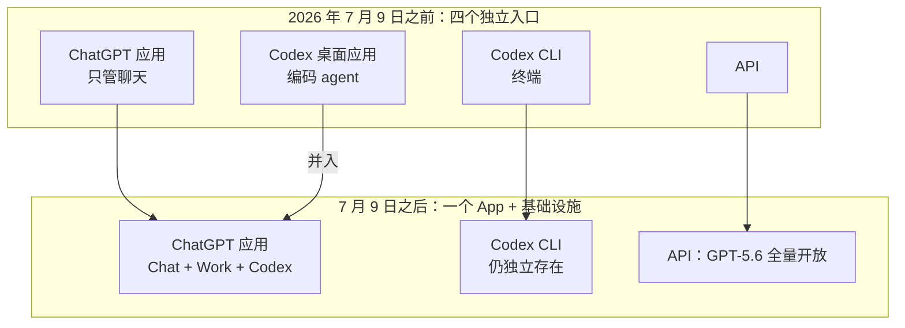
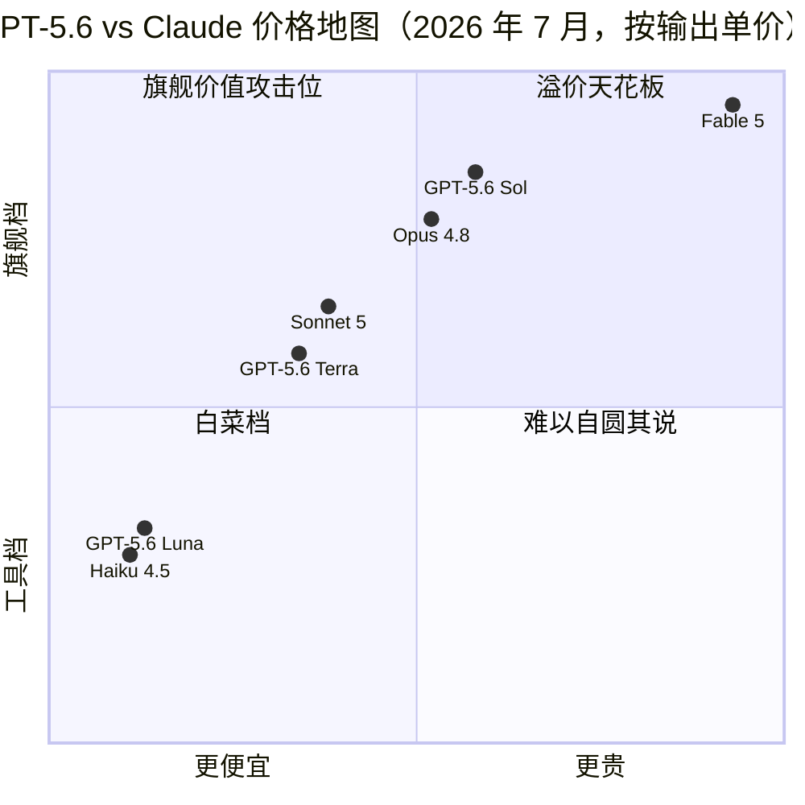

+++
date = '2026-07-10T16:00:00+08:00'
draft = false
title = 'GPT-5.6 正式发布：三档价格、Codex 并入 ChatGPT Work 全解读'
description = 'GPT-5.6 于 2026 年 7 月 9 日全量开放：Sol/Terra/Luna 三档定价对着 Claude 打、Codex 并入 ChatGPT Work 意味着什么、厂商跑分该打几折、国内怎么用 Luna 低成本试水，以及 Claude Code 用户的三个迁移信号。'
toc = true
tags = ['GPT-5.6', 'OpenAI', 'AI Coding Models', 'Model Comparison']
keywords = ['gpt-5.6 发布', 'gpt5.6 价格', 'chatgpt work 是什么', 'codex 合并', 'gpt-5.6 国内使用', 'gpt-5.6 对比 claude', 'gpt-5.6 api 多少钱']

[[params.faqItems]]
question = "GPT-5.6 现在能用了吗？"
answer = "能。2026 年 7 月 9 日起，GPT-5.6（Sol/Terra/Luna）在 ChatGPT、ChatGPT Work、Codex 和 API 全量开放，24 小时内全球铺开。6 月 26 日预览期'仅 20 家政府批准企业'的限制已解除。国内用户仍需通过常规出海手段访问。"

[[params.faqItems]]
question = "GPT-5.6 价格是多少？"
answer = "每百万 token：Sol 输入 $5 / 输出 $30，Terra $2.50 / $15，Luna $1 / $6。三档都是 1M 上下文窗口、128K 最大输出，知识截止 2026 年 2 月 16 日。"

[[params.faqItems]]
question = "ChatGPT Work 是什么？"
answer = "OpenAI 在 2026 年 7 月 9 日随 GPT-5.6 一起发布的 agent 模式，由 GPT-5.6 和 Codex 驱动：能读本地文件、操作应用、用内置浏览器上网，单个任务可以连续跑几个小时。首发 Pro/Enterprise/Edu 档，Plus 和 Business 几天内跟进。"

[[params.faqItems]]
question = "Codex 被 ChatGPT Work 取代了吗？"
answer = "是并入不是取代。Codex 桌面应用合并进了 ChatGPT 应用，Chat、Work、Codex 现在是同一个 App 里的三个入口；Codex CLI 继续作为独立工具存在，Codex 也仍是 ChatGPT Work 背后的执行引擎。"

[[params.faqItems]]
question = "GPT-5.6 写代码比 Claude 强吗？"
answer = "未经独立验证。Sol 的 Coding Agent Index 80 分是在 OpenAI 自家 Codex harness 上跑出来的；而公开的 SWE-bench Pro 上 Fable 5 以 80% 对 64.6% 领先 15 分。想自己验证，用 Luna（$1/$6）花 5 美元跑一遍你的真实任务最划算。"
+++

两周前我在[模型选型那篇](/posts/ai/2026-07-07-best-ai-coding-models-2026/)里写过一句话："在你能给 GPT-5.6 创建 API key 的那天之前，把它从选型里划掉。"这一天来得比我预期快：2026 年 7 月 9 日，OpenAI [宣布 GPT-5.6 正式全量发布](https://openai.com/index/gpt-5-6/)——Sol、Terra、Luna 三档模型同时登陆 ChatGPT、API、Codex，外加一个全新的 agent 产品 ChatGPT Work，24 小时内全球铺开。6 月 26 日那场"只有约 20 家政府批准企业能用"的预览式发布，正式翻篇。

所以这篇是我欠读者的续集。挖了两天资料之后，我的判断是：**这次发布里跑分是最不重要的部分，产品线合并才是最重要的部分。** OpenAI 把 Codex 整个并进了 ChatGPT，押注"一个 App 装下所有 agent 工作流"——这个赌注，而不是那个在自家 harness 上跑出来的 2.8 分领先，才是真正会影响你未来半年工具选择的东西。下面按顺序讲：到底发布了什么、厂商跑分该打几折、Codex 合并释放了什么信号、国内用户怎么低成本试水，以及 Claude Code 用户什么信号出现之前不要动。

## 7 月 9 日的 GPT-5.6 发布到底包含什么

先把可核实的事实钉死，因为很多中文报道把 6 月预览期的说法和 GA 当天的现实混在一起了。

> 2026 年 7 月 9 日起，GPT-5.6 三档全量开放，每百万 token 定价：**Sol 输入 $5 / 输出 $30**，**Terra $2.50 / $15**，**Luna $1 / $6**。三档统一 1M 上下文、128K 最大输出，知识截止 2026 年 2 月 16 日。

这次铺开同时覆盖四个入口：ChatGPT（所有付费档，模型选择器 24 小时内陆续更新）、API、Codex，以及 [ChatGPT Work](https://openai.com/index/chatgpt-for-your-most-ambitious-work/)——一个能读本地文件、操作你电脑上的应用、用内置浏览器上网、按 OpenAI 的说法"可以在一个项目上连续工作几个小时"的 agent。Work 首发只给 Pro、Enterprise、Edu 三档，Plus 和 Business "几天内"跟进，[TechCrunch 的发布报道](https://techcrunch.com/2026/07/09/openai-launches-its-new-family-of-models-with-gpt-5-6/)确认了这个分批节奏。

值得记一笔的是时间线：6 月 26 日应美国政府要求限制在约 20 家获批企业，7 月 9 日全量——限制只持续了 13 天，和 Claude Fable 5 六月那场两周半的出口管制停用几乎同一个量级。一个月内，两家前沿实验室先后经历了"政府门槛式发布"，也都快速走了出来。我之前说监管可用性风险是 2026 年模型选型的新条目，7 月给出的好消息是：这类停摆目前以周计，不以季度计。

## 厂商跑分打几折：两个 80 分的镜像故事

再看 OpenAI 希望你记住的数字：Sol 在 **Coding Agent Index 拿 80 分，比 Claude Fable 5 高 2.8**；在 **Agents' Last Exam 拿 53.6，比 Fable 5 高 13.1**；Intelligence Index 上与 Fable 5 差距不到 1 分，但耗时少 61%、估算成本约一半。数字很漂亮——而每一条都需要打折，原因发布页不会主动告诉你。

关键细节在这里：[Artificial Analysis 那个 80 分，是 Sol 装在 OpenAI 自家 Codex harness 里跑出来的](https://artificialanalysis.ai/articles/gpt-5-6-has-landed)。如果你觉得这个剧情眼熟，没错——三周前 Anthropic 给 Fable 5 发布 SWE-bench Pro 80.3% 时用的也是自家 agentic 脚手架，独立评测方当场质疑中立框架下能剩多少，我在[模型选型那篇](/posts/ai/2026-07-07-best-ai-coding-models-2026/)里详细拆过。现在完全相同的剧本反向重演了一遍，连分数都诡异地同为 80。一条我反复强调的原则：**模型装在厂商为它调校的 harness 里跑出来的分，是天花板数字，不是你的日常体验。**

反方证据就摆在公开数据里。SWE-bench Pro 上 **Fable 5 以 80% 对 Sol 的 64.6% 领先 15 分**——这是目前公开可查的最深编码 benchmark。OpenAI 的应对方式很有戏剧性：不去争这个分数，而是[发了一份审计报告，声称 SWE-bench Pro 约 30% 的任务本身是坏的](https://simonwillison.net/2026/Jul/9/gpt-5-6/)。这份审计也许有道理——benchmark 年久失修是真实问题。但注意这个模式：每家实验室都拥抱自己赢的榜、质疑自己输的榜的方法论。当裁判开始下场踢球，记分牌就不再是证据。Simon Willison 上手实测的结论和我的预期一致：Sol"确实非常能干"，但在他日常跑的复杂编码任务上并没有超过 Anthropic 的模型——这是这场发布迄今最诚实的一句话。

| 数字 | 内容 | 谁跑的 | 用谁的 harness | 我的折扣 |
|---|---|---|---|---|
| Coding Agent Index | Sol 80，领先 Fable 5 2.8 | Artificial Analysis | OpenAI 的 Codex harness | 天花板数字，等中立 harness 复测 |
| Agents' Last Exam | Sol 53.6，领先 13.1 | OpenAI 发布页 | OpenAI 自己 | 厂商自报，暂无独立复现 |
| Intelligence Index | 与 Fable 5 差 1 分内，耗时 -61%、成本约一半 | Artificial Analysis | 标准流程 | 全场我最信的一条 |
| SWE-bench Pro | Fable 5 80% vs Sol 64.6% | 公开榜单 | 双方各执一词 | OpenAI 选择审计它而不是追上它 |

我唯一买账的是效率那条。单任务 token 和耗时的下降比通过率难造假，Artificial Analysis 的独立成本测量也交叉印证了（Sol 的编码任务成本比 Fable 5 max 档便宜约 40%），而且和 OpenAI 选择的定价逻辑自洽。如果 GPT-5.6 有真实优势，它在"单位产出成本"，不在能力天花板。

## 真正的大事：Codex 并入 ChatGPT Work

把跑分的戏剧性剥掉，这次发布留得下来的新闻是组织层面的：**Codex 桌面应用作为独立产品不存在了。** 按 [The Decoder](https://the-decoder.com/openai-pairs-its-gpt-5-6-public-rollout-with-chatgpt-work-a-new-agent-that-handles-entire-workflows/) 和 [MacRumors](https://www.macrumors.com/2026/07/09/openai-chatgpt-work/) 的报道，Chat、Work、Codex 现在是同一个 ChatGPT 应用里的三个入口，所有档位（含免费档）统一入口，Codex 降级为 ChatGPT Work 背后的执行引擎。Codex CLI 保留为独立工具，但重心的迁移肉眼可见。

这是一次哲学分叉，两条路都值得说清楚。OpenAI 现在押注 agent 工作流属于**一个消费级超级 App**：你聊天的那个窗口，同时改你的表格、重构你的仓库、替你上网办事。Anthropic 走的是完全相反的路——Claude Code 是独立的 CLI/SDK，可组合的原语才是产品，App 只是配角。我在 [CLI + Skills vs MCP 那篇](/posts/ai/2026-07-10-cli-skills-vs-mcp/)里论证过：agent 能力越来越多地长在"薄而可脚本化"的分层里，而不是一体化的壳里；OpenAI 刚刚在一体化的壳上下了重注。两个赌注面向的是不同人群：超级 App 赢的是做 PPT 的分析师和管表格的 PM，CLI 赢的是想把 agent 塞进 CI、cron 和 git worktree 的工程师。

这次合并暴露了 OpenAI 对市场的判断：Codex 作为独立开发者产品，撑不起一个自己的 App；但 Codex 作为大众 agent 产品背后的肌肉，是大得多的生意。商业上这很理性——代价由开发者承担。当你的编码 agent 变成一个消费级 App 里的标签页，它的路线图就跟着消费级优先级走。如果你去年冬天在 [Claude Code vs Codex](/posts/ai/2026-02-19-claude-code-vs-codex/) 的对比后选了 Codex，你选的那个工具刚刚在内部换了东家，Codex CLI 接下来两个季度的"二等公民"待遇值得盯着看。

## 价格战：三档价格全是对着 Claude 定的

这份价目表是 OpenAI 今年发布过的最直白的战略文件。看每一档落在 Anthropic 产品线的什么位置：

三次瞄准射击。**Sol $5/$30 直接坐在 Opus 4.8 的 $5/$25 上**——输入价一分不差，输出略高——同时宣称 Fable 级能力，等于"用副旗舰的价格卖旗舰"，把 Fable 5 的 $10/$50 拦腰砍半。**Terra $2.50/$15 卡进 Sonnet 5 标准价 $3/$15 的下沿**，输出完全对齐、输入削掉五毛，这个数字是盯着 Anthropic 价目表定出来的。**Luna $1/$6 贴着 Haiku 4.5 的 $1/$5**，输出多收一美元，换一个更大的上下文窗口。

这给 Anthropic 的挤压是具体且有截止日期的。Sonnet 5 的 introductory 价 $2/$10 到 8 月 31 日为止——我此前推荐它做默认编码模型，很大程度上就是因为这个早鸟价。9 月 1 日恢复 $3/$15 之后，Terra 在纸面上就是更便宜的中端。我把预测立在这里：**Anthropic 要么延长早鸟价，要么在它到期后的几周内跟进降价。** 2026 年的前沿模型定价越来越像 2014 年的云存储定价，在一个弹药充足的对手头顶撑价格伞，等于把市场份额白送。如果你在给 Q4 的 API 预算建模，把"中端价格向下走"当默认假设。

## 国内用户：能用吗，怎么低成本试水

先说结论：**API 走中转今天就能试，ChatGPT Work 短期内对国内用户基本是"看得见摸不着"。** 拆开讲三件事。

第一，API 可用性。OpenAI 依旧不对中国大陆提供官方服务，这点 GA 没有任何改变。想试 GPT-5.6 的国内开发者，现实路径还是那几条：自己有海外支付和网络环境直连官方 API，或者走 API 中转/聚合平台。中转平台通常在 GA 后 24-48 小时内挂出新模型，价格一般在官方价上浮 10%-30%。我的建议是把试水预算控制在 Luna 上——$1/$6 的官方价意味着即使中转加价三成，花三五十块人民币也够把你一周的真实任务全跑一遍，这是 OpenAI 三档定价里对国内用户唯一友好的一档。选中转时只看两点：是否按官方模型名透传（防止背后偷换成便宜模型）、是否支持按量付费不锁月费。

第二，封号风险。这轮 GA 没有放松风控，反而因为 ChatGPT Work 能操作本地文件和浏览器，账号与设备环境的绑定更深了。历史规律依然成立：虚拟卡开 Pro 档、IP 频繁跳区、多人共享账号，是三个最常见的触发条件。如果你只是想评估模型能力，我的建议很明确：**别为了 GPT-5.6 去冒充值几百美元订阅费的封号风险，API 中转按量试完再说。** 模型能力用 API 就能完整评估，ChatGPT Work 的产品体验不值得押上账号。

第三，ChatGPT Work 的国内体验。它首发只在 Pro（$200/月）、Enterprise、Edu 三档，Plus 要再等几天；而且它的核心卖点——读本地文件、操作本地应用、内置浏览器连续工作几小时——每一项都要求稳定的网络长连接。挂着代理跑一个持续数小时的 agent 任务，断线重连的体验可以想象。加上数据层面的现实问题（你让它读的本地文件会上传到 OpenAI 的执行环境），我给国内读者的判断是：ChatGPT Work 这个产品形态值得关注，但作为日常生产力工具，国内可用性在未来一两个季度内都不会及格。想要"能连续干几小时活的 agent"，本地跑的 Claude Code 或开源替代品仍是国内环境下更现实的选择——顺带一提，Anthropic 各档订阅和免费额度国内怎么用，我在 [Claude 免费额度实测](/posts/ai/2026-07-08-claude-free-tier-limits/)里写过。

## Claude Code 用户：三个信号出现之前不要动

最后回答最多人问的问题：要不要迁移。我的答案是**不迁移，但这周花 5 美元做一次实验**。GA 当天按厂商天花板数字迁移，正是 Fable 5 发布时我警告过的错误；但对一个价格上贴身肉搏的模型家族视而不见，是另一种错误——而 OpenAI 给 Luna 定 $1/$6，就是为了让"试一下"没有心理负担。

实验做法：拿 5 美元额度（中转的话大约 50 块人民币），把你最近五个**真实任务**——不是玩具 prompt，是这周真挂过的测试、真写过的迁移脚本——喂给 Luna，和你现在的默认模型对比输出。5 美元约等于 50 万 token 的 Luna 输出，足够看清它的工具调用纪律和指令跟随质量。如果 Luna 表现惊艳，再把同样的任务升级到 Terra；三档在 Coding Agent Index 上是 75、77、80，档间差距小到便宜档就能告诉你贵档的大部分答案。

真正的迁移决定，压到三个信号出现之后——截至 2026 年 7 月 10 日，三个都还不存在。一，**中立 harness 的 benchmark**：Sol 和 Claude 系在同一套第三方脚手架上跑 Terminal-Bench 或 SWE-bench，谁的 harness 都不算数。二，**两周真实生产反馈**：GA 首周的模型有安静降级和限流抽风的前科，等别人先踩。三，**蜜月期后的价格**：OpenAI 没承诺现价永久，Anthropic 的应对两个月内必然落地。三个信号都倒向 GPT-5.6，九月再迁移，你不会损失七月的任何东西；有一个不倒向，你省下的就是一次工作流重建。

## 一句话总结

GPT-5.6 的发布是真的、全球的、定价带着杀气的——这些经得起推敲。能力宣称大多还不算数：编码旗舰分是自家 harness 跑的，最深的公开 benchmark 还落后 Fable 5 十五分，全场最可信的优势是单位任务成本而不是能力上限。7 月 9 日真正值得记住的是那次合并：OpenAI 把开发者 agent 折叠进消费级超级 App，Anthropic 继续卖可组合的开发者原语——这个分叉对你工具箱的影响，会比这个季度的榜单长命得多。花 5 美元跑一遍 Luna，盯住中立 harness 的数字，在证据（而不是发布会）改变之前，默认模型别动。

## 相关阅读

- [2026 最强 AI 编码模型对比：Fable 5、Sonnet 5 还是 GPT-5.6](/posts/ai/2026-07-07-best-ai-coding-models-2026/) — 本文更新的正是这篇的 GA 前判断
- [MCP vs Skills：为什么 CLI + Skill 赢下 agent 工具链](/posts/ai/2026-07-10-cli-skills-vs-mcp/) — 理解 Codex 合并背后哲学分叉的分层论
- [Claude Code vs Codex：8 维度正面对决](/posts/ai/2026-02-19-claude-code-vs-codex/) — Codex 变形前的两大 agent CLI 对比
- [2026 年 Claude 免费额度实测：免费版到底能干什么](/posts/ai/2026-07-08-claude-free-tier-limits/)
