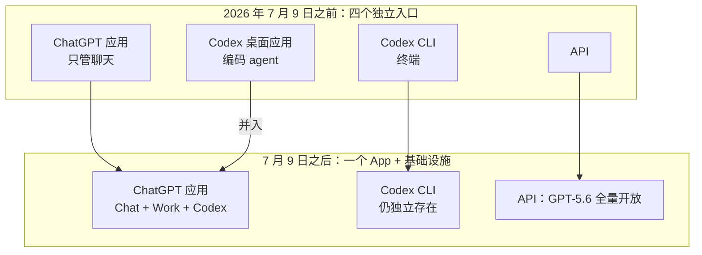
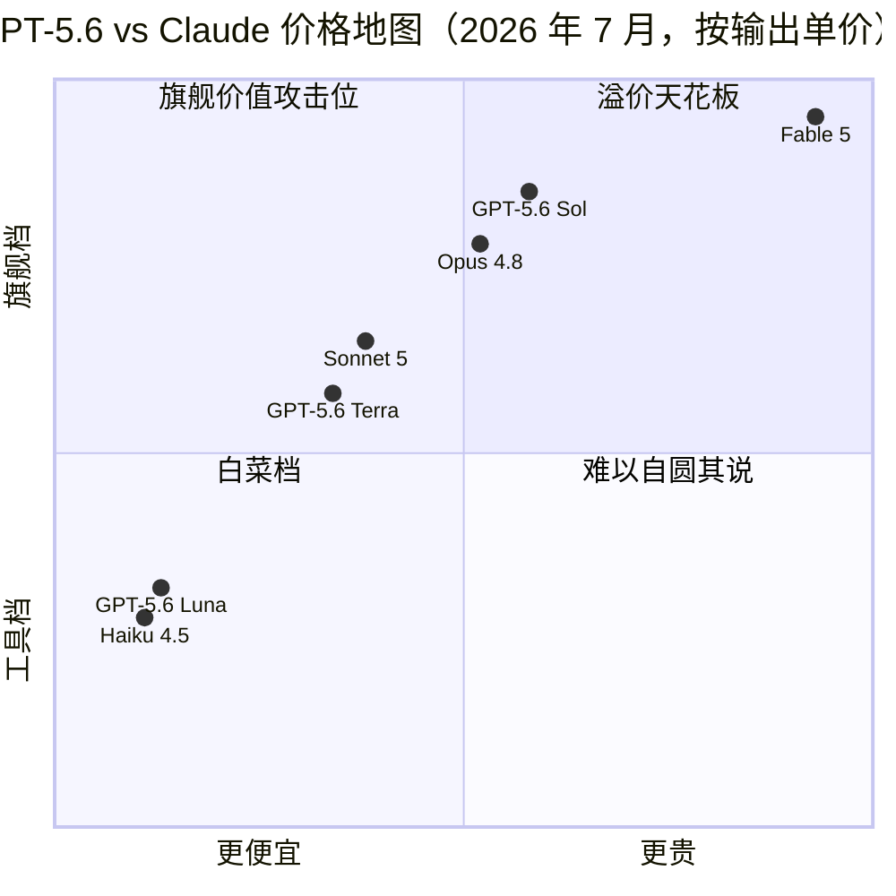

+++
date = '2026-07-10T16:00:00+08:00'
draft = false
title = 'GPT-5.6 正式发布：三档价格、Codex 并入 ChatGPT Work 全解读'
description = 'GPT-5.6 于 2026 年 7 月 9 日全量开放：Sol/Terra/Luna 三档定价对着 Claude 打、Codex 并入 ChatGPT Work 意味着什么、厂商跑分该打几折、国内怎么用 Luna 低成本试水，以及 Claude Code 用户的三个迁移信号。'
toc = true
tags = ['GPT-5.6', 'OpenAI', 'AI Coding Models', 'Model Comparison']
keywords = ['gpt-5.6 发布', 'gpt5.6 价格', 'chatgpt work 是什么', 'codex 合并', 'gpt-5.6 国内使用', 'gpt-5.6 对比 claude', 'gpt-5.6 api 多少钱']

[[params.faqItems]]
question = "GPT-5.6 现在能用了吗？"
answer = "能。2026 年 7 月 9 日起，GPT-5.6（Sol/Terra/Luna）在 ChatGPT、ChatGPT Work、Codex 和 API 全量开放，24 小时内全球铺开。6 月 26 日预览期'仅 20 家政府批准企业'的限制已解除。国内用户仍需通过常规出海手段访问。"

[[params.faqItems]]
question = "GPT-5.6 价格是多少？"
answer = "每百万 token：Sol 输入 $5 / 输出 $30，Terra $2.50 / $15，Luna $1 / $6。三档都是 1M 上下文窗口、128K 最大输出，知识截止 2026 年 2 月 16 日。"

[[params.faqItems]]
question = "ChatGPT Work 是什么？"
answer = "OpenAI 在 2026 年 7 月 9 日随 GPT-5.6 一起发布的 agent 模式，由 GPT-5.6 和 Codex 驱动：能读本地文件、操作应用、用内置浏览器上网，单个任务可以连续跑几个小时。首发 Pro/Enterprise/Edu 档，Plus 和 Business 几天内跟进。"

[[params.faqItems]]
question = "Codex 被 ChatGPT Work 取代了吗？"
answer = "是并入不是取代。Codex 桌面应用合并进了 ChatGPT 应用，Chat、Work、Codex 现在是同一个 App 里的三个入口；Codex CLI 继续作为独立工具存在，Codex 也仍是 ChatGPT Work 背后的执行引擎。"

[[params.faqItems]]
question = "GPT-5.6 写代码比 Claude 强吗？"
answer = "未经独立验证。Sol 的 Coding Agent Index 80 分是在 OpenAI 自家 Codex harness 上跑出来的；而公开的 SWE-bench Pro 上 Fable 5 以 80% 对 64.6% 领先 15 分。想自己验证，用 Luna（$1/$6）花 5 美元跑一遍你的真实任务最划算。"
+++

OpenAI 的官方通稿想让你记住一个数字：Sol 在 Coding Agent Index 拿 80 分，比 Claude Fable 5 高 2.8。这行字，是整场 GPT-5.6 发布里被高估得最狠的一句。

被低估得最狠的那句，埋在通稿很靠后的位置，措辞平淡得像条运维公告：Codex 桌面应用没了，整个并进 ChatGPT。前一个数字是在 OpenAI 自家 harness 上跑出来的，接下来几周会被吵个不停；后一件事悄悄改写了这家公司卖 agent 的方式——到明年一月，它还在影响你选什么工具。

先把背景补齐。2026 年 7 月 9 日，OpenAI [宣布 GPT-5.6 全量开放](https://openai.com/index/gpt-5-6/)：Sol、Terra、Luna 三档，同时登陆 ChatGPT、API、Codex，外加全新的 agent 产品 ChatGPT Work，24 小时内全球铺开。6 月 26 日那场只有约 20 家政府获批企业摸得到的"预览式发布"，正式翻篇。

两周前我在[模型选型那篇](/zh/posts/ai/2026-07-07-best-ai-coding-models-2026/)里写过：在能给 GPT-5.6 创建 API key 之前，把它从选型里划掉。这一天来得比我预期快，这篇就是我欠读者的续集。

结论放最前面：这周谁都不该迁移；买 API 的人值得花 5 美元做个实验；如果你的 Claude Code 工作流跑得好好的，这次发布跟你真正相关的只有价格战那一节——它决定的是 Anthropic 价目表接下来怎么动。下面全文都在给这三句话补证据。

## 7 月 9 日的 GPT-5.6 发布到底包含什么

先钉事实，因为不少中文报道还在把 6 月预览期的说法和 GA 当天的现实搅在一起。

> 2026 年 7 月 9 日起，GPT-5.6 三档全量开放，每百万 token 定价：**Sol 输入 $5 / 输出 $30**，**Terra $2.50 / $15**，**Luna $1 / $6**。三档统一 1M 上下文、128K 最大输出，知识截止 2026 年 2 月 16 日。

这次铺开同时覆盖四个入口：ChatGPT（所有付费档，模型选择器 24 小时内陆续更新）、API、Codex，以及 [ChatGPT Work](https://openai.com/index/chatgpt-for-your-most-ambitious-work/)——一个能读本地文件、操作你电脑上的应用、用内置浏览器上网，按 OpenAI 的说法"可以在一个项目上连续工作几个小时"的 agent。

ChatGPT Work 首发只给 Pro、Enterprise、Edu 三档，Plus 和 Business "几天内"跟进，[TechCrunch 的发布报道](https://techcrunch.com/2026/07/09/openai-launches-its-new-family-of-models-with-gpt-5-6/)确认了这个分批节奏。

时间线值得单独记一笔：6 月 26 日被限制在约 20 家获批企业（只开 API 和 Codex，ChatGPT 里没有），7 月 9 日全量，限制只活了 13 天——和 Claude Fable 5 六月那场两周半的出口管制停用几乎同量级。一个月内两家前沿实验室先后经历"政府门槛式发布"，也都快速走了出来。我之前把监管可用性风险列为 2026 年模型选型的新条目，7 月给出的初步好消息是：这类停摆以周计，不以季度计。

## 跑分打几折：两个 80 分的镜像剧本

再看 OpenAI 领衔宣传的数字：Sol 在 **Coding Agent Index 拿 80，比 Fable 5 高 2.8**；**Agents' Last Exam 拿 53.6，高 13.1**；Intelligence Index 上与 Fable 5 差不到 1 分，但耗时少 61%、估算成本约一半。每一条都得打折，而发布页不会主动告诉你原因。

先看 harness，这是全部问题的核心。[Artificial Analysis 那个 80 分，是把 Sol 装进 OpenAI 自家 Codex harness 跑出来的](https://artificialanalysis.ai/articles/gpt-5-6-has-landed)。这部电影我们三周前刚看过，只是主角互换：Anthropic 给 Fable 5 发 SWE-bench Pro 80.3% 时用的也是自家 agentic 脚手架，独立评测方当场追问中立环境下能剩多少——那场争议我在[模型选型那篇](/zh/posts/ai/2026-07-07-best-ai-coding-models-2026/)里详细拆过。同一个剧本反向重演，连分数都诡异地同为 80。

一条我反复念叨的原则：**模型在厂商为它调校的 harness 里跑出的分，是天花板数字，不是你的日常体验**。

反方证据就在公开数据里。SWE-bench Pro 上 **Fable 5 以 80% 对 Sol 的 64.6% 领先 15 分**，这是目前公开可查的最深编码 benchmark。OpenAI 的应对比分数本身更有信息量：不去争分，而是[发了一份审计报告，称 SWE-bench Pro 约 30% 的任务本身是坏的](https://simonwillison.net/2026/Jul/9/gpt-5-6/)。

审计也许有道理——benchmark 年久失修是真问题。但注意这个模式：每家实验室都拥抱自己赢的榜、审计自己输的榜的方法论。当双方都开始给自己的作业打分，分数就不再能平息争论。Simon Willison 上手实测的结论跟我的预期对得上：Sol"确实非常能干"，但在他日常跑的复杂编码任务上没超过 Anthropic 的模型——这仍是这场发布里最诚实的一句话。

| 数字 | 内容 | 谁跑的 | 用谁的 harness | 我的折扣 |
|---|---|---|---|---|
| Coding Agent Index | Sol 80，领先 Fable 5 2.8 | Artificial Analysis | OpenAI 的 Codex harness | 天花板数字，等中立 harness 复测 |
| Agents' Last Exam | Sol 53.6，领先 13.1 | OpenAI 发布页 | OpenAI 自己 | 厂商自报，暂无独立复现 |
| Intelligence Index | 与 Fable 5 差 1 分内，耗时 -61%、成本约一半 | Artificial Analysis | 标准流程 | 全场我最信的一条 |
| SWE-bench Pro | Fable 5 80% vs Sol 64.6% | 公开榜单 | 双方各执一词 | OpenAI 选择审计它而不是追上它 |

全场我唯一买账的是效率。单任务 token 数和耗时比通过率难造假，Artificial Analysis 的独立成本测量也交叉印证了——Sol 的编码任务成本比 Fable 5 max 档便宜约 40%——而且和 OpenAI 选的定价逻辑自洽。如果 GPT-5.6 有真实优势，在"单位产出成本"，不在能力天花板。

## 真正的头条：Codex 并入 ChatGPT Work

把记分牌放一边，半年后还成立的新闻是这条：**Codex 桌面应用作为独立产品不存在了**。按 [The Decoder](https://the-decoder.com/openai-pairs-its-gpt-5-6-public-rollout-with-chatgpt-work-a-new-agent-that-handles-entire-workflows/) 和 [MacRumors](https://www.macrumors.com/2026/07/09/openai-chatgpt-work/) 的报道，Chat、Work、Codex 现在是同一个 ChatGPT 应用里的三个入口，所有档位（含免费档）统一入口，Codex 变成 ChatGPT Work 背后的执行引擎。Codex CLI 保留为独立工具，但重心挪到了哪边，肉眼可见。

这是一次哲学分叉，两条路都得说清楚。OpenAI 押注 agent 工作流属于**一个消费级超级 App**：你聊天的那个窗口，同时改你的表格、重构你的仓库、替你上网办事。Anthropic 走的是反方向——Claude Code 是独立的 CLI/SDK，可组合的原语才是产品，App 只是配角。

我在 [CLI + Skills vs MCP 那篇](/zh/posts/ai/2026-07-10-cli-skills-vs-mcp/)里论证过：agent 能力越来越多地长在"薄而可脚本化"的那一层，而不是一体化的壳里；OpenAI 刚在壳上下了重注。两个赌注面向不同人群，都可能赢：超级 App 赢的是做 PPT 的分析师和管表格的 PM，CLI 赢的是想把 agent 塞进 CI、cron 和 git worktree 的工程师。

这次合并暴露了 OpenAI 的内部算术：Codex 作为独立开发者产品，撑不起一个自己的 App；但 Codex 作为大众 agent 产品背后的肌肉，是大得多的生意。商业上这很理性——账单落在开发者头上。当你的编码 agent 变成消费级 App 里的一个标签页，它的路线图就跟着消费级优先级走。

如果你去年冬天看完 [Claude Code vs Codex](/zh/posts/ai/2026-02-19-claude-code-vs-codex/) 的对比后选了 Codex，你选的工具刚刚在内部换了东家。Codex CLI 接下来两个季度会被当成几等公民，值得盯着看。

## GPT-5.6 价格战：三档全是对着 Claude 定的

这份价目表是 OpenAI 今年发布过的最直白的战略文件。把每一档放到 Anthropic 产品线旁边，意图藏都藏不住：

三次瞄准射击。**Sol $5/$30 直接坐在 Opus 4.8 的 $5/$25 上**——输入价一分不差、输出略高——同时宣称 Fable 级能力，等于"用副旗舰的价格卖旗舰"，把 Fable 5 的 $10/$50 拦腰砍半。**Terra $2.50/$15 卡进 Sonnet 5 标准价 $3/$15 的下沿**，输出完全对齐、输入削掉五毛，这个数字是盯着 Anthropic 价目表定出来的。**Luna $1/$6 贴着 Haiku 4.5 的 $1/$5**，输出多收一美元，换一个更大的上下文窗口。

对 Anthropic 的挤压带着截止日期。Sonnet 5 的早鸟价 $2/$10 到 8 月 31 日为止——我推荐它做默认编码模型，很大程度上就是冲这个价。9 月 1 日恢复 $3/$15 之后，Terra 在纸面上就成了更便宜的中端。

预测立此存照：**Anthropic 要么延长早鸟价，要么在它到期后几周内跟进降价**。2026 年的前沿模型定价越来越像 2014 年的云存储：在一个弹药充足的对手头顶撑价格伞，等于把市场份额白送。给 Q4 做 API 预算的话，把"中端价格向下走"当默认假设。

## 国内用户：能不能用，怎么便宜地试

先说结论：**API 走中转今天就能试，ChatGPT Work 短期内对国内用户基本是看得见摸不着**。拆三件事讲。

第一，API 可用性。OpenAI 依旧不对中国大陆提供官方服务，GA 没改变这一点。现实路径还是那几条：有海外支付和网络环境就直连官方 API，否则走 API 中转/聚合平台——中转通常在 GA 后 24-48 小时内挂出新模型，价格在官方价上浮 10%-30%。

试水预算我建议全押 Luna：$1/$6 的官方价意味着中转即使加价三成，花三五十块人民币也够把你一周的真实任务全跑一遍——这是三档定价里对国内用户唯一友好的一档。选中转只看两点：是否按官方模型名透传（防止背后偷换成便宜模型）、是否支持按量付费不锁月费。

第二，封号风险。这轮 GA 没有放松风控，反而因为 ChatGPT Work 能操作本地文件和浏览器，账号与设备环境绑得更深了。历史规律照旧：虚拟卡开 Pro 档、IP 频繁跳区、多人共享账号，是三个最常见的触发条件。

我的建议很直接：**别为了 GPT-5.6 去冒充值几百美元订阅费的封号风险，API 中转按量试完再说**。模型能力用 API 就能完整评估，ChatGPT Work 的产品体验不值得押上账号。

第三，ChatGPT Work 的国内体验。它首发只在 Pro（$200/月）、Enterprise、Edu 三档，Plus 还要再等几天；而它的核心卖点——读本地文件、操作本地应用、内置浏览器连续工作几小时——每一项都要求稳定的网络长连接。挂着代理跑一个持续数小时的 agent 任务，断线重连的体验可以自行想象。

再加上数据层面的现实问题（你让它读的本地文件会上传到 OpenAI 的执行环境），我给国内读者的判断是：这个产品形态值得关注，但作为日常生产力工具，国内可用性未来一两个季度都不会及格。想要"能连续干几小时活的 agent"，本地跑的 Claude Code 或开源替代仍是国内环境下更现实的选择——Anthropic 各档订阅和免费额度国内怎么用，我在 [Claude 免费额度实测](/zh/posts/ai/2026-07-08-claude-free-tier-limits/)里写过。

## 该不该切换：谁该动手，谁该无视

"要不要迁移"其实有三个答案，取决于你坐在哪个位置。

**Claude Code 是你的日常主力、且跑得顺：不迁移，这次发布的其他部分你甚至都可以无视**。GA 当天按厂商天花板数字迁移，正是 Fable 5 发布时我警告过的错误——中立 harness 的评测现在一个都没有。7 月 9 日发生的一切，都没改变你终端里今天能干的事。唯一值得盯的是上面那盘九月的价格棋，那才是这次发布最终碰到你账单的地方。

**你在按量买 API token：不切换，但也别装看不见——这周把便宜实验做了**。拿 5 美元额度（走中转约 50 块人民币），把你最近五个**真实任务**——这周真挂过的测试、真写过的迁移脚本，不是玩具 prompt——喂给 Luna，和你现在的默认模型对比输出。

5 美元约等于 50 万 token 的 Luna 输出，足够看清它的工具调用纪律和指令跟随质量。Luna 表现惊艳的话，再把同样的任务升到 Terra，最后才碰 Sol；三档在 Coding Agent Index 上是 75、77、80，档间差距小到便宜档就能告诉你贵档的大部分答案。

**无论你坐哪个位置，真正的迁移决定都压到三个信号出现之后**——截至 2026 年 7 月 10 日，三个都还不存在。一，中立 harness 的 benchmark：Sol 和 Claude 系在谁都不控制的第三方脚手架上跑 Terminal-Bench 或 SWE-bench。二，两周真实生产反馈：GA 首周的模型有安静降级和限流抽风的前科，让别人先踩。三，蜜月期后的价格：OpenAI 没承诺现价永久，Anthropic 的应对两个月内必然落地。

三个信号都倒向 GPT-5.6，九月再迁移，你不会损失七月的任何东西；有一个不倒向，你省下的就是一次工作流重建。

## 一句话总结

GPT-5.6 的发布是真的、全球的、定价带着杀气的——这些经得起推敲。能力宣称大多还不算数：编码旗舰分是自家 harness 跑的，最深的公开 benchmark 还落后 Fable 5 十五分，全场最可信的优势是单位任务成本，不是能力上限。

7 月 9 日真正值得记住的是那次合并：OpenAI 把开发者 agent 折叠进消费级超级 App，Anthropic 继续卖可组合的开发者原语。这个分叉对你工具箱的影响，会比这个季度的榜单长命得多。花 5 美元跑一遍 Luna，盯住中立 harness 的数字——在证据（而不是发布会）先动之前，默认模型别动。

## 相关阅读

- [2026 最强 AI 编码模型对比：Fable 5、Sonnet 5 还是 GPT-5.6](/zh/posts/ai/2026-07-07-best-ai-coding-models-2026/) — 本文更新的正是这篇的 GA 前判断
- [MCP vs Skills：为什么 CLI + Skill 赢下 agent 工具链](/zh/posts/ai/2026-07-10-cli-skills-vs-mcp/) — 理解 Codex 合并背后哲学分叉的分层论
- [Claude Code vs Codex：8 维度正面对决](/zh/posts/ai/2026-02-19-claude-code-vs-codex/) — Codex 变形前的两大 agent CLI 对比
- [2026 年 Claude 免费额度实测：免费版到底能干什么](/zh/posts/ai/2026-07-08-claude-free-tier-limits/)
