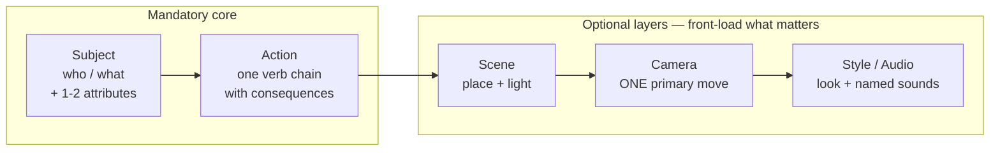
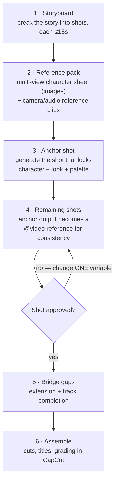

+++
date = '2026-07-11T10:00:00+08:00'
draft = false
title = 'Seedance 2.0 Prompt Guide: Best Practices & Failure Modes'
description = 'How to write Seedance 2.0 prompts that work: a five-slot formula, @reference tagging rules, six failure modes, and what transfers to Veo 3 and Sora 2.'
toc = true
tags = ['Seedance', 'AI Video', 'ByteDance', 'Prompt Engineering', 'Video Generation']
keywords = ['seedance prompt guide', 'seedance 2.0 tutorial', 'bytedance video ai prompts', 'how to write seedance prompts', 'seedance 2.0 reference video', 'seedance vs veo 3 prompts', 'seedance prompt formula']

[[params.faqItems]]
question = "How do I write prompts for Seedance 2.0?"
answer = "Use five slots in order: subject, action, scene, camera, style/audio. Keep it to 60-100 words, front-load what matters most, use exactly one primary camera move, and put spoken dialogue in double quotes for automatic lip-sync."

[[params.faqItems]]
question = "How do @image and @video references work in Seedance 2.0?"
answer = "You can attach up to 9 images, 3 videos, and 3 audio files (12 total) and cite them as @image1, @video1, @audio1 in the prompt. Always state what each reference is for — 'reference @video1 for camera movement only' — because a naked @video1 with no role assignment is the single most common failure."

[[params.faqItems]]
question = "Why do my Seedance 2.0 videos ignore half my prompt?"
answer = "Instruction adherence decays by position: the first 2-3 instructions are followed reliably, and a prompt with 8 requirements typically lands only 4-5. Cut the prompt to 60-100 words and move the non-negotiable instructions to the front."

[[params.faqItems]]
question = "Do Seedance 2.0 prompt techniques work on Veo 3 or Sora 2?"
answer = "Camera vocabulary (dolly, orbit, tracking shot) and quoted dialogue transfer well. The @multi-reference system, audio references, beat-synced editing, prompt-based video editing, and reliable on-screen text are Seedance-specific and do not transfer."

[[params.faqItems]]
question = "How much does Seedance 2.0 cost per video?"
answer = "As of July 2026, roughly ¥1 (~$0.14) per 15-second clip via Volcano Engine's API, or about $0.68/second at 1080p through fal.ai. Dreamina and CapCut offer free daily credits, which is enough for learning the prompt patterns in this guide."
+++


Two prompts, one shot — the fastest way to show you what this Seedance 2.0 prompt guide is worth. Here's the version most people type on day one:

```text
A beautiful woman walking down a city street at night, cinematic, stunning,
epic camera movement, high quality, 8K
```

What comes back is stock footage. A woman who could be anyone drifts past buildings that could be anywhere. The camera can't decide between a pan and a zoom, so it does a queasy bit of both. And because the prompt says nothing about sound, the model drapes a random orchestral score over the whole thing — Seedance 2.0 generates audio and video together, and silence has to be requested.

Same shot, rewritten:

```text
A woman in her 30s, dark hair, charcoal wool coat, walks past rain-wet
storefronts, stops, and exhales visibly in the cold air. Night street after
rain, neon reflections on the asphalt. Camera: slow push-in from a 45° angle,
ending in a medium close-up. Audio: light rain, distant traffic, muffled jazz
from inside a shop, no music.
```

What comes back is the shot you storyboarded. A specific person, an action with a physical consequence (that visible breath), one committed camera move with an end state, and a soundscape you chose. Same model, same settings, same roughly ¥1 (~$0.14) per 15-second clip. The prompt is the entire difference — and the rest of this guide is the anatomy of that difference.

ByteDance published an official prompt guide for Seedance 2.0 in late March 2026, and it's genuinely useful — as a dictionary. It tells you a slogan formula exists, that camera moves can be lifted from reference videos, that subtitles can sync to a voiceover. It never tells you *when* to reach for which technique, what happens when you stack them wrong, or which hard-earned habits from Veo 3 and Sora 2 will actively sabotage you here. I wrote a [full teardown of Seedance 2.0's architecture](/posts/ai/2026-03-29-seedance-2-bytedance-ai-video/) when it topped the [Artificial Analysis](https://artificialanalysis.ai/text-to-video) leaderboard in March; this is the companion piece about actually driving the thing.

One idea organizes everything below: **a Seedance 2.0 prompt is a job assignment, not a description.** Text handles semantics — who does what. References handle standards — exactly how things look and move. Nearly every failed generation I've seen traces back to mixing up those two jobs, not to a shortage of adjectives.

## The Five-Slot Seedance 2.0 Prompt Formula

The official formula is `subject + motion + environment + camera + aesthetics + audio`, with everything after motion marked optional. Accurate — and it reads like a shopping list, so people respond by stuffing every slot to the brim. The version I actually use has budgets attached. Copy this one:

```text
[SUBJECT]  who or what, 1-2 concrete attributes, no more
[ACTION]   one primary verb chain, with physical consequences
[SCENE]    place + light, one sentence
[CAMERA]   exactly ONE primary move, optionally with an end state
[STYLE/AUDIO]  visual treatment + named sounds ("no music" if unwanted)
```



Three rules make the template work. None of them appear in the official guide.

**Rule 1: budget 60–100 words total.** When someone in the guide's comment thread asked ByteDance whether there's a recommended prompt length, the team's answer was "no." The community converged on one anyway, because instruction adherence decays by position: the first two or three instructions land almost every time, while a prompt with eight requirements typically honors four or five, seemingly at random. I now treat trimming as debugging step one — cut to under 100 words before touching anything else, and half the time the problem disappears right there.

**Rule 2: verbs beat adjectives.** "A stunning, cinematic, beautiful dancer" gives the model nothing to animate. "A dancer dropping into a low spin, the skirt flaring, then snapping upright" hands it a physical sequence with consequences. The [fal.ai prompting guide](https://fal.ai/learn/tools/seedance-2-0-prompting-guide) frames the same point as describing outcomes: "leaves scatter *on each impact*" resolves to concrete motion; "leaves scatter" resolves to a screensaver.

**Rule 3: one camera move per clip.** Seedance 2.0 speaks fluent camera — dolly, pan, orbit, crane, tracking shot, Hitchcock zoom, locked-off — and executes a single instruction cleanly. What it won't do is arbitrate between two. "Fixed shot" plus "orbit the subject" in the same clip produces jitter, drift, or an ugly split of the difference. If you need two moves, that's two shots, and Seedance handles multi-shot natively with explicit "cut to" markers.

Here's the slot-by-slot autopsy of the two opening prompts:

| | Weak prompt | Strong prompt |
|---|---|---|
| **Subject** | "a beautiful woman" | "a woman in her 30s, dark hair, charcoal wool coat" |
| **Action** | "walking, looking amazing, cinematic vibes" | "walks past rain-wet storefronts, stops, exhales visibly in the cold air" |
| **Camera** | "dynamic camera, epic movement, orbiting and zooming" | "slow push-in from a 45° angle, ending in a medium close-up" |
| **Audio** | *(unspecified — model adds random score)* | "light rain, distant traffic, muffled jazz from inside the shop, no music" |
| **Result** | Generic stock footage with a soundtrack you didn't ask for | The shot you storyboarded |

The audio row is the one everybody skips. Joint audio-video generation in a single forward pass is Seedance 2.0's signature capability, which means an empty audio slot doesn't buy you silence — it buys you a soundtrack you didn't pick. On this model, silence is a direction, not an absence.

## Text vs. References: The Core Decision in Every Seedance Prompt

> As of July 2026, Seedance 2.0 accepts up to 12 reference files per generation — 9 images, 3 videos, and 3 audio tracks — cited inline as @image1, @video1, @audio1. No competing model comes close: Sora 2 takes a single image, and audio references don't exist anywhere else.

The official guide documents those mechanics thoroughly. What it skips is the decision rule — when do you describe something in text, and when do you attach a file? The rule I use: **text is for spatial decisions, references are for temporal and identity decisions.** What the world contains, where the light comes from, what mood you're after — text handles all of that fine. But a camera move's exact easing, a dance's rhythm, a character's face holding steady across angles — text can only approximate those, while a reference *contains* them. Describing a Hitchcock zoom in words gets you a plausible Hitchcock zoom; attaching a clip of one gets you *that* zoom.

| You want to control... | Use | Why |
|---|---|---|
| Who's in the scene, what happens | Text | Semantics is what language is for |
| A character's exact face/outfit across shots | @image (multi-view set) | Identity drifts in text; images anchor it |
| A specific camera move's feel | @video | The clip contains the timing; words approximate it |
| Choreography, gesture cadence | @video | Same — rhythm doesn't survive translation to text |
| Music, beat-synced cuts | @audio | Seedance cuts and paces to the actual waveform |
| A logo or product's precise look | @image | Text-described logos render as fiction |
| Mood, light, atmosphere | Text (or @image at low strength) | Cheap to describe, no anchoring needed |

Two operational rules sit on top of the table, and they prevent more failures than everything else in this guide combined.

**Every reference needs a stated job.** The single most common failure in community threads is the naked reference: "reference @video1," full stop. Reference *what* about video1 — the camera? The action? The color grade? An unassigned reference makes the model guess, and it guesses everything at once, bleeding the reference clip's lighting, framing, and pacing into a shot where you only wanted its choreography. Write the role assignments as their own block:

```text
@image1 = the character's appearance (hold across all shots)
@video1 = camera movement only
@audio1 = background rhythm, cut on the beat
```

**Keep reference strength at 70–80%.** The default is 75% and it's well chosen. I ran the full sweep in [the teardown](/posts/ai/2026-03-29-seedance-2-bytedance-ai-video/); the short version is that at 90–100% your character becomes a cardboard cutout — technically faithful, unable to adapt pose and lighting naturally — while below 60%, identity starts to drift. Maxing every slider "for safety" is the reference-system equivalent of adjective-stuffing, and it fails the same way.

## On-Screen Text: The Prompt Technique No Other Model Can Copy

Legible text inside generated video has been the industry's shared embarrassment — signs, screens, and titles come out as alien glyphs on essentially every model. Seedance 2.0 is the first one where prompting for on-screen text is a real workflow rather than a prayer, across T2V, I2V, and reference-based generation. The official guide splits it into three techniques; having tested all three, here's my reliability ranking.

**Subtitles (most reliable).** The pattern:

```text
subtitles appear at the bottom of the frame, matching the voiceover: "..."
```

Because audio and video come out of one pass, the sync is genuine rather than post-hoc. One constraint the guide only implies: keep each spoken line short. Long monologues drift out of lip-sync; the fix is splitting the speech across cuts, one sentence per cut.

**Slogans and titles (reliable with the formula).** Worth memorizing, because every element is load-bearing:

```text
"text content" + when it appears + where it appears + how it enters + styling (color, style)
```

Example from the guide, translated: *"...the frame gradually blurs, and the text 'Joy is Seedance' appears in the center of the frame."* Omit the timing and the text may squat in frame for the entire clip; omit the position and it lands wherever. And if your brand needs an exact logotype rather than "text in roughly the right style," don't prompt it — attach the logo as an @image reference.

**Speech bubbles (fun, less predictable).**

```text
[Character] says: "...", a speech bubble appears beside them containing the line
```

Great for comic-style content, with more variance in bubble placement and style.

One constraint governs all three: **use common words and skip special symbols.** Rare glyphs and decorative punctuation are exactly where the alien-glyph problem sneaks back in. And write your prompt in the same language as the text you want rendered — an English prompt asking for on-screen Chinese (or vice versa) measurably raises the garbling rate.

## Video References and Prompt-Based Editing: Where Seedance Stops Being a Generator

Sections 2.3 and 2.4 of the official guide are, in my judgment, the actual moat — and the sections most people skip because they look advanced. Together they turn Seedance 2.0 from a text-to-video generator into something closer to a promptable video editor:

- **Action reference**: transplant choreography from a clip onto your character — "the singer in @video1 replaced by the man in @image1, movements exactly following the original video."
- **Camera reference**: steal a camera move wholesale — "follow all camera movements from @video1." Combined with vocabulary like "one continuous take, no cuts," this produces shots that text alone won't.
- **Effects reference**: replicate a transition or particle effect from a reference clip onto new content.
- **Element add/remove/change**: modify an existing video by prompt — change a character's hair color, add a shark surfacing behind a swimmer, flip a scene's emotional register mid-clip.
- **Extension, forward and backward**: extend an existing clip, with the guide recommending per-second breakdowns for anything over 8 seconds.
- **Track completion**: bridge two or three separate clips into one continuous sequence — "the particle horse in @video1 gradually solidifies... transitioning into @video2."

The per-second breakdown deserves its own template, because it generalizes: **for any clip longer than 8 seconds, structure the prompt as a timeline, not a description.** A single block of prose describing 15 seconds of action forces the model to invent its own pacing; a timeline hands it a shot plan.

```text
Seconds 1-5:   light slides across the table, steam rises from the cup
Seconds 6-10:  camera pushes in as the barista sets down the saucer
Seconds 11-15: the text "Lucky Coffee" fades in at the center of the frame
```

This one habit fixed more of my long-clip generations than any other change in this guide.

## Six Seedance Prompt Failure Modes the Official Guide Won't Warn You About

Every technique above has a corresponding way to crash. These six account for nearly every broken generation I've produced or seen dissected in community threads — the [dexhunter/seedance2-skill](https://github.com/dexhunter/seedance2-skill) repo, which reverse-engineered the official guide into an agent skill, corroborates most of them:

| # | Failure mode | Symptom | Fix |
|---|---|---|---|
| 1 | Instruction overflow | 8 requirements written, 4-5 honored, seemingly at random | Cut to 60-100 words; front-load the non-negotiables |
| 2 | Naked @references | Reference clip's lighting/framing bleeds into your shot | Assign every reference an explicit job ("for camera movement only") |
| 3 | Stacked camera moves | Jitter, drift, mid-clip direction changes | One primary move per clip; use "cut to" for the rest |
| 4 | Mixed-language prompts, rare glyphs | On-screen text garbles; semantics get muddy | One language per prompt, matched to the on-screen text; common words only |
| 5 | Scene cramming | 3 locations demanded of a 5-second clip → smeared morphing | Match complexity to duration; per-second timeline above 8s |
| 6 | Reference strength maxed / real faces | Cardboard characters; identifiable-face uploads get blocked outright | 70-80% strength; use illustrated or generated character sheets |

Number 4 bites bilingual users hardest. Chinese-English mixed prompts *mostly* work at the semantic level, but the moment on-screen text is involved, mixing languages measurably raises the garble rate. Pick the language of your target text and write the whole prompt in it.

Number 6's second half is a policy constraint, not a quality one. After the IP disputes I covered in the teardown, Seedance blocks generation from clearly identifiable real faces — so plan your character pipeline around generated or illustrated reference sheets from day one, rather than discovering the block mid-project.

## What Transfers to Veo 3 and Sora 2 — and What Doesn't

If you work across models — and at current pricing spreads, you probably should — it matters which habits are portable. As of July 2026, here's my transfer map:

| Technique | Seedance 2.0 | Veo 3 | Sora 2 |
|---|---|---|---|
| Camera vocabulary (dolly, orbit, tracking) | Native | Excellent — arguably best-in-class precision | Good |
| Subject + action + consequence structure | Native | Transfers fully | Transfers fully |
| Quoted dialogue → lip-sync | Native, one pass | Yes, native audio | Approximate; audio is post-hoc |
| @multi-reference (9 img / 3 vid / 3 audio) | **Unique** | Up to ~3 image ingredients in Flow | Single image |
| Audio file as rhythm/beat reference | **Unique** | No | No |
| Multi-shot in one generation ("cut to") | Native | Limited | Via storyboard tool, different syntax |
| On-screen text (slogans, subtitles) | Workable | Garbles | Garbles |
| Prompt-based video editing (add/remove/extend) | Native | Extend only | Remix, different mental model |

The pattern in one line: **the grammar transfers, the vocabulary of control doesn't.** Structure your prompt as subject-action-scene-camera anywhere and you'll do fine. Everything involving references, on-screen text, audio direction, and editing is Seedance dialect.

The reverse direction has its own traps. The habit Veo 3 users bring that hurts most is over-writing — Veo 3 rewards elaborate, hyper-specified prompts, while Seedance's instruction-position decay punishes them. Sora 2 users bring the opposite problem: trusting the model's creative liberties. Seedance follows orders more literally, which means vague orders produce literal, boring output rather than a pleasant surprise.

## The Anchor-Shot Workflow: From Storyboard to Final Cut

Individual techniques are moves; the payoff comes from running them as a pipeline. Here's the workflow I've settled on for multi-shot pieces:



Three judgments are embedded in that diagram, ordered by how much pain they save.

**Generate the anchor shot first, then feed it back.** Character consistency across shots is Seedance's headline feature, but it isn't automatic — it's earned by making your best shot the reference for every subsequent one. The anchor shot is the one where character, wardrobe, and palette all land; from then on it rides along as `@video1`, and the model treats it as ground truth.

**Change one variable per iteration.** When a shot misses, the instinct is to rewrite the whole prompt. Resist it. Adjust the camera *or* the action *or* the reference strength, regenerate, compare. At roughly ¥1 per 15-second clip, iteration is nearly free in money but not in time — disciplined single-variable changes converge in 3-4 rounds where shotgun rewrites wander for ten.

**Build the reference pack before generating anything.** The multi-view character sheet is the highest-leverage asset in the pipeline, and it's an image-generation problem, not a video one. I use [Seedream — ByteDance's image-side sibling model](/posts/ai/2026-07-10-seedream-5-pro/) for character sheets, since the aesthetic transfers cleanly into Seedance; for a free local alternative, my [Draw Things + Claude Code pipeline](/posts/ai/2026-02-16-claude-code-draw-things-workflow/) produces serviceable multi-view sets on a Mac.

## How to Access Seedance 2.0 (and What Prompting Practice Costs)

For readers outside China, the access map is genuinely confusing, so briefly: **CapCut** (the international 剪映) is the zero-friction entry — free daily generations, no Chinese phone number, but limited reference controls. **[Dreamina](https://dreamina.jianying.com/)** (international 即梦) exposes the full @reference system on a daily credit allowance and is where I'd practice everything in this guide. For APIs, **Volcano Engine Ark** requires a Chinese phone number; **BytePlus ModelArk** is the international route ByteDance slated for Q2 2026; and **[fal.ai](https://fal.ai/learn/tools/seedance-2-0-prompting-guide)** works today with a credit card.

> As of July 2026, a 15-second Seedance 2.0 clip costs roughly ¥1 (~$0.14) via Volcano Engine's API — about 5-10x cheaper than Sora 2 (~$1.50) or Veo 3 (~$0.75) for equivalent length. Via fal.ai, 1080p runs about $0.68 per second, with 720p and 480p cheaper.

That pricing is why the single-variable workflow above is viable here and painful elsewhere: a full evening of disciplined iteration on Seedance costs less than the coffee you drink while doing it.

## The Takeaway

If you remember one thing: **assign jobs, don't write descriptions.** Text gets semantics, references get standards, every reference gets an explicit role, every clip gets one camera move, and anything over 8 seconds gets a timeline. The official guide gives you the vocabulary; the judgment about what goes where is what separates a generation queue full of near-misses from a shot list that converges.

Start with the five-slot template, keep it under 100 words, and steal the anchor-shot workflow even if you ignore everything else — consistency is the thing viewers actually notice, and it's the thing none of Seedance's competitors can currently match at this price.

## Related Reading

- [Seedance 2.0 Deep Dive: How ByteDance Built the #1 AI Video Model](/posts/ai/2026-03-29-seedance-2-bytedance-ai-video/) — the architecture teardown this guide builds on
- [Seedream 5 Pro: ByteDance's Image Model](/posts/ai/2026-07-10-seedream-5-pro/) — the image-side sibling, ideal for building reference packs
- [Claude Code + Draw Things: A Local Image Generation Pipeline](/posts/ai/2026-02-16-claude-code-draw-things-workflow/) — free local alternative for character sheets
- [Draw Things Ultimate Guide](/posts/ai/2026-02-15-draw-things-ultimate-guide/) — local image generation on Apple Silicon
