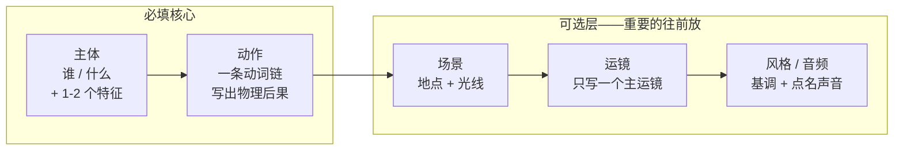
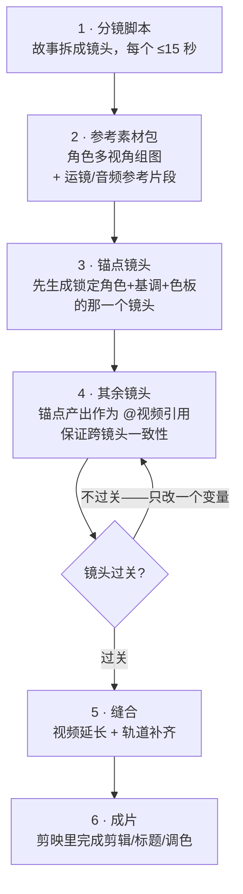

+++
date = '2026-07-11T10:00:00+08:00'
draft = false
title = 'Seedance 2.0 提示词最佳实践：从官方指南到实战'
description = 'Seedance 2.0 提示词实战指南：五段式公式模板、@引用素材分工原则、六大翻车模式排查表、跨模型迁移对比与分镜到成片完整工作流，即梦和火山方舟均适用。'
toc = true
tags = ['Seedance', 'AI Video', 'ByteDance', 'Prompt Engineering', 'Video Generation']
keywords = ['seedance 提示词', 'seedance 教程', '即梦视频教程', 'seedance 2.0 提示词公式', '即梦 AI 视频提示词', 'seedance 运镜提示词', 'seedance 提示词怎么写']

[[params.faqItems]]
question = "Seedance 提示词怎么写？"
answer = "按五段式写：主体、动作、场景、运镜、风格/音频。全文控制在 60-100 词，最重要的指令放最前面，一条片段只写一个主运镜，台词用双引号包住即可自动口型同步。"

[[params.faqItems]]
question = "即梦里的 @图片 @视频 引用怎么用？"
answer = "最多可传 9 张图、3 个视频、3 段音频（共 12 个文件），在提示词里用 @图片1、@视频1、@音频1 引用。关键是必须写明每个引用的用途，比如'只参考 @视频1 的运镜'——裸引用不说明用途是最常见的翻车原因。"

[[params.faqItems]]
question = "为什么 Seedance 生成的视频忽略了我一半的要求？"
answer = "指令遵循度按位置递减：前 2-3 条指令基本每次都执行，写到 8 条要求通常只命中 4-5 条。把提示词砍到 60-100 词、把不可妥协的要求前置，比加更多形容词有效得多。"

[[params.faqItems]]
question = "Seedance 的提示词技巧能用在 Veo 3 或 Sora 2 上吗？"
answer = "运镜词汇（推镜、环绕、跟拍）和'主体+动作+后果'的结构可以通用。但 @多参考系统、音频参考卡点、画面内文字生成、提示词改视频（增删元素/延长/轨道补齐）都是 Seedance 独有能力，迁移不过去。"

[[params.faqItems]]
question = "Seedance 2.0 生成一条视频多少钱？"
answer = "截至 2026 年 7 月，火山方舟 API 约 1 元/15 秒（约 $0.14），比 Sora 2（约 $1.50）便宜 10 倍。即梦和剪映每天有免费额度，练手本文的提示词模板完全够用。"
+++


字节在 2026 年 3 月底放出了《Seedance 2.0 提示词指南》官方文档。这份指南值得读，但它本质上是一本**技法字典**：告诉你 Slogan 有公式、运镜可以参考视频、字幕能跟音频同步——却不告诉你什么时候该用哪招、几招叠在一起会怎么塌、以及你从 Veo 3 和 Sora 2 带过来的习惯里哪些在这儿是负资产。

这篇 Seedance 提示词教程就是补上那层"判断"。三月份 Seedance 2.0 登顶 [Artificial Analysis](https://artificialanalysis.ai/text-to-video) 盲测榜时，我写过一篇[架构层面的深度拆解](/zh/posts/ai/2026-03-29-seedance-2-bytedance-ai-video/)，讲清楚了它为什么强；这篇是姊妹篇，讲怎么把它开好。我的核心结论压缩成一句话：**Seedance 2.0 的提示词是"派活单"，不是"描述文"。**文字负责语义——谁在做什么；@引用负责标准态——长什么样、怎么动。我见过的翻车案例里，九成根源是这两个职责分工搞混了，而不是形容词写得不够多。

## 五段式提示词公式：每一段到底买到了什么

官方给的基础公式是 `主体 + 运动 + 环境 + 运镜 + 美学 + 音频`，运动之后全部标注"非必须"。公式没错，但它像一张购物清单——很多人的反应就是把每一栏都塞满。我实际迭代下来，把它封装成一个带"预算"的模板：

```text
【主体】  谁/什么，1-2 个具体特征，到此为止
【动作】  一条主动词链，写出物理后果
【场景】  地点 + 光线，一句话
【运镜】  只写一个主运镜，可以加终点状态
【风格/音频】视觉基调 + 点名具体声音（不要配乐就写"无配乐"）
```



让这个模板真正好用的是三条规则，官方指南一条都没写：

**全文预算 60-100 词。**官方文档评论区有人问"提示词有推荐字数吗"，字节的回复是"no"。但社区实测早就收敛出了答案：指令遵循度按位置急剧衰减，前 2-3 条几乎每次都执行，写到 8 条要求通常只命中 4-5 条。一条短提示词配一个明确动作，稳定胜过一条野心过剩的长提示词。我现在把"砍提示词"当成排查问题的第一步——先砍到 100 词以内再谈别的。

**动词比形容词值钱。**"一位惊艳、电影感、绝美的舞者"给模型的可动画信息是零；"舞者骤然下沉旋转，裙摆展开，随即利落起身"给的是一段带物理后果的动作序列。[fal.ai 的提示词指南](https://fal.ai/learn/tools/seedance-2-0-prompting-guide)也强调要写结果而不是动作本身："落叶**在每次踏地时**四散"能落到具体运动上，"落叶飘散"只能落到屏保上。

**一条片段一个运镜。**Seedance 2.0 对专业运镜词汇的理解是真的好——推镜、摇镜、环绕、跟拍、希区柯克变焦、机械臂跟随、一镜到底，中文直接写就行。但它不会优雅地仲裁同一片段里的两条运镜指令："固定镜头"加"环绕主体"写在一起，产出的是抖动、漂移或两头不靠的折中。需要两个运镜就拆成两个镜头，Seedance 原生支持多镜头，用"切镜到"显式标记即可。

好坏对比放在一起看：

| | 翻车写法 | 有效写法 |
|---|---|---|
| **主体** | "一位美女" | "30 多岁女性，深色头发，炭灰色羊毛大衣" |
| **动作** | "走路，很好看，电影感" | "走过雨后湿亮的橱窗，停步，在冷空气里呼出白气" |
| **运镜** | "动感镜头，史诗级运镜，环绕加变焦" | "45 度角缓慢推镜，止于中近景" |
| **音频** | （不写——模型随机配乐） | "小雨声，远处车流，店内隐约爵士乐，无配乐" |
| **结果** | 带着莫名 BGM 的素材库画面 | 你分镜里画的那个镜头 |

音频那一行比看起来重要：Seedance 2.0 的招牌能力是音视频在同一次前向传播中联合生成，音频栏空着，默认就是给你配一段乐。不想要音乐必须明说——**在这个模型里，安静是一条指令，不是留白。**

## 文字 vs 素材：决定成败的那次分工

Seedance 2.0 最多接受 9 张参考图、3 个参考视频、3 段参考音频——共 12 个文件，在提示词里用 `@图片1`、`@视频1`、`@音频1` 引用。竞品没有一个接近这个量级（Sora 2 只收一张图，音频参考全行业独此一家）。官方指南把机制讲清楚了，但跳过了最关键的判断：**什么时候用文字描述，什么时候直接投喂素材？**

我的分工原则：**文字管空间性的决定，素材管时间性和身份性的决定。**画面里有什么、光从哪来、要什么氛围——文字完全够用。但一个运镜的确切缓动、一段舞蹈的节奏、一张脸在不同角度下的一致性——文字只能逼近，而素材本身就**是**答案。用文字描述希区柯克变焦，得到的是"像那么回事"的变焦；扔一段参考视频进去，得到的是**那个**变焦。

| 你想控制的是… | 用什么 | 为什么 |
|---|---|---|
| 谁在场、发生什么 | 文字 | 语义本来就是语言的活 |
| 角色跨镜头的脸和服装 | @图片（多视角组图） | 文字锚不住身份，图片可以 |
| 某个运镜的手感 | @视频 | 片段自带时序，文字只是转述 |
| 编舞、手势节奏 | @视频 | 节奏经不起翻译成文字 |
| 音乐卡点、节拍切镜 | @音频 | 模型按真实波形踩点 |
| Logo、产品的精确外观 | @图片 | 文字描述的 logo 渲染出来是同人创作 |
| 情绪、光感、氛围 | 文字（或低强度 @图片） | 描述成本低，无需锚定 |

在这张表之上还有两条操作规则：

**每个引用必须派明确的活。**社区帖子里最高频的翻车、也是 [dexhunter/seedance2-skill](https://github.com/dexhunter/seedance2-skill) 逆向整理官方指南时反复强调的坑，就是裸引用："参考@视频1"——参考它的什么？运镜？动作？调色？必须写死："@图片1 作为角色形象，只参考 @视频1 的运镜，@音频1 作为背景节奏"。不派活的引用会让模型全盘照抄，你只想要参考片的编舞，结果它的光线、构图、节奏一起污染进你的镜头。

**参考强度停在 70-80%。**默认值 75% 选得很准。完整梯度我在[拆解文](/zh/posts/ai/2026-03-29-seedance-2-bytedance-ai-video/)里写过，短版结论：拉到 90-100%，角色变成纸板人——技术上忠实，但姿态和光照失去自然适应能力；低于 60%，身份开始漂移。"保险起见全拉满"是引用系统里的形容词堆砌，翻车方式一模一样。

## 画面内文字：全行业只有它能打的一招

生成视频里的可读文字，一直是全行业的公开耻辱——招牌、屏幕、标题在几乎所有模型上都是外星文。Seedance 2.0 是第一个把"提示词生成文字"做成正经工作流的模型，T2V/I2V/参考生成全场景可用。官方指南拆成三种技法，按我实测的可靠度排序：

**字幕（最稳）。**写法是：`画面底部出现字幕，字幕内容为"……"，字幕需与音频节奏完全同步`。因为音视频是一次生成的，这个同步是真同步，不是后期贴的。指南没明说但很关键的一条：每句台词要短。长独白会漂移出口型，解法是把长台词拆到多个切镜里，一个镜头一句话。

**Slogan/标题（按公式走就稳）。**官方公式每个要素都承重，值得背下来：`「文字内容」+「出现时机」+「出现位置」+「出现方式」+「文字特征（颜色、风格）」`。指南原例："画面逐渐模糊，画面中部出现文字'快乐尽在 Seedance'"。漏写时机，文字可能全程杵在画面里；漏写位置，落点随缘。如果品牌要求精确的 logotype 而不是"风格差不多的字"，别用提示词生成——把 logo 作为 @图片 引用进去。

**气泡台词（好玩，方差大）。**`「角色」说："……"，角色说话时周围出现气泡，气泡里写着台词`——做漫画感内容很出效果，但气泡位置和样式的随机性偏高。

三种技法共用一条铁律：**用常用字，别用生僻字和特殊符号**——外星文问题就是从生僻字那里溜回来的。另外，提示词语言和目标文字语言要一致：中文提示词里要求生成英文字幕（或反过来），乱码率明显上升。

## 视频参考与视频编辑：从生成器到"提示词驱动的剪辑台"

官方指南的 2.3 和 2.4 两节，在我看来才是真护城河——也恰恰是大多数人因为"看起来太高级"跳过的部分。这两节的能力加起来，让 Seedance 2.0 不再是文生视频工具，而是接近一台用提示词驱动的剪辑台：

- **动作参考**：把参考片的表演移植给你的角色——"视频1中的女主唱换成图片1的男主唱，动作完全模仿原视频"。
- **运镜参考**：整段偷走一个镜头运动——"完全参考 @视频1 的所有运镜效果"，配合"全程不要切镜头，一镜到底"这类词汇，能拿到纯文字写不出来的镜头。
- **特效参考**：把参考片的转场、粒子效果复刻到新内容上——"参考 @视频1 的特效和转场，粒子变密，逐渐过渡到视频2"。
- **元素增删改**：用提示词改现成视频——换发色、"图片1中的大白鲨缓缓浮出半个脑袋，在她身后"、甚至中途翻转剧情情绪。
- **视频延长（向前/向后）**：延长已有片段，指南建议超过 8 秒就分秒段写（"1-5秒：光影透过百叶窗缓缓滑过……11-15秒：英文渐显'Lucky Coffee'"）。
- **轨道补齐**：把两三段独立素材缝成连续序列——"视频1中由粒子组成的马逐渐具象化……过渡到视频2，奔跑中逐渐变为视频3"。

分秒段写法值得单独划重点，因为它能推广到一切长片段：**超过 8 秒的内容，提示词要写成时间轴，不要写成描述文。**一整段散文描述 15 秒的剧情，等于把节奏决定权交还给模型；"1-5秒 / 6-10秒 / 11-15秒"交出去的是一张镜头表。我的长片段成功率提升里，这一个习惯的贡献超过其他所有调整。

## 六大翻车模式：官方指南不会写的部分

上面每一招都有对应的塌法。这六种覆盖了我自己产出和社区帖子里解剖过的几乎全部废片：

| # | 翻车模式 | 症状 | 解法 |
|---|---|---|---|
| 1 | 指令过载 | 写了 8 条要求，随机命中 4-5 条 | 砍到 60-100 词，不可妥协的前置 |
| 2 | 裸引用 | 参考片的光线/构图污染进你的镜头 | 每个引用写明用途（"只参考运镜"） |
| 3 | 运镜叠加 | 抖动、漂移、镜头中途变卦 | 一条片段一个主运镜，其余用切镜 |
| 4 | 中英混写 + 生僻字 | 画面内文字乱码，语义解析变浑 | 一条提示词一种语言，和目标文字一致；只用常用字 |
| 5 | 时长塞爆 | 5 秒片段塞 3 个场景 → 糊成变形记 | 复杂度匹配时长，超 8 秒分秒段写 |
| 6 | 强度拉满 / 真人脸 | 纸板人；可辨识真人面部素材直接被拦 | 强度 70-80%；角色参考用生成图或插画 |

第 4 条对中文用户最阴险：中英混写在语义层面**大体**能用，但一旦涉及画面内文字生成，混写会实打实抬高乱码率。想生成中文字幕，整条提示词用中文写。

第 6 条的后半句是合规约束而不是质量问题：经历过我在拆解文里写过的 IP 争议后，Seedance 对清晰可辨识的真人面部素材直接拦截。角色管线从一开始就按"生成图/插画参考"来设计，别做到一半才发现被拦。

## 跨模型迁移：哪些技法带得走，哪些带不走

如果你同时用几个模型干活——按现在的价差，你大概率应该——哪些习惯可迁移就很关键。截至 2026 年 7 月，我的迁移地图：

| 技法 | Seedance 2.0 | Veo 3 | Sora 2 |
|---|---|---|---|
| 运镜词汇（推镜、环绕、跟拍） | 原生 | 极好——精度可能是业界第一 | 好 |
| 主体+动作+后果的结构 | 原生 | 完全可迁移 | 完全可迁移 |
| 双引号台词 → 口型同步 | 原生一次生成 | 支持，原生音频 | 近似；音频是后处理 |
| @多参考（9图/3视频/3音频） | **独有** | Flow 里最多约 3 张图片素材 | 单张图 |
| 音频文件作节奏/卡点参考 | **独有** | 无 | 无 |
| 单次生成多镜头（"切镜到"） | 原生 | 有限 | 走 storyboard 工具，语法不同 |
| 画面内文字（Slogan/字幕） | 可用 | 乱码 | 乱码 |
| 提示词改视频（增删/延长/补齐） | 原生 | 仅延长 | Remix，思路完全不同 |

规律一句话：**语法可迁移，控制词汇迁移不了。**"主体-动作-场景-运镜"的结构走到哪都好使；但引用系统、画面文字、音频指挥、视频编辑全是 Seedance 方言。反方向的坑同样存在：Veo 3 用户带过来的最大负资产是"越写越细"——Veo 3 奖励超详细提示词，而 Seedance 的位置衰减会惩罚它；Sora 2 用户的问题相反——习惯了模型自由发挥，而 Seedance 更听话，模糊的指令得到的是字面意义上的平庸产出，不是惊喜。

## 从分镜到成片：把所有技法串成一条流水线

单个技法只是招式，串成管线才复利。我做多镜头内容的固定流程：



图里埋了三个判断，按省下的痛苦排序：

**先生成锚点镜头，再把它喂回去。**跨镜头角色一致性是 Seedance 的招牌，但它不是自动的——是靠"把最成功的那个镜头变成后续所有镜头的参考"挣来的。角色、服装、色板全部到位的那一条，从此作为 `@视频1` 随行，模型会把它当作事实标准。

**每轮迭代只改一个变量。**镜头不对，本能是重写整条提示词——忍住。只动运镜、或只动动作、或只动参考强度，重新生成后对比。按 1 元/15 秒的价格，迭代在钱上几乎免费，但时间不是：单变量纪律通常 3-4 轮收敛，霰弹枪式重写能晃十轮。

**生成任何东西之前，先把参考素材包做好。**多视角角色组图是整条管线杠杆最高的资产，而它是个生图问题不是生视频问题。我用 [Seedream——字节生图侧的姊妹模型](/zh/posts/ai/2026-07-10-seedream-5-pro/)出角色组图，美学能无缝带进 Seedance；想要免费本地方案，我的 [Draw Things + Claude Code 生图管线](/zh/posts/ai/2026-02-16-claude-code-draw-things-workflow/)在 Mac 上出多视角组图也完全够用。

## 最后带走什么

只记一句话的话：**派活，不要描述。**文字管语义，素材管标准，每个引用派明确的活，每条片段一个运镜，超过 8 秒写时间轴。官方指南给的是词汇表，"什么放哪儿"的判断才是废片队列和高命中镜头表之间的分界线。

从五段式模板开始，控制在 100 词以内；哪怕其他全忽略，也把锚点镜头工作流偷走——观众真正注意到的是一致性，而这恰好是 Seedance 的竞品们在这个价位上都给不了的东西。练手就在[即梦](https://jimeng.jianying.com/)，每天的免费积分足够把本文的模板全部跑一遍。

## 相关阅读

- [Seedance 2.0 技术深度拆解：字节跳动如何做出排名第一的 AI 视频模型](/zh/posts/ai/2026-03-29-seedance-2-bytedance-ai-video/) — 本文的母篇，讲清楚它为什么强
- [Seedream 5 Pro：字节的生图模型](/zh/posts/ai/2026-07-10-seedream-5-pro/) — 生图侧姊妹篇，参考素材包的最佳来源
- [Claude Code + Draw Things 本地生图工作流](/zh/posts/ai/2026-02-16-claude-code-draw-things-workflow/) — 免费本地角色组图方案
- [Draw Things 完全指南](/zh/posts/ai/2026-02-15-draw-things-ultimate-guide/) — Apple Silicon 上的本地生图
