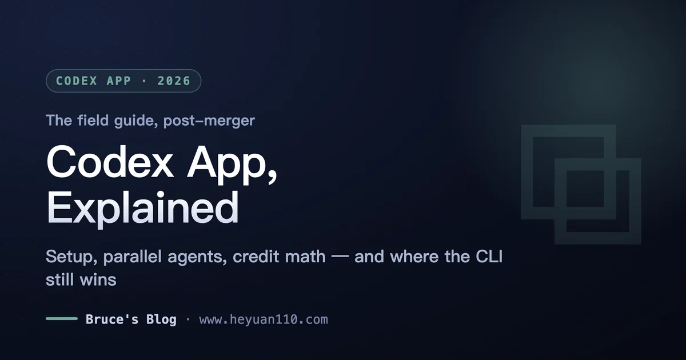
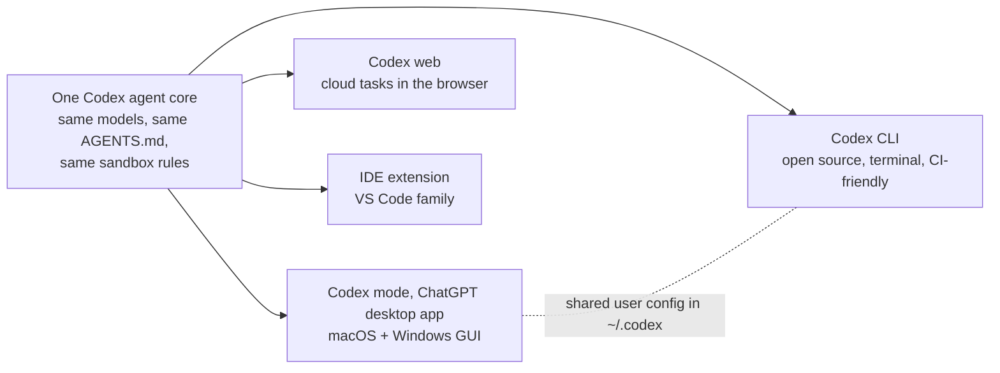
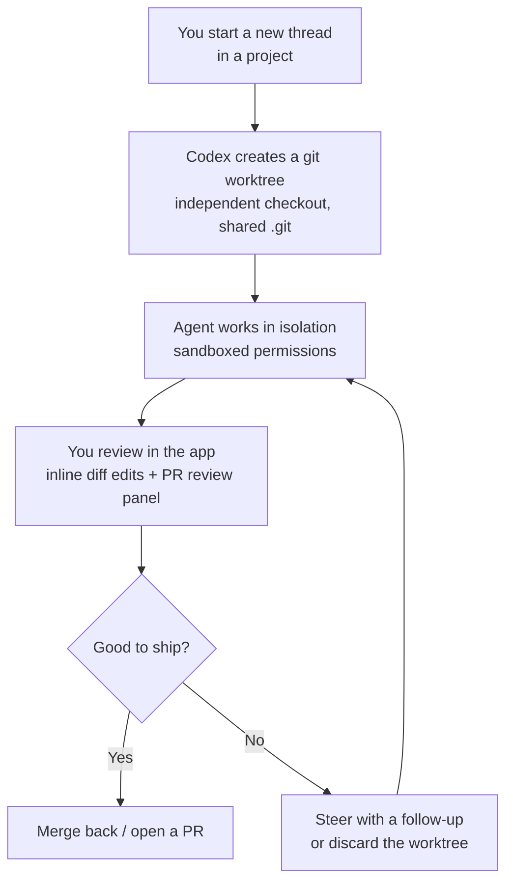

+++
date = '2026-07-12T10:00:00+08:00'
draft = false
title = 'Codex App Guide (2026): Setup, Workflows, and Real Pitfalls'
description = 'The Codex app now lives inside the ChatGPT desktop app. How to set it up, run parallel agents, decode the credit pricing, and when the CLI is the better tool.'
toc = true
tags = ['Codex', 'OpenAI', 'AI Coding Agents', 'Developer Tools']
keywords = ['codex app', 'openai codex app', 'codex desktop app', 'codex app vs cli', 'codex app pricing', 'is codex app free', 'codex app windows', 'chatgpt desktop app codex']

[[params.faqItems]]
question = "Is the Codex app still available after the ChatGPT merger?"
answer = "Yes. On July 9, 2026, the standalone Codex app merged into the new ChatGPT desktop app, where Codex lives on as a dedicated mode next to Chat and Work. Every feature carried over, plus new ones: inline diff editing, a PR review side panel, multi-repo projects, and faster computer use powered by GPT-5.6."

[[params.faqItems]]
question = "Is the Codex app free to use?"
answer = "Partially. As of July 2026, Codex is included in every ChatGPT plan — Free, Go ($8), Plus ($20), Pro ($100/$200), Business, and Enterprise. Free gets a small taste; Plus buys roughly 20-110 local agent messages per 5-hour window depending on model. When you hit the cap, you can buy extra credits instead of upgrading."

[[params.faqItems]]
question = "What is the difference between the Codex app and the Codex CLI?"
answer = "Same agent, different shells. Both run the same models, respect the same AGENTS.md, and share user-level config in ~/.codex. The app adds automatic git-worktree management, parallel thread orchestration, a review UI, and computer use; the CLI is open source, scriptable, works on Linux, and is the right tool for CI and automation."

[[params.faqItems]]
question = "Does the Codex app work on Linux?"
answer = "No. As of July 2026, the ChatGPT desktop app that hosts Codex ships only for macOS on Apple Silicon and for Windows. Linux users (and Intel Mac users) get the full agent through the open-source Codex CLI instead — same models, same limits, no GUI."

[[params.faqItems]]
question = "Should I use the Codex app or Claude Code?"
answer = "If you already pay for ChatGPT and want a GUI for parallel agents, the Codex app costs you nothing extra to try. If your workflow lives in the terminal, needs scripting, or is already built on Claude Code, there is no capability gap that justifies switching. Many developers run both: one subscription as the daily driver, the other as a second opinion."
+++

The **Codex app** is OpenAI's desktop command center for coding agents — and since July 9, 2026, it's no longer a standalone download but a dedicated Codex mode inside the new ChatGPT desktop app, sitting next to Chat and Work. It runs the same agent as the open-source Codex CLI, bills against your existing ChatGPT plan (every tier, including Free), and its specialty is running several agents in parallel, each in its own git worktree, while you review diffs instead of babysitting a terminal. If you already pay for ChatGPT, installing it costs you nothing but disk space, and it's the easiest on-ramp to agentic coding that exists right now.

That's the three-sentence answer. The rest of this guide is the long version: what the app actually is after the merger, how to set it up properly, the workflows that make it worth the screen real estate, what every plan really gets you, where it loses to the CLI and to Claude Code, and the pitfalls that are currently filling up Hacker News threads.

One thing before we start, so this page stays honest: I've lived in [Codex CLI](/posts/ai/2026-02-12-codex-cli-mastery-guide/) since February, but I have not run months of production work through the desktop app. Everything here is built from OpenAI's own docs and changelog, the launch and merger announcements, and a lot of community receipts — and where something is contested, I say so.

**Version anchor**: this guide describes the state of the Codex app as of **July 12, 2026** — three days after the ChatGPT desktop merger. Given that this product changed shape three times in six months, check the [official changelog](https://developers.openai.com/codex/changelog) if you're reading this from the future. I'll keep this page updated as the app evolves.

## What Is the Codex App in July 2026?

Start with the fact that confuses everyone this week: the Codex app didn't die on July 9 — it got promoted. OpenAI merged the standalone app into a rebuilt ChatGPT desktop app for macOS and Windows, where Codex is now one of three modes (Chat, Work, Codex). Your projects, threads, and settings carried over; existing Codex app installs simply updated into the new shell. The old ChatGPT desktop app was renamed "ChatGPT Classic" — more on why that name is a problem later.

> As of July 2026, the Codex app lives as a dedicated mode inside the ChatGPT desktop app (macOS Apple Silicon and Windows), is included in every ChatGPT plan including Free, and serves over 5 million weekly users — up from roughly 600,000 in January 2026, per OpenAI's own June 2 figures.

That growth curve is the reason this product deserves a pillar guide. OpenAI's numbers: 600K weekly users at the start of 2026, over 2 million by March, 4 million by April 21, past 5 million by June 2. Even more telling: about 20% of those users aren't developers, and the non-developer segment is growing three times faster. Andrew Ambrosino, who leads the Codex desktop team, said in a [July 5 interview](https://www.htx.com/news/why-did-codex-and-chatgpt-merge-whats-next-for-codex-openai-qWC9f4eM/) that marketing, finance, and legal teams kept adopting a tool built for engineers — which is exactly why OpenAI stopped shipping it as a developer-only product. The merger wasn't a demotion; it was OpenAI concluding that "the boundary between developer tools and general-purpose knowledge tools is collapsing."

It helps to see where the app sits in the Codex product family, because "Codex" is one agent wearing four different outfits:

The practical takeaway: nothing you learn in the app is wasted in the CLI, and vice versa. Both surfaces read the same `AGENTS.md`, share user-level configuration under `~/.codex`, and pull from the same plan limits. The app is not a different product with a different brain — it's a control room bolted onto the same engine, and that's precisely how you should use it.

## From Launch to Merger: Six Months of Whiplash

The Codex app's first half-year explains most of its current quirks, so here's the timeline in one table, straight from OpenAI's changelog and launch posts:

| Date (2026) | What happened |
|---|---|
| Feb 2 | [Codex app launches on macOS](https://openai.com/index/introducing-the-codex-app/) (v26.202): parallel agent threads, project sidebar, built-in review |
| Mar 4 | Windows version ships (v26.304), with a native Windows sandbox and PowerShell support |
| Apr 2 | Pricing switches from per-message to API-token-aligned credits |
| Apr 16 | ["Codex for almost everything"](https://openai.com/index/codex-for-almost-everything/) update: computer use, in-app browser built on Atlas, image generation |
| May 21 | v26.519: Goal mode goes GA, remote computer use, plugin marketplace sharing |
| Jul 9 | Codex app merges into the new ChatGPT desktop app as a dedicated mode; old ChatGPT app renamed "Classic" |

Read that sequence back and the product strategy is legible: launch as a developer tool, discover non-developers love it, add computer use and a browser so it can touch everything, then fold it into the consumer flagship. I covered the strategic fork this creates — OpenAI betting on the super-app while Anthropic bets on composable CLI primitives — in my [GPT-5.6 release analysis](/posts/ai/2026-07-10-gpt-5-6-general-availability/), and I won't re-litigate it here. What matters for this guide is the practical consequence: **the Codex app's roadmap now answers to a consumer product**, and developers evaluating it should price in some consumer-first decisions over the next few quarters.

## Installing and Setting Up the Codex App

**Requirements first, because they exclude people.** The ChatGPT desktop app runs on macOS with Apple Silicon (M1 or later — Intel Macs are out) and on Windows. There is no Linux build, and OpenAI has announced no plans for one. If you're on Linux, stop here and use the [Codex CLI](/posts/ai/2026-03-10-codex-cli-deep-dive/) — same agent, same plan limits, no GUI.

Setup is genuinely a five-minute affair:

1. **Download** the ChatGPT desktop app from [chatgpt.com](https://chatgpt.com/) (existing Codex app installs auto-update into it).
2. **Sign in with your ChatGPT account** — no API key needed. This is the single biggest onboarding difference from most agent tools: billing rides your existing subscription.
3. **Switch to Codex mode** and point it at a project folder. Codex treats each folder as a project, with threads organized underneath.
4. **Pick your permission posture** when prompted. Like the CLI, the app runs agents in a sandbox with bounded file and network access, and asks before escalating.
5. **Check your `AGENTS.md`.** If your repo already has one for the CLI, the app reads the same file. If not, write one — repo conventions, build commands, test commands — before you run anything serious.

Two configuration details worth knowing on day one. First, user-level settings live in `~/.codex/config.toml` and are shared across the app, CLI, and IDE extension — MCP servers you configured for the CLI show up in the app for trusted projects. Second, the app distinguishes **local environments** (agents work directly on your machine, in worktrees) from **cloud environments** (tasks run on OpenAI's infrastructure, like Codex web). Cloud tasks are how you fire off work from your phone and review it later, but note that they draw from the same usage window as local messages — a pitfall we'll get to.

## Core Codex App Workflows: Threads, Worktrees, Parallel Agents

Here's the mental model that makes the app click: **every thread is a workspace, not a chat.** When you start a new thread in a project, Codex quietly creates a git worktree for it — an independent checkout that shares the same `.git` metadata as your main repository. The agent works there, isolated from your working directory and from every other thread. You can have three agents refactoring, bug-fixing, and writing tests simultaneously without any of them stepping on your uncommitted changes.

This is, frankly, the app's killer feature — and it's worth naming why. Anyone who has tried to run parallel agents from the terminal knows the tax: manual `git worktree add`, one terminal tab per agent, and a cleanup ritual when you're done. The CLI still makes you do all of that yourself (community guides exist precisely because [the CLI lacks built-in worktree automation](https://www.frr.dev/posts/codex-cli-worktrees-manual-parallelism/)). The app does it silently, per thread, with cleanup handled when threads close. If parallel agent work is your goal, the app isn't a dumbed-down CLI — on this one axis it's ahead.

The workflow that follows from this: **stop watching agents work.** The intended loop is queue several threads, go do something that needs your brain, come back and review. The July 9 release sharpened the review half considerably — you can now edit diffs inline inside the app instead of round-tripping through your editor, and a PR review side panel brings the review-before-merge step into the same window. Reviewing three agents' diffs in sequence turns out to be a much better use of attention than watching one agent think in real time.

Beyond the core loop, three features distinguish the app from every other Codex surface:

**Computer use.** Since April, Codex agents can see your screen and operate any app with their own cursor — and since July 9, this runs on GPT-5.6 and is noticeably faster. Multiple agents can do this in parallel without hijacking your actual mouse. It's the feature with the highest wow-factor and the highest risk surface; scope it to the apps a task actually needs.

**The in-app browser.** Built on OpenAI's Atlas engine, it lets an agent iterate on frontend work — run the dev server, look at the page, fix the CSS, look again — without you alt-tabbing to verify. For frontend iteration loops, this quietly removes the most annoying human-in-the-loop step.

**Automations and Goal mode.** Scheduled tasks ("run the test suite triage every morning") and goal-directed longer runs went GA in May. This overlaps with what ChatGPT Work does for non-code tasks, and the boundary between them is genuinely blurry — a confusion OpenAI has earned, as the pitfalls section will show.

## Codex App Pricing: What Every Plan Actually Gets

The headline is friendlier than you'd expect: **Codex is included in every ChatGPT plan**, and since April 2, 2026, usage is metered in credits that map directly onto API token prices. Here's the plan lineup as of July 2026, per [OpenAI's pricing docs](https://developers.openai.com/codex/pricing):

| Plan | Price | Codex allowance (local messages / 5-hour window) |
|---|---|---|
| Free | $0 | Limited taste |
| Go | $8/mo | Light usage |
| Plus | $20/mo | ~20–110, depending on model |
| Pro | $100/mo | 5x Plus (~100–550) |
| Pro 20x | $200/mo | 20x Plus (~400–2,200) |
| Business | $25/user/mo | Plus-tier limits per seat |
| Enterprise/Edu | Custom | Credit-based, scales with contract |

The credit rates are where you should actually look, because they tell you which model to run. Per million tokens: **GPT-5.6 Sol costs 125 credits in / 750 out, Terra 62.5 / 375, and Luna 25 / 150**. Run the arithmetic against OpenAI's API prices ($5/$30, $2.50/$15, $1/$6) and every tier lands on the same exchange rate: **one credit ≈ 4 cents of API value**. That's a deliberately clean design — your subscription is effectively a prepaid API balance with a generous multiplier, and when you exhaust a 5-hour window, you can buy top-up credits instead of upgrading a tier.

The practical advice falls out of the table. Luna costs one-fifth of Sol per token, and for routine agent work — test fixes, small refactors, scripted chores — the quality gap rarely justifies a 5x burn rate. My suggested default: **Terra for daily driving, Luna for bulk chores, Sol reserved for the tasks you'd have escalated to a senior engineer.** This mirrors the tiered-model advice from my [GPT-5.6 pricing breakdown](/posts/ai/2026-07-10-gpt-5-6-general-availability/), where the benchmark gaps between tiers turned out smaller than the price gaps.

Two cost gotchas the pricing page won't shout about. Cloud tasks share the same 5-hour window as local messages — delegating to the cloud doesn't buy you extra capacity, just extra parallelism. And image generation burns your included limits "3–5x faster on average," per OpenAI's own docs, so a design-heavy session can eat a window surprisingly fast.

## Codex App vs Codex CLI vs Claude Code

This is the decision most readers came for, so let's do it properly. The app-versus-CLI question is easy because they're the same agent; the Codex-versus-Claude-Code question is a real fork, and I compared the underlying agents in depth in [Claude Code vs Codex](/posts/ai/2026-02-19-claude-code-vs-codex/) — here I'll focus on what the desktop app changes.

| | Codex app | Codex CLI | Claude Code |
|---|---|---|---|
| Form | GUI mode in ChatGPT desktop | Open-source terminal agent | Terminal agent + SDK |
| Platforms | macOS (Apple Silicon), Windows | macOS, Linux, Windows | macOS, Linux, Windows |
| Parallel agents | Built-in, automatic worktrees | Manual worktree setup | Manual worktrees / subagents |
| Review | Inline diff edits, PR panel | Terminal diffs | Terminal diffs |
| Computer use | Yes, parallel, GPT-5.6 | No | No (browser via MCP) |
| Scripting / CI | No | Yes — `codex exec`, least-privilege sandbox | Yes — SDK, hooks, headless mode |
| Billing | Any ChatGPT plan, incl. Free | Same plans, or API key | Claude Pro/Max, or API |
| Extensibility | Plugins, MCP, marketplace | MCP, AGENTS.md, open source | Skills, MCP, hooks, plugins |

My read, stated plainly:

**Choose the Codex app if** you already pay for any ChatGPT plan and you want parallel agents with a real review surface — or you're the kind of user who was never going to open a terminal. The marginal cost is zero, the worktree automation is genuinely best-in-class, and for reviewing multiple agents' output it beats every terminal workflow I know.

**Stay on the CLI if** your agent work feeds scripts, CI pipelines, or cron jobs. `codex exec` runs read-only by default and escalates permissions explicitly — exactly the posture you want for automation, and something the app simply doesn't do. The app also can't be driven programmatically. They share config, so "both" is a legitimate answer: CLI as the backbone, app as mission control.

**Claude Code holds its ground if** your workflow is already built on it. Nothing in the July 9 release creates a capability gap that justifies a migration — Claude Code's Skills/hooks/SDK ecosystem remains the deeper toolbox for engineers who script their agents, an argument I made at length in [CLI + Skills vs MCP](/posts/ai/2026-07-04-cli-skills-vs-mcp/). The honest asymmetry: OpenAI now offers the better *no-terminal* agent experience, Anthropic the better *terminal-native* one. Pick the side that matches where you live, and note that Anthropic's answer to the app — Claude Cowork, its desktop working-session product — is aimed at office workers, not at developers running parallel worktrees.

## Six Pitfalls That Bite New Codex App Users

Every one of these comes with a receipt — most from the [Hacker News thread on the merger](https://news.ycombinator.com/item?id=48849059), which is the most useful unfiltered field report available right now.

**1. Work mode and Codex mode look identical, and sometimes are.** The top complaint post-merger: toggling between Work and Codex produces no visible change for many tasks, and OpenAI hasn't clearly documented what differs. Practical rule until they fix the UX: repo work in Codex mode (you get worktrees and diff review), documents and spreadsheets in Work mode, and don't expect the toggle to change the model's brain.

**2. The merged app dropped ChatGPT features you may rely on.** Early merged builds are missing temporary chats, voice mode, Deep Research, and custom GPTs, and chat history is squeezed into a small popup. If those matter to you, keep "ChatGPT Classic" installed alongside — and yes, multiple HN commenters pointed out that naming an app "Classic" reads like a deprecation notice. Treat it as one.

**3. Codex writes to your filesystem in places you didn't ask for.** Users report the app auto-creating folders in `~/Documents`. Combine that with per-thread worktrees and you can accumulate surprising disk clutter; close finished threads so cleanup runs instead of leaving a dozen live worktrees behind.

**4. Cloud tasks and images drain the same meter as local work.** Both share your 5-hour window, and image generation burns it 3–5x faster. If you hit caps mysteriously early, check whether background cloud tasks or image calls are the culprit before blaming the model picker — and remember Sol burns five Lunas per token.

**5. Computer use is powerful and deserves paranoia.** An agent that can see your screen and click anything is a lateral-movement risk if a task ingests malicious content — security researchers flagged exactly this boundary question when the feature shipped in April. Grant it specific apps per task, never blanket access, and keep it away from password managers and banking tabs.

**6. IT management broke with the bundle ID change.** On macOS the app now ships as `com.openai.codex` instead of `com.openai.chatgpt`, which silently breaks MDM policies, allowlists, and automation scripts pinned to the old identifier. If you manage a fleet, update your policies before your users update their apps.

## The Bottom Line

The Codex app in July 2026 is an easy recommendation with a narrow shape: if you pay for ChatGPT at all, install it, point it at a real repo, and run two parallel threads through the review panel — that experience, not benchmarks, will tell you whether it fits your work. It's the best zero-marginal-cost entry into agentic coding on the market, and its worktree-per-thread design is something even terminal loyalists should steal.

But keep the roles straight. The app is a control room; the CLI is the engine you can script. The merger that made Codex a tab in a consumer super-app is great for its distribution and unproven for its developer roadmap — the feature gaps and mode confusion of the July 9 build are exactly what shipping a consumer pivot in a hurry looks like. Use the app for what it's uniquely good at today, keep your automation on the CLI, and check back on this page: this product has changed shape three times in six months, and I doubt it's done.

## Related Reading

- [Codex CLI Mastery Guide: 20+ Power Tips](/posts/ai/2026-02-12-codex-cli-mastery-guide/) — the terminal side of the same agent
- [Claude Code vs Codex: 8-Dimension Head-to-Head](/posts/ai/2026-02-19-claude-code-vs-codex/) — the deeper agent-vs-agent comparison
- [GPT-5.6 Release: Pricing, ChatGPT Work, and the Codex Merger](/posts/ai/2026-07-10-gpt-5-6-general-availability/) — the launch that reshaped this app
- [Codex CLI Deep Dive: Setup, Config, and Power User Tips](/posts/ai/2026-03-10-codex-cli-deep-dive/) — configuration reference that carries over to the app
- [MCP vs Skills: Why CLI + Skill Wins the Agent Toolchain](/posts/ai/2026-07-04-cli-skills-vs-mcp/) — why I still keep the backbone in the terminal
