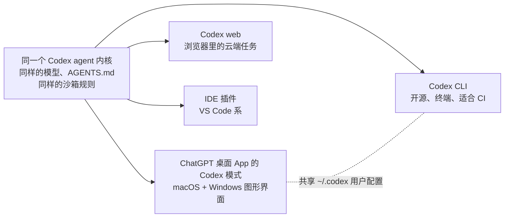
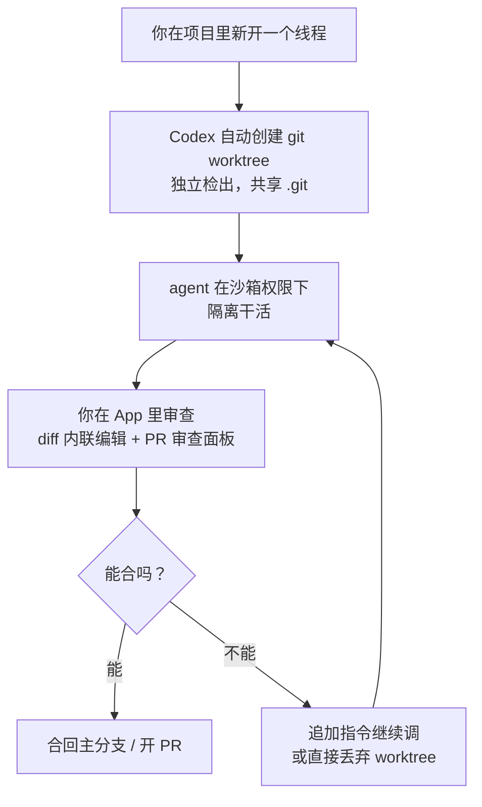

+++
date = '2026-07-12T10:00:00+08:00'
draft = false
title = 'Codex App 完全指南（2026）：安装、工作流与避坑手册'
description = 'Codex App 已并入 ChatGPT 桌面端，变成独立的 Codex 模式。本文讲清安装配置、并行 agent 工作流、credit 计费怎么算、和 CLI 及 Claude Code 怎么选，外加 6 个真实的坑。'
toc = true
tags = ['Codex', 'OpenAI', 'AI Coding Agents', 'Developer Tools']
keywords = ['Codex App', 'Codex 应用', 'Codex App 教程', 'Codex 桌面版', 'Codex App 怎么用', 'Codex App 收费', 'Codex App 和 CLI 区别', 'ChatGPT 桌面版 Codex']

[[params.faqItems]]
question = "ChatGPT 合并之后 Codex App 还能用吗？"
answer = "能用。2026 年 7 月 9 日独立的 Codex App 并入了全新的 ChatGPT 桌面 App，Codex 作为独立模式和 Chat、Work 并列存在。所有功能都保留了，还新增了 diff 内联编辑、PR 审查侧边栏、多仓库项目和基于 GPT-5.6 的更快 computer use。"

[[params.faqItems]]
question = "Codex App 免费吗？"
answer = "部分免费。截至 2026 年 7 月，Codex 包含在所有 ChatGPT 档位里——Free、Go（8 美元）、Plus（20 美元）、Pro（100/200 美元）、Business 和 Enterprise。免费档只能浅尝；Plus 每 5 小时窗口大约有 20-110 条本地 agent 消息（取决于模型）。用完可以单独买 credit，不必升级档位。"

[[params.faqItems]]
question = "Codex App 和 Codex CLI 有什么区别？"
answer = "同一个 agent，不同的壳。两者跑同样的模型、读同一份 AGENTS.md、共享 ~/.codex 下的用户级配置。App 多了自动 git worktree 管理、并行线程编排、审查界面和 computer use；CLI 开源、可脚本化、支持 Linux，做 CI 和自动化必须用它。"

[[params.faqItems]]
question = "Codex App 支持 Linux 吗？"
answer = "不支持。截至 2026 年 7 月，承载 Codex 的 ChatGPT 桌面 App 只有 macOS（Apple Silicon）和 Windows 版本。Linux 用户（以及 Intel Mac 用户）只能通过开源的 Codex CLI 使用完整 agent——模型和额度一样，只是没有图形界面。"

[[params.faqItems]]
question = "Codex App 和 Claude Code 该选哪个？"
answer = "已经在付费 ChatGPT 的用户可以零成本装 Codex App 体验并行 agent；工作流在终端里、需要脚本化、或者已经深度使用 Claude Code 的工程师，没有任何能力差距值得迁移。很多开发者两个都用：一个当主力，另一个当第二意见。"
+++

**Codex App** 是 OpenAI 给 coding agent 做的桌面指挥中心——从 2026 年 7 月 9 日起，它不再是独立下载的应用，而是并入了全新的 ChatGPT 桌面 App，以独立的 Codex 模式和 Chat、Work 并列。它跑的是和开源 Codex CLI 完全相同的 agent，计费走你现有的 ChatGPT 订阅（所有档位都含，包括免费档），看家本领是同时跑多个 agent——每个都在自己的 git worktree 里干活，你只管审查 diff，不用盯终端。只要你已经在给 ChatGPT 付费，装它的成本就只有一点磁盘空间，这是目前上手 agentic coding 门槛最低的一条路。

这就是三句话版本的答案。下面是完整版：合并之后这个 App 到底是什么、怎么装怎么配、哪些工作流值得为它腾出屏幕、每个档位实际能拿到多少额度、它在哪些地方输给 CLI 和 Claude Code，以及正在刷屏 Hacker News 的那些坑。

开头先把话说清楚，免得这页失真：我从 2 月起一直重度使用 [Codex CLI](/zh/posts/ai/2026-02-12-codex-cli-mastery-guide/)，但没有拿桌面 App 跑过几个月的生产任务。本文的依据是 OpenAI 官方文档和 changelog、发布与合并公告，以及大量社区一手反馈——有争议的地方我会明说。

**版本锚点**：本文描述的是 **2026 年 7 月 12 日**时点的 Codex App——ChatGPT 桌面合并后的第三天。这个产品半年内变了三次形态，如果你是之后读到这篇，先查一眼[官方 changelog](https://developers.openai.com/codex/changelog)。这一页我会持续更新。

## 2026 年 7 月，Codex App 到底是什么

先回答这周最让人迷惑的问题：7 月 9 日 Codex App 不是被砍了，而是升舱了。OpenAI 把独立 App 并进了重写的 ChatGPT 桌面 App（macOS + Windows），Codex 成为三种模式之一（Chat、Work、Codex）。项目、线程、设置全部原样迁移，旧的 Codex App 会自动更新成新壳。原来的 ChatGPT 桌面 App 改名叫 "ChatGPT Classic"——这个命名为什么是个问题，后面避坑一节再说。

> 截至 2026 年 7 月，Codex App 以独立模式存在于 ChatGPT 桌面 App 内（macOS Apple Silicon 和 Windows），包含在所有 ChatGPT 档位中（含免费档），周活用户超过 500 万——而 2026 年 1 月这个数字只有约 60 万（OpenAI 6 月 2 日官方数据）。

这条增长曲线就是这篇长文存在的理由。OpenAI 的官方数字：2026 年初 60 万周活，3 月破 200 万，4 月 21 日破 400 万，6 月 2 日破 500 万。更值得玩味的是：其中约 20% 的用户根本不是开发者，而且非开发者群体的增速是开发者的 3 倍。

Codex 桌面团队负责人 Andrew Ambrosino 在 [7 月 5 日的访谈](https://www.htx.com/news/why-did-codex-and-chatgpt-merge-whats-next-for-codex-openai-qWC9f4eM/)里说，市场、财务、法务团队一直在自发采用这个为工程师设计的工具——这正是 OpenAI 不再把它当纯开发者产品发售的原因。合并不是降级，而是 OpenAI 认定"开发者工具和通用知识工具的边界正在坍塌"。

要理解这个 App 的位置，得先看清 Codex 的产品家族——"Codex"是一个 agent 穿了四套衣服：

实用结论：你在 App 里学到的东西在 CLI 里一点不浪费，反过来也一样。两个入口读同一份 `AGENTS.md`、共享 `~/.codex` 下的用户级配置、消耗同一份订阅额度。App 不是一个换了脑子的新产品——它是焊在同一台引擎上的驾驶舱，用法也应该照这个定位来。

## 从发布到合并：六个月三次变身

Codex App 的前半年解释了它现在的大部分怪癖。时间线一张表说完，全部来自 OpenAI 的 changelog 和官方公告：

| 日期（2026） | 发生了什么 |
|---|---|
| 2 月 2 日 | [Codex App 登陆 macOS](https://openai.com/index/introducing-the-codex-app/)（v26.202）：并行 agent 线程、项目侧边栏、内置审查 |
| 3 月 4 日 | Windows 版上线（v26.304），带原生 Windows 沙箱和 PowerShell 支持 |
| 4 月 2 日 | 计费从按消息数改为对齐 API token 的 credit 制 |
| 4 月 16 日 | [“Codex for almost everything”](https://openai.com/index/codex-for-almost-everything/)更新：computer use、基于 Atlas 的内置浏览器、图片生成 |
| 5 月 21 日 | v26.519：Goal 模式转正、远程 computer use、插件市场共享 |
| 7 月 9 日 | Codex App 并入全新 ChatGPT 桌面 App 成为独立模式；旧 ChatGPT App 改名 "Classic" |

把这串日期倒着读一遍，产品策略一目了然：先按开发者工具发布，发现非开发者蜂拥而至，于是加上 computer use 和浏览器让它什么都能碰，最后并进消费级旗舰。这次合并造成的战略分岔——OpenAI 押注超级 App，Anthropic 押注可组合的 CLI 原语——我在 [GPT-5.6 发布解读](/zh/posts/ai/2026-07-10-gpt-5-6-general-availability/)里已经写透了，这里不再重复。对本文重要的是那个现实后果：**Codex App 的路线图现在向一个消费级产品汇报**，评估它的工程师应该把"未来几个季度会有消费者优先的决策"计入价格。

## Codex App 安装与配置

**先说硬件门槛，因为它会直接排除一批人。** ChatGPT 桌面 App 只支持 Apple Silicon 的 macOS（M1 及以后，Intel Mac 出局）和 Windows。没有 Linux 版，OpenAI 也没宣布过任何计划。Linux 用户就此打住，直接去用 [Codex CLI](/zh/posts/ai/2026-03-10-codex-cli-deep-dive/)——同一个 agent、同样的额度，只是没有图形界面。

安装本身是真·五分钟工程：

1. **下载** ChatGPT 桌面 App（[chatgpt.com](https://chatgpt.com/)；已装 Codex App 的会自动更新进新壳）。
2. **用 ChatGPT 账号登录**——不需要 API key。这是它和大多数 agent 工具最大的上手差异：计费直接挂在你现有的订阅上。
3. **切到 Codex 模式**，指向一个项目文件夹。Codex 把每个文件夹当作一个项目，线程挂在项目下面。
4. **选权限姿势**。和 CLI 一样，App 里的 agent 跑在文件与网络访问受限的沙箱里，要提权会先问你。
5. **检查 `AGENTS.md`**。如果仓库里已经有给 CLI 写的那份，App 读的就是它；没有的话，先把仓库约定、构建命令、测试命令写进去，再跑正经任务。

第一天就值得知道的两个配置细节。其一，用户级设置在 `~/.codex/config.toml`，App、CLI、IDE 插件三方共享——你给 CLI 配的 MCP server，在受信任的项目里 App 直接能用。其二，App 区分**本地环境**（agent 在你机器上的 worktree 里干活）和**云端环境**（任务跑在 OpenAI 的基础设施上，等价于 Codex web）。云端任务让你可以在手机上派活、回来再审，但注意它和本地消息消耗同一个额度窗口——这是后面要展开的坑。

## 核心工作流：线程、worktree 与并行 agent

让这个 App 真正"开窍"的心智模型是一句话：**每个线程是一个工作区，不是一段聊天**。你在项目里新开一个线程，Codex 就悄悄为它建一个 git worktree——一份独立的检出，和主仓库共享 `.git` 元数据。agent 在里面干活，既不碰你的工作目录，也不碰其他线程。你可以让三个 agent 同时做重构、修 bug、补测试，谁也踩不到你未提交的改动。

说实话，这就是这个 App 的杀手级功能，值得点明为什么。在终端里跑过并行 agent 的人都知道那笔税：手动 `git worktree add`、一个 agent 一个终端标签页、收工还有一套清理仪式。CLI 至今要你自己做这些（社区教程之所以存在，正是因为 [CLI 没有内置 worktree 自动化](https://www.frr.dev/posts/codex-cli-worktrees-manual-parallelism/)）。App 把这一切静默做掉，一线程一 worktree，线程关闭自动清理。如果你的目标就是并行 agent，App 不是阉割版 CLI——在这一条轴上它反而领先。

由此推出的工作流是：**别再盯着 agent 干活**。设计意图是排几个线程的活、去干需要你脑子的事、回来集中审查。7 月 9 日的版本把"审查"这一半磨得更利了——diff 可以直接在 App 里内联编辑，不用绕回编辑器；PR 审查侧边栏把合并前的审查也收进同一个窗口。轮流审三个 agent 的 diff，比实时看一个 agent 思考，是好用得多的注意力分配方式。

核心循环之外，有三个功能把 App 和其他 Codex 入口区分开：

**Computer use。** 4 月起 Codex agent 能看到你的屏幕、用自己的光标操作任意应用——7 月 9 日后跑在 GPT-5.6 上，明显更快。多个 agent 可以并行操作而不劫持你真正的鼠标。这是"哇"感最强、风险面也最大的功能；每个任务只授权它真正需要的应用。

**内置浏览器。** 基于 OpenAI 的 Atlas 引擎，让 agent 自己完成前端迭代循环——起 dev server、看页面、改 CSS、再看——不需要你切窗口帮它确认。对前端调样式这类活，它悄悄干掉了最烦人的人肉环节。

**自动化与 Goal 模式。** 定时任务（"每天早上跑一遍测试分诊"）和目标导向的长任务 5 月转正。这块和 ChatGPT Work 处理非代码任务的能力高度重叠，两者边界确实模糊——这个混乱是 OpenAI 自己挣来的，避坑一节有实锤。

## Codex App 计费：每个档位实际拿到什么

结论比你预期的友好：**所有 ChatGPT 档位都含 Codex**，而且 2026 年 4 月 2 日起用量按 credit 计，直接对齐 API token 价格。截至 2026 年 7 月的档位表，来自 [OpenAI 官方计费文档](https://developers.openai.com/codex/pricing)：

| 档位 | 价格 | Codex 额度（本地消息数 / 5 小时窗口） |
|---|---|---|
| Free | $0 | 浅尝级 |
| Go | $8/月 | 轻度使用 |
| Plus | $20/月 | 约 20–110 条，取决于模型 |
| Pro | $100/月 | Plus 的 5 倍（约 100–550） |
| Pro 20x | $200/月 | Plus 的 20 倍（约 400–2200） |
| Business | $25/人/月 | 每席位 Plus 级额度 |
| Enterprise/Edu | 定制 | 按 credit 计，随合同扩展 |

真正该盯的是 credit 费率表，它直接告诉你日常该跑哪个模型。每百万 token：**GPT-5.6 Sol 输入 125 / 输出 750 credit，Terra 62.5 / 375，Luna 25 / 150**。拿 OpenAI 的 API 价格（$5/$30、$2.50/$15、$1/$6）一除，每一档都落在同一个汇率上：**1 credit ≈ 4 美分的 API 价值**。这是刻意设计的整齐——你的订阅本质上是一笔带高倍率的预付 API 余额，5 小时窗口用完可以单独充 credit，不用升档。

实操建议从表里自然长出来。Luna 每 token 的开销只有 Sol 的五分之一，而修测试、小重构、脚本杂活这类日常任务，质量差距很少配得上 5 倍的烧钱速度。我的默认建议：**Terra 当日常主力，杂活批量跑 Luna，Sol 留给那些你本来会升级给资深工程师的任务**。这和我在 [GPT-5.6 定价拆解](/zh/posts/ai/2026-07-10-gpt-5-6-general-availability/)里的分层用模型思路一脉相承——各档位的基准分差比价格差小得多。

计费页不会大声说的两个坑。云端任务和本地消息共享同一个 5 小时窗口——把活派到云端买不来额外容量，只买来额外并行度。图片生成消耗额度的速度"平均快 3–5 倍"（OpenAI 自己文档的原话），一场设计密集的会话能快得离谱地吃掉一个窗口。

## Codex App vs Codex CLI vs Claude Code

多数读者是为这一节来的，那就认真做。App 对 CLI 的问题很简单，因为它们是同一个 agent；Codex 对 Claude Code 才是真分岔——底层 agent 的深度对比我写过[Claude Code vs Codex](/zh/posts/ai/2026-02-19-claude-code-vs-codex/)，这里只聚焦桌面 App 改变了什么。

| | Codex App | Codex CLI | Claude Code |
|---|---|---|---|
| 形态 | ChatGPT 桌面里的 GUI 模式 | 开源终端 agent | 终端 agent + SDK |
| 平台 | macOS（Apple Silicon）、Windows | macOS、Linux、Windows | macOS、Linux、Windows |
| 并行 agent | 内置，自动 worktree | 手动配 worktree | 手动 worktree / 子 agent |
| 审查 | diff 内联编辑、PR 面板 | 终端 diff | 终端 diff |
| Computer use | 有，可并行，GPT-5.6 | 无 | 无（浏览器走 MCP） |
| 脚本化 / CI | 不行 | 行——`codex exec`，最小权限沙箱 | 行——SDK、hooks、headless |
| 计费 | 任意 ChatGPT 档位，含免费 | 同档位，或 API key | Claude Pro/Max，或 API |
| 扩展性 | 插件、MCP、市场 | MCP、AGENTS.md、开源 | Skills、MCP、hooks、插件 |

我的判断，直说：

**选 Codex App**，如果你已经在付任意一档 ChatGPT，想要带真正审查界面的并行 agent——或者你本来就不打算打开终端。边际成本为零，worktree 自动化是同类最佳，论"轮审多个 agent 的产出"，它胜过我知道的所有终端方案。

**留在 CLI**，如果你的 agent 要接脚本、CI 流水线或定时任务。`codex exec` 默认只读、显式提权——这正是自动化该有的权限姿势，而 App 根本做不到，也没法被程序驱动。两者共享配置，所以"都用"是正经答案：CLI 当骨干，App 当指挥室。

**Claude Code 阵地不动**，如果你的工作流已经建在它上面。7 月 9 日的发布没有造出任何值得迁移的能力差距——对会给 agent 写脚本的工程师，Claude Code 的 Skills/hooks/SDK 生态依然是更深的工具箱，这个论证我在 [CLI + Skills vs MCP](/zh/posts/ai/2026-07-04-cli-skills-vs-mcp/) 里展开过。诚实的不对称是：OpenAI 现在提供更好的**免终端** agent 体验，Anthropic 提供更好的**终端原生**体验。按你住在哪边选边。另外 Anthropic 对标 App 的答案是 Claude Cowork——那是给办公室白领的桌面工作台，不是给跑并行 worktree 的开发者的。

## 新用户最容易踩的 6 个坑

每一条都有出处——大部分来自[合并当天的 Hacker News 讨论帖](https://news.ycombinator.com/item?id=48849059)，那是目前最有价值的无滤镜战地报告。

**1. Work 模式和 Codex 模式看起来一样，有时确实一样。** 合并后的头号吐槽：在 Work 和 Codex 之间来回切换，很多任务下界面毫无变化，OpenAI 也没讲清楚差异在哪。在他们修好 UX 之前的实用规则：仓库相关的活走 Codex 模式（有 worktree 和 diff 审查），文档表格走 Work 模式，别指望切换按钮会换模型的脑子。

**2. 合并版丢了一批你可能依赖的 ChatGPT 功能。** 早期合并构建缺失临时聊天、语音模式、Deep Research 和自定义 GPTs，聊天历史被塞进一个只显示三四条的小弹窗。如果这些对你重要，把 "ChatGPT Classic" 留着并行用——对，多位 HN 网友指出，把应用命名为 "Classic" 读起来就像一张弃用通告。就当它是吧。

**3. Codex 会在你没让它写的地方写文件系统。** 有用户报告 App 自动在 `~/Documents` 里建文件夹。再叠加一线程一 worktree 的机制，磁盘杂物能积累得超出想象；干完的线程及时关掉让清理跑起来，别留十几个活 worktree 过夜。

**4. 云端任务和图片生成消耗的是同一个表。** 两者都吃你的 5 小时窗口，图片生成还烧得快 3–5 倍。如果额度莫名其妙提前见底，先查后台云任务和图片调用，再去怪模型选择器——另外记住，Sol 每 token 烧五个 Luna。

**5. Computer use 很强，值得你保持被害妄想。** 一个能看你屏幕、点任何东西的 agent，一旦任务里混入恶意内容就是横向移动的风险面——4 月该功能上线时安全研究者就点名过这条边界。按任务授权具体应用，永远不给全局授权，让它离密码管理器和网银标签页远一点。

**6. Bundle ID 变了，企业 IT 管理会静默失效。** macOS 上应用标识从 `com.openai.chatgpt` 换成了 `com.openai.codex`，钉在旧标识上的 MDM 策略、白名单、自动化脚本会悄无声息地失效。管理设备队伍的人，先更新策略，再让用户更新应用。

## 一句话结论

2026 年 7 月的 Codex App 是一个"好推荐但形状很窄"的东西：只要你在给 ChatGPT 付费，就装上、指向一个真实仓库、开两个并行线程走一遍审查面板——是这段体验（而不是基准分）告诉你它合不合适。它是市面上边际成本为零的最佳 agentic coding 入口，一线程一 worktree 的设计连终端死忠都该抄走。

但角色要摆正。App 是驾驶舱，CLI 才是你能脚本化的引擎。把 Codex 变成消费级超级 App 里一个标签页的这次合并，对它的分发是利好，对它的开发者路线图是未知数——7 月 9 日构建里的功能缺失和模式混乱，恰恰是仓促执行消费化转向的样子。用 App 干它今天独一档的事，把自动化留在 CLI 上，然后常回这页看看：这个产品六个月变了三次形态，我不信它变完了。

## 相关阅读

- [Codex CLI 精通指南：20+ 实战技巧](/zh/posts/ai/2026-02-12-codex-cli-mastery-guide/) —— 同一个 agent 的终端侧
- [Claude Code vs Codex：8 维度硬碰硬](/zh/posts/ai/2026-02-19-claude-code-vs-codex/) —— 更深入的 agent 对 agent 比较
- [GPT-5.6 发布：定价、ChatGPT Work 与 Codex 合并](/zh/posts/ai/2026-07-10-gpt-5-6-general-availability/) —— 重塑这个 App 的那次发布
- [Codex CLI 深度解析：安装、配置与高阶技巧](/zh/posts/ai/2026-03-10-codex-cli-deep-dive/) —— 配置参考，App 同样适用
- [MCP vs Skills：为什么 CLI + Skill 赢下 agent 工具链](/zh/posts/ai/2026-07-04-cli-skills-vs-mcp/) —— 我坚持把骨干放在终端的理由
